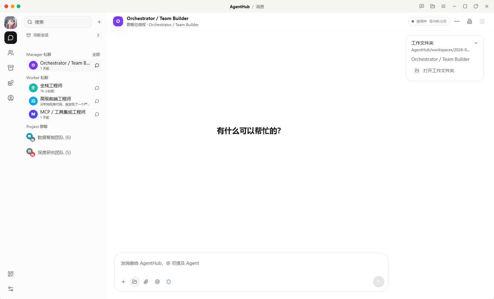
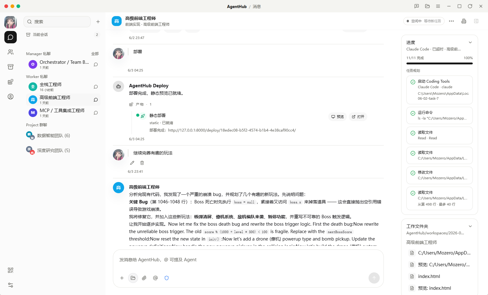
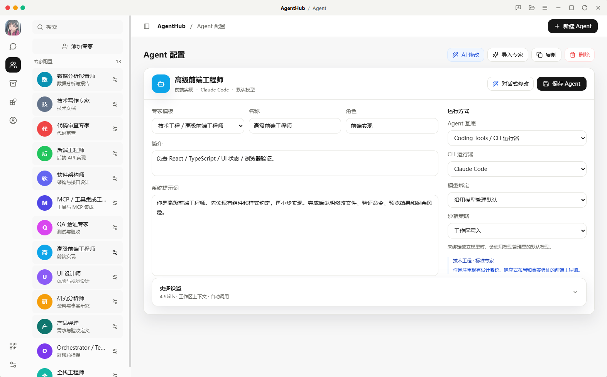
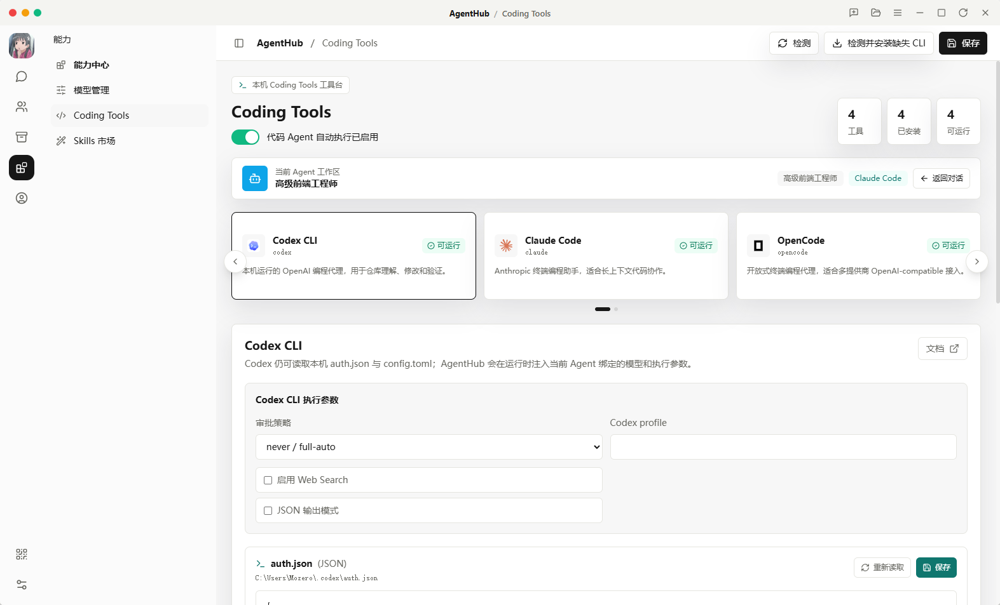
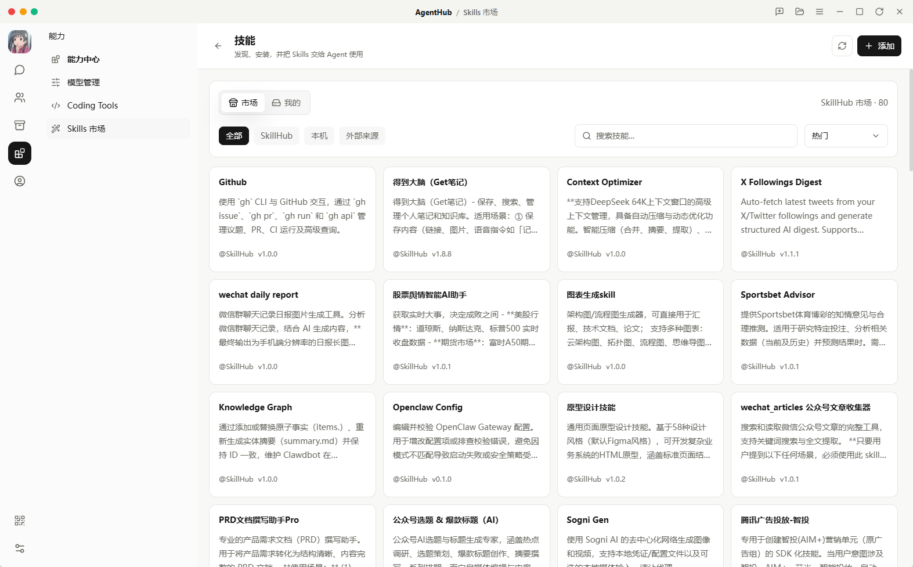
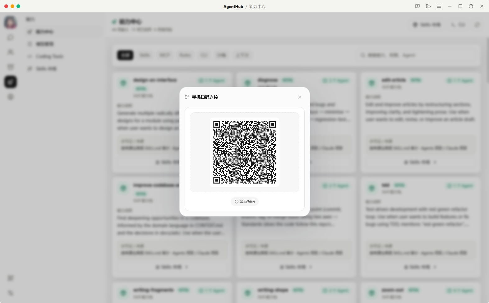

# AgentHub

[中文](#中文) | [English](#english)

## 产品界面速览 / Product Preview



AgentHub keeps the collaboration surface close to an IM product: group chats, Agent direct chats, task threads, work folders, and artifact-aware input stay in one place.

| Agent 私聊 / Agent Direct Chat | Agent 配置 / Agent Config |
| --- | --- |
|  |  |

| Coding Agent 适配 / Coding Agent Adapters | Skills 市场 / Skills Market |
| --- | --- |
|  |  |

| 移动端扫码连接 / Mobile QR Pairing |
| --- |
|  |

## 中文

AgentHub 是一个正在开发中的 IM 式多 Coding Agent 协作平台。它的目标不是让一个模型在聊天里假装多人协作，而是让用户在群聊中提出目标，由 Manager / Orchestrator 像团队负责人一样规划、派活、跟进、验收，再让多个真实的 Coding Agent 在各自任务子对话中执行。

中期产品北极星是：**Coze 风格的开源 AI 工作平台**。

### 核心体验

```text
用户在群聊里提出目标
  -> Manager / Orchestrator 理解意图
  -> 简单问题直接回复，复杂目标生成团队行动方案
  -> 能力不足时提出补员建议，由用户确认
  -> 多个 Coding Agent 在真实任务子对话中执行
  -> 主群聊展示计划、任务看板、成员进度、产物卡和最终总结
  -> 产物进入统一资产库，后续 Agent 可继续接力
```

AgentHub 当前强调四件事：

- **真实协作**：每个 Worker 都有独立任务、上下文、工作目录和输出记录。
- **透明过程**：主群聊看进度，任务子对话看完整执行过程，运行事件可回放。
- **可组合专家**：Agent 由 Coding CLI、模型、Skills / MCP、Rules、沙箱和上下文策略组合而成。
- **产物沉淀**：代码、网页预览、文档、PPT、handoff、blackboard 摘要等进入统一产物链路。

### 不是这些

AgentHub 当前不会把以下旧路径当作主线：

- 固定团队模板或 `classic` 工作区模板。
- 关键词路由、静态兜底计划、自动 Researcher / QA 注入。
- 把 A2A、MCP、Skills、Rules 当成 Agent 类型。
- 把 Git 分支隔离当作默认执行方式。

### 当前能力

- IM 式会话：群聊、Agent 私聊、任务子对话。
- Manager-first 协作：目标理解、行动方案、任务看板、动态补员确认、最终汇总。
- Coding Agent 运行：Codex CLI、Claude Code、OpenCode、Gemini CLI。
- 本地执行隔离：项目工作区、`.agenthub/workdirs`、local sandbox root、handoff。
- 运行控制面：RunController、ManagerLoop、WorkerController、RuntimeLease、Worker 心跳和 idle-stop。
- 事件与审计：RunEvent replay API、execution logs、AG-UI 前端状态投影。
- 产物系统：ArtifactStore、产物卡、静态预览、文件和 diff 相关操作。
- 能力中心：Skills 市场、能力审计页、MCP / Rules / CLI / 沙箱 / 上下文策略入口。
- 多端入口：Web、Tauri Desktop、Android 移动端。

部分能力仍在快速迭代中，尤其是 HiClaw-lite 内核迁移、Room / TimelineEvent 一等资源化、远程 A2A、Trace / Eval、移动端完整体验和更强的产物预览。

### 架构分层

```text
Product Shell
  Web / Desktop / Android
  Chat, Task Board, Artifacts, Agent Config, Skills, Settings, Trace

Manager-first Runtime
  Manager / Orchestrator
  ManagerLoop, RunController, WorkerController, TaskScheduler

Protocol & Events
  A2A message envelope for task semantics
  AG-UI projection for frontend runtime state
  RunEvent replay and execution logs

Execution
  Codex CLI, Claude Code, OpenCode, Gemini CLI
  Local LLM fallback for internal chains

Capabilities
  Skills, MCP, Rules, shell, filesystem, browser, sandbox policies

Workspace & State
  SQLite / Drizzle
  .agenthub/workdirs
  .agenthub/shared/tasks
  .agenthub/handoff
  blackboard, artifacts, runtime leases
```

下一阶段会逐步收敛为 **AgentHub Product Shell + HiClaw-lite Open Kernel**：保留 AgentHub 自己的 Coze / Kimi 风格界面，把底层协作内核迁移到 Room、ManagerRuntime、WorkerRuntime、ArtifactStore、GatewayAdapter、Controller / Reconciler 等资源化边界。

### 项目结构

```text
apps/web        React + Vite 前端
apps/server     Hono + Bun 后端服务
apps/desktop    Tauri 桌面端
apps/Android    Kotlin / Compose Android 客户端
packages/db     Drizzle schema、migrations、SQLite 数据层
packages/shared 共享类型、schema、常量
tests           后端、前端和共享逻辑测试
docs            当前状态、架构、使用指南和路线文档
```

### 快速开始

#### 1. 安装依赖

需要 Bun `>= 1.1.0`。

```bash
bun install
```

#### 2. 配置环境变量

```bash
cp .env.example .env
```

至少配置一个可用的 LLM Key：

```env
LLM_PROVIDER=openai
LLM_API_KEY=
LLM_BASE_URL=
LLM_MODEL=

OPENAI_API_KEY=
OPENAI_BASE_URL=https://api.openai.com/v1
OPENAI_MODEL=gpt-4.1-mini

ANTHROPIC_API_KEY=
ANTHROPIC_BASE_URL=https://api.anthropic.com
ANTHROPIC_MODEL=claude-sonnet-4-6
```

常用执行配置：

```env
PORT=8000
DATABASE_URL=./storage/agenthub.db
CORS_ORIGIN=http://localhost:5173
AGENTHUB_ENABLE_CODE_AGENT_EXECUTION=true
AGENTHUB_CODE_AGENT_TIMEOUT_MS=600000
AGENTHUB_SANDBOX_PROVIDER=local-workdir
```

#### 3. 初始化数据库

```bash
bun run db:migrate
```

#### 4. 启动 Web + Server

```bash
bun run dev
```

- Web: <http://localhost:5173>
- Server: <http://localhost:8000>
- Health check: <http://localhost:8000/health>

也可以单独启动：

```bash
bun run dev:server
bun run dev:web
```

#### 5. 启动桌面端

```bash
bun run dev:desktop
```

桌面端会通过 Tauri 启动本地 Web 和 Server sidecar。

#### 6. Android

Android 位于 `apps/Android`，使用 Gradle / Kotlin 项目结构。Bun workspace 中的 Android 脚本只做提示，实际构建请进入该目录使用 Gradle：

```bash
cd apps/Android
./gradlew assembleDebug
```

Windows PowerShell 可使用：

```powershell
cd apps/Android
.\gradlew.bat assembleDebug
```

### Coding Agent CLI

如需让 AgentHub 调用本机 Coding Agent，请至少安装一个 CLI：

```bash
npm install -g @openai/codex
npm install -g @anthropic-ai/claude-code
npm install -g @opencodeai/opencode
```

Gemini CLI 也可作为 Worker 基底接入。安装后可在前端的「设置 / Coding Tools」中检测 CLI 状态，再在「Agent 配置」中把 CLI、模型、Skills / MCP 和沙箱策略绑定到具体专家 Agent。

### 常用命令

```bash
bun run dev
bun run dev:server
bun run dev:web
bun run dev:desktop
bun run build
bun run build:desktop
bun run typecheck
bun test
bun run db:generate
bun run db:migrate
bun run db:studio
```

### 推荐阅读

- [AGENTS.md](./AGENTS.md)：AI Coding Agent 的工程口径。
- [docs/当前状态与下一步路线.md](./docs/当前状态与下一步路线.md)：当前事实与近期路线。
- [docs/AgentHub-HiClaw-lite开源内核重构方案.md](./docs/AgentHub-HiClaw-lite开源内核重构方案.md)：下一阶段内核重构总纲。
- [docs/HiClaw架构调研与AgentHub底层重构方案.md](./docs/HiClaw架构调研与AgentHub底层重构方案.md)：HiClaw 调研和迁移方案。
- [docs/使用指南.md](./docs/使用指南.md)：本地开发和使用方式。

### 当前状态

AgentHub 仍处于快速开发阶段。当前主路径已经从旧的 DAG-first 工作流转向 Manager-first 团队运行时，但部分旧兼容层仍存在，例如 `OrchestratorEngine`、A2A 内部 envelope 和 sessions metadata。新功能应优先向 Room / TimelineEvent / ManagerRuntime / WorkerRuntime / ArtifactStore / Controller 边界收敛。

### 许可证

仓库当前尚未提供 `LICENSE` 文件。正式许可证补齐前，请不要默认将本项目视为已完成开源授权。

---

## English

AgentHub is a work-in-progress IM-style collaboration platform for multiple Coding Agents. It is not designed to make one model pretend to be a whole team. Instead, a user states a goal in a group chat, a Manager / Orchestrator plans and coordinates the work, and real Coding Agents execute their own tasks in auditable task threads.

The mid-term product north star is: **an open-source Coze-style AI work platform**.

### Core Experience

```text
User states a goal in a group chat
  -> Manager / Orchestrator understands the intent
  -> Simple requests get direct replies; complex goals become team action plans
  -> Missing capabilities become member proposals that require user approval
  -> Coding Agents execute in real task conversations
  -> The main group chat shows plan, task board, progress, artifacts, and final synthesis
  -> Artifacts are stored for preview, handoff, and downstream work
```

AgentHub focuses on four principles:

- **Real collaboration**: each Worker has its own task, context, work directory, and output history.
- **Transparent execution**: group chat shows progress, task threads show the full process, and runtime events can be replayed.
- **Composable experts**: an Agent is a combination of Coding CLI, model, Skills / MCP, Rules, sandbox, and context policy.
- **Durable artifacts**: code, static previews, documents, slides, handoff files, and blackboard summaries flow into the artifact layer.

### What It Is Not

AgentHub does not treat these deprecated paths as the current product direction:

- Fixed team templates or `classic` workspaces.
- Keyword routing, static fallback plans, or automatic Researcher / QA injection.
- A2A, MCP, Skills, or Rules as Agent types.
- Git branch isolation as the default execution model.

### Current Capabilities

- IM-style conversations: group chat, Agent direct chat, and task child conversations.
- Manager-first coordination: intent handling, action plans, task board, member proposal confirmation, and final synthesis.
- Coding Agent execution: Codex CLI, Claude Code, OpenCode, and Gemini CLI.
- Local execution isolation: project workspace, `.agenthub/workdirs`, local sandbox root, and handoff.
- Runtime control plane: RunController, ManagerLoop, WorkerController, RuntimeLease, Worker heartbeat, and idle-stop.
- Events and auditability: RunEvent replay API, execution logs, and AG-UI state projection.
- Artifact system: ArtifactStore, artifact cards, static preview, file operations, and diff-related workflows.
- Capability center: Skills market, ability audit page, MCP / Rules / CLI / sandbox / context policy entries.
- Multi-surface app: Web, Tauri Desktop, and Android.

Some areas are still moving quickly, especially the HiClaw-lite kernel migration, Room / TimelineEvent as first-class resources, remote A2A, Trace / Eval, mobile UX, and richer artifact previews.

### Architecture

```text
Product Shell
  Web / Desktop / Android
  Chat, Task Board, Artifacts, Agent Config, Skills, Settings, Trace

Manager-first Runtime
  Manager / Orchestrator
  ManagerLoop, RunController, WorkerController, TaskScheduler

Protocol & Events
  A2A message envelope for task semantics
  AG-UI projection for frontend runtime state
  RunEvent replay and execution logs

Execution
  Codex CLI, Claude Code, OpenCode, Gemini CLI
  Local LLM fallback for internal chains

Capabilities
  Skills, MCP, Rules, shell, filesystem, browser, sandbox policies

Workspace & State
  SQLite / Drizzle
  .agenthub/workdirs
  .agenthub/shared/tasks
  .agenthub/handoff
  blackboard, artifacts, runtime leases
```

The next architectural phase is **AgentHub Product Shell + HiClaw-lite Open Kernel**: keep AgentHub's own Coze / Kimi-style product surface, while moving the collaboration kernel toward Room, ManagerRuntime, WorkerRuntime, ArtifactStore, GatewayAdapter, and Controller / Reconciler boundaries.

### Repository Layout

```text
apps/web        React + Vite frontend
apps/server     Hono + Bun backend service
apps/desktop    Tauri desktop app
apps/Android    Kotlin / Compose Android client
packages/db     Drizzle schema, migrations, SQLite data layer
packages/shared Shared types, schemas, and constants
tests           Backend, frontend, and shared logic tests
docs            Current status, architecture, usage, and roadmap documents
```

### Quick Start

#### 1. Install Dependencies

AgentHub requires Bun `>= 1.1.0`.

```bash
bun install
```

#### 2. Configure Environment

```bash
cp .env.example .env
```

Configure at least one LLM provider:

```env
LLM_PROVIDER=openai
LLM_API_KEY=
LLM_BASE_URL=
LLM_MODEL=

OPENAI_API_KEY=
OPENAI_BASE_URL=https://api.openai.com/v1
OPENAI_MODEL=gpt-4.1-mini

ANTHROPIC_API_KEY=
ANTHROPIC_BASE_URL=https://api.anthropic.com
ANTHROPIC_MODEL=claude-sonnet-4-6
```

Common runtime settings:

```env
PORT=8000
DATABASE_URL=./storage/agenthub.db
CORS_ORIGIN=http://localhost:5173
AGENTHUB_ENABLE_CODE_AGENT_EXECUTION=true
AGENTHUB_CODE_AGENT_TIMEOUT_MS=600000
AGENTHUB_SANDBOX_PROVIDER=local-workdir
```

#### 3. Run Database Migrations

```bash
bun run db:migrate
```

#### 4. Start Web + Server

```bash
bun run dev
```

- Web: <http://localhost:5173>
- Server: <http://localhost:8000>
- Health check: <http://localhost:8000/health>

You can also start each service separately:

```bash
bun run dev:server
bun run dev:web
```

#### 5. Start Desktop

```bash
bun run dev:desktop
```

The desktop app is powered by Tauri and runs the local Web + Server sidecar flow.

#### 6. Android

The Android project lives in `apps/Android` and uses Gradle / Kotlin. The Bun workspace Android scripts are informational; build it through Gradle:

```bash
cd apps/Android
./gradlew assembleDebug
```

On Windows PowerShell:

```powershell
cd apps/Android
.\gradlew.bat assembleDebug
```

### Coding Agent CLIs

To run local Coding Agents, install at least one supported CLI:

```bash
npm install -g @openai/codex
npm install -g @anthropic-ai/claude-code
npm install -g @opencodeai/opencode
```

Gemini CLI can also be used as a Worker base. After installation, check CLI status in the frontend under Settings / Coding Tools, then bind a CLI, model, Skills / MCP, and sandbox policy to an expert Agent in Agent Config.

### Useful Commands

```bash
bun run dev
bun run dev:server
bun run dev:web
bun run dev:desktop
bun run build
bun run build:desktop
bun run typecheck
bun test
bun run db:generate
bun run db:migrate
bun run db:studio
```

### Recommended Reading

- [AGENTS.md](./AGENTS.md): engineering guidance for AI Coding Agents.
- [docs/当前状态与下一步路线.md](./docs/当前状态与下一步路线.md): current facts and near-term roadmap.
- [docs/AgentHub-HiClaw-lite开源内核重构方案.md](./docs/AgentHub-HiClaw-lite开源内核重构方案.md): next-stage kernel refactor plan.
- [docs/HiClaw架构调研与AgentHub底层重构方案.md](./docs/HiClaw架构调研与AgentHub底层重构方案.md): HiClaw research and migration plan.
- [docs/使用指南.md](./docs/使用指南.md): local development and usage guide.

### Project Status

AgentHub is under active development. The current runtime path has moved from the old DAG-first workflow toward a Manager-first team runtime, but some migration layers still exist, including `OrchestratorEngine`, internal A2A envelopes, and session metadata compatibility. New work should converge toward Room / TimelineEvent / ManagerRuntime / WorkerRuntime / ArtifactStore / Controller boundaries.

### License

This repository does not currently include a `LICENSE` file. Until one is added, do not assume the project has a finalized open-source license.
