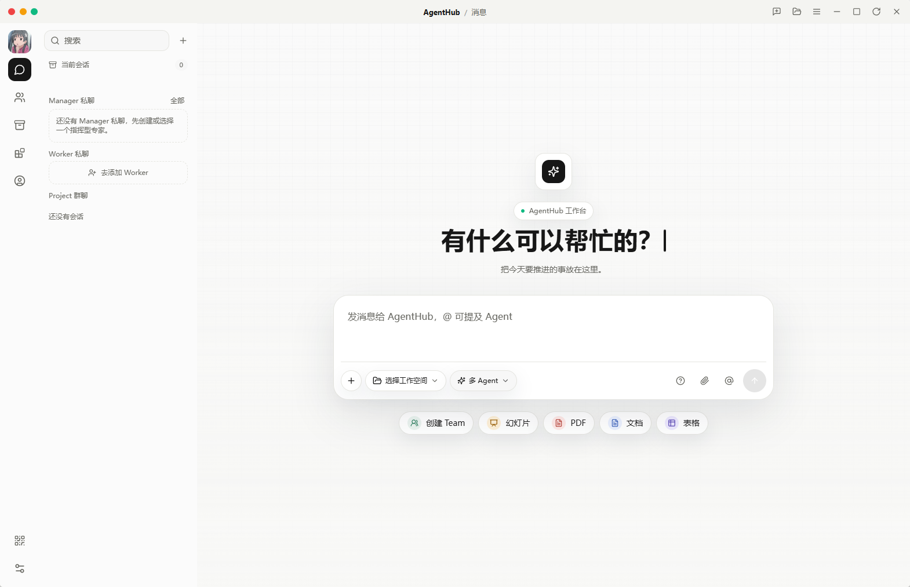
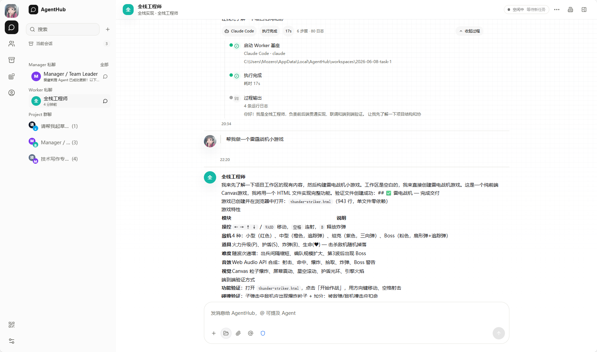
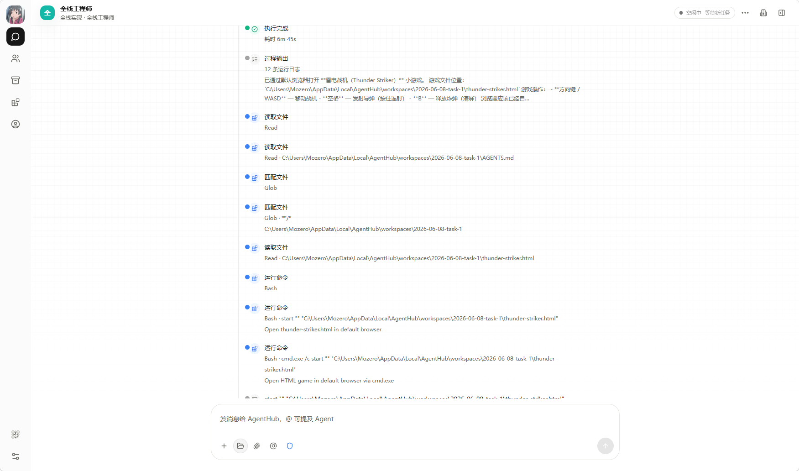

# AgentHub

> 开放、本地优先的多 Coding Agent 工作台，用群聊、任务房间、真实运行时和产物库组织 AI 团队协作。

[](#本地启动)
[](#运行模型)
[](#运行模型)
[](LICENSE)

[主 README](README.md) · [安全策略](SECURITY.md) · [工程文档](docs/) · [Agent 指南](AGENTS.md)

AgentHub 是一个面向真实执行的 AI 工作平台。它借鉴 Coze / Kimi 的工作台体验，用 IM 式产品外壳承载多 Agent 协作；底层采用 HiClaw-lite Open Kernel：Matrix Room 是协作事实源，Manager 是常驻协调者，Worker 是真实运行实体，产物进入可追踪的共享存储。

它不是“一个模型假装很多人在说话”，也不是固定模板驱动的任务流水线。AgentHub 的核心是一个可观察、可打断、可接力的协作闭环：用户提出目标，Manager 组织团队，Worker 在各自房间里执行，主群聊呈现进度、汇报、产物和最终综合结果。

## 产品形态

AgentHub 的第一屏是工作台，不是营销页。用户可以从一个空间、一个群聊、一个 Agent 私聊或一个历史产物继续工作。



在 AgentHub 中，聊天不是简单输入框，而是协作现场：

- **群聊**承载目标、讨论、安排、任务状态、成员汇报和最终复盘。
- **Agent 私聊**用于和单个专家长期对话，保持上下文和工作区绑定。
- **任务子对话**记录某个 Worker 的完整执行过程，包含接单、进度、澄清、失败、重试和产物。
- **产物预览**把生成文件、网页、报告和共享任务目录变成可检查的工作资产。





## 设计理念

### 1. 协作事实来自 Room

Human、Manager、Worker 都是 Room participant。消息、mention、文件、审批、澄清和进度都进入 timeline。前端从 Room timeline 和资源状态投影 UI，而不是依赖一份难以审计的聊天缓存。

### 2. Manager 是协调者，不是一次性 Planner

Manager / Orchestrator 像团队负责人一样观察 Room、理解目标、追问信息、提出补员、派发任务、处理打断并做最终复盘。任务拆解只是 Manager 可调用的能力之一，不是系统主脑。

### 3. Worker 是真实运行实体

Worker 有身份、状态、模型、技能、工作目录、RuntimeLease、Room membership 和 heartbeat。OpenClaw resident Worker、Codex CLI、Claude Code、OpenCode、Gemini CLI 都通过统一 contract 暴露给 Controller 和 Manager。

### 4. 产物是一等资源

代码、网页、文档、图片、报告和中间交接文件都进入 ArtifactStore / SharedStorage。产物引用使用 S3-compatible object key 语义，本地 filesystem 是默认实现，MinIO/S3 是同一语义下的可切换适配器。

### 5. 本地优先，团队可托管

AgentHub 默认在本机运行，适合个人开发者和本地项目工作流。通信、存储、运行时和模型网关都按可替换 adapter 设计，可以连接真实 Matrix homeserver、MinIO/S3、Docker resident runtime 和 OpenAI-compatible gateway。

## 核心体验

```text
用户在群聊提出目标
  -> Manager 观察上下文并决定回复、追问、补员或派活
  -> Controller Plane 创建 Run / Task / TaskRoom / RuntimeLease
  -> Worker 在任务房间接单并执行
  -> 过程事件、澄清、产物和结果写回 Room timeline
  -> 主群聊展示进度、成员汇报、产物卡和最终复盘
```

用户可以随时进入某个任务子对话，看见 Worker 做了什么、卡在哪里、产物从哪里来。复杂任务不再是黑盒的一句“完成了”，而是一条能被检查和继续协作的执行轨迹。

## 产品模块

| 模块 | 作用 |
| --- | --- |
| Space | 组织项目、团队成员、Agent、任务和资产 |
| Agent Chat | 与单个专家 Agent 建立长期私聊 |
| Agent Group | 在群聊中组织 Manager、Worker 和用户协作 |
| Task Room | 保存单个 Worker 的任务上下文、过程和输出 |
| Task Center | 汇总 Run、Task、状态、依赖、重试和人工介入 |
| Asset Center | 管理生成产物、共享文件、预览和交付记录 |
| Expert / Skill Center | 管理 Agent 配置、角色背景、技能包、MCP 和工具权限 |
| Eval / Trace | 检查运行事件、模型调用、资源状态和失败原因 |

## 运行模型

```text
AgentHub Web / Desktop
  -> AgentHub Server
  -> Controller API
  -> RoomService + Matrix Adapter
  -> Matrix Homeserver / Tuwunel
  -> OpenClaw Manager
  -> Worker Runtime
  -> ArtifactStore / SharedStorage
  -> UI Projection
```

### 分层职责

| 层 | 职责 |
| --- | --- |
| 产品交互层 | IM 群聊、Agent 私聊、任务子对话、任务看板、产物卡 |
| 编排层 | Manager、Controller actions、Run、Task、RuntimeLease、最终复盘 |
| 通信层 | Matrix Room、timeline、participant、mention、file event |
| 协议投影层 | AG-UI、Room timeline projection、资源状态 projection |
| 执行层 | OpenClaw Manager、OpenClaw Worker、Codex CLI、Claude Code、OpenCode、Gemini CLI |
| 能力层 | MCP、Skills、Rules、shell、文件系统、浏览器、模型网关 |
| 存储层 | SQLite 资源索引、本地 SharedStorage、MinIO/S3-compatible object store |

## 仓库结构

```text
apps/
  server/       Hono/Bun API、Room、Manager runtime、Worker runtime、Controller Plane
  web/          React/Vite Web 工作台
  desktop/      Tauri 桌面壳
  Android/      Android 客户端
packages/
  db/           Drizzle schema、migration、SQLite 访问
  shared/       共享 schema、常量和类型
infra/
  docker-compose.hiclaw-lite.yml
  start-hiclaw-lite.sh
  stop-hiclaw-lite.sh
  openclaw-runtime/
docs/           产品、架构、运行时和工程说明
tests/          bun:test 集成测试、投影测试和边界测试
scripts/        开发进程脚本
```

## 本地启动

### 依赖

- [Bun](https://bun.sh) >= 1.1.0
- Node.js，可在 PATH 中调用
- Docker Desktop，用于本地 Tuwunel / MinIO
- 可选 Coding Agent CLI：Codex CLI、Claude Code、OpenCode、Gemini CLI

### 安装

```bash
bun install
cp .env.example .env
```

至少检查这些配置：

```text
DATABASE_URL
LLM_PROVIDER
LLM_API_KEY
LLM_BASE_URL
LLM_MODEL
AGENTHUB_ROOM_PROVIDER=matrix
AGENTHUB_MATRIX_HOMESERVER_URL
AGENTHUB_MATRIX_SERVER_NAME
AGENTHUB_MATRIX_REGISTRATION_TOKEN
```

### 启动 HiClaw-lite 基础设施

```bash
bash infra/start-hiclaw-lite.sh
```

在 Windows PowerShell 里，`bash` 可能会调用 WSL。此时需要先进入 WSL 挂载的仓库路径：

```powershell
wsl
cd /mnt/f/Learning/AgentHub
bash infra/start-hiclaw-lite.sh
```

这个脚本负责准备本地 Matrix / MinIO / OpenClaw runtime 所需环境，并输出关键端口、健康状态和诊断信息。

停止基础设施：

```bash
bash infra/stop-hiclaw-lite.sh
```

### 启动 AgentHub

```bash
bun run dev
```

开发脚本会执行数据库迁移、启动 server、选择可用 Web 端口、写入 `.agenthub-port`，并在配置允许时启动 resident Manager。

打开终端输出中的 Web 地址，通常是：

```text
http://127.0.0.1:5644/
```

## 常用命令

```bash
bun run dev              # server + web
bun run dev:stop         # 停止 AgentHub dev 进程
bun run dev:server       # server only
bun run dev:web          # web only
bun run dev:desktop      # desktop shell

bash infra/start-hiclaw-lite.sh
bash infra/stop-hiclaw-lite.sh

bun run infra:up         # Docker Compose 启动 Tuwunel + MinIO
bun run infra:down       # 停止本地基础设施
bun run infra:logs       # 查看基础设施日志

bun run typecheck
bun --filter @agenthub/server typecheck
bun --filter @agenthub/web typecheck
bun test
```

## 配置

| 变量 | 作用 |
| --- | --- |
| `PORT` | AgentHub Server 端口，默认 `8000` |
| `DATABASE_URL` | SQLite 数据库路径 |
| `LLM_PROVIDER` | 内部模型提供方 |
| `LLM_API_KEY` | 模型网关密钥 |
| `LLM_BASE_URL` | OpenAI-compatible 网关地址 |
| `LLM_MODEL` | 内部默认模型 |
| `AGENTHUB_ROOM_PROVIDER` | Room provider，产品路径使用 `matrix` |
| `AGENTHUB_MATRIX_HOMESERVER_URL` | Matrix homeserver URL |
| `AGENTHUB_MATRIX_SERVER_NAME` | Matrix server name，默认 `agenthub.local` |
| `AGENTHUB_MATRIX_REGISTRATION_TOKEN` | 本地 Matrix 注册 token |
| `AGENTHUB_OBJECT_STORE_PROVIDER` | 本地 filesystem 或 S3-compatible object store |
| `AGENTHUB_CONTAINER_RUNTIME` | 设为 `docker` 时启用 Docker resident runtime |
| `AGENTHUB_MANAGER_BACKEND` | Manager backend 覆盖 |
| `AGENTHUB_WORKER_BACKEND` | Worker backend 覆盖 |
| `AGENTHUB_CODE_AGENT_TIMEOUT_MS` | Code Agent 执行超时 |
| `AGENTHUB_SANDBOX_PROVIDER` | `local-workdir` 或 Docker sandbox |

完整配置见 [.env.example](.env.example)。

## Runtime Contract

AgentHub 为 Manager / Worker 生成统一运行时契约：

```text
SOUL.md
AGENTS.md
TOOLS.md
skills/
state.json
rooms.json
workers-registry.json
teams-registry.json
runtime.json
runtime-manifest.json
heartbeat
workspace
logs
```

这套 contract 让不同运行时基座可以暴露一致能力：身份、Room、模型、技能、工作目录、共享任务契约、健康状态和 Controller reconcile。

## 工程文档

- [AGENTS.md](AGENTS.md)：AI Coding Agent 的权威工程约束。
- [docs/文档索引与权威口径.md](docs/文档索引与权威口径.md)：文档索引和口径来源。
- [docs/AgentHub-HiClaw-lite开源内核重构方案.md](docs/AgentHub-HiClaw-lite开源内核重构方案.md)：HiClaw-lite 内核设计。
- [docs/使用指南.md](docs/使用指南.md)：产品使用说明。
- [SECURITY.md](SECURITY.md)：安全边界和漏洞报告。

## 贡献

修改 runtime、Room、task、artifact 或 Controller 行为前，请先读 [AGENTS.md](AGENTS.md)。核心原则：

1. 先确认改动所在层级。
2. 以 Room timeline 和资源状态为事实源。
3. 保持 Manager / Worker runtime 边界清晰。
4. 不恢复旧 DAG-first、模板优先或本地伪通信路径。
5. 为投影、生命周期、失败可见性和边界条件补测试。

建议检查：

```bash
bun run typecheck
bun test
```

## 安全

AgentHub 可以运行本地 CLI、读写工作区、访问 Matrix token、模型密钥和生成产物。不要提交：

- `.env`
- 模型 provider key
- Matrix access token
- 本地 CLI auth 文件
- 数据库文件
- 生成 workspace
- runtime 日志和含密钥的诊断输出

运行不可信提示词、仓库或生成代码时，请使用一次性工作区、受限模型密钥和更强的 sandbox。

## License

AgentHub 使用 [MIT License](LICENSE)。
