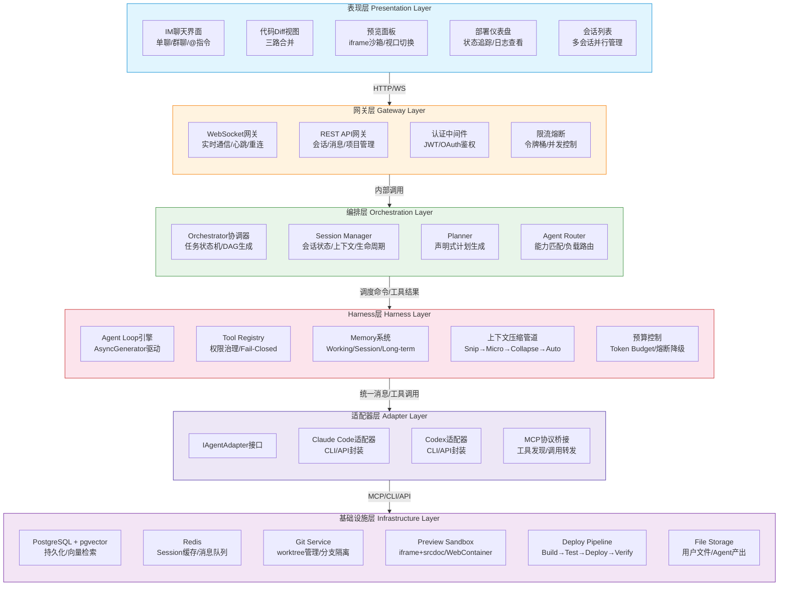
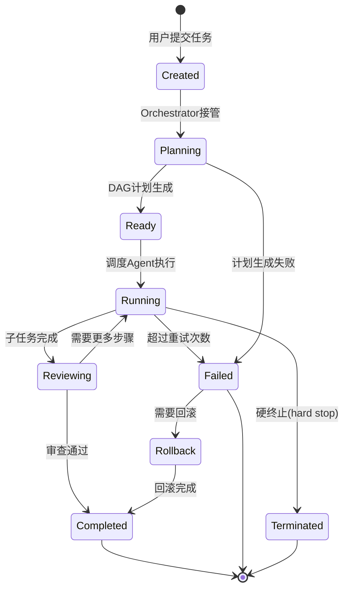
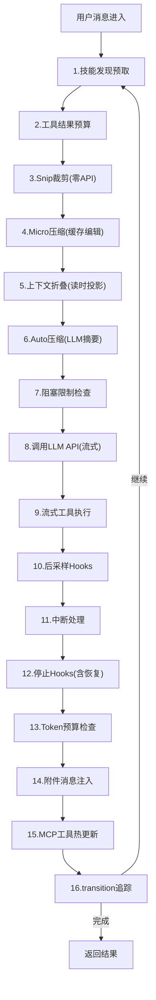
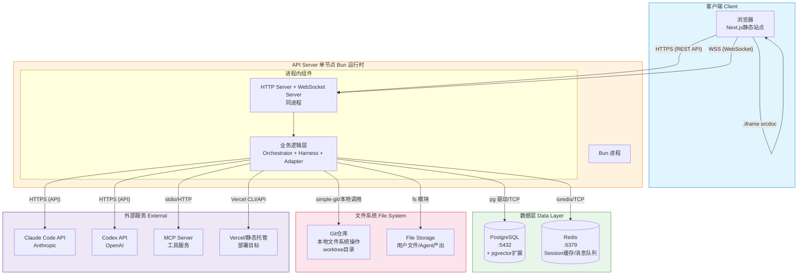
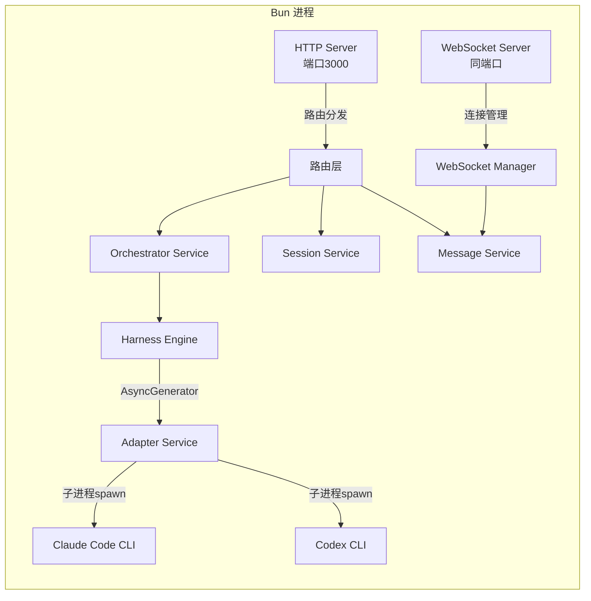
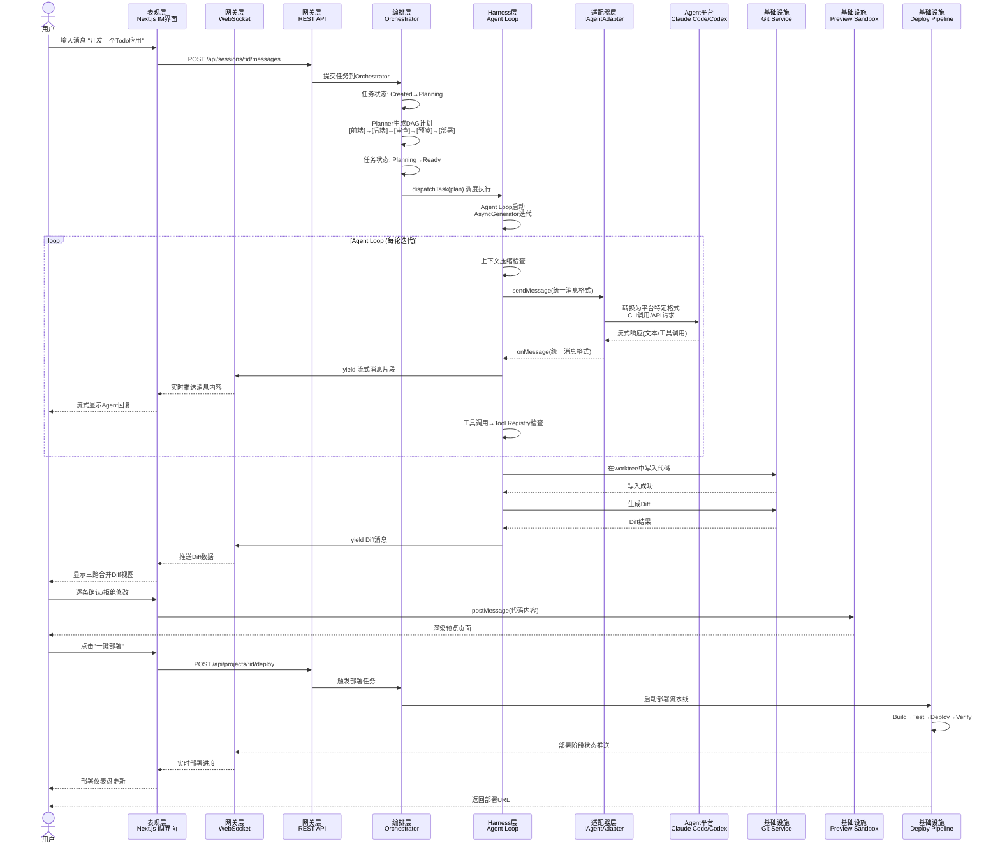

# AgentHub 系统架构总览

> **文档版本**：v1.0
> **更新日期**：2026-05-14
> **作者**：AgentHub 架构团队
> **状态**：设计阶段
> **依赖文档**：[AgentHub 需求规格说明书 v1.0](../01-需求分析/AgentHub-需求规格说明书-v1.0.md)

---

## 目录

1. [架构设计理念](#1-架构设计理念)
2. [逻辑架构图](#2-逻辑架构图)
3. [物理架构图](#3-物理架构图)
4. [核心数据流设计](#4-核心数据流设计)
5. [层间接口契约](#5-层间接口契约)
6. [架构设计原则](#6-架构设计原则)

---

## 1. 架构设计理念

AgentHub 采用 **Harness Engineering 范式** 的六层分层架构。核心理念：

> **Agent 负责局部智能，Harness 负责全局控制。**

- **Agent** 只在自己的问题域内执行推理和行动，不参与全局调度决策
- **Harness** 独占五项决策权：任务生命周期、执行计划裁决、Agent 路由、失败处理、硬终止条件
- **适配器层** 是 Agent 平台适配器（封装 Claude Code / Codex CLI 或 API），不是 IM 平台适配器
- **Agent Loop** 采用 AsyncGenerator 模式驱动，天然支持流式、中断、背压
- **git worktree** 实现 Agent 并行操作的文件系统级隔离
- **所有工具默认 Fail-Closed**：遗漏配置不会导致权限逃逸

---

## 2. 逻辑架构图

AgentHub 系统采用六层分层架构，自上而下分别为表现层、网关层、编排层、Harness 层、适配器层、基础设施层。



### 2.1 各层职责详述

#### 表现层（Presentation Layer）

Next.js App Router 构建的 Web 应用，是用户与 AgentHub 交互的唯一入口。

| 组件 | 职责 | 关键技术 |
|------|------|----------|
| IM 聊天界面 | 单聊/群聊消息展示、@指令输入、消息类型渲染（文本/代码块/文件） | React Server Components、SSE streaming |
| 代码 Diff 视图 | 三路合并视图（Base/AgentA/AgentB）、逐行确认/拒绝 | Monaco Editor DiffEditor |
| 预览面板 | iframe + srcdoc 沙箱渲染、多设备视口切换（桌面/平板/手机）、HMR 热更新 | postMessage 安全通信 |
| 部署仪表盘 | Build→Test→Deploy→Verify 四阶段进度可视化、实时日志流 | WebSocket 日志推送 |
| 会话列表 | 多会话并行管理、会话搜索/归档/切换 | 客户端状态管理 |

#### 网关层（Gateway Layer）

系统的统一入口，负责协议转换、认证鉴权、流量控制。

| 组件 | 职责 | 关键技术 |
|------|------|----------|
| WebSocket 网关 | 实时消息推送、心跳保活（30s 间隔）、断线重连（指数退避）、多会话连接复用 | Bun WebSocket Server |
| REST API 网关 | 会话 CRUD、历史消息分页查询、项目管理、用户配置 | Bun HTTP Server + Zod 校验 |
| 认证中间件 | JWT 签发与验证、OAuth2.0 第三方登录、Session Token 管理 | jose / OAuth 2.0 |
| 限流熔断 | 基于令牌桶的 API 限流、并发 WebSocket 连接数控制 | 令牌桶算法 |

#### 编排层（Orchestration Layer）

系统的"大脑"，独占有五项决策权，是 Harness Engineering 的核心体现。

| 组件 | 职责 | 关键技术 |
|------|------|----------|
| Orchestrator | 任务生命周期状态机、DAG 执行计划裁决、失败降级策略（重试→降级→终止） | 状态机模式 |
| Session Manager | 会话创建/归档/销毁、上下文生命周期管理、多会话状态隔离 | Redis Session Store |
| Planner | 将用户意图转化为声明式 DAG 计划、识别并行执行路径 | LLM 辅助 + 规则引擎 |
| Agent Router | 基于任务类型/Agent 能力/历史质量的匹配路由、负载均衡 | 能力画像匹配 |

**Orchestrator 状态机**：



**四道硬闸**（硬终止条件）：

| 硬闸 | 默认值 | 说明 |
|------|--------|------|
| `max_steps` | 50 | 最大执行步数 |
| `max_tokens` | 200K | 最大 Token 消耗 |
| `max_duration` | 30min | 最大执行时长 |
| `max_tool_calls` | 100 | 最大工具调用次数 |

#### Harness 层（Harness Layer）

系统的"运行时底座"，Agent Loop 引擎、工具治理、记忆管理、上下文压缩、预算控制全部在此层实现。

| 组件 | 职责 | 关键技术 |
|------|------|----------|
| Agent Loop 引擎 | AsyncGenerator 驱动的 Agent 主循环，16 步迭代管线 | AsyncGenerator / yield |
| Tool Registry | 工具统一注册入口、九项元信息登记、Fail-Closed 默认值、RBAC 权限 | buildTool 工厂模式 |
| Memory 系统 | Working（任务级）→ Session（会话级）→ Long-term（跨会话）三层记忆 | pgvector 向量检索 |
| 上下文压缩管道 | Snip→Micro→Collapse→Auto 四级渐进压缩，自动触发 | LLM 摘要 + 规则裁剪 |
| 预算控制 | Token Budget 实时监控、绿/黄/红/熔断四级降级 | Token 计数 + 预算熔断 |

**Agent Loop（AsyncGenerator 模式）**：



**四级上下文压缩管道**：

| 级别 | 名称 | 触发条件 | 机制 | API 调用 |
|------|------|----------|------|----------|
| L1 | Snip Compact | 历史消息超过 snip 边界 | 裁剪标记之前的消息 | 无 |
| L2 | Micro Compact | 特定工具结果可丢弃 | cache editing 删除 | 无 |
| L3 | Context Collapse | 多轮工具调用累积 | 读时投影为结构化摘要 | 无 |
| L4 | Auto Compact | 上下文接近窗口限制 | LLM 生成对话摘要替换历史 | 有 |

**Token Budget 四级降级**：

| 区间 | 预算剩余 | 策略 |
|------|----------|------|
| 绿区 | > 50% | 正常执行 |
| 黄区 | 20% ~ 50% | 压缩上下文 |
| 红区 | 5% ~ 20% | 切换小模型 + 跳过 CoT |
| 熔断区 | < 5% | 强制收束，返回 partial result |

#### 适配器层（Adapter Layer）

**Agent 平台适配器**，封装不同 Agent 平台（Claude Code、Codex CLI）的调用细节，统一为 AgentHub 内部标准接口。

| 组件 | 职责 | 关键技术 |
|------|------|----------|
| IAgentAdapter 接口 | 标准适配器契约：sendMessage / onMessage / getCapabilities | TypeScript interface |
| Claude Code 适配器 | 封装 Claude Code CLI 调用、流式输出解析、工具调用转换 | ChildProcess spawn |
| Codex 适配器 | 封装 Codex CLI/API 调用、能力发现 | HTTP API / CLI |
| MCP 协议桥接 | 发现 MCP Server 工具、转发调用、结果回传、白名单过滤 | MCP SDK / stdio |

#### 基础设施层（Infrastructure Layer）

| 组件 | 职责 | 技术选型 |
|------|------|----------|
| PostgreSQL + pgvector | 用户数据、会话记录、Agent 产出持久化；向量检索支持 Long-term Memory | pgvector 扩展 |
| Redis | Session 缓存（TTL 自动过期）、消息队列（任务调度）、发布订阅 | ioredis |
| Git Service | worktree 创建/清理、分支管理、Diff 生成、冲突检测 | simple-git / exec |
| Preview Sandbox | iframe + srcdoc 安全渲染、postMessage 通信、多视口模拟 | 浏览器原生 API |
| Deploy Pipeline | Build→Test→Deploy→Verify 四阶段流水线、回滚机制 | Vercel CLI / 脚本化 |
| File Storage | 用户上传文件、Agent 产出物（代码包、截图）、临时产物 | 本地文件系统 / 对象存储 |

---

## 3. 物理架构图

比赛 Demo 阶段采用**单节点部署**架构，所有服务运行在单一 Bun 运行时进程中，数据库和缓存使用单实例。



### 3.1 网络通信说明

| 通信路径 | 协议 | 说明 |
|----------|------|------|
| 浏览器 ↔ API Server | HTTPS | REST API 调用，JSON 格式 |
| 浏览器 ↔ API Server | WSS | WebSocket 实时消息推送，心跳 30s |
| 浏览器 ↔ 预览沙箱 | iframe + postMessage | 前端同源安全通信，不经过服务端 |
| API Server ↔ PostgreSQL | TCP/5432 | pg 驱动直连 |
| API Server ↔ Redis | TCP/6379 | ioredis 直连 |
| API Server ↔ Agent 平台 | HTTPS | Claude Code API / Codex API 调用 |
| API Server ↔ MCP Server | stdio / HTTP | MCP 协议标准通信 |
| API Server ↔ Git | 本地文件系统 | 直接操作 worktree 目录 |
| API Server ↔ Vercel | HTTPS | Vercel CLI 或 REST API 部署 |

### 3.2 进程内架构（Bun 单进程）



---

## 4. 核心数据流设计

完整描述"用户消息 → IM会话 → Orchestrator → Agent → Diff → 预览 → 部署"全链路。

### 4.1 全链路数据流图



### 4.2 各阶段数据变化

#### 阶段1：用户消息 → 网关层

| 项目 | 说明 |
|------|------|
| **输入** | 用户文本消息 + @指令（可选）+ 附件（可选） |
| **处理** | WebSocket/REST API 接收 → JWT 验证 → 限流检查 → 消息格式校验（Zod） |
| **输出** | 标准化消息对象 `{ sessionId, userId, content, type, mentions[], attachments[], timestamp }` |
| **持久化** | 消息写入 PostgreSQL `messages` 表，同时缓存到 Redis（TTL 1h） |
| **状态** | 消息状态：`sent → delivered → processing` |

#### 阶段2：网关层 → 编排层

| 项目 | 说明 |
|------|------|
| **输入** | 标准化消息对象 + Session 上下文 |
| **处理** | Orchestrator 解析消息意图 → 如果包含 @指令则路由到指定 Agent → 如果是复杂任务则触发 Planner 生成 DAG |
| **输出** | 声明式 DAG 计划：`[{ step:1, intent:"generate_frontend", agent:"FrontendAgent", input:{...}, depends:[] }, ...]` |
| **持久化** | DAG 计划写入 PostgreSQL `task_plans` 表 |
| **状态** | 任务状态：`Created → Planning → Ready` |

#### 阶段3：编排层 → Harness 层

| 项目 | 说明 |
|------|------|
| **输入** | DAG 计划 + Agent 路由结果 + 权限上下文 |
| **处理** | Agent Loop 启动 → 每轮迭代：上下文压缩 → LLM 调用 → 工具执行 → 结果回写 → 预算检查 |
| **输出** | AsyncGenerator 流式产出：`StreamEvent | Message | ToolUseSummary | DiffResult` |
| **持久化** | 每轮对话消息写入 PostgreSQL，Execution Log 不可变追加 |
| **状态** | 任务状态：`Ready → Running`；每个子步骤：`queued → executing → completed/failed` |

#### 阶段4：Harness 层 → 适配器层 → Agent 平台

| 项目 | 说明 |
|------|------|
| **输入** | 统一消息格式：`{ role, content, toolCalls?, toolResults? }` |
| **处理** | IAgentAdapter 转换为平台特定格式 → 调用 CLI/API → 解析响应 |
| **输出** | 统一消息格式的回包（含文本内容、工具调用请求、错误信息） |
| **持久化** | 不在此层持久化，由 Harness 层统一管理 |
| **状态** | 适配器连接状态：`connected / disconnected / fallback` |

#### 阶段5：Agent → Git → Diff

| 项目 | 说明 |
|------|------|
| **输入** | Agent 生成/修改的代码文件内容 |
| **处理** | Git Service 在 worktree 中执行文件写入 → `git diff` 生成差异 → 与主分支对比 |
| **输出** | Diff 结果：`{ filePath, hunks: [{ oldStart, oldLines, newStart, newLines, content }], stats: { additions, deletions } }` |
| **持久化** | Diff 记录写入 PostgreSQL，worktree 修改暂存于本地文件系统 |
| **状态** | Diff 确认状态：`pending → accepted / rejected` |

#### 阶段6：Diff → 预览

| 项目 | 说明 |
|------|------|
| **输入** | 已确认的前端代码（HTML/CSS/JS） |
| **处理** | 组装为完整 HTML → 通过 postMessage 发送到 iframe → iframe 使用 srcdoc 渲染 |
| **输出** | 可视化的页面预览 |
| **持久化** | 预览状态仅存在于浏览器内存，不持久化 |
| **状态** | 预览视口：`desktop / tablet / mobile` |

#### 阶段7：预览 → 部署

| 项目 | 说明 |
|------|------|
| **输入** | 用户确认的完整代码项目（已合并所有 Diff） |
| **处理** | Deploy Pipeline 四阶段：`Build（依赖安装+打包）→ Test（运行测试套件）→ Deploy（推送至 Vercel/静态托管）→ Verify（健康检查+URL验证）` |
| **输出** | 部署结果：`{ url, status, logs[], duration }` |
| **持久化** | 部署记录写入 PostgreSQL `deployments` 表 |
| **状态** | 部署状态：`building → testing → deploying → verifying → live / failed` |

### 4.3 异步处理机制

| 机制 | 说明 |
|------|------|
| **Agent Loop AsyncGenerator** | 每次 `yield` 产出中间结果，前端通过 WebSocket 实时接收，无需等待任务完成 |
| **WebSocket 推送** | 消息、Diff、部署进度均通过 WebSocket 实时推送，前端增量渲染 |
| **Redis 消息队列** | 部署任务、后台分析任务通过 Redis Pub/Sub 异步分发 |
| **子进程隔离** | Agent 平台 CLI 通过 ChildProcess spawn 异步执行，不阻塞主循环 |
| **git worktree 并行** | 多个 Agent 在独立 worktree 中并行工作，通过文件锁（flock）防止写冲突 |

---

## 5. 层间接口契约

### 5.1 表现层 ↔ 网关层

#### WebSocket 消息协议

**消息类型枚举**：

```typescript
enum WsMessageType {
  // 上下文消息
  CHAT_MESSAGE = "chat.message",
  CHAT_STREAM_START = "chat.stream.start",
  CHAT_STREAM_DELTA = "chat.stream.delta",
  CHAT_STREAM_END = "chat.stream.end",
  CHAT_STREAM_ERROR = "chat.stream.error",

  // 工具调用消息
  TOOL_USE = "tool.use",
  TOOL_RESULT = "tool.result",
  TOOL_PROGRESS = "tool.progress",

  // Diff 消息
  DIFF_GENERATED = "diff.generated",
  DIFF_CONFIRMED = "diff.confirmed",

  // 部署消息
  DEPLOY_STATUS = "deploy.status",
  DEPLOY_LOG = "deploy.log",

  // 系统消息
  HEARTBEAT = "system.heartbeat",
  HEARTBEAT_ACK = "system.heartbeat.ack",
  ERROR = "system.error",
  SESSION_CLOSED = "system.session.closed"
}
```

**消息包结构**：

```typescript
interface WsMessage {
  type: WsMessageType;
  sessionId: string;
  payload: unknown;
  timestamp: number;
  sequence: number;  // 单调递增序号，用于断线重连补发
}
```

**心跳机制**：

- 服务端每 30s 发送 `HEARTBEAT`
- 客户端收到后回复 `HEARTBEAT_ACK`
- 连续 3 次未收到 ACK 视为连接断开，客户端执行指数退避重连

**重连策略**：

- 初始重连延迟：1s
- 指数退避因子：2x
- 最大重连延迟：30s
- 最大重试次数：无限制（用户关闭页面为止）
- 重连后通过 `sequence` 补发丢失消息

#### REST API

**基础约定**：

- 基础路径：`/api/v1`
- 请求格式：`application/json`
- 响应格式：`{ code: number, data: T, message: string }`
- 认证方式：`Authorization: Bearer <jwt_token>`
- 分页标准：`?page=1&pageSize=20`，响应含 `{ total, page, pageSize, hasMore }`

**核心端点**：

| 方法 | 路径 | 说明 |
|------|------|------|
| `POST` | `/api/v1/sessions` | 创建新会话 |
| `GET` | `/api/v1/sessions` | 获取会话列表（分页） |
| `GET` | `/api/v1/sessions/:id` | 获取会话详情 |
| `DELETE` | `/api/v1/sessions/:id` | 归档会话 |
| `POST` | `/api/v1/sessions/:id/messages` | 发送消息 |
| `GET` | `/api/v1/sessions/:id/messages` | 获取历史消息（分页，含游标） |
| `GET` | `/api/v1/sessions/:id/diffs` | 获取 Diff 列表 |
| `PATCH` | `/api/v1/sessions/:id/diffs/:file` | 确认/拒绝 Diff |
| `POST` | `/api/v1/sessions/:id/deploy` | 触发一键部署 |
| `GET` | `/api/v1/sessions/:id/deploy/:deployId` | 查询部署状态 |
| `GET` | `/api/v1/agents` | 获取可用 Agent 列表及能力 |

### 5.2 网关层 ↔ 编排层

**内部调用接口**（同进程，函数调用）：

```typescript
interface IOrchestratorService {
  // 提交新任务
  submitTask(input: TaskInput): Promise<TaskHandle>;

  // 查询任务状态
  getTaskStatus(taskId: string): TaskStatus;

  // 取消任务
  cancelTask(taskId: string, reason: string): Promise<void>;

  // 获取任务DAG计划
  getTaskPlan(taskId: string): DAGPlan | null;

  // 回复任务执行结果
  onTaskComplete(taskId: string, result: TaskResult): Promise<void>;

  // 接收Agent路由结果
  onAgentRouted(taskId: string, agentId: string, stepId: string): void;
}

interface ISessionService {
  createSession(config: SessionConfig): Promise<Session>;
  getSession(sessionId: string): Promise<Session | null>;
  archiveSession(sessionId: string): Promise<void>;
  getActiveSessions(userId: string): Promise<Session[]>;
  getSessionContext(sessionId: string): Promise<SessionContext>;
  updateSessionContext(sessionId: string, context: Partial<SessionContext>): Promise<void>;
}
```

### 5.3 编排层 ↔ Harness 层

**Agent 调度命令**：

```typescript
interface IHarnessService {
  // 分发任务到 Agent Loop
  dispatchTask(params: DispatchParams): AsyncGenerator<HarnessEvent>;

  // 取消正在执行的任务
  abortTask(taskId: string): void;

  // 查询 Agent 当前负载
  getAgentLoad(agentId: string): AgentLoad;

  // 注册工具（启动时由 Tool Registry 调用）
  registerTools(tools: Tool[]): void;
}

interface DispatchParams {
  taskId: string;
  sessionId: string;
  agentId: string;
  systemPrompt: string;
  userMessage: Message;
  tools: Tool[];
  budget: TokenBudget;
  config: QueryConfig;  // 一次性快照
  deps: QueryDeps;
}
```

**工具调用结果**：

```typescript
interface ToolCallResult {
  toolCallId: string;
  name: string;
  input: Record<string, unknown>;
  output: unknown;
  duration: number;
  error?: string;
  riskLevel: "low" | "medium" | "high";
  confirmedByUser?: boolean;
}
```

### 5.4 Harness 层 ↔ 适配器层

**统一消息格式**：

```typescript
interface UnifiedMessage {
  role: "system" | "user" | "assistant" | "tool";
  content: string | ContentBlock[];
  toolCalls?: UnifiedToolCall[];
  toolCallId?: string;
  metadata?: {
    model?: string;
    tokens?: { input: number; output: number };
    finishReason?: "stop" | "length" | "tool_calls" | "error";
  };
}

interface UnifiedToolCall {
  id: string;
  name: string;
  arguments: Record<string, unknown>;
}

interface ContentBlock {
  type: "text" | "image" | "tool_use" | "tool_result";
  text?: string;
  source?: { data: string; mediaType: string };
  toolUse?: { id: string; name: string; input: Record<string, unknown> };
  toolResult?: { toolUseId: string; content: string; isError?: boolean };
}
```

**IAgentAdapter 接口**：

```typescript
interface IAgentAdapter {
  // 适配器元信息
  readonly name: string;
  readonly version: string;
  readonly capabilities: AgentCapability[];

  // 核心通信
  sendMessage(messages: UnifiedMessage[], options?: SendOptions): AsyncGenerator<UnifiedMessage>;

  // 中断当前执行
  abort(): void;

  // 获取能力列表
  getCapabilities(): AgentCapability[];

  // 健康检查
  healthCheck(): Promise<HealthStatus>;

  // 资源释放
  dispose(): Promise<void>;
}

interface AgentCapability {
  name: string;
  description: string;
  tags: string[];           // ["frontend", "backend", "database", "devops"]
  supportedModels: string[];
  maxContextWindow: number;
  supportsStreaming: boolean;
  supportsToolCall: boolean;
  supportsVision: boolean;
}

interface SendOptions {
  maxTokens?: number;
  temperature?: number;
  tools?: Tool[];
  budget?: TokenBudget;
  signal?: AbortSignal;
}
```

### 5.5 适配器层 ↔ Agent 平台

**通信方式一览**：

| Agent 平台 | 通信方式 | 适配器模式 |
|------------|----------|------------|
| Claude Code | CLI（子进程 stdio） + Anthropic API | ClaudeCodeAdapter |
| Codex | CLI（子进程 stdio） + OpenAI API | CodexAdapter |
| MCP Server | stdio（子进程） 或 HTTP（SSE） | MCPBridge |

**MCP 桥接接口**：

```typescript
interface MCPBridge {
  // 发现可用MCP工具
  discoverTools(serverConfig: MCPServerConfig): Promise<MCPTool[]>;

  // 调用MCP工具
  callTool(serverName: string, toolName: string, args: Record<string, unknown>): Promise<MCPToolResult>;

  // 列出资源
  listResources(serverName: string): Promise<MCPResource[]>;

  // 读取资源
  readResource(serverName: string, uri: string): Promise<MCPResourceContent>;

  // 注册白名单
  setAllowlist(serverName: string, tools: string[]): void;

  // 关闭连接
  disconnect(serverName: string): Promise<void>;
}
```

**MCP 工具注册治理流程**：

```
MCP Server暴露50个工具 → MCPBridge白名单过滤 → Tool Registry登记 → 仅开放5个给特定Agent
```

---

## 6. 架构设计原则

AgentHub 的架构设计遵循以下核心原则，这些原则源自 Harness Engineering 范式与软件工程领域的最佳实践。

### 6.1 模块化（Modularity）

系统划分为六个清晰的分层，每层有独立职责和明确定义的接口。模块内部高度自治，模块间通过接口契约通信。模块划分遵循单一职责原则：表现层只负责 UI 渲染，网关层只负责协议转换，编排层只负责任务调度，Harness 层只负责 Agent 运行时治理，适配器层只负责平台封装，基础设施层只负责存储与外部服务。

### 6.2 松耦合（Loose Coupling）

层与层之间通过接口契约通信，而非直接依赖实现细节。Harness 层通过 `IAgentAdapter` 接口调用 Agent 平台，新增平台只需实现接口即可接入。测试依赖通过 `QueryDeps` 注入，而非 mock 具体实现。上下文配置在任务入口做一次性快照（`QueryConfig`），避免长时间运行中外部状态变化带来不确定行为。

### 6.3 高内聚（High Cohesion）

每层内部组件紧密协作，围绕单一职责构建。例如 Harness 层将 Agent Loop、Tool Registry、Memory、上下文压缩、预算控制五个子系统内聚为一套完整的 Agent 运行时治理方案。编排层将任务状态机、DAG 生成、Agent 路由、会话管理聚合为统一的调度中枢。

### 6.4 控制反转（Inversion of Control）

Agent 不掌握全局决策权。Orchestrator 独占用五项决策权（任务生命周期、执行计划裁决、Agent 路由、失败处理、硬终止条件），Agent 仅负责其问题域内的局部推理和行动。Planner 输出"声明式计划"而非"命令式调用"——Harness 可以在执行前介入，重排顺序、并行优化、拒绝危险步骤、执行安全审查。

### 6.5 Fail-Closed 安全默认值

所有工具统一通过 Tool Registry 注册，默认值全部偏向保守：`isConcurrencySafe` 默认 `false`（假设不安全的并行），`isReadOnly` 默认 `false`（假设会写入）。忘记配置不会导致权限逃逸。工具权限采用五层纵深防御：Deny Rules（不可见）→ Tool-level Permissions（自检）→ Generic Rules（规则匹配）→ Permission Mode（模式判断）→ Auto Classifier（分类器兜底）。

### 6.6 渐进降级（Graceful Degradation）

面对上下文爆炸、Token 超限、Agent 失败等异常场景，系统采用渐进降级而非直接崩溃。四级上下文压缩管道从零 API 调用的 Snip 裁剪，到全量 LLM 摘要的 Auto Compact。Token Budget 从正常的绿区执行，到黄区压缩，到红区切小模型，到熔断区强制返回 partial result。Agent 失败时，Orchestrator 执行重试（最多 3 次）→ 降级（跳过非关键步骤）→ 终止（通知用户）。

### 6.7 高可扩展性（High Extensibility）

通过 `IAgentAdapter` 接口实现 Agent 平台的可扩展接入。通过 `buildTool` 工厂模式实现工具的标准化注册。通过 MCP 协议桥接实现外部工具生态的可插拔集成。通过 Skills 系统（Markdown 驱动）实现零代码能力扩展。通过条件编译（`is_feature_enabled`）和运行时开关（环境变量）实现功能的按需启用与剥离。

### 6.8 可观测性（Observability）

系统在关键路径上内建可观测性机制。Agent Loop 的 `transition` 字段记录每次迭代的"继续原因"，使执行路径可追溯、可断言。Execution Log 不可变追加，支持事后审计和回放。工具调用全量记录审计日志（调用者、参数、结果、耗时）。部署流水线全程状态追踪与日志流推送。预算监控实时追踪 Token 消耗和熔断事件。

### 6.9 性能优先（Performance First）

冷启动路径采用 Fast Path 优化：`--version` 等简单命令零依赖直接返回。重量级模块（OpenTelemetry、gRPC）延迟加载，仅在使用时导入。Agent 平台 API 预连接（TLS 握手提前完成）。工具列表分区排序以最大化 API prompt cache 命中率。git worktree 并行操作避免 Agent 间的 I/O 阻塞。

### 6.10 最小依赖（Minimal Dependencies）

遵循"善用开源、最小依赖"原则。状态管理使用 34 行自研 MiniStore 而非引入 Redux/Zustand。Agent Loop 使用原生 AsyncGenerator 而非依赖第三方框架。工具系统使用 Zod 做 Schema 校验但不引入重量级 ORM。在功能和依赖之间寻找平衡，优先用平台原生能力解决问题。