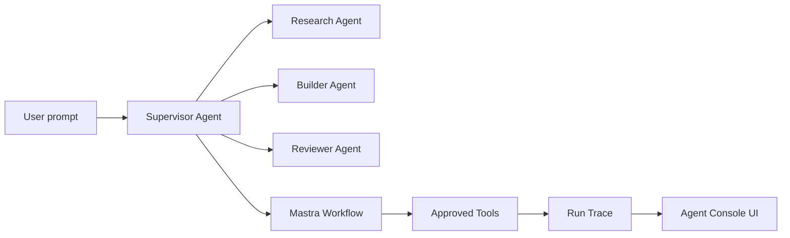

# Mastra-Inspired Feature Design

AgentHub should evolve from a chat prototype into an agent studio. The reference point is Mastra Studio and Playground: chat is only the execution surface; the product also needs agent metadata, tools, workflows, memory, tracing, and evaluation loops.

This design references:

- Mastra Studio getting started: `https://mastra.nodejs.cn/docs/getting-started/studio`
- Local Mastra playground source: `F:\Learning\mastra\mastra-main\packages\playground`

## Console Model

The main workspace should keep three regions:

1. Thread memory and session navigation.
2. Agent chat and streaming output.
3. Studio inspector with runtime tabs.

The right studio inspector is the anchor for future features:

| Tab       | Purpose                                                            | AgentHub implementation path                                 |
| --------- | ------------------------------------------------------------------ | ------------------------------------------------------------ |
| Overview  | Show active runtime, model, message count, next backend milestone. | Use current session, model settings, and live stream state.  |
| Agents    | Show supervisor and subagents with responsibility descriptions.    | Store agent cards in `agents`, then register them in Mastra. |
| Tools     | List available tools, descriptions, and approval policy.           | Add tool registry metadata and stream tool approval events.  |
| Workflows | Visualize deterministic steps around an agent run.                 | Map `tasks` to Mastra workflow steps and statuses.           |
| Memory    | Explain and inspect thread memory plus subagent memory isolation.  | Add summaries per session and scoped memory per agent.       |
| Tracing   | Show run spans and lifecycle events.                               | Persist agent stream events, tool calls, usage, and latency. |

## Runtime Pattern

AgentHub should use a supervisor-first topology:

## Backend Milestones

1. Register a real Mastra instance instead of creating a local agent per request.
2. Add an agent registry endpoint that returns id, name, description, model, tools, workflows, and enabled state.
3. Extend WebSocket events beyond text deltas:
   - `run:started`
   - `agent:delegation_started`
   - `tool:approval_required`
   - `workflow:step_started`
   - `workflow:step_completed`
   - `trace:span_completed`
   - `run:completed`
4. Store run events in SQLite so the UI can reload traces after refresh.
5. Replace illustrative UI data with API-backed `agents`, `tools`, `workflows`, `memory`, and `traces`.

## UX Principle

Do not hide agent internals behind a plain chat box. Every run should answer:

- Which agent is responsible?
- What tools can it call?
- Which workflow step is active?
- What memory/context was used?
- What did it cost in time and tokens?
- Which actions require human approval?
