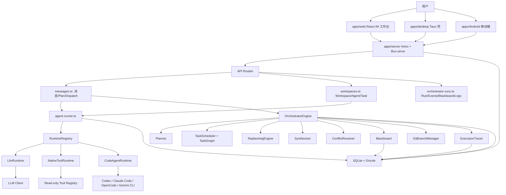
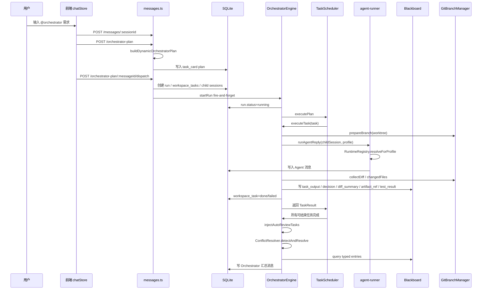
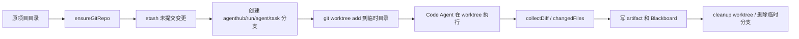
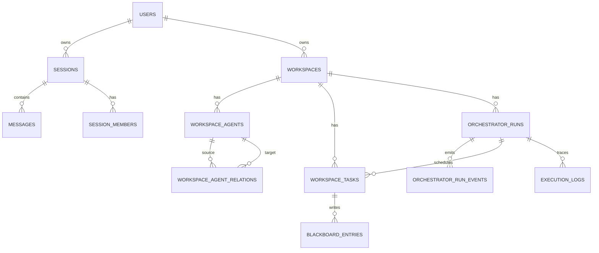
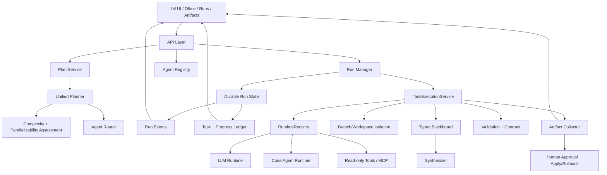

# AgentHub 项目全景与多 Agent 协作重构指南

> 日期：2026-05-28  
> 定位：面向人类开发者与 LLM Coding Agent 的 llmwiki 风格项目说明。  
> 范围：基于当前仓库代码、`AGENTS.md`、`README.md`、`docs/` 既有资料，以及行业公开资料综合整理。  

---

## 0. 一句话结论

AgentHub 已经从“聊天壳 + 几个 Agent prompt”演进成了一个有完整执行面的本地多 Agent 协作平台：它有 Workspace、Agent Group、计划卡、Agent 路由、DAG 调度、事件流、结构化 Blackboard、Code Agent Runtime、Git worktree 隔离、任务验证、自动审查、运行账本和可观测页面。当前最大的风险不是“功能不够”，而是“协作执行语义太多但还没有收敛”：Plan 生成仍同步阻塞，Orchestrator 执行状态依赖内存，失败依赖会卡死 DAG，多 Agent 代码合并只停在报告层，前端实际流程又会自动 dispatch，削弱了人工确认与可控性。

下一阶段应该做减法和收敛：保留 IM 作为产品壳，把 Orchestrator 收敛为一个持久化 Run Manager，把 Blackboard/Artifact/Run Event 作为协作唯一事实源，并把 Code Agent 流程从“能跑”升级为“可审计、可回放、可合并、可撤销”。

---

## 1. 当前产品形态

AgentHub 的核心不是传统工作流编辑器，而是 IM 式多 Agent 工作台：

- 用户可以在 Direct Session 中和单个 Agent 对话。
- 用户可以在 Workspace 绑定的 Group Session 中和一组 Agent 对话。
- 用户可以用 `@Agent名` 把问题交给特定 Agent。
- 用户可以用 `@orchestrator` 生成计划卡，再派发成多个 Agent 子任务。
- Code Agent 能调用 Codex、Claude Code、OpenCode、Gemini 等本机 CLI，配合 workspace 路径执行真实项目任务。
- 桌面端由 Tauri 启动 server sidecar，本地持久化 SQLite 数据、配置与日志。
- Android 端提供轻量远程连接、会话和消息能力。

产品差异化应该继续放在这句话上：

> 用户不是在配置一个复杂 DAG，而是在一个“会留下过程、产物、决策和风险”的 Agent 群聊里推进真实项目。

---

## 2. 技术与模块总览

### 2.1 Monorepo

| 路径 | 职责 | 当前评价 |
|---|---|---|
| `apps/server` | Hono API、WebSocket、Agent Runner、Runtime、Orchestrator、工具与桌面静态资源服务 | 核心复杂度最高，已具备平台化雏形 |
| `apps/web` | React/Vite 前端，聊天、Workspace、模型配置、代码工具、Office、运行日志页面 | 体验功能丰富，但 Orchestrator 状态展示仍需产品化 |
| `apps/desktop` | Tauri v2 桌面壳，启动 sidecar、窗口控制、本机文件选择、编辑器打开 | 方向正确，是本地 Agent 平台的重要外壳 |
| `apps/Android` | Kotlin 客户端，HTTP + WebSocket 连接桌面/server | 目前是轻量移动入口 |
| `packages/db` | SQLite + Drizzle schema/migrations | 已承载多 Agent 协作核心状态 |
| `packages/shared` | 前后端共享常量与 Zod schema | 共享层偏薄，很多 Orchestrator 类型仍在 server 内部 |
| `tests` | `bun:test` 冒烟测试 | 覆盖了关键后端链路，但还缺真实 Code Agent/冲突/恢复测试 |
| `docs` | 产品调研、架构方案、比赛资料、使用指南 | 文档丰富，但需要一份和当前代码同步的全景索引 |

### 2.2 后端路由层

| 文件 | 职责 | 重点 |
|---|---|---|
| `apps/server/src/app.ts` | Hono 应用、CORS、统一错误处理、静态资源挂载 | 已引入 `request-context` 与 `AppError`，错误体系开始统一 |
| `apps/server/src/index.ts` | Bun.serve + WebSocket，同端口 HTTP/WS，种子默认用户 | WebSocket 只支持 join session，事件语义主要在业务层广播 |
| `routes/messages.ts` | 消息 CRUD、Orchestrator Plan、Plan dispatch、Agent 草案、Artifact Demo | 文件过大，是当前最大“上帝路由” |
| `routes/workspaces.ts` | Workspace、Agent、Agent relations、Task CRUD/dispatch、summary | 单任务 dispatch 和 Orchestrator dispatch 执行语义不一致 |
| `routes/orchestrator-runs.ts` | Run 列表、详情、取消、重试任务、事件、Blackboard、日志、冲突处理 | 是 Orchestrator 产品化的主要接口面 |
| `routes/coding-tools.ts` | 本机 Code Agent CLI 探测与配置 | 应继续沉淀为运行时能力，不让路由层膨胀 |
| `routes/skills.ts` | Skill 搜索/安装/上下文构建 | 能补强 Agent 能力，但需和 Runtime 权限模型统一 |
| `routes/artifacts.ts` | Artifact 与静态部署预览 | 未来应成为产物系统的一等模块 |
| `routes/mobile.ts` | 移动端配对与访问 | 当前与单用户模式并存，需要安全边界 |
| `routes/office.ts` | Office/可视化工作区相关接口 | 适合承载“Agent 正在干什么”的拟物化展示 |

### 2.3 服务层

| 模块 | 职责 | 说明 |
|---|---|---|
| `agent-runner.ts` | 会话房间、流式回复、取消、上下文裁剪、Runtime 调用、消息落库 | 所有 Agent 回复的实际入口 |
| `runtime/*` | `llm`、`code-agent`、`mcp` 三类 Runtime 的统一接口与注册 | 当前 `mcp` 实际是原生只读工具 Runtime，不是真正 MCP server/client |
| `llm-client.ts` / `llm.ts` | OpenAI-compatible 与 Anthropic 流式客户端 | 模型配置从 DB settings 与 env 合并 |
| `code-agent-adapter.ts` | Codex/Claude Code/OpenCode/Gemini CLI 适配 | 复杂度高，建议继续切小 |
| `tool-registry.ts` | 原生只读工具注册与执行 | 是 Native Tool Runtime 的工具边界 |
| `skill-registry.ts` | Skill 发现、匹配与上下文注入 | 适合服务 role-specific Agent |
| `blackboard.ts` | 结构化共享状态、版本、查询、订阅 | 多 Agent 协作的事实源雏形 |
| `blackboard-schemas.ts` | fact/decision/risk/artifact_ref/diff_summary/test_result/task_output schema | 方向正确，但还缺权限和生命周期策略 |
| `execution-tracer.ts` | LLM/tool/task 日志记录 | 应继续和 run events 合并成统一观测面 |
| `git/branch-manager.ts` | Git repo 初始化、stash、branch、worktree、diff、merge | Orchestrator Code Agent 的安全底座 |
| `harness.ts` | `.agenthub` specs/skills/rules 规范加载 | “协作规范即代码”的关键入口 |
| `workspace/*` | Workspace 查询、默认 Agent、group session、路径清洗 | 应继续保持轻量，避免塞进 Orchestrator 逻辑 |

### 2.4 数据层核心表

| 表 | 用途 |
|---|---|
| `users` | 当前单用户模式默认用户 |
| `sessions` | Direct/Group 会话，绑定 workspace 和 workspaceAgent |
| `messages` | 用户/Agent/system 消息，metadata 承载 plan、artifact、runtime 信息 |
| `workspaces` | 项目空间，核心字段为 `projectPath` |
| `workspace_agents` | Agent Profile，包含 roleType、runtimeType、codeAgentType、capabilityTags、toolPermissions、sandboxPolicy |
| `workspace_agent_relations` | Agent 协作关系：handoff、review、fallback、reports、blocks |
| `workspace_tasks` | Workspace 任务与 Orchestrator task，含 runId、phaseId、dependencies、artifacts、状态和重试字段 |
| `orchestrator_runs` | Orchestrator run 主记录，含 plan、summaryMessageId、conflictReport |
| `orchestrator_run_events` | Run event 流，驱动 ledger 和前端实时状态 |
| `blackboard_entries` | 结构化黑板写入，带 namespace/key/version/tags |
| `execution_logs` | task/LLM/tool/blackboard 日志 |
| `settings` | 模型与应用配置 |

---

## 3. 当前整体架构图



---

## 4. 多 Agent 协作系统详解

### 4.1 三种协作拓扑

AgentHub 当前实际存在三种拓扑，后续产品和代码都应该明确区分：

| 拓扑 | 触发 | 控制权 | 适用场景 |
|---|---|---|---|
| Direct Agent | 单聊或普通消息 | 某个 Agent/默认 LLM | 简单问答、单 Agent 分析 |
| Handoff / Mention | 群聊 `@Agent名`、回复引用、Agent 建议交接 | 用户或当前 Agent 指定下一个 Agent | 专业接力、Reviewer 交给 Coder |
| Orchestrator-worker | `@orchestrator` 计划卡 dispatch | Orchestrator 管理任务图 | 复杂项目任务、跨角色执行、多产物合成 |

不要把所有需求都塞给 Orchestrator。业内经验也支持这一点：OpenAI Agents SDK 把 manager pattern 与 handoff pattern 分开；LangGraph 多 Agent 文档也把 network、supervisor、hierarchical 等拓扑分开处理。

### 4.2 Agent Profile

当前 Agent 的关键字段来自 `workspace_agents` 和 `AgentProfile`：

- `runtimeType`: `llm`、`code-agent`、`mcp`、`a2a`
- `codeAgentType`: `codex`、`claude-code`、`opencode`、`gemini`
- `roleType`: `clarifier`、`architect`、`researcher`、`coder`、`reviewer`、`integrator`、`custom`
- `capabilityTags`: 能力标签，用于 routing 和 skill 匹配
- `toolPermissions`: 工具权限，用于 Native Tool Runtime
- `sandboxPolicy`: `read-only`、`workspace-write`、`danger-full-access`
- `contextPolicy`: `recent-only`、`pinned-recent`、`workspace-aware`
- `approvalRequired`: 是否需要人工批准

这些字段已经足够表达一个本地协作 Agent，但“能力匹配”仍是启发式，尚未形成可靠评分、历史表现、成本、失败率和模型能力矩阵。

### 4.3 Runtime 矩阵

| Runtime | 文件 | 当前能力 | 主要风险 |
|---|---|---|---|
| `llm` | `runtime/llm-runtime.ts` | 普通 LLM 对话，支持 Harness system prompt | 不会真实修改文件，容易被误用为执行型 Agent |
| `code-agent` | `runtime/code-agent-runtime.ts` + `code-agent-adapter.ts` | 调本机 Code Agent CLI，能产生 metadata 和真实代码变更 | 单任务 dispatch 没有 Orchestrator 分支隔离；CLI 适配复杂 |
| `mcp` | `runtime/native-tool-runtime.ts` | OpenAI/Anthropic function calling 风格只读工具循环 | 名称像 MCP，但目前不是标准 MCP 协议实现 |
| `a2a` | schema 中保留 | 尚未实现 | 过早暴露会造成产品承诺不一致 |

建议把 `mcp` 在 UI/文档中暂时称为“原生只读工具 Agent”，等真正接入 MCP server/client 后再改名。

---

## 5. Orchestrator 当前执行流

### 5.1 端到端时序



### 5.2 Plan 生成

当前有两条 plan 生成逻辑：

1. `messages.ts` 的 `POST /:sessionId/orchestrator-plan` 调用 `buildDynamicOrchestratorPlan()`，同步等待 LLM 输出计划卡。
2. `services/orchestrator/planner.ts` 的 `Planner.createPlan()` 采用 spec-first：先生成 ProjectSpec，再生成 ExecutionPlan，失败后 fallback 到固定模板。

这两套逻辑有重叠，是后续重构重点。现在用户路径主要经过 `messages.ts` 里的计划卡逻辑；`Planner` 则在引擎和全局 replan 中使用。

### 5.3 Agent 路由

`agent-router.ts` 对任务进行评分：

- code 任务偏向 `roleType=coder`、`runtimeType=code-agent`、`workspace-write`
- review 任务偏向 `roleType=reviewer`
- 关系图中 `reviewed_by`、`fallback_to` 会被写入选择结果

优点是简单可解释；缺点是没有历史成功率、模型能力、工具可用性、文件域、成本和任务复杂度评估。

### 5.4 Run Ledger

`run-ledger.ts` 已经有 Magentic-One 风格双账本雏形：

- `taskLedger`: run 目标、阶段、任务、Agent 分配、契约、验证。
- `progressLedger`: 当前阶段、pending/running/completed/failed/cancelled taskIds、blackboardKeys、artifactIds、conflicts、retryHistory、replanHistory。

`emitRunEvent()` 每次写 `orchestrator_run_events` 后，会调用 `updateProgressLedgerFromEvent()` 增量更新 plan 内的 ledger。这是项目最重要的“协作可解释性”资产，应该继续强化。

### 5.5 TaskScheduler 与 DAG

`TaskScheduler` 使用：

- `TaskGraph` 管理 pending/running/done/failed/cancelled。
- `Semaphore(3)` 控制并发。
- `AbortController` 支持取消。
- `addTasksToRun()` 支持执行中新增任务。

当前关键缺陷是：如果某个依赖任务失败，下游任务永远不会 ready，且仍保持 pending，`while (!graph.allDone())` 会持续循环。这个问题会在复杂 DAG 中放大，是必须优先修复的 P0。

### 5.6 executeTask

`OrchestratorEngine.executeTask()` 是单个子任务的真正执行单元：

1. 查找 Agent 与 child session。
2. 根据 sandboxPolicy 和 projectPath 决定是否 `GitBranchManager.prepareBranch()`。
3. 生成 AgentProfile。
4. 从 Blackboard 读取上游 `task_*_output`，构造 prompt。
5. 写一条 user message 到 child session。
6. 调 `runAgentReply()` 执行 Agent。
7. 收集最后一条 Agent message。
8. 从 Git diff 和 message metadata 收集 artifacts。
9. 总结 task output，写 Blackboard。
10. 写 decisions、diff_summary、artifact_ref、test_result。
11. 执行 validation allowlist 命令。
12. 执行 outputContract 校验。
13. 更新 workspaceTasks 和 run events。
14. 清理 worktree/branch。

这是当前多 Agent 协作的核心闭环。

### 5.7 Blackboard

Blackboard 当前支持：

- namespace: `workspace/{workspaceId}/run/{runId}`
- key + version
- DB 持久化
- 内存 cache
- schema 校验
- query/filter/tag
- subscriber

当前写入类型包括：

- `task_output`
- `decision`
- `diff_summary`
- `artifact_ref`
- `test_result`
- `risk`

建议后续把它定位成“Agent 间唯一共享事实源”，不要再让下游任务直接拼接上游长文本。

### 5.8 Code Agent 与 Git 隔离

Orchestrator 路径下，非 read-only Agent 会：



方向正确，但要注意：当前 cleanup 默认删除 Agent 分支，因此用户后续不能直接检查或 squash merge 该分支，只剩 diff artifact 和报告。若目标是“代码产物闭环”，应改成 run 完成前保留分支，用户确认后再清理。

### 5.9 冲突检测

`ConflictResolver` 当前基于 artifacts 中的 `filePath + diff` 聚合：

- 同一文件被多个 Agent 修改才进入冲突流程。
- `tryAutoMerge()` 对多个 variants 基本返回 false。
- LLM merge 返回 `mergedContent` 或 `needs-human`。
- 结果写入 `orchestratorRuns.conflictReport` 并发 run events。

当前它只“报告冲突和建议合并内容”，没有把 mergedContent 应用回工作区，也没有真正基于 Git 三路合并的文件级补丁。这是演示可以接受但工程闭环不足的部分。

---

## 6. 数据模型关系图



---

## 7. 现在最尖锐的问题

### P0-1. 依赖失败会让 DAG 卡死

位置：`services/orchestrator/task-graph.ts`、`task-scheduler.ts`

`getReadyTasks()` 要求所有依赖都是 `done`；`allDone()` 又要求所有任务都是 done/failed/cancelled。如果上游失败，下游保持 pending，永远不 ready，scheduler 循环不会退出。

建议：

- 给 TaskGraph 增加 `markBlockedByFailedDependencies()`。
- 当任务失败时，递归把依赖它且无法继续的 pending task 标记为 `cancelled` 或 `blocked`。
- 在 run ledger 中加入 `blockedTaskIds` 的真实状态，不只是字段。

### P0-2. Plan 生成仍是同步阻塞

位置：`routes/messages.ts`

`POST /orchestrator-plan` 会同步 `await buildDynamicOrchestratorPlan()`，LLM 慢时前端体验差，也可能超过 HTTP 超时。`docs/orchestrator-plan-async-refactor-plan.md` 已经指出该问题，但当前代码仍未改造。

建议：

- 立即返回 placeholder task_card。
- 后台生成 plan。
- 通过 WebSocket 推送 `plan:progress`、`plan:completed`、`plan:failed`。
- 失败时 fallback 静态模板。

### P0-3. 前端自动 dispatch，削弱人工确认

位置：`apps/web/src/stores/chatStore.ts`

当前 `sendMessageToSession()` 检测到 `@orchestrator` 后，会创建 plan 并立即 `dispatchOrchestratorPlan()`。这和“计划卡可确认/调整后再派发”的产品叙事冲突。

建议：

- 默认生成计划卡但不自动派发。
- 提供“确认并派发”按钮。
- 只在用户打开“自动执行模式”或轻量任务时自动 dispatch。

### P0-4. Orchestrator Run 控制依赖内存

位置：`OrchestratorEngine.activeEngines`

取消运行依赖静态内存 Map。进程重启后，DB 中 run 仍可能是 running，但没有活跃 engine。桌面开发模式 `--watch` 更容易触发这种状态漂移。

建议：

- 启动时扫描 running/synthesizing run，统一标为 interrupted 或可恢复。
- 将 scheduler checkpoint 写入 DB。
- 取消、重试、恢复只依赖 DB 状态，不依赖内存句柄。

### P0-5. 单任务 Code Agent dispatch 没有 Git 分支隔离

位置：`routes/workspaces.ts` 的 `/tasks/:taskId/dispatch`

Orchestrator 任务会走 `GitBranchManager.prepareBranch()`，但 Workspace 单任务 dispatch 直接用 `workspaceAgentRunProfile(agent, ws.projectPath)` 调 `runAgentReply()`，Code Agent 可能直接修改用户工作区。

建议：

- 抽出统一的 `TaskExecutionService`。
- 所有 code-agent + workspace-write 都必须走同一套 branch/worktree/diff/cleanup 策略。
- 直接聊天里执行写操作也应要求确认或转成“可应用 patch”。

### P1-1. `messages.ts` 承担太多职责

它同时处理普通消息、Orchestrator Plan、Plan dispatch、Agent 草案、Artifact Demo、plan normalization、agent selection、workspace 创建等。继续增长会拖慢修改速度。

建议拆分：

- `routes/messages.ts`: 只保留消息 CRUD 和普通发送。
- `routes/orchestrator-plans.ts`: plan 生成/更新/dispatch。
- `services/orchestrator/plan-card-service.ts`: plan card metadata 读写。
- `services/orchestrator/dispatch-service.ts`: dispatch 到 run。

### P1-2. Plan 生成逻辑重复

`messages.ts` 有 `buildDynamicOrchestratorPlan()`，`planner.ts` 有 `Planner.createPlan()`。两套 prompt、fallback、schema normalization 会慢慢分叉。

建议：

- 只保留 `Planner` 作为唯一 plan 生成器。
- `messages.ts` 只负责把 `ExecutionPlan` 转成 UI plan card。
- 所有 replan、初始 plan、fallback 走同一套 schema。

### P1-3. Code Agent 产物闭环不完整

目前能收集 diff，但：

- 每个 changedFile artifact 里可能放的是整个 branch diff，不是单文件 patch。
- cleanup 后临时分支默认删除。
- conflict resolver 不应用合并结果。
- 用户没有“查看 diff -> 选择文件 -> apply/squash merge -> rollback”的稳定链路。

建议：

- `collectDiff(filePath)` 生成单文件 diff。
- run 完成前保留 branch/worktree 或创建 patch bundle。
- 增加 `artifact_apply_requests` 或 run-level apply endpoint。
- 所有应用操作必须可撤销。

### P1-4. Replanning 语义还偏演示

`ReplanningEngine.analyze()` 主要根据 error message 分类，真实 `agent_capability_mismatch`、`dependency_conflict` 很难被触发。`task_split` 新增任务后，原任务失败可能仍影响下游依赖。

建议：

- 失败分类接入 validation、contract violations、tool errors、runtime metadata。
- 对 `task_split` 明确替代关系：新任务完成后应满足原任务输出，或者重写下游依赖。
- 每次 replan 必须写入 taskLedger 变更，而不是只追加任务。

### P1-5. Blackboard 缺少读写权限和 TTL

现在所有 Agent 基本能写 namespace。未来复杂场景会出现污染、重复、低置信度条目。

建议：

- 按 schemaType + agent role 限制写入。
- 加 `confidence`、`supersedes`、`sourceRefs`、`expiresAt`。
- Synthesizer 只读 typed summary，不读原始长 output，必要时按 ref 展开。

### P1-6. MCP/A2A 命名与实现不一致

schema 已暴露 `mcp` 和 `a2a`，但 `mcp` 目前是原生只读工具循环，`a2a` 未实现。

建议：

- UI 层把 `mcp` 改名为“只读工具 Agent”。
- 真正接 MCP 时单独新增 `mcp-client-runtime`。
- A2A 在比赛阶段先隐藏或标记 experimental。

### P2-1. 缺少运行预算

Run 没有统一预算：最大 wall-clock、最大 token、最大工具调用次数、最大重规划次数、最大 diff 大小。

建议：

- 加 `RunBudget`。
- Planner 先评估 complexity 和 parallelizability。
- Budget 进入 task prompt 和 runtime context。

### P2-2. 测试还偏 happy path 和 mock

已有 smoke tests 很有价值，但还需要：

- DAG 上游失败导致下游 blocked。
- 进程重启后的 running run 恢复/中断处理。
- Code Agent 分支保留和 diff 单文件提取。
- Plan 生成异步化状态。
- ConflictResolver apply/resolve 链路。

---

## 8. 重构路线图

### 第 1 阶段：止血与收敛，1-2 天

目标：让 Orchestrator 不再卡死、不再同步阻塞、不再自动越权执行。

1. 修复 DAG 依赖失败卡死。
2. Plan 生成异步化，返回 placeholder。
3. 前端取消默认自动 dispatch，改成计划卡确认。
4. 单任务 Code Agent dispatch 走统一分支隔离。
5. 启动时处理 stale running runs。

### 第 2 阶段：统一执行服务，2-4 天

目标：把“单任务执行”和“Orchestrator 子任务执行”统一。

建议新增：

```text
services/execution/
  task-execution-service.ts
  branch-isolation-policy.ts
  artifact-collector.ts
  validation-runner.ts
  contract-enforcer.ts
```

Orchestrator 调用它，Workspace 单任务也调用它。这样 Code Agent 安全策略不会分叉。

### 第 3 阶段：Run Manager 产品化，3-5 天

目标：让 run 成为可暂停、可恢复、可解释的 durable workflow。

1. `orchestrator_runs.status` 增加 `interrupted`、`paused`、`waiting_approval`。
2. run ledger 从 `plan` JSON 中拆出或至少有明确版本字段。
3. run events 支持 checkpoint。
4. UI 展示阶段、任务、事件、黑板、产物、冲突。
5. 支持 retry selected task、skip blocked task、resume run。

### 第 4 阶段：产物闭环，3-5 天

目标：让“多 Agent 写代码”可交付。

1. 每个 Code Agent 产出 patch bundle。
2. diff artifact 按文件拆分。
3. 冲突报告可 apply/override/reject。
4. 用户确认后 squash merge 或 apply patch。
5. 失败可 rollback。

### 第 5 阶段：协作智能升级，长期

目标：让多 Agent 真正比单 Agent 强。

1. Planner 增加 parallelizability assessment。
2. Agent routing 加历史成功率、成本、模型能力、工具可用性。
3. Blackboard 引入证据链和置信度冲突处理。
4. 小规模 dynamic swarm：3-8 个临时 researcher/reader。
5. 自动评估：单 Agent vs 多 Agent 的质量、耗时、成本。

---

## 9. 行业案例对 AgentHub 的启发

### 9.1 OpenAI Agents SDK

OpenAI Agents SDK 强调 agent、handoff、guardrails、tracing 等基础构件。对 AgentHub 的直接启发是：

- `@orchestrator` 对应 manager pattern。
- `@Agent名` 和 Agent 交接对应 handoff pattern。
- guardrails 不应只在 dispatch 前检查 goal，还应进入 tool/code execution 前。
- tracing 应成为默认能力，而不是 debug 附件。

参考：[OpenAI Agents SDK 文档](https://openai.github.io/openai-agents-python/)

### 9.2 LangGraph

LangGraph 的价值不在“多 Agent 名字”，而在 long-running、stateful、可恢复的 graph runtime。AgentHub 不一定要引入 LangGraph，但应吸收它的原则：

- 状态持久化优先。
- 节点失败要有明确边界。
- 人工介入是图的一等状态。
- streaming/debugging 是运行时能力，不是 UI 补丁。

参考：[LangGraph multi-agent systems](https://langchain-ai.github.io/langgraph/concepts/multi_agent/)

### 9.3 AutoGen Magentic-One

Magentic-One 的核心是 Orchestrator 维护 task ledger 与 progress ledger，并在执行中持续反思是否完成、是否卡住、是否需要新计划。AgentHub 已经实现了相似雏形，应该继续沿这个方向走，而不是回退成静态 DAG。

参考：[AutoGen Magentic-One](https://microsoft.github.io/autogen/stable/user-guide/agentchat-user-guide/magentic-one.html)

### 9.4 Anthropic 多 Agent Research System

Anthropic 的经验提醒我们：多 Agent 在广度搜索、信息量大、工具调用多的任务上收益明显，但 token 成本和协调复杂度也明显上升。对 AgentHub 来说：

- 不要默认所有任务都多 Agent。
- 先判断任务是否可并行。
- 多 Agent 的价值要体现在正确率、覆盖度、审查质量和时间，而不是 Agent 数量。

参考：[Anthropic: How we built our multi-agent research system](https://www.anthropic.com/engineering/built-multi-agent-research-system)

### 9.5 CrewAI

CrewAI 把 Flow 和 Crew 分开：Flow 管确定性控制流和状态，Crew 管角色化自治协作。AgentHub 可借鉴为：

- Orchestrator Run 是 Flow。
- 某个阶段内部的一组 Agent 才是 Crew。
- 顶层必须可控，局部才允许自治。

参考：[CrewAI Docs](https://docs.crewai.com/)

### 9.6 MCP

MCP 适合定义工具、资源、roots 和客户端确认边界。AgentHub 当前的 `NativeToolRuntime` 已经有“只读工具”思想，但还不是标准 MCP。

建议：

- MCP 用于工具层，不用于内部 Agent 状态同步。
- Workspace roots 必须成为工具访问边界。
- 写操作必须走用户确认和审计。

参考：[Model Context Protocol Docs](https://modelcontextprotocol.io/docs)

---

## 10. 推荐的目标架构



核心变化：

- `messages.ts` 不再是编排大脑。
- `Planner` 是唯一计划生成器。
- `Run Manager` 是唯一运行状态源。
- `TaskExecutionService` 是唯一任务执行入口。
- `Blackboard + Artifact + Event` 是 Agent 协作事实源。
- UI 只消费状态，不推测状态。

---

## 11. 比赛演示建议

演示不要展示“我们有很多 Agent”，而要展示“复杂任务如何被透明、安全地交付”：

1. 打开本地项目文件夹，创建 Workspace。
2. 群聊输入 `@orchestrator 为这个项目增加一个小功能并补充验证`。
3. 展示 Plan 卡：阶段、任务、Agent 分配、输出契约、验证命令。
4. 点击确认派发。
5. Office/Run 页面展示并行执行、事件流、Blackboard 写入。
6. Code Agent 在隔离分支中改代码，生成 diff artifact。
7. Reviewer 自动审查。
8. Orchestrator 汇总风险、产物、下一步。
9. 如果有冲突，展示冲突报告和人工决议。
10. 用户确认应用变更或保留 patch。

这个故事线比“300 个 Agent swarm”更适合本地 AI 全栈挑战赛，也更可信。

---

## 12. 给后续 LLM Agent 的工作指针

如果要继续改这个项目，优先级如下：

1. 先读 `apps/server/src/routes/messages.ts`、`services/orchestrator/*`、`services/agent-runner.ts`、`packages/db/src/schema.ts`。
2. 改 Orchestrator 时，必须同时考虑 DB 状态、run events、Blackboard、前端 WebSocket 消费。
3. 不要只改 prompt；多 Agent 的关键是状态、产物、验证和恢复。
4. 任何 Code Agent 写操作必须经过 branch/worktree/diff/artifact 策略。
5. 任何新增状态都应能在 `orchestrator-runs` 页面或事件 API 中解释。
6. 前端由同事维护，除非用户明确要求，不直接修改 `apps/web`，但可以报告路径、根因和建议。

---

## 13. 最短下一步清单

按收益排序：

1. 修 `TaskGraph` 依赖失败卡死。
2. `POST /orchestrator-plan` 异步化。
3. 取消前端自动 dispatch，恢复计划确认。
4. 抽 `TaskExecutionService`，统一单任务与 Orchestrator 任务执行。
5. Code Agent diff 改为单文件 artifact，run 完成前保留分支或 patch bundle。
6. 启动时处理 stale running runs。
7. 将 `mcp` UI 名称调整为“只读工具 Agent”，隐藏未实现的 `a2a`。

