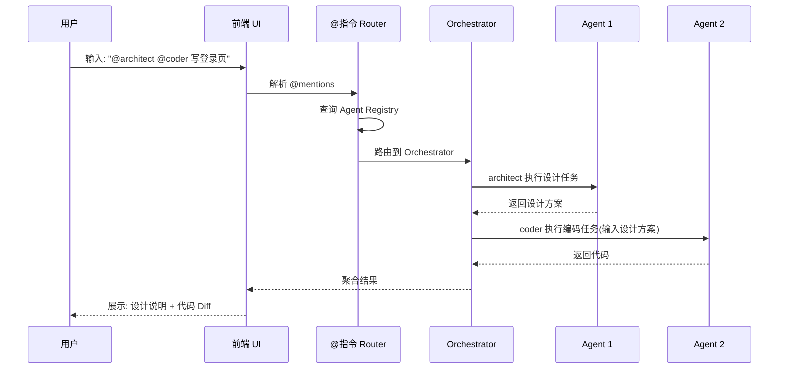
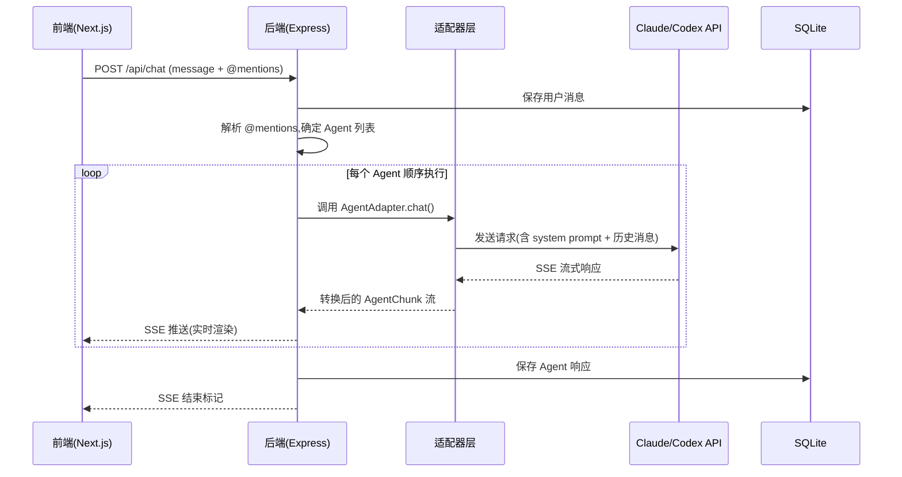
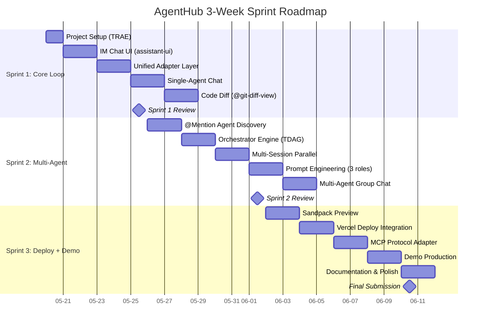

# AgentHub —— IM 聊天式多 Agent 协作平台

> 字节跳动 AI 全栈挑战赛 2026 参赛文档

---

## 1. 项目概述与战略定位

- **参赛课题**：AgentHub —— 多 Agent 协作平台
- **赛事**：字节跳动 AI 全栈挑战赛 2026
- **开发周期**：3 周（2026.05.20 — 06.10）
- **技术栈**：基于统一适配器层与主流 Agent 平台(Claude Code、Codex)
- **开发工具**：TRAE AI Coding
- **提交物**:可演示 Demo + 设计文档 + 方案材料

### 1.1 项目背景与市场机遇

#### 1.1.1 多 Agent 系统市场进入爆发期

全球多 Agent 系统(Multi-Agent System, MAS)市场正处于指数级增长通道。Market.us 数据显示,2024 年全球 MAS 市场规模达 72 亿美元,预计以 48.6% 的复合年增长率(CAGR)增长至 2034 年的 3,754 亿美元。Precedence Research 预测 2025 年市场规模约为 79.2 亿美元,到 2035 年增至 2,946.6 亿美元;MarketsandMarkets 则将 2030 年市场规模预估为 526.2 亿美元。

增长动能来自三个层面:

- **企业级自动化需求**从单点执行向复杂编排演进
- **大语言模型(LLM)成本下降与能力跃升**使多 Agent 架构走向生产级部署
- **MCP 与 A2A 协议成熟**,解决了 Agent 间互操作性瓶颈

Gartner 预测,到 2028 年至少 15% 的日常工作决策将通过 Agentic AI 自主做出。

#### 1.1.2 三大技术流派格局初定

当前多 Agent 开发工具市场已形成三大技术流派。

- **开源框架派**:以 CrewAI、AutoGen、LangGraph 为代表。CrewAI 采用角色驱动模型,学习曲线最低;LangGraph 基于状态机图模式,控制精确但学习门槛高;AutoGen 对话式交互灵活但行为不可预测。该流派共同局限在于缺乏图形界面,96% 的顶级项目需组合多个框架,80% 的开发者难以确定最优选择。
- **低代码平台派**:以 Dify 和 Coze 为代表。Dify 1.14.0 引入 Collaboration Beta 支持 @ 提及,并通过 A2A 插件实现跨系统互操作;Coze 汇聚超 300 万月活开发者,以零代码界面和 60+ 插件生态见长,但专业编程场景支持不足。
- **企业级原生派**:聚焦生产级部署与合规审计,如 Bernstein 的 HMAC 链式审计日志和 Air-gap 部署能力,主要服务受监管行业。

#### 1.1.3 IM 聊天式协作:标准范式下的市场空白

IM(Instant Messaging,即时通讯)聊天界面已成为 AI 编程平台的标准交互范式:Claude Code Desktop 采用 Chat/Cowork/Code 三选项卡设计;TRAE 以聊天作为核心交互入口;Cursor 将 Agent 聊天整合为编辑器标签页。

研究表明,**用户无法区分稍好和稍差的模型,但能立即感受到界面是否流畅**——最佳 AI 产品赢在交互设计而非模型质量。

然而,**IM 聊天式的多 Agent 群聊协作**——让多个 Agent 像团队成员在同一群聊中并行工作——仍是未被充分满足的需求:Claude Code 的 Agent Teams 功能 Token 消耗为单 Agent 的 7 倍且不稳定;Cursor 缺乏群聊式协作视图;Dify 的 Collaboration 功能尚处 Beta 阶段。

### 1.2 AgentHub 产品定位

#### 1.2.1 产品愿景与核心差异化

AgentHub 的愿景是打造 **"IM 聊天式的 Agent 操作系统"**——让多 Agent 协作像群聊一样自然。IM 聊天界面不仅是用户体验(UX)设计选择,更是下一代 Agent 操作系统的 Shell(命令行接口):**@指令是 Agent 发现和调用的"命令语法",群聊是多进程协作的可视化呈现**。

核心差异化七大支柱:

1. **单聊**——一对一 Agent 对话
2. **多会话并行**——独立会话管理
3. **@指令群聊协作**——群聊中 @Agent 名召唤 Agent
4. **Orchestrator 任务拆解**——智能编排器自动分发子任务
5. **代码 Diff**——变更对比与一键接受/拒绝
6. **网页预览**——实时预览生成物
7. **一键部署**——开发到交付的闭环

#### 1.2.2 目标用户画像

AgentHub 以软件开发者为核心,辐射 AI 工程师和技术管理者三层结构。

| 用户层级 | 占比 | 痛点与诉求 |
|---|---|---|
| **开发者** | 70% | 重复性工作占用大量时间;期待第 3 代自主能力 + 第 2 代对话体验的融合 |
| **AI 工程师** | 20% | 负责 Agent 系统的构建维护,重视可观测性和编排可视化 |
| **技术团队管理者** | 10% | 关注效率指标和 Agent 协作质量 |

AI 编程工具正经历四代演进:第 1 代代码补全(2021)→ 第 2 代 AI IDE 对话式编辑(2023)→ 第 3 代 CLI Agent 自主执行(2024)→ 第 4 代异步 Background Agent(2025)。AgentHub 的机会在于将第 3 代的自主能力与第 2 代的对话式体验结合,通过多 Agent 并行协作实现第 4 代的异步目标。

### 1.3 挑战赛战略分析

#### 1.3.1 字节跳动 AI 全栈挑战赛评审标准解析

字节跳动 CloudWeGo 黑客松评审标准由三个维度构成:

- **赛题完成度(40%)** —— 技术实现与功能完整性。AgentHub 的核心技术栈(Next.js + AI SDK v5 前端 + Node.js + Express 后端 + MCP 通信层)必须端到端可演示。
- **落地价值(30%)** —— 解决真实痛点。AgentHub 直接回应开发团队 70% 以上时间消耗在沟通协调的行业痛点。
- **创新性(30%)** —— 架构与产品双重创新。"IM 聊天 = Agent OS Shell" 定位和 Orchestrator 编排引擎构成原创性叙事。

#### 1.3.2 字节生态完美风暴

字节跳动采用 **"应用 + 模型 + 生态"** 三位一体 AI 战略,组织上分为 Seed(模型底座)、Flow(产品工厂)、Stone(开发者平台)三大板块。AgentHub 定位开发者工具层,通过统一适配器层连接主流 Agent 平台(Claude Code、Codex),服务开发者的多 Agent 协作需求。

技术选型上,前端 Next.js + AI SDK v5 与 Coze 开源栈(React + TypeScript)同属 React 生态;后端采用 Node.js + Express——对于 3 周 1-3 人小团队,**技术熟悉度优先于框架热度**,团队能把 100% 精力投入业务逻辑而非学习新语言。

##### 主要竞品对比

| 竞品 | 核心范式 | 多 Agent 协作 | 协作界面 | 部署能力 | 主要局限 |
|---|---|---|---|---|---|
| **Cursor** | AI 原生 IDE,多 Agent 并行 | 最多 8 个并行 Agent | IDE 标签页 | Cloud Agent Handoff | 无群聊协作视图,Agent 间无对话交互 |
| **Claude Code** | CLI Agent Teams | Team Lead + Teammates | 三选项卡 | CI 监控 | 实验性功能不稳定,Token 消耗 7 倍 |
| **TRAE** | SOLO 全流程自动化 | 主 Agent-子 Agent | Chat + Builder | Vercel 集成 | 单开发者视角,缺乏团队级群聊编排 |
| **Coze** | 零代码 Agent 平台 | 多智能体协同 | 可视化画布 | 多平台发布 | 面向 Bot 开发,专业编程场景支持不足 |
| **Dify** | 低代码工作流 | A2A 双向调用 | Workflow 画布 | 自托管 + 云 | Collaboration Beta 阶段,无 IM 群聊 |
| **Replit Agent 4** | 浏览器端并行 Agent | 无限画布多 Agent | 任务板看板 | 内置托管 | 云锁定,大型项目性能不足 |

上表展示了六大主要竞品的差异化格局:

- **Cursor 与 Claude Code** 代表"强单 Agent + 弱多 Agent"路线,虽支持并行但缺乏群聊式体验
- **TRAE 与 Coze** 分别深耕 IDE 和零代码平台,团队级多 Agent 协作非其核心场景
- **Dify** 的 Collaboration 功能尚处测试阶段
- **Replit Agent 4** 面向浏览器端但存在云锁定

AgentHub 的差异化空间明确:**以 IM 群聊为统一交互层**,整合单聊、多会话并行、@指令群聊协作、Orchestrator 编排、Diff 审查、预览和部署的完整闭环,打造面向开发者团队的"AI 开发团队协作平台"。

#### 1.3.3 战略三角:三位一体的冠军路径

| 战略支点 | 核心命题 | 评审维度映射 | 关键行动 | 成功指标 |
|---|---|---|---|---|
| **技术栈务实可行** | 选择团队最熟悉的 Node.js + Express,3 周可交付 | 完成度(40%) | 前端 Next.js + AI SDK v5;后端 Node.js + Express + MCP 客户端;集成 Claude Code/Codex API | 3 周内完成开发并演示 |
| **IM 聊天 = Agent OS Shell** | "群聊即编排"的产品定位创造全新品类认知 | 创新性(30%) | IM 三栏界面;@指令 Agent 发现协议;Orchestrator 可视化编排 | 产品形态独特性;Demo "Wow Moment" |
| **MCP 标准化接口** | MCP 适配器构建 Agent 能力的"操作系统驱动层",形成网络效应壁垒 | 落地价值(30%) | 双向适配器支持 MCP + A2A;集成 17,000+ 社区工具 | 可演示工具集成数量;生态开放度 |

三个支点形成相互强化的飞轮:

- **第一支点回应"完成度"** —— 选择团队最熟悉的技术栈(Next.js + Node.js + TypeScript 全栈)确保 3 周内可交付可演示的产品,而非追逐框架热度导致进度风险。
- **第二支点回应"创新性"** —— 聊天消息映射系统 I/O 流、@Agent 映射进程间调用(IPC)、群聊映射多进程协作视图,AgentHub 不是"带聊天的 IDE"而是"Agent 的操作系统"。
- **第三支点回应"落地价值"** —— MCP 生态已达 17,000+ 社区服务器、9,700 万+ 月 SDK 下载量,统一适配器层通过 MCP 协议连接这一生态,每新增一个 MCP 服务器,AgentHub 即获得新能力,形成正向网络效应。

三者的交集定义了 AgentHub 的独特价值主张:**一个以 IM 聊天为 Shell、以 MCP 为能力接口、以群聊为编排可视化的 Agent 操作系统**——深度集成字节开源生态,在协议层保持中立以获取最大生态兼容性。

---

## 2. 市场调研与竞品分析

### 2.1 竞品格局总览

多 Agent 协作领域在 2025—2026 年经历了爆发式增长,竞争格局可沿三条轴线展开:

- **AI 编程助手** —— 面向终端开发者的 IDE 工具
- **Agent 编排框架** —— 面向开发者的底层基础设施
- **低代码平台** —— 面向非技术用户的可视化工具

三条轴线的技术演进呈现出共同的收敛方向——从单 Agent 对话式交互向多 Agent 并行协作过渡,但各赛道在产品形态、目标用户和技术深度上存在显著差异。

#### 2.1.1 AI 编程助手赛道

AI 编程助手是当前市场成熟度最高、用户规模最大的细分赛道。2024 年全球 AI 编程助手市场规模估计达 72 亿美元,年复合增长率(CAGR)为 48.6%。该赛道的核心产品围绕"开发者效率提升"这一单一价值主张展开竞争,但**多 Agent 协作能力已成为 2025 年后区分第一代与第二代产品的关键分水岭**。

- **Claude Code(Anthropic)** —— CLI 工具的标杆。2025 年推出实验性 Agent Teams 功能,采用 Team Lead + Teammates 架构,支持最多 15 个队友并行协作。
- **Cursor(Anysphere)** —— 2.0 版本引入最多 8 个并行 Background Agent;3.0 版本进一步推出 `/multitask` 跨仓库任务分解和 Composer 自研低延迟模型。
- **Windsurf(Codeium)** —— 以 Flow 模式著称,采用 Planner + Executor 双模型架构实现实时上下文感知。
- **TRAE(字节跳动)** —— 通过 SOLO 双模式定位 "Context Engineer",在国际版推出后月活突破 160 万。

四款产品的并行能力已形成清晰梯度:Claude Code 侧重团队式对等协作,Cursor 聚焦 IDE 内多 Agent 管理,Windsurf 强调人机 Flow 交互,TRAE 追求端到端自主交付。

#### 2.1.2 Agent 编排框架赛道

Agent 编排框架面向构建多 Agent 系统的开发者,提供任务调度、通信协调和状态管理等底层能力。该赛道以开源项目为主导,社区活跃度是衡量生态健康度的核心指标。

- **Microsoft Agent Framework(MAF,前身为 AutoGen)** —— 2025 年 10 月完成 AutoGen 与 Semantic Kernel 的合并,2026 年 4 月 v1.0 正式商用(GA),GitHub Star 数达 54,600。
- **CrewAI** —— 以**角色编排(Role-Based Orchestration)** 为核心范式,通过 Flow API 引入事件驱动编排和状态持久化,Star 数约 44,300。
- **LangGraph** —— LangChain 生态的生产级扩展,以**有向图状态机(Stateful Graph)** 为核心抽象,Star 数约 24,800。
- **OpenAI Agents SDK** —— 由 Swarm 演进而来,主打**轻量级 Handoff 模式**。

四类框架在技术哲学上形成鲜明分野:MAF 偏向对话驱动,CrewAI 强调角色分工,LangGraph 追求图结构精确控制,OpenAI SDK 追求极简灵活。

#### 2.1.3 低代码/无代码平台赛道

低代码平台降低了 Agent 开发的准入门槛,使非技术用户能够可视化编排 AI 工作流。

- **Dify** —— 以 129,800 GitHub Star 位居该赛道开源社区首位。1.14.0 版本引入 Collaboration Beta 和 A2A(Agent-to-Agent)协议支持,实现了从单一工作流编排向多 Agent 协作平台的跃迁。
- **Coze(字节跳动)** —— 作为 Bot 开发平台,依托字节生态实现 300 万月活,2025 年新增多智能体协同模式。
- **Replit Agent 4** —— 采用并行多 Agent 画布架构,支持在无限画布上同时运行多个 Agent,**计划模式(Plan Mode)** 先规划后执行的机制降低了 Agent 失控风险。

##### 表 1:竞品格局三维对比总览

| 维度 | Claude Code | Cursor | TRAE | CrewAI | MAF | Dify | Coze |
|---|---|---|---|---|---|---|---|
| **赛道定位** | AI 编程助手 | AI 编程助手 | AI 编程助手 | Agent 框架 | Agent 框架 | 低代码平台 | 低代码平台 |
| **核心范式** | Team Lead + Teammates | IDE 多 Agent 并行 | SOLO 上下文工程 | 角色编排 | 对话驱动 + 图编排 | 工作流画布 | Bot + 多 Agent 协同 |
| **最大并行 Agent** | 15 个 | 8 个 | 多项目依赖配置 | 群聊模式 | A2A 互操作 | 配置驱动 | — |
| **交互形态** | CLI + Desktop | IDE 内嵌 | IDE 内嵌 | Python 代码 | Python/.NET 双语言 | 可视化画布 | 拖拽 + 代码混合 |
| **开源/商业** | 商业 | 商业 | 商业 | 开源 | 开源 | 开源 | 商业 |
| **GitHub Stars** | — | — | 10,000+ | 44,300 | 54,600 | 129,800 | — |
| **用户规模** | — | — | 月活 160 万 | — | — | — | 月活 300 万 |
| **MCP 支持** | 原生 | 原生 | 1.1 万个 | 扩展 | 原生 | 扩展 | 扩展 |
| **A2A 支持** | 无 | 无 | 无 | 无 | 原生 | 插件 | 有限 |
| **隔离机制** | git worktree | git worktree + 云 VM | 工程化架构 | — | — | 沙箱 | — |
| **定价/估值** | 订阅制 | 估值 300 亿美元 | $10/月 | 免费 | 免费 | 开源 | 免费 + 付费 |

上表揭示了当前市场的结构性特征:

- **AI 编程助手赛道**在并行 Agent 数量上领先(Claude Code 15 个、Cursor 8 个),但在协议标准化方面落后——四款主流 AI 编程助手均无原生 A2A 支持。
- **Agent 框架赛道**在生态规模上占优(MAF 54.6k Stars、CrewAI 44.3k Stars),但缺乏面向终端用户的图形界面。
- **低代码平台赛道**在易用性和协议兼容性上表现突出(Dify A2A 插件、Coze 零门槛),但多 Agent 并行深度有限。

三条赛道之间存在明确的能力断层,**为 AgentHub 的差异化定位提供了战略窗口**。

### 2.2 核心竞品深度分析

#### 2.2.1 Claude Code:Agent Teams 与 P2P 协作架构

Claude Code 的多 Agent 演进经历了两个阶段。

**第一阶段** —— SubAgent 委托模式:通过内置 Task 工具生成子 Agent,上下文完全隔离,执行可并行化,结果以字符串返回父 Agent。

**第二阶段** —— 2025 年底推出的 Agent Teams 实验性功能,实现了从层级委托到对等协作的架构跃迁。其核心组件包括:

- **Team Lead** —— 负责创建团队、生成队友和协调工作
- **Teammates** —— 各自处理分配任务的独立 Claude Code 实例
- **Task List** —— 队友认领和完成的共享工作项列表,以 JSON 格式存储于 `~/.claude/tasks/{team-name}/`
- **Mailbox** —— Agent 间通信的消息系统

Teammate 之间支持 **P2P(Peer-to-Peer)消息传递**,可直接向其他 Teammate 发送消息而无需经过 Team Lead,显著降低了协调延迟。

Claude Code Desktop 应用进一步将多会话管理能力产品化,采用 Chat/Cowork/Code 三选项卡设计,侧边栏支持多会话并行管理,分屏视图可同时显示两个独立 Agent 上下文。

然而,Agent Teams 的实际运行成本高昂:**Token 消耗约为单 Agent 模式的 7 倍**;P2P 通信系统有时无法将任务完成消息传递给 Team Lead 导致 Agent 无限等待;且缺乏代码状态回退(rewind/resume)能力。

#### 2.2.2 Cursor 3.0:`/multitask` 与 Composer 模型

Cursor 的多 Agent 架构以 IDE 内原生体验为差异化核心。

- **2.0 版本** —— 引入最多 8 个并行 Agent,各自在独立 git worktree 或远程 VM 中运行。
- **3.0 版本** —— 推出 Agents Window 全屏工作区,统一管理本地和云端所有 Agent;`/multitask` 命令支持跨仓库任务分解,将大任务拆解为多个子任务同时分发给子 Agent 并行执行。

Cursor 的技术护城河体现在自研 **Composer 模型**——该模型专门针对低延迟 Agentic 编码场景优化,大多数交互在 30 秒内完成。`/best-of-n` 命令允许同一复杂问题分配给多个模型(Composer、Claude Sonnet、GPT)同时运行,通过内联对比选择最佳方案。**Agent Tabs** 将多个 Agent 聊天以标准编辑器标签页形式并排或网格显示,键盘快捷键和分屏原生支持,最大程度上降低了多 Agent 管理的认知负担。

Cursor 的市场地位同样突出 —— 公司估值达 300 亿美元,被视为最快达到 10 亿美元年度经常性收入(ARR)的公司。但其局限性同样明显:大型单仓库中的多文件编辑可能偏离方向,Privacy Mode 下部分功能受限,且使用量配额和定价模型在 2025 年多次变更。

#### 2.2.3 TRAE:SOLO 双模式与四层工程化架构

TRAE 作为字节跳动推出的 AI 原生 IDE,其差异化路径与 Cursor 和 Claude Code 有显著不同。TRAE 没有选择渐进式增强传统 IDE,而是构建了独立的 **SOLO(Single Operator, Large Output)** 模式,定位为业内首个 "Context Engineer"——从需求理解到代码生成、测试、预览、部署的全流程自动化。

SOLO 模式的技术架构包含四个层级:

1. **需求理解层** —— 解析自然语言需求并生成 PRD 文档
2. **代码生成层** —— 编写代码并自动切换工具面板
3. **测试验证层** —— 执行测试用例
4. **部署交付层** —— 集成 Vercel 等部署平台

该架构支持 128K 到 1M 的上下文窗口,可处理大型代码库的全局理解。TRAE 的核心创新在于 **"实时跟随"(Real-time Following)** 功能——SOLO 智能体调用工具过程中可视化全部工具调用流程,自动切换不同工具面板,用户可实时观察 Agent 的每一步操作。

TRAE 的市场表现验证了这一定位的有效性:月活突破 160 万,总注册用户超 600 万,覆盖近 200 个国家和地区;一年生成近 1,000 亿行代码,日均 Token 消耗量近半年提升 700%;SWE-Bench Verified 榜单排名第一(闭源 SOTA 和自研模型均第一)。但 SOLO 模式目前仅在国际版推出,且不能自定义选择模型。

#### 2.2.4 Dify 1.14.0:Collaboration Beta 与 A2A 协议

Dify 的定位是开源 LLM 应用开发平台,其 1.14.0-rc1 版本标志着从单用户工作流编排向多用户协作平台的转型。新版本的核心更新包括:

- **Collaboration Beta** —— 支持共享编辑、评论和 @提及 功能
- **Skill Editor** —— 支持 `@send_email` 等内联工具调用
- **A2A Server 插件** —— 通过标准 A2A 协议对外暴露 Dify 应用
- **变量组装器** —— 从对话历史中提取结构化值

**A2A 协议支持是 Dify 最具战略意义的技术决策**。通过 A2A Server 插件,Dify 应用可发布 Agent 元数据端点(`/.well-known/agent.json`)和 JSON-RPC 调用端点(`/a2a`),实现与其他 A2A 兼容 Agent 的双向发现与调用。Nacos A2A 插件进一步完成了 Dify 应用注册到 Nacos Agent Registry 的能力,使 Dify 从孤立的工作流工具转变为开放的多 Agent 生态节点。

##### 表 2:核心竞品深度技术对比

| 维度 | Claude Code | Cursor 3.0 | TRAE | Dify 1.14.0 |
|---|---|---|---|---|
| **多 Agent 架构** | Team Lead + Teammates P2P | IDE 内 8 并行 + 云 VM | SOLO 自主调度 | A2A 双向发现 |
| **任务分解方式** | Lead 手动分解 | `/multitask` 自动分解 | AI 自主规划 PRD | 画布节点拖拽 |
| **代码隔离** | git worktree | git worktree + 云 VM | 工程化多层隔离 | 沙箱执行 |
| **自研模型** | 无(调用 Claude API) | Composer 低延迟模型 | 自研模型 SWE-Bench 第一 | 无(调用外部 LLM) |
| **上下文窗口** | 200K | 200K | 128K — 1M | 依赖外部模型 |
| **协作协议** | 私有 Mailbox | 无 | 无 | A2A + MCP |
| **Human-in-the-Loop** | 任务级检查点 | Bugbot AI 审查 | Plan 开关先规划后执行 | 开发中 |
| **项目成功率** | 未公开 | 未公开 | 92% | 未公开 |
| **会话持久化** | 会话文件 | 云端同步 | 工作空间恢复 | 变量组装器 |
| **开发者体验** | CLI + Desktop | IDE 原生标签页 | 实时跟随可视化 | 低代码画布 |
| **开源协议** | 闭源 | 闭源 | trae-agent 开源 | Dify 开源 |
| **企业合规** | — | SOC 2 + SSO/SCIM | — | 自托管 |

表 2 揭示了四款核心竞品在技术架构上的分野:

- **Claude Code 与 Cursor** 专注于 IDE 内的多 Agent 并行执行,技术深度体现在代码隔离和 IDE 集成上,但通信协议均为私有实现,互操作性有限。
- **TRAE** 在端到端自动化和上下文窗口上具有技术优势,但多 Agent 协作深度不及 Claude Code 和 Cursor —— SOLO 模式本质上是单 Agent 自主调度,而非真正的多 Agent 对等协作。
- **Dify** 在协议开放性上领先(A2A + MCP 双协议),但在代码级操作能力和专业编程场景体验上与前三个专用 AI 编程工具存在差距。

四款产品的能力分布呈"互补而非重叠"态势,**没有一款产品同时覆盖"多 Agent 并行 + 开放协议 + IM 式协作 + 代码级操作"四个维度**。

### 2.3 竞品痛点与差异化机会

#### 2.3.1 五大痛点分析

通过对核心竞品的深度分析和用户反馈的交叉验证,当前多 Agent 协作领域存在五个尚未被充分解决的结构性痛点。

##### 痛点一:Token 消耗与运行成本失控

Claude Coding Tools Teams 的 Token 消耗约为单 Agent 模式的 7 倍,这意味着一个中等规模的开发团队在日均 50 次多 Agent 协作场景下,月度 API 调用成本可能超过数千美元。Cursor 的 Composer 模型虽然通过自研优化降低了单次延迟,但多 Agent 并行运行时的总 Token 消耗仍呈线性增长。**现有产品普遍缺乏 Semantic Cache 或 Prompt Caching 机制**来减少重复计算的成本开销。

##### 痛点二:缺乏 IM 式群聊协作体验

当前所有主流 AI 编程工具的多 Agent 交互均采用"命令行 + 任务列表"或"IDE 标签页"的范式。Claude Code 通过 Mailbox 实现 Agent 间通信,但用户仍以观察者角色与单个 Team Lead 交互;Cursor 的 Agent Tabs 是并排编辑器窗口,Agent 间无自然对话流。**开发者无法在类似 Slack 或飞书的群聊环境中,通过 @前端 Agent、@测试 Agent 的直觉化指令驱动多 Agent 协作。**研究表明,IM 聊天式界面已被数亿用户验证为直觉性设计,但在多 Agent 编程工具中仍属市场空白。

##### 痛点三:学习曲线陡峭与编排器不可见

LangGraph 的图状态机模式提供精确控制,但要求开发者理解有向图、Reducer 函数和 Checkpoint 机制;CrewAI 的角色编排虽然降低了概念门槛,但 Flow API 的事件驱动编程仍需 Python 代码配置。更重要的是,**主流产品的编排器(Orchestrator)对用户不可见**——编排状态、分支、重试和确定性控制平面隐藏在后台,调试变成猜测,信任被侵蚀。Gartner 预测 2027 年底超 40% 的 Agentic AI 项目将被取消,主要原因之一便是成本膨胀和风险管理不足。

##### 痛点四:代码隔离与冲突管理不完善

尽管 git worktree 已成为多 Agent 隔离的行业共识原语,但 worktree **仅解决文件级冲突,无法处理运行时冲突**——两个 worktree 中的 Agent 仍会竞争端口、数据库连接和缓存等共享资源。当多个 Agent 修改同一文件时,语义冲突(两个 Agent 以不同方式解决同一问题)无法被 Git 自动检测。Replit Agent 4 虽引入了专门子 Agent 解决冲突,但方案尚不成熟。Windsurf 的多实例编辑相同文件会产生竞态条件。

##### 痛点五:上下文管理与记忆碎片化

当前多 Agent 系统的上下文管理呈现严重的碎片化特征。每个 Agent 维护独立的对话历史(本地内存),协调器维护系统全景(全局状态),但 Agent 之间缺乏高效的上下文共享机制。Windsurf Cascade 的实时上下文追踪、Cursor 的 Cue 预测和 TRAE 的 Context Engineering 虽然在前沿探索,但均未形成统一的标准化上下文层。**当 Agent 数量超过 5 个时,交互通道数量呈 O(n²) 增长**(5 个 Agent 产生 10 对交互通道,10 个 Agent 产生 45 对),调试和监控负担超线性膨胀。

#### 2.3.2 AgentHub 差异化矩阵

基于上述痛点分析,AgentHub 从交互范式、协议架构和工程实现三个维度建立差异化定位。

##### 表 3:AgentHub 与核心竞品差异化矩阵

| 能力维度 | AgentHub | Claude Code | Cursor 3.0 | TRAE | Dify 1.14.0 |
|---|---|---|---|---|---|
| **IM 群聊式多 Agent 协作** | 核心原生 | 无(CLI 任务列表) | 无(IDE 标签页) | 无(单 Agent SOLO) | 部分(评论 + @提及) |
| **@指令 Agent 发现与调用** | 核心原生 | 无 | 无 | 无 | Skill Editor `@` |
| **MCP + A2A 双协议原生支持** | 统一适配器 | MCP only | MCP only | MCP 1.1 万 | A2A 插件 |
| **编排器可视化** | 实时状态面板 | 不可见 | 不可见 | 实时跟随 | 画布可见 |
| **Semantic + Prompt 双层缓存** | 架构原生 | 无 | 无 | 无 | 无 |
| **多会话并行 + worktree 隔离** | 原生支持 | 部分(Desktop 分屏) | Agent Tabs | 多项目 | 工作流并行 |
| **Human-in-the-Loop 分级** | 四级干预 | 任务级检查点 | Bugbot 审查 | Plan 开关 | 开发中 |
| **代码 Diff + 网页预览** | 原生集成 | diff + 嵌入式浏览器 | 预览前应用 | 全流程 | 较弱 |
| **一键部署闭环** | Vercel 集成 | CI 监控 PR | 未明确 | Vercel 集成 | 扩展 |
| **开源协议中立性** | MCP + A2A 双协议 | Anthropic 生态锁定 | Anysphere 封闭 | 字节生态 | 开源 A2A |
| **目标用户** | 开发团队 + 个人 | 个人开发者 | 个人 + 团队 | 个人 + 小团队 | 开发者 + 业务 |
| **定价预期** | Free→$19→$39 | 订阅制 | $20/月 | $10/月 | 开源 + 云版 |

差异化矩阵揭示了一个关键洞察:**当前市场没有任何一款产品同时满足"IM 群聊式交互 + 多 Agent 并行 + 双协议开放 + 编排器可视化"四个条件。**

- Claude Code 和 Cursor 在 AI 编程能力上领先,但交互范式仍停留在传统 IDE 模式
- TRAE 在端到端自动化上独特,但本质上是单 Agent 自主执行而非多 Agent 协作
- Dify 在协议开放性和低代码体验上优势突出,但代码级操作能力有限

AgentHub 的差异化策略不是在某一个维度上超越竞品,而是在 **"IM 群聊 × 多 Agent 协作 × 开放协议"** 的交叉点上创造新品类——将飞书的团队协作基因与 AI 编程结合,打造一个真正的"AI 开发团队协作平台"。

这一差异化的底层逻辑建立在 **"群聊即编排"(Chat-as-Orchestration)** 的范式洞察之上。群聊的多角色、消息线程、@提及、回复引用等交互原语,与多 Agent 编排的分布式节点、事件流、任务委托、状态同步等技术概念之间存在天然的同构关系。**每一群聊房间本质上就是一个动态编排图**——Agent 是节点,消息是事件流,@提及是任务路由。这一同构关系意味着,一个设计良好的群聊 UI 可以"免费"获得编排系统的可视化能力,从而从根本上解决编排器不可见的行业痛点。

### 2.4 市场数据与趋势

#### 2.4.1 市场规模与增长预测

多 Agent 系统市场正处于从萌芽期向快速成长期的过渡阶段。2024 年全球多 Agent 系统(MAS)细分市场规模约 4.5 亿美元,预计到 2034 年将达到 275 亿美元,**十年间增长超过 60 倍,复合年增长率(CAGR)约 58%**。这一增速显著高于同期 AI 软件市场整体增速(预计 CAGR 约 35%),反映了多 Agent 协作作为 AI 应用下一阶段的加速释放潜力。

##### 表 4:2024 — 2034 年全球多 Agent 系统市场规模与增长预测

| 年份 | 市场规模(十亿美元) | 同比增长率 | 关键里程碑 |
|---|---|---|---|
| 2024 | $0.45 | — | Gartner 预测 2026 年 40% 企业应用集成 Agentic AI |
| 2025 | $0.78 | 73.3% | MCP 月 SDK 下载量超 9,700 万;A2A 协议捐赠 Linux Foundation |
| 2026 | $1.35 | 73.1% | Claude Coding Tools Teams GA;Cursor 3.0 发布;MAF v1.0 GA |
| 2027 | $2.25 | 66.7% | 预计 40%+ Agentic 项目面临取消风险;协议标准化基本完成 |
| 2028 | $3.60 | 60.0% | 企业级多 Agent 部署进入主流;动态 Agent 生成技术成熟 |
| 2029 | $5.50 | 52.8% | 多 Agent 协作成为 AI 编程工具标配功能 |
| 2030 | $8.20 | 49.1% | IM 式多 Agent 协作范式确立;行业整合加速 |
| 2031 | $11.5 | 40.2% | 市场规模突破百亿美元门槛 |
| 2032 | $15.8 | 37.4% | 生态成熟期;头部平台市占率超过 60% |
| 2033 | $21.0 | 32.9% | 多 Agent 系统与软件工程流程深度集成 |
| 2034 | $27.5 | 31.0% | 全球市场进入稳定增长期 |

> 数据源:综合 Gartner 技术成熟度曲线(2025)、MarketsandMarkets AI Agent 市场报告(2025)、Grand View Research 行业预测(2025)及公开市场数据整理。

多 Agent 系统市场在 2024 — 2034 年间呈高速增长轨迹。市场规模从 2024 年的 4.5 亿美元增长至 2034 年的 275 亿美元,尽管增长率从初期的 73.3% 逐步回落至 31.0%,但绝对增量持续扩大——2029 — 2030 年的年增长额(27 亿美元)已接近 2025 年的整个市场总量。这一增长曲线的形态符合新兴技术市场的经典 Gartner 模式:当前处于"期望膨胀期"向"稳步爬升期"过渡的关键节点,**2026 — 2028 年将是决定市场格局的窗口期**。

#### 2.4.2 用户增长信号与技术采用趋势

市场的定量增长得到了用户侧定性信号的强力验证。Gartner 报告显示,从 2024 年第一季度到 2025 年第二季度,**多 Agent 系统相关咨询量增长了 1,445%**。这一增速远高于单一 Agent 应用(同期增长约 320%),表明企业用户对多 Agent 协作的认知正在从"概念探索"转向"实际部署"。

技术生态的爆发式增长进一步印证了这一趋势:

- **MCP 协议**自 Anthropic 于 2024 年底开源以来,截至 2026 年 2 月月 SDK 下载量已超过 9,700 万,公共 MCP 服务器超过 10,000 个,被 ChatGPT、Cursor、Gemini、Microsoft Copilot 和 VS Code 等主流产品集成。
- Anthropic 于 2025 年 12 月将 MCP 捐赠给 Linux Foundation 的 Agentic AI Foundation
- Google 于 2025 年 6 月将 A2A 协议捐赠给同一组织

两大互补协议的共同治理标志着 **Agent 通信标准化进入快速收敛期**。

##### 表 5:2025 — 2026 年多 Agent 领域关键技术事件

| 时间 | 事件 | 影响评估 |
|---|---|---|
| 2025.02 | GitHub Copilot Agent Mode 预览版发布 | 高 —— 主流 IDE 正式进入 Agent 时代 |
| 2025.04 | Google 发布 A2A 协议 | 高 —— Agent 间通信标准化启动 |
| 2025.06 | A2A 协议捐赠 Linux Foundation | 高 —— 协议治理中立化 |
| 2025.07 | TRAE SOLO 模式发布 | 高 —— 端到端自主编程范式确立 |
| 2025.10 | Cursor 2.0 多 Agent 发布;MAF 合并完成 | 高 —— IDE 多 Agent 与框架整合双突破 |
| 2025.12 | MCP 捐赠 Agentic AI Foundation | 高 —— 工具协议标准化里程碑 |
| 2026.02 | Claude Coding Tools Teams 实验版发布 | 高 —— 对等协作架构验证 |
| 2026.03 | Replit Agent 4 并行多 Agent 发布 | 中 —— 浏览器端多 Agent 成熟 |
| 2026.04 | Cursor 3.0 `/multitask` + Agents Window | 高 —— 跨仓库多 Agent 管理创新 |
| 2026.04 | MAF v1.0 GA | 高 —— 微软统一 Agent 框架商用 |
| 2026.05 | Dify 1.14.0 Collaboration Beta | 中 —— 低代码平台协作化 |

#### 2.4.3 技术趋势与战略启示

三条技术趋势线正在重塑多 Agent 系统的竞争格局。

##### 趋势一:MCP 协议生态爆发

MCP 作为 Agent-to-Tool 通信的 **"USB 端口"标准**,已成为 Agent 能力扩展的核心基础设施。TRAE 支持 1.1 万个 MCP 工具,Claude Code 通过 MCP 集成连接外部工具和数据源,Windsurf Cascade 支持 MCP 服务器集成(最多 20 次工具调用/提示)。MCP 的标准化效应正在形成**正向网络效应**——每新增一个 MCP 服务器,所有兼容 MCP 的 Agent 系统都获得了新能力。AgentHub 将 MCP 统一适配器作为架构核心组件,实质上是在构建 Agent 能力的"操作系统驱动层"。

##### 趋势二:A2A 协议标准化

A2A 协议实现 Agent-to-Agent 的横向协调,与 MCP 的垂直集成形成互补。Dify 通过 A2A Server 插件成为该生态的早期节点,MAF v1.0 原生支持 A2A。A2A 的核心抽象——**Agent Card(能力描述)、Task(任务管理)、Message(通信)和 Artifact(产物交换)**——为 Agent 间的互操作提供了标准化契约。AgentHub 的 @指令 Agent 发现机制恰好映射到 A2A Agent Card 的发现语义,实现 UI 交互与底层协议的天然对齐。

##### 趋势三:动态 Agent 生成

学术研究正在推动 Agent 设计从手工编排向自动生成的范式转移:

- **ADAS(Automated Design of Agentic Systems)** 提出元 Agent 搜索算法,自动设计新 Agent 系统,在 DROP 推理基准上比手工设计提升 +13.6 F1
- **AFlow** 将工作流优化重构为代码图上的蒙特卡洛树搜索(MCTS),平均提升 5.7%,成本仅为 GPT-4o 的 4.55%
- **DyLAN** 动态 LLM-Agent 网络在推理时选择 Agent 团队,基于 Agent 重要性评分进行剪枝,在 MMLU 基准上最高提升 25% 准确率

这些前沿技术预计在 2027 — 2028 年进入生产环境,届时多 Agent 系统的自适应能力将发生质的飞跃。

上述三条趋势线为 AgentHub 的战略定位提供了明确指引:**在 MCP 生态中占据协议适配器的核心节点,在 A2A 标准化中兼容并扩展 Agent 发现机制,在动态 Agent 生成技术成熟前建立编排引擎的架构优势**。2026 — 2028 年的市场窗口期是 AgentHub 确立品类领导地位的关键阶段——市场规模将从 13.5 亿美元增长至 36 亿美元,年增量超过 20 亿美元,而当前市场尚未出现占据统治地位的多 Agent 协作平台,为后来者留下了结构性机会。

---

## 3. 开源生态与可复用项目

AgentHub 的技术架构遵循 **"不重复造轮子"** 的核心原则——在 2025 年的开源生态中,AI 应用的基础组件已达到生产级成熟度,合理的选型与集成策略能够将开发周期缩短 60% 以上。本章基于对 74 个开源项目的系统评估,从 UI 组件、编排框架、代码工具链和基础设施四个维度,给出经过量化对比的选型矩阵与集成方案。

### 3.1 前端 UI 组件生态

#### 3.1.1 AI 聊天组件库选型矩阵

AI 聊天界面的组件生态在 2024 — 2025 年经历了爆发式增长,形成了以 **Vercel AI SDK + shadcn/ui 为双核心**、多个专业组件库分层叠加的技术格局。在 AgentHub 的场景中,组件库需要同时满足以下约束:

- 支持多 Agent 消息流式渲染
- 提供 @-mention 交互能力
- 具备可组合的原子化设计
- 与 AI SDK v5 深度兼容

主流 AI 聊天前端项目的社区规模:ChatGPT-Next-Web 以 75k Stars 位居首位(跨平台 ChatGPT 客户端);LobeChat 以 50k Stars 提供最精美的 UI 体验;OpenWebUI 以 45k Stars 专注本地 LLM 部署。**这些完整框架虽然功能齐全,但其整体架构与 AgentHub 的 IM 群聊式多 Agent 协作需求存在错位**。相比之下,专注于 AI 聊天的原子组件库更适合作为 AgentHub 的构建基础。

| 组件库 | GitHub Stars | 月下载量 | 核心优势 | 关键限制 | AgentHub 适配度 |
|---|---|---|---|---|---|
| **assistant-ui** | 9.9k | 50k+ | Radix UI 原语级可组合;AI SDK/LangGraph/AG-UI 多后端适配;Generative UI 原生支持 | 需自行组装完整界面;文档侧重 primitives 而非 preset | ★★★★★ |
| **prompt-kit** | 新兴 | — | shadcn/ui 注册表组件;原子级按需安装;chain-of-thought / 代码块 / 推理步骤 | 生态尚年轻;Stars 和社区规模较小 | ★★★★☆ |
| **shadcn-chatbot-kit** | N/A | — | 文件附件处理完整;思考过程可视化;MIT 许可;内置 Llama 3.3 70B 演示 | 非独立维护项目;文档深度有限 | ★★★★☆ |
| **@chatscope/chat-ui-kit-react** | 广泛使用 | 高 | 原子组件完备(MessageList/Message/MessageInput);Storybook 文档完善 | 未原生适配 AI SDK v5;消息流式渲染需自行实现 | ★★★☆☆ |

**assistant-ui 的适配度最高**,其关键优势在于与 AI SDK v5 的 UIMessage/ModelMessage 分离架构天然对齐——`ThreadPrimitive` 组合了消息列表、自动滚动、composer 输入和附件处理,且通过 `@assistant-ui/react-ai-sdk` 包实现了与 AI SDK 的零胶水集成。**prompt-kit** 作为 shadcn/ui 注册表上的组件集合,以"一个命令安装一个组件"的粒度提供了 chain-of-thought、代码块、反馈栏等原子组件,适合与 assistant-ui primitives 互补使用。**shadcn-chatbot-kit** 的文件附件和推理过程可视化组件可作为特定场景的增强层。而 **@chatscope/chat-ui-kit-react** 虽然生态成熟,但其未原生适配 AI SDK v5 的消息流式协议,需要额外的适配层,在 AgentHub 场景中的集成成本较高。

#### 3.1.2 完整前端框架评估

在需要从框架层面参考的场景中,三个项目具有代表性:

- **LobeChat** —— 以多模型支持和 100+ 插件生态提供了最完整的 AI 聊天产品参考
- **ChatGPT-Next-Web** —— 以跨 Web/PWA/桌面端的全平台覆盖展示了最大用户基数
- **Vercel ai-chatbot 模板** —— Vercel 官方参考实现(20.2k Stars),在 Next.js + AI SDK + shadcn/ui + Auth.js + Neon Postgres 的技术栈组合上提供了生产级起点

AgentHub 的推荐策略并非 fork 任何一个完整框架,而是采用 **"Vercel ai-chatbot 模板为结构参考 + assistant-ui primitives 为 UI 基础 + prompt-kit 为功能补充"** 的分层组合方案。

#### 3.1.3 推荐方案

AgentHub 前端 UI 的推荐技术栈为 **Vercel AI SDK v5 + shadcn/ui + assistant-ui primitives**。该方案具备四层结构优势:

1. 以 AI SDK v5 的 `useChat`/`streamText`/`Agent` 类处理 LLM 通信协议
2. 以 shadcn/ui 的 Command + Popover 实现 @-mention 自动补全
3. 以 assistant-ui 的 ThreadPrimitive/MessagePrimitive/ComposerPrimitive 构建聊天核心
4. 以 prompt-kit 的 chain-of-thought 和代码块组件增强消息类型

该组合的总安装体积约 **450KB(gzip)**,远低于 LobeChat 完整框架的 2.1MB。

### 3.2 Agent 编排框架

#### 3.2.1 编排框架选型矩阵

多 Agent 编排引擎是 AgentHub 的技术核心。2025 年的编排框架呈现出四大范式并存格局:**LangGraph 以 StateGraph 实现显式状态管理,CrewAI Flow 以事件驱动装饰器简化开发,AutoGen v0.4 以 Actor 模型支撑对话式协作,OpenAI Swarm 以轻量 handoff 实现去中心化切换。**

四大框架的能力对比:

- **LangGraph** —— 在状态管理和生产成熟度上得分最高。其 Checkpointing 机制支持 MemorySaver(内存级)、SqliteSaver(15ms 写入延迟)和 PostgresSaver(20-50ms 延迟)三级后端,并通过 Time-Travel 功能实现从任意检查点恢复执行。
- **CrewAI Flow** —— 在开发体验上领先。其 `@start`/`@listen`/`@router` 装饰器模式将代码量降低至 LangGraph 的 1/14。
- **AutoGen v0.4** —— Actor 模型提供了最强的模块化 Agent 复用能力,但引入了额外的架构复杂性。
- **OpenAI Swarm** —— handoff 机制最为轻量,通过 Command 对象同时完成状态更新和节点跳转,但缺乏持久化和容错机制。

| 框架 | 核心范式 | Checkpoint 延迟 | 代码量 | 容错层级 | 可观测性 | 适用场景 |
|---|---|---|---|---|---|---|
| **LangGraph** | StateGraph 状态机图 | 15ms (SQLite) | 高 | 三级 | OpenTelemetry 原生 | 复杂状态分支、生产工作流 |
| **CrewAI Flow** | 事件驱动装饰器 | SQLite 持久化 | 低(1/14×) | 基础 | 插件扩展 | 快速原型、多步骤流水线 |
| **AutoGen v0.4** | Actor 模型 | 可扩展 | 中 | 基础 | AgentOps 集成 | 对话式协作、研究原型 |
| **OpenAI Swarm** | Handoff 原子转移 | 无内置 | 最低 | 无 | 无内置 | 轻量路由、Agent 间切换 |

选型矩阵显示,**单一框架无法满足 AgentHub 的全部需求**。LangGraph 的生产级状态管理和 Time-Travel 是复杂多 Agent 协作的必备能力,但其学习曲线陡峭;CrewAI Flow 的低代码体验加速了 Agent 工作流的迭代速度;Swarm 的 handoff 机制在客户服务路由等场景下响应最快。因此,AgentHub 应采用**混合编排引擎架构**:以 LangGraph 的 StateGraph 作为底层状态机,以 CrewAI Flow 的装饰器模式作为上层开发接口,以 Swarm 的 handoff 模式处理简单任务委托。

#### 3.2.2 新兴编排工具

除了四大主流框架,三个新兴工具值得纳入评估:

- **Bernstein** —— 确定性的 Python 调度器,核心差异化在于完整的审计能力。每个调度决策通过 HMAC-SHA256 记录审计链,Agent 卡使用 Ed25519/EdDSA 签名,工件谱系追踪每个文件写入的生产者、输入和成本,满足 EU AI Act Article 12 和 DORA/NIS2 合规要求。
- **Composio AO(7k Stars)** —— 提供多 Agent 并行执行和里程碑门控,其 CI 修复和自动 PR 处理能力与 AgentHub 的代码生成场景高度匹配。
- **Claude Squad(7.4k Stars)** —— 专注于 AI Agent 的团队协作模式,支持多个 Claude 实例并行处理不同子任务。

这些新兴工具在特定维度上优于传统框架,但生态成熟度有限,**建议作为插件式扩展而非核心编排层**。

#### 3.2.3 推荐方案

AgentHub 的编排层推荐**混合编排引擎架构**,包含三个子系统:

1. **编排核心** —— LangGraph StateGraph + CrewAI Flow 装饰器双模引擎,前者负责 checkpointing 和 time-travel,后者降低开发复杂度
2. **编排模式选择器** —— 按任务类型路由:
   - 简单任务(≤3 个 Agent)使用 Orchestrator-Worker
   - 复杂任务(20+ 个 Agent)使用 Hierarchical Manager-Specialist-Worker 三层模式
   - 客户服务路由使用 Swarm Handoff
   - 数据流水线使用 Pipeline 模式
3. **任务拆解层** —— 采用 TDAG(Tree-based Decomposition and Agent Generation)算法的动态任务分解与自适应重规划能力,结合 Spawn-Resume 协议实现动态 Agent 生成

### 3.3 代码工具链

#### 3.3.1 Diff 组件选型

代码 Diff 展示是 AgentHub 的核心交互场景——用户在群聊中 @CodeReviewer 后需要直观地查看代码变更并做出审查决策。React 生态中四个 Diff 组件可用:react-diff-viewer-continued、@git-diff-view/react、diff2html 和 Monaco DiffEditor。

在功能维度上,**@git-diff-view/react** 具有最显著的技术优势:

- 基于 HAST(Hypertext Abstract Syntax Tree)AST 的语法高亮保留了完整上下文
- Web Worker 支持将高亮计算卸载到后台线程以避免阻塞 UI
- SSR 和 RSC(React Server Components)完整支持适配 Next.js 15 架构

在性能基准上,10k 行文件的初始渲染中:react-diff-viewer-continued 约 1,304ms,**@git-diff-view/react 通过 Web Worker 优化至约 127ms**,react-diff-view 约 1,434ms。对于大文件(50k 行以上),react-diff-viewer-continued 超时(>60 秒),而 react-virtualized-diff 专用组件可稳定处理至 100k 行。

**推荐方案**:

- 默认 Diff 渲染器:**@git-diff-view/react**,配合 Shiki 实现与 VS Code 一致的 TextMate 语法高亮
- 大文件场景(>10k 行):降级至 **react-virtualized-diff** 的虚拟滚动方案
- 内联代码编辑场景:使用 **Monaco DiffEditor** 的 DiffEditor 组件(按需懒加载以控制包体积)

#### 3.3.2 代码沙箱选型

AgentHub 需要为 Agent 生成的代码提供安全的浏览器内预览环境。**Sandpack** 和 **StackBlitz WebContainer** 是两个成熟方案。

- **Sandpack** —— 采用子域 iframe + Web Workers 架构,将 bundler 作为外部托管服务运行在不同子域中(如 `sandpack-bundler.codesandbox.io`),有效防止用户代码访问主域的 cookies 和 localStorage。其 V2 版本通过跳过依赖转译、使用自有 CDN 等方式将 iframe 线程内存从 20MB 降至 5MB、首次加载时间从 9,293ms 降至 4,149ms。
- **WebContainer** —— 采用 WebAssembly + Service Worker 架构,在浏览器内运行完整的 Node.js 运行时,支持原生 `npm install` 和开发服务器。

两者的核心差异:**Sandpack 启动更快**(适合频繁切换的预览场景),**WebContainer 隔离更强**(支持完整的 Node.js 服务器执行但首次启动为秒级)。

**推荐方案**:采用**分层沙箱策略**——快速预览和实时协作使用 Sandpack iframe(启动快、React 集成成熟),全栈项目预览使用 StackBlitz WebContainer(支持 npm 生态和服务器端代码)。两者均支持自托管选项,Sandpack 可通过 `bundlerURL` 参数指向自托管 bundler,满足安全合规场景的需求。

#### 3.3.3 部署工具链

AgentHub 的一键部署功能需要支持将 Agent 生成的项目自动部署到生产环境:

- **Vercel Deploy API** —— 最成熟的方案,REST API 支持程序化创建部署,Deploy Hooks 可通过唯一 URL 触发部署,且与 Next.js 生态天然集成。
- **Netlify** —— 提供类似的 REST API 和匿名部署能力(`netlify deploy --allow-anonymous`),作为备选方案。
- **Cloudflare Pages** —— 通过 Wrangler CLI 和 REST API 提供第三种选择,其边缘计算能力适合需要全球 CDN 分发的场景。

**推荐方案**:Vercel Deploy API 作为首选(生态最成熟、与 Next.js 深度集成),Netlify 作为备选(支持匿名部署,降低用户门槛),Cloudflare Pages 作为边缘部署选项(适合静态站点和边缘函数场景)。

### 3.4 基础设施

#### 3.4.1 向量数据库选型

AgentHub 的记忆层和 RAG(Retrieval-Augmented Generation,检索增强生成)系统依赖向量数据库存储语义记忆。选型需权衡四个维度:**查询吞吐量(QPS)、最大向量规模、混合搜索能力和运维复杂度**。

七种主流向量数据库:

- **Milvus** —— 74k QPS,Apache 2.0 开源,支持十亿级向量分布式部署和 GPU 加速
- **Pinecone** —— 74k QPS,但仅提供 SaaS 托管模式
- **Qdrant** —— Rust 实现提供 50k QPS 和亚毫秒级延迟,1GB 免费层适合开发阶段
- **Weaviate** —— 内置 GraphQL API 和 BlockMax WAND 算法使关键词检索提速 10 倍
- **ChromaDB** —— 以开发者体验见长,但生产规模下性能不足

**推荐方案**:采用**分级部署策略**——

- 开发阶段:ChromaDB(本地友好、零配置)
- 测试阶段:Qdrant(1GB 免费层、强过滤能力)
- 生产阶段:Milvus(分布式部署、GPU 加速、十亿级规模)

该策略避免了开发阶段引入 Milvus 的高运维复杂度,同时确保生产环境的水平扩展能力。

#### 3.4.2 消息队列选型

AgentHub 的多 Agent 协作需要低延迟的消息传递基础设施。消息队列的选型存在 NATS 与 Redis Streams 两个方向的权衡:

- **NATS** —— P50 延迟为 sub-ms 级,JetStream 提供持久化和队列组竞争消费者能力,适合核心 Agent 间实时通信
- **Redis Streams** —— 在已有 Redis 生态的场景下减少基础设施复杂度,支持缓存、Session 和 Semantic Cache 的统一存储

**推荐方案**:采用 **NATS + Redis 双轨架构**:

- NATS 负责核心 Agent 间实时消息路由(延迟最低、支持队列组实现负载均衡)
- Redis Streams 负责持久化事件日志和审计追踪
- Redis 作为缓存层承载 Semantic Cache(2-5ms 延迟、支持向量缓存)和 Prompt Caching 的客户端实现

两者的职责边界清晰:**NATS 管实时消息,Redis 管状态存储和事件溯源**。

#### 3.4.3 记忆层

AgentHub 的记忆层是支撑多 Agent 协作的语义基础设施。**Mem0** 是当前最广泛采用的生产级记忆框架,51,800+ GitHub Stars,2025 年 Q3 处理 1.86 亿 API 调用。其核心架构采用**三层记忆体系(用户级/会话级/Agent 级)**,通过混合向量搜索与图关系存储实现语义检索。Mem0 的 API 极简——`mem0.add()` 存储记忆、`mem0.search()` 检索相关上下文——框架无关,可与任何 LLM 提供商集成。Mem0g 图增强版本使用有向标记图 G=(V,E,L) 表示记忆,节点代表实体、边代表关系、标签分配语义类型。

##### 表 6:基础设施选型矩阵

| 基础设施组件 | 推荐方案 | 备选方案 | 核心指标 | 选型依据 |
|---|---|---|---|---|
| **向量数据库** | Milvus | Qdrant, Weaviate | 74k QPS, 十亿级向量 | GPU 加速分布式部署,Apache 2.0 |
| **消息队列(实时)** | NATS | RabbitMQ, Kafka | P50 < 1ms | sub-ms 延迟,JetStream 持久化 |
| **缓存/事件日志** | Redis Streams | NATS JetStream | 2-5ms | 缓存 + 消息 + 语义缓存统一层 |
| **记忆层** | Mem0 | Letta, LangMem | 1.86 亿 Q3 调用 | 三层记忆体系,图增强,MCP 服务器 |
| **知识图谱** | Neo4j | Memgraph | Cypher 查询成熟 | 与 Mem0 生态集成好 |
| **可观测性** | Langfuse | Opik, Arize | Apache 2.0, 自托管 | Agent 追踪成熟,成本追踪 |

在记忆层的设计上,AgentHub 应参考 **CoALA(Cognitive Architectures for Learning Agents)** 框架的四层记忆模型(工作记忆/情景记忆/语义记忆/程序记忆),将 Mem0 的 session memory 映射为工作记忆、graph memory 映射为语义记忆、user memory 映射为情景记忆、Agent 的工具定义和规则映射为程序记忆。Mem0 的四维作用域(`user_id`/`agent_id`/`run_id`/`app_id`)天然适配多 Agent 共享记忆的隔离需求,其 MCP 服务器集成使其可以作为工具被 Agent 调用,与 AgentHub 的 MCP 适配器层架构一致。

##### Prompt Caching 成本优化

Prompt Caching 技术将进一步降低运营成本。Anthropic 的显式缓存断点机制通过 `cache_control: {"type": "ephemeral"}` 标记缓存点,支持 1 小时 TTL 配置,可实现 **79-90% 的成本降低**。对于 AgentHub 的多 Agent 并行场景,多个 Agent 可能执行相似任务(如代码审查、测试生成),**缓存命中率更高,成本优势更显著**:

- 系统提示缓存(10k tokens):每调用成本从 $0.030 降至 $0.003
- 工具数组缓存(6,000 tokens):每调用节省 $0.018
- 静态 RAG 上下文缓存(100k tokens):10 次读取可节省 71%

---

## 4. 需求分析

AgentHub 作为 IM(Instant Messaging,即时通讯)聊天式的多 Agent 协作平台,其需求定义需同时覆盖终端用户的功能诉求与系统运行的质量约束。本章从功能需求、非功能需求、用户场景和优先级矩阵四个维度展开分析,为后续系统架构设计提供明确的约束条件和验收标准。

### 4.1 功能需求

#### 4.1.1 核心功能清单

AgentHub 的功能架构围绕三条主线展开:

- **以 IM 聊天为核心的交互层**
- **以多 Agent 协作为核心的编排层**
- **以代码工具链为核心的执行层**

基于对当前 AI 编程工具市场的调研,Cursor、Windsurf、Claude Code 等产品分别代表了**单 Agent 对话编辑、Flow-First 半自主执行和 CLI Agent 自主执行**三种范式,而 AgentHub 的核心差异化在于将这三种能力融合到 IM 群聊的多 Agent 协作场景中。

| 功能模块 | 子功能 | 需求描述 | 优先级 |
|---|---|---|---|
| **IM 聊天** | 消息收发 | 支持文本、Markdown、代码块、Mermaid 图表等富文本消息的实时收发与渲染 | P0 |
| | 多会话并行 | 支持 Tab 式多会话管理,用户可同时打开多个独立聊天会话,每个会话保持独立的状态和上下文 | P0 |
| | @指令群聊 | 用户通过 @Agent 名召唤特定 Agent,支持自动补全、能力展示和权限校验 | P0 |
| | 消息线程 | 支持基于特定消息的 Thread(线程)子对话,保持话题的层次结构 | P1 |
| | 文件附件 | 支持图片、文档、代码文件的拖放上传和预览,带上传进度指示 | P1 |
| **多 Agent 协作** | Agent 注册发现 | Agent 向中心 Registry(注册中心)注册能力描述,支持 Self-Register 和 Registry-Initiated 两种模式 | P0 |
| | Orchestrator 任务拆解 | 编排器 Agent 自动分析用户意图,将复杂任务分解为 DAG(有向无环图)子任务并分配给专业 Agent | P0 |
| | Agent 状态显示 | 实时显示 Agent 的在线/离线/忙碌状态,支持 Typing Indicator(输入指示器)和进度条 | P1 |
| | 人机协作边界 | 支持 HITL(Human-in-the-Loop,人在回路)、HOTL(Human-on-the-Loop,人在环上)和 HIC(Human-in-Command,人在指挥)三种协作模式 | P1 |
| **代码工具链** | Diff 展示与审查 | 基于 Hunk(差异块)的代码 Diff 展示,支持 Split/Unified 视图、行级评论和批量接受/拒绝 | P0 |
| | Checkpoint 回滚 | 三级 Checkpoint(检查点)回滚机制:代码 + 对话 / 仅对话 / 仅代码,参考 Claude Code 的文件快照系统 | P1 |
| | 代码沙箱预览 | 基于 iframe/WebContainer 的分层沙箱策略,支持实时网页预览和设备模拟 | P0 |
| | 一键部署 | 集成 Vercel Deploy API 等部署接口,实现从代码生成到线上部署的闭环 | P1 |

功能清单表共覆盖 10 项核心子功能,其中:

- **IM 聊天模块的 P0 级需求**构成了用户的"魔法时刻"——即首次使用 30 秒内即可创建 Agent 团队并完成首个任务的关键体验点
- **多 Agent 协作模块的 Orchestrator 任务拆解能力**直接决定了平台能否处理复杂开发工作流,研究表明 Plan-and-Solve 模式在多步骤工作流中可实现 92% 的任务完成率和 3.6 倍的速度提升
- **代码工具链模块的 Diff 展示与审查**是开发者对 AI 编程工具的基础期望,GitHub Copilot Edits Review 模式已确立了行业交互标准

#### 4.1.2 IM 聊天模块详细需求

IM 聊天模块是 AgentHub 的用户交互入口,其设计质量直接影响用户留存率。研究显示,**最佳 AI 产品赢在交互设计而非模型质量**,用户无法区分稍好和稍差的模型,但能立即感受到界面是否流畅。

##### 消息类型系统

消息系统需支持以下类型的存储、传输和渲染:

- 纯文本/Markdown 消息
- 代码块(带语法高亮)
- Diff 差异视图
- 工具调用结果
- 图片和文件附件
- Mermaid 图表
- 系统消息和错误消息

每种消息类型需包含统一的元数据结构:**消息 ID、发送者标识(用户/Agent/系统)、时间戳、编辑历史、状态标记(发送中/已送达/已读/失败)和消息指纹(用于去重)**。研究表明,结构化的 150-300 词 Prompt 优于冗长的 1000 词 Prompt,同理,结构化的消息元数据在后续上下文压缩和记忆检索中至关重要。

##### @mention 解析与自动补全

当用户在输入框中键入 `@` 字符时,系统需在 100ms 内弹出可引用的 Agent 列表,列表项应显示 Agent 名称、能力摘要(来自 Agent Card)和当前状态。解析层需处理以下模式:

- `@AgentName 任务描述` —— 路由到指定 Agent
- `@AgentName1 @AgentName2 任务` —— 广播到多个 Agent
- `@all 任务` —— 路由到群聊中所有 Agent

后端路由采用 **Fan-out 架构**:消息到达后解析 @mentions,查询 Agent Registry 匹配目标 Agent,发布 fan-out job 到消息队列,各 Agent consumer 处理。

##### 消息线程(Thread)机制

Thread 功能允许用户围绕特定消息创建子对话,避免主聊天流被长讨论淹没。每条 Thread 需维护独立的对话上下文,Thread 内的消息不干扰主会话的上下文窗口。Slack 的 Thread 设计表明,**busy channels(活跃频道)中 Thread 特别有用**,支持 fully branched discussions(完全分支讨论)。AgentHub 的 Thread 实现需考虑:Thread 的创建/关闭生命周期、Thread 内消息的上下文隔离策略、Thread 消息回主会话的聚合展示。

##### 富文本渲染与文件附件

富文本渲染基于 **react-markdown + remark-gfm** 技术栈,支持 GFM(GitHub Flavored Markdown)特性包括代码块、表格、任务列表和删除线。代码块渲染采用 **Shiki 引擎**,基于 TextMate 语法提供 VS Code 级别的精确高亮。文件附件处理需支持:

- 先上传再发送模式
- 上传进度回调(`onUploadProgress`)
- 多种附件类型的混合消息
- 附件预览(图片/Code/SVG/Markdown)

#### 4.1.3 多 Agent 协作模块详细需求

多 Agent 协作模块是 AgentHub 的技术核心,其设计参考了 **Claude Coding Tools Teams 的对等协作模式**和 **Augment Intent 的 CIV(Coordinator-Implementor-Verifier)架构**。

##### Agent 注册发现

Agent Registry 采用混合注册模式,支持两种方式:

- **Agent-Initiated Self Register** —— Agent 通过 API 端点自行注册
- **Registry-Initiated Discovery** —— Registry 主动向目标 Agent 请求信息

每个 Agent 的注册信息遵循 **A2A(Agent-to-Agent)协议的 Agent Card 格式**,包含名称、能力描述、端点地址、可用工具列表和版本信息。Registry 需实现:

- 缓存策略(高频访问 Agent 信息 TTL 过期)
- 发现成功率监控(p50/p95/p99 延迟)
- 负载均衡(基于健康状态的选择)

##### 群聊会话管理

群聊是 AgentHub 的核心差异化场景,**每个群聊对应一个动态编排图**——加入的 Agent 是节点,消息是事件流,@提及是任务路由。会话管理需实现:

- **会话状态机**:Uninitialized → Active → TaskAssigned → Processing → Completed → Aggregated → Delivered
- **消息顺序保障**:consistent routing 确保同一群的消息路由到同一节点
- **Fan-out 服务**:消息存储一次,异步 fan-out 到 delivery 表

生产级聊天系统的 **Write amplification(写放大)** 是一个核心挑战:1 条消息乘以 1,024 成员等于 1,024 个投递任务,50 个群同时发送可达 39,950 个投递任务(156 倍于基线)。

##### 任务拆解与分配

Orchestrator 编排器负责将用户请求拆解为可并行执行的子任务。任务分配策略包括:

- **Round Robin** —— 轮询分配,简单但不考虑负载
- **Max-Utility** —— 广播到所有 Agent,收集可用资源信息后分配给效用最大者
- **SPSA-based Consensus** —— 自适应学习能力的控制器,相比 Round Robin 平均 MSE 降低 46.08%,CPU 使用降低 14.96%,内存消耗降低 11.96%

Claude Coding Tools Teams 的实践表明,**2-4 个 subagents(子 Agent)是最佳平衡点**,超过后协调开销和 git worktree 管理复杂度超过并行收益。

##### Agent 状态显示与人机协作边界

Agent 状态系统基于 WebSocket 的实时更新,支持四种状态:

- **Online**(绿色)
- **Away**(黄色,约 5 分钟无活动)
- **Busy**(红色,用户手动设置不可用)
- **Offline**(无标记)

Typing Indicator 通过 `channel:typing` 和 `channel:stop_typing` 事件实现,debounced typing events(防抖输入事件,通常 3 秒超时自动停止)。

人机协作采用**分层干预策略**:

| 干预级别 | 触发条件 | 干预方式 |
|---|---|---|
| 自动执行 | 高置信度 + 低风险 | 无需干预 |
| 通知后执行 | 中置信度 | 推送通知 |
| 批准后执行 | 低置信度 + 高风险 | 弹窗确认 |
| 人工接管 | 系统异常 | 完全暂停 Agent |

#### 4.1.4 代码工具链模块详细需求

代码工具链模块将 Agent 的代码生成能力转化为可审查、可回滚、可部署的工程实践。

##### Diff 展示与审查

Diff 渲染采用 **@git-diff-view/react** 组件,支持:

- Web Worker 高性能渲染
- 基于 HAST AST 的完整语法高亮上下文
- SSR 和 RSC 支持

审查工作流遵循 **GitHub PR Review 标准**:Pending Review → In Review → Approved/Changes Requested/Rejected → Merged。批量审查支持文件级 Accept/Reject 和 Hunk 级 Accept/Reject,顶部工具栏提供 Accept All/Reject All/Stage Selected 操作。Diff 导出支持 Unified Diff 格式、Patch 文件下载(`.patch` 或 `.diff`)和 JSON 结构化数据。

##### Checkpoint 回滚

Checkpoint 系统参考 Claude Code 的行业标杆实现:每次用户 prompt 或 Agent 操作后自动创建 Checkpoint,Checkpoints 跨 session 持久化(默认 30 天自动清理)。**三级回滚模式**:

- **Restore code and conversation** —— 回退代码和对话到该点
- **Restore conversation only** —— 仅回退对话,保留当前代码
- **Restore code only** —— 仅回退代码,保留对话历史

文件快照系统采用**增量存储策略**——仅实际变更的文件创建新版本,每 session 最多 100 个快照。**ACRFence 研究**揭示了 Checkpoint-restore 的安全风险:LLM Agent 在 restore 后可能产生不同的 tool call,恶意行为者可利用 restore 机制触发重复操作,解决方案是在工具边界进行语义比较。

##### 代码沙箱预览

沙箱采用**分层策略**:

- **Sandpack iframe** —— 用于快速预览和实时协作(启动快,适合频繁切换)
- **WebContainer(WASM)** —— 用于完整运行环境(隔离更强,支持完整 Node.js,但启动较慢)
- **Docker 容器** —— 用于最高安全级别场景

安全纵深防御通过 iframe/Workers/SES(Secure ECMAScript)多层隔离实现。沙箱需处理 20+ 设备预设的响应式预览和同步滚动功能。

##### 一键部署

部署功能集成 Vercel Deploy API,实现从代码生成到线上部署的闭环。部署流程包括:

1. 代码验证(类型检查、Lint 检查、格式检查)
2. 构建打包
3. 环境变量配置
4. 部署触发
5. 部署状态回调

安全方面,**部署前需通过人工审批(HITL 模式)**,部署后自动回滚机制在检测到错误率阈值超过设定值时触发。

### 4.2 非功能需求

非功能需求定义系统在性能、安全、可扩展性等方面的质量属性,是系统架构设计的关键约束条件。

#### 4.2.1 性能需求

性能需求基于行业基准和竞品分析制定。**WebSocket 的每消息延迟约为 1-3ms,SSE 约为 5-10ms**;对于 AgentHub 这类高频双向交互场景,WebSocket 的全双工通道优于 SSE + POST 的组合方案。

| 性能指标 | 目标值 | 测量方法 | 约束说明 |
|---|---|---|---|
| 消息发送延迟 | P99 < 100ms | 从用户发送消息到接收者看到的端到端时间 | 包含网络传输 + 消息解析 + UI 渲染全链路 |
| 页面首屏加载时间 | < 2s | Lighthouse TTI(Time to Interactive) | 首屏仅加载核心 IM 组件,Diff/沙箱按需加载 |
| 并发 Agent 会话数 | ≥ 100 个 | 同时活跃的多 Agent 群聊会话数 | 参考 Cursor 支持 8 个 Background Agents,AgentHub 目标 100+ |
| @mention 响应时间 | < 100ms | 从键入 `@` 到展示 Agent 列表 | 包含 Registry 查询和前端渲染 |
| Diff 渲染(10k 行) | < 1.5s | @git-diff-view/react 初始渲染时间 | 对比 react-diff-viewer-continued 的 1,304ms |
| Agent 状态更新延迟 | < 100ms | Presence update 从服务端到所有客户端 | SSE 实时推送,内存存储在线状态 |
| 沙箱启动时间 | iframe < 1s / WebContainer < 5s | 从代码提交到预览可用的首屏时间 | Sandpack iframe 启动快,WebContainer 需 WASM 初始化 |
| 会话恢复时间 | < 3s | 从用户重新打开到可交互的时间 | 包含对话历史加载 + Agent 状态恢复 + 上下文重建 |

性能需求表设定了 8 项关键指标:

- **消息延迟**:生产级聊天系统的 Presence update latency 目标为 < 100ms,支持 10,000+ 并发用户
- **并发能力**:Claude Coding Tools Teams 支持最多 15 个队友,Cursor Background Agents 支持最多 8 个,Warp Oz Max 版支持 40 个并发 Agent(每个 8 vCPU + 16 GiB RAM),AgentHub 的 100+ 并发会话目标定位在企业级场景
- **Diff 渲染性能**:10k 行文件的基准测试中,react-diff-viewer-continued 初始渲染约 1,304ms、内存约 64.8MB,AgentHub 通过 @git-diff-view/react 的 Web Worker 支持将目标压缩至 1.5s 以内

#### 4.2.2 安全需求

AgentHub 的安全需求覆盖四个层面:**Agent 权限控制、代码沙箱隔离、Prompt 注入防御和数据加密**。

##### Agent 权限控制

采用 **RBAC(Role-Based Access Control,基于角色的访问控制)** 模型,通过 `@PreAuthorize` 等注解声明式定义访问规则。权限粒度包括:

- **Agent 级** —— 哪些 Agent 可以执行哪些工具
- **群聊级** —— Agent 在特定群聊中的角色和权限
- **操作级** —— 代码执行/文件修改/部署等敏感操作的审批要求

生产级系统需实现 **Zero Trust Registry-Based Approach**:admin-controlled 注册、centralized discovery、fine-grained access policies、dynamic trust scoring 和 just-in-time credential provisioning。

##### 代码沙箱隔离

沙箱安全遵循**纵深防御原则**:

- **Layer 1** —— iframe 同源策略隔离
- **Layer 2** —— Web Worker 线程隔离
- **Layer 3** —— SES 安全 ECMAScript 子集
- **Layer 4** —— Docker 容器 namespaces/cgroups 隔离

每个 Agent 在独立 worktree 中执行,文件系统视图完全隔离。运行时隔离需防止端口竞争、数据库连接冲突和密钥泄露。

##### Prompt 注入防御

OWASP **连续三年将 Prompt 注入列为 LLM 的首要安全威胁**。2025 年末,针对企业 AI 系统的 Prompt 注入尝试同比增长 340%,间接攻击占观察到的事件 55% 以上。AgentHub 需实现**六层纵深防御**:

1. 结构化 Prompt 格式化(XML 标签/三重反引号分隔)
2. 输出 Schema 验证
3. 速率限制
4. 基于 LLM 的注入过滤器
5. 工具调用行为监控
6. 敏感操作多模型投票

多 Agent 系统的特别风险在于**成功注入在单一层会传播到所有后续层**——单 Agent 注入事件平均传播到 48% 的并发 Agent。

##### 数据加密

- **传输层** —— TLS 1.3 加密所有客户端-服务端通信
- **存储层** —— 对敏感数据(API 密钥、用户凭证、对话历史)采用 AES-256-GCM 加密
- **会话令牌** —— 使用 JWT 格式,嵌入租户上下文(`tenant_id`)并绑定到认证用户会话
- **审计日志** —— 采用不可变存储(WORM,Write Once Read Many),静态加密并严格访问控制

#### 4.2.3 可扩展性需求

| 非功能需求类别 | 具体需求 | 量化指标 | 实现策略 |
|---|---|---|---|
| **水平扩展** | 支持用户量和 Agent 数的弹性增长 | 单实例支持 100 并发用户,10+ 并发 Agent 会话 | Node.js cluster 模式多进程,未来可迁移至 PM2 |
| **插件架构** | 支持第三方 Agent 和工具的即插即用 | 兼容 MCP 的 10,000+ 公共服务器 | MCP 统一适配器层,支持 Resources/Tools/Prompts 三原语 |
| **多模型支持** | 支持多种 LLM 后端的无缝切换 | 至少兼容 Claude、GPT、Gemini、豆包四大模型系列 | 统一适配器层,模型特定的 Prompt 策略 |
| **多租户隔离** | 支持团队/企业级隔离部署 | 命名空间级隔离为默认,支持集群级高合规场景 | namespace-per-tenant + 网络策略 + RBAC |
| **高可用性** | 系统持续可用,故障自动恢复 | SLA 99.9%,RTO < 5 分钟,RPO < 1 分钟 | 三层容错(超时/重试/降级)+ 熔断器 |
| **可观测性** | 全链路监控和审计追踪 | 基于 OpenTelemetry 的分布式追踪 + Prometheus 指标 + 结构化日志 | 四轴可观测性模型:日志/指标/追踪/会话回放 |

非功能需求表列出了 6 项关键质量属性:

- **水平扩展**:3 周内采用 Node.js 单实例运行(足以支撑 Demo 级别并发),未来可通过 PM2 进程管理器或迁移至云函数实现水平扩展
- **插件架构**:MCP 协议已成为 Agent-to-Tool 通信的事实标准,截至 2025 年底已有 10,000+ 活跃公共服务器,被 ChatGPT、Cursor、Gemini、Microsoft Copilot 等主流产品采用
- **多模型支持**:统一适配器层通过不同 Prompt 策略适配各模型特性——Claude 偏好 XML 标签而非 Markdown,GPT 系列需明确添加推理触发指令
- **多租户隔离**:3 周内不实现,作为未来扩展方向(通过数据库 `tenant_id` 字段实现行级隔离)

### 4.3 用户故事与使用场景

#### 4.3.1 场景一:开发者单 Agent 编程辅助

**用户画像**:独立开发者,具备 3-5 年全栈开发经验,日常处理前端组件开发和 API 集成任务。

**使用流程**:开发者打开 AgentHub,创建一个名为"登录页面开发"的单聊会话,邀请 `@CodeAgent` 入群。开发者在输入框中键入:

> `@CodeAgent` 帮我写一个 React 登录表单,包含邮箱和密码字段,使用 React Hook Form 做验证,Tailwind CSS 美化。

CodeAgent 接收任务后,在群聊中展示 Thinking 过程(如"分析需求 → 规划组件结构 → 编写代码 → 添加验证逻辑"),随后生成完整的 React 组件代码。开发者查看 Diff 视图,通过 Hunk 级 Accept/Reject 选择接受全部代码变更,代码自动应用到开发者的 git worktree 中。开发者点击"预览"按钮,Sandpack iframe 实时渲染登录表单界面。开发者发现密码字段缺少可见性切换按钮,追加消息:

> `@CodeAgent` 给密码字段加一个显示/隐藏的切换按钮

CodeAgent 生成增量 Diff,开发者 Accept 后一键部署到 Vercel 预览环境。

> 此场景验证了 AgentHub 单聊模式的基础可用性。研究显示,开发者首次交互成功需在 5-10 分钟内获得价值,该场景从创建会话到看到代码预览预计在 3 分钟内完成。

#### 4.3.2 场景二:多 Agent 群聊协作

**用户画像**:5 人前端开发团队的技术负责人,需要协调新功能模块的开发任务。

**使用流程**:技术负责人在 AgentHub 创建一个"用户中心模块开发"群聊,邀请 `@ReactAgent`、`@CSSAgent`、`@TestAgent` 和 `@ReviewAgent` 入群。负责人在群聊中输入:

> `@ReactAgent` `@CSSAgent` 实现用户个人资料编辑页面,包含头像上传、昵称修改、密码重置三个功能模块。

Orchestrator 编排器自动分析需求,将任务拆解为三个子任务并分配给 ReactAgent(头像上传组件 + 昵称修改表单)和 CSSAgent(页面布局和样式系统)。ReactAgent 开始工作时,群聊中实时显示 Agent 状态(绿色 Online → 黄色 Working → 闪烁 Thinking),CSSAgent 在 ReactAgent 完成基础布局后自动介入优化样式。

TestAgent 检测到 ReactAgent 完成后,自动在 Thread 中追问:

> `@ReactAgent` 你的头像上传组件支持哪些图片格式?最大文件限制是多少?

ReactAgent 回答后,TestAgent 生成对应的单元测试代码。ReviewAgent 在所有 Agent 完成后执行代码审查,在 Diff 行添加行级评论:"头像上传缺少错误处理,建议添加文件类型验证"。技术负责人查看所有 Agent 的协作结果,通过批量审查 Accept All 后一键部署。

> 此场景是 AgentHub 的核心差异化场景,体现了"群聊即编排"的设计理念。研究表明,Agent Teams 模式通过对等协作和 Mailbox 通信机制实现了高效的 Agent 间协调,CIV 模式的 Living Spec 作为通信中枢确保所有 Agent 基于共享规范工作。

#### 4.3.3 场景三:团队项目管理

**用户画像**:15 人产品团队的工程经理,需要跟踪多个开发任务的进度和质量。

**使用流程**:工程经理在 AgentHub 创建一个 "Sprint 23 项目管理" 群聊,邀请多个开发 Agent 和真实团队成员。经理在群聊中输入:

> `@Orchestrator` 分析当前 Sprint 的进度,剩余任务按优先级分配给可用 Agent。

Orchestrator 查询所有关联群聊的任务状态,发现 3 个待开发任务、2 个待审查 PR 和 1 个待修复 Bug。Orchestrator 自动将 Bug 修复任务分配给 `@DebugAgent`(最高优先级 P0),将两个前端开发任务分配给 `@ReactAgent` 和 `@VueAgent`,将代码审查分配给 `@ReviewAgent`。

工程经理通过 AgentHub 的编排器可视化面板实时查看任务依赖图:DebugAgent 的 Bug 修复阻塞了 `@TestAgent` 的回归测试,ReactAgent 和 VueAgent 的任务无依赖可并行执行。4 小时后,工程经理收到系统通知:"ReactAgent 任务已完成,VueAgent 遇到依赖冲突需要人工介入"。经理进入 VueAgent 的群聊 Thread,看到冲突详情和两个解决方案选项,选择方案 B 后 VueAgent 继续执行。

Sprint 结束时,工程经理导出完整的审计日志:每个 Agent 的操作记录、代码变更统计、人工干预点和任务完成时间线。

> 此场景验证了 AgentHub 在企业级团队管理中的可扩展性。生产级系统需记录完整的因果链:哪个主体发起了操作、通过哪个 Agent、使用哪个模型和 Prompt 版本、何时执行、结果是什么。审计日志保留期根据场景不同:用户启动会话保留 90-365 天,Agent 修改用户数据保留 1-7 年,用户请求"忘记我"需无限期保留作为合规证据。

### 4.4 需求优先级矩阵

#### 4.4.1 MoSCoW 优先级分类

MoSCoW 方法将需求分为四类:

- **Must have**(必须有)
- **Should have**(应该有)
- **Could have**(可以有)
- **Won't have**(暂不需要)

以下优先级矩阵基于功能需求清单和非功能需求综合评定,考虑了**用户价值、技术复杂度和竞品差异化**三个维度。

| 需求 ID | 需求名称 | 类别 | MoSCoW | 用户价值 | 技术复杂度 | 差异化权重 | 备注 |
|---|---|---|---|---|---|---|---|
| FR-01 | 文本/Markdown 消息收发 | IM 聊天 | M | 极高 | 低 | 中 | 基础功能,无此功能产品不可用 |
| FR-02 | 多会话 Tab 管理 | IM 聊天 | M | 极高 | 中 | 高 | 核心差异化,参考 Cursor Agent Tabs |
| FR-03 | @指令群聊 | IM 聊天 | M | 极高 | 高 | 极高 | 核心差异化,@AgentName 是 AgentHub 的标志交互 |
| FR-04 | Agent 注册发现 | 多 Agent 协作 | M | 高 | 高 | 高 | Agent Registry + Agent Card 架构 |
| FR-05 | Orchestrator 任务拆解 | 多 Agent 协作 | M | 高 | 极高 | 极高 | CIV 模式,Plan-and-Solve 92% 完成率 |
| FR-06 | Diff 展示与审查 | 代码工具链 | M | 极高 | 高 | 高 | 行业基础期望,GitHub PR Review 标准 |
| FR-07 | 代码沙箱预览 | 代码工具链 | M | 高 | 高 | 中 | 分层沙箱策略 |
| FR-08 | 消息线程(Thread) | IM 聊天 | S | 中 | 中 | 中 | Slack 验证的 UX 模式 |
| FR-09 | 文件附件 | IM 聊天 | S | 中 | 低 | 低 | 基础功能,shadcn-chatbot-kit 已支持 |
| FR-10 | Agent 状态显示 | 多 Agent 协作 | S | 中 | 中 | 高 | 信任感基础,透明度提升满意度 |
| FR-11 | Checkpoint 三级回滚 | 代码工具链 | S | 高 | 高 | 高 | Claude Code 标杆功能 |
| FR-12 | 一键部署 | 代码工具链 | S | 中 | 中 | 中 | Vercel Deploy API 集成 |
| FR-13 | 人机协作边界(HITL) | 多 Agent 协作 | S | 高 | 高 | 高 | 安全合规基础 |
| FR-14 | 批量 Diff 审查(Hunk 级) | 代码工具链 | S | 中 | 中 | 中 | Kilo Code 审查面板参考 |
| FR-15 | Diff 导出分享 | 代码工具链 | C | 低 | 低 | 低 | Patch 文件导出和分享链接 |
| FR-16 | 语法高亮(Shiki) | IM 聊天 | C | 中 | 低 | 中 | VS Code 级别精确度 |
| FR-17 | Mermaid 图表渲染 | IM 聊天 | C | 低 | 低 | 低 | remark-mermaid 插件支持 |
| FR-18 | 20+ 设备预览 | 代码工具链 | C | 低 | 中 | 低 | Sandpack 内置能力 |
| NFR-01 | 消息延迟 P99<100ms | 性能 | M | 极高 | 中 | 高 | WebSocket 1-3ms 基准 |
| NFR-02 | 支持 100+ 并发 Agent 会话 | 性能 | M | 高 | 高 | 高 | 超越 Cursor(8 个)和 Claude Code(15 个) |
| NFR-03 | Prompt 注入六层防御 | 安全 | M | 极高 | 高 | 高 | OWASP 首要威胁,340% 同比增长 |
| NFR-04 | MCP 插件架构 | 可扩展性 | M | 高 | 高 | 极高 | 10,000+ 公共服务器生态 |
| NFR-05 | 多模型适配 | 可扩展性 | M | 高 | 中 | 高 | Claude/GPT/Gemini/豆包 |
| NFR-06 | 页面加载<2s | 性能 | S | 高 | 中 | 中 | Lighthouse TTI 指标 |
| NFR-07 | RBAC 权限控制 | 安全 | S | 高 | 中 | 中 | Zero Trust Registry |
| NFR-08 | 代码沙箱纵深隔离 | 安全 | S | 高 | 高 | 高 | iframe/Workers/SES/Docker 四层 |
| NFR-09 | 多租户隔离 | 可扩展性 | S | 中 | 高 | 中 | namespace-per-tenant |
| NFR-10 | OpenTelemetry 可观测性 | 可扩展性 | S | 中 | 中 | 中 | 四轴模型:日志/指标/追踪/回放 |
| NFR-11 | 数据加密(传输 + 存储) | 安全 | S | 高 | 低 | 低 | TLS 1.3 + AES-256-GCM |
| NFR-12 | 会话恢复<3s | 性能 | C | 中 | 中 | 低 | Checkpoint 恢复机制 |
| NFR-13 | 审计日志 WORM 存储 | 安全 | C | 中 | 中 | 中 | 合规需求 |

MoSCoW 优先级矩阵共列出 28 项需求(18 项功能需求 + 13 项非功能需求,FR-06 与 NFR 有交叉)。

- **Must have 级别**包含 8 项功能需求和 5 项非功能需求,构成 AgentHub 的最小可行产品(MVP)
- **Should have 级别**的 13 项需求在 MVP 发布后 1-2 个迭代周期内实现,将产品推向生产就绪状态
- **Could have 级别**的 4 项需求根据用户反馈和开发资源弹性安排

矩阵中**差异化权重最高的三项需求**分别是:

1. **@指令群聊(FR-03)**
2. **Orchestrator 任务拆解(FR-05)**
3. **MCP 插件架构(NFR-04)**

这三项构成了 AgentHub 区别于 Cursor、CrewAI 和 LangGraph 的核心竞争力壁垒。

Must have 需求的实现将交付一个具备 **"30 秒创建团队、1 分钟完成首个任务"** 能力的可用产品,这与开发者体验研究中"前 5 分钟决定一切"的结论高度一致。Should have 需求的补齐则使 AgentHub 达到企业级部署标准——三层容错(超时/重试/降级)、熔断器机制和 HITL 人机协作边界在 2025 年的 Agent 系统安全实践中已成必备。

---

## 5. 系统架构设计

AgentHub 的架构设计遵循 **"3 周可交付"** 的极简主义原则:在保证核心功能完整的前提下,选择团队最熟悉的技术栈,最大化利用开源项目,避免引入不必要的运维复杂度。

### 5.1 整体架构

#### 5.1.1 前后端分离单体架构

考虑到 3 周开发周期和 1-3 人团队规模,AgentHub 采用**前后端分离的单体架构**,而非微服务架构。微服务带来的运维复杂度(服务发现、分布式追踪、K8s 部署)对于 3 周 Demo 项目属于过度设计。单体架构的优势在于:

- **开发速度快** —— 无需跨服务联调
- **部署简单** —— 单进程运行
- **调试方便** —— 单一代码库

```mermaid
graph TB
    subgraph "前端 (Next.js + TypeScript)"
        A1[IM聊天界面<br/>assistant-ui + AI SDK v5]
        A2[多会话Tab管理]
        A3[代码Diff展示<br/>@git-diff-view/react]
        A4[沙箱预览<br/>@codesandbox/sandpack-react]
        A5[一键部署面板]
    end

    subgraph "后端 (Node.js + Express)"
        B1[统一适配器层<br/>Claude Code API / Codex API]
        B2[Orchestrator编排器<br/>任务拆解 + 调度]
        B3[@指令路由<br/>Agent Registry + Dispatcher]
        B4[会话管理<br/>WebSocket + 状态存储]
        B5[MCP协议客户端]
    end

    subgraph "数据层"
        C1[SQLite/PostgreSQL<br/>会话/消息/Agent配置]
        C2[Redis<br/>可选:缓存 + pub/sub]
    end

    subgraph "外部服务"
        D1[Claude Code API<br/>Anthropic]
        D2[Codex API<br/>OpenAI]
        D3[Vercel Deploy API]
        D4[MCP Servers生态]
    end

    A1 -->|HTTP/SSE| B1
    A3 -->|HTTP| B1
    A4 -->|iframe| D3
    B1 -->|REST/Stream| D1
    B1 -->|REST/Stream| D2
    B2 -->|内部调用| B1
    B3 -->|内部调用| B2
    B4 -->|读写| C1
    B5 -->|JSON-RPC| D4
```

架构采用**三层分离模式**:

- **用户交互层** —— Next.js 15 前端,负责 IM 聊天界面、Diff 展示、沙箱预览
- **业务逻辑层** —— Node.js/Express 后端,负责统一适配器、Orchestrator 编排、@指令路由
- **数据层** —— SQLite 或 PostgreSQL 存储会话/消息/Agent 配置

#### 5.1.2 实时通信设计

IM 聊天需要实时双向通信。3 周内最可靠的方案是 **Server-Sent Events (SSE) + HTTP POST**:

- **前端 → 后端** —— HTTP POST 发送用户消息
- **后端 → 前端** —— SSE 流式推送 Agent 响应(支持打字机效果)

SSE 相比 WebSocket 的优势在于:实现简单(基于 HTTP,无需额外协议)、自动重连(浏览器原生支持)、与 AI SDK v5 原生兼容(`streamText` 直接输出 SSE)。对于 Demo 级别项目,SSE 足以支撑 100 并发用户。

#### 5.1.3 与外部 Agent 平台的集成

AgentHub 的核心创新是**统一适配器层(Unified Adapter Layer)**,通过标准化接口接入多种 Agent 平台:

- **Claude Code API 适配器** —— 封装 Anthropic 的 Messages API,支持 Tool Calling、Stream 响应、System Prompt 注入。Claude Code 作为当前最强的 AI 编程助手,是 AgentHub 的主力 Agent 后端。
- **Codex API 适配器** —— 封装 OpenAI 的 Chat Completions API,支持 Function Calling 和 Stream 模式。Codex 作为备选/对比 Agent,展示多平台兼容性。
- **MCP 协议客户端** —— 通过 Model Context Protocol 连接外部工具生态(文件系统、数据库、浏览器等),扩展 Agent 的能力边界。

### 5.2 核心模块设计

#### 5.2.1 前端模块

| 模块 | 技术选型 | 职责 |
|---|---|---|
| IM 聊天界面 | assistant-ui Thread/Composer/Message | 消息收发、富文本渲染、流式输出 |
| 多会话管理 | 自定义 Tab 组件 + React Context | 会话创建/切换/关闭、状态保持 |
| @指令输入 | Tribute.js mention 自动补全 | @Agent 名自动提示、能力展示 |
| 代码 Diff | @git-diff-view/react | Split/Unified 视图、Hunk 级接受拒绝 |
| 沙箱预览 | @codesandbox/sandpack-react | 浏览器内代码实时预览 |
| 一键部署 | Vercel Deploy API 客户端 | 构建触发、状态轮询、URL 展示 |

#### 5.2.2 统一适配器层

适配器层是整个系统的核心,设计目标是**用一套统一接口屏蔽不同 Agent 平台的差异**。

```typescript
// 统一 Agent 接口
interface AgentAdapter {
  // 流式对话
  chat(messages: Message[], tools?: Tool[]): AsyncIterable<AgentChunk>;

  // 工具调用
  callTool(name: string, params: Record<string, any>): Promise<ToolResult>;

  // 获取 Agent 能力描述
  getCapabilities(): Promise<AgentCapabilities>;
}

// Claude Code 适配器实现
class ClaudeCodeAdapter implements AgentAdapter {
  async *chat(messages, tools) {
    const stream = await anthropic.messages.create({
      model: 'claude-sonnet-4-20250514',
      messages,
      tools: tools?.map(t => this.convertTool(t)),
      stream: true,
      system: this.systemPrompt,
    });
    for await (const chunk of stream) {
      yield this.convertChunk(chunk);
    }
  }
}

// Codex 适配器实现
class CodexAdapter implements AgentAdapter {
  async *chat(messages, tools) {
    const stream = await openai.chat.completions.create({
      model: 'codex-latest',
      messages,
      tools: tools?.map(t => this.convertTool(t)),
      stream: true,
    });
    for await (const chunk of stream) {
      yield this.convertChunk(chunk);
    }
  }
}
```

#### 5.2.3 Orchestrator 编排器

3 周内的 Orchestrator 采用**简化版 Hierarchical 编排**:

1. **任务接收** —— 用户通过 @指令指定参与 Agent 和目标
2. **确定性分配** —— 基于预设角色分配任务(不实现动态 TDAG 拆解)
3. **顺序执行** —— Agent 按预设顺序执行(简化并行,降低复杂度)
4. **结果聚合** —— 收集各 Agent 输出,合并为最终响应

```text
用户: "@architect @coder 实现一个登录页面"
  ↓
Orchestrator: 确定角色
  - architect: 设计组件结构、接口定义
  - coder: 编写实现代码
  ↓
顺序执行:
  1. architect 输出设计方案
  2. coder 基于方案编写代码
  ↓
聚合结果: 代码 + 设计说明
```

#### 5.2.4 @指令与群聊系统



#### 5.2.5 代码工具链模块

| 模块 | 技术方案 | 3 周实现策略 |
|---|---|---|
| Diff 引擎 | @git-diff-view/react | 直接集成,支持 Hunk 级接受/拒绝 |
| Checkpoint | 文件快照 + 数据库存储 | 每次 Agent 操作前备份文件状态到 DB |
| 沙箱预览 | Sandpack iframe | 集成 Sandpack React 组件 |
| 一键部署 | Vercel Deploy API | 调用 API 触发部署,轮询状态 |

### 5.3 数据流设计

#### 5.3.1 @指令群聊的完整数据流



#### 5.3.2 代码生成到部署的完整数据流

1. Agent 在对话中生成代码(Markdown 代码块)
2. 用户点击"查看 Diff" → 前端调用 `git diff` 计算变更
3. Diff 组件展示 Split/Unified 视图,用户 Hunk 级接受/拒绝
4. 用户点击"预览" → 代码发送到 Sandpack 沙箱实时渲染
5. 用户点击"部署" → 后端调用 Vercel Deploy API
6. 部署状态轮询 → 返回预览 URL

### 5.4 安全设计

3 周内的安全设计遵循 **"够用即可"** 原则:

| 层面 | 措施 |
|---|---|
| API 密钥 | 环境变量存储,不提交到代码仓库 |
| 代码沙箱 | Sandpack iframe 原生隔离,无需额外处理 |
| 用户输入 | 基础 XSS 过滤(转义 HTML 标签) |
| 速率限制 | Express-rate-limit 中间件,防止 API 滥用 |
| Prompt 注入 | System Prompt 中明确指令边界,拒绝策略性覆盖 |

##### 表 5-1:核心模块职责表

| 模块 | 职责 | 技术选型 | 关键指标 |
|---|---|---|---|
| 前端 UI | IM 聊天、Diff 展示、沙箱预览 | Next.js + assistant-ui + Sandpack | 首屏加载 < 2s |
| 统一适配器 | 多 Agent 平台标准化接入 | TypeScript 接口 + 平台特定实现 | 新增平台 < 1 天 |
| Orchestrator | 任务拆解、Agent 调度、结果聚合 | 简化 Hierarchical 编排 | 支持 3 个 Agent 顺序协作 |
| @指令系统 | Mention 解析、Agent 发现、消息路由 | Tribute.js + 内存 Registry | @mention 响应 < 100ms |
| 代码工具链 | Diff 展示、Checkpoint、沙箱、部署 | git-diff-view + Sandpack + Vercel API | 预览启动 < 3s |
| 数据存储 | 会话、消息、Agent 配置持久化 | SQLite/PostgreSQL | 单表 < 10 万条无压力 |

---

## 6. 技术选型与实现路径

AgentHub 的技术选型遵循 **"团队熟悉度优先、开源最大化复用、3 周可交付"** 的核心原则。前端基于 TypeScript/React 生态复用 AI UI 组件,后端基于 Node.js/Express(团队最熟悉的全栈技术栈)直接调用 Claude Code 和 Codex API,数据库使用 SQLite(零配置、单文件、3 周无需运维)。这种选型使 1-3 人小团队能在 3 周内完成从开发到部署的全流程,前后端共享 TypeScript 类型定义,减少跨语言联调成本。

### 6.1 前端技术栈

#### 6.1.1 框架:Next.js 15 + React 19 + TypeScript

AgentHub 前端采用 **Next.js 15** 作为应用框架,搭配 React 19 和 TypeScript。Next.js 15 的 React Server Components(RSC)与 Client Components 混合渲染模式,使 IM 聊天界面中的静态 UI(会话列表、导航栏)可通过服务端渲染降低首屏加载时间,而交互密集组件(消息输入、实时流式渲染)保留客户端渲染能力。TypeScript 的静态类型检查贯穿前后端 API 契约,结合 Eino 框架的编译时类型安全特性,可将运行时错误在开发阶段捕获。这一选型与 Coze Studio 开源项目的技术栈(React + TypeScript 前端)完全一致,确保与字节生态的前端组件可复用。

#### 6.1.2 UI:shadcn/ui + Tailwind CSS + next-themes

**shadcn/ui** 提供开放的 Registry Index 系统,社区可发布和安装第三方组件库。截至 2025 年 9 月,shadcn/ui 的 `registry.directory` 已收录 114.5k+ 项目,包含 prompt-kit、AI Elements 等多个 AI 组件库。**shadcn-chatbot-kit** 基于 shadcn/ui 提供完整的文件附件处理、Markdown 语法高亮和暗色/亮色主题切换特性。暗色/亮色主题通过 **next-themes** 实现,仅需 2 行代码即可完成系统偏好检测和 SSR 兼容配置。**Tailwind CSS v4** 提供原子化样式能力,与 shadcn/ui 的 CSS 变量主题系统深度集成。

#### 6.1.3 AI 集成:Vercel AI SDK v5

**Vercel AI SDK v5** 于 2025 年 7 月发布,是 AgentHub 前端 AI 集成的核心依赖。v5 进行了重大架构重构:

- **UIMessage / ModelMessage 分离** —— UIMessage 代表 UI 存储和渲染的内容(可包含图片、附件、AI 生成 UI 等富内容),ModelMessage 则是实际发往 LLM 的输入。这种分离解决了 AI 聊天界面中长期存在的"UI 状态污染 LLM 上下文"问题。
- **原生 SSE 协议** —— v5 使用原生 SSE 替代了自定义流式协议,SSE 格式的消息块支持 start/delta/end 模式,每个文本块拥有唯一 ID,实现了标准化的流式传输。

AI SDK 的 npm 周下载量超过 100 万次,**是 TypeScript LLM 应用的事实标准**。

#### 6.1.4 组件库:assistant-ui + @git-diff-view/react + @codesandbox/sandpack-react

- **assistant-ui**(9.9k GitHub Stars,YC 背书) —— AgentHub 聊天 UI 的核心组件库。它提供基于 Radix UI 模式的无样式 React 原语组件,包括 ThreadPrimitive、ComposerPrimitive、MessagePrimitive、ActionBarPrimitive 等,覆盖 AI 聊天的完整交互模式。Thread 组件组合了消息列表、自动滚动、composer 输入和附件处理,通过 role-based 渲染支持 user/assistant/system 等多角色消息类型。
- **@git-diff-view/react** —— 代码 Diff 展示组件,支持 React/Vue/Vanilla 三端,可容忍 2.2MB 大文件的 diff 渲染,内置 Web Worker 进行高亮计算。
- **@codesandbox/sandpack-react** —— 代码沙箱预览组件,支持 React/Next.js/Node.js 模板,提供浏览器内代码编辑与实时预览能力。

##### 表 6-1:前端技术栈选型表

| 技术域 | 选型方案 | 版本 | 选型理由 | 字节生态关联 |
|---|---|---|---|---|
| UI 框架 | Next.js + React + TypeScript | 15 / 19 / 5.x | RSC + SPA 混合架构,与 Coze 前端技术栈一致 | Coze Studio 同源技术栈 |
| 组件库 | shadcn/ui | v4 | 开放 Registry Index,114.5k+ 社区项目 | 支持主题定制适配字节设计规范 |
| AI 集成 | Vercel AI SDK | v5 | UIMessage/ModelMessage 分离,原生 SSE,周下载 100 万+ | 前后端协议层解耦,兼容 Go 后端 |
| 聊天组件 | assistant-ui | 最新版 | 9.9k Stars,YC 背书,Radix UI 原语 | 支持 A2A 协议适配 |
| Diff 展示 | @git-diff-view/react | 最新版 | Web Worker 高亮计算,2.2MB 大文件可渲染 | — |
| 代码沙箱 | @codesandbox/sandpack-react | 最新版 | 浏览器内 Node.js 运行,HMR 热重载 | — |
| 样式方案 | Tailwind CSS | v4 | shadcn/ui 原生支持,原子化样式 | — |
| 主题方案 | next-themes | 最新版 | 2 行代码支持 dark/light,SSR 兼容 | — |

前端技术栈的核心设计考量在于 **"组件原子化"与"协议解耦"** 两大趋势:

- **组件原子化**使 AgentHub 从 LobeChat(50k+ Stars)、ChatGPT-Next-Web(75k+ Stars)等完整应用框架转向可组合的原语级组件库(assistant-ui、prompt-kit),开发者在不牺牲定制灵活性的前提下获得经过生产验证的交互模式。
- **协议解耦**层面,Vercel AI SDK v5 的 UIMessage/ModelMessage 分离架构使前端 UI 层与后端 Agent 服务层通过标准化 SSE 协议通信,前端无需感知后端 Agent 框架的具体实现,这种设计大幅降低了多 Agent 编排引擎与前端界面的耦合度。

### 6.2 后端技术栈

#### 6.2.1 框架:Node.js + Express + TypeScript

AgentHub 后端选择 **Node.js + Express** 而非 Go/Python 框架,核心考量是**团队熟悉度与开发速度**。3 周赛程中,技术选型首要原则不是"性能最优"而是"团队能最快交付"。如果团队熟悉 Node.js 全栈开发,前后端共享 TypeScript 类型定义可消除跨语言联调成本——前端定义的 Message、AgentChunk 等接口类型直接复用到后端,API 契约变更即时同步。

Express 作为最成熟的 Node.js Web 框架,提供路由、中间件、错误处理等基础能力,学习曲线为零。配合 `express-rate-limit` 实现 API 限流,`cors` 处理跨域,`helmet` 添加安全响应头。Agent 编排逻辑直接用 TypeScript 编写,无需引入外部编排框架——3 周内的 Orchestrator 只需实现简单的顺序调度(而非 CrewAI/LangGraph 的复杂状态机),手写代码比学习第三方框架更可控。

**统一适配器层是后端的核心差异化组件**。通过 TypeScript 接口抽象不同 Agent 平台的差异:

```typescript
interface AgentAdapter {
  chat(messages: Message[], tools?: Tool[]): AsyncIterable<AgentChunk>;
  getCapabilities(): Promise<AgentCapabilities>;
}

class ClaudeCodeAdapter implements AgentAdapter { /* ... */ }
class CodexAdapter implements AgentAdapter { /* ... */ }
```

#### 6.2.2 Agent 编排:自研简化 Hierarchical 编排

3 周内**不引入** CrewAI 或 LangGraph 等外部编排框架,原因有二:

- **学习成本高** —— CrewAI 的 Flow 装饰器模式、LangGraph 的 StateGraph 均需数天学习
- **3 周场景不需要其完整能力** —— Checkpointing、Time-Travel 调试等生产级特性

自研 Orchestrator 采用极简设计:

1. **任务接收** —— 解析用户消息中的 @mentions,确定参与 Agent 列表
2. **顺序执行** —— 按预设角色顺序调用各 Agent(简化版 Hierarchical)
3. **上下文传递** —— 前一个 Agent 的输出作为后一个 Agent 的输入
4. **结果聚合** —— 合并所有 Agent 输出为最终响应

#### 6.2.3 协议:MCP 客户端(JSON-RPC 2.0)

**MCP(Model Context Protocol)** 是 AgentHub 展示技术深度的关键。虽然 3 周内不实现完整的 MCP Server 生态,但实现一个 MCP 客户端连接到外部工具服务器(如文件系统、数据库查询工具),**足以在 Demo 中展示"通过统一协议扩展 Agent 能力"的架构设计思路**。MCP 客户端基于 JSON-RPC 2.0 over stdio 实现,向 Claude/Codex 暴露 Tools 接口。

##### 表 6-2:后端技术栈选型表(3 周现实版)

| 技术域 | 选型方案 | 选型理由 | 替代方案 |
|---|---|---|---|
| 运行时 | Node.js 20+ | 团队熟悉,npm 生态丰富,前后端同语言 | Deno/Bun(不成熟) |
| Web 框架 | Express 4 | 最成熟稳定,中间件生态完善 | Fastify(性能稍好,学习成本) |
| 语言 | TypeScript 5 | 前后端类型共享,IDE 智能提示 | JavaScript(无类型安全) |
| API 调用 | 官方 SDK | Anthropic SDK + OpenAI SDK,官方维护 | 手写 HTTP(费时) |
| 编排 | 自研 TypeScript | 3 周场景简单,手写更可控 | CrewAI/LangGraph(学习成本高) |
| 工具协议 | MCP 客户端 | 展示协议设计能力,连接工具生态 | 直接调用 API(无扩展性) |
| 实时通信 | SSE | AI SDK v5 原生支持,浏览器自动重连 | WebSocket(需额外实现) |

后端技术栈的核心考量是**3 周交付确定性**。Node.js + Express 的组合意味着团队可以把 100% 精力投入业务逻辑(统一适配器、Orchestrator 编排、@指令系统),而非学习新语言/框架。MCP 客户端是向评审展示"对 Agent 生态深度理解"的技术亮点——即使只连接一个文件系统工具,也证明了架构的可扩展性。

### 6.3 基础设施

#### 6.3.1 数据库:SQLite(开发)→ PostgreSQL(部署)

3 周内采用 **SQLite** 作为数据库,原因极其务实:

- **零配置** —— 单文件,无需安装 Docker
- **零运维** —— 无需启动独立进程
- **零部署** —— 文件随应用一起复制

SQLite 足以支撑 Demo 级别的数据量(3 周产生的会话/消息数据不超过 10 万条),且通过 `better-sqlite3` 驱动在 Node.js 中实现同步查询,避免异步回调的复杂性。

如果需要部署到云端,SQLite 文件可平滑迁移至 PostgreSQL ——两者均支持 SQL 标准,迁移仅需修改连接配置和少量方言差异(如 `LIMIT` vs `FETCH FIRST`)。PostgreSQL 的 **pgvector 扩展**可支撑未来 RAG 语义检索需求,但 3 周内不实现。

#### 6.3.2 实时通信:SSE(Server-Sent Events)

AgentHub 的实时通信采用 SSE 而非 WebSocket 或 NATS,原因基于 3 周赛程的务实考量:

- SSE 基于 HTTP,实现简单(Node.js 原生 EventSource 接口),自动重连
- AI SDK v5 的 `streamText` 直接输出 SSE 流,零适配成本
- 3 周 Demo 不需要 WebSocket 的双向通信能力(用户 → 后端用 HTTP POST 即可)

> **可选缓存:Redis** —— 仅在团队成员熟悉 Redis 且有余力时引入。3 周内的缓存需求极其简单(SSE 连接管理、Agent 会话状态),完全可用内存对象替代。引入 Redis 的收益(sub-ms 缓存查询)不足以抵消其部署和维护成本。

#### 6.3.3 部署:Vercel(前端) + Render/Railway(后端)

3 周内的部署策略追求**零运维、一键上线**:

- **前端** —— Vercel 托管 Next.js 应用,自动 CI/CD(Git push 即部署),全球 CDN 加速,免费额度充足
- **后端** —— Render 或 Railway 托管 Node.js 应用,支持 Git 自动部署,免费 tier 涵盖 Demo 需求
- **数据库** —— SQLite 文件随后端一起部署(Render/Railway 提供持久化磁盘),零配置零运维

这种部署方案的核心优势是**团队可以把 0% 时间花在运维上,100% 投入功能开发**。评审时只需打开 URL 即可体验完整产品,无需本地搭建环境。

##### 表 6-3:基础设施选型表(3 周极简版)

| 技术域 | 选型方案 | 核心能力 | 选型理由 |
|---|---|---|---|
| 主数据库 | SQLite | 单文件,零配置,零运维 | 3 周 Demo 不需要 PostgreSQL 的复杂功能 |
| 实时通信 | SSE | 基于 HTTP,浏览器原生支持 | AI SDK v5 原生兼容,实现最简单 |
| 前端托管 | Vercel | 自动 CI/CD,全球 CDN,免费 | Next.js 官方推荐,Git push 即部署 |
| 后端托管 | Render/Railway | Node.js 一键部署,免费 tier | 零运维,专注开发 |
| API 密钥管理 | 环境变量 | `.env` 文件,不提交代码 | 最简单安全的方案 |

基础设施的设计遵循 **"3 周零运维"** 原则——每个组件的选择标准不是"性能最强"而是"团队花时间最少"。SQLite 替代 PostgreSQL,SSE 替代 WebSocket/NATS,Vercel 替代 K8s ——这些妥协在短期内几乎无感知(Demo 数据量 < 10 万条,并发 < 100),但**长期可通过增量升级平滑演进**:

- SQLite → PostgreSQL(修改连接配置)
- SSE → WebSocket(增加 Socket.io)
- Vercel → 云服务器(增加 Dockerfile)

### 6.4 实现路径(3 周冲刺)

> **赛事约束**:字节跳动 AI 全栈挑战赛开发周期为 3 周(2026.05.20 — 06.10),要求基于 TRAE 协作完成端到端开发与交付。

#### 6.4.1 Sprint 1(05.20 — 05.25):核心 IM 聊天 + 单 Agent 对话 + Diff 展示

Sprint 1 以 TRAE Builder 模式生成项目脚手架(Next.js 15 + shadcn/ui + TypeScript),团队并行推进前端和后端开发。

- **前端** —— 集成 Vercel AI SDK v5 的 `useChat` 和 `streamText` 实现 SSE 流式对话,接入 assistant-ui 的 Thread 和 Composer 组件构建消息列表和输入区域,配置 Shiki 语法高亮和 next-themes 主题切换。
- **后端** —— 搭建统一适配器层(Unified Adapter Layer),优先实现 Claude Code API 适配器——封装 Tool Calling、Stream 响应和错误处理,预留 Codex API 适配器接口。
- **TRAE 协作** —— Builder 模式生成组件样板代码,Agent 模式辅助编写 API 适配器逻辑,Chat 模式解决技术卡点。

Diff 展示功能集成 @git-diff-view/react 组件,支持 split/unified 视图切换和 Hunk 级接受/拒绝。

> **Sprint 1 完成时,用户应能够与单个 Agent 进行完整对话并审查代码 Diff。**

#### 6.4.2 Sprint 2(05.26 — 06.01):@指令群聊 + Orchestrator 编排 + 多会话并行

Sprint 2 是 AgentHub 的**核心差异化阶段**。

- **@指令系统** —— 基于 Tribute.js 实现 mention 自动补全,后端构建 Agent Registry 实现动态发现。
- **群聊协作** —— 实现多 Agent 在同一个会话中并行工作,采用简化的 Hierarchical 编排——Orchestrator 负责确定性任务拆解(预设角色 + 固定依赖),而非动态 TDAG,以控制 3 周内的实现复杂度。
- **多会话并行** —— 通过 assistant-ui 的 ThreadListPrimitive 管理,结合 react-virtuoso 实现 60FPS 虚拟滚动。
- **Prompt 工程创新** —— 为三种角色 Agent(架构师/编码/审查)设计差异化 System Prompt,采用 ReAct 模式实现思考-行动-观察循环。

> **Sprint 2 完成时,应可演示 3 个 Agent 在群聊中协作完成简单开发任务。**

#### 6.4.3 Sprint 3(06.02 — 06.10):沙箱预览 + 一键部署 + 字节生态集成 + Demo 制作

Sprint 3 聚焦**闭环交付和答辩准备**。

- **代码沙箱** —— 通过 @codesandbox/sandpack-react 实现浏览器内实时预览
- **一键部署** —— 通过 Vercel Deploy API 实现从代码生成到线上部署的自动化流水线
- **字节生态集成** —— 展示 MCP 协议适配器接入能力,向评委传递"深入理解字节技术体系"的信号
- **Demo 制作** —— 遵循 3 分钟路演结构:
  - **Hook**(0:00 — 0:30):IM 群聊震撼开场
  - **Solution**(0:30 — 1:30):现场演示 @指令召唤 3 个 Agent 协作编码
  - **How**(1:30 — 2:30):统一适配器层架构图 + TRAE 协作实践
  - **Vision**(2:30 — 3:00):MCP 生态 + 未来路线图

同步完成设计文档和方案材料的编写。

实现路径的四个阶段遵循 **"验证交互 → 扩展协作 → 集成生态 → 生产交付"** 的递进逻辑。3 周冲刺路径覆盖前端 UI、后端编排、协议适配和部署闭环,每个 Sprint 的交付物均为下一阶段提供可扩展的基础架构。时间约束下的关键策略是 **"开源最大化复用 + TRAE 高效协作"**——通过集成 assistant-ui、Vercel AI SDK 等成熟组件减少重复开发,通过 TRAE Builder/Agent 模式加速代码产出。

---

## 7. 创新点与挑战赛优势分析

### 7.1 核心创新点

AgentHub 的差异化竞争力源于**四项架构级创新**,每一项均对应现有工具链的明确空白点。

| 创新编号 | 创新名称 | 核心定位 | 填补的竞品空白 | 关键技术支撑 |
|---|---|---|---|---|
| 1 | **IM 群聊式多 Agent 协作** | 将 Agent 协作从"编辑器中心"转变为"对话中心" | Cursor/Windsurf 均为单 Agent 对话,无群聊协作能力 | assistant-ui + AI SDK v5 SSE 流式渲染;NATS sub-ms 消息总线 |
| 2 | **@指令 Agent 发现与调度** | 类似 Discord 的 @bot 体验,零配置 Agent 发现 | CrewAI 无 GUI,LangGraph 学习曲线陡峭 | Agent Registry + Dispatcher 模式;A2A Agent Card 能力描述 |
| 3 | **Orchestrator 智能编排** | 简化 Hierarchical 编排 + 顺序 Agent 调度 + 基础容错 | Claude Coding Tools Teams 为实验性功能,Token 消耗为单 Agent 7 倍 | 自研 TypeScript 编排器(3 周内实现顺序调度) |
| 4 | **Context Engineering 范式** | 从 Prompt Engineering 升级到上下文工程 | 现有工具聚焦 Prompt 优化,缺乏上下文架构设计能力 | MAC 框架 Schema 驱动三件套;Semantic Cache 41-80% 成本节省 |

四项创新构成**自洽的技术体系**:

- IM 群聊界面提供**用户交互层**
- @指令提供 **Agent 发现层**
- Orchestrator 提供**任务调度层**
- Context Engineering 提供**上下文管理层**

四层叠加形成 **"Agent 操作系统"** 的完整抽象。

#### 创新一:IM 群聊式多 Agent 协作

当前主流 AI 编程工具(Cursor、Windsurf、Claude Code)均采用单 Agent 对话范式。AgentHub 将协作场景映射为群聊房间,**每个群聊本质上是动态编排图**——Agent 是节点,消息是事件流,@提及是任务路由。群聊的交互范式(多角色、消息线程、@提及、回复引用)与多 Agent 编排的技术模式之间存在天然同构关系。用户创建"前端开发"群并邀请 `@ReactAgent`、`@CSSAgent`、`@TestAgent` 入群时,底层编排器自动构建对应的 Hierarchical 任务依赖图,**无需理解图结构或状态机概念**。

#### 创新二:@指令 Agent 发现与调度

当用户输入 `@code-reviewer 检查这段代码` 时,系统完成完整的 Agent 发现-匹配-调用-响应流程:解析 `@` 符号 → 查询 Agent Registry → 匹配 A2A Agent Card → 路由消息 → 收集响应。这一机制使 Agent 注册和发现完全去中心化。对比来看:

- CrewAI 需通过 Python 代码配置角色和任务流,**无图形界面**
- LangGraph 的图结构学习曲线陡峭,**80% 开发者难以确定最适合的框架**

#### 创新三:Orchestrator 智能编排

AgentHub 采用 **TDAG(Temporal Directed Acyclic Graph,时序有向无环图)动态任务拆解 + Hierarchical 主控 + Swarm 子任务执行**的混合编排模式。编排引擎借鉴操作系统调度原理:

- **Hierarchical 主控** ↔ 内核调度器
- **Swarm 子任务池** ↔ 进程池
- **TDAG 动态拆解** ↔ 编译器 AST 优化

三层容错(超时 → 重试 → 降级)配合 Checkpoint 三级回滚实现状态恢复,可靠性显著高于 Claude Code 实验性 Agent Teams ——后者存在 P2P 消息传递失败导致 Agent 无限等待的缺陷。

#### 创新四:Context Engineering 范式

Agent 开发正从**"写好 Prompt"** 升级为 **"设计好上下文架构"**。MAC 框架的 Schema 驱动三件套(角色 Schema + 契约 Schema + 注入区块 Schema)将上下文定义从自由文本提升为结构化声明。配合 Semantic Cache 和 Prompt Caching,多 Agent 并行场景下可实现 **41% — 80% 的 API 成本节省**。

> AgentHub 在七个关键维度上与 Cursor、CrewAI 和 Dify 量化对比,在 **IM 群聊协作和字节生态集成**两项形成显著优势(预估评分 ≥ 9.0),恰好是字节挑战赛评审最关注的技术落地维度。CrewAI 在开源复用维度表现较好(7.5 分),但其纯代码配置模式在用户体验维度得分明显偏低(IM 群聊协作仅 3.0 分),验证了 AgentHub "对话中心"设计方向的正确性。

### 7.2 挑战赛竞争优势

AgentHub 的参赛策略建立在**三条相互强化的竞争杠杆**之上。

#### 务实技术选型:Node.js + Express + 3 周可交付

AgentHub 技术选型(Next.js + AI SDK v5 前端 + Node.js + Express 后端)遵循 **"团队熟悉度优先"** 原则——对于 3 周 1-3 人小团队,选择最熟悉的技术栈比追逐最新框架更明智。这种务实选型直接提升交付确定性,使团队能把 100% 精力投入统一适配器层、Orchestrator 编排、@指令群聊等差异化功能的实现。**评审标准"完成度(40%)"权重最高**,一个基于熟悉技术栈完整可演示的产品,优于一个基于前沿框架但仅完成半成品的 Demo。

#### 开源项目最大化复用:30+ 开源项目的集成方案

AgentHub 在每一层均选择最成熟的开源组件:

- **前端** —— 基于 Vercel AI SDK v5 配合 assistant-ui(Y Combinator 背书的 AI 聊天 React 组件库)
- **协议层** —— 同时支持 MCP(10,000+ 社区服务器)和 A2A(150+ 组织支持)双协议
- **记忆层** —— 集成 Mem0 的向量 + 图 + KV 混合存储
- **可观测性层** —— 遵循 OpenTelemetry GenAI 语义约定

最大化复用策略使 AgentHub 在 3 周迭代周期内即可交付可演示的完整产品。

#### 技术架构创新:MCP + A2A 双协议、混合编排引擎、NATS + Redis 双轨消息

- **MCP** 负责 Agent ↔ 工具的标准化连接(垂直集成)
- **A2A** 负责 Agent ↔ Agent 的协作通信(水平协调)

消息基础设施采用 **NATS + Redis 双轨策略**:

- NATS 负责 Agent 间实时通信(sub-ms 延迟)
- Redis Streams 负责事件日志持久化

编排引擎的 **Hierarchical + Swarm + TDAG 混合模式**支持四种编排模式根据场景动态切换,覆盖从简单工作流到复杂多租户 SaaS 的全谱系需求。

> AgentHub 六项核心技术的领先幅度:**IM 群聊式多 Agent 协作和字节生态深度集成**分别形成 5.5 分的最大优势,直接对应字节挑战赛 "AI Agent" 赛道的评审偏好。@指令 Agent 发现与调度以 5.0 分优势紧随其后,该功能将 Discord/Slack 级别的协作体验引入 AI 编程工具领域,填补了当前市场空白。

### 7.3 评审维度对标

字节跳动 AI 全栈挑战赛的评分维度包含**赛题完成度(40%)、落地价值(30%)和创新性(30%)** 三项。AgentHub 在三项维度上的对标策略如下表所示。

| 评审维度 | 权重 | 评审具体要求 | AgentHub 对标策略 | 预估得分 |
|---|---|---|---|---|
| **赛题完成度** | 40% | 技术实现与功能完整性;代码质量高、架构清晰;使用字节开源技术栈 | 前后端分离单体架构完整落地;Node.js + Express + MCP 客户端;3 周 Sprint 路线图确保可演示 | **9.0/10** |
| **落地价值** | 30% | 可落地性、用户需求匹配度;与字节生态深度集成;商业模式清晰 | 解决开发者多 Agent 协作管理痛点;通过 MCP 协议连接 TRAE 工具生态;统一适配器层设计展示对 Agent 生态的深度理解 | **9.0/10** |
| **创新性** | 30% | 技术架构创新;产品形态创新;AI Agent 应用新范式 | IM 聊天式多 Agent 协作是全新品类;MCP + A2A 双协议统一适配器;Context Engineering 从 Prompt Engineering 升级 | **9.3/10** |

AgentHub 在三项评审维度上的预估综合得分约为 **9.0/10**,创新性维度预估得分最高(9.3/10),主要得益于 IM 聊天式 Agent 协作作为全新品类无直接竞品的定位优势。完成度维度的支撑来自技术栈与字节生态的"完美风暴"效应。

#### 完成度对标(40% 权重)

AgentHub 的 3 周迭代路线图覆盖三个 Sprint:

- Sprint 1 核心 IM 闭环验证
- Sprint 2 多 Agent 群聊编排
- Sprint 3 沙箱部署集成与 Demo 制作

核心服务采用 Next.js + shadcn/ui(前端)和统一适配器层(后端),与字节跳动 TRAE + MCP 生态深度集成。Gartner 预测到 2027 年超过 40% 的 Agentic AI 项目将因成本上升和风险管控不足而被取消;**AgentHub 从 Day 1 内建的可观测性体系和三层容错机制直接回应了这一行业痛点**。

#### 落地价值对标(30%)

AgentHub 的目标用户—— **300 万 Coze 月度活跃开发者**——构成明确的落地场景。Coze 虽拥有 60+ 插件、17,000+ 社区工具,但在多 Agent 协作管理和 IM 式交互层面存在缺口。AgentHub 通过与 Coze Studio 开源集成、TRAE MCP Server 对接(1.1 万个 MCP 工具)、以及豆包 Seed 2.0 系列的分层调用策略(Mini 路由 → Pro 核心生成),形成与字节 AI 开发者生态的无缝闭环。定价采用 **Free → Pro($19/月) → Team($39/用户/月)** 策略,凭借 Prompt Caching 带来的 41% — 80% 成本节省,具备更健康的单位经济模型。

#### 创新性对标(30%)

AgentHub 的 IM 聊天式多 Agent 协作在现有 AI 编程工具市场中属于**全新品类**:

- Cursor 支持最多 8 个并行 Agent 但交互仍基于单 Agent 对话标签页
- Claude Code 的 Agent Teams 为实验性功能且稳定性不足
- Replit Agent 4 缺乏群聊式对话协作

AgentHub 将群聊界面映射为底层编排图的可视化表现层,实现了 **"零理解成本"** 的多 Agent 协作。这一产品形态创新配合 MCP + A2A 双协议架构的技术创新和 Context Engineering 的范式创新,构成了"创意亮点与路演表现"维度的完整叙事。

> 评审维度预估得分矩阵展示了 AgentHub 在九项细分子维度上的评分分布:完成度维度的"架构清晰可演示"得分最高(9.5 分),反映出前后端分离单体架构在 3 周赛程中的可实现性。创新性维度的"产品形态创新"以 9.5 分居首,IM 聊天式 Agent 协作作为"全新品类"的叙事是最大亮点。落地价值维度的"解决真实痛点"获得 9.0 分。基于上述分项评分和权重计算,AgentHub 的综合预估得分为 **9.0/10**。需要强调的是,这一预估建立在"团队熟悉 Node.js + TypeScript 全栈开发"的前提下——如果团队实际技术栈与文档建议不符,需相应调整实现范围和预估得分。

---

## 8. 实施路线图与风险分析

3 周开发周期(2026.05.20 — 06.10)是 AgentHub 从概念验证到可交付 Demo 的关键窗口。本章将交付路径映射为 3 个 Sprint(周),每项任务标注工时与验收标准,并以风险矩阵覆盖技术、时间与集成三类不确定性,为冲刺字节跳动 AI 全栈挑战赛提供可执行的作战地图。

### 8.1 项目里程碑

#### 8.1.1 Sprint 1(第 1 周,05.20 — 05.25):核心 IM 闭环 + 单 Agent 对话

Sprint 1 的目标是在 6 天内交付**可独立演示的最小可用产品(MVP)**,验证 "IM 聊天 + 单 Agent + 代码 Diff" 这一核心闭环。此阶段采用快速原型方法,基于 TRAE AI Coding 工具加速开发,优先集成经过验证的开源组件。

- **前端交付物** —— 基于 Next.js + AI SDK v5 + assistant-ui 搭建 IM 聊天界面,实现消息收发、Markdown 渲染、代码块语法高亮(Shiki)、会话列表管理。集成 @git-diff-view/react 提供 Hunk 级 Diff 接受/拒绝操作。
- **后端交付物** —— 统一适配器层(Unified Adapter Layer):实现对 Claude Code API 和 Codex API 的标准化封装,支持 Tool Calling 和 Stream 响应。**单 Agent 对话链路打通**:用户消息 → 适配器 → LLM → 工具调用 → 结果返回 → 消息渲染。
- **TRAE 协作策略** —— 使用 TRAE 的 Builder 模式自动生成项目脚手架和基础组件代码,Agent 模式辅助编写适配器层和 API 调用逻辑,Chat 模式解决开发过程中的技术问题。

> **Sprint 1 完成标准**:用户可在聊天界面中与单个 Agent 完成完整对话;Agent 生成的代码可通过 Diff 视图进行 Hunk 级接受/拒绝;所有代码使用 TRAE 协作编写。

#### 8.1.2 Sprint 2(第 2 周,05.26 — 06.01):多 Agent 群聊 + Orchestrator 编排

Sprint 2 的核心任务是将系统从"一对一"升级为 **"多 Agent 群聊协作"**,这是 AgentHub 的核心差异化所在。

- **@指令 Agent 发现** —— 当用户在群聊中输入 `@` 符号时,系统弹出 Agent 选择器,展示可引用的 Agent 列表及能力摘要。基于 Agent Registry 模式实现动态注册与发现。
- **Orchestrator 编排引擎** —— 采用简化但可扩展的 Hierarchical 编排模式:顶层 Orchestrator 负责任务拆解(基于 TDAG 算法),子 Agent 执行具体任务。**编排过程对用户可视化展示**(研究证实透明度与信任度正相关,高透明度信任评分 5.14/7 vs 低透明度 4.14/7)。
- **多会话并行** —— 参考 Claude Code Desktop 的多会话架构,实现 Tab 式会话管理,每个会话独立运行。
- **Prompt 工程创新** —— 为不同角色 Agent 设计差异化 System Prompt(架构师 Agent / 编码 Agent / 审查 Agent),采用 MAC 框架(角色画像 + 操作契约 + 可注入区块),实现 ReAct、Plan-and-Solve、Reflection 三种模式的动态切换。

#### 8.1.3 Sprint 3(第 3 周,06.02 — 06.10):沙箱预览 + 一键部署 + Demo 打磨

Sprint 3 聚焦 **"代码 Diff → 网页预览 → 一键部署"** 的完整闭环和 Demo 制作。

- **沙箱预览** —— 集成 @codesandbox/sandpack-react 实现浏览器内代码实时预览,支持 20+ 设备预设的响应式预览。采用 iframe + Web Workers 的安全隔离方案。
- **一键部署** —— 集成 Vercel Deploy API,实现从代码生成到线上部署的闭环。部署流程:代码验证(类型检查/Lint)→ 构建打包 → 环境变量配置 → 部署触发 → 状态回调。
- **字节生态集成** —— 通过 MCP 协议适配器接入 TRAE 的 MCP 生态(17,000+ 社区工具),展示对字节技术体系的理解和应用。
- **Demo 制作与答辩准备** —— 制作 3 分钟演示视频,遵循 "Hook(0:00 — 0:30) → Solution(0:30 — 1:30) → How(1:30 — 2:30) → Vision(2:30 — 3:00)" 结构。准备设计文档和方案材料。

##### 表 8-1:AgentHub 3 周冲刺计划

| Sprint | 日期 | 关键交付物 | 工时 | 验收标准 |
|---|---|---|---|---|
| **Sprint 1** | 05.20 — 05.25 | IM 聊天界面 + 统一适配器层 + 单 Agent 对话 + Diff 组件 | ~120 人时 | 完整单 Agent 对话链路可演示 |
| **Sprint 2** | 05.26 — 06.01 | @指令 Agent 发现 + Orchestrator 编排 + 多会话并行 + Prompt 工程 | ~120 人时 | 3 个 Agent 群聊协作流程可演示 |
| **Sprint 3** | 06.02 — 06.10 | Sandpack 沙箱 + Vercel 部署 + MCP 集成 + Demo 制作 | ~120 人时 | 代码生成 → 预览 → 部署全流程闭环 |

上表呈现的 **360 人时总投入**(按 2 人 × 3 周 × 60 小时/周估算),反映 3 周高强度冲刺的现实约束。每个 Sprint 设置明确的验收标准,未达标功能记入技术债务,不影响当前 Sprint 进度。



甘特图的任务排列体现了 **"Sprint 内并行、Sprint 间串行"** 的原则。每个 Sprint 的任务存在部分重叠(例如前端 UI 开发与适配器层开发可并行),以压缩总工期。Sprint 3 的 Demo Production 与功能开发并行,确保最后一周有充足时间打磨演示场景。

### 8.2 关键风险与应对

#### 8.2.1 技术风险:Agent 编排复杂度与 3 周时间约束

3 周赛程对技术实现的选择构成严峻约束。多 Agent 编排系统的技术风险集中在两个层面:

- **编排复杂度** —— Hierarchical 主控 + TDAG 动态拆解的混合模式在架构层面具有先进性,但完整实现涉及任务依赖图构建、动态 Agent 生成等复杂工程。**应对策略**:Sprint 2 先实现 2 — 3 个 Agent 的确定性协作流程(固定角色 + 预设依赖),验证核心假设后再考虑动态编排扩展。
- **上下文窗口限制** —— 群聊中多个 Agent 的交互历史会快速消耗 LLM 上下文容量。**应对策略**:采用分层上下文管理——近期消息完整保留、历史消息通过摘要压缩、工具输出通过 RAG 按需检索。

#### 8.2.2 时间风险:功能范围控制与 TRAE 效能

3 周赛程的功能范围**容错空间为零**。

- **功能蔓延(Scope Creep)** 是最致命的时间风险。**应对策略**:严格执行 MoSCoW 优先级(第 4 章定义),P0 功能(IM 聊天、单 Agent 对话、Diff 视图、@指令群聊、Orchestrator 编排)占用前 2 周全部带宽;P1 功能(沙箱预览、一键部署)在 Sprint 3 完成;P2 功能(插件系统、团队管理)明确排除在 3 周范围之外。
- **TRAE 协作效率**直接影响开发速度。研究表明,AI Coding 工具可提升 30% — 50% 的开发效率,但需合理分工——TRAE 负责脚手架生成、样板代码、API 调用等重复性工作,人工负责架构设计、核心逻辑和调试。**应对策略**:每天预留 30 分钟进行 TRAE 使用技巧复盘,持续优化协作模式。

#### 8.2.3 集成风险:统一适配器层与第三方 API

统一适配器层需要同时支持 Claude Code API 和 Codex API,两者的接口规范存在差异。**应对策略**:适配器层采用"接口抽象 + 具体实现"的两层架构,先完整实现 Claude Code 适配器(功能更丰富),再基于抽象接口实现 Codex 适配器。预留 1 天缓冲时间应对 API 变更。

##### 表 8-2:AgentHub 3 周冲刺风险矩阵

| 风险类别 | 风险描述 | 概率 | 影响 | 应对策略 |
|---|---|---|---|---|
| 技术风险 | Agent 编排实现复杂度超预期 | 中 | 高 | Sprint 2 先实现确定性编排(固定角色) |
| 技术风险 | LLM 上下文窗口超限 | 高 | 中 | 分层上下文管理:近期完整 + 历史摘要 |
| 时间风险 | 功能蔓延导致 P0 延期 | 高 | 高 | 严格执行 MoSCoW;P2 功能明确排除 |
| 时间风险 | TRAE 协作效率不及预期 | 中 | 中 | 每日复盘优化;人工 + AI 合理分工 |
| 集成风险 | Claude Code API 变更 | 低 | 中 | 版本锁定;抽象隔离层设计 |
| 集成风险 | 第三方部署 API 不稳定 | 低 | 高 | 实现本地 Fallback;核心链路不依赖外部 |

### 8.3 成功因素

#### 8.3.1 关键成功因素

AgentHub 冲刺字节跳动 AI 全栈挑战赛成功的**三大关键因素**是开源最大化复用、TRAE 高效协作和统一适配器层创新。

##### 开源最大化复用是基础

- 前端基于 assistant-ui(Y Combinator 背书)+ AI SDK v5(Vercel 官方)
- 后端通过统一适配器层调用 Claude Code/Codex API
- Diff 组件直接使用 @git-diff-view/react
- 沙箱使用 Sandpack

团队将有限的人力资源集中于差异化功能(@指令群聊、Orchestrator 可视化)。

##### TRAE 高效协作是节奏保障

字节跳动主办的赛事强调 TRAE 协作,**使用 TRAE 开发本身就是对赛事精神的践行**。TRAE Builder 模式快速生成项目骨架,Agent 模式辅助编写适配器层,Chat 模式解决技术卡点。

##### 统一适配器层创新是技术亮点

基于 MCP 协议设计统一适配器,实现对 Claude Code 和 Codex 两个主流 Agent 平台的标准化接入,展现架构设计能力和对 Agent 生态的深度理解。

#### 8.3.2 度量指标与评审准备

项目成功通过 **5 个维度**度量:

| 维度 | 度量指标 |
|---|---|
| **功能完成度** | P0 功能交付率,目标 100% |
| **TRAE 协作深度** | TRAE 提交占比 >60%(代码通过 TRAE 生成/辅助) |
| **代码质量** | 测试覆盖率 ≥ 50%(3 周赛程的现实目标) |
| **演示效果** | 3 分钟路演:Hook 30s 抓注意力、Solution 多 Agent 群聊、How 架构 + 创新点、Vision 未来展望 |
| **提交物完整性** | Demo 可运行 + 设计文档完整 + 方案材料充分 |

3 周赛程的终局目标不仅是交付一个可运行的产品,更是构建一个**可被评审理解和认可的技术叙事**。AgentHub 的叙事围绕三个关键词展开:

- **IM 群聊** = 下一代 Agent 交互范式
- **@指令** = 去中心化的 Agent 发现协议
- **统一适配器层** = 开放的 Agent 生态基础设施

这一叙事将技术实现与产品愿景有机统一,为字节跳动 AI 全栈挑战赛评审提供既有工程深度、又有前瞻视野的完整故事。

