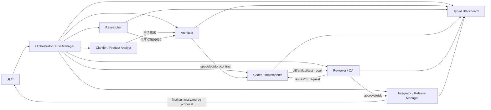

# AgentHub Agent 角色关系与协作协议设计调研

更新时间：2026-05-27

## 0. 第一阶段落地状态（2026-05-27）

本阶段已选择“固定骨干团队 + 轻量关系图”，暂缓 Kimi 式动态 swarm。落地边界如下：

- 默认代码协作组固定为 5 个角色：Clarifier、Architect、Coder、Reviewer、Integrator。Researcher 保留为可选模板，Tester 暂并入 Reviewer。
- 系统角色类型使用 `clarifier | architect | researcher | coder | reviewer | integrator | custom`，关系类型使用 `handoff_to | reviewed_by | fallback_to | reports_to | blocks`。
- 全局 Agent 配置库继续放在 localStorage，但升级为 `{ schemaVersion, agents, relations }`；旧数据会自动推断 `roleType` 并迁移。
- Workspace 层新增真实关系表 `workspace_agent_relations`，创建 classic workspace 时会 seed 5 个默认 Agent 和默认关系。
- Orchestrator Planner 的 Agent catalog 已携带 `roleType`、`roleProfile` 和上下游关系摘要；任务会生成 `agentSelection`，包括路由分数、理由、reviewer、fallback。
- 计划卡已展示路由理由；自动 review 优先读取 `reviewed_by`，没有关系时再回退到 `roleType=reviewer` 和旧启发式。
- 前端 Agent 配置页已加入角色模板、能力卡和轻量关系编辑，不做复杂拓扑图。

后续阶段再做：Handoff Contract 独立落库、`agent.selected`/`handoff.*` 事件、动态 swarm worker、关系图可视化和更严格的 typed role profile schema。

## 1. 核心结论

AgentHub 现在的 Agent 配置更像“通讯录条目”：名称、角色、简介、系统提示词、运行时、权限、标签。这个形态适合创建和邀请 Agent，但还不足以支撑稳定的多 Agent 协作。真正需要补的是一层 **Agent Role Profile + Collaboration Graph + Handoff Contract**：

- **Role Profile**：这个 Agent 在团队中负责什么、能做什么、不能做什么、产出什么、质量标准是什么。
- **Collaboration Graph**：Agent 之间谁给谁输入、谁审查谁、谁可接管谁、谁是 fallback。
- **Handoff Contract**：每次交接必须带目标、上下文、输入引用、输出格式、验收标准和截止条件。
- **Routing Policy**：Orchestrator 不能只靠 LLM 根据名字猜 Agent，要先做可解释的能力过滤和评分，再让 LLM 生成计划。

建议采用“稳定骨干团队 + 动态临时子 Agent”的架构：固定配置 Architect / Researcher / Coder / Reviewer / Tester / Integrator 等可理解角色；只在宽搜索、批量扫描、并行 review 等场景临时创建 swarm workers。

## 2. 当前现状诊断

从当前代码和界面看，AgentHub 已经有很好的基础字段：

- `workspace_agents` 已有 `role`、`description`、`systemPrompt`、`runtimeType`、`codeAgentType`、`capabilityTags`、`toolPermissions`、`sandboxPolicy`、`contextPolicy`、`autoInvoke`、`approvalRequired`。
- Planner 会把 Agent catalog 传给 LLM，并要求按 role、capabilities、runtime、tools、sandbox 选择 Agent。
- 当前 classic presets 是 Architect / Coder / Researcher / Reviewer。
- 近期已加入澄清问题、输入 guardrails、自动 review、handoff 上下文裁剪等能力。

主要问题：

1. **角色是自由文本，不是可执行契约**  
   “协作”“规划”“实现”“审查”只是标签，系统不知道这个角色应接什么任务、产出什么、由谁审查。

2. **Agent 之间没有显式关系**  
   目前没有 `reviews ->`、`handsOffTo ->`、`fallbackFor ->`、`reportsTo ->` 这类关系。自动 review 只能用 name/role/tag 中是否包含 review/test 做启发式匹配。

3. **用户配置负担过重**  
   截图里的“角色/简介/系统提示词/标签/权限”都偏底层。普通用户不知道应该如何定义一个靠谱的 Coder、Reviewer 或 Researcher。

4. **Planner 的选择缺少可解释评分**  
   现在 Planner prompt 会要求“pick suitable agent”，fallback 用关键词匹配。用户看不到“为什么这个任务派给这个 Agent”。

5. **协作过程缺少交接语义**  
   Blackboard 已经有结构化证据，但 Agent 到 Agent 的交接仍未被建模成一等对象。任务完成只是 `task.completed`，不等于“可被下游消费”。

## 3. 外部设计参考

### 3.1 Anthropic Research：Lead Agent + 有边界的 Subagent

Anthropic 的 Research 系统采用 orchestrator-worker 模式：Lead agent 负责计划、拆解、创建并行 subagents，subagents 独立探索不同方向，再由 lead 汇总。关键经验是：delegation 必须给每个 subagent 明确目标、输出格式、可用工具/来源和任务边界，否则会重复工作、遗漏关键点或跑偏。

对 AgentHub 的启发：

- Orchestrator 给 Agent 的任务描述不能只是标题，要包含 `objective / inputs / boundaries / output format / done criteria`。
- 多 Agent 最适合宽任务，比如研究、扫描、批量 review；代码实现要谨慎并行，避免冲突。
- 并行数默认小，不追求数量。AgentHub 比赛演示建议 3-6 个主 Agent，动态 workers 只在特定 phase 内开启。

### 3.2 Kimi Agent Swarm：水平扩展，但不是基础角色模型

Kimi Agent Swarm 强调水平扩展：主 Agent 自动拆解并协调大量子代理，适合宽搜索、大规模资料处理、报告生成、批量内容生产。官方帮助中心强调它并不是简单的手工多角色协作，而是自动协调大规模子代理。

对 AgentHub 的启发：

- 不要把基础 Agent 配置做成 20 个手工角色。基础层应清晰、稳定、可解释。
- Swarm 应作为 Orchestrator 的高级执行策略：当某个 phase 被判定为 `wide_parallel` 时，临时派生 3-8 个 ephemeral workers。
- 动态 worker 不应成为联系人列表里的永久 Agent；它们应继承父角色的权限和输出 contract。

### 3.3 Magentic-One：角色按能力和工具划分

Magentic-One 使用 Orchestrator 协调 WebSurfer、FileSurfer、Coder、ComputerTerminal 等专门 Agent。它的重点不是“人格”，而是能力边界和工具集合。

对 AgentHub 的启发：

- Agent 角色应围绕能力/工具/权限划分：read repo、web research、code edit、terminal test、review diff。
- UI 中“角色”旁边要显示“能执行哪些任务”和“权限边界”，否则用户无法判断是否安全。

### 3.4 LangGraph：Supervisor、Handoff 与 Context Engineering

LangGraph 多 Agent 文档强调：多 Agent 设计的核心是 context engineering，即每个 Agent 能看到什么、不能看到什么、从谁接手、如何返回。常见模式包括 centralized supervisor、handoff network、custom workflow。

对 AgentHub 的启发：

- AgentHub 第一阶段应采用 centralized supervisor，也就是 Orchestrator 统一调度。
- Agent 之间不要自由聊天接力；所有 handoff 先进入 Orchestrator 和 Blackboard，再由 Orchestrator 派发。
- Context policy 必须和 role 绑定：Reviewer 看 diff、contract、test result；Coder 看 spec、相关文件、上游 decision；Researcher 看目标和资料来源，不看无关聊天历史。

### 3.5 OpenAI Agents SDK：Handoff、Guardrails、Tracing

OpenAI Agents SDK 把 handoff、guardrails、tracing 作为一等概念。handoff 像工具调用一样由模型触发，但会进入专门的 handoff pipeline；tracing 记录 LLM generation、tool call、handoff、guardrails 和 custom events。

对 AgentHub 的启发：

- `run:event` 应增加 `handoff.created`、`handoff.accepted`、`handoff.rejected`、`agent.selected`。
- 每次选择 Agent 都应该记录 rationale，前端可显示“因为该 Agent 有 code/edit/test 标签且 workspace-write 权限”。
- Guardrails 应分 Agent：Coder 的高危写入策略、Researcher 的来源要求、Reviewer 的审查完整性要求不同。

### 3.6 CrewAI：Role / Goal / Backstory 易理解，但需要契约化

CrewAI 用 role、goal、backstory 定义 Agent，并支持 hierarchical manager。这个模型对用户友好，但如果只停留在 prompt 层，会出现角色漂移和 manager 误派。

对 AgentHub 的启发：

- UI 可以借鉴 role/goal/backstory 的表达，降低配置门槛。
- 底层必须补上 `acceptsTaskTypes`、`produces`、`qualityGates`、`handoffRules`，否则只是更好看的 prompt 编辑器。

## 4. 推荐架构：稳定骨干团队 + 动态临时子 Agent



### 4.1 固定角色建议

| 角色 | 主要职责 | 推荐运行时 | 推荐权限 | 主要产出 | 上下游关系 |
|---|---|---|---|---|---|
| Clarifier / Product Analyst | 判断任务是否清晰，生成澄清问题和范围边界 | LLM | read-only | clarification, assumptions, acceptance criteria | User -> Architect |
| Architect | 拆解模块、定义接口、依赖、计划和 contract | LLM 或 code-agent read-only | read-only | spec, task graph, decisions | Researcher -> Coder |
| Researcher | 查资料、读代码、找相似实现、标记不确定点 | LLM / MCP read-only | read-only | fact, source, risk | Architect / Reviewer |
| Coder / Implementer | 小步实现、修改文件、生成 diff 和自测结果 | code-agent | workspace-write | diff, artifact_ref, test_result | Architect -> Reviewer |
| Reviewer / QA | 审查 diff、测试缺口、安全和回归风险 | LLM 或 code-agent read-only | read-only 优先 | risk, review_result, fix_request | Coder -> Coder/Integrator |
| Tester | 跑验证命令、生成测试矩阵，可与 Reviewer 合并 | code-agent 或 native tool | read-only / workspace-write | test_result | Coder -> Reviewer |
| Integrator / Release Manager | 汇总、冲突决策、生成合并建议和最终报告 | LLM | read-only，合并需人工确认 | final_report, merge_plan | Reviewer -> User |

### 4.2 不建议的角色

- “全能协作 Agent”：边界不清，容易和 Orchestrator/Coder/Reviewer 重叠。
- “多个 Coder 平行写同一区域”：除非有明确 allowedPaths，否则冲突成本高。
- “Reviewer 也能随便改代码”：第一阶段 Reviewer 应默认只读，修复建议回流给 Coder。
- “永久创建大量小 Agent”：会让用户通讯录失控，也让 Planner 路由更难解释。

## 5. Agent Role Profile 数据模型建议

第一阶段可以先不大迁移，只把模板和 prompt 规范做起来；但长期建议为每个 Agent 增加一个协作配置 JSON。

```typescript
interface AgentRoleProfile {
  roleType:
    | 'clarifier'
    | 'architect'
    | 'researcher'
    | 'coder'
    | 'reviewer'
    | 'tester'
    | 'integrator'
    | 'custom'

  goal: string
  responsibilities: string[]
  acceptsTaskTypes: Array<'read' | 'research' | 'design' | 'code' | 'test' | 'review' | 'synthesize'>
  produces: Array<'fact' | 'decision' | 'risk' | 'artifact_ref' | 'diff_summary' | 'test_result' | 'task_output'>
  requiredInputs: string[]
  qualityGates: string[]
  canUseTools: string[]
  cannotDo: string[]
  defaultSandboxPolicy: 'read-only' | 'workspace-write' | 'danger-full-access'
  handoffRules: {
    handsOffTo: string[]
    acceptsFrom: string[]
    reviews?: string[]
    fallbackFor?: string[]
  }
  routingHints: {
    priority: number
    maxConcurrentTasks: number
    costTier: 'low' | 'medium' | 'high'
    reliabilityScore?: number
  }
}
```

关键点：

- `role` 继续给用户看；`roleType` 给系统路由。
- `capabilityTags` 继续保留，但由 preset 自动生成，不完全让用户手填。
- `handoffRules` 不一定第一阶段进 DB，可以先在内置 preset 中定义。
- `qualityGates` 应进入 Planner prompt 和 task contract，例如 Reviewer 必须检查“功能正确性、回归风险、测试缺口、安全边界”。

## 6. Orchestrator 路由策略

推荐从“LLM 直接选 Agent”改成“确定性过滤 + 打分 + LLM 计划”。

### 6.1 过滤

先排除明显不合适的 Agent：

- taskType = `code`：需要 `runtimeType=code-agent` 或明确具备 `code` 能力；sandbox 不能是纯 mcp 只读。
- taskType = `review`：优先 `roleType=reviewer/tester`，默认 read-only。
- 需要 web/search/source 的 research 任务：必须具备相应 tool permission 或 MCP capability。
- 高风险文件写入：需要 `approvalRequired=true` 或人工 gate。

### 6.2 打分

```text
score =
  roleAffinity * 0.30 +
  capabilityMatch * 0.25 +
  runtimeToolFit * 0.20 +
  sandboxSafety * 0.10 +
  relationFit * 0.10 +
  reliabilityCost * 0.05
```

打分结果写入计划卡：

```json
{
  "taskId": "implement-login",
  "selectedAgentId": "coder-1",
  "rationale": [
    "taskType=code matches acceptsTaskTypes",
    "has capabilityTags: frontend, react, code",
    "sandboxPolicy=workspace-write allows edits",
    "reviewedBy=reviewer-1"
  ],
  "alternates": ["coder-2", "architect-1"]
}
```

这样用户看到计划时能判断：不是模型随便点名，而是有路由依据。

## 7. Handoff Contract

AgentHub 应把 handoff 做成事件和数据结构，不只是聊天文本。

```typescript
interface HandoffContract {
  id: string
  runId: string
  fromAgentId: string
  toAgentId: string
  taskId: string
  reason: string
  objective: string
  inputRefs: Array<{ type: 'blackboard' | 'artifact' | 'message' | 'file'; id: string }>
  requiredOutputs: TaskOutputContract
  acceptanceCriteria: string[]
  contextPolicy: 'summary-only' | 'refs-only' | 'full-task-context'
  status: 'created' | 'accepted' | 'rejected' | 'completed'
}
```

事件：

- `agent.selected`
- `handoff.created`
- `handoff.accepted`
- `handoff.rejected`
- `handoff.completed`
- `review.requested`
- `review.completed`
- `fix.requested`

UI 展示：

- 计划卡：显示 Agent lane 和 handoff arrows。
- Runs 页面：时间线显示“Architect 将 spec 交给 Coder”“Reviewer 要求 Coder 修复 2 个问题”。
- Agent 配置页：显示“这个 Agent 通常接收来自谁、交给谁、审查谁”。

## 8. 前端配置体验建议

截图中的 Agent 配置页应从“字段编辑器”升级为“角色配置向导 + 高级字段”。

### 8.1 顶部先选角色模板

推荐模板：

- 产品澄清 / Clarifier
- 架构规划 / Architect
- 资料研究 / Researcher
- 代码实现 / Coder
- 代码审查 / Reviewer
- 测试验证 / Tester
- 汇总发布 / Integrator
- 自定义

选择模板后自动填：

- role、description、systemPrompt
- capabilityTags
- toolPermissions
- sandboxPolicy
- contextPolicy
- output contract defaults
- handoff defaults

### 8.2 当前配置面板改为“能力卡”

不要只显示“运行时/模型/权限/标签”，还要显示：

- 可接任务：design / code / review
- 主要产出：decision / diff / risk / test_result
- 默认上游：Architect
- 默认下游：Reviewer
- 审查关系：由 Reviewer 审查 / 审查 Coder
- 风险等级：read-only / can write / dangerous

### 8.3 Agent Group 创建页

用户新建群聊时，不应手工思考“拉哪些 Agent”。应提供团队模板：

- **代码协作组**：Clarifier + Architect + Coder + Reviewer + Integrator
- **研究报告组**：Clarifier + Researcher x2 + Analyst + Writer + Reviewer
- **代码审查组**：Researcher + Reviewer + Tester + Integrator
- **轻量问答组**：一个 Generalist + 一个 Reviewer

## 9. 任务流建议

### 9.1 代码任务标准流

```text
User goal
  -> Clarifier: 是否需要补问题
  -> Architect: 输出 spec、模块边界、任务 contract
  -> Coder: 按 allowedPaths 实现并自测
  -> Tester: 跑验证命令
  -> Reviewer: 审查 diff、风险、缺失测试
  -> Coder: 如需修复，进入 fix loop
  -> Integrator: 汇总、冲突处理、生成合并建议
  -> User: 人工确认合并/放弃/继续修复
```

### 9.2 研究任务标准流

```text
User goal
  -> Clarifier: 范围和输出格式
  -> Researcher swarm: 按主题/来源/区域并行搜索
  -> Analyst/Architect: 归纳结构和判断
  -> Reviewer: 检查来源质量、矛盾和遗漏
  -> Integrator: 输出报告
```

### 9.3 何时不用多 Agent

Orchestrator 应拒绝或降级：

- 一句话简单问答。
- 单文件小改动，且无需审查。
- 用户只是想让某个指定 Agent 回答。
- 任务没有并行价值，且多 Agent 只会增加延迟。

## 10. 分阶段落地方案

### Phase A：角色模板与路由可解释化

- 定义内置 `AgentRoleProfile` presets。
- 新建/编辑 Agent 时可一键套用模板。
- Planner 前置 deterministic routing，输出 `agentSelectionRationale`。
- 计划卡展示“为什么派给它”。

### Phase B：协作关系图

- 为 Agent 增加 `collaborationProfile` JSON 或单独表。
- 支持 `handsOffTo`、`acceptsFrom`、`reviews`、`fallbackFor`。
- Agent Group 页面展示团队拓扑。
- 自动 review 不再靠字符串匹配，改用 `reviews` 关系或 `roleType=reviewer`。

### Phase C：Handoff Contract 事件化

- 新增 handoff 数据结构与事件。
- Orchestrator 每次任务交接都写 handoff。
- Runs Timeline 增加 handoff 视图。
- Blackboard inputRefs 和 handoff inputRefs 对齐。

### Phase D：动态小规模 Swarm

- 仅在 `research`、`scan`、`review` 等宽任务 phase 启用。
- 默认 3 个 worker，上限 8。
- worker 继承父 Agent 权限，产出必须写 typed Blackboard。
- 不进入永久 Agent 通讯录。

## 11. 最小可交付切片建议

下一刀建议不要先做复杂 swarm，而是做：

1. 在代码中定义 7 个 role presets。
2. Agent 配置页增加“角色模板”选择。
3. seed classic agents 改成使用 presets，补齐 tags、permissions、contextPolicy、sandbox。
4. Planner 增加 AgentSelection：过滤、评分、rationale。
5. 计划卡展示每个任务的 selected-by reason 和 reviewer/fallback。
6. 自动 review 改成基于 role profile，不再用字符串启发式。

这个切片能直接改善用户视角：用户创建 Agent 时知道每个角色做什么；计划生成后知道每个任务为什么给这个 Agent；执行时 reviewer/fix loop 有明确关系。

## 12. 参考来源

- Anthropic Engineering: How we built our multi-agent research system  
  https://www.anthropic.com/engineering/built-multi-agent-research-system
- Kimi Help Center: Agent Swarm 多智能体协作模式介绍  
  https://www.kimi.com/zh-cn/help/agent/agent-swarm
- Microsoft / Magentic-One paper  
  https://arxiv.org/abs/2411.04468
- LangChain / LangGraph multi-agent handoffs  
  https://docs.langchain.com/oss/python/langchain/multi-agent/handoffs
- LangGraph multi-agent collaboration docs  
  https://langchain-ai.github.io/langgraph/tutorials/multi_agent/multi-agent-collaboration/
- OpenAI Agents SDK agents / handoffs / tracing / guardrails  
  https://openai.github.io/openai-agents-python/agents/  
  https://openai.github.io/openai-agents-python/tracing/  
  https://openai.github.io/openai-agents-js/guides/guardrails
- CrewAI agents and hierarchical process docs  
  https://docs.crewai.com/en/concepts/agents  
  https://docs.crewai.com/en/learn/hierarchical-process
