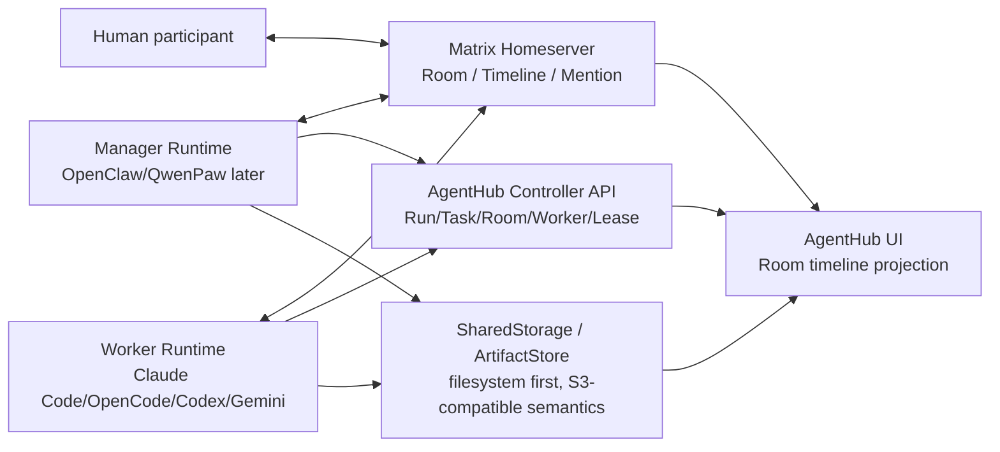

# Matrix 通信层与 Manager / Worker 运行时分工实施方案

最后更新：2026-06-04

本文档用于下一阶段并行重构分工。目标不是把 AgentHub 直接搬成完整 HiClaw 企业栈，而是做成轻量版 HiClaw：

- 前端仍保留 AgentHub 自己的 IM / Coze 风格产品壳。
- 内部协作事实源改成 Matrix Room / timeline / participant / mention。
- Manager 是真实协调器，通过 skills 操作 Controller API。
- Worker 是真实运行实体，通过 Room 接单、澄清、汇报、交付。
- 默认仍是单进程 AgentHub 服务 + 本地 CLI 子进程 + filesystem SharedStorage。
- 真实 Matrix homeserver 是目标通信层；`local-matrix-compatible` 只保留为本地开发和测试 fallback。

## 本地真实 Matrix 启动方式

AgentHub 第一阶段默认采用轻量 HiClaw 路线：用本地 Docker Compose 托管一个 Tuwunel homeserver，Agent 执行仍可继续走本机 `local-workdir`。这里的 Docker 只用于通信基础设施，不等于每个 Agent 都进入 Docker sandbox。

启动基础设施：

```bash
bun run infra:up
```

只启动 Matrix：

```bash
bun run matrix:up
```

查看 Tuwunel 日志：

```bash
bun run matrix:logs
```

查看 AgentHub 侧 Matrix 诊断：

```bash
curl http://localhost:8000/api/rooms/matrix/diagnostics
```

诊断接口会返回 provider、homeserver `/versions` 探测、注册配置是否存在、Matrix rooms / identities / backend participants 数量，以及 Manager / Worker listener 的 `lastSyncedAt`、`lastOkAt`、`lastErrorAt`、`consecutiveErrors`。该接口只读，不会启动或停止 listener，也不会返回 access token、registration token 或 password。

停止基础设施：

```bash
bun run infra:down
```

`.env` 中需要打开真实 Matrix provider：

```bash
AGENTHUB_ROOM_PROVIDER=matrix
AGENTHUB_MATRIX_HOMESERVER_URL=http://localhost:6167
AGENTHUB_MATRIX_SERVER_NAME=agenthub.local
AGENTHUB_MATRIX_REGISTRATION_TOKEN=agenthub-dev-registration-token
AGENTHUB_MATRIX_AUTO_INVITE_PARTICIPANTS=true
AGENTHUB_MATRIX_AUTO_JOIN_PARTICIPANTS=true
```

当前 compose 文件位于 [../infra/docker-compose.hiclaw-lite.yml](../infra/docker-compose.hiclaw-lite.yml)，Tuwunel 配置对齐 HiClaw 的默认做法：`CONDUWUIT_*` 环境变量、`6167` Matrix client API 端口、允许本地开发注册、持久化数据卷。Synapse / Conduit 不作为默认托管服务；它们只作为“连接已有 Matrix homeserver”的兼容目标。

## 一句话分工

- **通信层**：Codex 继续推进。目标是让 Matrix 成为 Room 事实源，完成身份、加入、监听、mention、控制消息、文件引用、审计和前端投影闭环。
- **Manager Runtime**：用户/另一位 Agent 推进。目标是把 CoordinatorRuntime 从“JSON action LLM 壳”升级成 HiClaw 风格 skill-driven Manager runtime。
- **Worker Runtime**：用户/另一位 Agent 推进。目标是把 WorkerRuntime 从“一次性 CLI 任务调用”升级成 Room-native、可等待、可恢复、可停止、可审计的 Worker 状态机。

## 当前基线

已经具备：

- `RoomService` / `RoomController`
- `MatrixRoomAdapter` / `MatrixClient` / `MatrixIdentityService`
- `MatrixRuntimeListener` / `MatrixRuntimeSupervisor`
- `MatrixRoomEventDispatcher`
- `roomParticipants` / `matrixIdentities` / `timelineEvents`
- Matrix 真实 room 创建、identity 注册或登录、invite / join、participant token 发言
- `/sync` 导入、mention 解析、file ref 解析、`mxc://` 下载到 ArtifactStore
- `/stop` 取消 task room
- `/approve` 和普通 human reply 回答 pending Worker clarification
- task room / group room timeline 通过 WebSocket 投影到前端

仍未完成：

- typing / presence / read receipt / membership 变化审计
- Matrix listener 的 durable supervisor 和启动恢复可观测面
- 人工控制与 pending proposal / clarification / task decision 的强绑定
- 前端完全从 Room timeline 恢复状态，而不是混合旧 snapshot
- Manager / Worker 还不是常驻 Matrix runtime
- Manager skill 调 Controller API 的端到端闭环还不完整

## 目标架构



核心原则：

- Room timeline 是协作事实，不是 UI 装饰。
- Controller API 负责资源状态，不把业务状态塞进前端本地拼接。
- Manager 和 Worker 都通过 Matrix Room 与人类可见协作。
- 所有控制动作必须能追溯到 source timeline event。
- A2A 不作为内部主通信路径，只保留外部互操作。

## 一、通信层实现方案

负责人：Codex。

目标：把 Matrix 从“可选 adapter”推进成可真实运行、可审计、可恢复的内部通信层。

### 1.1 Room Provider 收口

现状：

- `AGENTHUB_ROOM_PROVIDER=matrix` 时使用真实 Matrix homeserver。
- test / local fallback 使用 `local-matrix-compatible`。
- 默认非 test 已经倾向 `MatrixRoomAdapter`，但启动提示、设置页和诊断还不完整。

要做：

1. 增加 Matrix runtime diagnostic：
   - homeserver URL 是否配置
   - server name 是否配置
   - admin token / registration token 是否可用
   - register / login / createRoom / sync / send 是否可用
   - auto invite / auto join 是否生效
2. 设置页明确显示：
   - 当前 provider：`matrix` 或 `local-matrix-compatible`
   - `local-matrix-compatible` 是开发 fallback，不是最终协作层
   - 真实 Matrix homeserver 推荐 Tuwunel，兼容 Synapse / Conduit
3. 服务启动时输出清晰日志：
   - Matrix ready
   - Matrix configured but unhealthy
   - fallback local provider

验收：

- 用户能在 UI 或日志中明确知道当前是不是跑真实 Matrix。
- Matrix 未配置时不能假装“真实 Matrix 已启用”。

### 1.2 Matrix Identity 与 Membership

现状：

- Human / Manager / Worker participant 会生成 `matrixIdentities`。
- `MatrixIdentityService.ensureIdentity()` 支持 register、login、Tuwunel admin room reset-password 后重试。
- `MatrixRoomAdapter.reconcileMatrixMembership()` 支持 invite / join。

要做：

1. identity ownership 固化：
   - human：绑定 userId
   - manager：绑定 manager runtime id，而不是永远 `manager`
   - worker：优先绑定 workerInstanceId；没有 workerInstanceId 时绑定 workspaceAgentId
2. membership event 审计：
   - participant invited
   - participant joined
   - participant failed to join
   - participant left / kicked
3. status reconcile：
   - Matrix join 成功：`roomParticipants.status = joined`
   - invite 成功但 join 失败：`invited`
   - sync 发现未知 sender：创建 observer participant，但不自动变成 workspace agent
4. token 存储后续接 TokenVault：
   - 近期先保留 DB
   - metadata 和日志必须 redaction，不输出 accessToken/password

验收：

- timeline 能看见“谁加入了房间、谁没加入成功”。
- Manager / Worker 发消息时能证明是用自己的 Matrix user，而不是统一系统账号。

### 1.3 Listener / Supervisor 生命周期

现状：

- `MatrixRuntimeListener` 可以按 identity `/sync`。
- `MatrixRuntimeSupervisor` 可以 start / stop participant listener。
- `RoomController` reconcile task room 后会 best-effort 启动 listeners。

要做：

1. durable listener registry：
   - `matrixIdentities.metadata.matrixSync.running`
   - `lastStartedAt`
   - `lastStoppedAt`
   - `lastSyncAt`
   - `lastError`
   - `consecutiveErrors`
2. server startup recovery：
   - 启动时扫描 active Matrix rooms 的 manager/worker participants
   - 恢复 listener
   - 写入 startup recovery event 或 server log
3. listener health：
   - long poll timeout
   - exponential backoff
   - unhealthy threshold
   - admin endpoint 查看当前 listener 状态
4. graceful shutdown：
   - server shutdown 时 stop all listeners
   - 写 metadata，避免 UI 显示仍 running

验收：

- 重启服务后 active rooms 的 Manager / Worker listener 会恢复。
- listener 挂掉后有可见健康状态，不静默丢消息。

### 1.4 Timeline Import / Dispatch

现状：

- 支持导入 `m.room.message`。
- 支持 mention、file ref、human group message、task room worker mention。
- 支持 `/stop`、`/approve`、普通 human reply 回答 Worker clarification。

要做：

1. message type 扩展：
   - `m.notice`
   - edit / redaction 基础识别
   - reaction 可先记录不参与调度
2. dispatch precedence 固化：
   - file.shared -> artifact register
   - task control command -> task control
   - task room human reply -> pending clarification / proposal answer
   - mention worker -> run worker
   - mention manager -> step manager
   - group human message -> step manager
3. `/deny` 真实语义：
   - 如果绑定 pending clarification：标记 answered/rejected 或 blocked
   - 如果绑定 pending member proposal：拒绝 proposal
   - 如果没有绑定对象：只记录 control event
4. command source 绑定：
   - 每个控制动作必须带 `sourceEventId`
   - resume / cancel / proposal decision 必须带 target resource id
5. 去重：
   - providerEventId 去重
   - control result 去重
   - resume result 去重

验收：

- Matrix 重放不会重复启动 Worker。
- `/approve` / `/deny` 不再是泛泛系统消息，而是绑定具体等待事项。

### 1.5 File / Artifact / SharedStorage

现状：

- Matrix file event 会导入 `file.shared`。
- `mxc://` 能下载并登记 ArtifactStore。
- 下载失败时保留 partial artifact 和 error metadata。

要做：

1. file object key 规范：
   - `rooms/{roomId}/matrix/{eventId}/{filename}`
   - `runs/{runId}/tasks/{taskId}/artifacts/{artifactId}/{filename}`
2. 明确 file ref 与 artifact 的区别：
   - file ref 是 Matrix 原始引用
   - artifact 是 AgentHub 物化后的产物记录
3. task handoff：
   - Worker 输出产物必须进入 ArtifactStore
   - Manager review 只读 ArtifactStore / SharedStorage，不猜本地路径
4. download auth：
   - 优先使用 sender identity token
   - fallback admin token
   - 记录 used token kind，不记录 token 值

验收：

- Matrix 里发文件后，前端产物卡能看到 object key / status / error。
- 下游 Worker 能通过 artifact ref 读取，不靠相对路径猜测。

### 1.6 Audit / Trace

现状：

- timelineEvents 记录 message / task.progress / artifact.created / approval.requested。
- metadata 里有 matrix event id / sender / mentions / sourceEventId。

要做：

1. 标准 audit metadata：
   - `source: "matrix"`
   - `providerEventId`
   - `sourceEventId`
   - `actorParticipantId`
   - `actorMatrixUserId`
   - `targetResource`
   - `resultEventId`
2. Room timeline replay API 增强：
   - afterSequence
   - participants snapshot
   - linked resources snapshot
   - artifacts snapshot
3. 前端投影收口：
   - task board
   - sub-thread entry
   - agent tabs
   - artifact cards
   - HITL cards
4. 审计页面后续可做：
   - event chain
   - control action trace
   - Matrix raw event metadata

验收：

- 任意一次 Worker 被启动，都能追溯到哪个 Room event。
- 任意产物都能追溯到哪个 Worker / task / Matrix event。

## 二、Manager Runtime 实现方案

负责人：用户/另一位 Agent。

目标：把 Manager 从“内部 LLM 输出 JSON action”升级为 HiClaw 风格的 skill-driven coordinator runtime。

### 2.1 Manager 资源模型

新增或固化资源：

- `ManagerInstance`
- `ManagerProfile`
- `ManagerWorkspace`
- `ManagerSkill`
- `ManagerState`
- `WorkerRegistry`

建议目录：

```text
.agenthub/managers/{managerId}/
  SOUL.md
  AGENTS.md
  state.json
  workers-registry.json
  skills/
    worker-management/SKILL.md
    task-management/SKILL.md
    channel-management/SKILL.md
    file-sync-management/SKILL.md
    human-management/SKILL.md
    project-management/SKILL.md
```

关键点：

- `SOUL.md` 定义 Manager 人格、协作原则、权限边界。
- `AGENTS.md` 定义如何读 Room、如何调用 skills、如何向人类汇报。
- `workers-registry.json` 是当前可用 Worker 事实缓存，来源仍是 DB / Controller。
- `state.json` 记录当前 Manager loop 状态，不作为唯一事实源。

### 2.2 Skill-driven 决策链

目标流程：

```text
Matrix group room event
  -> Manager runtime observes timeline
  -> Manager selects skill
  -> skill calls Controller API
  -> Controller changes resources
  -> Manager writes result back to Matrix room
```

第一批 skills：

- `channel-management`
  - ensure group room
  - ensure task room
  - invite participant
  - send mention
- `worker-management`
  - list workers
  - propose worker
  - create worker
  - wake worker
  - stop worker
- `task-management`
  - create run
  - create task
  - assign task
  - reassign task
  - cancel task
  - mark blocked
- `human-management`
  - ask clarification
  - request approval
  - process approval / denial
  - summarize intervention
- `file-sync-management`
  - register artifact
  - read shared task contract
  - write result reference
- `project-management`
  - maintain goal
  - track milestones
  - final review

不要做：

- 不要恢复关键词路由。
- 不要让 Planner 重新当主脑。
- 不要让 Manager 绕过 Room timeline 直接黑盒调 Worker。

### 2.3 Runtime Adapter

近期建议：

```ts
interface ManagerRuntime {
  runtimeType: 'openclaw' | 'qwenpaw' | 'local-skill-runtime'
  observe(input: ManagerObserveInput): Promise<ManagerThought>
  act(input: ManagerActInput): AsyncGenerator<ManagerRuntimeEvent, ManagerActResult>
}
```

第一阶段可以先做 `local-skill-runtime`，但接口必须对齐 OpenClaw/QwenPaw：

- 输入是 Room timeline + resource snapshot + skill registry
- 输出是 skill calls + room messages
- 每次 action 都写 timeline event

OpenClaw/QwenPaw 接入时：

- Manager 作为 Matrix participant 常驻监听
- 收到 Room event 后由 runtime 自己 decide
- 调 AgentHub Controller API
- 再以 Manager Matrix 身份回复 room

### 2.4 Controller API 边界

Manager skill 只能通过 Controller API 改资源：

- `RoomController`
- `RunController`
- `WorkerController`
- `RuntimeLeaseController`
- `ArtifactController`
- `TaskThreadService`

不要直接写：

- `workspaceTasks`
- `taskThreads`
- `runtimeLeases`
- `roomParticipants`
- `timelineEvents`

例外：测试 fixture 可以直接造数。

### 2.5 Manager 验收标准

完成后应该能做到：

- 用户说“大家好，看到的人打声招呼”，Manager 会在 group room 里 @ 已加入 Workers，让他们真实回复。
- 用户发复杂任务，Manager 自己决定追问、补员、创建任务、派活。
- Manager 的每次决策都能在 Room timeline 看到。
- Manager skill 调用能在审计中追溯。
- Manager 不再像 Planner 面板一样机械规划，而像团队负责人持续经营任务。

## 三、Worker Runtime 实现方案

负责人：用户/另一位 Agent。

目标：把 Worker 从“一次性 CLI 调用”升级为 Room-native runtime：可接单、可澄清、可等待、可恢复、可停止、可汇报、可审计。

### 3.1 Worker 资源模型

核心资源：

- `WorkerInstance`
- `RuntimeLease`
- `WorkerProfile`
- `WorkerWorkspace`
- `WorkerSkillSet`
- `WorkerRoomBinding`

建议目录：

```text
.agenthub/workers/{workerInstanceId}/
  SOUL.md
  AGENTS.md
  profile.json
  skills/
  mcp/
  state.json
  rooms.json
```

任务目录：

```text
.agenthub/shared/tasks/{taskId}/
  meta.json
  spec.md
  plan.md
  result.md
  artifacts/
```

隔离目录：

```text
{sandboxRoot}/{runId}/{workerInstanceId}/{taskId}/
  home/
  config/
  cache/
  tmp/
  data/
```

### 3.2 Worker 状态机

建议状态：

```text
created
  -> ready
  -> listening
  -> assigned
  -> running
  -> waiting_for_human
  -> resuming
  -> completed
  -> failed
  -> sleeping
  -> stopped
```

关键语义：

- `ready`：Worker 配置可用，但未必在执行任务。
- `listening`：Worker Matrix listener 正在监听相关 rooms。
- `assigned`：Manager 已在 task room @Worker。
- `running`：CLI / runtime 正在执行。
- `waiting_for_human`：Worker 明确等待人类输入，lease 不释放。
- `resuming`：收到人类回答，恢复执行。
- `sleeping`：空闲 stop，保留身份和配置。
- `stopped`：用户或系统停止，释放进程。

### 3.3 Room-native 接单

目标流程：

```text
Manager sends task.assigned + @Worker in task room
  -> Worker listener sees mention
  -> WorkerRuntime claims RuntimeLease
  -> Worker writes "已接单"
  -> Worker executes CLI/runtime
  -> progress/artifacts/clarification/result all written to task room
```

当前 `WorkerRuntimeService.runTaskRoom()` 已经可以作为执行核心，但要继续拆：

- `observeRoom()`
- `claimTask()`
- `startExecution()`
- `emitProgress()`
- `requestClarification()`
- `resumeFromHumanAnswer()`
- `finishTask()`
- `releaseLease()`

### 3.4 Code Agent 基座适配

Worker runtime 不是一个泛泛 LLM。

Worker 基座：

- Claude Code
- OpenCode
- Codex
- Gemini CLI
- 后续 OpenClaw/QwenPaw Worker

Worker profile 应决定：

- code agent base
- model
- skills
- MCP scope
- permission
- sandbox policy
- workspace path
- shared task refs

执行输入必须包括：

- task room timeline
- task contract `spec.md`
- upstream artifact refs
- human clarification answers
- allowed tools / skills / MCP

执行输出必须写：

- task room timeline
- ArtifactStore
- `.agenthub/shared/tasks/{taskId}/result.md`

### 3.5 HITL / Clarification

目标：

- Worker 可以在 task room 中自然问人类。
- 人类可以直接在 room 回复，不必须点按钮。
- `/approve` / `/deny` 是显式控制；普通回复也是回答。
- 回答必须绑定 pending clarification。

当前已完成最小链：

- Worker 发 `approval.requested`
- `task_clarifications` pending
- human reply 或 `/approve` 更新 answered
- 写 `worker-runtime.resume-requested`
- 可重新 run task room

后续 Worker 侧要做：

- `waiting_for_human` 时不退出整个 Worker runtime 语义
- resume 读取 clarification answer
- resume 后继续同一个 task context
- 多轮 clarification 去重
- `/deny` 后进入 blocked / rework / cancel 策略

### 3.6 Stop / Cancel / Interrupt

目标：

- `/stop` 在 task room 取消当前 task。
- Manager interrupt 可以让 active Worker 停止当前 CLI。
- Worker shutdown 要释放 RuntimeLease。
- 部分产物保留。

要做：

- 每个 Worker execution 绑定 AbortController
- Matrix `/stop` -> Controller -> signal abort
- process tree cleanup
- final timeline event：cancelled / partial artifacts retained
- RuntimeLease released/stale
- WorkerInstance idle/sleeping/failed

### 3.7 Worker 验收标准

完成后应该能做到：

- Worker 被 @ 后自己接单，不依赖旧 message bridge。
- Worker 运行过程全写 task room。
- Worker 等人时不丢上下文。
- 人类在 room 里回答后 Worker 能继续。
- Worker 停止/失败/超时都可审计。
- 两个 Worker 同时跑不会串 home/config/cache/session。

## 四、三块接口契约

### 4.1 Timeline Event Contract

所有三块共享这些事件：

- `human.message`
- `manager.message`
- `worker.message`
- `task.assigned`
- `task.progress`
- `approval.requested`
- `artifact.created`
- `file.shared`
- `system`

必须保留：

- `metadata.kind`
- `metadata.sourceEventId`
- `metadata.runId`
- `metadata.taskId`
- `metadata.taskThreadId`
- `metadata.workspaceAgentId`
- `metadata.workerInstanceId`
- `metadata.runtimeLeaseId`
- `metadata.matrix.eventId`
- `metadata.matrix.senderUserId`

### 4.2 Controller Ownership

资源修改归属：

- Room / participant：`RoomController`
- Run / task lifecycle：`RunController`
- Worker state：`WorkerController`
- Lease：`RuntimeLeaseController`
- Artifact：`ArtifactController` / `ArtifactStore`
- Manager skill：只能调用 Controller
- Worker runtime：只能通过 Controller 更新生命周期

### 4.3 并行开发边界

通信层可以先定义和保证：

- Matrix event import
- Matrix event dispatch
- listener lifecycle
- timeline replay
- audit metadata

Manager / Worker 可以并行依赖：

- Room timeline 是事实源
- `appendTimelineEvent()` / `appendMentionTimelineEvent()`
- `MatrixRoomEventDispatcher`
- Controller APIs
- ArtifactStore object refs

不要互相踩：

- Manager 不直接改 Matrix sync 逻辑。
- Worker 不直接改 Matrix identity / membership。
- 通信层不写 Manager 决策 prompt。
- 通信层不写 Worker 执行 prompt。

## 五、建议实施顺序

### Slice A：通信层补齐

1. Matrix diagnostic / settings status
2. listener durable metadata + startup recovery
3. `/deny` 绑定 pending clarification / proposal
4. membership event audit
5. timeline replay snapshot 增强
6. 前端 Room timeline 投影继续收口

### Slice B：Manager Runtime

1. Manager workspace 目录和默认 SOUL / AGENTS / skills
2. ManagerRuntime interface
3. local skill runtime 打通 Controller API
4. OpenClaw adapter prototype
5. Manager 常驻 Matrix listener
6. Manager skill audit events

### Slice C：Worker Runtime

1. ✅ Worker workspace / profile / skill layout — `.agenthub/workers/{id}/` 目录结构已落地，`WorkerController.ensureReady()` 自动创建
2. ✅ Worker state machine 拆分 — `observedState` 已扩展 `listening / assigned / resuming`，`WorkerController` 和 `MatrixRuntimeSupervisor` 已接入状态流转
3. ✅ Worker listener claim task — `MatrixRoomEventDispatcher` 已改为 Worker 先检查状态、自己 claim、写"已接单" timeline event、再异步启动 `WorkerRuntimeService`
4. ⏳ CLI execution AbortController / process cleanup
5. ⏳ clarification resume 原生化
6. ⏳ per-agent config/cache/session 隔离

## 六、最终验收场景

### 场景 1：打招呼

用户在群聊说：

```text
大家好，看到的人打声招呼
```

期望：

- Human message 进入 group room。
- Manager listener 看到消息。
- Manager 决定 @ 所有可用 Worker。
- 每个 Worker 在 room 中真实回复。
- 前端显示所有参与者发言，不是 Manager 伪造。

### 场景 2：复杂任务

用户说：

```text
调研今天 A 股、港股、美股市场情况，重点分析小米，然后做一个 HTML 报告。
```

期望：

- Manager 可追问或直接组队。
- Manager 创建 run 和多个 task rooms。
- Research Worker 调研。
- Analyst Worker 分析。
- Builder Worker 生成 HTML。
- Reviewer Worker 验收。
- 产物进入 ArtifactStore。
- 主群聊只展示关键进度和最终复盘。
- 所有 Worker 过程在各自 task room 可见。

### 场景 3：人类介入

Worker 问：

```text
是否按当前分析口径继续？
```

用户回复：

```text
按这个方向继续，但补充新能源车板块。
```

期望：

- 回复绑定 pending clarification。
- Worker 进入 resume。
- task room 写入 resume-requested。
- Worker 继续执行。
- 结果包含新增约束。

### 场景 4：停止任务

用户在 task room 输入：

```text
/stop 方向不对，先停
```

期望：

- 当前 task cancelled。
- CLI 子进程停止。
- RuntimeLease released/stale。
- Worker 回 idle。
- partial artifacts 保留。
- Manager 在主群聊可见汇报。

## 七、不要做的事

- 不恢复 `OrchestratorEngine`。
- 不恢复 `TaskExecutionService`。
- 不恢复 `LocalA2ATransport` 作为内部通信。
- 不恢复关键词路由。
- 不恢复固定团队模板。
- 不让前端本地状态代替 Room timeline。
- 不让 Manager 黑盒伪造 Worker 发言。
- 不让 Worker 产物只留在本地临时目录。
