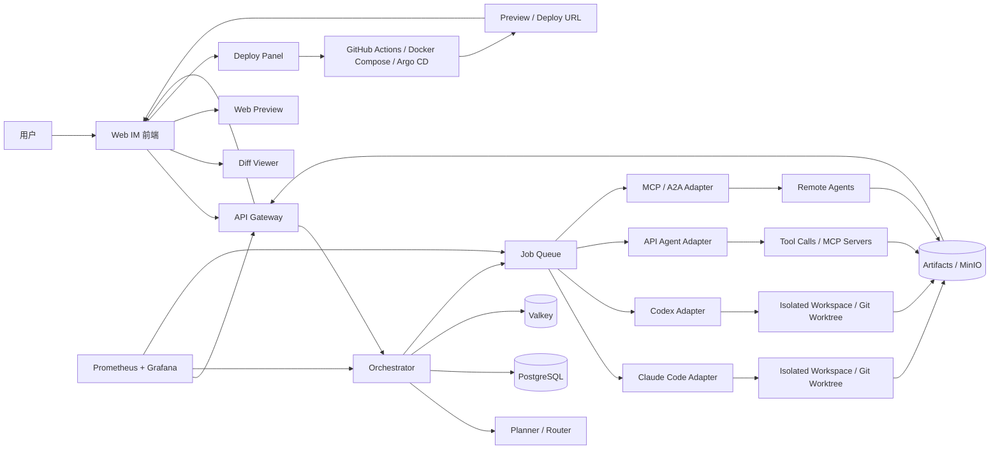
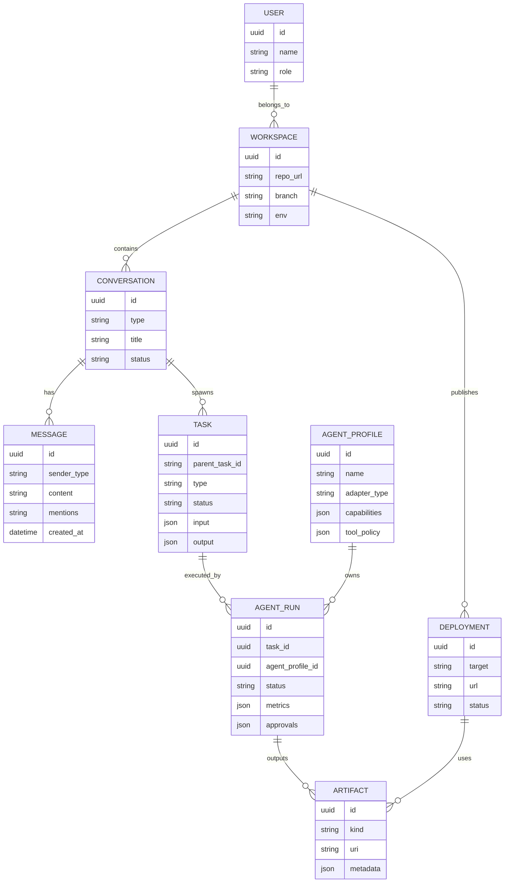

# AgentHub 面向字节 AI 全栈挑战赛的 IM 聊天式多 Agent 协作平台分析报告

## 执行摘要

AgentHub 最值得做的方向，不是再造一个“通用 Agent 框架”，而是把它做成一个**面向真实研发协作的 IM 优先控制平面**：用单聊、群聊、`@Agent`、并行会话、代码 Diff、网页预览与一键部署，把多个编码/规划/审查型 Agent 统一放进一个可见、可控、可审计的协作界面里。这个判断与当前产品演进趋势一致：GitHub Agent HQ 已经在 GitHub 内验证了“多 Agent 统一视图、异步会话、`@Copilot/@Claude/@Codex` 协作、可审查产物”的模式；VS Code 正在把本地、后台、云端 Agent 与并行 subagents 收敛到统一 session 视图；TRAE SOLO 则强调 AI 原生工作台、Todo/上下文面板、多任务并行与工具统一调度；Claude Code 与 Codex CLI 进一步证明了“代码库感知 + 命令执行 + 文件修改 + 审批门控/工作区隔离”已经是主流编码 Agent 的基线能力。citeturn19view0turn19view1turn19view2turn19view3turn13view0turn28search5turn28search8turn31view0turn31view1turn30view1

基于“三周冲刺”的现实约束，建议 AgentHub 的 **MVP** 聚焦在“看得见、控得住、能交付”的链路，而不是追求过度自治。最小闭环应包括：单聊/群聊、`@` 指令路由、会话并行、Orchestrator 任务拆解、Claude Code 与 Codex 两类主流编码 Agent 适配、代码 Diff 审阅、网页预览、一键发布到预览环境、基础审计日志与人工批准门。这样既能覆盖题目核心亮点，也能与现有官方趋势对齐：行业头部产品都在强化**会话可见性、异步执行、审查式交付、人机共管**，而不是让 Agent 完全黑箱运行。citeturn19view0turn19view2turn19view3turn16view0turn36view1turn21search0

从差异化上看，AgentHub 的机会在于填补几个空白：一是把 GitHub/IDE 内的 Agent 协作抽离成**独立 IM 界面**，降低仓库与 IDE 绑定；二是做一个**统一适配器层**，同时容纳 CLI Agent、API Agent、MCP 工具与未来的 A2A 远程 Agent；三是把“任务拆解—执行—Diff—预览—部署—回传”全部固化在聊天时序中，形成可展示、可答辩、可复现的全链路证据。MCP 已成为工具/上下文接入标准，A2A 正在补齐 Agent 对 Agent 的互操作，这为 AgentHub 的扩展性留出了非常清晰的技术路线。citeturn6search2turn6search14turn20search1turn20search12

说明一下资料边界：本次对话中**未附用户提到的微信文章与比赛链接原文**，因此无法逐条引用；对于官方规则、评分细则、人员规模、部署目标环境等未公开或未提供项，本文统一明确标注为“**未指定**”。

## 需求分析

从题面可抽象出一个非常清晰的产品定位：**面向 3 周开发周期的、偏研发场景的、多 Agent 协作聊天中枢**。它既不是单纯的工作流画布，也不是单个编码 Agent 的 IDE 插件，而是一个以聊天为入口，把任务分解、Agent 路由、代码审查、预览与发布串起来的协作层。

### 功能需求清单

| 功能域 | 具体需求 | 说明 | MVP 优先级 | 状态 |
|---|---|---|---|---|
| IM 交互 | 单聊 | 用户与单个 Agent 或系统对话 | P0 | 已指定 |
| IM 交互 | 群聊 | 用户、Orchestrator、多个 Agent 在同一会话内协作 | P0 | 已指定 |
| IM 交互 | `@` 指令 | `@orchestrator`、`@frontend`、`@backend`、`@reviewer` 等显式路由 | P0 | 已指定 |
| 会话管理 | 会话并行 | 一个需求拆成多个并发线程，支持切换与汇总 | P0 | 已指定 |
| 编排引擎 | Orchestrator 任务拆解 | 识别意图、切分子任务、选择 Agent、聚合结果 | P0 | 已指定 |
| 代码协作 | 代码 Diff | 对比 Agent 产出与当前代码，支持侧边/统一视图 | P0 | 已指定 |
| 预览能力 | 网页预览 | 前端产物可在平台内直接预览 | P0 | 已指定 |
| 发布能力 | 一键部署 | 至少支持预览环境一键发布与回传 URL | P0 | 已指定 |
| 兼容层 | 统一适配器层 | 对外屏蔽 Claude/Codex/API/MCP 差异 | P0 | 已指定 |
| 生态兼容 | 支持 Claude/Codex 等主流 Agent | MVP 至少接入 Claude Code 与 Codex；其余可扩展 | P0 | 已指定 |
| 审核控制 | 人工批准门 | 对写文件、执行命令、部署等高风险动作进行人工批准 | P0 | 题目未显式指定，建议补充 |
| 产物留痕 | 日志/工单/工件 | 保留子任务、计划、Diff、预览链接、部署记录 | P0 | 题目未显式指定，建议补充 |
| 组织能力 | Agent 角色管理 | 预置 FE/BE/QA/Reviewer/PM 等角色模板 | P1 | 题目未显式指定，建议补充 |
| 可扩展性 | MCP/A2A 扩展 | 接工具、接远程 Agent、接第三方平台 | P1 | 题目未显式指定，建议补充 |
| 企业能力 | 多租户、计费、计量、配额 | 若做商业化需要 | P2 | 未指定 |
| 终端形态 | 移动端、桌面端 | 可做增强演示，但非三周 MVP 必需 | P2 | 未指定 |

把 `P0` 放在“会话可视、任务拆解、产物可审查”而不是“超强自治”上，是有充分行业依据的：GitHub Agent HQ/VS Code 都在把多 Agent 管理与审查产物做成第一层能力；TRAE SOLO 的 Todo、上下文与并发任务可视化也把“过程透明”放在前面；Claude Code 与 Codex CLI 则都把审批模式、工作区隔离、subagents/parallelization 作为安全与效率平衡点。citeturn19view0turn19view2turn19view3turn13view0turn28search8turn31view1turn31view2turn30view1

### 非功能需求

| 维度 | 建议目标 | 说明 | 状态 |
|---|---|---|---|
| 性能 | 聊天消息写入与 ACK `<300ms` | 只要求“消息层”快，不把模型响应时间算进去 | 建议值，题目未指定 |
| 延迟 | 首次流式状态/首 token `<1.5s` | 对 API Agent 可实现；CLI Agent 以“首状态事件”替代 | 建议值，题目未指定 |
| 并发 | 50 在线用户 / 200 会话 / 10 并行任务 | 适合答辩与演示规模 | 建议值，题目未指定 |
| 安全 | 命令执行、文件改写、部署动作必须有批准门或策略白名单 | 与 Claude/Codex 的审批模式、MCP 最佳实践一致 | 建议值，题目未指定 |
| 隐私 | Workspace 隔离、Secrets 分区、日志脱敏、可删会话 | 尤其需要防止 prompt injection 与密钥泄漏 | 建议值，题目未指定 |
| 可扩展性 | Agent 接入不改上层业务，新增 Provider 仅新增 Adapter | 依托 MCP/A2A/统一抽象层 | 建议值，题目未指定 |
| 可维护性 | 模块边界清晰：IM、Orchestrator、Adapter、Sandbox、Deploy 解耦 | 方便三周后继续演进 | 建议值，题目未指定 |
| 可观测性 | 每个任务可追踪消息、计划、执行、Diff、工件、部署 URL | 方便答辩与复盘 | 建议值，题目未指定 |

在安全与权限上，官方资料已经给出几个可直接转译为产品策略的信号：Claude Code 默认会在改写文件前展示变更并请求批准；Codex CLI 明确提供 approval modes；MCP 官方文档也专门给出了授权、安全边界、攻击面与最佳实践。这意味着 AgentHub 不应该默认追求“全自动写入与执行”，而应把**批准门、作用域最小化、工件白名单、沙箱隔离**设计成默认行为。citeturn31view1turn30view1turn21search0

### MVP 范围建议

| 层级 | 建议纳入内容 | 不纳入原因 |
|---|---|---|
| P0 | 单聊/群聊、`@` 指令、并行子会话、Orchestrator 拆解、Claude Code + Codex 适配、Diff、网页预览、预览部署、基础审计日志、基础权限门 | 这些构成完整演示闭环 |
| P1 | OpenAI Agents SDK API 模式 Agent、TRAE 联动、自定义 Agent 模板、MCP 工具市场、部署回滚、多项目空间 | 有价值，但三周内不是最小必需 |
| P2 | 多租户、企业 RBAC、计费计量、长期记忆、评分看板、A2A 远程 Agent 注册中心 | 偏平台化/商业化，投入大 |

一句话概括 MVP：**先把“群聊里调用多个 Agent，拿到可审查 Diff 与可点击预览链接，再一键发版”的核心故事讲通。**

## 市场调研与竞品分析

当前相关产品大致分成三层：第一层是 **Agent 控制平面/协作入口**，如 GitHub Agent HQ；第二层是 **Agent 平台/工作流平台**，如 Coze、Dify；第三层是 **多 Agent 框架与编码 Agent**，如 LangGraph、AG2、CrewAI、OpenHands、OpenAI Agents SDK。AgentHub 最适合站在第一层，但必须主动吸收第二层的平台能力与第三层的执行能力。citeturn19view0turn19view1turn14view0turn10search0turn16view0turn18view0turn16view2turn16view3turn36view0

### 核心竞品对比

| 产品 | 类型 | 与 AgentHub 相关的强项 | 明显缺口 | 许可与活跃度 | 可复用点 | 资料依据 |
|---|---|---|---|---|---|---|
| GitHub Agent HQ | Agent 控制平面 | 支持 Copilot、Claude、Codex 与自定义 Agent；统一视图管理任务；异步运行；Issue/PR 中可 `@Copilot/@Claude/@Codex`；每个 session 产出 comments/drafts/proposed changes，并可查看日志 | 强绑定 GitHub 仓库与 PR 流，不适合作为独立 IM 产品；适合“代码托管内协作”，不适合跨 Agent/跨工具聊天中枢 | 专有；2026-02 起公开预览，面向 Copilot Pro+/Enterprise | 可直接借鉴 `@mention`、session list、异步任务卡片、可审查工件模型 | GitHub 官方博客与 Docs。citeturn19view0turn19view1turn19view2 |
| 扣子 Coze | 平台型产品 | 官方首页直接强调“前后端全栈开发、云端 IDE 与 CLI、网页/APP/小程序/智能体/工作流、零门槛一键部署”；火山引擎文档称其为一站式 AI Agent 开发工具，提供多模型、多框架、从开发到部署的环境，且已有上万家企业、数百万开发者使用 | 更偏一站式平台与办公/应用构建，不以“代码仓库内多 Agent 聊天协作 + Diff 审查”作为第一交互 | 专有；生态规模强，但不可复用源码 | 可借鉴“自然语言到全栈开发”“一键部署”“字节生态贴近感” | Coze 官方站与火山引擎官方文档。citeturn8search0turn14view0 |
| Dify | 工作流/应用平台 | 官方定位“生产级 Agentic 工作流平台”，强调工作流、RAG、集成与可观测性；Repo 活跃度很高 | 低代码工作流很强，但 IM 群聊、多 Agent 对话路由、代码 worktree/PR 式审查不是其核心长板 | Dify Open Source License（基于 Apache 2.0 附加条件）；GitHub 142k stars，163 个 release，2026-05-12 发布 v1.14.1 | DSL、工作流画布、模型接入与平台部署经验 | Dify 官方站、官方仓库与 release。citeturn10search0turn16view1 |
| LangGraph | 多 Agent 编排框架 | 强项是 durable execution、human-in-the-loop、memory、production-ready deployment；非常适合做长运行有状态 Agent | 不提供开箱即用的 IM 产品 UI，也不解决 Claude/Codex 这类外部 CLI Agent 的统一接入 | MIT；GitHub 32.3k stars，534 个 release，2026-05-12 发布 1.2.0 | 非常适合借鉴状态图、断点恢复、人工介入机制 | LangGraph 官方站与官方仓库。citeturn16view0turn17view0 |
| AG2 | 多 Agent 框架 | 明确支持 multi-agent conversation patterns，包含 group chats、nested chats、sequential chats、swarm 等；与 AutoGen 系谱相连，方向契合“聊天式多 Agent” | 产品层 UI 与代码审查链路较弱，做平台仍需自建前后端与交互层 | Apache-2.0；GitHub 4.6k stars，70 个 release，2026-05-13 发布 0.13.0 | 对话编排模式、角色消息协议、群聊型 Agent 交互 | AG2 官方站、官方文档与官方仓库。citeturn11search0turn18view0turn18view1 |
| CrewAI | 多 Agent 框架 | 强调 crews 与 flows，带 observability、knowledge、guardrails，适合企业流程化多 Agent 自动化 | 与 AgentHub 的“IM 协作 + repo worktree + Diff/预览”需求相比，仍偏后端编排框架 | MIT；GitHub 51.7k stars，190 个 release，2026-04-30 发布 1.14.4 | 角色化 Agent、Flow 控制、控制平面设计 | CrewAI 官方站、文档与官方仓库。citeturn10search14turn16view2turn17view1 |
| OpenHands | 开源编码 Agent 平台 | 同时提供 SDK、CLI、Local GUI、Cloud；支持 Slack/Jira/Linear、多用户、RBAC、conversation sharing；论文也强调代码、命令行与网页浏览是其核心能力 | 更像“单个强执行编码 Agent 平台”，而不是“聊天式多 Agent 协作中枢” | MIT（核心）；GitHub 74k stars，102 个 release，2026-05-01 发布 1.7.0 | Sandbox、代码执行、GUI/CLI 结合、协作与云端形态 | OpenHands 官方仓库与论文。citeturn16view3turn17view2turn12search7 |
| OpenAI Agents SDK | Agent 运行时 SDK | TypeScript/Python 都支持；官方强调 provider-agnostic、多 Agent handoffs、sandbox agents、guardrails、sessions、human in the loop、tracing；非常适合做运行时底座 | 它是运行时框架，不自带完整产品 UX；接 Claude Code/Codex 仍需外部适配 | MIT；Python GitHub 26.4k stars；JS/TS 版官方提供同等核心概念 | 适合作为 API 型 Agent 的统一运行时与 tracing 底座 | OpenAI 官方文档与官方仓库。citeturn16view4turn36view0turn36view1 |

这张表说明了一件事：**AgentHub 不应该正面和 Dify/Coze 比“平台宽度”，也不应和 OpenHands 比“单 Agent 深度”，而应把自己卡在“多 Agent 的 IM 协作入口 + 审查式交付中枢”这个更细但更清晰的位置。**

### 差异化机会与商业价值

| 机会点 | 为什么成立 | 商业/学术价值 |
|---|---|---|
| IM 优先，而不是画布优先 | GitHub Agent HQ 证明“统一视图 + @mentions”有效，但它仍然绑定仓库语境；Dify/Coze 更像构建平台或办公平台，聊天协作感不足 | 商业上更适合团队内部协作与教学；学术上可采集更干净的多 Agent 对话轨迹。citeturn19view0turn10search0turn14view0 |
| 同时兼容 CLI Agent 与 API Agent | Claude Code/Codex CLI 属于强执行终端范式，OpenAI Agents SDK/LangGraph 属于运行时范式，现有产品很少统一两者 | 商业上可避免厂商锁定；学术上可做不同 Agent 接入方式的对比实验。citeturn31view0turn30view1turn36view1turn16view0 |
| 把 Diff/预览/部署嵌进聊天线程 | GitHub Agent HQ 有可审查产物，TRAE 和 Coze 有预览/部署路径，但“聊天即交付管线”仍有空白 | 演示说服力最强，也最适合竞赛答辩。citeturn19view0turn28search16turn8search0 |
| 面向中文研发场景与 TRAE 协同 | TRAE 提供 AI 原生工作台、自定义智能体、Todo/上下文与多任务并行，这与 AgentHub 可以形成“控制平面 + 执行终端”互补 | 对字节系赛题与中文开发者更有贴合度。citeturn13view0turn28search2turn28search5turn28search8 |
| 评测资产化 | ByteDance 自身已发布 FullStack Bench 与 SandboxFusion，说明“全栈编码评测”本身就是高价值方向 | 学术上可沉淀多 Agent 评测数据；商业上可形成内部质量看板。citeturn27view0turn27view1 |

## 系统设计

AgentHub 建议采用 **IM 控制平面 + 事件驱动编排 + 适配器层 + 隔离执行工作区** 的架构。工具与上下文接入优先走 MCP；远程 Agent 到 Agent 的互联预留 A2A；运行时层保留对 OpenAI Agents SDK 或自定义状态机的兼容；长任务与并发调度通过队列驱动。这样能同时满足三周 MVP 的落地性和后续平台化的扩展性。citeturn6search2turn6search14turn20search1turn20search12turn36view1turn16view0

### 高层架构图



**无图文本描述：** 用户在 IM 前端发消息后，API Gateway 将消息写入会话并转给 Orchestrator。Orchestrator 负责拆解任务、维护状态、入队；各 Adapter Worker 从队列消费任务，分别驱动 Claude Code、Codex、API 型 Agent 或 MCP/A2A 远程能力；执行结果统一沉淀成工件，再回流给前端展示为 Diff、预览和部署链接。MCP 负责“工具”，A2A 负责“远程 Agent”，两者互补。citeturn6search2turn20search1turn20search12

### 模块划分

| 模块 | 职责 | 推荐实现 | 扩展点 |
|---|---|---|---|
| 前端 | 单聊/群聊、@ 路由、任务树、Diff、预览、部署按钮 | Next.js + Tailwind + shadcn/ui + Monaco + react-diff-view | 可扩展移动端、桌面壳 |
| API Gateway | 鉴权、会话 API、流式事件、批准门、部署触发 | Node.js/TypeScript 服务 | 可接企业 SSO、审计系统 |
| Orchestrator | 意图识别、任务拆解、角色分派、结果聚合、冲突仲裁 | 自定义状态机；必要时接 OpenAI Agents SDK JS / LangGraph 风格状态图 | 可替换为更强运行时 |
| Adapter 层 | 统一封装 Claude Code、Codex、API Agent、MCP/A2A | `AgentAdapter` 抽象 + Worker | 新增 Provider 只新增 Adapter |
| Agent 管理 | 角色模板、权限、工具白名单、上下文策略 | 数据表 + 配置中心 | 可做 Agent 市场 |
| 存储 | 会话、消息、任务、工件、部署记录 | PostgreSQL + Valkey + 对象存储 | 可做事件回放 |
| CI/CD/部署 | 预览部署、正式部署、回滚 | GitHub Actions + Docker Compose；后续 Argo CD | 可接 K8s、Serverless |
| 观测与运维 | 指标、日志、任务追踪 | Prometheus + Grafana；任务事件表 | 后续可接 tracing 平台 |

### 关键技术选型

| 维度 | 推荐 | 原因 | 备选 |
|---|---|---|---|
| 前端框架 | Next.js | 页面、路由、全栈配套成熟，适合快速做 IM + 预览页 | 纯 React SPA |
| IM UI | CopilotKit + 自研消息流 | CopilotKit 天生适合 agent-native UI、shared state、human-in-the-loop；但核心消息模型仍建议自研，避免过深耦合 | 全自研聊天 UI |
| 代码编辑 / Diff | Monaco Editor + react-diff-view | Monaco 适合代码查看与编辑；react-diff-view 适合快速实现 GitHub 风格对比 | CodeMirror Merge |
| Orchestrator runtime | 自研轻量状态机 + 队列；API Agent 可接 OpenAI Agents SDK JS | 三周内自研最可控；OpenAI Agents SDK JS 已提供 sandbox、handoff、guardrails、sessions、tracing | LangGraph.js / Python |
| 消息队列 | BullMQ + Valkey | 前端友好、Worker 模型简单，适合多任务并发 | RabbitMQ / Celery |
| 数据库 | PostgreSQL | 关系清晰、可靠、适合会话/任务/工件/部署记录 | MySQL |
| 鉴权 | Auth.js 做 MVP；Keycloak 做企业版升级 | Auth.js 上手快；Keycloak 适合 OIDC/RBAC/企业接入 | 自研 JWT |
| 预览 | Sandpack 做前端浏览器内演示；真预览走容器部署 | 适合答辩演示与网页预览 | iframe 接外部预览 |
| 部署 | GitHub Actions + Docker Compose | 三周最稳；一键触发预览/部署最容易 | Argo CD、Serverless |
| 可观测性 | Prometheus + Grafana | 自建成本低，适合答辩展示 | 商业 tracing 平台 |

这里有一个务实取舍：**MVP 不要一开始就做“全平台统一运行时”，而是先做“统一控制平面 + 统一 Adapter 抽象”**。因为 Claude Code 与 Codex CLI 都已经提供了强执行终端能力，但它们不属于同一运行时；相反，OpenAI Agents SDK 与 LangGraph 更适合作为 API 型 Agent 或未来内部 Agent 的运行时底座。这个“两层抽象”比强行统一要稳。citeturn31view0turn31view2turn30view1turn36view0turn36view1turn16view0

### 数据模型示意



**无图文本描述：** 一个 Workspace 对应一个代码仓或项目空间；Workspace 下可以有多个 Conversation。Conversation 产生 Message 与 Task。Task 可递归拆分，由不同 AgentProfile 生成多个 AgentRun。AgentRun 产出 Artifact，例如 patch、日志、截图、预览 URL、部署结果。Deployment 也是一种可回溯工件。

### 接口与数据流

建议把平台的对外接口保持得非常少而稳：

| 接口 | 作用 | 关键输入 | 关键输出 |
|---|---|---|---|
| `POST /conversations/{id}/messages` | 发送消息或 `@` 指令 | `content`、`mentions[]`、`attachments[]` | `message_id`、`run_id` |
| `GET /conversations/{id}/stream` | 流式接收任务状态/Agent 事件 | `conversation_id` | `plan`、`task_update`、`diff_ready`、`preview_ready`、`deploy_ready` |
| `POST /runs/{id}/approve` | 批准写文件/执行/部署 | `approval_scope`、`decision` | `approved=true/false` |
| `GET /artifacts/{id}` | 获取 Diff、日志、预览地址 | `artifact_id` | `artifact metadata` |
| `POST /deployments` | 触发预览部署 | `workspace_id`、`artifact_id` | `deployment_id`、`preview_url` |

建议定义一个统一的 Adapter 接口，而不是把每个 Agent 硬编码进 Orchestrator：

```ts
interface AgentAdapter {
  name: string
  kind: "cli" | "api" | "mcp" | "a2a"
  capabilities(): Promise<string[]>
  plan?(input: TaskInput): Promise<TaskPlan>
  run(input: TaskInput, ctx: RunContext): AsyncIterable<AgentEvent>
  cancel(runId: string): Promise<void>
  collectArtifacts(runId: string): Promise<Artifact[]>
}
```

这样做的直接收益是：**上层永远只认识任务与事件，不认识 Claude/Codex/OpenAI 的私有细节。**

### 扩展点与容错策略

| 风险场景 | 容错策略 |
|---|---|
| 某个 Agent 卡死或长时间不响应 | 任务超时 + 重试；必要时切换备用 Agent |
| 生成结果冲突 | 引入 Reviewer/Arbiter Agent 做二次审查；最终 merge 必须人工确认 |
| 命令执行风险 | 默认 deny，高风险命令必须批准；工作区只给最小权限 |
| prompt injection / MCP 风险 | MCP Server 白名单、签名/来源校验、作用域最小化、网络隔离 |
| 预览环境失败 | 保留构建日志与原始 artifact，允许回退到本地预览 |
| 部署失败 | 部署动作幂等化；preview 与 prod 分离；失败立即回传原因 |
| 会话状态丢失 | 所有任务状态落 Postgres；队列只做调度，不做唯一真相 |
| 多 Agent 写同一文件 | 采用 worktree/分支隔离；汇总阶段再做 patch 合并 |

LangGraph 强调 durable execution、human-in-the-loop 与 memory；OpenAI Agents SDK 强调 handoffs、sessions、guardrails 与 tracing；这些都说明可恢复、可跟踪、可人工介入的编排模式已经是生产级 Agent 的共同答案。AgentHub 最好不要把这些能力当可选项，而要把它们视作**产品可信度**的一部分。citeturn16view0turn36view1

安全上则应遵守 MCP 官方安全建议，并将鉴权统一到 OIDC/OAuth 兼容链路：MCP 文档明确将授权与安全视为实现重点，OIDC 官方规范也说明其本质是构建在 OAuth 2.0 上的统一身份层。对于竞赛 MVP，做到“登录、会话隔离、批准门、Secrets 不落日志”就足够有说服力。citeturn21search0turn33search8

## 开源复用清单

下面的清单按“**易集成 + 对 MVP 价值高**”排序，优先选择可以直接支撑聊天 UI、Diff、队列、鉴权与运行时的项目。

| 优先级 | 项目 | 适用模块 | 简短说明 | 许可 | 集成难度 | 资料依据 |
|---|---|---|---|---|---|---|
| A | [Monaco Editor](https://github.com/microsoft/monaco-editor) | 代码查看/编辑 | VS Code 同源浏览器代码编辑器，适合代码预览与轻编辑 | MIT | 低 | 官方仓库。citeturn22search1 |
| A | [react-diff-viewer](https://github.com/praneshr/react-diff-viewer) | Diff 面板 | 支持 split/unified、word diff、行高亮，足够做 MVP Diff 审查 | MIT | 低 | 官方仓库。citeturn37view3 |
| A | [Auth.js](https://github.com/nextauthjs/next-auth) | 鉴权 | Open-source，全栈，支持 OAuth/OIDC、JWT/数据库会话，适合快速做 MVP 登录 | ISC | 低 | 官方仓库与文档。citeturn38view0turn33search8 |
| A | [BullMQ](https://github.com/taskforcesh/bullmq) | 并发任务/队列 | 适合把 Agent 子任务拆成后台 Job 与 Worker | MIT | 低 | 官方站与仓库。citeturn22search11turn22search7turn39view0 |
| A | [PostgreSQL](https://www.postgresql.org/) | 主数据库 | 可靠、开源、适合会话/任务/工件/部署记录 | PostgreSQL License | 低 | PostgreSQL 官方站与许可页。citeturn39view2turn25search1 |
| A | [Valkey](https://github.com/valkey-io/valkey) | 缓存/队列存储 | 开源 BSD，适合会话缓存、任务状态缓存、BullMQ 后端 | BSD | 低 | Valkey 官方站与仓库。citeturn24search4turn39view1 |
| A | [OpenAI Agents SDK JS](https://github.com/openai/openai-agents-js) | API 型 Agent 运行时 | TypeScript-first，支持 sandbox、handoff、guardrails、sessions、tracing | MIT | 中 | OpenAI 官方文档与仓库。citeturn36view0turn36view1 |
| A | [CopilotKit](https://github.com/copilotkit/copilotkit) | Agent-native 前端 | 提供 chat UI、shared state、human-in-the-loop、generative UI，非常适合 AgentHub 前端增强 | MIT | 中 | 官方仓库/站点。citeturn22search0turn37view1 |
| B | [Sandpack](https://github.com/codesandbox/sandpack) | 网页预览 | 浏览器内 live-running code editing experience，适合前端预览/演示 | Apache-2.0 | 中 | 官方仓库。citeturn37view2 |
| B | [Prometheus](https://github.com/prometheus/prometheus) | 指标监控 | 采集系统与服务指标、规则与告警，答辩演示友好 | Apache-2.0 | 中 | 官方仓库与下载页。citeturn39view3turn24search14 |
| B | [Grafana](https://github.com/grafana/grafana) | 可观测面板 | 适合做任务吞吐、延迟、部署状态等可视化 | AGPL-3.0 | 中 | 官方仓库与官方许可说明。citeturn39view4turn24search15 |
| B | [Keycloak](https://github.com/keycloak/keycloak) | 企业鉴权升级 | 提供 user federation、strong auth、fine-grained authorization，适合企业版 | Apache-2.0 | 中高 | 官方仓库。citeturn37view4 |
| C | [Argo CD](https://github.com/argoproj/argo-cd) | GitOps 部署 | 若后续上 K8s，可做声明式持续交付与环境管理 | Apache-2.0 | 中高 | 官方仓库与文档。citeturn26search1turn26search5turn26search17 |

如果只能选最核心的 6 个来做三周 MVP，我会建议先上：**Monaco、react-diff-viewer、Auth.js、BullMQ、PostgreSQL、Valkey**。如果团队还有余力，再补 **OpenAI Agents SDK JS、CopilotKit、Sandpack**，最后才考虑 **Prometheus/Grafana、Keycloak、Argo CD**。

## Prompt 与 TRAE 协作策略

TRAE SOLO 的官方定位非常适合被 AgentHub 利用：它本身就是 AI 原生工作台，具备 Todo/上下文面板、多任务并行、自定义智能体、模型切换/API Key、自带工具面板与部署入口。换句话说，AgentHub 不必与 TRAE 正面竞争“深度执行终端”，而应把 TRAE 看成**本地/桌面侧的执行伙伴**，自己专注在聊天协作、中控调度、审查与留痕。citeturn13view0turn28search2turn28search5turn28search8turn28search12turn28search16

### Orchestrator 任务拆解模板

下面这个模板足够支撑 MVP 版 Planner：

```text
你是 AgentHub Orchestrator。
目标：把用户需求拆成可并行执行、可审查、可回滚的子任务。

输入：
- 用户目标
- 当前仓库/工作区信息
- 可用 Agent 列表与能力
- 约束：时间、技术栈、是否允许联网、是否允许部署
- 风险策略：是否允许写文件/执行命令/部署

输出必须为 JSON：
{
  "summary": "...",
  "assumptions": [],
  "questions": [],
  "tasks": [
    {
      "id": "task-fe-1",
      "title": "...",
      "owner": "@frontend",
      "depends_on": [],
      "can_parallel": true,
      "expected_artifacts": ["diff", "preview_url"],
      "approval_required": ["write_files"]
    }
  ],
  "merge_strategy": "...",
  "review_strategy": "..."
}
```

这个模板的核心不是“聪明”，而是**结构化**。三周内最怕的是 Orchestrator 输出风格漂移，导致前端、队列与审查逻辑全碎。强制 JSON 结构比追求自然语言“像人”更重要。

### Prompt 工程范式

建议将 Agent 分成五类角色，并统一要求输出“结论 + 证据 + 下一步”。

| 角色 | 主要职责 | 输出要求 |
|---|---|---|
| Planner | 需求拆解、依赖梳理、并行判断 | JSON 计划，不直接写代码 |
| Worker | 具体改代码、执行命令、形成 patch | 必须返回改动文件清单、风险点、需要批准的动作 |
| Reviewer | 比较多个 Worker 结果、找冲突、做建议 | 输出差异摘要、推荐方案、拒绝理由 |
| Publisher | 触发预览/部署、收集 URL | 输出环境、版本、URL、失败日志 |
| Arbiter | 解决冲突、裁决 merge | 输出最终决议与证据链 |

Claude Code 官方支持 system prompt flags、`CLAUDE.md`、路径规则与项目级记忆；Codex CLI 官方也支持 subagents、approval modes、MCP 与本地/云任务。因此，Prompt 最好分为三层：**平台级规则、项目级规范、任务级意图**。不要把所有东西都塞进一次性 prompt。citeturn31view2turn35view0turn30view1

### Agent 间协作协议示例

建议所有 Agent 事件统一成下面这种事件流，而不是在不同 Provider 里各说各话：

```json
{
  "event_type": "artifact_ready",
  "conversation_id": "conv_123",
  "task_id": "task_fe_1",
  "run_id": "run_codex_1",
  "agent": "@frontend",
  "artifact": {
    "kind": "diff",
    "files": ["src/pages/index.tsx"],
    "preview_url": "https://preview.example.com/abc",
    "needs_approval": true
  },
  "message": "已完成首页改造，等待审查。"
}
```

协作协议里要特别固定三类消息：

第一类是 **计划消息**，只允许 Planner 发；第二类是 **执行消息**，必须带任务与工件 ID；第三类是 **裁决消息**，只能由 Reviewer/Arbiter 发。这样前端 UI 很容易在群聊里把“谁在说计划、谁在说执行、谁在做裁决”视觉区分开。

### 冲突解决与一致性保障

建议 AgentHub 从第一天就内置以下四条规则：

| 规则 | 做法 |
|---|---|
| 单文件单写者优先 | 同一时刻尽量只允许一个 Worker 对同一文件拥有写权限 |
| 并行结果不直接落主分支 | 每个 Agent 在独立 worktree/分支里产出 patch |
| 所有 merge 先过 Reviewer | 至少一个 Reviewer 汇总差异，再由用户确认 |
| 高风险动作二次批准 | 部署、执行危险命令、修改 secrets 相关文件必须再确认 |

Claude Code 官方已经内置 worktree 选项；Codex 官方也支持 subagents、代码审查与批准模式。AgentHub 直接把这些能力抽象到统一协议，不需要重新发明一套“多智能体写同一仓库”的底层机制。citeturn31view2turn30view1

### 与 TRAE 的协同方式

最实用的做法是维护一个**跨工具共享规范文件**：

```text
AGENTS.md       # 平台中立的团队规范与角色约定
CLAUDE.md       # 仅做 @AGENTS.md 导入 + Claude 专属补充
TRAE Agent 配置  # 把同一套角色与提示词映射到 TRAE 自定义智能体
```

Claude Code 官方文档明确说明：它读的是 `CLAUDE.md`，但如果仓库已有 `AGENTS.md`，可以通过 `@AGENTS.md` 在 `CLAUDE.md` 中导入，避免重复维护。TRAE 官方则支持创建自定义智能体，并为其配置提示词、MCP Server 与内置工具，还支持通过 API Key 接入自定义模型。这样就能做到：**AgentHub 管流程和协作，Claude/Codex/Trae 共享一套角色规范与项目上下文。**citeturn35view0turn28search2turn28search12

推荐的协作分工如下：

| 阶段 | AgentHub 负责 | TRAE 负责 |
|---|---|---|
| 立项 | 群聊需求澄清、@ 指令路由、任务拆解 | 不参与或只做补充检索 |
| 开发 | 派发任务、聚合结果、展示工件 | 本地深度编码、上下文探索、工具执行 |
| 审查 | Diff 汇总、冲突仲裁、批准门 | 局部修复与再次试跑 |
| 交付 | 预览与部署、链接回传、审计留痕 | 可选的本地复核 |

## 开发计划与评审准备

### 人员分工假设

题目未指定团队规模。为了让计划可执行，建议按 **3 人最小有效团队** 估算；若实际为 1 人或 2 人，需要进一步砍范围。

| 角色 | 人数假设 | 主要职责 |
|---|---:|---|
| 全栈负责人 | 1 | 架构、API、数据模型、部署、联调 |
| Agent/后端负责人 | 1 | Orchestrator、队列、Adapter、Claude/Codex 接入 |
| 前端/产品负责人 | 1 | IM UI、Diff/预览、演示与文档 |

如果只有 1 人参赛，建议删掉 P1，保留：**群聊 + @ 指令 + 2 个 Agent + Diff + Preview + Deploy**。

### 三周冲刺里程碑

| 时间 | 目标 | 每日关键产出 |
|---|---|---|
| 第 1 周前半 | 需求冻结与底座搭建 | Day 1：数据模型与页面信息架构；Day 2：会话/消息 API；Day 3：登录与项目空间；Day 4：队列/任务表；Day 5：Monaco + Diff 面板；Day 6-7：基础群聊与 `@` 路由 |
| 第 1 周后半 | Agent 首次跑通 | Claude Code Adapter 跑通；Codex Adapter 跑通；能回传日志与 patch |
| 第 2 周前半 | Orchestrator 闭环 | 任务拆解 JSON、并行子任务、状态流、批准门 |
| 第 2 周后半 | 交付闭环 | Sandpack/本地预览、预览部署、URL 回传、失败日志 |
| 第 3 周前半 | 稳定性与体验 | 会话恢复、错误重试、空状态/加载状态、冲突裁决 |
| 第 3 周后半 | 评审材料 | Demo 脚本、架构图、README、测试用例、部署脚本、答辩稿 |

### 可交付物清单

| 类别 | 最低交付 |
|---|---|
| 代码 | 前端、后端、Orchestrator、至少 2 个 Adapter、部署脚本 |
| 演示 | 5–8 分钟录屏/现场演示脚本 |
| 文档 | README、系统设计、Agent 角色说明、Prompt 模板 |
| 测试 | 冒烟测试、2–3 条端到端脚本、至少 1 条失败回滚场景 |
| 部署 | Docker Compose、一键启动脚本、预览部署流程 |
| 评测 | 至少 3–5 个固定 Demo 任务；若有余力，可用 FullStack Bench 思路构造回归样例 | 

如果想多拿“技术深度分”，建议从 ByteDance 的 FullStack Bench 和 SandboxFusion 获得启发，给项目补一个**小型全栈回归集**：例如“改首页 Banner”“增加一个 API 路由”“修一个表单校验 bug”“做一次预览部署”。FullStack Bench 官方强调全栈真实场景、多语言与统一 sandbox 执行环境，这正好可以转化为 AgentHub 的回归测试故事。citeturn27view0turn27view1

### 关键风险与缓解措施

| 风险 | 影响 | 缓解方式 |
|---|---|---|
| Claude/Codex 适配复杂度高 | 直接影响 MVP 亮点 | 先只做最小命令包装：启动、流式日志、patch 收集、取消 |
| Orchestrator 过度复杂 | 进度失控 | 只做显式角色路由与 JSON 计划，不做自学习与复杂 memory |
| 预览/部署不稳定 | 演示翻车 | 保留本地预览兜底；部署失败时展示日志，不要静默失败 |
| MCP/工具接入有安全隐患 | 审查时容易被问 | 只接白名单工具；默认最小权限；高风险动作必须批准 |
| UI 太“平台”但不“可展示” | 评委难以理解 | 所有核心能力都必须在聊天时间线上回显 |

MCP 官方安全文档已经明确把授权边界、风险向量与最佳实践列为重点，因此赛题场景下应当主动强调“我们知道危险在哪里，并且默认不开危险能力”。这比空泛地说“我们重视安全”更有说服力。citeturn21search0

### 演示脚本

| 时长 | 动作 | 想证明什么 |
|---:|---|---|
| 1 分钟 | 打开群聊，输入需求：“做一个活动落地页，新增报名 API，并部署预览” | 聊天就是入口 |
| 1 分钟 | `@orchestrator` 输出任务拆解与并行计划 | 有真实编排，不是单 Agent 问答 |
| 1 分钟 | `@frontend` 走 Claude Code，`@backend` 走 Codex 并行执行 | 多 Agent 并发与主流 Agent 接入 |
| 1 分钟 | 前端展示 Diff、后端展示接口变更与日志 | 产物可审查 |
| 1 分钟 | 点击网页预览，现场看页面 | 不止会写代码，还能看结果 |
| 1 分钟 | 点击一键部署，回传 URL | 真正形成交付闭环 |
| 1 分钟 | 展示失败重试/人工批准/操作日志 | 平台可信、可控、可复现 |

### 评审答辩要点

| 主题 | 建议表述 |
|---|---|
| 为什么不是 Dify/Coze？ | 我们不是在做通用平台，而是在做面向研发协作的 IM 控制平面，核心是多 Agent 对话、Diff 审查与交付留痕 |
| 为什么不是 OpenHands？ | OpenHands 强在单 Agent 执行，我们强在多 Agent 协作与统一聊天入口 |
| 为什么能三周做完？ | 因为我们把复杂能力后移，MVP 只做最小闭环：群聊、Orchestrator、两类 Agent、Diff、预览、部署 |
| 为什么支持主流 Agent 很重要？ | 因为真实团队不会只用一家模型；适配器层能降低厂商锁定 |
| 安全怎么做？ | 默认批准门 + worktree/沙箱隔离 + 白名单工具 + 会话审计 |

### 可能被问到的问题与建议回答

| 可能问题 | 建议回答 | 现场证据 |
|---|---|---|
| 你们和 GitHub Agent HQ 的区别是什么？ | GitHub Agent HQ 绑定 GitHub 协作流，我们做独立 IM 协作层，可同时管理外部 CLI Agent、API Agent 和未来远程 Agent | 展示群聊、跨 Agent 任务卡片 |
| 为什么要做统一 Adapter？ | 因为 Claude/Codex/OpenAI/未来 Agent 的接口和安全模型不同；不做抽象，产品会被单厂商锁死 | 展示 Adapter 配置页或代码接口 |
| 多 Agent 如何避免互相打架？ | 每个 Agent 在独立 worktree/运行上下文工作，统一进入 Reviewer 审查，再 merge | 展示 parallel run 与 Diff 汇总 |
| 如果一个 Agent 很差怎么办？ | Reviewer/Arbiter 会给出拒绝理由，用户也可以切换或重试其他 Agent | 展示“重试/切换 Agent”按钮 |
| 为什么聊天比工作流画布更好？ | 聊天更接近团队协作习惯，尤其适合需求澄清、@ 指令和答辩展示；工作流适合后台编排，但不适合评委理解“人在怎么协作” | 展示群聊 timeline |

### 评分项映射到实现证据

官方评分细则本次**未指定**。如果按软件竞赛常见维度映射，建议这样准备：

| 常见评分维度 | 建议对应证据 |
|---|---|
| 创新性 | 独立 IM 多 Agent 中控，而非单 Agent IDE 插件 |
| 完成度 | 从需求到 Diff、Preview、Deploy 的闭环演示 |
| 技术深度 | Adapter 层、任务编排、worktree 隔离、批准门、可观测性 |
| 工程质量 | README、Docker Compose、测试、错误处理、部署脚本 |
| 用户体验 | 群聊、`@` 路由、可视化任务状态、Diff 与预览切换流畅 |
| 可扩展性 | MCP/A2A 预留、Agent 模板、统一事件协议 |
| 展示效果 | 5–8 分钟一镜到底可完成一次真实需求交付 |

### 在线示意图截图建议

| 建议截图 | 官方来源 | 截图内容 | 作用 |
|---|---|---|---|
| GitHub Agent HQ 统一会话图 | [GitHub Agent HQ 官方博文](https://github.blog/news-insights/company-news/pick-your-agent-use-claude-and-codex-on-agent-hq/) | 多 Agent session、`@Claude/@Codex`、可审查产物 | 说明行业趋势不是单 Agent，而是多 Agent 控制平面。citeturn19view0 |
| VS Coding Tools Sessions 视图 | [VS Code 官方博文](https://code.visualstudio.com/blogs/2026/02/05/multi-agent-development) | local/background/cloud 与 parallel subagents | 说明并行会话与子 Agent 是主流模式。citeturn19view3 |
| TRAE SOLO 首页或 Todo/上下文说明 | [TRAE 官方页面](https://www.trae.cn/solo) / [TRAE 文档搜索页](https://docs.trae.cn/) | Todo、上下文、并行任务、工具面板/部署入口 | 说明与 TRAE 的互补关系。citeturn13view0turn28search1 |
| Dify 工作流界面 | [Dify 官方站](https://dify.ai/zh) | 工作流/RAG/可观测性界面 | 说明 AgentHub 不走画布优先路线。citeturn10search0 |
| OpenHands GUI/CLI 介绍 | [OpenHands 官方仓库](https://github.com/OpenHands/OpenHands) | CLI、Local GUI、Cloud 形态 | 对比“单 Agent 深度执行”和“多 Agent IM 协作”。citeturn16view3 |

### 开放问题与限制

本报告有三点需要明确保留：

首先，用户提到的**微信文章与比赛链接原文未在对话中提供**，因此本文无法对其逐句对照。其次，**官方评分细则、参赛人数限制、部署目标环境、隐私合规要求**本次均未检索到完整公开原始材料，因此相关内容只能以“未指定”或“建议值”处理。最后，TRAE 与 Coze 的部分文档页面为动态渲染，本报告在若干条目中使用了其**官方搜索摘要与官方产品页可解析内容**作为依据；这足以支撑方向判断，但不应被视为对其全部实现细节的穷尽复原。