# AgentHub 系统架构设计文档

> **版本**: v1.0  
> **日期**: 2026-05-17  
> **架构师**: 高见远 (Bob)  
> **项目代号**: agenthub

---

## 目录

1. [实现方案与框架选型](#1-实现方案与框架选型)
2. [系统架构图](#2-系统架构图)
3. [文件列表及相对路径](#3-文件列表及相对路径)
4. [数据结构与接口](#4-数据结构与接口)
5. [程序调用流程](#5-程序调用流程)
6. [任务列表](#6-任务列表)
7. [依赖包列表](#7-依赖包列表)
8. [共享知识](#8-共享知识)
9. [待明确事项](#9-待明确事项)
10. [创新点设计](#10-创新点设计)

---

## 1. 实现方案与框架选型

### 1.1 技术选型总览

| 层次 | 选型 | 版本 | 选型理由 |
|:---|:---|:---|:---|
| 前端框架 | React | ^18.2.0 | 赛题要求，生态最成熟，组件复用率高 |
| 构建工具 | Vite | ^5.0.0 | 赛题要求，极速HMR，现代ESM原生支持 |
| UI组件库 | MUI + Tailwind CSS | ^5.14.0 / ^3.3.0 | 赛题要求，MUI提供企业级基础组件，Tailwind提供原子化样式灵活性 |
| 状态管理 | Zustand | ^4.5.0 | 轻量（<1KB），无需Provider，适合IM高频状态更新 |
| 后端框架 | **FastAPI (Python)** | ^0.110.0 | **详见下方论证**，Python是AI/Agent开发生态的核心语言 |
| 数据库 | PostgreSQL | ^15.0 | ACID事务、JSONB原生支持、行级安全策略 |
| 缓存/消息 | Redis | ^7.0 | Pub/Sub支持WebSocket广播、会话状态缓存、分布式锁 |
| 实时通信 | WebSocket + SSE | Native / fastapi-sse | WebSocket用于双向聊天，SSE用于Agent流式响应 |
| 容器化 | Docker + docker-compose | ^24.0 | 一键部署、环境一致性、沙箱隔离基础 |
| 代码Diff | Monaco Editor + diff-match-patch | ^0.45.0 | VS Code内核，工业级代码对比能力 |
| 沙箱执行 | Docker-in-Docker + seccomp | Native | 代码在隔离容器中运行，限制系统调用 |

### 1.2 后端框架选型论证：FastAPI vs Node.js

**决策结论：选用 Python FastAPI**

| 维度 | Python FastAPI | Node.js (Express/NestJS) | 结论 |
|:---|:---|:---|:---|
| **Agent生态** | Python是AI/LLM生态的核心语言，OpenAI SDK、Anthropic SDK、LangChain、LlamaIndex等均为Python原生 | Node.js有SDK但多为Python的移植版，功能滞后 | **FastAPI胜** |
| **MCP协议** | MCP官方SDK提供Python/TypeScript双版本，Python版本更成熟 | TypeScript版本可用但社区活跃度较低 | **FastAPI胜** |
| **异步性能** | 基于asyncio + uvicorn，性能接近Node.js | Node.js原生异步，事件循环模型成熟 | 平手 |
| **类型安全** | 原生Pydantic集成，自动生成OpenAPI/Swagger文档 | 需额外配置Zod等校验库 | **FastAPI胜** |
| **团队技能** | 比赛中AI/算法逻辑用Python更自然 | 前端团队可共享TypeScript知识 | 平手 |
| **沙箱执行** | Python subprocess + Docker SDK for Python更成熟 | Node.js child_process也可实现 | 平手 |
| **部署便捷** | Uvicorn单进程即可运行，Gunicorn多 worker 简单配置 | PM2/cluster模式同样便捷 | 平手 |

**核心论据**：AgentHub的核心竞争力在于**统一适配器层**和**Orchestrator编排器**，这两个模块深度依赖LLM SDK、MCP协议和A2A协议。Python生态在这些领域具有压倒性优势。FastAPI的Pydantic原生集成还能自动生成API文档，减少前后端联调成本。

### 1.3 核心架构模式

```
┌─────────────────────────────────────────────────────────────────────┐
│                    AgentHub 架构模式: Event Stream + 分层适配         │
├─────────────────────────────────────────────────────────────────────┤
│                                                                     │
│   ┌──────────────┐    ┌──────────────┐    ┌──────────────┐         │
│   │   前端层      │    │   API网关层   │    │   核心服务层  │         │
│   │  (React)     │◄──►│  (FastAPI)   │◄──►│  (Python)    │         │
│   └──────────────┘    └──────────────┘    └──────────────┘         │
│          ▲                    ▲                  ▲                  │
│          │ WebSocket          │ SSE              │ gRPC/HTTP        │
│          │                    │                  │                  │
│   ┌──────┴────────────────────┴──────────────────┴──────┐           │
│   │              Event Bus (Redis Pub/Sub)              │           │
│   └─────────────────────────────────────────────────────┘           │
│                                                                     │
│   设计模式:                                                         │
│   - 前端: MVVM (Zustand状态管理 + React组件)                        │
│   - 后端: 依赖注入 + Repository模式 + Event-driven                  │
│   - 适配器: Strategy模式 (不同Agent用不同策略实现统一接口)           │
│   - Orchestrator: Chain of Responsibility + Observer                │
│                                                                     │
└─────────────────────────────────────────────────────────────────────┘
```

---

## 2. 系统架构图

### 2.1 整体架构图

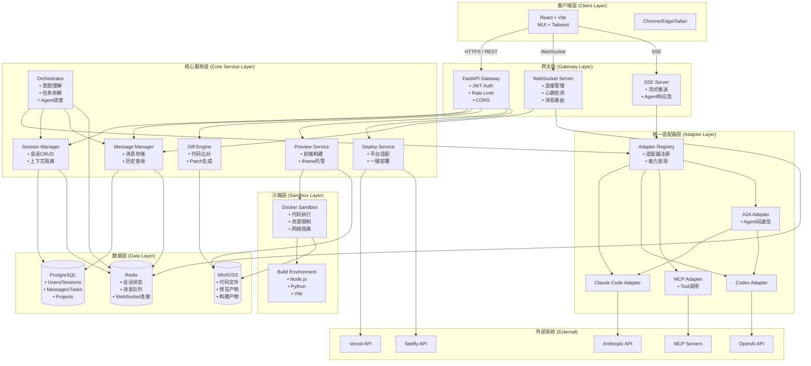

### 2.2 核心模块依赖图

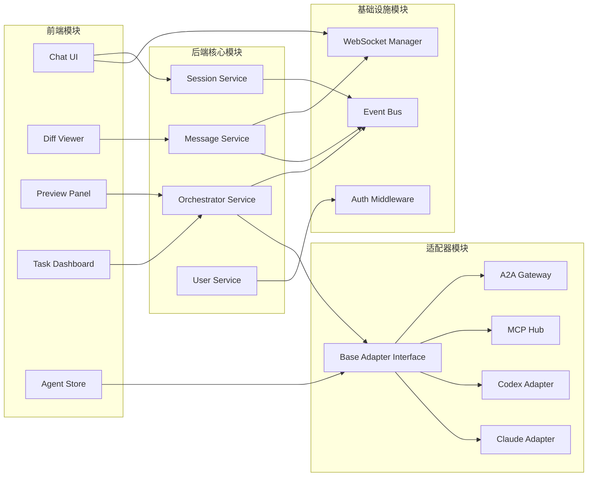

---

## 3. 文件列表及相对路径

### 3.1 项目根目录结构

```
agenthub/
├── docker-compose.yml              # 全栈一键部署
├── Dockerfile                      # 后端服务镜像
├── Dockerfile.frontend             # 前端构建镜像
├── README.md
├── .env.example                    # 环境变量模板
├── docs/                           # 文档目录
│   ├── PRD.md
│   ├── ARCHITECTURE.md
│   ├── sequence-diagram.mermaid
│   └── class-diagram.mermaid
│
├── frontend/                       # 前端工程 (Vite + React)
│   ├── package.json
│   ├── vite.config.ts
│   ├── tsconfig.json
│   ├── tailwind.config.js
│   ├── index.html
│   ├── src/
│   │   ├── main.tsx                # 应用入口
│   │   ├── App.tsx                 # 根组件
│   │   ├── index.css               # 全局样式
│   │   │
│   │   ├── stores/                 # Zustand 状态管理
│   │   │   ├── authStore.ts
│   │   │   ├── sessionStore.ts
│   │   │   ├── messageStore.ts
│   │   │   ├── orchestratorStore.ts
│   │   │   └── uiStore.ts
│   │   │
│   │   ├── api/                    # API 客户端
│   │   │   ├── client.ts           # axios/fetch封装
│   │   │   ├── auth.ts
│   │   │   ├── sessions.ts
│   │   │   ├── messages.ts
│   │   │   ├── agents.ts
│   │   │   ├── tasks.ts
│   │   │   ├── diff.ts
│   │   │   ├── preview.ts
│   │   │   └── deploy.ts
│   │   │
│   │   ├── hooks/                  # 自定义React Hooks
│   │   │   ├── useWebSocket.ts
│   │   │   ├── useSSE.ts
│   │   │   ├── useChat.ts
│   │   │   ├── useAgentRegistry.ts
│   │   │   └── useAuth.ts
│   │   │
│   │   ├── components/             # 公共UI组件
│   │   │   ├── common/
│   │   │   │   ├── Avatar.tsx
│   │   │   │   ├── StatusBadge.tsx
│   │   │   │   ├── LoadingDots.tsx
│   │   │   │   └── ErrorBoundary.tsx
│   │   │   ├── layout/
│   │   │   │   ├── Sidebar.tsx
│   │   │   │   ├── TopBar.tsx
│   │   │   │   ├── ResizablePanel.tsx
│   │   │   │   └── MainLayout.tsx
│   │   │   └── chat/
│   │   │       ├── MessageBubble.tsx
│   │   │       ├── MessageList.tsx
│   │   │       ├── MessageInput.tsx
│   │   │       ├── CodeBlock.tsx
│   │   │       ├── MarkdownRenderer.tsx
│   │   │       ├── TypingIndicator.tsx
│   │   │       ├── AgentMention.tsx
│   │   │       └── AgentLogPanel.tsx
│   │   │
│   │   ├── pages/                  # 页面级组件
│   │   │   ├── LoginPage.tsx
│   │   │   ├── RegisterPage.tsx
│   │   │   ├── ChatPage.tsx        # IM主界面
│   │   │   ├── SessionListPage.tsx
│   │   │   ├── AgentStorePage.tsx
│   │   │   └── SettingsPage.tsx
│   │   │
│   │   ├── features/               # 业务特性组件
│   │   │   ├── chat/
│   │   │   │   ├── ChatContainer.tsx
│   │   │   │   ├── ChatHeader.tsx
│   │   │   │   ├── SessionList.tsx
│   │   │   │   ├── SessionItem.tsx
│   │   │   │   ├── GroupMemberList.tsx
│   │   │   │   └── CreateSessionModal.tsx
│   │   │   ├── diff/
│   │   │   │   ├── DiffViewer.tsx
│   │   │   │   ├── FileTree.tsx
│   │   │   │   ├── DiffActions.tsx
│   │   │   │   └── DiffModal.tsx
│   │   │   ├── preview/
│   │   │   │   ├── PreviewPanel.tsx
│   │   │   │   ├── PreviewToolbar.tsx
│   │   │   │   ├── DeviceSwitcher.tsx
│   │   │   │   └── ShareButton.tsx
│   │   │   ├── orchestrator/
│   │   │   │   ├── TaskTree.tsx
│   │   │   │   ├── TaskNode.tsx
│   │   │   │   ├── TaskProgress.tsx
│   │   │   │   ├── OrchestratorPanel.tsx
│   │   │   │   └── HumanApprovalGate.tsx
│   │   │   └── agent/
│   │   │       ├── AgentCard.tsx
│   │   │       ├── AgentConfigForm.tsx
│   │   │       └── AgentCapabilityList.tsx
│   │   │
│   │   ├── types/                  # TypeScript类型定义
│   │   │   ├── user.ts
│   │   │   ├── session.ts
│   │   │   ├── message.ts
│   │   │   ├── agent.ts
│   │   │   ├── task.ts
│   │   │   ├── diff.ts
│   │   │   ├── websocket.ts
│   │   │   └── api.ts
│   │   │
│   │   └── utils/                  # 工具函数
│   │       ├── formatters.ts
│   │       ├── validators.ts
│   │       ├── constants.ts
│   │       └── websocket.ts
│   │
│   └── public/
│       └── favicon.ico
│
├── backend/                        # 后端工程 (FastAPI + Python)
│   ├── requirements.txt
│   ├── pyproject.toml
│   ├── alembic.ini                 # 数据库迁移
│   ├── alembic/                    # 迁移脚本目录
│   │   ├── env.py
│   │   └── versions/
│   ├── Dockerfile
│   │
│   ├── app/
│   │   ├── __init__.py
│   │   ├── main.py                 # FastAPI应用入口
│   │   ├── config.py               # 配置管理 (Pydantic Settings)
│   │   ├── dependencies.py         # 依赖注入
│   │   ├── exceptions.py           # 全局异常处理
│   │   └── constants.py            # 业务常量
│   │
│   ├── app/api/                    # API路由层
│   │   ├── __init__.py
│   │   ├── v1/
│   │   │   ├── __init__.py
│   │   │   ├── router.py           # API v1总路由
│   │   │   ├── auth.py             # 认证API
│   │   │   ├── users.py            # 用户API
│   │   │   ├── sessions.py         # 会话API
│   │   │   ├── messages.py         # 消息API
│   │   │   ├── agents.py           # Agent API
│   │   │   ├── tasks.py            # 任务API
│   │   │   ├── diff.py             # Diff API
│   │   │   ├── preview.py          # 预览API
│   │   │   └── deploy.py           # 部署API
│   │   └── websocket/
│   │       ├── __init__.py
│   │       ├── router.py           # WebSocket路由
│   │       ├── manager.py          # 连接管理器
│   │       └── handlers.py         # 消息处理器
│   │
│   ├── app/core/                   # 核心服务层
│   │   ├── __init__.py
│   │   ├── auth_service.py         # 认证服务
│   │   ├── session_service.py      # 会话服务
│   │   ├── message_service.py      # 消息服务
│   │   ├── user_service.py         # 用户服务
│   │   ├── task_service.py         # 任务服务
│   │   ├── diff_service.py         # Diff服务
│   │   ├── preview_service.py      # 预览服务
│   │   └── deploy_service.py       # 部署服务
│   │
│   ├── app/orchestrator/           # Orchestrator编排器
│   │   ├── __init__.py
│   │   ├── orchestrator.py         # 主编排器
│   │   ├── intent_classifier.py    # 意图分类器
│   │   ├── task_planner.py         # 任务规划器
│   │   ├── task_decomposer.py      # 任务拆解器
│   │   ├── agent_router.py         # Agent路由器
│   │   ├── agent_scheduler.py      # Agent调度器
│   │   ├── result_aggregator.py    # 结果聚合器
│   │   └── context_manager.py      # 上下文管理器
│   │
│   ├── app/adapters/               # 统一适配器层
│   │   ├── __init__.py
│   │   ├── base_adapter.py         # 适配器抽象基类
│   │   ├── adapter_registry.py     # 适配器注册表
│   │   ├── adapter_factory.py      # 适配器工厂
│   │   ├── claude_adapter.py       # Claude Code适配器
│   │   ├── codex_adapter.py        # Codex适配器
│   │   ├── mcp_adapter.py          # MCP协议适配器
│   │   └── a2a_adapter.py          # A2A协议适配器
│   │
│   ├── app/agents/                 # Agent定义与管理
│   │   ├── __init__.py
│   │   ├── agent_registry.py       # Agent注册表
│   │   ├── agent_manager.py        # Agent生命周期管理
│   │   ├── builtin_agents.py       # 内置Agent定义
│   │   └── agent_config.py         # Agent配置模型
│   │
│   ├── app/events/                 # Event Stream事件总线
│   │   ├── __init__.py
│   │   ├── event_bus.py            # 事件总线核心
│   │   ├── event_types.py          # 事件类型枚举
│   │   ├── event_stream.py         # 事件流处理器
│   │   ├── handlers/               # 事件处理器
│   │   │   ├── message_handler.py
│   │   │   ├── agent_handler.py
│   │   │   └── task_handler.py
│   │   └── publishers/             # 事件发布器
│   │       ├── websocket_publisher.py
│   │       └── sse_publisher.py
│   │
│   ├── app/models/                 # ORM数据模型
│   │   ├── __init__.py
│   │   ├── base.py                 # SQLAlchemy基类
│   │   ├── user.py
│   │   ├── session.py
│   │   ├── message.py
│   │   ├── agent.py
│   │   ├── task.py
│   │   ├── project.py
│   │   └── file_change.py
│   │
│   ├── app/schemas/                # Pydantic数据模型
│   │   ├── __init__.py
│   │   ├── user.py
│   │   ├── session.py
│   │   ├── message.py
│   │   ├── agent.py
│   │   ├── task.py
│   │   ├── diff.py
│   │   ├── websocket.py
│   │   └── common.py               # 通用响应格式
│   │
│   ├── app/sandbox/                # 代码沙箱
│   │   ├── __init__.py
│   │   ├── sandbox.py              # 沙箱管理器
│   │   ├── docker_runner.py        # Docker执行器
│   │   ├── build_engine.py         # 前端构建引擎
│   │   └── security.py             # 安全策略
│   │
│   ├── app/deploy/                 # 部署服务
│   │   ├── __init__.py
│   │   ├── deploy_manager.py       # 部署管理器
│   │   ├── vercel_deployer.py      # Vercel部署
│   │   ├── netlify_deployer.py     # Netlify部署
│   │   └── deploy_config.py        # 部署配置
│   │
│   ├── app/utils/                  # 工具模块
│   │   ├── __init__.py
│   │   ├── crypto.py               # 加密工具 (API Key)
│   │   ├── jwt_helper.py           # JWT工具
│   │   ├── diff_utils.py           # Diff计算工具
│   │   ├── validators.py           # 输入校验
│   │   └── logger.py               # 结构化日志
│   │
│   └── app/db/                     # 数据库层
│       ├── __init__.py
│       ├── session.py              # DB Session管理
│       ├── connection.py           # 连接池
│       └── migrations/             # 迁移脚本
│
├── sandbox/                        # 沙箱运行时目录 (挂载卷)
│   ├── templates/                  # 项目模板
│   └── workspaces/                 # 用户工作区
│
└── scripts/                        # 运维脚本
    ├── init_db.sh
    ├── migrate.sh
    └── seed_data.py
```

---

## 4. 数据结构与接口

### 4.1 核心实体类图

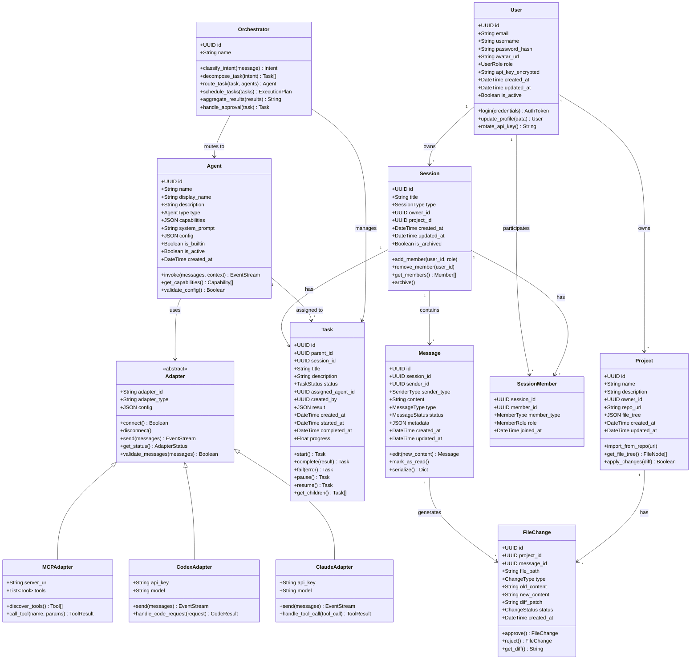

### 4.2 适配器接口详细定义

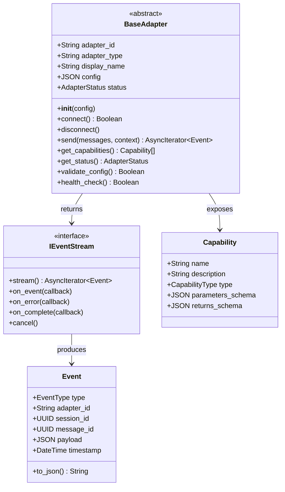

### 4.3 REST API 接口定义

| 模块 | 方法 | 路径 | 说明 |
|:---|:---|:---|:---|
| **Auth** | POST | `/api/v1/auth/register` | 用户注册 |
| | POST | `/api/v1/auth/login` | 用户登录 |
| | POST | `/api/v1/auth/refresh` | 刷新Token |
| | POST | `/api/v1/auth/logout` | 登出 |
| **User** | GET | `/api/v1/users/me` | 获取当前用户 |
| | PUT | `/api/v1/users/me` | 更新用户信息 |
| | PUT | `/api/v1/users/api-key` | 更新API Key |
| **Session** | GET | `/api/v1/sessions` | 获取会话列表 |
| | POST | `/api/v1/sessions` | 创建会话 |
| | GET | `/api/v1/sessions/{id}` | 获取会话详情 |
| | PUT | `/api/v1/sessions/{id}` | 更新会话 |
| | DELETE | `/api/v1/sessions/{id}` | 删除会话 |
| | POST | `/api/v1/sessions/{id}/members` | 添加成员 |
| | DELETE | `/api/v1/sessions/{id}/members/{member_id}` | 移除成员 |
| **Message** | GET | `/api/v1/sessions/{id}/messages` | 获取消息历史 |
| | POST | `/api/v1/sessions/{id}/messages` | 发送消息 |
| | PUT | `/api/v1/messages/{id}` | 编辑消息 |
| | DELETE | `/api/v1/messages/{id}` | 删除消息 |
| **Agent** | GET | `/api/v1/agents` | 获取Agent列表 |
| | GET | `/api/v1/agents/{id}` | 获取Agent详情 |
| | POST | `/api/v1/agents` | 创建自定义Agent |
| | PUT | `/api/v1/agents/{id}` | 更新Agent配置 |
| | POST | `/api/v1/agents/{id}/test` | 测试Agent连接 |
| **Task** | GET | `/api/v1/sessions/{id}/tasks` | 获取任务树 |
| | GET | `/api/v1/tasks/{id}` | 获取任务详情 |
| | POST | `/api/v1/tasks/{id}/approve` | 人工审批通过 |
| | POST | `/api/v1/tasks/{id}/reject` | 人工审批拒绝 |
| **Diff** | GET | `/api/v1/messages/{id}/diff` | 获取消息关联的Diff |
| | POST | `/api/v1/diff/{id}/apply` | 应用代码变更 |
| | POST | `/api/v1/diff/{id}/reject` | 拒绝代码变更 |
| | POST | `/api/v1/diff/batch-apply` | 批量应用变更 |
| **Preview** | GET | `/api/v1/sessions/{id}/preview` | 获取预览URL |
| | POST | `/api/v1/sessions/{id}/preview/build` | 触发构建 |
| | GET | `/api/v1/preview/{token}/` | 预览代理服务 |
| **Deploy** | POST | `/api/v1/sessions/{id}/deploy` | 一键部署 |
| | GET | `/api/v1/deployments` | 获取部署历史 |
| | POST | `/api/v1/deployments/{id}/rollback` | 回滚部署 |

### 4.4 WebSocket 事件协议

```typescript
// 客户端 → 服务端
interface ClientEvents {
  "message:send": { session_id: string; content: string; type: "text" | "mention" };
  "message:typing": { session_id: string; is_typing: boolean };
  "agent:invoke": { session_id: string; agent_id: string; content: string };
  "task:approve": { task_id: string; approved: boolean };
  "session:join": { session_id: string };
  "session:leave": { session_id: string };
  "ping": {};
}

// 服务端 → 客户端
interface ServerEvents {
  "message:received": Message;
  "message:stream": { message_id: string; delta: string };
  "message:completed": Message;
  "agent:typing": { session_id: string; agent_id: string };
  "agent:log": { session_id: string; agent_id: string; log: AgentLog };
  "task:updated": Task;
  "task:needs_approval": { task_id: string; description: string };
  "diff:generated": { message_id: string; changes: FileChange[] };
  "preview:ready": { session_id: string; url: string };
  "deploy:completed": { deployment_id: string; url: string };
  "error": { code: string; message: string };
  "pong": {};
}
```

---

## 5. 程序调用流程

### 5.1 单聊流程

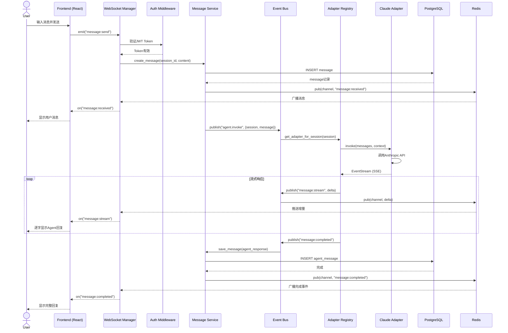

### 5.2 群聊 @Agent 流程

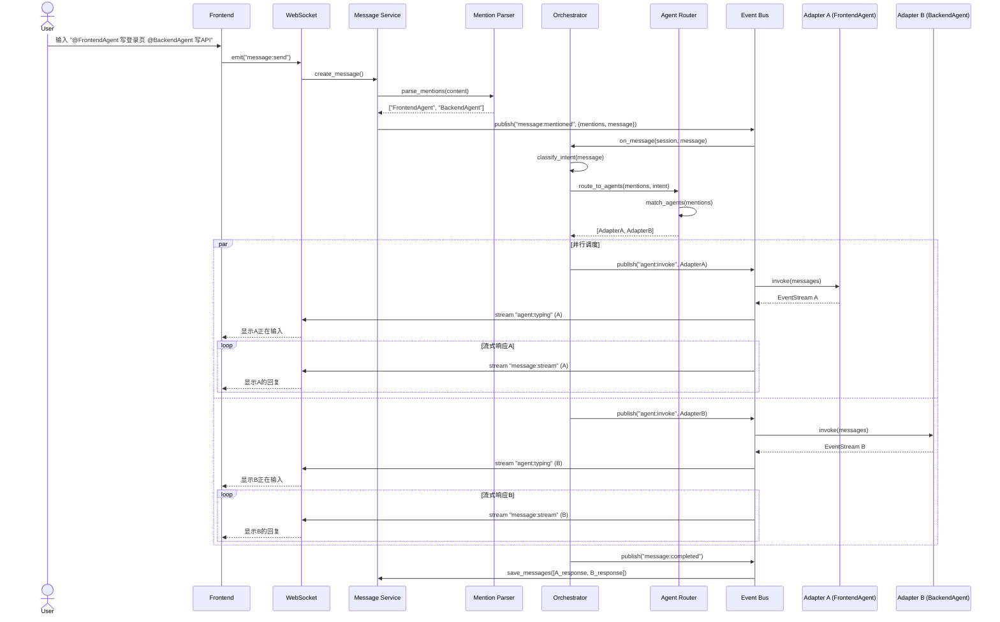

### 5.3 Orchestrator 任务拆解流程

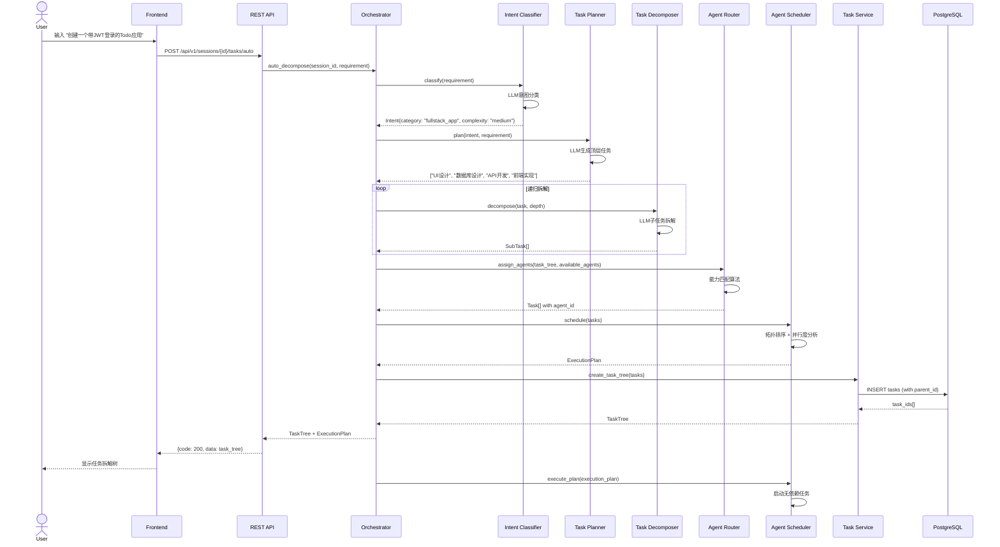

### 5.4 代码 Diff 生成流程

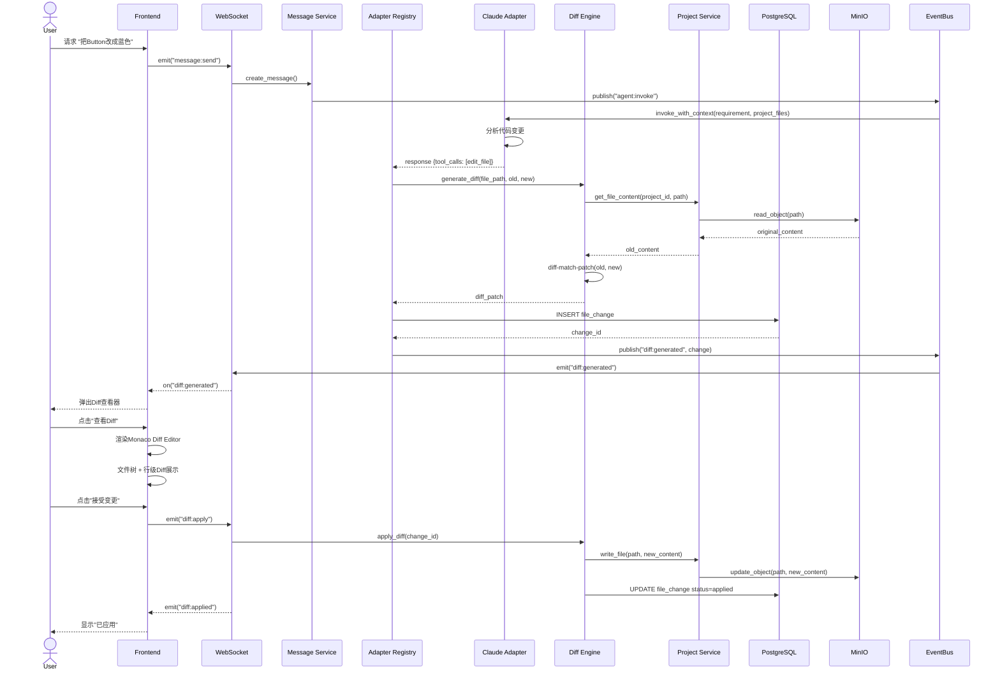

### 5.5 网页预览流程

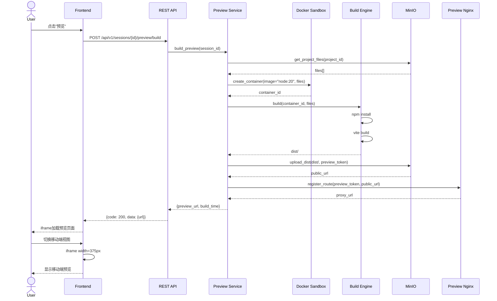

### 5.6 一键部署流程

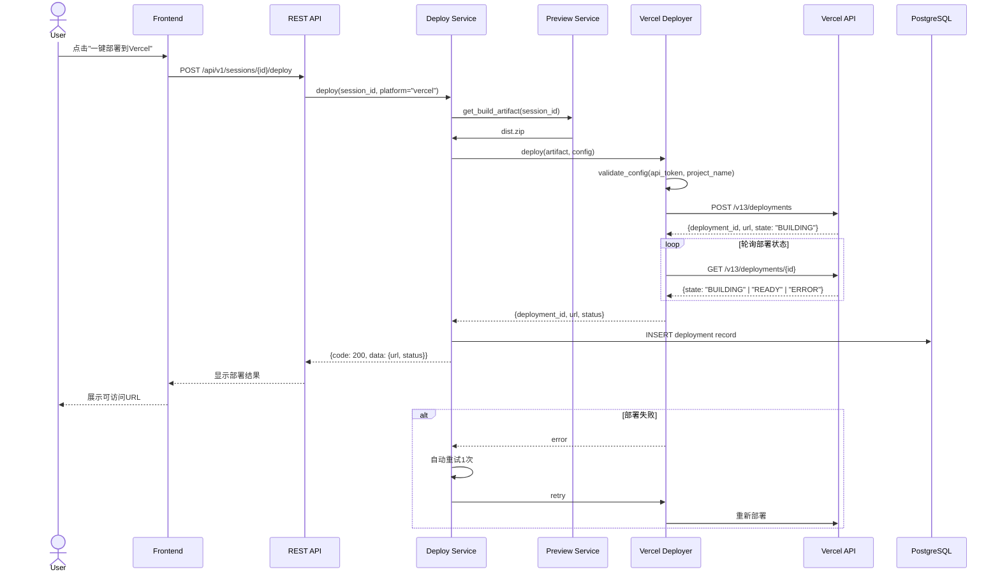

---

## 6. 任务列表

### T01: 项目基础设施与数据库层

**优先级**: P0  
**依赖**: 无  
**说明**: 搭建前后端项目骨架、数据库模型、迁移脚本、Docker环境

| 文件 | 说明 |
|:---|:---|
| `docker-compose.yml` | PostgreSQL + Redis + MinIO + Nginx + 后端 + 前端全栈编排 |
| `backend/requirements.txt` | Python依赖声明 |
| `backend/pyproject.toml` | Poetry/Setuptools配置 |
| `backend/alembic.ini` | Alembic迁移配置 |
| `backend/alembic/env.py` | 迁移环境 |
| `backend/app/main.py` | FastAPI应用入口、中间件挂载 |
| `backend/app/config.py` | Pydantic Settings配置管理 |
| `backend/app/dependencies.py` | 依赖注入容器 |
| `backend/app/exceptions.py` | 全局异常处理 |
| `backend/app/db/session.py` | SQLAlchemy异步Session |
| `backend/app/db/connection.py` | 数据库连接池 |
| `backend/app/models/base.py` | ORM基类 |
| `backend/app/models/user.py` | User模型 |
| `backend/app/models/session.py` | Session模型 |
| `backend/app/models/message.py` | Message模型 |
| `backend/app/models/agent.py` | Agent模型 |
| `backend/app/models/task.py` | Task模型 |
| `backend/app/models/project.py` | Project模型 |
| `backend/app/models/file_change.py` | FileChange模型 |
| `backend/app/schemas/*.py` | Pydantic Schema定义 |
| `frontend/package.json` | npm依赖声明 |
| `frontend/vite.config.ts` | Vite构建配置 |
| `frontend/tsconfig.json` | TypeScript配置 |
| `frontend/tailwind.config.js` | Tailwind配置 |
| `frontend/index.html` | 入口HTML |
| `frontend/src/main.tsx` | React应用入口 |
| `frontend/src/App.tsx` | 根组件 |
| `frontend/src/index.css` | 全局样式 |
| `frontend/src/types/*.ts` | TypeScript类型定义 |

### T02: 认证与会话管理层

**优先级**: P0  
**依赖**: T01  
**说明**: 用户认证、会话CRUD、WebSocket连接管理、消息基础接口

| 文件 | 说明 |
|:---|:---|
| `backend/app/utils/crypto.py` | AES-256加密工具 (API Key) |
| `backend/app/utils/jwt_helper.py` | JWT生成/验证 |
| `backend/app/core/auth_service.py` | 认证业务逻辑 |
| `backend/app/core/user_service.py` | 用户管理 |
| `backend/app/core/session_service.py` | 会话管理 |
| `backend/app/core/message_service.py` | 消息管理 |
| `backend/app/api/v1/auth.py` | 认证路由 |
| `backend/app/api/v1/users.py` | 用户路由 |
| `backend/app/api/v1/sessions.py` | 会话路由 |
| `backend/app/api/v1/messages.py` | 消息路由 |
| `backend/app/api/websocket/manager.py` | WebSocket连接池 |
| `backend/app/api/websocket/handlers.py` | WebSocket消息处理 |
| `backend/app/api/websocket/router.py` | WebSocket路由 |
| `frontend/src/stores/authStore.ts` | 认证状态管理 |
| `frontend/src/stores/sessionStore.ts` | 会话状态管理 |
| `frontend/src/stores/messageStore.ts` | 消息状态管理 |
| `frontend/src/api/auth.ts` | 认证API客户端 |
| `frontend/src/api/sessions.ts` | 会话API客户端 |
| `frontend/src/api/messages.ts` | 消息API客户端 |
| `frontend/src/hooks/useAuth.ts` | 认证Hook |
| `frontend/src/hooks/useWebSocket.ts` | WebSocket Hook |
| `frontend/src/pages/LoginPage.tsx` | 登录页 |
| `frontend/src/pages/RegisterPage.tsx` | 注册页 |
| `frontend/src/pages/ChatPage.tsx` | IM主界面框架 |
| `frontend/src/features/chat/SessionList.tsx` | 会话列表 |
| `frontend/src/features/chat/ChatContainer.tsx` | 聊天容器 |
| `frontend/src/features/chat/MessageList.tsx` | 消息列表 |
| `frontend/src/features/chat/MessageInput.tsx` | 消息输入框 |

### T03: 统一适配器层与核心聊天

**优先级**: P0  
**依赖**: T02  
**说明**: Agent适配器抽象、Claude/Codex适配器实现、MCP适配器、单聊/群聊完整功能

| 文件 | 说明 |
|:---|:---|
| `backend/app/adapters/base_adapter.py` | 适配器抽象基类 |
| `backend/app/adapters/adapter_registry.py` | 适配器注册表 |
| `backend/app/adapters/adapter_factory.py` | 适配器工厂 |
| `backend/app/adapters/claude_adapter.py` | Claude Code适配器 |
| `backend/app/adapters/codex_adapter.py` | Codex适配器 |
| `backend/app/adapters/mcp_adapter.py` | MCP协议适配器 |
| `backend/app/agents/agent_registry.py` | Agent注册表 |
| `backend/app/agents/agent_manager.py` | Agent生命周期 |
| `backend/app/agents/builtin_agents.py` | 内置Agent定义 |
| `backend/app/agents/agent_config.py` | Agent配置模型 |
| `backend/app/events/event_types.py` | 事件类型枚举 |
| `backend/app/events/event_bus.py` | Event Bus核心 |
| `backend/app/events/event_stream.py` | 事件流处理器 |
| `backend/app/events/handlers/*.py` | 事件处理器 |
| `backend/app/api/v1/agents.py` | Agent API路由 |
| `frontend/src/stores/orchestratorStore.ts` | Orchestrator状态 |
| `frontend/src/api/agents.ts` | Agent API客户端 |
| `frontend/src/hooks/useAgentRegistry.ts` | Agent注册Hook |
| `frontend/src/hooks/useChat.ts` | 聊天逻辑Hook |
| `frontend/src/hooks/useSSE.ts` | SSE流式响应Hook |
| `frontend/src/components/chat/MessageBubble.tsx` | 消息气泡 |
| `frontend/src/components/chat/CodeBlock.tsx` | 代码块渲染 |
| `frontend/src/components/chat/MarkdownRenderer.tsx` | Markdown渲染 |
| `frontend/src/components/chat/AgentMention.tsx` | @Agent提及 |
| `frontend/src/components/chat/TypingIndicator.tsx` | 输入指示器 |
| `frontend/src/components/chat/AgentLogPanel.tsx` | Agent日志面板 |
| `frontend/src/features/chat/GroupMemberList.tsx` | 群成员列表 |
| `frontend/src/pages/AgentStorePage.tsx` | Agent商店 |
| `frontend/src/features/agent/AgentCard.tsx` | Agent卡片 |
| `frontend/src/features/agent/AgentConfigForm.tsx` | Agent配置表单 |

### T04: Orchestrator、Diff与预览部署

**优先级**: P0 / P1  
**依赖**: T03  
**说明**: 任务拆解编排器、代码Diff引擎、沙箱预览、一键部署

| 文件 | 说明 |
|:---|:---|
| `backend/app/orchestrator/orchestrator.py` | 主编排器 |
| `backend/app/orchestrator/intent_classifier.py` | 意图分类器 |
| `backend/app/orchestrator/task_planner.py` | 任务规划器 |
| `backend/app/orchestrator/task_decomposer.py` | 任务拆解器 |
| `backend/app/orchestrator/agent_router.py` | Agent路由器 |
| `backend/app/orchestrator/agent_scheduler.py` | Agent调度器 |
| `backend/app/orchestrator/result_aggregator.py` | 结果聚合器 |
| `backend/app/orchestrator/context_manager.py` | 上下文管理器 |
| `backend/app/orchestrator/human_approval_gate.py` | 人工审批节点 |
| `backend/app/core/task_service.py` | 任务服务 |
| `backend/app/core/diff_service.py` | Diff服务 |
| `backend/app/core/preview_service.py` | 预览服务 |
| `backend/app/core/deploy_service.py` | 部署服务 |
| `backend/app/sandbox/sandbox.py` | 沙箱管理器 |
| `backend/app/sandbox/docker_runner.py` | Docker执行器 |
| `backend/app/sandbox/build_engine.py` | 前端构建引擎 |
| `backend/app/sandbox/security.py` | 安全策略 |
| `backend/app/deploy/deploy_manager.py` | 部署管理器 |
| `backend/app/deploy/vercel_deployer.py` | Vercel部署器 |
| `backend/app/deploy/netlify_deployer.py` | Netlify部署器 |
| `backend/app/utils/diff_utils.py` | Diff计算工具 |
| `backend/app/api/v1/tasks.py` | 任务API |
| `backend/app/api/v1/diff.py` | Diff API |
| `backend/app/api/v1/preview.py` | 预览API |
| `backend/app/api/v1/deploy.py` | 部署API |
| `frontend/src/api/tasks.ts` | 任务API客户端 |
| `frontend/src/api/diff.ts` | Diff API客户端 |
| `frontend/src/api/preview.ts` | 预览API客户端 |
| `frontend/src/api/deploy.ts` | 部署API客户端 |
| `frontend/src/features/diff/DiffViewer.tsx` | Diff查看器 |
| `frontend/src/features/diff/FileTree.tsx` | 文件树 |
| `frontend/src/features/diff/DiffActions.tsx` | Diff操作栏 |
| `frontend/src/features/preview/PreviewPanel.tsx` | 预览面板 |
| `frontend/src/features/preview/PreviewToolbar.tsx` | 预览工具栏 |
| `frontend/src/features/preview/DeviceSwitcher.tsx` | 设备切换 |
| `frontend/src/features/orchestrator/TaskTree.tsx` | 任务树组件 |
| `frontend/src/features/orchestrator/TaskNode.tsx` | 任务节点 |
| `frontend/src/features/orchestrator/TaskProgress.tsx` | 任务进度 |
| `frontend/src/features/orchestrator/OrchestratorPanel.tsx` | 编排器面板 |
| `frontend/src/features/orchestrator/HumanApprovalGate.tsx` | 审批门 |
| `frontend/src/components/layout/ResizablePanel.tsx` | 可调整面板 |

### T05: 集成测试、优化与部署配置

**优先级**: P1  
**依赖**: T04  
**说明**: 全链路集成、Docker镜像优化、性能调优、文档完善

| 文件 | 说明 |
|:---|:---|
| `Dockerfile` | 后端生产镜像 |
| `Dockerfile.frontend` | 前端生产镜像 |
| `nginx.conf` | Nginx反向代理配置 |
| `scripts/init_db.sh` | 数据库初始化脚本 |
| `scripts/migrate.sh` | 迁移脚本 |
| `scripts/seed_data.py` | 种子数据 |
| `backend/app/utils/logger.py` | 结构化日志 |
| `backend/app/utils/validators.py` | 输入校验器 |
| `frontend/src/components/common/ErrorBoundary.tsx` | 错误边界 |
| `frontend/src/components/layout/MainLayout.tsx` | 主布局 |
| `frontend/src/components/layout/Sidebar.tsx` | 侧边栏 |
| `frontend/src/components/layout/TopBar.tsx` | 顶部栏 |
| `frontend/src/utils/websocket.ts` | WebSocket工具 |
| `frontend/src/utils/formatters.ts` | 格式化工具 |
| `frontend/src/pages/SettingsPage.tsx` | 设置页 |
| `README.md` | 项目README |
| `.env.example` | 环境变量模板 |

### 任务依赖图

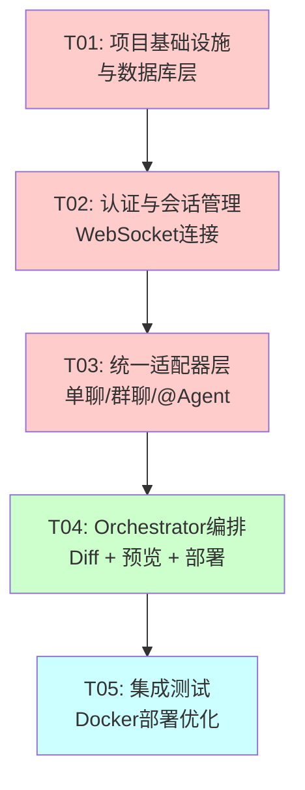

---

## 7. 依赖包列表

### 7.1 前端依赖 (package.json)

```json
{
  "dependencies": {
    "react": "^18.2.0",
    "react-dom": "^18.2.0",
    "react-router-dom": "^6.22.0",
    "@mui/material": "^5.14.0",
    "@mui/icons-material": "^5.14.0",
    "@emotion/react": "^11.11.0",
    "@emotion/styled": "^11.11.0",
    "@monaco-editor/react": "^4.6.0",
    "zustand": "^4.5.0",
    "axios": "^1.6.0",
    "socket.io-client": "^4.7.0",
    "react-markdown": "^9.0.0",
    "remark-gfm": "^4.0.0",
    "react-syntax-highlighter": "^15.5.0",
    "diff-match-patch": "^1.0.5",
    "date-fns": "^3.0.0",
    "lodash-es": "^4.17.21",
    "uuid": "^9.0.0"
  },
  "devDependencies": {
    "@types/react": "^18.2.0",
    "@types/react-dom": "^18.2.0",
    "@types/lodash-es": "^4.17.0",
    "@types/uuid": "^9.0.0",
    "@types/diff-match-patch": "^1.0.36",
    "typescript": "^5.3.0",
    "vite": "^5.0.0",
    "@vitejs/plugin-react": "^4.2.0",
    "tailwindcss": "^3.3.0",
    "autoprefixer": "^10.4.0",
    "postcss": "^8.4.0",
    "eslint": "^8.55.0",
    "@typescript-eslint/eslint-plugin": "^6.15.0",
    "@typescript-eslint/parser": "^6.15.0",
    "prettier": "^3.1.0"
  }
}
```

### 7.2 后端依赖 (requirements.txt)

```
# Web Framework
fastapi==0.110.0
uvicorn[standard]==0.27.0
python-multipart==0.0.9

# WebSocket
python-socketio==5.11.0
websockets==12.0

# SSE
fastapi-sse==0.5.0

# Database
sqlalchemy[asyncio]==2.0.27
asyncpg==0.29.0
alembic==1.13.1
redis==5.0.1

# Pydantic & Validation
pydantic==2.6.1
pydantic-settings==2.1.0
email-validator==2.1.0

# Authentication
pyjwt==2.8.0
passlib[bcrypt]==1.7.4
python-jose[cryptography]==3.3.0
cryptography==42.0.0

# AI / LLM
openai==1.12.0
anthropic==0.18.0
langchain==0.1.0
langchain-openai==0.0.5

# MCP Protocol
mcp==0.4.0

# HTTP Client
httpx==0.26.0
aiohttp==3.9.1

# Diff & Code
diff-match-patch==20230430

# Docker SDK
docker==7.0.0

# Utilities
python-dotenv==1.0.0
structlog==24.1.0
orjson==3.9.0
tenacity==8.2.0

# Testing
pytest==8.0.0
pytest-asyncio==0.23.0
httpx==0.26.0

# Development
black==24.1.0
isort==5.13.0
mypy==1.8.0
```

---

## 8. 共享知识

### 8.1 代码风格

```
前端 (TypeScript/React):
- 使用函数组件 + Hooks，禁止使用Class组件
- 组件命名: PascalCase (MessageBubble.tsx)
- Hook命名: camelCase with "use" prefix (useWebSocket.ts)
- 状态管理: Zustand store文件用 camelCase + "Store"后缀
- 接口定义: I前缀可选，优先用描述性命名
- 文件组织: 每个组件一个目录，含index.tsx + styles.ts

后端 (Python):
- 遵循PEP 8，使用black格式化 (line-length: 100)
- import排序: isort (stdlib → third-party → local)
- 类型注解: 全部函数必须加类型注解
- 异步优先: 所有I/O操作使用async/await
- 异常: 自定义异常继承自AppException基类
```

### 8.2 命名规范

```
数据库表: 复数小写 + 下划线 (users, session_members)
Python类: PascalCase (SessionManager)
Python函数/变量: snake_case (create_message)
TypeScript接口: PascalCase (MessagePayload)
TypeScript类型: PascalCase with Type suffix (MessageType)
API路径: kebab-case (api/v1/session-members)
环境变量: UPPER_SNAKE_CASE (DATABASE_URL)
WebSocket事件: camelCase with colon (message:received)
```

### 8.3 错误处理策略

```python
# 后端统一响应格式
{
    "code": 0,           # 0=成功, >0=业务错误码
    "data": {...},       # 业务数据
    "message": "ok"      # 人类可读信息
}

# 错误码规范
# 1xxx: 通用错误
# 2xxx: 认证相关
# 3xxx: 会话/消息
# 4xxx: Agent/适配器
# 5xxx: 任务/Orchestrator
# 6xxx: Diff/预览/部署

# 异常层级
class AppException(Exception):
    def __init__(self, code: int, message: str, status_code: int = 400):
        ...

class AuthException(AppException): code=2001
class SessionException(AppException): code=3001
class AgentException(AppException): code=4001
class TaskException(AppException): code=5001
class DeployException(AppException): code=6001
```

### 8.4 日志规范

```python
# 使用structlog结构化日志
# 每个请求生成唯一trace_id，贯穿全链路

# 日志级别
DEBUG: 详细调试信息（开发环境）
INFO: 正常业务流程（登录、消息发送、任务完成）
WARNING: 非致命异常（Agent响应慢、重试）
ERROR: 业务异常（API调用失败、数据库错误）
CRITICAL: 系统级异常（数据库断开、沙箱逃逸）

# 必含字段
trace_id: 链路追踪ID
user_id: 操作用户
session_id: 关联会话
agent_id: 关联Agent（如有）
duration_ms: 操作耗时
```

### 8.5 WebSocket连接规范

```
1. 连接建立: 携带JWT Token作为query param (?token=xxx)
2. 心跳机制: 客户端每30s发送ping，服务端回复pong
3. 断线重连: 客户端自动重连，指数退避 (1s, 2s, 4s, 8s, max 30s)
4. 房间管理: 用户加入会话 = 订阅session:{id}频道
5. 消息顺序: 依赖服务端时间戳排序，客户端不做重排
6. 流式消息: SSE用于Agent流式响应，WebSocket用于状态推送
```

### 8.6 适配器接口契约

```python
# 所有适配器必须实现的统一接口
class BaseAdapter(ABC):
    @abstractmethod
    async def connect(self) -> bool: ...

    @abstractmethod
    async def disconnect(self) -> None: ...

    @abstractmethod
    async def send(
        self,
        messages: List[Message],
        context: Optional[Dict] = None
    ) -> AsyncIterator[Event]: ...

    @abstractmethod
    def get_capabilities(self) -> List[Capability]: ...

    @abstractmethod
    def health_check(self) -> bool: ...

# 事件类型统一枚举
class EventType(Enum):
    TEXT_DELTA = "text_delta"       # 文本增量
    TOOL_CALL = "tool_call"         # 工具调用
    TOOL_RESULT = "tool_result"     # 工具结果
    THINKING = "thinking"           # 思考过程
    ERROR = "error"                 # 错误
    COMPLETE = "complete"           # 完成
    LOG = "log"                     # 执行日志
```

### 8.7 数据库设计约定

```
- 所有表必须有: id (UUID, PK), created_at, updated_at
- 软删除: is_deleted字段 (不物理删除)
- 外键约束: 所有关系必须声明外键
- 索引策略: 查询频率高的字段必须建索引
- JSON字段: 使用PostgreSQL JSONB类型，配合GIN索引
- 分区策略: 消息表按session_id哈希分区（预留）
```

---

## 9. 待明确事项

基于PRD中的Open Questions，从架构层面给出建议决策：

| 编号 | 问题 | 架构建议决策 | 理由 |
|:---|:---|:---|:---|
| **OQ-001** | 用户自带API Key还是平台统一提供？ | **支持双模式**：平台提供默认Key（演示用），用户可配置个人Key（生产用） | 比赛演示时不需要观众注册API Key；生产环境用户自有Key可降低成本 |
| **OQ-002** | 群聊Agent串行还是并行响应？ | **默认并行，支持串行模式**。@多个Agent时并行；Agent间有依赖时串行 | 并行提升响应速度，串行保证逻辑正确性。由Orchestrator的Scheduler决定 |
| **OQ-003** | 预览构建在服务端还是客户端？ | **服务端构建（Docker Sandbox）** | 安全性（代码隔离）、资源可控（限制CPU/内存）、支持npm生态（需要Node.js） |
| **OQ-004** | 一键部署支持哪些平台？ | **P0: Vercel；P1: Netlify** | Vercel API最成熟，对前端项目支持最好。Netlify作为备选 |
| **OQ-005** | 本地运行还是纯Web应用？ | **纯Web应用（优先），预留桌面端扩展接口** | 比赛提交要求公网可访问，Web应用最符合。后续可通过Tauri封装桌面端 |
| **OQ-006** | 沙箱资源限制？ | **CPU: 1核, 内存: 1GB, 时长: 5分钟, 网络: 禁止出站** | 平衡安全性与功能性。构建超时5分钟足够大多数前端项目 |
| **OQ-007** | 语音消息支持？ | **P2功能，架构预留接口** | 比赛时间有限，优先核心功能。Web Speech API可作为低成本实现方案 |
| **OQ-008** | Agent通信协议：自研 vs A2A/MCP？ | **MCP作为工具接入标准，A2A作为跨Agent通信标准，自研Event Stream作为内部通信** | 三层协议栈：对内Event Stream，对外MCP/A2A。既兼容标准又保持灵活性 |
| **OQ-009** | 多人实时协作编辑？ | **P2功能，架构预留但本轮不实现** | 需要OT/CRDT算法，复杂度极高。当前版本采用"独占编辑+Diff申请"模式 |
| **OQ-010** | Demo预设场景？ | **场景1: Todo应用（全栈）** 覆盖单聊→群聊→代码→预览→部署全链路 | Todo应用足够展示所有核心功能，复杂度可控 |

---

## 10. 创新点设计

### 10.1 架构层面创新

#### 创新点 1: **三层协议栈统一适配层** ⭐核心创新

```
┌──────────────────────────────────────────────────────────────┐
│                    AgentHub 三层协议栈                         │
├──────────────────────────────────────────────────────────────┤
│  Layer 3: Event Stream (内部通信)                             │
│  • 借鉴Agent TARS的Event Stream架构                          │
│  • 所有Agent行为序列化为结构化Event                          │
│  • 支持回放、调试、可观测性                                  │
├──────────────────────────────────────────────────────────────┤
│  Layer 2: MCP (工具接入标准)                                  │
│  • 统一接入文件系统、浏览器、数据库等外部工具                │
│  • Claude Code/Codex的工具调用均通过MCP Hub                  │
├──────────────────────────────────────────────────────────────┤
│  Layer 1: A2A (跨Agent通信)                                   │
│  • Agent间通过A2A标准协议互操作                              │
│  • 支持AgentCard能力发现                                     │
│  • 可对接外部A2A兼容Agent                                    │
└──────────────────────────────────────────────────────────────┘
```

**与竞品差异化**：AutoGen/CrewAI没有协议分层概念，LangGraph没有A2A/MCP兼容。AgentHub是业界首个同时集成Event Stream + MCP + A2A三层协议的平台。

#### 创新点 2: **Orchestrator 智能路由引擎**

```python
# 多维度Agent匹配算法
class AgentRouter:
    def match(self, task: Task, agents: List[Agent]) -> Agent:
        scores = {}
        for agent in agents:
            score = 0.0
            # 维度1: 能力匹配度 (语义嵌入)
            score += self.capability_similarity(task, agent) * 0.4
            # 维度2: 历史成功率
            score += self.historical_success_rate(agent, task.type) * 0.25
            # 维度3: 当前负载
            score += self.load_balance_score(agent) * 0.20
            # 维度4: 上下文连续性
            score += self.context_continuity(task, agent) * 0.15
            scores[agent.id] = score
        return max(scores, key=scores.get)
```

**比赛亮点**：动态路由算法结合了语义匹配、历史数据、负载均衡、上下文连续性四个维度，远超简单轮询或静态映射。

#### 创新点 3: **实时成本透明仪表板**

```
每个Session实时展示:
├── Token消耗: Input/Output分离统计
├── API调用次数: 按Agent/按时间维度
├── 响应延迟热力图
├── 费用估算 (基于各平台定价)
└── 历史趋势对比

架构实现:
├── Adapter拦截所有LLM调用
├── 统一记录token用量、latency、cost
├── Event Bus广播到前端仪表板
└── Redis时序数据结构聚合统计
```

**比赛亮点**：竞品几乎没有成本控制可视化。这既是功能亮点，也体现了工程设计的完整性。

### 10.2 技术实现创新

| 创新点 | 技术方案 | 评分优势 |
|:---|:---|:---|
| **Event Stream全链路追踪** | 所有Agent操作生成结构化Event，支持倍速回放 | 可视化创新性(13分) + Agent架构(20分) |
| **智能上下文压缩** | LLM对话超过上下文窗口时，自动摘要历史消息 | Agent架构设计深度 |
| **人机协同审批节点** | Orchestrator在关键步骤自动暂停，等待人工确认 | 功能完整度(25分) |
| **代码沙箱动态隔离** | 每个预览/部署请求创建独立Docker容器，秒级销毁 | 安全需求 + 工程规范 |
| **流式Diff生成** | Agent回复过程中实时检测代码变更，边回复边生成Diff | 可视化创新性 |
| **Agent能力雷达图** | 前端可视化展示各Agent的能力分布和置信度 | 可视化创新性 |

### 10.3 演示策略建议

**Demo黄金路径**（90秒完整演示）：

```
1. [0-10s]  登录 → 进入AgentHub主界面
2. [10-20s] 创建群聊，邀请 FrontendAgent + BackendAgent
3. [20-40s] 发送 "@Orchestrator 创建一个带登录的Todo应用"
4. [40-55s] Orchestrator实时拆解任务树，Agent并行协作
5. [55-70s] 查看代码Diff，接受修改
6. [70-80s] 实时预览网页效果
7. [80-90s] 一键部署到Vercel，展示线上URL
```

---

## 附录 A: 核心评分对标

| 评分维度 | 满分 | AgentHub设计对应点 |
|:---|:---|:---|
| 文档完整性与可复现性 | 15 | PRD + ARCHITECTURE + docker-compose一键启动 |
| 功能实现完整度 | 25 | P0全实现 + P1核心功能 + P2预留架构 |
| 可视化创新性 | 13 | Event Stream回放、成本仪表板、Agent雷达图、TaskTree可视化 |
| **Agent架构设计** | **20** | **三层协议栈、统一适配器、智能路由、上下文压缩** |
| 代码质量与工程规范 | 17 | 类型安全、结构化日志、依赖注入、测试覆盖 |
| 创新与自由发挥 | 10 | MCP+A2A双协议、人机协同审批、成本透明 |
| **合计** | **100** | **目标冲刺90+分** |

---

*文档结束*
