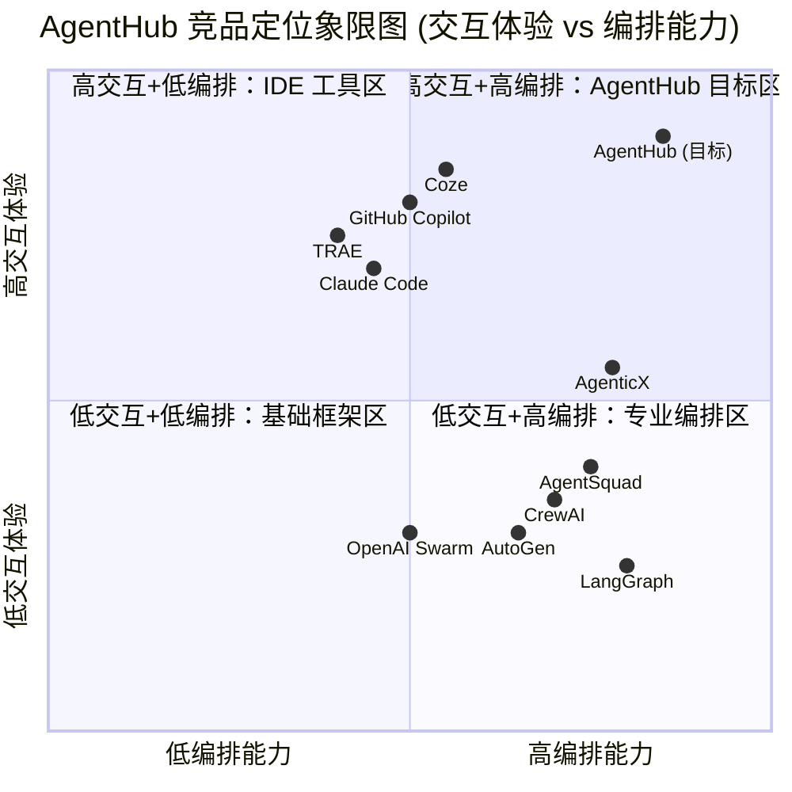

# AgentHub 产品需求文档 (PRD)

> **版本**: v1.0  
> **日期**: 2026-05-17  
> **语言**: 中文  
> **编程语言**: Vite + React + MUI + Tailwind CSS (前端) / Python (后端)  
> **项目代号**: agenthub

---

## 1. 项目概述与目标

### 1.1 背景

在大模型与 AI Agent 技术快速发展的背景下，多 Agent 协作已成为提升复杂任务执行效率的关键趋势。传统单一 Agent 模式难以应对复杂软件开发、数据分析、内容创作等需要多角色协同的场景。业界亟需一个**统一的多 Agent 协作平台**，让开发者能够像使用飞书/微信一样自然地与多个 AI Agent 交互协作。

### 1.2 产品定义

AgentHub 是一个 **IM 聊天式多 Agent 协作平台**，基于统一适配器层与主流 Agent 平台（Claude Code、Codex 等），为开发者提供自然交互体验的 AI 驱动开发与协作环境。

### 1.3 产品目标

1. **打造极致交互体验**：提供类似飞书/微信的自然 IM 交互，支持单聊、群聊、多会话并行，降低多 Agent 协作的认知门槛。
2. **构建统一 Agent 适配层**：通过标准化适配器接入 Claude Code、Codex、自研 Agent 等 heterogeneous agents，实现跨平台 Agent 统一调度。
3. **实现端到端开发闭环**：覆盖需求描述 → 任务拆解 → 多 Agent 协作编码 → Code Diff 展示 → 网页预览 → 一键部署的完整链路。

### 1.4 成功指标

| 指标 | 目标值 | 说明 |
|:---|:---|:---|
| 单会话 Agent 响应延迟 | < 3s | 端到端首 token 返回时间 |
| 群聊 Agent 调度准确率 | > 90% | @指令路由到正确 Agent 的概率 |
| 代码 Diff 渲染正确率 | > 95% | 语法高亮与 diff 展示无错乱 |
| 网页预览加载时间 | < 5s | 从生成代码到可预览 |
| 一键部署成功率 | > 95% | 部署流程无人工干预的成功率 |

---

## 2. 市场调研报告

### 2.1 行业趋势

- **多 Agent 协作成主流**：2025-2026 年，从单 Agent 工具向多 Agent 协作系统演进成为行业共识，Gartner 预测到 2027 年 50% 的企业将使用多 Agent 系统。
- **IM 式交互崛起**：类 Slack/飞书的对话式交互成为 AI 产品主流范式，降低用户学习成本。
- **端到端闭环需求**：开发者不仅需要代码生成，更需要从需求到部署的完整闭环。
- **开放协议标准化**：MCP (Model Context Protocol)、A2A (Agent-to-Agent) 等协议推动 Agent 互操作性。

### 2.2 竞品分析

#### 2.2.1 多 Agent 编排框架

| 竞品 | 核心定位 | 架构亮点 | 多 Agent 协作模式 | 与 AgentHub 差异 | 开源协议 |
|:---|:---|:---|:---|:---|:---|
| **AutoGen** (Microsoft) | 对话式多 Agent 编程框架 | 三层架构：Core API + AgentChat API + Extensions；支持 .NET/Python 跨语言；事件驱动运行时 | 自由对话协商、GroupChat、AgentTool 编排 | AgentHub 是平台化产品，AutoGen 是底层框架；AgentHub 提供 IM 式 UI，AutoGen 需自行开发前端 | MIT (代码) / CC-BY-4.0 (文档) |
| **CrewAI** | 角色驱动的多 Agent 团队框架 | Crews（自主协作）+ Flows（精确控制）双架构；YAML 声明式配置；完全不依赖 LangChain | 角色扮演、顺序/层级执行、任务委托、流程路由 | AgentHub 是即时交互平台，CrewAI 是预定义工作流；AgentHub 支持动态群聊，CrewAI 适合批处理任务 | MIT |
| **LangGraph** | 低级别状态机编排框架 | 灵感源于 Google Pregel；持久化执行（故障恢复）；人机协同中断机制；显式状态管理 | 图结构定义节点+边；可自定义 Supervisor/Swarm 拓扑 | AgentHub 是高级应用平台，LangGraph 是底层引擎；AgentHub 封装复杂度，提供开箱即用体验 | MIT |
| **OpenAI Swarm** | 轻量级多 Agent 教育框架 | 仅 Agent + Handoff 两个原语；无状态设计；客户端运行；纯 Python 函数即工具 | 通过函数返回 Agent 实现控制权交接 | AgentHub 是生产级平台，Swarm 是实验/教学性质；Swarm 已被 OpenAI Agents SDK 取代 | MIT |
| **AgentSquad** (原 Multi-Agent Orchestrator) | 智能路由多 Agent 编排器 | Classifier 意图分类 + Orchestrator 生命周期管理；SupervisorAgent 并行协调；AWS Lambda 原生支持 | 基于语义动态路由；跨 Agent 上下文保持；异构 Agent 集成 | AgentHub 更接近 IM 平台，AgentSquad 是中间件编排层；两者可互补——AgentHub 可用 AgentSquad 作底层路由 | Apache-2.0 |
| **AgenticX** | 全栈多 Agent 操作系统级框架 | 5 层架构：UI → Studio Runtime → Core → Platform → Domain；Meta-Agent (CEO Dispatcher) 编排；15+ LLM 提供商 | 委托、角色扮演、对话管理、任务锁；工作流引擎 + Flow 装饰器 | AgenticX 是框架+桌面应用，AgentHub 是 Web 平台；AgentHub 更聚焦 IM 聊天体验与代码协作；AgenticX 有 Electron 桌面端，AgentHub 主打 Web | AGPL-3.0 |

#### 2.2.2 AI 编程/协作工具

| 竞品 | 核心定位 | 架构亮点 | 协作模式 | 与 AgentHub 差异 | 开源协议 |
|:---|:---|:---|:---|:---|:---|
| **TRAE** (字节跳动) | AI 原生 IDE | 基于 VSCode；Builder/Chat/SOLO 三模式；豆包/DeepSeek 模型 | 人与 AI 协作编码；AI 端到端项目交付 | TRAE 是 IDE，AgentHub 是协作平台；AgentHub 支持多 Agent 群聊，TRAE 是单 AI 助手；AgentHub 可集成 TRAE 作为 Agent 之一 | 闭源 (免费) |
| **Claude Code** (Anthropic) | Agentic 编码系统 | 项目级代码库理解；自主执行循环（规划→执行→测试→迭代）；直接调用 Git/CLI/K8s | 单 Agent 深度协作；人类定义目标+审查结果 | Claude Code 是单 Agent 命令行工具，AgentHub 是多 Agent 平台；AgentHub 可接入 Claude Code 作为 Agent 节点 | 闭源 (订阅制) |
| **GitHub Copilot Workspace** | AI 驱动开发平台 | 深度 IDE 集成；Agent 模式自主规划执行；Copilot Spaces 知识库；MCP 生态 | 人机协同（Copilot not Autopilot）；多 Agent 并行（Copilot + Claude + Codex）| Copilot 绑定 GitHub 生态，AgentHub 是开放中立平台；AgentHub 提供群聊@机制，Copilot 是 IDE 内交互 | 闭源 (订阅制) |
| **Coze** (字节跳动) | 一站式 Agent 开发平台 | 六层微服务架构；可视化拖拽工作流；RAG 知识库；多模型网关；飞书生态深度整合 | 单 Agent 对话 + 工作流编排；插件/知识库/数据库扩展 | Coze 面向非技术用户的低代码平台，AgentHub 面向开发者的专业协作平台；AgentHub 支持多 Agent 实时群聊，Coze 以单 Agent 为主 | 闭源 (SaaS) |

#### 2.2.3 竞品差异化总结

```
┌─────────────────────────────────────────────────────────────────────┐
│                        AgentHub 差异化定位                           │
├─────────────────────────────────────────────────────────────────────┤
│  ❌ 不是底层编排框架（AutoGen/CrewAI/LangGraph）→ 我们构建于其上      │
│  ❌ 不是单一 IDE 插件（TRAE/Claude Code/Copilot）→ 我们统一调度它们   │
│  ❌ 不是低代码平台（Coze）→ 我们面向专业开发者                         │
│  ✅ 是 IM 式多 Agent 协作中枢 → 类飞书的@群聊体验                     │
│  ✅ 是统一 Agent 适配网关 → 异构 Agent 标准化接入                     │
│  ✅ 是端到端开发闭环 → 需求→代码→预览→部署一站式                     │
└─────────────────────────────────────────────────────────────────────┘
```

### 2.3 可借鉴之处

| 来源 | 可借鉴点 | 应用方式 |
|:---|:---|:---|
| AutoGen | GroupChat 机制、AgentTool 模式 | 群聊中的 Agent 工具调用与协商逻辑 |
| CrewAI | 角色定义 + 任务委派 | Orchestrator 的任务拆解与 Agent 分配 |
| LangGraph | 状态机持久化、人机协同中断 | 长任务执行的状态恢复与人工审批节点 |
| OpenAI Swarm | Handoff 交接原语 | 群聊中 Agent 之间的控制权转移 |
| AgentSquad | 智能语义路由 | @指令的 Agent 匹配算法 |
| AgenticX | Meta-Agent 编排、MCP Hub、A2A 协议 | 统一适配器层的设计参考 |
| TRAE | Builder/SOLO 模式 | 端到端项目交付的交互设计 |
| Claude Code | 项目级代码理解、自主执行循环 | Agent 的代码操作能力设计 |
| GitHub Copilot | Agent 模式、MCP Registry | 开放工具生态的接入标准 |
| Coze | 插件系统、知识库、工作流 | Agent 能力扩展与可视化编排 |

---

## 3. 用户画像与用户故事

### 3.1 用户画像

#### 用户画像 A：全栈开发者「李明」

| 属性 | 描述 |
|:---|:---|
| 年龄/经验 | 28 岁，5 年开发经验 |
| 技术栈 | React + Node.js + Python |
| 痛点 | 需要快速搭建原型，但不想在环境配置、重复代码上浪费时间；希望有一个平台能同时协调前端 Agent、后端 Agent、测试 Agent 协作完成项目 |
| 使用场景 | 快速开发 MVP、代码重构、技术调研 |
| 核心需求 | 自然语言描述需求 → 多 Agent 自动分工 → 实时查看代码修改 → 一键预览和部署 |

#### 用户画像 B：AI 产品经理「张薇」

| 属性 | 描述 |
|:---|:---|
| 年龄/经验 | 32 岁，8 年产品经验，2 年 AI 产品经验 |
| 技术栈 | 懂基础代码，非专业开发 |
| 痛点 | 验证 AI 产品想法时，需要依赖开发资源，沟通成本高；想直接驱动 Agent 完成可运行的原型 |
| 使用场景 | 产品原型验证、PRD 到可运行 Demo、用户测试 |
| 核心需求 | 低门槛与 Agent 对话、可视化查看 Agent 协作过程、快速生成可预览的网页 |

#### 用户画像 C：技术团队 Leader「王强」

| 属性 | 描述 |
|:---|:---|
| 年龄/经验 | 35 岁，10 年经验，管理 8 人团队 |
| 技术栈 | Java / Go / 云原生 |
| 痛点 | 团队代码审查效率低；新人上手慢；希望标准化常用开发流程 |
| 使用场景 | 代码审查自动化、新人培训、标准化模块生成 |
| 核心需求 | 代码 Diff 清晰展示、可复用的 Agent 团队模板、部署流水线集成 |

#### 用户画像 D：独立开发者/创业者「陈浩」

| 属性 | 描述 |
|:---|:---|
| 年龄/经验 | 26 岁，3 年经验 |
| 技术栈 | 全栈，偏好 Next.js + Python |
| 痛点 | 一人承担所有开发工作，希望 Agent 能分担编码、测试、部署工作 |
| 使用场景 | 个人项目开发、副业产品、开源项目维护 |
| 核心需求 | 成本低（或免费）、部署简单、多 Agent 7x24 协作 |

### 3.2 用户故事

#### US-001：单聊快速编码

> **As a** 全栈开发者（李明）  
> **I want** 与单个代码 Agent 进行一对一对话  
> **So that** 我可以快速生成、修改、审查代码，就像和一位资深工程师结对编程

**验收标准**:
- 用户可以创建与特定 Agent 的单聊会话
- Agent 能理解项目上下文，基于已有代码进行回复
- 支持代码块的语法高亮与一键复制
- 支持连续多轮对话保持上下文

#### US-002：多会话并行

> **As a** 独立开发者（陈浩）  
> **I want** 同时维护多个独立的 Agent 会话  
> **So that** 我可以在不同项目中并行工作，互不干扰

**验收标准**:
- 用户可同时开启 ≥5 个活跃会话
- 每个会话有独立的上下文、项目关联和聊天记录
- 会话列表支持搜索、筛选、置顶、归档
- 未读消息有清晰的红点/数字提醒

#### US-003：群聊多 Agent 协作

> **As a** 技术团队 Leader（王强）  
> **I want** 在一个群聊中通过 @ 指令调用不同 Agent 协作  
> **So that** 我可以像调度团队一样，让前端 Agent、后端 Agent、测试 Agent 共同完成复杂任务

**验收标准**:
- 群聊中支持 @AgentName 触发指定 Agent 响应
- Agent 能感知群聊中其他 Agent 的消息，理解协作上下文
- Orchestrator 可自动介入，根据任务类型推荐或调度 Agent
- 支持查看每个 Agent 的思考过程/执行日志

#### US-004：任务拆解与自动调度

> **As a** AI 产品经理（张薇）  
> **I want** 用自然语言描述一个复杂需求，系统自动拆解为子任务并分配给合适的 Agent  
> **So that** 我不需要了解技术细节，也能驱动多 Agent 完成复杂开发任务

**验收标准**:
- 输入自然语言需求（如"创建一个带登录功能的 Todo 应用"）
- Orchestrator 自动拆解为子任务（UI 设计、数据库设计、API 开发、前端实现）
- 每个子任务自动分配给最匹配的 Agent
- 用户可查看任务拆解树和执行进度
- 支持人工调整任务分配

#### US-005：代码 Diff 审查

> **As a** 全栈开发者（李明）  
> **I want** 清晰查看 Agent 对代码的修改 Diff  
> **So that** 我可以快速审查变更内容，确认无误后再应用

**验收标准**:
- Diff 展示支持行级对比，绿色新增 / 红色删除
- 支持文件树导航，批量查看多个文件的变更
- 支持逐行评论、接受/拒绝单个修改
- 支持一键应用所有变更到工作区

#### US-006：实时网页预览

> **As a** AI 产品经理（张薇）  
> **I want** 在 Agent 生成前端代码后，实时预览网页效果  
> **So that** 我可以即时验证产品效果，给出反馈

**验收标准**:
- 前端代码生成后自动触发预览构建
- 预览窗口内嵌在聊天界面右侧（或弹窗）
- 支持移动端/桌面端视图切换
- 支持将预览链接分享给团队成员

#### US-007：一键部署

> **As a** 独立开发者（陈浩）  
> **I want** 完成开发后一键部署到托管平台  
> **So that** 我可以快速将项目上线，无需手动配置服务器

**验收标准**:
- 支持一键部署到 Vercel / Netlify / Cloudflare Pages 等平台
- 部署前自动运行构建和基础测试
- 部署完成后返回可访问的 URL
- 支持回滚到上一版本

---

## 4. 功能需求

### 4.1 功能架构图

```
┌─────────────────────────────────────────────────────────────────────────────┐
│                            AgentHub 功能架构                                 │
├─────────────────────────────────────────────────────────────────────────────┤
│  ┌─────────────┐  ┌─────────────┐  ┌─────────────┐  ┌─────────────────────┐ │
│  │   单聊模块   │  │   群聊模块   │  │  会话管理模块 │  │    预览与部署模块     │ │
│  │  - 1v1 对话  │  │  - @Agent   │  │  - 多会话并行 │  │  - 代码 Diff        │ │
│  │  - 代码高亮  │  │  - 群成员管理│  │  - 搜索归档  │  │  - 网页预览          │ │
│  │  - 上下文保持│  │  - 群公告   │  │  - 消息提醒  │  │  - 一键部署          │ │
│  └─────────────┘  └─────────────┘  └─────────────┘  └─────────────────────┘ │
├─────────────────────────────────────────────────────────────────────────────┤
│  ┌───────────────────────────────────────────────────────────────────────┐  │
│  │                      Orchestrator 协调器模块                            │  │
│  │   - 意图理解  →  任务拆解  →  Agent 匹配  →  调度执行  →  结果聚合      │  │
│  └───────────────────────────────────────────────────────────────────────┘  │
├─────────────────────────────────────────────────────────────────────────────┤
│  ┌───────────────────────────────────────────────────────────────────────┐  │
│  │                      统一适配器层 (Adapter Layer)                       │  │
│  │   ┌──────────┐  ┌──────────┐  ┌──────────┐  ┌──────────┐  ┌────────┐ │  │
│  │   │Claude Code│  │   Codex   │  │ 自研 Agent│  │  MCP Tool │  │ A2A    │ │  │
│  │   └──────────┘  └──────────┘  └──────────┘  └──────────┘  └────────┘ │  │
│  └───────────────────────────────────────────────────────────────────────┘  │
└─────────────────────────────────────────────────────────────────────────────┘
```

### 4.2 P0 功能（Must Have - 核心功能）

| 编号 | 功能模块 | 功能描述 | 验收标准 | 关联用户故事 |
|:---|:---|:---|:---|:---|
| P0-001 | IM 单聊 | 用户与单个 Agent 一对一对话 | 支持文本、代码块、Markdown 渲染；上下文 ≥20 轮；响应延迟 <3s | US-001 |
| P0-002 | 多会话并行 | 同时维护多个独立会话 | 支持 ≥5 个活跃会话；会话切换 <1s；独立上下文隔离 | US-002 |
| P0-003 | 群聊基础 | 创建群聊并邀请 Agent/用户加入 | 支持 ≥5 个群成员；群消息实时同步；群成员列表展示 | US-003 |
| P0-004 | @Agent 指令 | 在群聊中 @ 指定 Agent 触发响应 | @ 识别准确率 >90%；被 @ Agent 需在 3s 内响应；支持一次 @ 多个 Agent | US-003 |
| P0-005 | Orchestrator 任务拆解 | 自然语言需求自动拆解为子任务 | 支持至少 3 级任务树；拆解准确率 >80%；支持人工调整 | US-004 |
| P0-006 | Agent 调度执行 | Orchestrator 将子任务分配给对应 Agent 执行 | Agent 匹配准确率 >85%；支持并行执行无依赖子任务；执行状态实时同步 | US-004 |
| P0-007 | 代码 Diff 展示 | 展示 Agent 对代码的修改差异 | 支持行级 diff；文件树导航；语法高亮正确率 >95% | US-005 |
| P0-008 | 代码应用/拒绝 | 用户可接受或拒绝 Agent 的代码修改 | 支持单文件接受/拒绝；支持批量接受；应用后代码立即生效 | US-005 |
| P0-009 | 统一适配器层 | 标准化接入 Claude Code、Codex 等 Agent | 至少接入 2 个外部 Agent；适配器接口统一；新增 Agent 接入成本 <1 人天 | - |
| P0-010 | 用户认证 | 注册、登录、权限管理 | 支持邮箱/手机注册；JWT 鉴权；基础 RBAC（管理员/普通用户）| - |

### 4.3 P1 功能（Should Have - 重要功能）

| 编号 | 功能模块 | 功能描述 | 验收标准 | 关联用户故事 |
|:---|:---|:---|:---|:---|
| P1-001 | 网页实时预览 | 前端代码生成后实时预览 | 构建时间 <30s；支持 React/Vue/HTML；移动端/桌面端切换 | US-006 |
| P1-002 | 一键部署 | 部署到 Vercel/Netlify 等托管平台 | 支持至少 2 个平台；部署成功率 >95%；返回可访问 URL | US-007 |
| P1-003 | 流式响应 | Agent 回复采用 SSE 流式输出 | 首 token 延迟 <1s；流式卡顿率 <5% | US-001 |
| P1-004 | 文件上传 | 用户上传图片、文档、代码文件 | 支持图片/PDF/代码文件；图片支持 OCR 识别；文件大小 ≤10MB | US-001 |
| P1-005 | 会话历史搜索 | 搜索历史聊天记录 | 支持关键词搜索；搜索结果响应 <2s；支持按时间/会话筛选 | US-002 |
| P1-006 | Agent 商店 | 浏览、安装、配置第三方 Agent | 展示 ≥10 个预设 Agent；支持自定义 Agent 配置（system prompt、工具）| - |
| P1-007 | 群聊协作日志 | 展示群聊中 Agent 的协作过程 | 显示 Agent 思考过程、工具调用记录、执行耗时；支持展开/折叠 | US-003 |
| P1-008 | 项目工作区 | 关联代码仓库/本地目录作为项目上下文 | 支持 GitHub 仓库导入；支持本地目录上传；代码索引用于上下文理解 | US-001 |
| P1-009 | 人机协同审批 | 长任务执行中插入人工审批节点 | Orchestrator 可在关键步骤暂停等待人工确认；审批超时自动回退 | US-004 |
| P1-010 | MCP 工具集成 | 通过 MCP 协议接入外部工具 | 支持至少 3 个 MCP Server（如文件系统、浏览器、数据库）；工具调用成功率 >90% | - |

### 4.4 P2 功能（Nice to Have - 增强功能）

| 编号 | 功能模块 | 功能描述 | 验收标准 | 关联用户故事 |
|:---|:---|:---|:---|:---|
| P2-001 | 语音输入 | 支持语音消息转文字发送 | 语音识别准确率 >95%；支持中文/英文；延迟 <2s | US-001 |
| P2-002 | 主题切换 | 支持亮色/暗色/高对比度主题 | 三种主题完整覆盖所有 UI 组件；切换无闪烁 | - |
| P2-003 | 移动端适配 | 支持手机浏览器访问核心功能 | 核心功能可用；布局自适应；触摸操作友好 | - |
| P2-004 | Agent 团队模板 | 保存和复用常用 Agent 组合 | 支持创建/分享/导入模板；预设 ≥3 个模板（如"全栈开发团队"）| US-003 |
| P2-005 | 执行回放 | 回放 Agent 的执行过程 | 支持倍速播放；关键节点高亮；可跳转到指定步骤 | US-003 |
| P2-006 | 团队协作 | 多人类用户在同一群聊中协作 | 支持 @ 人类成员；权限控制（谁可以 @ 哪些 Agent）；操作审计日志 | US-003 |
| P2-007 | API 开放平台 | 对外开放 RESTful API | 支持会话创建、消息发送、结果查询；提供 API Key 管理；Rate Limit 控制 | - |
| P2-008 | A2A 协议支持 | Agent 间通过 A2A 标准协议通信 | 支持 AgentCard 发现；Skill 暴露为工具；跨域 Agent 调用 | - |
| P2-009 | 智能推荐 | 根据用户行为推荐 Agent/模板 | 点击率 >10%；推荐内容相关性人工评分 >4/5 | - |
| P2-010 | 插件系统 | 支持第三方开发 UI 插件 | 提供插件 SDK；支持自定义消息渲染组件；至少 1 个示例插件 | - |

---

## 5. 非功能需求

### 5.1 性能需求

| 编号 | 需求 | 指标 | 优先级 |
|:---|:---|:---|:---|
| NF-001 | 前端首屏加载 | < 2s（3G 网络下 < 5s）| P0 |
| NF-002 | Agent 首 token 延迟 | < 3s（单聊）；< 5s（群聊 3 Agent 并行）| P0 |
| NF-003 | 消息发送到展示 | < 500ms（本地）| P0 |
| NF-004 | 会话切换 | < 1s | P0 |
| NF-005 | 代码 Diff 渲染 | < 2s（1000 行以内）| P1 |
| NF-006 | 预览构建时间 | < 60s（标准 React 项目）| P1 |
| NF-007 | 系统并发 | 支持 ≥100 个并发会话 | P1 |
| NF-008 | 消息历史加载 | 支持加载 ≥1000 条消息不卡顿 | P1 |

### 5.2 安全需求

| 编号 | 需求 | 说明 | 优先级 |
|:---|:---|:---|:---|
| NF-009 | 代码沙箱执行 | Agent 生成的代码在隔离沙箱中运行，禁止访问宿主系统 | P0 |
| NF-010 | 用户数据隔离 | 不同用户的数据严格隔离，不可互相访问 | P0 |
| NF-011 | API Key 加密存储 | 用户的 LLM API Key 使用 AES-256 加密存储 | P0 |
| NF-012 | XSS 防护 | 所有用户输入和 Agent 输出需做 XSS 过滤 | P0 |
| NF-013 | CSRF 防护 | 关键操作需 CSRF Token 验证 | P0 |
| NF-014 | 审计日志 | 记录关键操作（登录、部署、代码应用）日志 | P1 |
| NF-015 | 内容安全 | 过滤敏感/违法内容输入输出 | P1 |
| NF-016 | 部署权限控制 | 部署操作需二次确认，支持部署白名单 | P1 |

### 5.3 可用性需求

| 编号 | 需求 | 说明 | 优先级 |
|:---|:---|:---|:---|
| NF-017 | 无障碍支持 | 支持键盘导航、屏幕阅读器兼容、ARIA 标签 | P1 |
| NF-018 | 离线提示 | 网络断开时明确提示，恢复后自动重连 | P1 |
| NF-019 | 错误恢复 | Agent 执行失败时自动重试 1 次，仍失败则清晰报错 | P1 |
| NF-020 | 操作可撤销 | 代码应用支持撤销（至少 1 步）| P1 |
| NF-021 | 引导教程 | 首次使用提供交互式引导 | P2 |

### 5.4 可扩展性需求

| 编号 | 需求 | 说明 | 优先级 |
|:---|:---|:---|:---|
| NF-022 | Agent 横向扩展 | 新增 Agent 适配器不修改核心代码 | P0 |
| NF-023 | 部署目标扩展 | 新增部署平台仅需配置，不修改核心逻辑 | P1 |
| NF-024 | 主题扩展 | 新主题通过配置文件即可生效 | P2 |
| NF-025 | 多语言支持 | 架构预留国际化扩展能力（i18n）| P2 |

### 5.5 兼容性需求

| 编号 | 需求 | 说明 | 优先级 |
|:---|:---|:---|:---|
| NF-026 | 浏览器兼容 | 支持 Chrome/Edge/Firefox/Safari 最新 2 个版本 | P0 |
| NF-027 | 响应式布局 | 适配 ≥1280px（桌面）、≥768px（平板）、≥375px（手机）| P1 |

---

## 6. 技术约束与假设

### 6.1 技术约束

| 编号 | 约束项 | 说明 |
|:---|:---|:---|
| TC-001 | 前端技术栈 | Vite + React + MUI + Tailwind CSS（赛题默认要求）|
| TC-002 | IM 交互体验 | 必须提供类飞书/微信的自然聊天体验，不能是命令行式交互 |
| TC-003 | Agent 适配 | 必须支持 Claude Code 和 Codex 至少其中之一 |
| TC-004 | 部署能力 | 必须实现至少一种一键部署能力 |
| TC-005 | 代码展示 | 必须支持代码 Diff 的可视化展示 |
| TC-006 | 预览能力 | 必须支持前端页面的实时预览 |
| TC-007 | 协作模式 | 必须支持群聊@多 Agent 协作模式 |

### 6.2 技术假设

| 编号 | 假设 | 风险 |
|:---|:---|:---|
| TA-001 | LLM API 可用性 | 假设 OpenAI / Anthropic / 火山引擎等 API 服务可用；**风险**：API 限流或故障需降级处理 |
| TA-002 | 沙箱环境 | 假设可在容器/Docker 中安全执行代码；**风险**：资源消耗大，需限制执行时长 |
| TA-003 | 部署平台 API | 假设 Vercel/Netlify 等提供稳定 API；**风险**：API 变更需适配 |
| TA-004 | 浏览器能力 | 假设现代浏览器支持 WebSocket、SSE、iframe 沙箱；**风险**：部分企业环境可能限制 |
| TA-005 | 用户网络 | 假设用户有稳定互联网连接；**风险**：弱网环境下体验下降 |

### 6.3 架构建议

```
┌──────────────────────────────────────────────────────────────┐
│                        前端层 (Frontend)                      │
│  React + Vite + MUI + Tailwind CSS                           │
│  ├─ Chat UI (单聊/群聊/会话列表)                              │
│  ├─ Diff Viewer (代码对比)                                   │
│  ├─ Preview Panel (网页预览 iframe)                          │
│  ├─ Orchestrator Dashboard (任务拆解可视化)                   │
│  └─ Agent Store (Agent 配置)                                 │
├──────────────────────────────────────────────────────────────┤
│                        API 网关层                             │
│  FastAPI / Node.js                                           │
│  ├─ WebSocket (实时消息)                                     │
│  ├─ SSE (流式响应)                                           │
│  ├─ REST API (CRUD 操作)                                     │
│  └─ Auth Middleware (JWT 鉴权)                               │
├──────────────────────────────────────────────────────────────┤
│                       核心服务层 (Backend)                    │
│  Python                                                      │
│  ├─ Session Manager (会话管理)                               │
│  ├─ Orchestrator (任务拆解 + Agent 调度)                     │
│  ├─ Adapter Layer (Claude Code / Codex / MCP 适配)           │
│  ├─ Code Sandbox (安全代码执行)                              │
│  ├─ Diff Engine (代码差异计算)                               │
│  ├─ Preview Builder (前端构建服务)                           │
│  └─ Deploy Service (一键部署接口)                            │
├──────────────────────────────────────────────────────────────┤
│                       数据层 (Data)                           │
│  ├─ PostgreSQL (结构化数据: 用户/会话/消息/任务)             │
│  ├─ Redis (缓存 + WebSocket 状态)                            │
│  ├─ S3/MinIO (文件存储: 代码/预览产物)                       │
│  └─ Vector DB (可选: 代码语义索引)                           │
└──────────────────────────────────────────────────────────────┘
```

---

## 7. 待确认问题 (Open Questions)

| 编号 | 问题 | 影响范围 | 建议决策人 |
|:---|:---|:---|:---|
| OQ-001 | 是否支持用户自带 API Key，还是平台统一提供？| 商业模式、成本、安全 | 团队负责人 |
| OQ-002 | 群聊中 Agent 是串行响应还是并行响应？| 性能、用户体验、Token 消耗 | 架构师 |
| OQ-003 | 预览构建是在服务端还是客户端完成？| 技术架构、安全性、资源成本 | 架构师 |
| OQ-004 | 一键部署支持哪些平台？优先级如何排序？| P1 功能范围 | 产品经理 |
| OQ-005 | 是否需要在本地运行（桌面端），还是纯 Web 应用？| 技术栈、交付形态 | 团队负责人 |
| OQ-006 | 代码沙箱执行的资源限制（CPU/内存/时长）？| 安全、稳定性 | 架构师 |
| OQ-007 | 是否支持语音消息和语音播报？| P2 功能优先级 | 产品经理 |
| OQ-008 | Agent 之间的通信协议是自研还是采用 A2A/MCP？| 适配器层设计 | 架构师 |
| OQ-009 | 是否支持多人实时协作编辑同一代码？| 复杂度、技术可行性 | 架构师 |
| OQ-010 | 比赛 Demo 的预设场景是什么？（如 Todo App / 官网生成）| 演示准备 | 产品经理 |

---

## 8. 参考资源列表

### 8.1 竞品官网与文档

| 资源 | 链接 |
|:---|:---|
| AutoGen GitHub | https://github.com/microsoft/autogen |
| AutoGen 文档 | https://microsoft.github.io/autogen/stable/ |
| CrewAI GitHub | https://github.com/crewAIInc/crewAI |
| CrewAI 文档 | https://docs.crewai.com/ |
| LangGraph GitHub | https://github.com/langchain-ai/langgraph |
| LangGraph 文档 | https://langchain-ai.github.io/langgraph/ |
| OpenAI Swarm GitHub | https://github.com/openai/swarm |
| AgentSquad GitHub | https://github.com/2FastLabs/agent-squad |
| AgenticX GitHub | https://github.com/DemonDamon/AgenticX |
| TRAE 官网 | https://www.trae.ai/ |
| Claude Code 官网 | https://www.anthropic.com/product/claude-code |
| GitHub Copilot 官网 | https://github.com/features/copilot |
| Coze 官网 | https://www.coze.com/ |

### 8.2 技术协议与标准

| 资源 | 链接 |
|:---|:---|
| Model Context Protocol (MCP) | https://modelcontextprotocol.io/ |
| Google A2A Protocol | https://github.com/google/A2A |
| OpenAI Agents SDK | https://github.com/openai/openai-agents-python |

### 8.3 行业分析与报告

| 资源 | 来源 | 关键洞察 |
|:---|:---|:---|
| Multi-Agent 框架终极对比 | 腾讯云开发者社区 | LangGraph/CrewAI/AutoGen 深度横评 |
| Agent 框架横向对比 | 知乎专栏 | 2025 主流框架对比分析 |
| Coze 架构解析 | 技术栈 | 字节跳动 Agent 平台六层架构 |
| AgenticX 架构文档 | AGX Builder | 全栈多 Agent 框架设计参考 |
| Claude Code 产品分析 | Anthropic 官网 | Agentic Coding 系统设计理念 |

---

## 附录：竞品象限图 (Quadrant Chart)



> **解读**：当前市场存在明显断层——左侧框架类产品编排能力强但交互体验差（命令行/YAML 配置），右侧 IDE/平台类产品交互体验好但缺乏真正的多 Agent 编排。AgentHub 的目标是填补这一空白，成为**既有 IM 级交互体验、又具备强大多 Agent 编排能力**的产品。
