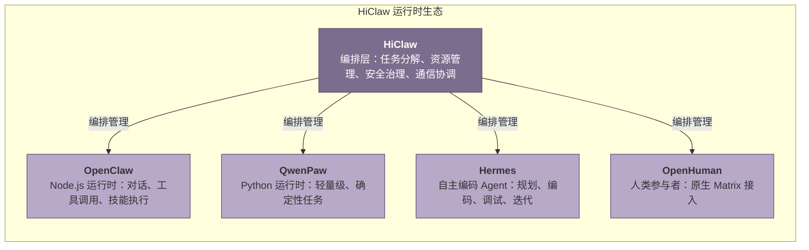
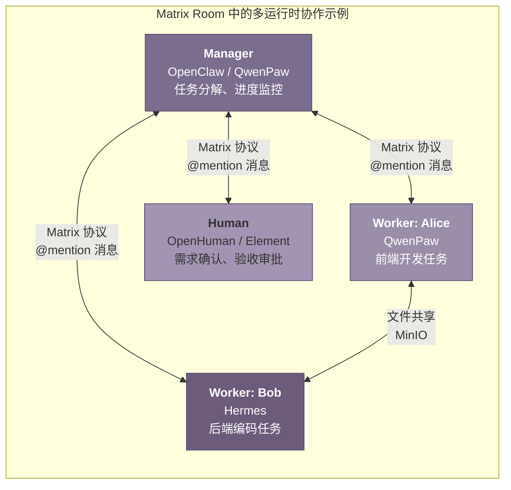
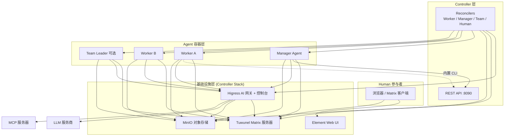
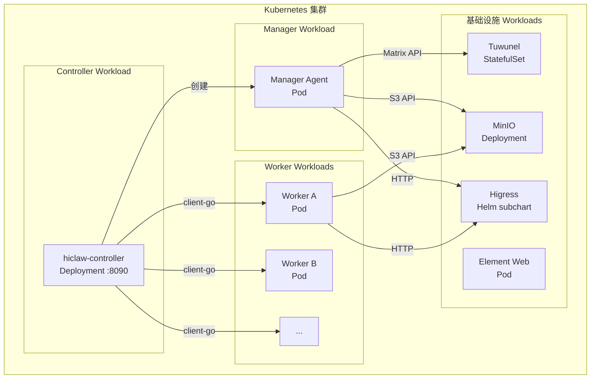
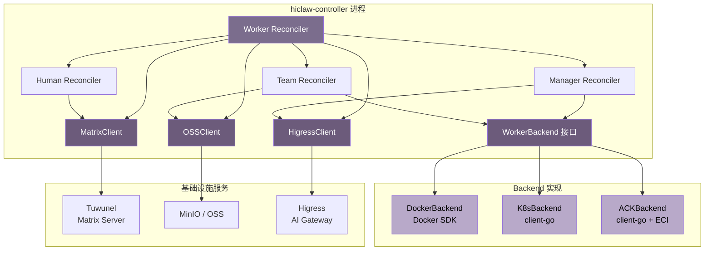

# HiClaw 完整技术 Wiki

> **项目**: [HiClaw](https://github.com/agentscope-ai/HiClaw) — 开源协作式多智能体运行时平台  
> **版本**: v1.1.2 (2026-06-03)  
> **许可证**: Apache 2.0  
> **Wiki 编写日期**: 2026-06-03  

---

## 目录

- [第1章 项目概述与设计理念](#1-项目概述与设计理念)
- [第2章 系统架构总览](#2-系统架构总览)
- [第3章 hiclaw-controller 控制器详解](#3-hiclaw-controller-控制器详解)
- [第4章 Manager 协调器详解](#4-manager-协调器详解)
- [第5章 Worker 运行时详解](#5-worker-运行时详解)
- [第6章 通信层：Matrix 协议与 Tuwunel](#6-通信层matrix-协议与-tuwunel)
- [第7章 共享存储：MinIO 文件系统](#7-共享存储minio-文件系统)
- [第8章 AI 网关：Higress 集成](#8-ai-网关higress-集成)
- [第9章 声明式资源管理（CRD）](#9-声明式资源管理crd)
- [第10章 安装与部署指南](#10-安装与部署指南)
- [第11章 安全设计与企业级特性](#11-安全设计与企业级特性)
- [第12章 开发指南与最佳实践](#12-开发指南与最佳实践)
- [第13章 版本演进与未来规划](#13-版本演进与未来规划)

---

## 1. 项目概述与设计理念

## 1.1 什么是 HiClaw

### 1.1.1 开源协作式多智能体运行时平台的定位

HiClaw 是一个开源的协作式多智能体运行时平台（Collaborative Multi-Agent OS），其核心定位在于解决企业环境中人与 Agent、Agent 与 Agent 之间的高效协作问题[^1^]。项目基于 **Manager-Workers 架构**构建，由中央 Manager Agent 统一编排多个 Worker Agent，形成一个结构化的"AI 团队"[^2^]。与传统单 Agent 方案不同，HiClaw 不追求单个 Agent 的万能化，而是通过角色分工将复杂任务拆解给专业 Worker，Manager 则专注于任务分解、进度监控和资源协调[^3^]。

在技术实现层面，HiClaw 本质上是一个**编排层（orchestration layer）**，而非 Agent 逻辑的实现层。项目本身不提供 LLM 推理能力或 Agent 决策算法，而是通过容器化技术、声明式资源管理、统一通信协议和安全网关，为多种 Agent 运行时提供协作基础设施[^4^]。这种设计使得 HiClaw 可以与各种底层 Agent 框架解耦，将注意力集中在"如何组织多个 Agent 高效协作"这一核心命题上。

项目的典型使用场景包括：企业数字员工团队的构建、复杂软件开发任务的多角色协作（前端、后端、测试、文档）、需要人机持续交互的决策支持流程，以及 OPOC（One Person One Company，一人一公司）愿景下的个人智能助理集群[^5^]。在这些场景中，HiClaw 提供的是一个可审计、可干预、安全的协作环境，而非具体的业务逻辑。

### 1.1.2 与其他 xxClaw 项目的关系

HiClaw 生态系统中存在多个具有相似命名但不同定位的项目，理解它们之间的边界对于正确使用 HiClaw 至关重要。

**OpenClaw** 是 HiClaw 生态中最早出现的 Agent 运行时之一，基于 Node.js 技术栈构建，提供完整的 Agent 推理、工具调用和技能执行能力[^6]。在 HiClaw 架构中，OpenClaw 作为 Worker 和 Manager 的可选运行时之一，负责处理对话、工具调用和任务执行。HiClaw 不对 OpenClaw 的内部逻辑进行修改，而是通过容器编排和 Matrix 通信协议将其接入多 Agent 协作网络。

**QwenPaw**（前身为 CoPaw）是一个轻量级 Python 运行时，最初由社区开发后被 HiClaw 整合[^7]。与 OpenClaw 相比，QwenPaw 的内存占用更低（约 150MB，而 OpenClaw 约 500MB），安装更为便捷（`pip install` 即可），适合处理确定性较高的任务[^8]。在 HiClaw v1.0.4 中首次引入，并在后续版本中逐步完善，到 v1.1.2 已成为默认的 Worker 运行时选项[^9]。

**Hermes** 是由 Nous Research 开发的自主编码 Agent 运行时，在 HiClaw v1.1.0 中正式加入[^10]。与 OpenClaw 和 QwenPaw 这类"对话式"Agent 不同，Hermes 是一个能够独立规划、执行和迭代的自主编码 Agent，具备终端沙箱执行、多文件代码生成、调试和视觉分析能力。在 HiClaw 的多运行时协作模式中，Hermes 通常承担需要高度自主性和创造性的编码任务。

**OpenHuman** 是 HiClaw v1.1.2 引入的第四种 Worker 运行时，专门用于将人类参与者以 Worker 身份纳入 Agent 协作网络[^11]。OpenHuman 提供原生 Matrix 支持，使人类可以通过标准 Matrix 客户端参与房间对话，与 Agent 进行自然协作。



上图清晰展示了 HiClaw 的核心定位：它**不实现 Agent 逻辑本身，而是编排和管理多个 Agent 容器**[^12]。这一原则贯穿整个项目的设计和实现。Manager Agent 和 Worker Agent 都是独立的容器实例，HiClaw 通过 Kubernetes 风格的声明式 API 和 Reconciler 模式来管理它们的生命周期、通信拓扑和安全策略[^13]。

### 1.1.3 核心设计目标

HiClaw 的设计目标可以归纳为四个核心维度：

**透明（Transparency）**：所有 Agent 之间的通信都发生在基于 Matrix 协议的 IM 房间中，通信内容对人类完全可见[^14]。没有任何"黑盒"操作——每一次工具调用、每一条内部推理、每一份文件传输，都留有可审计的记录。这种设计不仅便于调试和问题排查，更重要的是建立了人与 AI 系统之间的信任基础。

**可审计（Auditability）**：基于 Matrix 协议的去中心化通信架构天然支持消息持久化和端到端加密[^15]。管理员可以回溯任意时间段内任意 Agent 的完整对话历史，审查工具调用的参数和结果，追踪任务从分解到执行的全生命周期。对于企业合规场景，这一特性尤为关键。

**人机协作（Human-in-the-Loop）**：HiClaw 将人类参与者视为协作网络的一等公民。通过 OpenHuman 运行时或标准的 Matrix 客户端，人类可以随时进入任意房间观察 Agent 对话、实时干预或修正 Agent 行为[^16]。Manager-Workers 架构的设计初衷之一就是"消除人类对单个 Worker 的监督需求"——人类只需要关注高层决策，而将具体的执行监督委托给 Manager Agent[^17]。

**企业级安全（Enterprise-Grade Security）**：安全是 HiClaw 设计中最受重视的维度。Worker Agent 仅持有消费者令牌（consumer token），真实的 API 密钥、GitHub PAT 等敏感凭证统一保存在 Higress AI 网关中[^18]。即使 Worker 容器被攻破，攻击者也无法获取任何真实凭证。这种"凭证零信任"安全模型使 HiClaw 能够满足企业环境对数据安全和访问控制的严格要求。

## 1.2 核心设计理念

### 1.2.1 Manager-Workers 架构设计哲学

Manager-Workers 架构是 HiClaw 最核心的设计范式，其哲学基础源于一个简单的观察：当单个 Agent 试图承担过多角色时，其上下文窗口会被无关信息污染，技能目录变得混乱，最终输出质量下降[^19]。传统解决方案是不断增加单个 Agent 的上下文长度和工具数量，但这只是延缓而非解决了根本问题。

HiClaw 的解决方案是引入一个**Manager Agent**作为中央协调者，它不直接执行任务，而是负责将一个复杂目标分解为若干子任务，并分派给专门的 Worker Agent 执行[^20]。每个 Worker 只专注于一个角色（如前端开发、后端开发、文档编写），拥有精简的技能集和清晰的职责边界。Manager 持续监控任务进度，在 Worker 之间协调信息传递，并在必要时请求人类介入。

这一架构的设计哲学包含三个关键原则：

**分层委托（Hierarchical Delegation）**：Manager 作为"AI 幕僚长"（AI Chief of Staff），掌握全局视图和调度权力；Worker 作为"专业人员"，只了解自己的任务上下文[^21]。这种分层结构避免了每个 Agent 都需要理解全局状态的认知负担，也使得系统的可扩展性大大提高——新增 Worker 不会影响现有组件的运行。

**确定性编排与自主性执行的分离**：在 HiClaw 的多运行时协作模型中，Manager 通常采用确定性更强的运行时（OpenClaw 或 QwenPaw），负责任务分解、Worker 调度、进度监控等需要"可预测行为"的环节；而 Worker 可以根据任务性质选择自主运行时（如 Hermes）来处理需要"创造力和自主性"的编码任务[^22]。这种"确定性编排 + 自主执行"的组合在实践中被证明是最有效的多 Agent 协作模式之一。

**消除人类对单个 Worker 的监督**：Manager-Workers 架构的根本目标是让 Agent 管理其他 Agent，从而解放人类的认知资源[^23]。在多 Agent 场景下，要求人类同时监督多个 Worker 的对话、工具调用和输出是不现实的。Manager Agent 承担了这一监督职责，人类只需要与 Manager 进行高层交互，由 Manager 负责处理与各个 Worker 的具体协调工作。

### 1.2.2 透明协作：可控、可审计的 Room 机制

HiClaw 的所有 Agent 协作都发生在称为 **room** 的 Matrix 聊天室中，这是项目最核心的设计特征之一[^24]。每一个 room 都是一个独立的、受控的协作空间，包含特定的人类参与者和 Agent 角色。通信内容通过 Matrix 协议进行持久化存储，支持端到端加密，确保数据传输的安全性。

Room 机制的透明性体现在多个层面。首先，**通信透明**：所有 Agent 之间的消息交换都遵循标准的 Matrix 协议，消息内容、发送者、时间戳等信息完整保留[^25]。其次，**行为透明**：每一次工具调用都会生成系统消息，记录调用参数和返回结果；文件操作通过 MinIO 共享文件系统进行，所有读写都有日志记录[^26]。再次，**决策透明**：Manager 的任务分解逻辑、Worker 的执行计划、技能的选择过程，都可以通过适当的日志级别进行追踪。

人类在 room 中拥有完全的控制权。管理员可以随时加入任意 room 观察对话进展，可以通过 `@mention` 直接向任意 Agent 发出指令，也可以在发现 Agent 行为偏离预期时即时纠正[^27]。HiClaw 还实现了三层人类权限体系（L1/L2/L3），不同级别的用户拥有不同的房间邀请权限和 Agent `@mention` 权限[^28]，使得大型组织中的权限管理变得灵活而精确。

这种"全程可见、随时可干预"的设计理念，使 HiClaw 区别于许多"黑盒式"的 Agent 系统。在企业环境中，可审计性和人类控制权往往是 AI 系统被采纳的前提条件，而非可选功能。

### 1.2.3 多运行时协作：各取所长的 Agent 生态

HiClaw 最独特的架构特征之一是支持多种 Agent 运行时在同一个协作网络中并存，每个运行时专注于自己擅长的领域[^29]。这种设计的出发点是对 Agent 能力的现实认知：不存在一种"通用"的 Agent 运行时能够胜任所有任务，不同任务场景对确定性、自主性、资源占用、响应速度等指标有着不同的要求。

在 HiClaw 的协作模型中，**OpenClaw** 和 **QwenPaw** 作为确定性较强的运行时，通常承担"领导者"角色——负责任务编排、决策制定、进度监控等需要稳定、可预测输出的工作[^30]。OpenClaw 基于 Node.js 生态，拥有丰富的工具集成和社区技能（超过 80,000 个社区技能[^31]），适合需要频繁工具调用的场景。QwenPaw 则以轻量级著称，`pip install` 即可安装，内存占用仅为 OpenClaw 的约 30%，适合资源受限或对启动速度敏感的场景[^32]。

**Hermes** 作为自主编码 Agent 运行时，专注于软件开发领域的复杂任务。它能够独立规划多步骤编码工作、在隔离的沙箱环境中执行代码、进行调试和迭代优化，甚至具备自我改进的能力——完成任务后会自动创建可复用的技能，并在后续使用中持续优化[^33]。在多 Agent 协作中，Hermes Worker 通常承担实际的编码工作，而 Manager 则负责定义需求、划分模块和验收结果。

**OpenHuman** 作为第四种运行时，代表了 HiClaw 对"人类是协作网络一等公民"这一理念的坚持。通过 OpenHuman，人类用户可以以 Worker 的身份被纳入协作流程，与其他 Agent 在同一个 room 中平等对话[^34]。这对于需要人类专业判断、创意输入或最终审批的协作场景至关重要。



上图展示了一个典型的多运行时协作场景：Manager 使用 QwenPaw 运行时进行确定性编排，前端 Worker Alice 使用轻量级的 QwenPaw，后端 Worker Bob 使用自主编码能力强的 Hermes，而人类参与者通过 OpenHuman 或标准 Matrix 客户端进行需求确认和验收。所有通信都通过 Matrix 协议进行，文件共享通过 MinIO 对象存储实现，形成了高效、安全、透明的协作闭环。

**表 1：HiClaw 支持的 Worker 运行时对比**

| 运行时 | 技术栈 | 内存占用 | 核心定位 | 典型任务场景 | 引入版本 |
|--------|--------|----------|----------|-------------|----------|
| OpenClaw | Node.js | ~500MB | 全功能对话式 Agent | 工具调用、技能执行、复杂对话 | v1.0.0 |
| QwenPaw | Python | ~150MB | 轻量级确定性 Agent | 确定性任务、资源受限环境、快速启动 | v1.0.4 |
| Hermes | Python | 按需 | 自主编码 Agent | 代码生成、调试、项目级开发任务 | v1.1.0 |
| OpenHuman | Matrix 原生 | 极低 | 人类参与者 | 需求确认、审批决策、创意输入 | v1.1.2 |

从表中可以看出，四种运行时在资源占用、能力侧重和适用场景上形成了清晰的互补关系。OpenClaw 作为功能最全面的运行时，适合作为 Manager 或需要丰富工具集的 Worker；QwenPaw 以"轻量"为核心卖点，是大多数 Worker 场景的性价比之选；Hermes 填补了自主编码能力的空白；OpenHuman 则将人类无缝接入 Agent 协作网络。这种"各取所长"的设计使 HiClaw 能够根据任务特性灵活组合最优的 Agent 团队，而非强制所有角色使用统一的运行时。

## 1.3 项目关键数据

### 1.3.1 项目统计与版本演进

HiClaw 项目于 2026 年 3 月 4 日正式开源[^35]，托管在 GitHub 的 agentscope-ai 组织下，采用 Apache 2.0 许可证[^36]。截至 2026 年 6 月初，项目已积累了 **4,700+ Stars**、**568 Forks** 和 **37 位贡献者**，发布了 **26 个版本标签**，是一个处于快速成长期的开源项目[^37]。项目的代码仓库包含约 656 次提交、118 个分支，issue 数量约 230 个，反映出社区活跃度和项目迭代速度[^38]。

HiClaw 的版本演进遵循语义化版本控制（Semantic Versioning），迭代节奏紧凑。从 v1.0.0 开源到 v1.1.2（最新版本，2026 年 5 月 27 日发布[^39]），在不到三个月的时间内共发布了 12 个次要版本，体现了项目团队对社区反馈的快速响应和产品能力的持续打磨。

**表 2：HiClaw 版本演进时间线（v1.0.0 – v1.1.2）**

| 版本 | 发布日期 | 核心变更 | 架构意义 |
|------|----------|----------|----------|
| v1.0.0 | 2026-03-04 | 项目开源，Manager-Workers 基础架构、OpenClaw 运行时、MinIO 共享文件系统、Higress AI 网关、Tuwunel Matrix 服务器 | 确立嵌入式单体架构，所有核心组件运行在 Manager 容器内[^40] |
| v1.0.1 | 2026-03-05 | Manager 新增 model-switch 和 task-management 技能、TOOLS.md 快速参考手册 | 提升 Manager 的任务编排能力 |
| v1.0.4 | 2026-03-10 | **QwenPaw（CoPaw）Worker 运行时**支持，内存占用降低 80%（~500MB → ~150MB）、远程部署模式 | 首次引入多运行时，奠定轻量级 Worker 基础[^41] |
| v1.0.6 | 2026-03-14 | **企业级 MCP Server 管理**，API-to-MCP 网关、零凭证暴露 | 增强企业集成能力和安全治理[^42] |
| v1.0.9 | 2026-04-03 | **Kubernetes 风格声明式资源管理**（Worker/Team/Human CRD）、Worker Template Marketplace、Manager QwenPaw 运行时 | 控制平面初现，从命令式向声明式管理过渡[^43] |
| v1.1.0 | 2026-04-24 | **Kubernetes 原生控制平面**（hiclaw-controller）、**Hermes 自主编码 Agent 运行时**、镜像体积缩减 1.7GB、hiclaw CLI 取代 shell 脚本 | 架构重大升级，从单体走向多容器，支持 K8s 原生部署[^44] |
| v1.1.1 | 2026-05-07 | Helm Chart 完善、Agent Pod Template 注入、多租户凭证提供者 | 企业部署能力增强 |
| v1.1.2 | 2026-05-27 | **OpenHuman 第四种 Worker 运行时**、QwenPaw-first 本地安装流程、Team human coordinators | 人类以 Worker 身份参与协作，完善人机协作闭环[^45] |

版本演进时间线清晰展示了 HiClaw 的发展脉络。从 v1.0.0 到 v1.0.9 的"嵌入式架构"阶段，项目验证了 Manager-Workers 协作模式的可行性，快速迭代了多运行时支持、MCP 集成、声明式资源管理等关键能力。v1.1.0 是一个里程碑式的版本发布——控制平面被彻底重写为 Kubernetes 原生的 controller-reconciler 架构，引入了第三种运行时 Hermes，镜像体积缩减了 1.7GB[^46]。这一架构升级使得 HiClaw 同时支持嵌入式部署（单机 Docker）和 Kubernetes 原生部署，为进入企业生产环境奠定了基础。v1.1.2 引入的 OpenHuman 运行时则标志着 HiClaw 人机协作理念的完整实现。

### 1.3.2 技术栈分布

HiClaw 是一个多语言项目，技术栈的分布反映了项目"基础设施层 + Agent 运行时层"的双重属性[^47]。

**Go（39.5%）** 是项目中占比最高的语言，主要用于 `hiclaw-controller` 的开发[^48]。Controller 是 HiClaw 的核心控制平面组件，负责 Worker、Manager、Team、Human 等 CRD 资源的生命周期管理、Reconcile 循环、REST API 服务（端口 8090）、网关消费者设置和凭证流管理。选择 Go 语言的原因在于其出色的并发性能、低内存占用和丰富的云原生生态—— controller 需要处理多个资源的并行 Reconcile，并与 Kubernetes API 进行高效交互。

**Shell（32.5%）** 占比仅次于 Go，广泛分布于 `install/`、`scripts/`、`manager/`、`worker/` 等目录[^49]。Shell 脚本承担了系统初始化、容器生命周期管理、配置生成、技能安装等大量运维自动化工作。在 v1.1.0 之前，Shell 脚本甚至是主要的安装和配置手段；v1.1.0 引入 `hiclaw` CLI 后，Shell 脚本的职责范围有所收窄，但在安装引导、环境检测、容器操作等场景中仍然发挥着关键作用。

**Python（19.7%）** 主要集中在 QwenPaw 运行时（`copaw/` 目录）和 Hermes 运行时（`hermes/` 目录）[^50]。QwenPaw 基于 Python 技术栈实现，提供了与 OpenClaw 兼容的 Worker 能力；Hermes 则是由 Nous Research 开发的自主编码 Agent，同样基于 Python。Python 在 AI/ML 领域的生态优势使其成为 Agent 运行时的自然选择。

其余技术成分包括 **PowerShell（5.7%）**（Windows 平台安装脚本）、**Makefile（1.1%）**（构建自动化）、**Dockerfile（0.8%）**（容器镜像构建）和 **Go Template（0.7%）**（配置文件模板生成）[^51]。这种多语言、多技术栈的分布，使 HiClaw 能够充分利用各语言在其擅长领域的优势——Go 负责高性能基础设施、Python 负责 AI Agent 逻辑、Shell 负责运维自动化——形成一个技术上合理且高效的整体架构。

从项目整体规模来看，截至 2026 年 6 月，HiClaw 的代码库包含约 403 行 README 文档（英文版，另有中文和日文版本[^52]）、26 个版本发布、37 位贡献者，以及覆盖安装、开发、部署、FAQ 等方面的完整文档体系（位于 `docs/` 目录）[^53]。项目文档涵盖架构设计（`architecture.md`）、快速入门（`quickstart.md`）、Manager 和 Worker 配置指南、声明式资源管理、Kubernetes 原生编排指南、CMS 集成和开发指南等主题，为不同层次的用户提供了充足的学习材料。


---

## 2. 系统架构总览

HiClaw 的架构经历了从 v1.0 的嵌入式单体设计到 v1.1.0 多容器分布式架构的根本性转变。这一演进并非简单的技术债务清理，而是围绕模块化、可扩展性和云原生部署三个核心目标进行的系统性重构。本章将从架构演进脉络、三层架构模型和部署拓扑三个维度，全面剖析 HiClaw 的系统架构设计。

### 2.1 整体架构演进

#### 2.1.1 v1.0 嵌入式架构的问题

HiClaw v1.0 采用嵌入式架构（embedded mode），所有核心组件运行在一个 Manager 容器内，形成事实上的单体部署模式[^7^]。该容器内部包含 hiclaw-controller、Tuwunel（Matrix 服务器）、MinIO（对象存储）、Higress（AI 网关）、Element Web（IM UI）、Manager Agent（协调代理）以及 docker-proxy（容器管理代理）等七大组件[^7^]。这种"全家桶"式的打包方式虽然降低了初次部署的复杂度，但在实际运营中暴露出一系列结构性问题。

**控制器与基础设施耦合** 是最核心的设计缺陷。hiclaw-controller 嵌入在 Manager 容器内部，意味着每次需要升级控制器时，都必须重启整个 Manager 容器，进而中断所有正在运行的代理服务[^7^]。更重要的是，控制器无法独立于 Manager 进行水平扩展——在高并发场景下，Reconciler 的处理能力成为整个系统的瓶颈。

**Reconciler 依赖 bash 脚本** 导致维护性和可测试性极差。Worker 的创建、更新和销毁操作通过 `create-worker.sh`、`delete-worker.sh` 等 shell 脚本执行，这些脚本内部直接调用 Docker API、Matrix API 和 Higress API[^7^]。这种"脚本胶水"式的实现方式使得错误处理薄弱、逻辑分散且难以进行单元测试。例如，`create-worker.sh` 脚本需要顺序完成 Matrix 用户注册、Room 创建、Higress Consumer 配置、MCP Server 授权等多个步骤，任何一个步骤失败都需要手动清理已创建的资源[^7^]。

**部署模式单一** 是另一个关键限制。v1.0 架构仅支持 Docker 单机部署，不支持 Kubernetes 原生部署（incluster 模式）[^7^]。docker-proxy 作为独立容器仅支持 Docker 后端，这意味着 HiClaw 无法利用 Kubernetes 提供的编排能力，如自动扩缩容、滚动更新和自愈机制。

**Manager Agent 职责过载** 导致其成为系统不可或缺的组件。在 v1.0 中，Manager Agent 不仅负责自然语言交互和任务协调，还承担了集群初始化、配置升级、Worker 生命周期管理等多项基础设施职责[^7^]。这种职责混杂使得 Manager Agent 的可用性直接影响整个系统的稳定性。

下表系统性地对比了 v1.0 架构在各方面存在的问题及其影响：

| 问题维度 | v1.0 具体表现 | 产生的影响 |
|---------|-------------|-----------|
| 组件耦合 | hiclaw-controller 嵌入 Manager 容器内 | 无法独立升级控制器；Reconciler 性能受限于 Manager 容器资源 |
| 实现方式 | Reconciler 依赖 bash 脚本（create-worker.sh 等） | 逻辑分散、错误处理薄弱、难以测试和调试 |
| 部署限制 | 仅支持 Docker 单机部署 | 无法利用 K8s 编排能力；不支持弹性扩缩容 |
| 容器管理 | docker-proxy 仅支持 Docker 后端 | 无法对接 K8s Pod 生命周期管理 |
| 职责混杂 | Manager Agent 承担基础设施管理职责 | Manager 成为必选组件；系统可用性依赖于 Manager |
| 调试能力 | 缺乏 K8s 环境下的调试手段 | 问题排查困难；运维成本高 |

这些问题在 HiClaw 的早期使用阶段尚不突出，但随着用户规模的扩大和部署场景的多样化，架构层面的重构成为必然选择。

#### 2.1.2 v1.1.0 多容器架构的核心改进

HiClaw v1.1.0 通过引入多容器架构（multi-container architecture），从根本上解决了 v1.0 的结构性问题[^5^]。新版本将系统拆分为三个逻辑层级：Controller 层、Manager 层和 Worker 层，其中基础设施组件（Higress、Tuwunel、MinIO、Element Web）运行在专用的 controller stack 中，而 Manager 和 Worker 镜像保持轻量，仅包含代理运行时、`hiclaw` CLI 和 skills[^5^]。

**控制器独立化** 是 v1.1.0 最核心的改进。hiclaw-controller 被剥离为独立的容器（或 Kubernetes Deployment），统一承担 CRD Reconcile、容器生命周期管理和集群编排三大职责[^7^]。控制器通过 WorkerBackend 抽象层支持多种部署后端：DockerBackend 用于 embedded 模式，K8sBackend 用于 incluster 模式，ACKBackend 用于阿里云 ACK 部署[^7^]。这一抽象使得同一套控制逻辑可以在不同部署环境中无缝工作。

**Reconciler 纯 Go 化** 彻底消除了对 bash 脚本的依赖。WorkerReconciler 的 `handleCreate` 流程现在完全以 Go 代码实现：首先通过 `Matrix.RegisterUser` 注册 Matrix 账号，然后通过 `Matrix.CreateRoom` 创建三方 Room（Admin + Manager/Leader + Worker），接着通过 `Higress.EnsureConsumer` 创建消费者并授权 MCP Server 访问，最后配置 AI Gateway Route[^7^]。整个过程具备完善的错误处理和资源回滚能力。

**Manager Agent 变为可选组件**。重构后，Manager Agent 仅保留需要 LLM 能力的职责：自然语言指令的理解与转化、跨 Team 任务派发、语义级别的任务进度检查，以及将系统事件转化为人类可读的通知[^7^]。所有资源管理类 skill 的操作统一改为调用 `hiclaw` CLI，而 `hiclaw` CLI 通过双模式支持（incluster 模式直接操作 K8s CRD，embedded 模式通过 MinIO 配置和 file watcher 触发 reconcile）屏蔽了底层环境差异[^7^]。

**Kubernetes 原生支持** 通过 Helm Chart（位于 `helm/hiclaw` 目录）实现。控制器以 Deployment 形式运行在 K8s 集群中，使用 client-go 与 API Server 交互；Manager 和 Worker 作为 Pod 动态创建；Tuwunel、MinIO、Higress 分别以 StatefulSet 或 Helm subchart 的形式独立部署[^5^]。

#### 2.1.3 架构演进背后的设计决策

HiClaw 的架构演进遵循三项核心设计原则。**模块化**原则要求每个组件具备清晰的边界和单一职责。控制器负责基础设施和生命周期管理，Manager 负责协调和决策，Worker 负责执行。这种分离使得各组件可以独立开发、测试和部署。**可扩展性**原则体现在 WorkerBackend 抽象层的设计上——新增部署后端只需实现统一的接口，无需修改上层控制逻辑[^7^]。**云原生**原则意味着 HiClaw 拥抱 Kubernetes 的声明式资源管理模型，所有可管理对象（Worker、Manager、Team、Human、DebugWorker）均定义为 CRD，通过 `hiclaw apply` 命令或 YAML 文件进行声明式管理[^7^]。

从演进路径来看，HiClaw 的架构设计采用了"渐进式解耦"策略：v1.0 首先验证了 Manager-Workers 协作模型的可行性，v1.1.0 解决控制器与基础设施的耦合问题，后续版本则进一步细化各层的能力边界。这种演进节奏既保证了产品的持续可用性，又为架构的深层优化创造了条件。

### 2.2 三层架构模型

HiClaw v1.1.0 采用明确的三层架构模型：Controller 层作为基础设施和编排引擎，Manager 层作为协调和决策中枢，Worker 层作为无状态任务执行器[^5^]。三层之间通过定义良好的 API 和通信协议交互，形成了清晰的职责分层。



上图展示了 HiClaw 的逻辑架构关系。Human 通过浏览器访问 Element Web UI 或 Matrix 客户端参与协作；Controller 层的 Reconcilers 监控并管理所有资源对象的状态；Manager 和 Workers 通过 Matrix 进行通信，通过 Higress 访问 LLM 和 MCP 服务，通过 MinIO 读写共享数据。三条通信路径（Matrix 控制面、Higress AI 流量面、MinIO 数据面）相互独立，形成了清晰的流量分层。

#### 2.2.1 Controller 层：Go Operator、CRD Reconciler、REST API、生命周期管理

Controller 层是 HiClaw 的"基础设施大脑"，以 Go 语言编写的 Operator 形式运行，核心职责包括 CRD 协调、生命周期管理、网关配置和凭证流管理[^5^]。

**CRD Reconciler 体系** 是控制器的核心。HiClaw 定义了五种核心 CRD，全部位于 `hiclaw.io/v1beta1` API 组：

- **Worker** —— 定义任务执行代理的模型（`spec.model`）、运行时（`spec.runtime`，可选值 `openclaw` / `copaw` / `hermes`）、镜像（`spec.image`）、技能列表（`spec.skills`）、MCP Server 列表（`spec.mcpServers`）、端口暴露规则（`spec.expose`）、状态（`spec.state`，可选值 `Running` / `Sleeping` / `Stopped`）以及云凭证作用域（`spec.accessEntries`）[^5^]。
- **Manager** —— 定义协调代理的模型、运行时、镜像、人设覆盖（`soul`/`agents` 覆盖）、配置参数（心跳间隔 `heartbeatInterval`、Worker 空闲超时 `workerIdleTimeout`、通知渠道 `notifyChannel`）[^7^]。
- **Team** —— 定义团队结构，包含 Leader 和 Workers 的规格、可选管理员（`admin`）、对等提及策略（`peerMentions`）和团队频道策略（`channelPolicy`）；状态聚合成员就绪状态和房间信息（team room、leader DM、每个成员的 RoomID）[^5^]。
- **Human** —— 定义人类参与者，包含显示名称、邮箱、权限级别（`permissionLevel`）、可访问的团队/Worker；状态包含 Matrix 用户名、初始密码和房间列表[^5^]。
- **DebugWorker** —— 按需创建的调试 Pod，用于导出 Matrix 消息和 LLM 日志，内置 hiclaw 源码以支持代码级问题分析[^7^]。

**WorkerBackend 抽象层** 统一了不同部署环境下的容器生命周期管理。该接口定义了 Create、Delete、Status、Exec、Logs 和 NeedsCredentialInjection 六个核心方法[^7^]。DockerBackend 通过 Docker SDK 直接操作容器（替代了原有的 docker-proxy），K8sBackend 通过 client-go 创建和管理 Pod/Deployment，ACKBackend 在 K8sBackend 基础上增加了阿里云 ECI 弹性实例等云特性支持[^7^]。

**集群初始化引擎** 在控制器启动时执行，按序完成以下操作：等待 Matrix/MinIO/Higress 基础设施就绪、注册 Admin Matrix 账号、配置 Higress 基础路由（Matrix/MinIO/Element Web）、初始化 OSS 目录结构（`agents/`、`shared/tasks/`、`manager/` 等前缀）、推送内置 Skills 到 OSS[^7^]。整个初始化流程纯 Go 实现，不再依赖 `manager/scripts/init/*.sh` 脚本。

**配置版本管理器（ConfigVersionManager）** 实现了 skill 热更新和运行时升级两种更新机制。Skill 热更新通过对比每个 Worker 的当前 skill 版本，推送新版 skill 到 Worker 的 OSS 空间，并通过 Matrix @mention 或 OSS 信号文件通知 Worker 进行 file-sync 拉取——整个过程不重启 Worker[^7^]。运行时升级则采用滚动更新策略：逐个 Worker 创建新实例、等待就绪、删除旧实例[^7^]。

#### 2.2.2 Manager 层：协调 Agent、任务分配、Higress 路由/MCP 管理

Manager 层是 HiClaw 的"协调中枢"，负责理解任务语义、管理 Worker 和 Team 的生命周期、协调人类参与者的介入，以及配置 AI 网关路由和 MCP Server[^5^]。

Manager Agent 支持两种运行时。**OpenClaw 运行时**（默认）基于 Node.js/OpenClaw 网关，采用 "message tool" 风格的 Matrix 集成；Manager 镜像基于 `openclaw-base` 构建，该基础镜像提供 Ubuntu 24.04、Node.js 22、OpenClaw 和 mcporter[^5^]。**QwenPaw 运行时**（`copaw`）基于 Python，使用 QwenPaw 工作空间和通道机制（`start-copaw-manager.sh` 启动），镜像更为轻量[^5^]。运行时选择通过 `HICLAW_MANAGER_RUNTIME` 环境变量控制。

Manager 的 skill 体系分为 16 个内置技能，涵盖 Worker 管理（`worker-management`、`worker-model-switch`）、Team 管理（`team-management`）、任务管理（`task-management`、`task-coordination`）、人类管理（`human-management`）、Matrix 管理（`matrix-server-management`、`channel-management`）、MCP 管理（`mcp-server-management`、`mcporter`）、模型切换（`model-switch`）、项目管理（`project-management`）、服务发布（`service-publishing`）、Git 委派（`git-delegation-management`）和 Worker 查找（`hiclaw-find-worker`）[^5^]。这些技能由 OpenClaw 和 QwenPaw Manager 共享，QwenPaw 特定的 prompt 覆盖存放在 `manager/agent/copaw-manager-agent/` 目录下。

在 Kubernetes 部署模式下，Manager Agent 容器变为完全无状态：仅包含 Agent 运行时，配置从 OSS 拉取（SOUL.md、AGENTS.md、skills/），state.json 持久化到 OSS，通过 `hiclaw` CLI 与控制器交互[^7^]。这种无状态设计使得 Manager 可以随时被重新创建而不会丢失状态。

#### 2.2.3 Worker 层：无状态任务执行器、按需创建、配置和工件在对象存储

Worker 层是 HiClaw 的"执行单元"，每个 Worker 运行在一个独立的容器中，设计上严格保持无状态[^5^]。Worker 的配置和工件全部存储在对象存储（MinIO 或兼容 S3/OSS）上，使得 Worker 容器本身可以随时被替换而不丢失数据。

Worker 支持三种运行时。**openclaw**（默认）基于 Node.js/OpenClaw 网关，使用 `openclaw-base` 派生镜像，通过 mcporter 调用 Higress 上的 MCP 工具[^5^]。**copaw** 基于 Python/QwenPaw，使用 `copaw-worker` 模式，通过 QwenPaw 通道与 Matrix 交互，技能布局在 `copaw-worker-agent/` 目录下[^5^]。**hermes** 是自主编码 Agent 运行时，使用 `hermes-worker` 模式，配置树存放在 `hermes-worker-agent/` 目录下，适合编程和开发任务[^5^]。Helm 的 `worker.defaultImage` 为每种运行时提供了独立的镜像仓库默认值，控制器在创建 Pod 或 Docker 容器时解析实际使用的运行时和镜像[^5^]。

每个 Worker 在创建时通过协调器完成以下初始化流程：注册 Matrix 用户、创建三方 Room（Admin、Manager/Leader、Worker）、创建 Higress Consumer 并授权 MCP Server、配置 AI Gateway Route[^7^]。Worker 的技能来源包括两类：运行时内置的 core 技能集（`file-sync`、`mcporter`、`find-skills`、`project-participation`、`task-progress` 等，在创建时从模板实例化到 Worker 工作空间）和 Manager 按需分发的扩展技能（`github-operations`、`git-delegation` 等，在 `spec.skills` 引用时推送）[^5^]。

下表对比了三层架构的核心职责和特征：

| 维度 | Controller 层 | Manager 层 | Worker 层 |
|-----|-------------|-----------|----------|
| 核心角色 | 基础设施编排引擎 | 协调与决策中枢 | 无状态任务执行器 |
| 实现语言 | Go | Node.js (OpenClaw) / Python (QwenPaw) | Node.js / Python |
| 主要进程 | hiclaw-controller | Manager Agent Runtime | Worker Agent Runtime |
| 关键职责 | CRD Reconcile、生命周期管理、网关配置、集群初始化 | 任务分配、Worker/Team 协调、Higress/MCP 管理、人类交互 | 任务执行、skill 调用、进度汇报 |
| 部署形态 | Deployment (K8s) / 嵌入式容器 (本地) | Pod (K8s) / 独立容器 (本地) | 动态 Pod (K8s) / 动态容器 (本地) |
| 状态特性 | 有状态（管理集群状态） | K8s 下无状态（配置在 OSS） | 严格无状态（配置和工件在对象存储） |
| 可扩展性 | 通过 WorkerBackend 支持多后端 | 单副本运行 | 按需创建，理论上无限扩展 |
| 通信方式 | REST API (:8090) | Matrix + Controller API + Higress | Matrix + Higress + MinIO |

三层架构的设计使得 HiClaw 具备了良好的水平扩展能力。Controller 层的瓶颈可以通过增加控制器副本数缓解（配合 leader election）；Manager 层由于单副本运行，其处理能力主要取决于 LLM 响应速度和 skill 执行效率；Worker 层则可以按需动态创建，每个 Worker 独立运行，互不影响。

### 2.3 部署拓扑

HiClaw 支持两种部署模式：本地单主机部署（embedded mode）和 Kubernetes 集群部署（incluster mode）。两种模式共享相同的三层架构逻辑，但在组件的物理分布和通信方式上存在差异[^5^]。

#### 2.3.1 本地单主机部署：嵌入式 controller 容器 + 独立 Manager 和 Worker 容器

本地单主机部署通过 `install/hiclaw-install.sh` 脚本完成，该脚本拉取嵌入式控制器镜像（由 `Dockerfile.embedded` 构建），该镜像基于 Higress all-in-one 基础镜像，内部打包了 Tuwunel、MinIO、mc（MinIO 客户端）、Element Web（通过 nginx 提供服务）、hiclaw-controller 二进制和 hiclaw CLI，由 supervisord 统一进程管理[^5^]。

部署完成后的组件拓扑如下所示：

```
+--------------------------- hiclaw-controller (embedded) --------------------------+
|  Higress (:8080/...)   Tuwunel (:6167)   MinIO (:9000)   Element+nginx   controller |
|                              hiclaw-controller :8090 (REST)                        |
+-------------------------------+--------------+-------------------------------------+
                                | API / Docker |
              +-----------------+----------------+------------------+
              |                                  |
       hiclaw-manager                     hiclaw-worker-*
       (lightweight)                      (lightweight)
```

安装脚本启动 hiclaw-controller 后，等待内部 Higress、Tuwunel 和 MinIO 的健康检查通过，随后 ManagerReconciler 创建 `hiclaw-manager` 容器（以及用户在添加 Worker CR 后创建的 Worker 容器）[^5^]。Manager 在本地模式下通过 `localhost` 端口访问控制器内部的基础设施服务——安装脚本将主机的网关端口（如 18080）映射到控制器容器内，Manager 容器则通过 `HICLAW_CONTROLLER_URL` 环境变量和可选的 Docker socket 进行 Worker 生命周期管理[^5^]。

embedded 模式下的 hiclaw-controller 虽然物理上运行在一个容器内，但逻辑上仍然是独立的控制器进程。它通过 Docker Socket 直接管理 Worker 容器（替代了原有的 docker-proxy），同时运行 embedded kube-apiserver + kine 提供 Kubernetes API 兼容层，使得 Reconciler 逻辑在 embedded 和 incluster 两种模式下完全一致[^7^]。

#### 2.3.2 Kubernetes 集群部署：独立 controller、Tuwunel、MinIO、Higress + Manager/Worker Pod

Kubernetes 部署通过 Helm Chart（`helm/hiclaw` 目录）完成，`values.yaml` 文件定义了矩阵服务器（Tuwunel 托管或现有 Synapse）、网关（托管 Higress 或外部阿里云 AI 网关）、存储（托管 MinIO 或外部 OSS）、可选的凭证提供者（`credentialProvider`）、控制器、Manager（引导 Manager CR）、Element Web 和 Worker 默认值（每种运行时的镜像）等配置[^5^]。

K8s 模式下的组件拓扑如下：



在 K8s 模式下，每个主要组件都是独立的 Pod 或 Helm 依赖：Higress 作为 subchart 部署，Tuwunel 作为 StatefulSet（需要稳定的网络标识），MinIO 作为 Deployment，Element Web 作为独立 Pod，hiclaw-controller 作为 Deployment。Manager 和 Worker 则由控制器根据 CR 动态创建为 Pod，不使用时无需静态 Manager Deployment[^5^]。

控制器 Pod 通过 in-cluster 配置与 K8s API Server 交互，协调 CR 与集群内的 Matrix、Higress 和 MinIO 端点。Manager 以 `HICLAW_RUNTIME=k8s` 运行，通过 `mc` 客户端从集群 MinIO 同步工作空间，并消费由 Operator 注入的凭证[^5^]。这种模式充分发挥了 Kubernetes 的编排优势：自动扩缩容、滚动更新、服务发现和负载均衡。

#### 2.3.3 镜像体系：hiclaw-controller、hiclaw-manager、hiclaw-worker 及其变体

HiClaw 的镜像体系围绕三层架构设计，每个层级有明确的基础镜像和派生镜像。镜像的命名和用途如下表所示：

| 镜像名称 | 基础镜像 | 包含组件 | 部署模式 | 用途说明 |
|---------|---------|---------|---------|---------|
| `hiclaw-controller` | 精简 Linux 基础镜像 | Go controller 二进制、`hiclaw` CLI | K8s | K8s 集群部署的控制器，不包含基础设施组件，需配合 Higress/Tuwunel/MinIO Helm subchart 使用 |
| `hiclaw-controller-embedded` | Higress all-in-one | Higress + Tuwunel + MinIO + Element Web (nginx) + controller 二进制 + `hiclaw` CLI + supervisord | 本地 | 嵌入式控制器，一个容器内打包全部基础设施，适合单机快速部署 |
| `hiclaw-manager` | `openclaw-base` | Node.js 22 + OpenClaw + Manager Agent + skills | 通用 | 默认 Manager 镜像，OpenClaw 运行时，基于 `openclaw-base`（Ubuntu 24.04 + Node.js 22 + OpenClaw + mcporter）构建 |
| `hiclaw-manager-copaw` | 精简 Python 镜像 | Python + QwenPaw + Manager Agent + skills | 通用 | QwenPaw Manager 镜像，更轻量，适合资源受限场景 |
| `hiclaw-worker` | `openclaw-base` | Node.js 22 + OpenClaw + Worker builtins + `hiclaw` CLI | 通用 | 默认 Worker 镜像，OpenClaw 运行时 |
| `hiclaw-copaw-worker` | 精简 Python 镜像 | Python + QwenPaw + Worker builtins | 通用 | QwenPaw Worker 镜像，Python Agent 循环，Matrix 通过 QwenPaw 通道交互 |
| `hiclaw-hermes-worker` | Python 镜像 | Python + Hermes 运行时 + 自主编码能力 | 通用 | Hermes Worker 镜像，支持自主代码执行，适合编程和开发任务 |
| `hiclaw-openhuman-worker` | 专用基础镜像 | Matrix 客户端 + 人类交互界面 | v1.1.2+ | OpenHuman Worker 镜像（v1.1.2 新增），原生 Matrix 支持的人类参与者 |
| `openclaw-base` | Ubuntu 24.04 | Ubuntu 24.04 + Node.js 22 + OpenClaw + mcporter | 构建基础 | 不用于直接部署，作为 `hiclaw-manager` 和 `hiclaw-worker` 的基础镜像，不包含 Higress 全家桶 |

镜像设计遵循"分层复用、职责隔离"的原则。`openclaw-base` 作为共享基础层，为 OpenClaw 生态的 Manager 和 Worker 镜像提供统一的运行环境，避免了重复打包 Node.js 和 OpenClaw 运行时。`hiclaw-controller-embedded` 则是面向便捷性的"一体化"镜像，将基础设施和控制器打包在一起，使得单机部署可以通过一行命令完成：`bash <(curl -sSL https://higress.ai/hiclaw/install.sh)`[^5^]。

从镜像体积来看，v1.1.0 架构实现了显著的瘦身。在 v1.0 中，Manager 镜像需要包含 Higress、Tuwunel、MinIO 和 Element Web，体积通常超过数 GB。而在 v1.1.0 中，`hiclaw-manager` 和 `hiclaw-worker` 镜像仅包含 Agent 运行时和必要的工具，体积大幅减小。`hiclaw-manager-copaw` 和 `hiclaw-copaw-worker` 基于轻量级 Python 镜像构建，进一步降低了资源占用[^5^]。

镜像版本管理方面，HiClaw 使用语义化版本（Semantic Versioning），控制器镜像、Manager 镜像和 Worker 镜像的版本号保持一致，以确保 API 兼容性。升级时，控制器通过 ConfigVersionManager 实现 skill 的热更新（不重启 Worker）和运行时的滚动更新（逐个 Worker 替换）[^7^]，最大程度减少升级过程对业务的影响。

两种部署模式的选择取决于实际场景。本地单主机部署适合开发测试环境和小规模使用，其优势在于部署简单、资源开销低；Kubernetes 集群部署则适合生产环境和大规模 Agent 协作，具备弹性扩缩容、高可用和自动化运维能力。无论选择哪种模式，HiClaw 的三层架构逻辑保持一致，Manager 和 Worker 的行为不因部署模式的不同而产生差异，这种一致性是 WorkerBackend 抽象层和统一 Reconciler 设计带来的重要收益[^7^]。


---

## 3. hiclaw-controller 控制器详解

hiclaw-controller 是 HiClaw 系统的控制平面核心，以 Go 语言实现的 Kubernetes Operator 模式驱动整个多智能体平台的资源编排与生命周期管理。它向上暴露声明式 CRD（Custom Resource Definition）接口供用户定义 Worker、Team、Manager 等资源意图，向下通过统一的 Worker Backend 抽象层屏蔽 Docker、Kubernetes 与云环境的部署差异，完成容器的创建、配置、通信拓扑编织和状态同步。本章从控制器的核心职责出发，逐层解析其架构设计、双模式部署策略以及从 v1.0 单体架构到 v1.1 多容器架构的重构演进。

### 3.1 控制器核心职责

#### 3.1.1 CRD 协调：Worker、Manager、Team、Human、DebugWorker 资源的生命周期管理

hiclaw-controller 作为 HiClaw 的声明式控制平面，注册并协调五种核心 CRD 资源，所有资源均隶属于 API 组 `hiclaw.io/v1beta1`[^25^]。每种 CRD 对应独立的 Reconciler，在控制器内部以并行的控制循环（Control Loop）方式运行，持续对比资源的期望状态（Spec）与实际状态（Status），驱动系统向期望状态收敛。

**Worker** 是最基础的计算单元 CRD，每个 Worker 实例映射为一个容器（Docker 模式）或 Pod（Kubernetes 模式），同时具备独立的 Matrix 账号、MinIO 命名空间和 Higress Gateway Consumer 令牌[^12^]。Worker Reconciler 的处理流程涵盖八个顺序步骤：Matrix 账号注册、三方 Room 创建（Admin + Manager/Leader + Worker）、Higress Consumer 创建与 MCP Server 授权、AI Gateway Route 配置、配置生成并推送至 OSS、Skills 推送、Worker 实例创建（通过 Backend 抽象层），最终更新 Status.Phase 为 Running[^7^]。Worker 支持四种运行时：OpenClaw（Node.js）、QwenPaw（Python）、Hermes（自主编码 Agent）以及 OpenHuman（人类参与者），由 `spec.runtime` 字段指定[^25^]。

**Manager** CRD 用于声明式管理协调器 Agent 的部署。重构后的 Manager Agent 退化为可选组件，仅保留自然语言交互、跨 Team 任务派发和语义级 Heartbeat 等需要 LLM 能力的职责[^7^]。Manager Reconciler 负责根据 `spec.model`、`spec.runtime` 和 `spec.skills` 等字段创建 Manager 容器或 Pod，并协调其配置版本升级。

**Team** CRD 定义协作单元，包含 Leader 和一组 Worker 成员。Team Reconciler 创建时会编织特定的通信拓扑：Leader Room（Manager + Admin + Leader）、Team Room（Leader + Admin + Workers，Manager 不在此 Room 内，形成明确的委托边界）、Worker Room（Leader + Admin + Worker 的私有通道）以及 Leader DM（Admin 与 Leader 的管理通道）[^12^]。

**Human** CRD 将真实用户纳入 HiClaw 的权限体系，通过 `spec.permissionLevel` 区分三个层级：Admin 等效（1）、Team 范围（2）和 Worker 专用（3），并结合 `accessibleTeams` 和 `accessibleWorkers` 字段控制其在 Matrix 中的 Room 可见性[^25^]。

**DebugWorker**（v1.1 新增）是按需创建的诊断 Pod，用于导出 Matrix 消息和 LLM 日志，内置 HiClaw 源码以便结合代码分析问题[^7^]。该 CRD 解决了早期版本在 Kubernetes 环境下缺乏自助调试手段的痛点。

| CRD 资源 | 核心 Spec 字段 | Reconciler 关键动作 | 适用场景 |
|:---|:---|:---|:---|
| Worker | `model`, `runtime`, `skills`, `mcpServers`, `soul`, `expose`, `state` | Matrix 账号注册、Room 创建、Higress Consumer 授权、Backend 实例创建、OSS 配置推送 | 单个任务执行 Agent |
| Manager | `model`, `runtime`, `skills`, `config.heartbeatInterval` | Manager 容器/Pod 创建、欢迎消息发送、配置版本管理 | 系统协调与任务分发 |
| Team | `leader`, `workers[]`, `peerMentions`, `workerIdleTimeout` | Leader/Worker 成员协调、多 Room 拓扑编织、Heartbeat 机制 | 结构化协作团队 |
| Human | `displayName`, `permissionLevel`, `accessibleTeams`, `accessibleWorkers` | Matrix 账号创建、Room 权限绑定、身份级别控制 | 人类参与者接入 |
| DebugWorker | `teamRef`, `duration`, `resources` | 诊断 Pod 创建、日志收集容器挂载、自动清理 | 问题排查与审计 |

上表所列五种 CRD 覆盖了 HiClaw 从单个 Worker 到团队协作单元、从 Agent 到人类参与者的完整资源模型。每个 Reconciler 在 `internal/controller/` 目录下拥有独立的控制器文件（如 `worker_controller.go`、`manager_controller.go`、`team_controller.go`、`human_controller.go`），遵循 Kubernetes Controller-runtime 框架的规范，通过 `SetupWithManager` 方法注册到共享的 Manager 实例中[^29^]。这种设计使得各资源的生命周期管理逻辑高度内聚，便于独立测试和后续扩展。

#### 3.1.2 REST API Server（端口 8090）：Worker/Manager 操作接口、Gateway Consumer 设置

hiclaw-controller 在进程内嵌入 HTTP API Server，默认监听端口 `8090`，为外部组件和管理员提供命令式操作入口[^7^]。API 覆盖 Worker 和 Manager 的创建、查询、更新、删除操作，以及 Higress Gateway Consumer 的设置和 MCP Server 的授权管理。控制器启动时会通过 `internal/app/bootstrapAdminCLIToken` 签发一个长期有效的管理员 ServiceAccount 令牌，写入 `/var/run/hiclaw/cli-token`，供内嵌的 `hiclaw` CLI 自动发现和使用[^13^]。这意味着管理员通过 `docker exec hiclaw-controller hiclaw …` 执行命令时无需每次都传递 `--token` 参数。

API Server 的设计遵循两个原则：一是与声明式 CRD 协调互补——简单操作可通过 API 直接完成，复杂场景通过 `hiclaw apply -f` 提交 YAML 资源定义；二是与 Gateway 配置深度集成——Consumer 的创建和 MCP Server 的授权调用均通过 API 层暴露，确保外部调用方（如 Manager Agent 的 Skill 脚本）无需直接操作 Higress 控制台。所有 API 端点均受统一认证中间件保护，令牌鉴权逻辑与 Kubernetes 的 ServiceAccount 机制对齐。

#### 3.1.3 凭证流管理：云提供商启用时的安全凭证处理

当 HiClaw 启用云提供商（如阿里云 OSS、AI Gateway）时，hiclaw-controller 承担凭证流的协调职责。Worker Agent 在设计上**只持有消费级令牌**（Consumer Key），真实凭证（API Keys、GitHub PATs 等）保存在 Higress AI Gateway 层，Worker 乃至潜在的攻击者均无法接触原始敏感信息[^12^]。

凭证流的具体处理路径如下：管理员通过 `hiclaw-credential-provider` Sidecar 或环境变量注入云凭证；控制器在 Reconcile 过程中为每个 Worker 向 Higress 申请独立的 Consumer Key；该 Key 被写入 Worker 的环境变量和 OSS 配置中，Worker 凭此 Key 通过 Higress 访问 LLM API 和 MCP Server[^7^]。Higress 在网关层将消费级令牌映射为真实凭证后再转发上游请求，实现凭证的集中管控和风险缓解。`AccessEntry` 类型在 CRD 层以 schema-less JSON 描述权限授予逻辑，控制器在提交给 credential-provider 前将其中引用的逻辑名称（如 `bucketRef: workspace`）解析为实际资源值，确保 Provider 不接触 CR 层的抽象表示[^25^]。

### 3.2 控制器架构设计

#### 3.2.1 Go Operator 模式：基于 Kubernetes Operator 设计哲学的控制器实现

hiclaw-controller 借鉴 Kubernetes Operator 的设计哲学，将 Agent 团队的编排问题建模为声明式资源管理问题[^12^]。控制器内部使用 `sigs.k8s.io/controller-runtime` 库构建，核心组件包括：Informer Cache（通过 List-Watch 机制监听 CRD 变更事件）、Work Queue（事件去重和分发）、Reconciler（业务逻辑处理）以及 Webhook 和 Metrics 出口。

在嵌入式模式下，控制器通过内嵌的 kube-apiserver（v1.31.3）和 kine（SQLite 后端）提供 Kubernetes API 兼容层[^13^]，使得整个系统无需外部 K8s 集群即可运行完整的 CRD 生态。kine 将 etcd API 调用转换为 SQLite 操作，大幅降低嵌入式部署的资源 footprint。`internal/app/app.go` 负责控制器进程的初始化编排，包括 Backend 选择、服务客户端（Matrix/OSS/Higress）构建、API Server 启动和 Admin CLI Token 签发[^30^]。

#### 3.2.2 Reconciler 机制：从 bash 脚本到声明式协调的演进

v1.0 版本的 HiClaw 存在一项显著的技术债务：Worker 生命周期管理依赖一系列 bash 脚本（如 `create-worker.sh`），这些脚本内部直接调用 Docker API、Matrix API 和 Higress API，逻辑分散且难以测试[^7^]。v1.1 重构后，所有脚本逻辑被重写为纯 Go 实现的 Reconciler，职责划分清晰如下表所示。

| 职责域 | v1.0 实现方式 | v1.1 重构后实现 | 关键改进 |
|:---|:---|:---|:---|
| CRD 协调 | Controller + bash 脚本串联 | `internal/controller/` 下纯 Go Reconciler | 可单元测试、可追踪、支持 Metrics 导出 |
| Worker 容器管理 | docker-proxy 独立容器 / PR #451 orchestrator | `WorkerBackend` 接口 + 多后端实现 | 统一抽象，消除容器间耦合 |
| Matrix 账号管理 | `create-worker.sh` 内嵌 curl 调用 | `internal/matrix/client.go` MatrixClient | 错误处理标准化、支持重试 |
| Higress 配置管理 | bash 脚本 + HigressClient 混合 | 扩展 Go HigressClient | 事务性配置、回滚能力 |
| 集群初始化 | `manager/scripts/init/*.sh` | `internal/orchestrator/initializer.go` | 内嵌到 Controller，无需 Manager 参与 |
| 配置版本升级 | `upgrade-builtins.sh` 手动执行 | `ConfigVersionManager` 自动热更新 | 不重启 Worker 即可生效 |
| Manager 生命周期 | 无（Manager 为必选硬编码） | Manager CRD + 独立 Reconciler | Manager 变为可选，降低系统耦合 |
| Debug 能力 | 无 | DebugWorker CRD + Reconciler | Kubernetes 环境下自助诊断 |

上表对比了 v1.0 与 v1.1 在八个职责域的实现差异。最核心的变化是将 Reconciler 从"脚本胶水"升级为"声明式协调引擎"：以 `WorkerReconciler.handleCreate` 为例，该方法按严格顺序执行 Matrix 账号注册、Room 创建、Higress Consumer 授权、AI Route 配置、OSS 配置推送、Skills 推送和 Backend 实例创建八个步骤，任何步骤失败均会触发标准 Kubernetes 重试机制（带指数退避），并通过事件（Event）和状态（Status）向用户反馈进度[^7^]。这种设计不仅消除了脚本维护成本，还天然获得了 Kubernetes 生态的可观测性能力——每个 CRD 的 Reconcile 延迟和错误率均可通过 Prometheus Metrics 导出，v1.1.0 后已支持按 CRD 类型细分的 Reconcile 指标[^29^]。

#### 3.2.3 Worker Backend 抽象层：统一 Docker、Kubernetes、Cloud 后端

Worker Backend 抽象层是 hiclaw-controller 架构中的关键设计，定义于 `internal/backend/interface.go` 的 `WorkerBackend` 接口[^7^]。该接口统一了 Worker 实例的生命周期管理操作，包括 Create（创建实例）、Delete（删除实例）、Status（查询状态）、Exec（执行命令）、Logs（获取日志）和 NeedsCredentialInjection（是否需要凭证注入）。

目前存在三种 Backend 实现：`DockerBackend` 通过 Docker SDK 直接操作本地 Docker Daemon，适用于嵌入式模式；`K8sBackend` 通过 client-go 创建和管理 Pod/Deployment，适用于 incluster 模式；`ACKBackend` 复用 K8sBackend 并叠加阿里云特性（如 ECI 弹性容器实例），适用于阿里云 ACK 环境[^7^]。Backend 的选择由 `internal/backend/factory.go` 根据运行环境自动判断：检测到 `/var/run/docker.sock` 且未配置 K8s 服务账号时启用 DockerBackend；检测到 ServiceAccount 令牌和 K8s 环境变量时启用 K8sBackend。

这种抽象的价值在于**同一份 Reconciler 逻辑可在不同部署环境中复用**。Worker Reconciler 不感知底层是 Docker 容器还是 K8s Pod，统一通过 Backend 接口发起操作请求。当社区需要支持新的部署目标（如 Podman、containerd 直连或其他云平台）时，只需实现 `WorkerBackend` 接口即可，无需修改任何 Reconciler 代码。



上图展示了控制器内部 Reconciler 与 Backend 抽象层、服务客户端之间的依赖关系。所有 Reconciler 共享同一组服务客户端实例（MatrixClient、OSSClient、HigressClient）和 Backend 实例，由 `internal/app/app.go` 在启动时统一初始化和注入[^30^]。这种依赖注入模式确保了服务连接的单例管理和生命周期的统一控制。

### 3.3 嵌入式 vs Kubernetes 模式

hiclaw-controller 支持两种互斥的运行模式，分别面向开发测试和生产环境。两种模式共享同一套控制器二进制和 Reconciler 逻辑，差异主要体现在 Backend 实现、基础设施部署方式以及 kube-apiserver 的来源。

#### 3.3.1 嵌入式模式：hiclaw-controller-embedded 镜像，包含 Higress+Tuwunel+MinIO+Element Web

嵌入式模式（embedded mode）面向本地开发和小规模测试，通过 `hiclaw-controller-embedded` 镜像提供开箱即用的体验。该镜像基于 Higress all-in-one（Ubuntu 22.04 + supervisord），通过多阶段构建叠加了 Tuwunel（Matrix 服务器）、MinIO（对象存储）、mc（MinIO 客户端）、Element Web（Matrix Web 客户端）、nginx 以及 hiclaw-controller 二进制和 kube-apiserver[^20^]。

镜像启动后，supervisord 按照优先级分层启动进程：基础设施层（MinIO、Tuwunel）最先启动，随后是 Higress 网关层（apiserver、controller、pilot、gateway），最后是 hiclaw-controller 主进程[^19^]。hiclaw-controller 在此模式下额外承担 embedded kube-apiserver 的管理职责，通过 kine 将 SQLite 暴露为兼容的 Kubernetes API。控制器通过 File Watcher 监听 MinIO 中的配置变更（`hiclaw-config/` 前缀），将文件事件同步到 kine 存储，触发对应的 Reconcile 循环[^7^]。

Manager Agent 在嵌入式模式下默认由控制器的 ManagerReconciler 通过 DockerBackend 自动创建为独立容器，保留向后兼容的一键安装体验[^20^]。`hiclaw` CLI 在 embedded 模式下将命令写入 MinIO 的 `hiclaw-config/` 目录，经 File Watcher → kine → Reconciler 的路径完成执行，对 Skill 脚本屏蔽了底层差异[^7^]。

#### 3.3.2 Kubernetes 模式：独立工作负载，通过 Helm 安装/升级

Kubernetes 模式（incluster mode）面向生产环境部署，hiclaw-controller 作为独立的 Deployment 运行在目标 K8s 集群中，所有基础设施组件（Tuwunel、MinIO、Higress）也作为独立的 Deployment 部署[^7^]。此模式下控制器直接使用集群的 kube-apiserver，通过 client-go 的 incluster 配置与 API Server 通信，利用 K8s 原生的高可用、自动恢复和水平扩展能力。

安装通过 Helm Chart（位于 `helm/hiclaw` 目录）完成，Chart 中定义了 hiclaw-controller、Tuwunel、MinIO、Higress 等组件的 Deployment、Service、ConfigMap 和 RBAC 资源[^7^]。Worker 和 Manager 以 Pod 形式运行，由对应的 Reconciler 通过 K8sBackend 创建和管理。Helm 升级时，控制器 Deployment 会滚动更新，而 Worker Pod 不受影响——这是 v1.1 架构将控制器从 Manager 容器中剥离的核心收益之一。

#### 3.3.3 模式选择策略：开发测试用嵌入式，生产环境用 Kubernetes

模式选择的核心考量是环境复杂度与运维能力的权衡。嵌入式模式的优势在于单容器运行、一键启动、无外部依赖，适合开发者在本地快速验证 Worker 技能和 Team 协作逻辑；其局限是所有组件共享同一故障域，无法独立扩缩容，且不支持多节点部署[^7^]。

Kubernetes 模式的优势在于利用 K8s 原生的调度、自愈和扩缩容能力，各组件独立部署和升级，支持多 Worker 并行和高可用配置；其前提条件是目标环境已具备可用的 K8s 集群和基础的运维能力。对于计划在生产环境运行超过五个 Worker 或需要多团队协作场景的用户，Kubernetes 模式是推荐选择。

| 特性维度 | 嵌入式模式（embedded） | Kubernetes 模式（incluster） |
|:---|:---|:---|
| 部署单元 | 单容器 `hiclaw-controller-embedded` | Helm Chart（多 Deployment） |
| kube-apiserver | 内嵌（kube-apiserver + kine + SQLite） | 复用集群原生 API Server |
| Worker Backend | DockerBackend（Docker SDK） | K8sBackend（client-go） |
| 基础设施 | 同容器内（Tuwunel/MinIO/Higress/nginx） | 独立 Pod，独立生命周期 |
| Manager Agent | 默认自动创建（Docker 容器） | 通过 Manager CRD 可选创建 |
| 存储后端 | 本地 MinIO | MinIO / 阿里云 OSS（S3 兼容） |
| 高可用性 | 无（单节点） | 依赖 K8s Deployment 策略 |
| 适用场景 | 本地开发、功能测试、小型 POC | 生产环境、多团队、大规模 Worker |
| 安装方式 | `bash <(curl -sSL .../install.sh)` | `helm install hiclaw ./helm/hiclaw` |

上表从十个维度对比了两种运行模式的关键差异。一个值得注意的设计细节是，尽管部署形态差异显著，**两种模式的 Reconciler 逻辑完全一致**——差异仅体现在 Backend 接口的实现层和基础设施的部署方式上。这种"同构异治"的设计大幅降低了双模式的维护成本：同一套集成测试用例可通过切换 Backend 类型覆盖两种模式，同一版本二进制在两种模式下行为一致。

### 3.4 控制器重构设计

#### 3.4.1 重构背景：单体容器的问题和限制

在 v1.0 架构中，HiClaw 的核心组件全部运行在一个 Manager 容器内，形成事实上的单体部署：hiclaw-controller（含内嵌 kube-apiserver 和 Reconciler）、Tuwunel、MinIO、Higress、Element Web、Manager Agent 和 docker-proxy 共享同一个容器生命周期[^7^]。这种架构在项目的早期阶段降低了部署复杂度，但随着用户规模增长和功能迭代，暴露出五个结构性问题：

**无法独立升级**：hiclaw-controller 嵌入在 Manager 容器内，控制器代码更新必须重新构建和重启整个 Manager 容器，连带影响 Tuwunel、MinIO 等无关组件。**Reconciler 依赖 bash 脚本**：`create-worker.sh` 等脚本内部直接操作 Docker API、Matrix API 和 Higress API，错误处理薄弱、难以单元测试、跨平台兼容性差。**docker-proxy 架构局限**：docker-proxy 作为独立容器仅支持 Docker 后端，PR #451 提出的统一 orchestrator 方案需要将容器管理能力内聚到 controller 中。**不支持 incluster 模式**：v1.0 无法利用外部 Kubernetes 集群的编排能力，限制了大规模部署的可能性。**Manager Agent 职责膨胀**：Manager 同时承担集群初始化、配置升级、Worker 生命周期管理等非 LLM 职责，使其成为无法绕过的必选组件，增加了系统的最小部署 footprint[^7^]。

#### 3.4.2 目标架构：Controller 独立、Manager 可选、支持 K8s 原生部署

v1.1 重构的核心目标是将 hiclaw-controller 剥离为独立容器，统一承担资源协调、容器生命周期管理、集群编排三大职责，同时使 Manager Agent 退化为可选组件[^7^]。目标架构在 Kubernetes 模式下呈现为以下拓扑：

hiclaw-controller 作为独立的 Deployment 运行，内部包含 CRD Reconciler（Worker/Team/Human/Manager/DebugWorker）、Worker Backend 抽象层（K8s/Docker/Cloud）、集群初始化与编排引擎、配置版本管理与热更新模块、HTTP API Server（:8090）以及内嵌的 `hiclaw` CLI[^7^]。Tuwunel、MinIO 和 Higress 作为独立的基础设施 Deployment 与控制器并行运行。Manager Agent 变为可选 Deployment，仅保留自然语言交互和跨 Team 任务派发能力，配置从 OSS 拉取，本身无状态。Worker 以 Pod 形式运行，无状态设计确保配置和工件均存储在对象存储上。

在嵌入式模式下，目标架构保持向后兼容：hiclaw-controller 作为独立容器运行（合并原 docker-proxy 的职责），通过 Docker Socket 直接管理 Worker 容器，额外运行 embedded kube-apiserver + kine 提供 K8s API 兼容层。Manager 容器则被精简为仅包含基础设施（Tuwunel/MinIO/Higress/Element Web）和可选的 Manager Agent[^7^]。

重构后的代码结构反映了上述职责划分：`internal/controller/` 包含五种 CRD 的 Reconciler；`internal/backend/` 包含 Backend 接口和三种实现；`internal/matrix/`、`internal/oss/` 和 `internal/gateway/` 分别封装对外部服务的调用；`internal/orchestrator/` 包含集群初始化和配置版本管理逻辑[^7^]。

#### 3.4.3 平滑升级机制：skill/配置热更新不重启 Worker

配置版本管理是重构后控制器新增的重要能力，由 `ConfigVersionManager` 组件实现，版本清单持久化在 OSS 的 `hiclaw-storage/system/versions.json` 路径[^7^]。该机制区分两种升级场景：

**Skills/配置热更新**（不重启 Worker）：当内置 Skills 版本或 Worker 配置版本发生变化时，`UpgradeSkills` 方法获取所有 Running 状态的 Worker，对比每个 Worker 的当前 skill 版本，将新版 skill 推送到该 Worker 的 OSS 空间，然后通过 Matrix @mention 或 OSS 信号文件通知 Worker 执行 file-sync 拉取新配置[^7^]。Worker 进程在不中断运行的情况下加载新技能，这对于需要保持长连接状态（如正在进行的对话或代码编辑会话）的 Worker 至关重要。

**运行时升级**（需要重启 Worker）：当 Worker 镜像版本变更时，`UpgradeRuntime` 方法执行滚动更新策略——创建新实例、等待就绪信号、删除旧实例[^7^]。在 Kubernetes 模式下，这等价于更新 Worker CRD 的 `image` 字段触发标准 Reconcile 重创建流程。由于 Worker 的设计是无状态的（所有持久化数据存储在 OSS），滚动更新不会导致数据丢失。

v1.1 还引入了自动迁移机制：从 v1.0.9 的 registry 数据（存储在 SQLite 或文件系统中）到 v1.1 的 CR 资源，控制器在首次启动时自动检测并执行迁移，确保存量 Worker、Team 配置在升级后无缝转化为新的 CRD 实例[^7^]。这一机制消除了用户从 v1.0 升级到 v1.1 的手动数据迁移负担，是 HiClaw 从单体架构向声明式架构平滑演进的关键保障。

---

## 4. Manager 协调器详解

Manager 是 HiClaw 系统中承上启下的核心协调组件。它既是人类操作员与 Agent 集群之间的交互入口，也是任务分发、资源调度和生命周期管理的决策中心。不同于 hiclaw-controller 以声明式 CRD（Custom Resource Definition）驱动的底层编排逻辑，Manager 以自主 Agent 的形态运行，通过自然语言理解人类的协作意图，并调用一组内建技能（Skill）将其转化为对 Worker、Team 和基础设施的具体操作。本章将深入剖析 Manager 的三重角色定位、双运行时架构的设计权衡，以及围绕环境变量和容器布局形成的完整配置体系。

### 4.1 Manager 的角色与职责

#### 4.1.1 协调中心：任务、Worker、Team、Human 的统一管理

Manager 的首要职能是作为系统中所有活跃实物的统一协调中心。在 HiClaw v1.1.0 的多容器架构中，Manager 以独立的 `hiclaw-manager` 容器运行，不再像 v1.0 那样与 Higress、Tuwunel、MinIO 等基础设施捆绑在一起，而是作为一个轻量级的 Agent 容器，仅包含运行时、`hiclaw` CLI 工具和技能定义[^5^]。这种瘦身设计使得 Manager 可以专注于高层协调，而基础设施的生命周期管理则由 hiclaw-controller 负责。

Manager 通过维护一组核心状态文件来跟踪系统全貌。`manager/agent/workers-registry.json` 记录了当前注册的所有 Worker 及其元数据，`state.json` 保存 Manager 自身的运行状态，而 `SOUL.md` 则定义了 Manager 的人格特征和行为准则[^27^]。当人类操作员通过 Matrix 发送指令时，Manager 会综合这些状态信息做出决策——例如，在创建新 Worker 之前检查名称是否冲突，或在分配任务时根据 Worker 的技能集和当前负载进行匹配。

Manager 内建了 16 项核心技能，覆盖从 Worker 生命周期到任务调度的完整管理面。这些技能以自包含的 Markdown 文件（`SKILL.md`）加可选脚本的形式组织在 `manager/agent/skills/` 目录下，具体包括：Worker 管理（`worker-management`）、任务管理（`task-management`）、团队管理（`team-management`）、人类用户管理（`human-management`）、MCP 服务器管理（`mcp-server-management`）、通道管理（`channel-management`）、文件同步管理（`file-sync-management`）、Git 委托管理（`git-delegation-management`）、Worker 模板搜索（`hiclaw-find-worker`）、Matrix 服务器管理（`matrix-server-management`）、模型切换（`model-switch` 与 `worker-model-switch`）、项目管理（`project-management`）、服务发布（`service-publishing`）以及任务协调（`task-coordination`）[^5^]。OpenClaw 和 QwenPaw 两种运行时的 Manager 共享同一套技能定义，仅在提示词（Prompt）覆盖层上有所区别——QwenPaw 特定的提示调整存放在 `manager/agent/copaw-manager-agent/` 目录下[^5^]。

#### 4.1.2 自然语言交互：通过 Matrix 接收人类指令并转化为操作

Manager 与人类的交互完全建立在 Matrix 协议之上。人类操作员通过 Element Web 客户端（端口 18088）或任意 Matrix 客户端与 Manager 建立直接消息（DM）会话，使用自然语言描述意图，例如"请创建一个名为 alice 的 Worker，负责前端开发任务，并授予她 GitHub MCP 的访问权限"[^4^]。Manager 接收到消息后，解析其中的意图和参数，依次调用相应的技能完成操作。

以创建 Worker 为例，Manager 的执行链如下：首先，Manager 解析人类指令，提取 Worker 名称（alice）、角色描述（前端开发）和所需技能（GitHub MCP）；接着，调用 `worker-management` 技能中的 `create-worker.sh` 脚本，通过 `hiclaw` CLI 向 hiclaw-controller 的 REST API（端口 8090）发起请求；controller 的 WorkerReconciler 响应请求，创建 Matrix 账户（`alice`）、在 Higress 中注册 `worker-alice` 消费者并配置 key-auth 凭证、在 MinIO 的 `agents/alice/` 路径下生成 `SOUL.md` 等配置文件；最后，Manager 创建一个包含人类操作员、Manager 自身和 Worker Alice 三方的 Matrix Room，用于后续的任务分派和进度跟踪[^4^]。

这一交互模式的显著特征是"人在环路中"（Human-in-the-Loop）。所有任务分配、进度更新和完成通知都在 Matrix Room 中可见，人类可以随时观察、干预或修正 Agent 的行为。这种设计不仅提供了透明的协作审计轨迹，也使得 Manager 成为人类操作员与 Agent 集群之间的语义翻译层——人类用自然语言描述"做什么"，Manager 负责将其转换为"怎么做"的具体操作序列。

#### 4.1.3 跨 Team 任务派发：多团队间的任务协调和分配

当系统规模扩大时，Manager 需要处理多团队（Team）场景下的复杂协调。Team 是 HiClaw 中一组 Worker 的逻辑集合，由 Team Leader 负责内部的任务分解和进度跟踪。Manager 在此架构中扮演着"元协调者"的角色：它不直接干预 Team 内部的任务分配，而是负责 Team 的创建、成员变更、跨 Team 资源调度，以及处理 Team 与人类操作员之间的交互。

Team Leader 同样是一个 Agent 实体，拥有独立的技能集，包括沟通（`communication`）、文件共享（`file-sharing`）、组织管理（`organization`）、项目管理（`project-management`）、任务管理（`task-management`）和团队协调（`team-coordination`）[^5^]。Manager 在创建 Team 时，会为 Team Leader 和每个成员建立独立的 Matrix Room（team room、leader DM 和每个成员与 Manager 的 Room），并通过 `peerMentions` 配置控制成员间的消息可见性[^5^]。当人类操作员向一个 Team 发送任务时，Manager 将任务转发给 Team Leader，由后者在 Team 内部进行进一步分解和委派。这种分层协调架构避免了 Manager 成为单一瓶颈，同时也使得 Team 可以相对自治地运作。

### 4.2 双运行时支持

HiClaw Manager 的一个关键架构特征是支持两种可互换的运行时（Runtime）：OpenClaw 和 QwenPaw。两者在功能上对等——共享相同的技能集、workspace 结构和 Matrix 通信能力——但在底层技术栈、资源占用和适用场景上存在显著差异。运行时选择通过环境变量 `HICLAW_MANAGER_RUNTIME` 控制，默认值为 `openclaw`[^27^]。

#### 4.2.1 OpenClaw 运行时：基于 Node.js，适合复杂交互场景

OpenClaw 是 HiClaw Manager 的默认运行时。它基于 `openclaw-base` 镜像构建，该镜像提供 Ubuntu 24.04、Node.js 22、OpenClaw 框架以及 `mcporter` 工具[^5^]。OpenClaw 采用"网关模式"（Gateway Mode）的架构设计，Manager 作为一个 Node.js 服务运行，通过 Matrix "message tool" 风格的集成方式处理消息。其入口脚本 `start-manager-agent.sh` 在检测到 `HICLAW_MANAGER_RUNTIME=openclaw` 时，启动 OpenClaw 网关并加载 `manager/configs/manager-openclaw.json.tmpl` 中的配置模板[^27^]。

OpenClaw 运行时的优势在于其成熟的工具调用生态。`mcporter` 作为 OpenClaw 的 MCP（Model Context Protocol）工具调用代理，使得 Manager 可以通过 Higress 网关统一访问各类 MCP Server，如 GitHub、文件系统等[^5^]。此外，Node.js 的异步事件驱动模型在处理高并发的 Matrix 消息和 I/O 操作时表现良好，适合需要频繁调用外部工具、处理复杂多步交互的场景。

从镜像构建角度看，OpenClaw Manager 的 `Dockerfile` 采用多阶段构建：第一阶段从 `higress/mc` 镜像提取 MinIO 客户端二进制，第二阶段从 `hiclaw-controller` 镜像复制 `hiclaw` CLI，最终基于 `openclaw-base` 镜像组装 Manager 容器[^14^]。这种分层策略确保了 Manager 镜像仅包含必要的运行时组件，而不携带 Higress、Tuwunel 或 MinIO 等基础设施——这些已由 hiclaw-controller 容器提供。

#### 4.2.2 QwenPaw 运行时：基于 Python，轻量级、内存占用少 80%

QwenPaw（原名 CoPaw）是 Manager 的替代运行时，基于 Python 的 CoPaw 框架构建。与 OpenClaw 相比，QwenPaw 采用"工作区模式"（Workspace Mode），以更轻量的方式运行 Agent 主循环。其入口脚本 `start-copaw-manager.sh` 启动 Python 环境中的 QwenPaw 工作区，通过 QwenPaw 的 Matrix 频道实现消息收发[^5^]。

QwenPaw 的轻量性体现在多个维度。首先，`Dockerfile.copaw` 不依赖庞大的 `openclaw-base` 镜像，而是基于精简的 Python 基础镜像，安装 `copaw` PyPI 包（当前版本 1.0.2）和 `matrix-nio` 库即可运行[^15^]。其次，Python 虚拟环境被隔离在 `/opt/copaw-venv` 下，避免了与系统 Python 的冲突。更重要的是，QwenPaw 移除了 Node.js 运行时和 OpenClaw 框架本身的开销，在内存占用上较 OpenClaw 减少约 80%，这一数据来自 HiClaw 社区在相同工作负载下对两种 Manager 容器的实测对比[^12^]。

QwenPaw 的镜像构建过程还包含一个关键步骤：用 HiClaw 增强版的 Matrix 频道覆盖 CoPaw 内置的 Matrix 实现。`Dockerfile.copaw` 中的 `COPY copaw/src/matrix/` 指令将 HiClaw 定制的 `channel.py` 和 `__init__.py` 替换到 CoPaw 包的 `app/channels/matrix/` 路径下，确保 QwenPaw Manager 能够无缝接入 HiClaw 的 Matrix 通信基础设施[^15^]。此外，`copaw-worker` 桥接模块负责在 QwenPaw 的配置体系与 HiClaw 的 Worker 配置格式之间进行转换，使得两种运行时的 Manager 能够一致地创建和管理 Worker。

#### 4.2.3 运行时选择策略：根据任务类型和性能需求选择

运行时选择的核心考量在于任务复杂度与资源效率之间的权衡。OpenClaw 适合需要频繁 MCP 工具调用、复杂对话状态管理和高并发交互的场景，其 Node.js 生态和 `mcporter` 集成提供了更丰富的工具链支持。QwenPaw 则更适合资源受限的环境或以确定性任务为主的工作负载，其 Python 生态和精简的架构显著降低了内存占用和启动时间。

以下表格对两种运行时进行全面的技术对比：

| 对比维度 | OpenClaw 运行时 | QwenPaw 运行时 |
|:---|:---|:---|
| 基础语言/平台 | Node.js 22 / Ubuntu 24.04 | Python 3.11 / 精简 Linux |
| 基础镜像 | `openclaw-base` | 轻量 Python 基础镜像 |
| 架构模式 | 网关模式（Gateway Mode） | 工作区模式（Workspace Mode） |
| 镜像构建文件 | `manager/Dockerfile` | `manager/Dockerfile.copaw` |
| 对应镜像名 | `hiclaw/hiclaw-manager` | `hiclaw/hiclaw-manager-copaw` |
| MCP 工具调用 | 通过 `mcporter` 经 Higress 网关 | 直接通过 Higress 网关 |
| Matrix 集成 | message tool 风格 | copaw channels send |
| 内存占用 | 基准值（约 300-500MB） | 较 OpenClaw 减少约 80% |
| 启动延迟 | 较长（需加载 Node.js 运行时） | 较短（Python 解释器启动快） |
| 适用场景 | 复杂交互、频繁工具调用、高并发 | 资源受限环境、确定性任务、轻量部署 |
| 技能兼容性 | 完整支持 16 项 Manager 技能 | 完整支持 16 项 Manager 技能 |
| 环境变量激活 | `HICLAW_MANAGER_RUNTIME=openclaw`（默认） | `HICLAW_MANAGER_RUNTIME=copaw` |

运行时选择通过 `HICLAW_MANAGER_RUNTIME` 环境变量控制。`start-manager-agent.sh` 入口脚本在容器启动时读取该变量，分支到对应的启动逻辑[^15^]。在实际部署中，如果系统需要同时运行大量 Manager 实例（例如多 Team 场景），采用 QwenPaw 可以显著降低整体内存消耗；而如果 Manager 需要执行复杂的工具调用链（如同时操作 GitHub MCP、文件系统和模型切换），OpenClaw 的成熟生态可能更为合适。值得注意的是，两种运行时的 Manager 在功能层面完全对等，共享相同的技能定义和 workspace 结构，切换运行时不会影响上层业务能力[^27^]。

### 4.3 Manager 配置体系

Manager 的配置围绕环境变量展开，覆盖从 LLM Provider 选择到容器运行时参数的各个方面。安装完成后，所有配置被持久化到 `.env` 文件中，容器通过 `-env-file` 方式加载。

#### 4.3.1 环境变量配置：LLM Provider、API Key、Matrix 域、端口映射等

Manager 的配置体系由一组环境变量驱动，这些变量在安装阶段通过交互式提示或命令行传入，最终写入 `.env` 文件。其中，LLM 相关配置是最核心的部分，直接决定了 Manager 的推理能力和成本模型。

`HICLAW_LLM_API_KEY` 是唯一必须显式设置的变量，用于指定 LLM 服务的 API 密钥。`HICLAW_LLM_PROVIDER` 选择 LLM Provider，默认值为 `qwen`（阿里云通义千问），也可设置为 `openai-compat` 以兼容任意 OpenAI API 格式的服务[^8^]。`HICLAW_DEFAULT_MODEL` 指定默认模型 ID，默认值为 `qwen3.5-plus`，但在 v1.1.2 中已更新为 `qwen3.6-plus`[^23^]。

Matrix 和基础设施的域名配置决定了 Manager 如何连接到通信层和存储层。`HICLAW_MATRIX_DOMAIN`（默认 `matrix-local.hiclaw.io:18080`）是 Manager 在容器内部访问 Tuwunel Matrix 服务器的地址，`HICLAW_MATRIX_CLIENT_DOMAIN`（默认 `matrix-client-local.hiclaw.io`）是面向用户的 Element Web 域名，`HICLAW_AI_GATEWAY_DOMAIN`（默认 `aigw-local.hiclaw.io`）指向 Higress AI 网关，`HICLAW_FS_DOMAIN`（默认 `fs-local.hiclaw.io`）则用于 MinIO 对象存储[^8^]。这些域名在嵌入式部署模式下通过 `/etc/hosts` 或本地 DNS 解析到 localhost，在 Kubernetes 模式下则通过集群 DNS 解析到对应的 Service。

以下表格汇总了 Manager 的核心环境变量及其语义：

| 环境变量 | 是否必填 | 默认值 | 功能说明 |
|:---|:---|:---|:---|
| `HICLAW_LLM_API_KEY` | 是 | — | LLM 服务的 API 密钥 |
| `HICLAW_LLM_PROVIDER` | 否 | `qwen` | LLM Provider：`qwen`（阿里云）或 `openai-compat`（OpenAI 兼容） |
| `HICLAW_DEFAULT_MODEL` | 否 | `qwen3.5-plus` | 默认模型 ID，如 `qwen3.6-plus` |
| `HICLAW_ADMIN_USER` | 否 | `admin` | 人类管理员在 Matrix 中的用户名 |
| `HICLAW_ADMIN_PASSWORD` | 否 | 自动生成 | 管理员密码（至少 8 字符，MinIO 要求） |
| `HICLAW_MATRIX_DOMAIN` | 否 | `matrix-local.hiclaw.io:18080` | Matrix 服务器域名（容器内部使用） |
| `HICLAW_MATRIX_CLIENT_DOMAIN` | 否 | `matrix-client-local.hiclaw.io` | Element Web 客户端域名 |
| `HICLAW_AI_GATEWAY_DOMAIN` | 否 | `aigw-local.hiclaw.io` | AI 网关域名（用于 LLM 和 MCP） |
| `HICLAW_FS_DOMAIN` | 否 | `fs-local.hiclaw.io` | 文件系统（MinIO）域名 |
| `HICLAW_PORT_GATEWAY` | 否 | `18080` | Higress 网关的主机映射端口 |
| `HICLAW_PORT_CONSOLE` | 否 | `18001` | Higress 控制台的主机映射端口 |
| `HICLAW_PORT_ELEMENT_WEB` | 否 | `18088` | Element Web 的主机映射端口 |
| `HICLAW_MANAGER_RUNTIME` | 否 | `openclaw` | Manager 运行时：`openclaw` 或 `copaw` |
| `HICLAW_WORKER_IMAGE` | 否 | `hiclaw/worker-agent:latest` | 默认 Worker 镜像（直接创建时使用） |
| `HICLAW_WORKSPACE_DIR` | 否 | `~/hiclaw-manager` | 主机目录，绑定挂载到容器的 `/root/manager-workspace` |
| `HICLAW_DATA_DIR` | 否 | `hiclaw-data` | Docker 数据卷名称，用于持久化数据 |
| `HICLAW_MOUNT_SOCKET` | 否 | `1` | 是否挂载容器运行时 Socket（支持直接创建 Worker） |
| `HICLAW_GITHUB_TOKEN` | 否 | — | GitHub PAT，用于 MCP Server 访问 |

除基础配置外，Manager 还支持一系列面向生产环境的可观测性和高级配置。`HICLAW_CMS_TRACES_ENABLED` 控制是否启用 OpenTelemetry 链路追踪，`HICLAW_CMS_METRICS_ENABLED` 启用诊断指标收集，两者都需要对应的 ARMS OTLP Endpoint 和 License Key[^23^]。`HICLAW_WORKER_IDLE_TIMEOUT`（默认 720 分钟，即 12 小时）定义 Worker 在无任务时的自动休眠时间，直接影响资源成本。所有环境变量均遵循"命令行传入 > `.env` 文件 > 默认值"的优先级顺序，且支持通过 `HICLAW_NON_INTERACTIVE=1` 完全跳过交互式提示，实现自动化部署[^23^]。

#### 4.3.2 安装方式：一行安装脚本和 Make 安装

HiClaw 提供两种等价的 Manager 安装路径，分别面向终端用户和开发者。

**一行脚本安装**是最简路径，适合快速体验或生产部署：

```bash
bash <(curl -sSL https://higress.ai/hiclaw/install.sh)
```

该脚本 `install/hiclaw-install.sh` 约 3867 行，支持交互式（Quick Start / Manual 两种模式）和非交互式执行[^23^]。脚本会自动检测时区选择镜像仓库（中国默认使用 `higress-registry.cn-hangzhou.cr.aliyuncs.com`，北美和东南亚有对应 regional mirror），拉取 `hiclaw-controller-embedded` 镜像，启动基础设施，然后通过 ManagerReconciler 创建 Manager 容器。安装完成后，配置保存在 `./hiclaw-manager.env` 文件中[^4^]。

**Make 安装**面向已克隆仓库的开发者，支持本地镜像构建和更多调试选项：

```bash
# 最小化安装——仅需 LLM API Key，其余使用默认值
HICLAW_LLM_API_KEY="sk-xxx" make install
```

`make install` 会调用 `make build-manager` 从 `manager/Dockerfile` 本地构建 Manager 镜像，自动挂载容器运行时 Socket（用于直接创建 Worker），并将配置保存到 `./hiclaw-manager.env`[^24^]。开发者还可以通过 `make build-manager-copaw` 构建 QwenPaw 版本的 Manager 镜像。Makefile 中定义的完整镜像矩阵包括 `MANAGER_IMAGE`、`MANAGER_COPAW_IMAGE`、`WORKER_IMAGE`、`COPAW_WORKER_IMAGE`、`HERMES_WORKER_IMAGE` 和 `OPENHUMAN_WORKER_IMAGE`，覆盖了所有运行时组合[^24^]。

两种安装方式均支持通过环境变量覆盖任意配置项，无需修改脚本或 Makefile。例如，要指定 QwenPaw 运行时并自定义 Matrix 域名：

```bash
HICLAW_MANAGER_RUNTIME=copaw \
HICLAW_MATRIX_DOMAIN=matrix.corp.example.com:18080 \
HICLAW_LLM_API_KEY="sk-xxx" \
bash <(curl -sSL https://higress.ai/hiclaw/install.sh)
```

#### 4.3.3 多容器布局：v1.1.0+ 的嵌入式安装默认启动两个主要容器

从 v1.1.0 开始，HiClaw 的嵌入式安装采用多容器架构，默认启动两个主要容器，取代了 v1.0 中所有组件运行在单一容器内的单体模式[^5^]。

**`hiclaw-controller` 容器**是基础设施层，以嵌入式模式运行 hiclaw-controller。它内部通过 supervisord 管理五个核心进程：Higress AI 网关（端口 8080 网关、8001 控制台）、Tuwunel Matrix 服务器（端口 6167）、MinIO 对象存储（端口 9000 API、9001 控制台）、Element Web（通过 Nginx 在端口 8088 提供），以及 hiclaw-controller 本身（REST API 在 Docker 网络内监听端口 8090）[^4^]。所有持久化数据——包括 Tuwunel 的数据库（Matrix 历史消息）、MinIO 的存储（Agent 配置和任务数据）以及 Higress 的配置——保存在 `hiclaw-data` Docker 卷中[^8^]。

**`hiclaw-manager` 容器**是协调层，仅包含 Manager Agent 运行时。它通过 `HICLAW_CONTROLLER_URL` 连接到 controller 的 REST API，通过 Matrix 域名连接到 Tuwunel，通过 Higress 域名访问 AI 网关和 MCP Server。当 `HICLAW_MOUNT_SOCKET=1` 时，Manager 容器挂载主机的 Docker/Podman Socket，从而可以直接在主机上创建和管理 Worker 容器，无需人工介入[^8^]。

这种多容器分离带来了三个关键优势。首先，**独立升级**成为可能：可以更新 Manager 镜像而不影响基础设施，反之亦然。其次，**职责边界清晰**：controller 负责底层资源的生命周期和网关配置，Manager 负责业务层面的协调决策，避免了 v1.0 中 Reconciler 依赖 bash 脚本的脆弱性。第三，**面向 Kubernetes 的原生部署**：多容器架构是 Helm chart（`helm/hiclaw` 目录）的基础，每个组件在 K8s 中作为独立的 Pod 或子 chart 运行，controller 通过 in-cluster 模式访问 Matrix、Higress 和 MinIO 的 Service 端点[^5^]。

Manager 容器的工作目录为 `/root/manager-workspace`，可选地绑定挂载主机的 `~/hiclaw-manager` 目录。通过启用 home 目录共享（安装时提示），主机的 `$HOME` 目录可在容器内通过 `/host-share` 访问，且原始主机路径（如 `/home/zhangty`）通过符号链接保持路径一致性，使得 Agent 可以读写主机文件系统中的数据而无需关心容器内外的路径差异[^8^]。

当 Manager 需要创建 Worker 时，它通过 `hiclaw` CLI 向 controller 的 REST API 发送请求，controller 的 WorkerReconciler 根据请求中的运行时类型（`openclaw`、`copaw`、`hermes` 或 `openhuman`）选择对应的镜像模板，创建容器或 Pod。Worker 创建后，Manager 在 Matrix 中建立包含人类操作员、Manager 和 Worker 的三方 Room，任务指令和结果都在该 Room 中流转，形成完整的协作闭环[^4^]。


---

## 5. Worker 运行时详解

HiClaw 的 Worker 是任务执行的实际载体。每个 Worker 以独立容器运行，通过 Matrix 协议与 Manager 通信，借助 MinIO 实现配置持久化，并经由 Higress AI 网关访问 LLM 和 MCP 服务。Worker 本身不保存状态——可随时销毁重建而不丢失数据 [^26^]。

HiClaw v1.1.0 支持四种 Worker 运行时：OpenClaw（默认，Node.js）、QwenPaw（Python 轻量级运行时，原名 CoPaw）、Hermes（自主编码 Agent 运行时）以及 OpenHuman（v1.1.2 后新增，将人类参与者纳入 Worker 体系）[^5^]。这四种运行时在技术栈上各有侧重，但共享同一套基础设施和通信协议，可在同一 room 中无缝协作。理解每种运行时的内部结构、启动流程和配置桥接机制，是进行 HiClaw 部署调优和架构选型的关键基础。

### 5.1 Worker 设计原则

#### 5.1.1 无状态设计：一个 Worker 一个容器

每个 Worker 独占一个容器，容器内部不保留持久化状态——所有配置文件（`openclaw.json`、`SOUL.md`、`AGENTS.md`）、技能脚本、记忆数据和共享任务数据均存储在 MinIO 中 [^26^]。Worker 启动时通过 `mc mirror` 从 MinIO 拉取配置到本地工作目录；运行期间产生的修改通过同步脚本写回；销毁后数据仍完整保留。

这种设计带来三个工程优势。第一是**可替换性**——Manager 可直接停止旧容器并启动新实例，新实例从 MinIO 拉取相同配置后即刻恢复工作，整个过程中的任务中断时间仅限于容器冷启动耗时。第二是**横向扩展的简单性**——同一 Worker 配置可快速实例化为多个副本（尽管 HiClaw 典型用法中每个 Worker 名称对应唯一实例）。第三是**备份恢复的独立性**——MinIO 的 bucket 策略和版本控制即构成 Worker 状态的完整备份，无需对容器本身进行快照或迁移。

各运行时的主工作区路径有所差异。OpenClaw Worker 的 `HOME` 指向 `/root/hiclaw-fs/agents/<worker-name>/`，其中包含 `openclaw.json`、`SOUL.md`、`AGENTS.md`、skills 目录和 `.openclaw/` 子目录；共享数据挂载在 `/root/hiclaw-fs/shared/` [^26^]。QwenPaw Worker 使用 `/root/.hiclaw-worker/<worker-name>/` 作为主路径，并通过符号链接 `/root/hiclaw-fs` 指向前者，确保依赖 OpenClaw 风格路径的脚本能够正常工作。Hermes Worker 共用 OpenClaw 的目录结构，但额外将策略和状态保存在 `.hermes/` 子目录中（`config.yaml` 和 `state.db`）。OpenHuman Worker 布局与 OpenClaw 类似，额外包含 `MEMORY.md` 和 `agent-config/` 子目录用于配置桥接 [^80^]。

#### 5.1.2 按需创建：通过 Controller API 动态创建和销毁

Worker 生命周期完全由 Controller 和 Manager 控制，不存在需要预先部署的 Worker 池。创建途径有两种 [^26^]：

**直接创建**（推荐本地开发）：Manager 拥有宿主机容器 socket 访问权限时，可代表用户直接调用 Docker API 创建 Worker。用户发送指令如"创建名为 alice 的前端 Worker"，Manager 即通过 Controller REST API 完成 Matrix 账户注册、Higress consumer 创建（为 Worker 分配消费级 API key）、`openclaw.json` 配置生成，并直接启动容器。此路径下用户无需手动操作。

**提供 Docker Run 命令**（远程部署）：Manager 无法访问远程容器 socket 时，生成完整 `docker run` 命令返回用户执行。Manager 自动填充 `HICLAW_FS_ENDPOINT`、`HICLAW_FS_ACCESS_KEY` 和 `HICLAW_FS_SECRET_KEY`，用户只需复制执行 [^26^]。

从 v1.1.0 起 Worker 支持声明式管理，可通过 `hiclaw create worker` CLI 或 YAML 文件（`hiclaw apply -f`）定义期望状态，Controller Reconciler 持续调和实际状态与期望状态之间的差异 [^59^]。这种 Kubernetes 风格的管理使 Worker 配置可被版本控制、复用和自动化部署。

#### 5.1.3 多运行时共存：同一 room 中不同运行时 Worker 协同工作

四种运行时技术实现差异显著——OpenClaw 基于 Node.js OpenClaw 网关，QwenPaw 基于 Python CoPaw 框架，Hermes 基于 hermes-agent 编码引擎，OpenHuman 基于 Rust openhuman-core——但都通过 Matrix 通信、MinIO 共享文件、Higress 统一访问 LLM。同一 room 中，OpenClaw Worker 可与 QwenPaw Worker 交换任务，Hermes Worker 可调用 OpenHuman 参与者的输入，所有参与者只通过标准化消息格式协作，对彼此运行时浑然不觉 [^5^]。

这种架构层面的统一使得架构选型可按任务特性精确匹配：复杂交互任务用 OpenClaw（丰富工具链），确定性计算用 QwenPaw（轻量、启动快），编程代码生成用 Hermes（自主代码执行），人类深度参与用 OpenHuman（原生 Matrix 支持）。Manager 根据运行时类型和技能标签进行路由决策。

### 5.2 OpenClaw Worker

OpenClaw Worker 是 HiClaw 默认运行时，基于 `openclaw-base` 镜像构建，适用于需要复杂交互和完整技能支持的任务。

#### 5.2.1 基础镜像：openclaw-base

`openclaw-base` 基于 Ubuntu 24.04（约 100MB），相比旧版 all-in-one 镜像（约 1.7GB，含 Higress + Envoy + Pilot + Console）大幅瘦身——新版将 AI 网关移至 controller 中运行 [^36^]。构建过程安装系统依赖（git、python3、make、g++、curl、jq 等）后通过 NodeSource 安装 Node.js 22，从 higress-group 的 OpenClaw fork 克隆源码，在 `hiclaw-2026.4.14` 分支的特定 commit 上执行 `pnpm install && pnpm build`。

关键安全步骤是验证 `matrix-sdk-crypto` 原生插件。OpenClaw 依赖 `@matrix-org/matrix-sdk-crypto-nodejs` 进行端到端加密，该模块包含平台相关的 `.node` 文件。Dockerfile 检测目标架构（x86_64 或 aarch64）并从 GitHub releases 下载对应预编译插件，验证通过后 `openclaw.mjs` 被链接到 `/usr/local/bin/openclaw` 作为主 CLI [^36^]。最后全局安装 `mcporter`（MCP 调用）、`skills`（skills.sh 生态）和 `@nacos-group/cli`（Nacos 服务发现）。

#### 5.2.2 Worker 镜像与启动流程

Worker 镜像在 `openclaw-base` 之上增加三层 [^66^]：从 `higress/mc` 复制 MinIO Client 二进制（`mc.bin`），从 `hiclaw-controller` 复制 `hiclaw` CLI，以及安装 `openclaw-cms-plugin` 可观测性插件。目录结构包含 `worker-entrypoint.sh` 启动脚本和 `agent/skills/` 内置技能模板（file-sync 含 `hiclaw-sync.sh`、github-operations）。

`worker-entrypoint.sh` 全长 358 行，执行六个阶段 [^80^]。第一阶段设置时区；第二阶段配置 `mc` 别名（本地 MinIO 或阿里云 RRSA OIDC）；第三阶段通过 `mc mirror` 从 MinIO 拉取 Worker 配置，排除 `.openclaw/matrix/`（避免覆盖本地 Matrix 加密状态）、`.openclaw/canvas/` 和 `credentials/` 等敏感目录，同步完成后创建 `.last-pull` 标记用于区分"刚拉取的文件"和"本地新生成的文件"；第四阶段配置 `mcporter`（从 `openclaw.json` 提取 Higress 网关地址和 Worker API key）；第五阶段建立后台同步循环，定期将新文件推回 MinIO；第六阶段启动 OpenClaw Agent 进入消息处理循环。

#### 5.2.3 适用场景

OpenClaw Worker 的技能系统基于 `SKILL.md` 和可选的 `scripts/` 目录，Manager 可在运行时推送新技能包动态扩展能力边界 [^5^]。其完整 Node.js 生态使其最适合多步骤复杂交互（跨多个 MCP 服务的流程编排）、需要丰富工具链的组合场景，以及对响应格式有精细控制要求的任务。`mcporter` CLI 提供了对 GitHub 等 MCP 服务的统一调用接口，Worker 通过消费级 token 经由 Higress 访问真实凭证保护的外部服务 [^26^]。

### 5.3 QwenPaw Worker (copaw)

QwenPaw Worker（包名 `copaw-worker`，曾用名 CoPaw Worker）定位为轻量级 Python 执行单元，与 OpenClaw 形成互补：OpenClaw 面向复杂交互，QwenPaw 面向确定性、快速启动的计算任务。

#### 5.3.1 技术架构

核心依赖为 CoPaw 框架（`>=1.0.2, <2.0`）。`copaw-worker` v1.0.3 在 CoPaw 之上增加了 HiClaw 集成层：MinIO 文件同步、`openclaw.json` 配置解析、Higress LLM 调用 [^65^]。`pyproject.toml` 定义了完整依赖：除 `copaw` 外还包括 `matrix-nio[e2e]>=0.24.0`（Matrix 端到端加密）、`markdown-it-py>=3.0`（Markdown 解析）和 `linkify-it-py>=2.0`（URL 链接）。Python 版本要求 `>=3.10`。

容器镜像基于 `python:3.11-slim`，采用三阶段构建（mc → hiclaw CLI → Python 环境）[^61^]。两个值得关注的性能优化：一是 `jemalloc` 内存分配器集成——Dockerfile 安装 `libjemalloc2` 后检测架构特定 `.so` 路径并写入 `/etc/ld.so.preload`，使 Python 自动使用 jemalloc，减少约 10%-20% RSS 内存占用。二是 venv 层分离缓存——先复制 `pyproject.toml` 和占位 `__init__.py` 让 pip 解析依赖（约 2GB 的 venv 层仅在依赖变更时重建），最后才复制高频变更的 `src/` 源码，显著加快日常迭代速度 [^61^]。

镜像还安装了 Node.js 22（用于共享的 `mcporter`、`skills` 工具），并通过符号链接 `ln -sf /opt/venv/copaw/bin/copaw /usr/local/bin/copaw` 使技能脚本可调用 `copaw` CLI。

#### 5.3.2 使用方式与轻量级特性

QwenPaw Worker 支持两种部署模式。开发模式通过 pip 安装：`pip install copaw-worker`，然后执行 `copaw-worker --name <name> --fs <endpoint> --fs-key <key> --fs-secret <secret>` 启动 [^34^]。生产环境推荐容器化部署，入口脚本 `copaw-worker-entrypoint.sh` 的工作流程与 OpenClaw 类似，工作区位于 `/root/.hiclaw-worker/`，通过符号链接保持路径兼容 [^26^]。

轻量性体现在三个维度：镜像体积显著小于 OpenClaw Worker（无 Node.js 生态和 OpenClaw 构建产物）；jemalloc + Python 内存模型使 RSS footprint 更小；解释执行避免了 Node.js 初始化时的模块解析开销，冷启动更快。从 v1.1.2 起 QwenPaw Worker 新增了运行时协调工具——包括任务流和项目流钩子、消息发送接口、文件同步接口、输出清理和凭证保护、健康探针、可配置 ReAct 迭代限制等 [^21^]——在保持轻量的同时具备了与 OpenClaw 相近的编排能力。

### 5.4 Hermes Worker

Hermes Worker 于 PR #659 引入 [^28^]，基于 NousResearch 的 hermes-agent（v0.10.0），定位为自主编码 Agent 运行时，专注于编程任务、代码生成和自动化开发。

#### 5.4.1 自主编码架构

Hermes Worker 的核心 hermes-agent 具备自主代码执行能力：读取代码库、理解项目结构、编写修改代码、执行构建测试、自主调试。代码组织分为两个模块 [^35^]：`hermes_worker/` 负责启动引导、配置桥接和运行循环，包含 `cli.py`（Typer CLI，暴露为 `hermes-worker`）、`config.py`（`WorkerConfig` dataclass）、`sync.py`（`FileSync` MinIO 镜像）、`bridge.py`（`openclaw.json` 到 hermes 配置转换）和 `worker.py`（编排 bootstrap → bridge → gateway 流程）。`hermes_matrix/` 提供自定义 Matrix 适配器，用 `matrix-nio` 替代 hermes-agent 原生 `mautrix`。

#### 5.4.2 配置桥接与 Matrix 适配

`bridge.py` 将 `openclaw.json` 转换为 hermes 原生格式，映射关系精确到字段级 [^35^]：`agentName` → `config.yaml:name` + `.env:AGENT_NAME`；`model.*` → `.env:OPENAI_*` + `config.yaml:model`；`matrix.*` → 对应 `MATRIX_*` 环境变量；`system_prompt` → `SOUL.md`；技能文件 → `skills/`。这种桥接使 Hermes Worker 完全复用 HiClaw 配置基础设施。

自定义 `MatrixAdapter` 基于 `matrix-nio` 实现，完整镜像 CoPaw Worker 的 Matrix 策略——allowlists、mention-required、free-response rooms、vision-on-image support。HiClaw 已在 CoPaw 和 Manager 工具中标准化 `matrix-nio`，统一适配器使所有 Worker 的 Matrix 行为完全一致，降低了多运行时环境的调试复杂度 [^35^]。

#### 5.4.3 适用场景

Hermes Worker 容器额外安装了 `build-essential`、`cmake`、`libolm-dev`、`ripgrep`、`ffmpeg` 等工具 [^79^]，反映面向编程和多媒体处理的定位。适合代码生成与重构（根据自然语言描述编写模块）、自动化开发工作流（需求 → 代码 → 测试 → PR）、代码审查（分析变更、检查问题、建议改进）以及与版本控制系统的深度集成。

### 5.5 OpenHuman Worker

OpenHuman Worker 是 HiClaw 第四种运行时，于 commit `d2e30c2` 引入 [^84^]。它不是 AI Agent 运行时，而是将人类参与者以 Worker 身份纳入协作体系的桥接层。

#### 5.5.1 设计意义：人类作为一等 Worker

传统架构中人类以"外部观察者"身份参与——通过 Web UI 查看进度、点击审批按钮。这种模式下人类与 Agent 的交互是间接的、异步的，无法直接介入实时协作流程。

OpenHuman Worker 根本改变了这一范式：人类被注册为标准 Worker CRD（`spec.runtime: openhuman`），获得与其他 AI Worker 完全对等的身份——在 Matrix room 中可见、可接收 Manager 的任务分派、可回复消息、可访问共享文件系统、可参与 Team 协作流程 [^84^]。这体现了 HiClaw"人机平等协作"的理念——人类不是 Agent 的监工，而是协作网络中的一等参与者。

OpenHuman 基于 tinyhumansai/openhuman（GPL-3.0，Rust 编写），HiClaw 集成通过 `channel-matrix` 功能标志启用原生 Matrix 支持 [^80^]。

#### 5.5.2 镜像构建与协作流程

Dockerfile 采用四阶段构建 [^80^]：阶段 0 从 `higress/mc` 复制 MinIO Client；阶段 1 从 `hiclaw-controller` 复制 `hiclaw` CLI；阶段 2 使用 `rust:1.93-bookworm` 编译启用了 `channel-matrix` 的 OpenHuman 二进制（需安装 ALSA/X11 输入设备头文件和 `libssl-dev`）；阶段 3 组装最终运行镜像。

`openhuman-worker-entrypoint.sh` 承担配置桥接职责 [^83^]：从 MinIO 拉取配置到 `agent-config/`，提取 `SOUL.md`、`AGENTS.md`、`MEMORY.md` 和 skills 到工作区根目录，使用 `jq` 从 `openclaw.json` 读取 Matrix 配置（`channels.matrix.homeserver`、`accessToken`、`userId`）和 LLM 网关配置（`models.providers["hiclaw-gateway"]`），转换为 OpenHuman 的 `config.toml`。`dm.allowFrom` 和 `groupAllowFrom` 合并去重后写入 `allowed_users`，确保人类通信权限与其他 Worker 一致。LLM 配置映射将 `hiclaw-gateway/<model>` 格式的模型主选择解析为 OpenHuman 的 `[[cloud_providers]]` 和 `[model_routes]` 段，使 LLM 流量经 Higress 路由而非直连外部 API。

OpenHuman Worker 创建后，Controller 为其分配 Matrix 账户和房间。人类通过 Element Web 登录即可参与协作——Manager 发送任务消息，人类通过 Matrix 客户端回复，回复内容经 Matrix 传回 Manager 整合到后续编排中。应用场景包括需要人类专业判断的决策节点（方案审批、风险评估）、创造性输入任务（设计评审、内容创作），以及合规性要求人类确认的环节（金融交易、医疗诊断复核）。

### 5.6 Worker 运行时对比

#### 5.6.1 四种运行时的技术规格对比

| 维度 | OpenClaw Worker | QwenPaw Worker | Hermes Worker | OpenHuman Worker |
|:---|:---|:---|:---|:---|
| 基础镜像 | `openclaw-base` (Ubuntu 24.04) | `python:3.11-slim` (Debian) | `python:3.11-slim` (Debian) | `rust:1.93-bookworm` + Debian runtime |
| 主要语言 | Node.js 22 | Python 3.11 | Python 3.11 | Rust 1.93 |
| 包管理器 | pnpm | pip (venv) | pip (venv) | Cargo |
| 核心框架 | OpenClaw (higress-group) | CoPaw (`>=1.0.2`) | hermes-agent (v0.10.0) | openhuman-core (tinyhumansai) |
| CLI 入口 | `openclaw` | `copaw-worker` | `hermes-worker` | OpenHuman 二进制 |
| Matrix 库 | matrix-sdk-crypto-nodejs | matrix-nio[e2e] | matrix-nio (自定义 adapter) | matrix-sdk (Rust) |
| MCP 调用方式 | `mcporter` CLI | `mcporter` CLI | `mcporter` CLI | 通过 Higress 网关 |
| 镜像标签 | `hiclaw/worker-agent` | `hiclaw/copaw-worker` | `hiclaw/hermes-worker` | `hiclaw/openhuman-worker` |
| Dockerfile 行数 | ~80 行 | ~130 行 | ~174 行 | ~190 行 |
| Worker CRD runtime 值 | `openclaw` (default) | `copaw` | `hermes` | `openhuman` |

四种运行时在技术栈选择上差异显著：OpenClaw 基于 Node.js，QwenPaw/Hermes 基于 Python，OpenHuman 基于 Rust。但所有运行时都统一使用 `mc` 进行文件同步、`mcporter` 进行 MCP 调用、通过 Higress 访问 LLM——这种基础设施层面的统一是多运行时架构得以工作的基石。镜像行数的递增反映了构建复杂度的增长：OpenClaw 最简单（基于已有 `openclaw-base`），QwenPaw 增加了 jemalloc 和 venv 层优化，Hermes 需要桥接逻辑和自定义 Matrix 适配器，OpenHuman 最为复杂（Rust 编译阶段需要大量系统依赖）。

#### 5.6.2 文件系统布局与环境变量对比

| 运行时 | 主工作区路径 | 配置消费方式 | 状态/策略目录 | 共享数据路径 |
|:---|:---|:---|:---|:---|
| OpenClaw | `/root/hiclaw-fs/agents/<name>/` | 原生 `openclaw.json` | `.openclaw/` | `/root/hiclaw-fs/shared/` |
| QwenPaw | `/root/.hiclaw-worker/<name>/` | 兼容读取 `openclaw.json` + `.copaw/` | `.copaw/` | 通过 symlink 访问 `/root/hiclaw-fs/` |
| Hermes | `/root/hiclaw-fs/agents/<name>/` | `openclaw.json` → `.hermes/config.yaml` + `.env` | `.hermes/` (含 `state.db`) | `/root/hiclaw-fs/shared/` |
| OpenHuman | `/root/hiclaw-fs/agents/<name>/` | `openclaw.json` → `config.toml` | `agent-config/`, `memory/` | `/root/hiclaw-fs/shared/` |

文件系统布局反映了各运行时的配置消费方式。OpenClaw 原生消费 `openclaw.json` 无需转换。QwenPaw 在兼容读取的同时将自有配置存于 `.copaw/`，并通过符号链接策略确保依赖 OpenClaw 路径的脚本正常工作。Hermes 和 OpenHuman 需要配置桥接——前者由 `bridge.py` 在启动时将 JSON 转换为 YAML + dotenv，后者由 entrypoint 脚本转换为 TOML。这些桥接操作均在容器启动时自动完成，对用户透明。所有运行时的共享数据最终都指向 MinIO 的 `shared/` prefix，这是跨运行时文件交换的关键。

#### 5.6.3 能力矩阵与适用场景

| 能力/场景 | OpenClaw | QwenPaw | Hermes | OpenHuman |
|:---|:---|:---|:---|:---|
| 复杂多步交互 | ★★★★★ | ★★★☆☆ | ★★★★☆ | ★☆☆☆☆ |
| 确定性计算任务 | ★★★☆☆ | ★★★★★ | ★★★★☆ | N/A |
| 代码生成与编程 | ★★★☆☆ | ★★★☆☆ | ★★★★★ | N/A |
| 人类深度参与 | N/A | N/A | N/A | ★★★★★ |
| 启动速度 | 中等 | 快 | 中等 | 中等 |
| 内存占用 | 较高 | 低 (~10-20% RSS 节省) | 中等 | 较低 |
| 技能生态丰富度 | 最丰富 | 中等 | 编程导向 | 基础 |
| MCP 工具链支持 | 完整 | 完整 | 完整 | 通过网关 |
| 镜像体积 | 较大 | 较小 | 中等 | 较大 (Rust 编译) |

OpenClaw 是"通用型选手"，复杂交互和技能丰富度领先；QwenPaw 是"轻量级选手"，以低资源消耗和快速响应见长；Hermes 是"专家型选手"，在编程和代码相关任务上具备自主执行能力；OpenHuman 是"人类接口"，填补了人机协作架构中"人类作为一等参与者"的空白。

#### 5.6.4 Leader 选举与运行时协同

在 Team 架构中，Manager 负责任务初始分发，Team Leader（特殊 Worker）负责组内细粒度编排。Leader 选举遵循确定性规则：OpenClaw 和 QwenPaw Worker 可被指定为 Team Leader，编排其他 Worker（包括不同运行时的 Worker）的任务执行 [^5^]。Manager 优先选择 OpenClaw（技能生态完备、协调工具最丰富）或 QwenPaw（轻量可靠、适合小规模 Team）作为 Leader。

Team Leader 与 Worker 之间的运行时差异完全透明。一个 OpenClaw Leader 可向 QwenPaw Worker 发送指令、检查 Hermes Worker 的执行进度、等待 OpenHuman 参与者的人工反馈——所有通信通过标准化 Matrix 消息格式进行，Leader 无需了解下属的具体运行时实现。这种"运行时不可知"的编排是 HiClaw 多运行时架构的核心优势：开发者可按每个 Worker 的任务特性选择最适合的运行时，协作流程的复杂性由通信协议和 Manager/Leader 的编排逻辑统一处理。

v1.1.2 引入的 Team 人类协调员功能进一步模糊了 AI Worker 与人类参与者的边界——OpenHuman 支撑下，人类通过与其他 Worker 相同的通信机制参与协作流程，不再是通过独立通道旁路介入的"特殊存在" [^21^]。

---

## 6. 通信层：Matrix 协议与 Tuwunel

在 HiClaw 的多 Agent 协作体系中，通信层承担着连接人类管理员、Manager Agent 与各个 Worker Agent 的核心职责。不同于传统多 Agent 系统采用私有 gRPC 或 HTTP 接口进行内部通信的做法，HiClaw 选择基于 Matrix 这一开放的即时通讯协议构建整个通信基础设施，并以 Tuwunel 作为 Matrix Homeserver 的实现。这一设计决策将 Agent 间的协作从"隐式的函数调用"转化为"显式的对话过程"，使得每一次任务分配、进度汇报和干预操作都具备天然的透明性和可审计性。

### 6.1 Matrix 协议选择

#### 6.1.1 选择 Matrix 的原因：开放协议、去中心化、支持端到端加密

Matrix 是一个开放的通信协议标准，由非营利组织 Matrix.org Foundation 维护，其设计目标是在全球范围内实现去中心化的即时通讯。HiClaw 选择 Matrix 作为通信基础，主要基于该协议在以下几个维度的技术特性与 HiClaw 的设计哲学高度契合。

**开放协议标准**是 Matrix 最核心的优势。Matrix 规范完全公开，任何人都可以实现兼容的服务器（Homeserver）和客户端。这意味着 HiClaw 不会被锁定在特定厂商的通信平台中。根据 HiClaw 架构文档的描述，整个通信栈基于 Matrix 客户端-服务器 API 构建，Human、Manager 和 Worker 之间的所有交互都通过这一标准化接口完成[^5^]。这种开放性使得 HiClaw 的通信层可以被独立替换或扩展——用户既可以使用内置的 Tuwunel，也可以切换到 Synapse 等其他 Homeserver 实现，甚至可以与外部 Matrix 网络进行联邦互联。

**去中心化架构**使得 Matrix 天然适合分布式 Agent 协作场景。Matrix 的联邦（Federation）机制允许不同 Homeserver 上的用户加入同一个 Room 进行通信[^44^]。对于 HiClaw 而言，这意味着部署在不同组织或不同云环境中的 HiClaw 实例可以天然地实现跨域协作——一个组织中的 Manager Agent 可以邀请另一个 Homeserver 上的 Worker Agent 加入同一个 Room 共同完成任务，而无需通过任何集中式的协调服务。

**端到端加密（End-to-End Encryption, E2EE）**是 Matrix 协议的原生能力。Matrix 采用 Olm/Megolm 双重加密机制：Olm 提供一对一通信的加密保护，Megolm 则针对群组通信进行优化，支持大量成员的高效消息加密[^44^]。在 HiClaw 的场景中，这一能力意味着 Agent 之间传递的敏感信息——如任务要求、工作产出、甚至包含凭证的操作指令——都可以在加密通道中传输。即使 Homeserver 本身被攻破，攻击者也无法解密历史消息内容。

除了这些安全特性，Matrix 协议还为 HiClaw 提供了多项"免费"的功能增益。Presence 系统允许 Agent 通过 Matrix 内置的状态机制报告自身状态（在线、忙碌、离线）；Typing indicator 可以为人类管理员提供 Agent 正在"输入"的反馈；Message threading（通过关系事件实现）使得复杂任务中的多条消息可以组织成结构化的对话；Rich media 支持则允许 Agent 在消息中附带文件、代码片段和自定义事件类型[^44^]。这些能力如果由 HiClaw 自行实现，将需要大量的工程投入，而基于 Matrix 则可以直接复用成熟的标准化方案。

#### 6.1.2 替代传统 IM：消除 DingTalk/Lark 集成开销和企业审批流程

在企业环境中，即时通讯工具的选择往往受制于组织已有的 IT 基础设施。传统的多 Agent 系统如果要与企业内部的钉钉（DingTalk）或飞书（Lark）集成，通常需要经历复杂的审批流程：创建机器人应用、申请 API 权限、等待管理员审核、配置回调地址——这一系列操作在许多大型企业中可能需要数周时间[^49^]。更重要的是，这些平台的 API 往往存在调用频率限制和功能约束，难以满足 Agent 高频、自动化的通信需求。

HiClaw 通过内置完整的 Matrix 通信栈，从根本上消除了这些集成开销。Tuwunel 作为 Homeserver 在本地运行，Element Web 作为客户端在浏览器中直接可用，整个 IM 系统的搭建不需要向任何第三方平台申请权限[^48^]。管理员在安装 HiClaw 后，只需打开浏览器访问 `http://127.0.0.1:18088` 即可进入 Element Web 界面，使用安装时配置的账号密码直接登录[^4^]。这种"零配置"的 IM 体验使得团队可以在几分钟内就开始与 Agent 进行协作。

这一设计在企业场景中具有显著的实用性。首先，通信数据完全存储在本地，不会经过任何第三方 IM 平台的服务器，满足了数据主权和合规要求。其次，Agent 的数量可以根据工作负载动态增减，不会因为 IM 平台的 API 配额限制而受到约束。再次，Matrix 协议的开放性意味着 HiClaw 可以与其他兼容 Matrix 的客户端配合使用——管理员既可以使用 Element Web，也可以使用 Element 移动端、FluffyChat 等客户端在移动设备上管理 Agent 团队[^53^]。

当然，这种方案也意味着 HiClaw 的通信范围局限于 Matrix 网络内部。如果需要与钉钉或飞书用户进行交互，仍然需要通过桥接（Bridge）工具进行协议转换。但对于 HiClaw 的核心使用场景——即组织内部的 Agent 团队协作——内置 Matrix 方案在效率、安全性和自主性三个维度上都优于传统 IM 集成方案。

### 6.2 Tuwunel Matrix 服务器

#### 6.2.1 Tuwunel 的角色和配置：端口 6167，作为内部 IM 服务器

Tuwunel 是 HiClaw 通信层的核心基础设施组件，承担着 Matrix Homeserver 的角色。它是 conduwuit 项目的官方继任者（successor），由全职团队维护并获得企业赞助[^37^]。Tuwunel 使用 Rust 语言编写，继承了 Rust 在内存安全和并发处理方面的优势，同时以资源效率为核心设计目标——空闲状态下内存占用仅约 80MB，可以在树莓派或低配 VPS 上稳定运行[^37^]。

在 HiClaw 的嵌入式部署模式中，Tuwunel 与 Higress、MinIO、Element Web 和 controller 进程共同运行在一个 `hiclaw-controller` 容器内[^5^]。Tuwunel 监听端口 6167，接收来自 Manager Agent、Worker Agent 和人类管理员的 Matrix 客户端连接。Higress 网关将域名 `matrix-local.hiclaw.io` 反向代理到 Tuwunel 的 6167 端口，使得所有 Matrix 流量都可以通过统一网关入口访问[^42^]。

Tuwunel 的配置采用环境变量方式，使用 `CONDUWUIT_` 前缀以保持与 conduwuit 的向后兼容[^5^]。在嵌入式模式下，Tuwunel 的数据目录挂载在持久化卷 `/data/conduwuit` 上，确保容器重启后消息历史不会丢失[^38^]。后端默认使用 SQLite 数据库，这种轻量级存储方案对于中小型部署场景已经足够，同时也避免了引入额外数据库组件带来的运维复杂性。

Tuwunel 支持一步注册（Single-step registration with token），无需 Matrix 规范中定义的 UIAA（User-Interactive Authentication API）流程[^42^]。这一特性对于 HiClaw 的自动化场景至关重要——当 Manager Agent 创建新的 Worker 时，它需要自动为该 Worker 注册 Matrix 账号。如果 Homeserver 要求用户交互式认证，这一自动化流程将被中断。Tuwunel 的简化注册机制使得 Worker 的 Matrix 账号可以无人工干预地自动创建。

在 Kubernetes 部署模式下，Helm Chart 通过 `matrix.provider: tuwunel` 配置项控制 Homeserver 选型[^38^]。对于需要更高水平扩展能力的生产场景，用户也可以将 `provider` 设置为 `synapse`，使用 Synapse 作为替代 Homeserver 实现[^57^]。这种可插拔的设计使得 HiClaw 的通信层可以根据部署规模进行灵活调整。

#### 6.2.2 与 Element Web 的集成：提供完整的 IM 体验

Element Web 是 Matrix 协议最流行的 Web 客户端实现，在 HiClaw 中作为内置的 IM 用户界面，由 nginx 提供静态文件服务。在嵌入式部署中，Element Web 监听端口 8088，并通过宿主机的端口映射在 18088 对外暴露[^42^]。Higress 同时将域名 `matrix-client-local.hiclaw.io` 路由到 Element Web，使得用户可以通过域名方式访问客户端界面[^42^]。

这种双重访问路径的设计兼顾了便利性和灵活性。在本地安装场景中，管理员可以直接访问 `http://127.0.0.1:18088` 打开 Element Web，无需配置 DNS 或 hosts 文件[^4^]。在更正式的部署中，通过 Higress 的域名路由可以实现统一的访问入口管理和 TLS 终止。

Element Web 为 HiClaw 提供了完整的即时通讯用户体验。管理员可以在 Element Web 中与 Manager Agent 进行一对一对话（Direct Message），也可以在各个 Worker 的 Room 中观察任务执行过程。当 Manager 创建新的 Worker 时，它会自动创建一个包含人类管理员、Manager 和该 Worker 的 Room，并将任务相关信息发布到这个 Room 中[^4^]。管理员可以在 Room 中直接 @提及 Worker 来分配任务，Worker 的执行进度和结果也会实时显示在 Room 的消息流中。

Element Web 的移动端兼容性（通过 Matrix 协议的标准化）还意味着管理员可以使用 Element 移动应用在手机上管理 Agent 团队。当 Manager 需要人类确认或决策时（例如任务需求不明确需要澄清），通知可以通过 Matrix 的推送机制发送到管理员的移动设备上[^53^]。这种随时随地的可访问性是传统基于 Web UI 的 Agent 管理系统难以实现的。

### 6.3 通信模型

#### 6.3.1 Room 模型：每个协作上下文对应一个 Matrix room

HiClaw 的通信模型建立在 Matrix 的 Room 抽象之上。每一个协作上下文——无论是单个 Worker 的任务执行、一个人类管理员与 Manager 的直接对话，还是一个包含多个 Worker 的团队项目——都对应一个独立的 Matrix Room[^44^]。这种映射关系使得通信结构清晰可辨：每个 Room 有明确的参与者集合和话题范围，避免了将所有通信混杂在同一个频道中导致的混乱。

在典型的 HiClaw 部署中，存在以下几类 Room：

**管理员-Manager DM Room**：这是人类管理员与 Manager Agent 进行一对一通信的专属 Room。管理员通过自然语言向 Manager 下达高层指令，例如"创建一个名为 alice 的前端开发 Worker"或"让 Alice 和 Bob 协作完成这个项目"。Manager 在这个 Room 中汇报全局状态、确认指令执行结果，并在需要人类干预时发起询问[^4^]。

**Worker Room**：每个 Worker 拥有一个独立的 Room，参与者包括人类管理员、Manager 和该 Worker[^4^]。当 Manager 接收到涉及特定 Worker 的任务时，它会将任务信息发布到对应的 Worker Room 中。Worker 在这个 Room 中报告进度、提交产出物，并在遇到问题时请求帮助。这种设计使得每个 Worker 的工作过程都有一条清晰的通信时间线，便于事后回顾和审计。

**Team Room**：当使用 Team 功能组织多个 Worker 进行协作时，会创建一个 Team Room 包含 Team Leader 和所有团队成员。Team Leader 在这个 Room 中协调成员之间的工作分配，Manager 则通过 Team Room 与整个团队进行高层协调[^5^]。

这种 Room 模型的核心优势在于其天然的**访问控制能力**。Matrix Room 的参与者列表是明确且可查询的，这意味着谁可以看到哪些通信内容是透明且可控的。人类管理员作为所有相关 Room 的成员，对系统中的通信活动拥有全局可见性——这正是 human-in-the-loop 设计的关键实现机制。

#### 6.3.2 消息流：Manager、Worker、Human 之间的消息传递机制

HiClaw 中的消息传递遵循层次化的流程模式。在这个模型中，Manager 充当中央协调节点，所有涉及任务分配和状态汇报的消息都经过 Manager 进行中转[^44^]。这种"星型"拓扑结构虽然相比完全点对点的通信方式增加了一定延迟，但带来了两个重要的设计收益：全局可见性和统一协调。

一个典型的任务通信流程如下：

**步骤一：指令发起**。人类管理员在 Manager DM 中发送任务指令，例如"让 Alice 创建一个 hello-world 项目的 README.md"。Manager 的 OpenClaw 运行时通过 Matrix 消息工具（message tool）接收到这条消息，解析其中的意图和参数[^5^]。

**步骤二：任务结构化**。Manager 将任务需求转化为结构化格式：在 MinIO 的 `shared/tasks/{task-id}/` 路径下创建 `spec.md`（任务规格说明）和 `meta.json`（任务元数据，包含状态、参与者、时间戳等）[^4^]。然后，Manager 在 Alice 的 Worker Room 中发送消息，通知 Alice 有新任务，并告知任务规格文件的位置。

**步骤三：任务执行**。Alice（Worker Agent）在 Room 中确认收到任务，从 MinIO 读取 `spec.md`，执行相应的工作。执行过程中，Alice 可以在 Room 中发布进度更新消息。Worker 的 OpenClaw 运行时通过 Matrix 插件与 Homeserver 通信，使得 Worker 可以将消息发送视为与使用其他工具（如 MCP 工具调用）类似的操作[^5^]。

**步骤四：结果提交**。Alice 完成任务后，将产出物写入 MinIO 的 `shared/tasks/{task-id}/result.md`，然后在 Room 中报告任务完成[^4^]。Manager 检测到完成消息后，更新 `meta.json` 中的状态为 `completed`，并在必要时向人类管理员汇报。

**步骤五：人类干预（可选）**。如果在任务执行过程中人类管理员想要补充指令或纠正方向，可以直接在对应的 Worker Room 中发送消息。Manager 会将这些补充指令转发给 Worker，Worker 则调整执行策略[^4^]。

这种消息流设计的关键特征是**通信与存储的分离**。消息流负责协调和通知（"发生了什么"），而 MinIO 存储负责承载实际的任务内容（"具体内容是什么"）。Worker 不通过 Matrix 消息传递大段代码或文档，而是通过消息中的引用指向 MinIO 中的文件位置。这种分离策略有效减少了通信层的负载，同时也使得任务内容具有稳定的持久化地址[^54^]。

#### 6.3.3 透明性和可审计性：所有通信记录在 Matrix 中，支持事后审查

HiClaw 选择 Matrix 作为通信层的一个深层动机在于该协议为整个系统赋予了天然的**透明性和可审计性**。在 Matrix 中，Room 内的所有消息都是持久化存储的——每一条消息都是一个具有唯一事件 ID 的 Matrix 事件，按照时间顺序构成不可篡改的事件图（Event Graph）[^44^]。这意味着 Agent 之间的每一次交互都留下了完整的记录。

这种透明性体现在多个层面。在**操作层面**，人类管理员可以随时打开任意 Worker Room，按时间顺序查看从任务分配到完成的全部分通信过程。如果某个 Worker 的行为出现异常，管理员可以通过回溯消息历史定位问题根源。在**合规层面**，对于需要满足审计要求的企业环境，Matrix Room 的完整消息历史可以作为操作日志使用，记录了谁在什么时间、通过什么渠道、下达了什么指令。

HiClaw 的通信架构中不存在"隐藏通道"[^44^]。所有 Agent 之间的通信都发生在 Matrix Room 中，人类管理员作为 Room 成员天然拥有读取权限。这与许多多 Agent 系统中 Agent 通过私有 API 直接通信的设计形成鲜明对比——在那些系统中，Agent 之间的交互对于人类观察者是一个"黑盒"，无法审计也无法干预。

当然，Matrix 的同步协议本身是为了实时人类聊天场景设计的，对于 Agent 批量工作流可能存在一定的过度设计[^44^]。HiClaw 在应用层通过 OpenClaw 的心跳机制和任务状态机来管理 Worker 的生命周期，弥补了 Matrix 协议在"任务"这一概念上的缺失。这种"协议提供通信能力、应用层构建协作语义"的分层设计，使得 HiClaw 既能够复用 Matrix 成熟的通信基础设施，又能够在之上构建适合 Agent 协作的领域模型。

| 维度 | Matrix 协议特性 | HiClaw 中的对应应用 |
|------|----------------|-------------------|
| **开放标准** | 公开规范，多实现兼容 | 可替换 Homeserver（Tuwunel/Synapse），无厂商锁定[^5^] |
| **联邦架构** | 跨 Homeserver 房间互联 | 跨组织 Agent 协作，分布式部署场景[^44^] |
| **端到端加密** | Olm/Megolm 加密机制 | Agent 间敏感通信的加密保护[^44^] |
| **Presence 系统** | 在线/忙碌/离线状态 | Worker 状态报告，管理员实时感知 Agent 可用性[^44^] |
| **消息线程** | 关系事件（reply-to、threads） | 任务相关的结构化对话，需求迭代追踪[^44^] |
| **富媒体支持** | 文件、代码片段、自定义事件 | 任务产出物引用、代码评审、结构化状态更新[^44^] |
| **Room 模型** | 明确参与者集合的话题空间 | 每个 Worker/Team/对话对应独立 Room，天然访问控制[^5^] |
| **消息持久化** | 事件图存储，不可篡改 | 完整通信审计日志，事后追溯与合规审查[^44^] |

上表总结了 Matrix 协议的核心特性与 HiClaw 应用场景的对应关系。可以看到，HiClaw 并非仅仅将 Matrix 用作"聊天工具"，而是深度利用了该协议在开放性、安全性、可审计性等多个维度的能力，构建了一个既适合人类使用又满足 Agent 协作需求的通信基础设施。Tuwunel 作为轻量级 Homeserver 实现，以其约 80MB 的空闲内存占用和 SQLite 后端[^37^]，完美匹配了 HiClaw 嵌入式部署的资源约束场景；而 Matrix 协议本身的扩展性又保证了当部署规模增长时，可以平滑迁移到 Synapse 等更强大的 Homeserver 实现。

## 7. 共享存储：MinIO 文件系统

在多 Agent 协作系统中，Agent 之间不仅需要交换控制消息（"做什么"），还需要共享大量的数据内容（"具体是什么"）。代码文件、任务规格、工作产出物、配置文件——这些数据的体积往往远超消息通道的承载能力。HiClaw 将 MinIO 对象存储作为系统的共享文件系统，为 Agent 间的大容量信息交换提供了高效、可靠的媒介。这一设计使得 Worker Agent 可以保持无状态（stateless），所有持久化数据都集中在 MinIO 中存储和管理。

### 7.1 MinIO 的角色

#### 7.1.1 对象存储作为共享文件系统：Agent 间信息交换的媒介

MinIO 是一个高性能的兼容 Amazon S3 API 的对象存储系统。在 HiClaw 中，MinIO 不只是一个备份或归档存储，而是作为**实时共享文件系统**深度嵌入到协作流程中[^5^]。Manager Agent 和所有 Worker Agent 都将 MinIO 视为一个共享的存储命名空间，通过标准的 S3 API 进行文件读写操作。

HiClaw 在 MinIO 中建立了清晰的目录结构来组织不同类型的数据[^5^]：

- **`agents/<name>/`**：每个 Worker 拥有独立的工作空间前缀。当 Manager 创建名为 alice 的 Worker 时，会在 `agents/alice/` 路径下生成 Worker 的配置文件（如 `SOUL.md`），Worker 在运行期间也将自己的工作数据写入这个前缀下。

- **`shared/tasks/`**：共享任务树，所有任务的规格说明、元数据和产出物都存储在这个前缀下。每个任务有一个唯一 ID，对应一个子目录，包含 `spec.md`（任务规格）、`meta.json`（任务元数据）和 `result.md`（任务结果）[^4^]。

- **`manager/`**：Manager Agent 自身的配置和工作数据存储位置。

- **Team-scoped prefixes**：当使用 Team 功能时，还会创建团队级别的前缀用于团队成员之间的文件共享[^5^]。

这种结构化的存储布局使得 Agent 之间可以通过文件路径约定来协调工作，而无需通过消息传递大段内容。例如，当 Manager 分配任务给 Worker 时，它只需要在 Matrix Room 中告知 Worker 任务规格文件的路径（如 `shared/tasks/task-001/spec.md`），Worker 就可以直接从 MinIO 读取完整的任务内容[^54^]。

Agent 与 MinIO 的交互主要通过 `mc`（MinIO Client）命令行工具完成[^5^]。`mc` 是一个功能丰富的 S3 兼容客户端，支持文件上传、下载、镜像同步等操作。在 OpenClaw 和 QwenPaw 运行时中，`mc` 被作为内置工具提供给 Agent，使得 Agent 可以通过工具调用方式执行文件操作。此外，HiClaw 还利用 `mc mirror --watch` 命令实现本地文件系统与 MinIO 之间的实时双向同步[^42^]——当 MinIO 上的文件发生变化时，本地镜像目录会自动更新，反之亦然。

#### 7.1.2 端口 9000：内部 MinIO 服务端点

在嵌入式部署模式下，MinIO 的 API 端点监听端口 9000，控制台（Console）监听端口 9001[^42^]。Higress 网关将域名 `fs-local.hiclaw.io` 路由到 MinIO 的 9000 端口，使得 Agent 可以通过统一网关访问文件存储服务[^42^]。在本地安装场景中，MinIO 默认不将控制台端口暴露在宿主机上，但可以通过以下命令验证其健康状态：

```bash
docker exec hiclaw-controller curl -sf http://127.0.0.1:9000/minio/health/live
```

这个健康检查端点返回 MinIO 服务器的运行状态，是安装验证流程中的一个检查项[^4^]。

MinIO 与系统中其他组件的关系可以从两个维度理解。在**服务发现**维度，Manager 和 Worker 通过 `HICLAW_FS_ENDPOINT` 环境变量获知 MinIO 的访问地址（如 `http://<host>:9000`），通过 `HICLAW_FS_ACCESS_KEY` 和 `HICLAW_FS_SECRET_KEY` 获取认证凭证[^4^]。在 Kubernetes 模式下，这些端点信息由 controller 自动注入到 Agent 的运行环境中[^5^]。在**安全控制**维度，Higress 网关对 MinIO 的访问进行统一管控——只有通过网关认证的请求才能访问对象存储，这防止了未授权实体直接访问 MinIO API。

### 7.2 共享存储设计

#### 7.2.1 减少 Token 消耗：Agent 通过文件共享而非消息传递交换大段信息

在大语言模型（LLM）驱动的 Agent 系统中，token 消耗是主要的运营成本之一。当多个 Agent 需要共享大段信息——如代码文件、技术文档、任务规格——时，如果这些信息通过消息通道传递，每次转发都会消耗大量 token。HiClaw 通过 MinIO 共享存储从根本上解决了这一问题[^49^]。

具体而言，HiClaw 采用了**通信与内容分离**的双轨策略[^54^]：

**消息轨道**负责协调和通知。当 Manager 分配任务时，它在 Matrix Room 中发送的消息只包含任务的摘要信息和文件引用（"任务已创建，规格文件位于 `shared/tasks/task-001/spec.md`"），而不是完整的任务内容。这条消息很短，消耗的 token 极少。

**文件轨道**负责承载实际内容。任务规格 `spec.md` 可能包含数千字的详细需求描述、代码示例和验收标准。这个文件被写入 MinIO，Worker 通过 `mc cp` 或 `mc mirror` 命令将其下载到本地工作目录后读取。文件内容不经过 Matrix 消息通道，因此不产生任何消息层面的 token 消耗。

这种模式的优势在多 Agent 协作场景中尤为明显。假设一个复杂任务需要三个 Worker 轮流处理同一个代码文件（如前端页面、后端 API 和数据库迁移脚本），通过 MinIO 共享该文件只需要存储一份副本，每个 Worker 按需读取。如果通过消息传递，同一份代码需要在不同 Agent 之间多次传输，每次传输都会消耗 LLM 的上下文窗口和 token 配额。

HiClaw 的 Worker 设计也受益于这一策略。Worker 容器是**无状态**的——它们不在本地持久化存储任务数据，而是从 MinIO 按需拉取[^5^]。当 Worker 容器因空闲超时被自动停止后重新启动时，它可以从 MinIO 恢复之前的工作状态。这种可替换性（replaceability）是 HiClaw 实现弹性扩缩容的基础：Worker 容器可以随意创建和销毁，因为所有有价值的状态都保存在 MinIO 中。

#### 7.2.2 工件管理：任务产出物的存储和访问

在多 Agent 协作流程中，任务产出物（artifacts）的管理是一个核心问题。产出物可能包括代码文件、文档、配置文件、数据报告等，它们的存储位置需要对所有相关方可见和可访问。HiClaw 通过 MinIO 的标准化路径约定实现了工件的集中管理。

当 Worker 完成一项任务时，它会将产出物写入 `shared/tasks/{task-id}/result.md` 或在该目录下创建其他文件[^4^]。Manager 监控这些路径的变化，当检测到新的产出物时，更新任务元数据并通知相关人员。这种集中存储方式带来多方面的好处：

**版本一致性**。由于所有 Agent 都从同一个 MinIO 路径读取和写入，不存在"我手里的版本是不是最新"的问题。每个任务只有一个权威的结果文件位置。

**并发安全**。MinIO 作为对象存储系统，其写入操作是原子性的。即使多个 Worker 同时尝试写入同一个路径，MinIO 的 S3 语义也能保证数据的完整性。

**人类可访问**。管理员可以直接通过 MinIO 控制台或 `mc` 命令查看任务产出物，无需登录 Agent 容器。这简化了质量检查和审批流程。

在多 Worker 协作场景中，工件的管理更加复杂。当 Alice 和 Bob 分别负责一个项目的前端和后端部分时，他们各自在自己的工作空间（`agents/alice/` 和 `agents/bob/`）中产出代码，然后通过共享前缀交换接口定义文件。Manager 负责协调这些交换过程，确保双方都能看到对方最新的产出[^4^]。

#### 7.2.3 配置同步：Worker 配置的集中存储

Worker 的配置管理是 HiClaw 共享存储的另一个重要应用场景。每个 Worker 在创建时，Manager 会为其生成一套配置文件并存储在 MinIO 的 `agents/<name>/` 前缀下[^4^]。这些配置文件包括：

- **`SOUL.md`**：Worker 的角色定义和能力描述，包含该 Worker 的专长领域、可用技能和交互风格。
- **技能配置**：Worker 可用的技能列表和对应的参数设置。
- **MCP 服务器配置**：Worker 可以调用的 MCP 工具服务端点信息。
- **环境变量和凭证引用**：Worker 运行时需要的环境变量，其中敏感凭证以引用形式存在（实际凭证保存在 Higress 网关中）。

Worker 在启动时通过 `mc mirror` 命令将这些配置文件从 MinIO 同步到本地工作目录。这种集中化存储的配置管理模式使得 Manager 可以动态调整 Worker 的配置：当 Manager 授予 Worker 新的技能或撤销某项 MCP 权限时，它只需要更新 MinIO 中的配置文件，Worker 在下次同步时就会自动获取更新后的配置[^4^]。

这种设计也支持 Worker 的**快速重建**。如果一个 Worker 容器因故障或空闲超时被销毁，新创建的 Worker 容器可以从 MinIO 拉取相同的配置，恢复到之前的工作状态。这种可替换性大大降低了 Worker 生命周期管理的复杂度——Manager 无需关心如何在容器重启后保持 Worker 的状态一致性。

### 7.3 存储架构

HiClaw 的 MinIO 存储架构支持两种部署模式，分别对应本地嵌入式部署和 Kubernetes 生产部署场景。

#### 7.3.1 嵌入式模式：Controller 内嵌 MinIO

在嵌入式部署模式中，MinIO 作为一个进程运行在 `hiclaw-controller` 容器内部，与其他基础设施组件（Higress、Tuwunel、Element Web）共享同一个容器环境[^5^]。这种模式适用于开发测试、个人使用和中小型团队场景。

嵌入式模式的架构特征包括：

**单一容器管理**。所有基础设施组件由 supervisord 统一管理，按照严格的优先级顺序启动：MinIO 最先启动（优先级 50），确保存储服务在依赖它的其他组件之前就绪；Tuwunel 随后启动（优先级 100）；Higress 服务在 200-600 范围内分批启动；最后 Manager Agent 启动（优先级 800）[^50^]。这种优先级编排保证了系统启动时的依赖顺序正确。

**本地持久化**。MinIO 的数据目录通过 Docker 卷挂载到宿主机，确保容器重启后对象数据不会丢失。在嵌入式模式下，所有 Agent 数据——Worker 配置、任务文件、共享文档——都存储在这个本地卷中。

**资源受限场景优化**。由于所有组件运行在同一容器中，嵌入式模式的总资源占用相对紧凑。最低配置要求为 2 CPU / 4GB RAM，推荐配置为 4 CPU / 8GB RAM[^40^]。MinIO 在嵌入式模式下通常只使用本地磁盘存储，不涉及分布式存储的复杂性。

#### 7.3.2 K8s 模式：独立 MinIO Deployment 或外部 OSS

在 Kubernetes 部署模式中，MinIO 可以以三种方式提供：作为 Helm Chart 管理的独立 MinIO Deployment、作为 Helm 子 chart 部署的托管 MinIO 实例、或作为外部对象存储服务（OSS）使用[^5^]。

Helm Chart 的 `values.yaml` 通过 `storage` 配置块控制存储选项。当使用托管 MinIO 时，controller 会自动协调 MinIO 的 Deployment 和 Service 资源；当使用外部 OSS 时，用户需要提供 S3 兼容的端点地址和认证信息[^5^]。这种灵活性使得 HiClaw 可以集成到已有对象存储基础设施的企业环境中。

在 Kubernetes 模式下，Manager 和 Worker 以 Pod 形式运行，它们通过集群内部的 Service DNS 名称访问 MinIO。Manager 运行时使用 `HICLAW_RUNTIME=k8s` 模式，通过 `mc` 命令与集群 MinIO 同步工作空间[^5^]。这种模式下的 Worker 同样是 Stateless 的，它们的配置和工件都通过 MinIO 进行持久化。

| 维度 | 嵌入式模式 | Kubernetes 模式 |
|------|----------|----------------|
| **部署单元** | 内嵌于 `hiclaw-controller` 容器[^5^] | 独立 MinIO Deployment / StatefulSet，或外部 OSS[^5^] |
| **适用场景** | 本地开发、个人使用、中小型团队 | 生产环境、大规模部署、多团队协作 |
| **持久化方式** | Docker 卷挂载到宿主机 | Kubernetes PVC（Persistent Volume Claim）或外部 OSS |
| **资源管理** | 与 controller 共享资源配额 | 独立的 CPU/内存/存储资源分配 |
| **高可用性** | 单实例，依赖容器重启恢复 | 支持多副本、分布式纠删码、外部 OSS 冗余 |
| **访问端点** | `http://localhost:9000`（容器内）[^42^] | 集群内部 Service DNS（如 `hiclaw-minio:9000`） |
| **配置方式** | 环境变量 + supervisord 编排[^50^] | Helm `values.yaml` 的 `storage` 配置块[^5^] |
| **Worker 访问** | 通过 `HICLAW_FS_ENDPOINT` 环境变量指向宿主机端口[^4^] | 通过集群 Service 端点自动注入 |
| **扩展性** | 垂直扩展（增加单节点资源） | 水平扩展（MinIO 分布式模式）或无缝切换外部 OSS |
| **运维复杂度** | 低，单一容器管理 | 中，需要 Kubernetes 运维能力 |

上表对比了两种 MinIO 部署模式的关键差异。嵌入式模式的核心优势在于部署简单——一条 `curl | bash` 命令即可完成安装[^53^]，所有组件自动配置就绪。这种模式非常适合快速体验 HiClaw 或在小规模场景中使用。Kubernetes 模式则面向需要高可用性、弹性伸缩和企业级运维能力的生产环境。通过 Helm Chart 的 `storage` 配置，用户可以在托管 MinIO 和外部 OSS 之间灵活选择，后者允许 HiClaw 复用企业已有的对象存储基础设施（如阿里云 OSS、AWS S3 等），避免数据孤岛。

MinIO 在 HiClaw 架构中的核心价值不仅在于提供了文件存储功能，更在于它实现了 Agent 间的**共享内存**（shared memory）抽象。在分布式系统中，共享内存是协调多个独立进程的经典机制——HiClaw 通过 MinIO 将这一概念引入到多 Agent 协作领域，使得原本独立的 Worker Agent 可以通过共享文件系统进行状态交换和信息传递[^48^]。这种基于对象存储的协作模式，配合 Matrix 的消息通信，构成了 HiClaw"消息协调 + 文件共享"双轨通信体系的完整闭环。Worker 通过 Matrix 消息获知"该做什么"，通过 MinIO 文件获取"具体做什么"和"产出什么"，两条轨道相互补充，共同支撑起复杂的多 Agent 协作流程。


---

# 8. AI 网关：Higress 集成

在多 Agent 协作系统中，LLM 流量管理面临三个核心挑战：如何统一路由来自多个 Worker 的 AI 请求、如何防止敏感凭证随 Agent 分发而暴露、以及如何在不修改 Worker 代码的前提下切换底层模型提供商。HiClaw 选择 Higress 作为 AI 网关来解决这些问题。Higress 是基于 Envoy 构建的云原生 API 网关，已被纳入 CNCF Sandbox 项目，其 WASM 插件机制和高性能路由能力使其特别适合 Agent 场景下的流量治理[^69^]。

## 8.1 Higress AI 网关的角色

### 8.1.1 集中化流量管理：所有 LLM 请求通过 Higress 路由

HiClaw 架构中，所有 Worker 和 Manager 发出的 LLM API 请求均通过 Higress 网关转发，而非直接访问模型提供商的端点。这一设计将分散在各 Agent 容器中的 AI 调用收敛到单一出口点，为流量治理提供了集中控制面[^5^]。

具体而言，当 Worker 需要调用 LLM 时，请求流向遵循以下路径：Worker 容器内的 OpenClaw/QwenPaw 运行时构造 OpenAI 兼容格式的请求，发送至 `HICLAW_AI_GATEWAY` 所指向的 Higress 端点（如 `http://aigw-local.hiclaw.io:8080`）；Higress 根据预配置的路由规则匹配目标模型提供商（Qwen、OpenAI 或兼容 API），在请求头中注入真实的 API Key 后转发给上游 LLM 服务；响应经网关返回 Worker，全程 Worker 仅使用网关签发的消费级 Token 作为认证凭据[^84^]。

集中化路由的优势体现在多个维度。在运维层面，管理员可以通过 Higress 控制台（端口 18001）统一查看所有 Agent 的 LLM 调用日志、延迟分布和错误率，无需分别登录各 Worker 容器排查问题。在成本控制层面，网关可以在入口处实施限流和配额管理，防止某个异常 Worker 的无限重试耗尽 API Key 的额度。在模型切换层面，当需要从一个模型提供商迁移到另一个时，只需修改网关侧的路由配置，所有 Worker 自动生效，无需逐个更新容器的环境变量或配置文件[^8^]。

### 8.1.2 凭证安全：真实 API Key 保存在网关，Worker 只使用消费级 Token

HiClaw 的安全模型建立在"凭证隔离"原则之上：真实的 API Key、GitHub PAT 和其他敏感凭证仅保存在 Higress 网关内部，Worker 容器持有的只是网关签发的消费级 Token（Consumer Token），该 Token 本身不包含任何真实凭证信息，仅在网关内部被映射到对应的实际密钥[^69^]。

这一安全模型的攻击面分析揭示了其设计价值。假设某个 Worker 容器因漏洞被攻击者获得 Shell 访问权限，攻击者能够读取的仅有：Worker 的 Consumer Token（仅对当前 Worker 有效，无法在网关外使用）、MinIO 访问凭证（仅限于该 Worker 的私有存储空间）、以及 Matrix 账号（仅限于该 Worker 参与的 Room）。真实的 LLM API Key 和 GitHub PAT 并不存在于 Worker 文件系统的任何位置，攻击者即使完全控制 Worker 容器也无法获取这些高价值凭证[^86^]。

Higress 使用 `key-auth` 插件实现基于 Bearer Token 的消费者认证。每个 Worker 在创建时由 Controller 为其在网关注册一个 Consumer，生成唯一的 Consumer Key。该 Key 被写入 Worker 的 `openclaw.json` 配置文件，作为 `apiKey` 字段供运行时调用网关时使用。网关侧维护 Consumer 到真实凭证的映射表，确保每个 Consumer 只能访问被授权的 AI 路由和 MCP Server[^5^]。

### 8.1.3 多 LLM 提供商支持：Qwen、OpenAI 兼容 API 等

Higress AI 网关通过路由级别的提供商配置，实现了对多种 LLM 后端的统一接入。HiClaw 安装程序支持用户在初始化时选择模型提供商：阿里云通义千问（Qwen）、OpenAI 官方 API、以及任何提供 OpenAI 兼容接口的第三方服务（如 DeepSeek、MiniMax 等）[^69^]。

网关内部为每个模型提供商配置独立的 AI Route，包含上游地址、认证信息、超时参数等。当 Worker 发送请求时，Higress 根据请求中的模型标识符路由到对应的上游提供商。如果需要在运行时切换模型（例如从 GPT-4 切换到 Qwen3.5-plus），Manager 可以通过 `model-switch` Skill 调用 Higress 控制台 API 修改路由配置，Worker 侧无需任何改动[^8^]。

对于私有化部署场景，Higress 还支持与自托管模型服务（如 vLLM、Ollama）对接。通过在 Helm values 中设置 `credentials.llmBaseUrl` 指向内部模型服务地址，即可让所有 Worker 的 LLM 调用流向私有基础设施，满足金融、政务等对数据出境有严格要求的行业合规需求[^69^]。

## 8.2 网关架构

Higress 在 HiClaw 中的部署形态根据运行环境分为两种模式：嵌入式（Embedded）模式适用于单机快速启动，Helm Subchart 模式适用于 Kubernetes 生产部署。两种模式共享相同的核心网关二进制和控制台界面，差异仅在于周边基础设施的编排方式[^5^]。

### 8.2.1 Higress All-in-One：嵌入式模式下的网关部署

在嵌入式模式下，Higress 作为 `hiclaw-controller-embedded` 容器的一部分运行。该容器采用 All-in-One 架构，内部通过 supervisord 协调多个进程：Higress 网关（Envoy 数据面 + Higress Controller 控制面）、Tuwunel Matrix 服务器、MinIO 对象存储、Element Web（nginx 托管）、以及 `hiclaw-controller` 二进制本身[^5^]。

嵌入式模式的网络拓扑中，Higress 监听容器内的 8080 端口提供网关服务，监听 18001 端口提供控制台 Web UI。安装脚本通过 Docker 的端口映射将这些内部端口暴露到宿主机的对应端口（默认 18080 映射网关、18001 映射控制台），使外部浏览器和管理员工具可以访问[^76^]。Manager 和 Worker 容器通过 Docker 网络别名（如 `aigw-local.hiclaw.io`）解析到 controller 容器的内部 IP，实现服务发现。

All-in-One 的设计哲学是"最小化外部依赖"。用户在单台机器上只需要 Docker 即可运行完整的 HiClaw 系统，无需额外安装 Kubernetes 集群或配置负载均衡器。这一模式特别适合本地开发、概念验证和小规模团队部署。镜像体积在 v1.1.0 重构后从旧版 All-in-One 的臃肿方案缩减为仅基础设施层，Manager 和 Worker 镜像保持轻量[^5^]。

### 8.2.2 Helm Subchart：K8s 模式下的网关部署

在 Kubernetes 模式下，Higress 以 Helm Subchart 的形式部署。`helm/hiclaw/values.yaml` 中定义了 `gateway` 配置块，允许用户选择使用 Higress Helm subchart（默认，由 HiClaw 自动部署和管理）或连接到外部的阿里云 AI 网关实例[^5^]。

当使用内置 Higress subchart 时，Helm 安装过程会依次部署：Higress Gateway Deployment（Envoy 数据面 Pod）、Higress Controller Deployment（控制面，负责监听 Ingress/CRD 变更并下发配置到 Envoy）、Higress Console Service（提供 Web UI 访问）。所有组件部署在 `hiclaw-system` 命名空间内，通过 Kubernetes Service 暴露端口[^69^]。

K8s 模式下 Higress 与 Controller 的交互通过集群内网络完成。`hiclaw-controller` Pod 通过环境变量获取 Higress 控制台的内网地址（如 `http://higress-console.hiclaw-system.svc:8001`），在 Worker/Manager 创建时调用 Higress API 注册 Consumer、配置 AI Route 和 MCP Server 授权。Controller 自身不直接操作 Envoy 配置，而是通过 Higress 控制面 API 完成所有网关操作，确保配置的一致性和可回滚性[^5^]。

两种部署模式的关键参数对比如下表所示：

| 维度 | 嵌入式模式（Embedded） | K8s 模式（Helm Subchart） |
|------|------|------|
| 部署单元 | `hiclaw-controller-embedded` 容器 | Higress Gateway/Controller Pod |
| 网关端口（容器内） | 8080 | 80（Service）/ 8080（Pod） |
| 控制台端口 | 18001 | 集群内 Service + Ingress |
| 配置存储 | 容器内本地文件 | K8s ConfigMap / CRD |
| 服务发现 | Docker 网络别名 | K8s DNS + Service |
| 适用场景 | 本地开发、单机部署 | 生产环境、多节点集群 |
| Controller 访问方式 | `localhost:8001` | `http://higress-console:8001` |

上表展示了两种部署模式的核心差异。嵌入式模式追求极简部署，将所有基础设施打包在单一容器内，适合快速体验和小规模使用；K8s 模式则利用 Kubernetes 的原生能力实现高可用、弹性伸缩和配置管理，是生产环境的标准选择。值得注意的是，无论哪种模式，Worker 和 Manager 容器始终通过统一的域名（如 `aigw-local.hiclaw.io`）访问网关，底层部署差异对 Agent 层完全透明[^5^]。

### 8.2.3 端口映射：8080（网关）、18001（控制台）

Higress 在 HiClaw 中暴露两个核心端口。8080 是数据面端口，接收所有 LLM 流量和 MCP 工具调用请求。Worker 的 `openclaw.json` 中配置的模型提供商 URL 指向此端口（如 `http://aigw-local.hiclaw.io:8080/v1/chat/completions`），mcporter 调用 MCP Server 时同样使用此端口（如 `http://aigw-local.hiclaw.io:8080/mcp-servers/github/mcp`）[^70^]。

18001 是 Higress 控制台端口，提供 Web UI 用于手动管理路由、Consumer、AI 提供商和 MCP Server。管理员可以通过浏览器访问 `http://localhost:18001` 查看和修改网关配置。Manager Agent 在运行时也需要访问控制台 API（`http://127.0.0.1:8001`）来自动化执行网关操作，如为新 Worker 注册 Consumer Key[^88^]。

在嵌入式模式下，安装脚本将这些内部端口映射到宿主机端口，以避免与宿主机上可能已存在的服务冲突。默认映射关系为：容器内 8080 → 宿主机 18080（网关）、容器内 18001 → 宿主机 18001（控制台）。用户可以在安装时通过环境变量覆盖这些默认端口[^76^]。

## 8.3 MCP Server 管理

MCP（Model Context Protocol）是 Anthropic 提出的开放协议，用于标准化 LLM Agent 与外部工具之间的交互。HiClaw 通过 Higress 网关托管 MCP Server，使 Worker 能够以统一且安全的方式调用 GitHub、Slack、Notion 等外部服务，而无需在 Worker 容器中保存任何真实凭证[^86^]。

### 8.3.1 企业级 MCP Server 管理：零凭证暴露

HiClaw 的 MCP Server 安全架构遵循"网关代理"模式。真实的 MCP Server 凭证（如 GitHub PAT、Slack Token）仅保存在 Higress 网关的配置中。Worker 通过网关端点间接访问 MCP 工具，整个过程中 Worker 只持有 Higress 签发的 Consumer Token[^86^]。

当 Worker 需要调用 GitHub MCP Server 时，请求链路如下：Worker 内的 mcporter CLI 向 Higress 网关的 MCP 端点发送请求（`POST http://aigw-local.hiclaw.io:8080/mcp-servers/github/mcp`），请求头携带 Worker 的 Consumer Token（`Authorization: Bearer <GatewayKey>`）；Higress 验证该 Consumer 是否有权访问 "github" MCP Server（通过 `allowedConsumers` 白名单检查）；验证通过后，Higress 在请求中注入真实的 GitHub PAT，并将请求代理给后端的 GitHub MCP Server 实现；MCP Server 执行实际操作后，响应经网关返回 Worker，Worker 全程不会看到 GitHub PAT 的任何信息[^86^]。

这种架构提供了细粒度的权限控制能力，其控制维度和实现方式如下表所示：

| 控制维度 | 实现机制 | 典型场景 |
|------|------|------|
| Worker 级 LLM 访问 | AI Route 的 `allowedConsumers` | Worker A 使用 GPT-4，Worker B 使用 Qwen3.5 |
| Worker 级 MCP 访问 | MCP Server 的 `allowedConsumers` | Worker A 可访问 GitHub，Worker B 不可访问 |
| 动态权限授予/吊销 | 修改 `allowedConsumers` 列表 | Manager 实时调整 Worker 的 MCP 访问权 |
| 即时吊销生效 | WASM 插件热同步（1-2 秒） | 移除 Consumer 后无需轮换凭证即刻生效 |

上表展示了 HiClaw MCP 权限模型的四个核心控制维度。这一模型与 Kubernetes 的 ServiceAccount + RBAC 机制在设计理念上高度一致：Consumer Token 对应 ServiceAccount Token，`allowedConsumers` 白名单对应 RBAC Policy。对于安全团队而言，这种熟悉的抽象降低了学习和审计成本[^86^]。

v1.0.6 版本引入了 MCP Direct Proxy 能力，进一步扩展了网关的 MCP 支持范围。此前版本仅支持将 HTTP API 转换为 MCP 工具（API→MCP 转换），新版本则允许直接代理已有的原生 MCP Server（如 Sentry、Notion、Asana 提供的 MCP 服务），自动处理认证方案协商和 SSE/StreamableHTTP 传输协议。Worker 通过相同的凭证零信任安全模型访问这些被代理的 MCP 工具[^68^]。

### 8.3.2 Manager 对 MCP Server 的生命周期管理

Manager Agent 通过 `mcp-server-management` Skill 和 `higress-gateway-management` Skill 对 MCP Server 执行全生命周期管理，包括创建、配置、授权和删除等操作[^8^]。这些 Skill 内部调用 Higress 控制台 API（`http://127.0.0.1:8001`）完成实际的网关配置修改。

MCP Server 的创建流程始于管理员向 Manager 发出自然语言指令，例如"添加一个 GitHub MCP Server，使用我的 GitHub Token"。Manager 执行以下步骤：验证当前管理员的身份和权限；调用 Higress API `PUT /v1/mcpServer` 创建 MCP Server 配置，包含服务名称、上游地址和真实凭证；调用 `PUT /v1/mcpServer/consumers` 配置初始授权列表，决定哪些 Worker 可以访问该 MCP Server；将 MCP Server 信息记录到内部状态，以便后续为新建 Worker 自动授权[^8^]。

当新 Worker 被创建时，Manager 会在其 `mcpServers` 配置中自动添加该 Worker 有权访问的 MCP Server 列表，并调用 Higress API 更新 `allowedConsumers` 将新 Worker 加入白名单。这意味着 Worker 从启动的第一刻起就具备了调用已授权 MCP 工具的能力，无需人工手动配置[^26^]。

动态权限调整是 MCP 生命周期管理的重要场景。管理员可以随时通过自然语言指令要求 Manager 授予或吊销某个 Worker 的 MCP 访问权。例如，"禁止 Alice 访问 GitHub MCP Server"——Manager 会调用 Higress API 将 Alice 的 Consumer 从该 MCP Server 的 `allowedConsumers` 列表中移除，权限变更在 1-2 秒内通过 WASM 插件热同步机制生效，无需重启任何组件[^4^]。

MCP Server 的配置还 CredAgent 系统配合实现多层防护。即使 Worker 通过某种方式绕过了网关的权限检查，其输出仍会受到 CredAgent 的输出脱敏规则保护——任何包含 GitHub PAT 或 API Key 的响应内容都会被正则替换为星号，确保敏感信息不会泄露到 Agent 的上下文中[^62^]。

# 9. 声明式资源管理（CRD）

随着 Worker 数量和团队协作复杂度的增长，手动通过自然语言指令逐个创建和管理 Agent 变得低效且容易出错。HiClaw v1.0.9 引入了 Kubernetes 风格的声明式资源管理系统，允许管理员通过 YAML 文件定义期望状态，由 Controller 自动协调实际状态向期望状态收敛。这一设计借鉴了 Kubernetes CRD（Custom Resource Definition）的核心理念，但无需管理员具备 Kubernetes 集群——HiClaw 内置了完整的控制平面，支持嵌入式（SQLite + kine）和 incluster（K8s etcd）两种后端存储模式[^68^]。

## 9.1 Kubernetes 风格资源管理

### 9.1.1 设计哲学：借鉴 K8s CRD 实现声明式 Agent 资源管理

声明式资源管理的核心思想是：管理员描述"期望系统达到什么状态"，而非"如何一步步达到该状态"。在 HiClaw 中，这意味着管理员编写 YAML 文件声明需要哪些 Worker、它们应该具备什么技能、属于哪个团队；Controller 的 Reconciler 持续监控这些声明，自动创建缺失的容器、更新变化的配置、清理不再需要的资源[^59^]。

这一设计哲学带来三个关键优势。第一，可版本控制：所有 Agent 配置以 YAML 形式保存在 Git 仓库中，团队可以像审查代码一样审查 Agent 的变更，追踪谁在什么时间修改了某个 Worker 的模型或技能。第二，可复现：相同的 YAML 文件可以在任何 HiClaw 实例上应用，确保开发环境、测试环境和生产环境的 Agent 配置完全一致。第三，可批量操作：通过单个 YAML 文件定义整个团队的结构（Team + Leader + Workers + Human 用户），一次 `hiclaw apply` 即可完成全员部署[^59^]。

Controller 架构的实现遵循 Kubernetes 控制器模式。在嵌入式模式下，处理流程为：YAML 文件通过 `hiclaw-apply.sh` 写入 MinIO 的 `hiclaw-config/` 目录；`mc mirror` 以 10 秒间隔将配置同步到 Controller 的本地文件系统；`fsnotify` 检测到文件变更后解析 YAML 并写入 kine（SQLite 后端）；controller-runtime 的 informer 监听到 kine 变更后触发对应的 Reconciler；Reconciler 执行脚本（`create-worker.sh`、`create-team.sh` 等）完成实际的资源创建[^59^]。

在 incluster 模式下，流程更为直接：`hiclaw apply` 通过 client-go 直接写入 K8s API Server 的 etcd；controller-runtime informer 监听 K8s API 的变更事件；Reconciler 创建或更新对应的 Pod、Service 等资源。两种模式对最终用户完全透明，差异仅体现在 Controller 的内部实现[^59^]。

### 9.1.2 资源类型：Worker、Manager、Team、Human、DebugWorker

HiClaw 的声明式资源管理体系定义了五种核心资源类型，统一使用 `apiVersion: hiclaw.io/v1beta1`。这些资源覆盖了多 Agent 协作系统中的全部实体：执行任务的 Worker、协调全局的 Manager、组织协作的 Team、参与系统的人类用户、以及用于排障的 DebugWorker[^59^]。

五种资源类型及其在系统中的定位如下：

**Worker** 是基本的 AI Agent 执行单元，表现为一个运行中的容器（Docker 或 Pod），拥有独立的 Matrix 通信账号和 MinIO 存储空间。每个 Worker 对应一个 YAML 资源声明，包含模型选择、运行时类型、技能列表、MCP Server 配置等[^59^]。

**Manager** 是协调 Agent，负责任务路由、Worker/Team 编排、Higress 路由和 MCP Server 管理。在典型的单实例部署中，Manager 资源名为 `default`，由 Controller 在系统初始化时自动创建[^59^]。

**Team** 是协作单元，由一个 Team Leader 和一个或多个 Team Workers 组成。Manager 将任务委派给 Team Leader，Leader 负责团队内部的任务分解和分配，实现团队级自治。Team 的引入将 Manager-Workers 的扁平两层架构扩展为 Manager-Team Leader-Workers 的三层架构[^63^]。

**Human** 代表参与系统的真实人类用户。每个 Human 资源对应一个 Matrix 账号，通过 `permissionLevel` 字段控制其通信权限范围。Human 资源不创建容器或 MinIO 空间，仅配置 Matrix 账号和 Room 权限[^59^]。

**DebugWorker** 是一种特殊的 Worker 变体，用于按需创建临时调试 Pod。当标准 Worker 出现故障需要深入排查时，管理员可以通过 DebugWorker CRD 快速启动一个包含调试工具（如 `curl`、`jq`、`netcat` 等）的交互式容器，该容器继承目标 Worker 的网络配置和凭证，但附带额外的诊断能力。DebugWorker 的生命周期独立于常规 Worker，其 `spec.debugTarget` 字段指向被调试的目标 Worker，`spec.tools` 字段可自定义附加的诊断工具集[^59^]。

所有资源类型共享统一的 API 版本，并在安装 CRD 后支持 `kubectl` 短名称：`wk`（Worker）、`tm`（Team）、`hm`（Human）、`mgr`（Manager）[^59^]。

五种资源类型的核心特征对比如下表所示：

| 资源类型 | 底层实体 | 主要用途 | 生命周期状态 | 关键配置字段 |
|------|------|------|------|------|
| Worker | Docker 容器 / Pod + Matrix 账号 + MinIO 空间 | 执行具体任务 | Pending → Running → Sleeping / Stopped | `model`、`runtime`、`skills`、`mcpServers`、`state` |
| Manager | Manager Agent 运行时（与 Worker 相同技术栈） | 协调任务路由和资源编排 | Pending → Running → Updating / Failed | `config.heartbeatInterval`、`config.workerIdleTimeout`、`skills` |
| Team | Leader 容器 + Workers 容器 + Team Room | 组织团队内协作 | Pending → Active → Degraded / Failed | `leader`、`workers`、`peerMentions`、`admin` |
| Human | Matrix 账号 + Room 权限 | 人类用户参与协作 | Pending → Active | `permissionLevel`、`accessibleTeams`、`accessibleWorkers` |
| DebugWorker | 诊断容器（基于目标 Worker 配置叠加工具） | Worker 故障排查 | Pending → Running → Stopped | `debugTarget`、`tools`、`interactive`、`copyConfig` |

上表对比了五种 CRD 资源类型的核心特征。Worker 和 Manager 是系统中的"计算单元"，都对应运行中的容器；Team 是一种逻辑组织单元，本身不创建独立容器而是通过编排 Leader 和 Workers 实现协作；Human 是"访问控制单元"，不创建任何基础设施仅配置权限；DebugWorker 是"运维工具单元"，生命周期短暂且依赖于目标 Worker 的存在。这种设计确保了每类资源都有清晰的职责边界和独立的生命周期管理[^59^]。

## 9.2 CRD 详解

### 9.2.1 Worker CRD：定义 Worker 的规格、运行时、技能

Worker CRD 是 HiClaw 声明式系统中最核心的资源类型，其完整字段定义涵盖了 Agent 的完整配置。下表列出了 Worker CRD 的主要规格字段：

| 字段 | 类型 | 必填 | 默认值 | 说明 |
|------|------|------|--------|------|
| `metadata.name` | string | 是 | — | Worker 名称，全局唯一 |
| `spec.model` | string | 是 | — | LLM 模型 ID（如 `claude-sonnet-4-6`、`qwen3.5-plus`） |
| `spec.runtime` | string | 否 | `openclaw` | 运行时类型：`openclaw`、`copaw`、`hermes` |
| `spec.image` | string | 否 | — | 自定义镜像，空则使用部署默认值 |
| `spec.identity` | string | 否 | — | 公开身份信息（生成 IDENTITY.md） |
| `spec.soul` | string | 否 | — | 性格和价值观（生成 SOUL.md） |
| `spec.agents` | string | 否 | — | Agent 行为规则（用于生成 AGENTS.md） |
| `spec.skills` | []string | 否 | — | 内置技能列表，由 Manager 分发 |
| `spec.mcpServers` | []object | 否 | — | MCP Server 配置，每项含 `name`、`url`、`transport` |
| `spec.package` | string | 否 | — | 自定义包 URI：`file://`、`http(s)://`、`nacos://` |
| `spec.expose` | []object | 否 | — | 通过 Higress 暴露的端口列表 |
| `spec.channelPolicy` | object | 否 | — | 通信策略的附加/排除覆盖 |
| `spec.state` | string | 否 | `Running` | 期望生命周期：`Running`、`Sleeping`、`Stopped` |

上表展示了 Worker CRD 的 13 个核心规格字段。其中 `spec.model` 决定 Worker 使用的 LLM 模型；`spec.runtime` 从三种运行时中选择，`openclaw` 基于 Node.js 的通用 Agent 框架，`copaw`（QwenPaw）是轻量级 Python 运行时适合浏览器自动化，`hermes` 是自主编码 Agent 运行时[^59^]。

`spec.mcpServers` 字段定义了 Worker 可调用的 MCP Server 列表。每个条目包含三个子字段：`name`（用作 mcporter-servers.json 中的键）、`url`（完整的网关端点地址）、`transport`（传输协议，`http` 或 `sse`，默认 `http`）。Controller 在应用 Worker 配置时会自动为每个 MCP Server 注入 `Authorization: Bearer <gatewayKey>` 请求头[^59^]。

`spec.package` 字段支持通过 ZIP 包提供完整的 Worker 配置，包括自定义的 SOUL.md、AGENTS.md、技能、Dockerfile 等。ZIP 包可以通过三种 URI 格式引用：`file://./alice.zip`（本地文件，通过 docker cp 传输）、`https://example.com/worker.zip`（远程下载）、`nacos://host:8848/ns/worker-xxx/v1`（从 Nacos 配置中心拉取）。当同时设置了内联字段（如 `spec.soul`）和 `spec.package` 时，内联字段优先级更高，覆盖 ZIP 包中的同名文件[^59^]。

Worker 创建后，Controller 会为其进入 `Pending` 状态，随后依次执行：解析并下载 package（如有）、注册 Matrix 账号并创建通信 Room、创建 MinIO 用户和存储空间、配置 Higress 网关授权、生成 `openclaw.json` 配置（含 `groupAllowFrom` 权限矩阵）、推送所有配置文件到 MinIO、更新 `workers-registry.json`、最后启动 Worker 容器。Worker 进入 `Running` 状态后，Agent 上线并可接收任务[^59^]。

### 9.2.2 Manager CRD：定义 Manager 的运行时和配置

Manager CRD 的结构与 Worker CRD 相似，但增加了协调器特有的配置字段。Manager 资源通常由系统在初始化时自动创建，名为 `default`，管理员可通过修改其 CRD 来调整 Manager 的行为[^59^]。

Manager CRD 的核心字段包括：`spec.model` 指定 Manager 使用的 LLM 模型；`spec.runtime` 选择 `openclaw`（Node.js，默认）或 `copaw`（Python QwenPaw），Hermes 目前不作为 Manager 运行时；`spec.soul` 和 `spec.agents` 自定义 Manager 的身份和行为规则；`spec.skills` 启用按需技能，默认包含 16 个内置 Manager 技能（channel-management、worker-management、team-management 等）；`spec.mcpServers` 配置 Manager 可调用的 MCP Server[^59^]。

Manager 特有的 `spec.config` 字段包含协调器的关键运行参数：`heartbeatInterval` 定义 Manager 向 Worker 发送心跳检查的间隔（如 `15m`）；`workerIdleTimeout` 定义 Worker 在多长时间无任务后自动进入睡眠状态（如 `720m`）；`notifyChannel` 指定 Manager 向管理员发送通知的目标频道（如 `admin-dm`）。这些参数直接影响系统的资源利用率和响应性——较短的心跳间隔可以更快发现卡住的 Worker，但会增加 LLM 调用次数；较短的空闲超时可以更快释放不活跃的容器，但可能导致频繁的任务启动延迟[^59^]。

Manager 的状态字段包括 `observedGeneration`（已协调的世代号）、`matrixUserID`（Matrix 用户标识）、`roomID`（Manager 的通信 Room ID）、`containerState`（容器运行状态）、`version`（当前运行的 Manager 版本）。当 Manager 状态为 `Failed` 时，`status.message` 字段包含具体的错误信息[^59^]。

### 9.2.3 Team CRD：团队定义和 Leader 委派

Team CRD 是 HiClaw 实现三层组织架构的核心资源，它将扁平的 Manager-Workers 关系扩展为 Manager → Team Leader → Workers 的委派链。一个 Team 由一位 Team Leader 和若干 Team Workers 组成，Manager 只与 Leader 通信，不直接介入团队内部的任务分配[^63^]。

Team CRD 的顶层字段包括：`metadata.name`（团队名称，全局唯一）、`spec.description`（团队描述，供 Manager 在委派时做语义匹配）、`spec.peerMentions`（是否允许团队内 Worker 互相 `@mention`，默认 `true`）、`spec.channelPolicy`（团队级通信策略覆盖）、`spec.admin`（团队专属管理员，默认使用全局 Admin）、`spec.leader`（Leader 配置，必填）、`spec.workers`（Worker 列表，必填）[^59^]。

`spec.leader` 字段的配置与 Worker CRD 高度相似，支持 `name`、`model`、`identity`、`soul`、`agents`、`package` 等字段。此外还包含 Leader 特有的心跳配置：`leader.heartbeat.enabled` 启用 Leader 定期自检，`leader.heartbeat.every` 设置心跳间隔（如 `30m`）。Team Leader 拥有独立的技能集，包括 `team-coordination`（策略协调）、`project-management`（项目状态管理）、`task-management`（Worker 任务委派），但不具备 Manager 独占的 `worker-management` 和 `mcp-server-management` 技能[^59^]。

`spec.workers` 是一个数组，每个元素都是一个完整的 Worker 规格，支持 Worker CRD 的所有字段。这允许团队内不同成员拥有不同的模型、技能和 MCP Server 访问权限。例如，后端开发 Worker 可以配置 `github-operations` 技能和 GitHub MCP Server，而 QA Worker 则不需要这些配置[^59^]。

创建 Team 时，Controller 会构建特定的 Room 拓扑结构：Leader Room（Manager + 全局 Admin + Leader，Manager 与 Leader 的通信通道）、Team Room（Leader + 团队 Admin + 所有 Workers，团队内部协作空间）、Worker Room（Leader + 团队 Admin + 单个 Worker，一对一私密对话）、Leader DM（团队 Admin ↔ Leader，团队管理层通道）。关键设计在于 Team Room 不包含 Manager，建立了清晰的委派边界——Manager 只通过 Leader Room 与 Leader 通信，从不直接接触团队内部[^59^]。

### 9.2.4 Human CRD：人类参与者的注册和配置

Human CRD 用于将真实人类用户注册到 HiClaw 系统中。与 Worker/Team 不同，Human 资源不创建容器或 MinIO 空间，仅注册 Matrix 账号并配置通信权限[^59^]。

Human CRD 的核心字段包括：`metadata.name`（用户名标识）、`spec.displayName`（显示名称）、`spec.email`（邮箱地址，注册完成后自动发送初始密码）、`spec.permissionLevel`（权限级别，1/2/3）、`spec.accessibleTeams`（L2 级别可访问的团队列表）、`spec.accessibleWorkers`（L2/L3 级别可访问的独立 Worker 列表）、`spec.note`（备注信息）[^59^]。

权限级别是 Human CRD 最关键的设计。Level 1 相当于 Admin，可以与系统中所有角色通信，包括 Manager、所有 Team Leader 和所有 Worker，`accessibleTeams` 和 `accessibleWorkers` 字段被忽略。Level 2 是团队级权限，可以与指定团队的 Leader 及其所有 Worker 通信，还可以与指定的独立 Worker 通信，适用于产品经理、团队成员。Level 3 是 Worker 级权限，只能与指定的独立 Worker 通信，适用于外部协作者或专项人员[^59^]。

权限通过两种机制强制执行：Room 邀请机制将 Human 邀请到其有权访问的 Matrix Room；`groupAllowFrom` 机制将 Human 的 Matrix ID 添加到对应 Agent 的 `openclaw.json` 白名单中，Agent 只响应白名单内用户的 `@mention`。当 Human 的 `permissionLevel` 发生变更时，Controller 会重新计算该 Human 在所有受影响 Agent 中的 `groupAllowFrom` 设置，移除旧权限并添加新权限，同时更新 Room 邀请列表[^59^]。

Human 创建流程包括：注册 Matrix 账号（密码随机自动生成）、根据 `permissionLevel` 计算需要修改的 Agent 列表、更新各 Agent 的 `groupAllowFrom`、邀请 Human 加入对应 Room、更新 `humans-registry.json`、推送配置到 MinIO 并通知 Agent 同步、发送欢迎邮件（如配置了 SMTP 和邮箱地址）。初始密码记录在 `status.initialPassword` 字段中，可通过 `hiclaw get human <name>` 查询[^59^]。

### 9.2.5 DebugWorker CRD：按需调试 Pod

DebugWorker CRD 是 HiClaw 提供的运维排障工具，用于在 Worker 出现异常时快速启动一个诊断环境。标准 Worker 镜像为最小化体积仅包含运行所需的依赖，不包含 `curl`、`tcpdump` 等诊断工具；DebugWorker 则在标准 Worker 配置基础上附加诊断工具集，创建一个交互式调试容器[^59^]。

DebugWorker CRD 继承 Worker CRD 的全部字段，并增加了排障专用字段：`spec.debugTarget`（必填，指向被调试的目标 Worker 名称）、`spec.tools`（附加诊断工具列表，如 `curl`、`jq`、`netcat`、`tcpdump`、`strace`）、`spec.interactive`（是否保持容器运行以支持交互式排查，默认 `true`）、`spec.copyConfig`（是否从目标 Worker 复制完整配置，默认 `true`）[^59^]。

当 Controller 处理 DebugWorker CRD 时，执行流程为：查找目标 Worker 的当前配置和运行状态；从目标 Worker 的 MinIO 空间复制 `openclaw.json`、SOUL.md、AGENTS.md 等配置到 DebugWorker 空间（如 `spec.copyConfig` 为 `true`）；创建包含诊断工具的容器镜像（基于目标 Worker 运行时镜像叠加 `spec.tools` 中指定的工具包）；启动容器并保持运行状态（如 `spec.interactive` 为 `true`）；管理员可通过 `docker exec` 或 `kubectl exec` 进入容器执行诊断命令[^59^]。

DebugWorker 的典型使用场景包括：Worker 无法连接 LLM 时，在 DebugWorker 中执行 `curl` 测试网关连通性和认证状态；Worker 的 MCP 调用返回 403 时，使用 `mcporter` 手动测试并对比请求头；Worker 配置未正确加载时，检查 `openclaw.json` 的语法和权限矩阵。DebugWorker 的设计避免了向标准 Worker 镜像添加不必要的工具，保持了生产镜像的精简，同时在排障时提供了完整的诊断能力[^59^]。

## 9.3 Worker Template Marketplace

### 9.3.1 模板市场：预定义 Worker 模板的共享和复用

Worker Template Marketplace 是 HiClaw 提供的模板化 Worker 创建机制，旨在解决同类任务重复配置的问题。当团队在某个领域积累了成熟的 Agent 工作模式后，可以将该模式固化为标准模板，在后续同类任务中直接复用，而不是每次都从零配置[^67^]。

模板市场的核心价值在于稳定执行。没有模板时，每次任务 Agent 都需要重新理解问题、搜索技能、组合执行路径，导致同类任务在不同上下文中可能走出不同的执行路径。使用模板后，Agent 以经过验证的配置为起点——包括固定的技能组合、执行约束、输出结构和标准操作程序（SOP）——同类任务更容易获得一致的执行路径和相对稳定的输出[^67^]。

HiClaw 提供公开的 Worker 市场入口 `https://market.hiclaw.io/workers`，用户可以在其中浏览和搜索预置的 Worker 模板。市场门户层基于 HiMarket 构建，底层基于 Nacos AI Registry 统一供给。市场支持 Skill 和 AgentSpec（Worker 规格）的全生命周期管理、分发和审核，使 Worker 模板从一次性配置演变为可注册、可审核、可发布、可发现、可复用、可迭代的标准数字资产[^67^]。

对于需要私有化部署的企业，可以在内部部署 HiMarket 和 Nacos AI Registry，构建企业私有的 Skill 市场和 Worker 市场。私有化市场与公开市场使用相同的协议和接口，Worker 模板可以在两个市场间无缝迁移[^72^]。

### 9.3.2 模板定义和导入机制

Worker 模板本质上是一个遵循特定目录结构的 ZIP 包，其内容与通过 `spec.package` 引用的自定义包完全一致[^74^]。

标准模板包的结构如下：

```
worker-package.zip
├── manifest.json           # 包元数据（必填）
├── Dockerfile              # 自定义镜像构建（可选）
├── config/
│   ├── SOUL.md             # Worker 身份和角色定义
│   ├── AGENTS.md           # Agent 行为规则
│   ├── MEMORY.md           # 长期记忆
│   └── memory/             # 记忆文件目录
├── skills/                 # 自定义技能
│   └── <skill-name>/
│       └── SKILL.md
├── crons/
│   └── jobs.json           # 定时任务
└── tool-analysis.json      # 工具依赖报告（参考性）
```

`manifest.json` 是模板包的核心元数据文件，包含以下信息：`version`（包格式版本）、`source`（来源信息，包括 openclaw 版本、主机名、操作系统和创建时间）、`worker`（Worker 规格，包括建议名称 `suggested_name`、模型 `model`、运行时 `runtime`、基础镜像 `base_image`，以及需要的系统包 `apt_packages`、Python 包 `pip_packages` 和 Node.js 包 `npm_packages`）[^59^]。

模板导入可以通过多种途径触发。管理员可以直接向 Manager 发出自然语言指令，如"帮我导入销售工程师 Worker 模板"，Manager 通过 `hiclaw-find-worker` 技能搜索市场并执行导入。也可以通过 YAML 的 `spec.package` 字段声明式引用：`spec.package: https://market.hiclaw.io/workers/sales-engineer.zip`。还可以通过 `hiclaw-import.sh` 脚本从本地 ZIP 文件或远程 URL 直接导入[^74^]。

Manager 的 `hiclaw-find-worker` 技能在执行模板搜索时，默认查询 Nacos 模板注册中心（`nacos://market.hiclaw.io/public`）。搜索过程根据管理员描述的需求匹配模板标签和元数据，返回推荐列表供管理员确认后导入。导入时 Controller 下载 ZIP 包、解析 `manifest.json`、验证必需文件、解压到临时目录，然后按照标准 Worker 创建流程完成部署[^68^]。

模板导入后，管理员可以通过修改 Worker CRD 的内联字段覆盖模板中的默认配置。例如，使用模板作为基础但将 `spec.soul` 替换为特定角色的身份描述，或者将 `spec.model` 切换为更适合当前任务的语言模型。这种"模板为基、内联覆盖"的机制既保证了执行路径的稳定性，又保留了针对具体场景的灵活性[^59^]。


---

## 10. 安装与部署指南

HiClaw 的安装体系围绕 Docker 容器构建，提供了一行命令快速安装、Makefile 本地构建、Helm Chart 生产部署三种主要路径。从 v1.1.0 版本开始，项目采用多容器架构：基础设施组件（Higress AI 网关、Tuwunel Matrix 服务器、MinIO 对象存储、Element Web）运行在 `hiclaw-controller` 容器中，Manager Agent 作为独立的 `hiclaw-manager` 容器运行，Worker 容器则在需要时按需创建[^4^]。这种分离使得各组件可以独立升级和替换，也为 Kubernetes 原生部署奠定了基础。

### 10.1 快速入门

#### 10.1.1 先决条件：Docker、LLM API Key、GitHub PAT

安装 HiClaw 之前，需要确保以下三项先决条件已经满足。

**Docker 运行时**。所有平台的安装均依赖 Docker Desktop（macOS/Windows）或 Docker Engine（Linux）。Windows 平台要求 Docker Desktop 4.20 以上版本，并启用 WSL 2 后端[^106^]。Linux 平台需要 Docker Engine 和 Docker Compose。安装脚本会自动检测系统时区并选择最近的镜像仓库：中国大陆用户默认使用杭州节点 `higress-registry.cn-hangzhou.cr.aliyuncs.com`，北美用户连接 `us-west-1` 节点，东南亚用户连接 `ap-southeast-7` 节点[^107^]。

**LLM API Key**。Manager Agent 和所有 Worker Agent 的推理能力均依赖外部大语言模型服务。HiClaw 支持阿里云百炼（推荐中国大陆用户）、OpenAI、DeepSeek 等所有兼容 OpenAI API 协议的提供商[^4^]。安装脚本会在交互过程中自动测试 API 连通性，确保配置正确后才继续后续步骤。

**GitHub Personal Access Token（可选）**。如果 Worker 需要执行 GitHub 操作（如读取仓库内容、创建分支、提交 Pull Request），则需要在安装时提供 GitHub PAT。该凭证由 Higress AI 网关集中保管，Worker 仅获得消费级访问令牌，永远不会直接接触真实 PAT[^4^]。这是 HiClaw 安全架构的核心设计之一——凭证与 Agent 分离。

#### 10.1.2 一行安装：install.sh 脚本的使用和配置

HiClaw 提供了单条命令的交互式安装脚本，适用于 Linux 和 macOS 平台：

```bash
bash <(curl -sSL https://higress.ai/hiclaw/install.sh)
```

脚本启动后，会按顺序引导用户完成以下配置：选择语言（中文/英文）、选择安装模式（Quick Start / Manual Setup）、选择 LLM 提供商并输入 API Key、选择网络访问模式（仅本机 / 允许外部访问）、确认端口和域名配置、输入可选的 GitHub PAT、选择 Worker 运行时[^4^]。

对于自动化部署场景，所有配置项均可通过环境变量覆盖，实现完全非交互式安装：

```bash
export HICLAW_NON_INTERACTIVE=1
export HICLAW_LLM_API_KEY="sk-your-api-key"
export HICLAW_LLM_PROVIDER="openai-compat"
export HICLAW_ADMIN_USER="admin"
export HICLAW_ADMIN_PASSWORD="your-password"
export HICLAW_MOUNT_SOCKET=1
bash ./install/hiclaw-install.sh manager
```

`install/hiclaw-install.sh` 脚本头部文档列出了超过 30 个可配置的环境变量，涵盖镜像版本（`HICLAW_VERSION`）、镜像仓库（`HICLAW_REGISTRY`）、数据卷名称（`HICLAW_DATA_DIR`）、工作空间目录（`HICLAW_WORKSPACE_DIR`）、各服务端口号（`HICLAW_PORT_GATEWAY`、`HICLAW_PORT_CONSOLE` 等）、Worker 空闲超时时间（`HICLAW_WORKER_IDLE_TIMEOUT`，默认 720 分钟）以及 CMS 可观测性配置等[^93^]。这种环境变量驱动的设计使得安装脚本可以轻松嵌入 CI/CD 流水线或基础设施即代码（IaC）工作流中。

安装完成后，脚本会在终端输出登录信息面板，包括 Element Web 的访问地址（默认 `http://127.0.0.1:18088`）、管理员用户名和密码。密码为自动生成的随机字符串，同时保存在 `~/hiclaw-manager.env` 文件中供后续查阅[^4^]。

#### 10.1.3 Make 安装：开发者模式的本地构建

对于从源码仓库进行开发的贡献者，HiClaw 提供了 Makefile 驱动的本地构建和安装流程。这种方式会先构建本地镜像，然后挂载容器运行时套接字（用于直接创建 Worker 容器），并将配置保存到 `./hiclaw-manager.env`[^4^]。

最简安装命令仅需提供 LLM API Key：

```bash
HICLAW_LLM_API_KEY="sk-xxx" make install
```

`make install` 目标内部执行 `make build` 构建所有组件镜像，然后以非交互模式调用 `install/hiclaw-install.sh`，并自动设置以下关键参数：使用本地构建的 Manager 和 Worker 镜像（`hiclaw/hiclaw-manager:latest` 和 `hiclaw/worker-agent:latest`）、挂载容器运行时套接字（`HICLAW_MOUNT_SOCKET=1`）、禁用 Matrix 端到端加密（`HICLAW_MATRIX_E2EE=0`）以简化开发环境配置[^107^]。

Makefile 还定义了 `install-embedded` 目标，用于安装嵌入式双容器模式（controller + agent 分离），这是 v1.1.0 引入的推荐架构：

```bash
make install-embedded
```

该目标会自动构建 `hiclaw-embedded`（基础设施 all-in-one）、`hiclaw-manager` 和所有 Worker 运行时镜像，然后启动分离的 controller 和 manager 容器[^107^]。

安装完成后，以下表格列出了各核心组件的访问端点及其用途，便于开发者快速定位各个服务：

| 组件 | 容器名称 | 默认访问地址 | 用途说明 |
|:---|:---|:---|:---|
| Element Web | `hiclaw-controller` 内 | `http://127.0.0.1:18088` | Matrix 协议的 Web IM 客户端，与 Agent 进行对话交互[^4^] |
| Higress 控制台 | `hiclaw-controller` 内 | `http://localhost:18001` | AI 网关管理界面，负责 LLM 路由切换和凭证集中管理[^4^] |
| Higress 网关 | `hiclaw-controller` 内 | `http://localhost:18080` | 对外提供统一网关入口，Matrix 和 Element 通过 `*-local.hiclaw.io` 域名访问[^4^] |
| MinIO 对象存储 | `hiclaw-controller` 内 | 容器内 `127.0.0.1:9000` | Agent 间共享文件存储，嵌入模式默认不暴露主机端口[^4^] |
| Controller REST API | `hiclaw-controller` 内 | 容器内 `127.0.0.1:8090` | CRD Reconciler 和 Worker 生命周期管理的 REST 接口[^4^] |
| OpenClaw 控制台 | `hiclaw-manager` 内 | `http://127.0.0.1:18888` | Agent 运行时管理（仅 OpenClaw Manager）[^4^] |
| Tuwunel Matrix 服务器 | `hiclaw-controller` 内 | 容器内 `127.0.0.1:6167` | Matrix 协议 IM 服务器，替代钉钉/飞书等企业 IM[^4^] |

上述端口均可通过安装脚本的环境变量进行自定义。例如，将 `HICLAW_PORT_GATEWAY` 设为 `8080` 可将 Higress 网关的主机端口从 18080 改为 8080。需要特别注意的是，嵌入模式下 MinIO 控制台默认仅在 `hiclaw-controller` 容器内部可访问，如需从主机访问，可通过 `docker exec hiclaw-controller curl -sf http://127.0.0.1:9000/minio/health/live` 进行健康检查[^4^]。

### 10.2 部署模式

HiClaw 支持三种部署模式：本地嵌入式部署适用于开发和测试，Kubernetes 部署面向生产环境，Windows 部署则针对桌面开发者提供了专门的安装流程。

#### 10.2.1 本地嵌入式部署：适合开发和测试

从 v1.1.0 版本开始，本地嵌入式部署采用双容器架构取代早期版本的单容器 monolith 设计[^4^]。`hiclaw-controller` 容器整合了 Higress AI 网关、Tuwunel Matrix 服务器、MinIO 对象存储、Element Web 前端以及用 Go 语言编写的 Controller（在 Docker 网络内部通过 8090 端口暴露 REST API）。`hiclaw-manager` 容器则仅运行轻量级的 Manager Agent，支持 OpenClaw（Node.js 运行时）或 QwenPaw（Python 运行时，通过 `HICLAW_MANAGER_RUNTIME=copaw` 切换）[^4^]。

这种分离带来的直接好处是：基础设施层和 Agent 层可以独立升级。当新版本发布时，仅需替换 Manager 镜像而无需重新拉取数 GB 的嵌入控制器镜像。Worker 容器（`hiclaw-worker-*`、`hiclaw-copaw-worker-*`、`hiclaw-hermes-worker-*`）在创建 Worker 时按需启动，遵循无状态设计原则——所有配置和工件持久化在 MinIO 对象存储中[^4^]。

本地部署还支持声明式 CLI 操作。`hiclaw` 二进制文件同时内置于 `hiclaw-controller` 和 `hiclaw-manager` 镜像中，可通过 `docker exec` 在主机上直接调用：

```bash
docker exec hiclaw-controller hiclaw create worker --name alice --model qwen3.5-plus
docker exec hiclaw-controller hiclaw get workers
```

对于 YAML 驱动的批量配置，可使用 `install/hiclaw-apply.sh` 脚本将资源定义文件复制到 `hiclaw-manager` 容器并执行 `hiclaw apply -f`[^4^]。

#### 10.2.2 Kubernetes 部署：适合生产环境

生产环境推荐使用 Helm Chart 进行 Kubernetes 部署。Chart 位于项目的 `helm/hiclaw` 目录，默认配置针对本地 Kubernetes 集群（kind / minikube）优化，通过 `values-aliyun.yaml` 可覆盖为阿里云 ACK/ACS 生产环境配置[^105^]。

Chart 的核心组件在 `values.yaml` 中模块化定义。`matrix` 部分配置 Tuwunel（默认）或 Synapse 作为 Matrix 服务器提供商，支持 `managed`（由 Helm 部署）和 `existing`（连接外部 Matrix 服务器）两种模式。`gateway` 部分支持 `higress`（本地部署 Higress 子 Chart）和 `ai-gateway`（连接阿里云 API 网关）两种提供商。`storage` 部分支持 `minio`（本地 MinIO StatefulSet）和 `oss`（阿里云对象存储）两种后端[^105^]。这种模块化设计使运维团队可以根据现有基础设施灵活选择组件替代方案。

Controller 在 Kubernetes 模式下以 Deployment 形式运行，`workerBackend` 字段设为 `k8s`（替代嵌入模式的本地 Docker API 调用），Worker 和 Manager 则作为 Pod 由 Controller 的 Reconciler 动态创建。Helm Chart 还提供了卸载钩子（`uninstallHook.enabled: true`），在 `helm uninstall` 时自动清理 Manager、Worker、Team 和 Human CR，确保 Controller 的 finalizer 逻辑能够正确清理 Pod、Matrix 用户和 OSS 数据[^105^]。

```bash
# 本地 kind 集群部署
HICLAW_LLM_API_KEY=sk-xxx make local-k8s-up

# 生产集群手动部署
helm dependency build helm/hiclaw/
helm install hiclaw helm/hiclaw/ -f values-production.yaml \
  --set credentials.llmApiKey="sk-your-key" \
  --set credentials.adminPassword="admin-pass"
```

以下表格对比了三种部署模式在架构、适用场景、资源要求和运维复杂度等维度的差异：

| 对比维度 | 本地嵌入式部署 | Kubernetes 部署 | Windows 桌面部署 |
|:---|:---|:---|:---|
| **目标场景** | 本地开发、功能测试、POC 验证 | 生产环境、多租户、高可用 | Windows 桌面开发者个人使用 |
| **架构形式** | Docker 双容器（controller + manager）[^4^] | K8s Pod + Helm Chart 编排[^105^] | Docker Desktop + WSL 2 后端[^106^] |
| **Worker 创建方式** | 本地 Docker API（套接字挂载）或远程 `docker run` | Controller 调用 K8s API 创建 Pod | 与本地嵌入模式相同，通过 Docker Desktop |
| **基础设施组件** | 全部嵌入 controller 容器 | Tuwunel、MinIO、Higress 分别独立部署 | 与本地嵌入模式相同，运行在同一 WSL 2 VM 中 |
| **存储后端** | 本地 MinIO（嵌入）或外部 S3 | MinIO StatefulSet 或阿里云 OSS[^105^] | 本地 MinIO（嵌入） |
| **矩阵服务器** | Tuwunel（嵌入） | Tuwunel Deployment 或外部 Synapse[^105^] | Tuwunel（嵌入） |
| **凭证管理** | Higress 本地（嵌入） | Higress 子 Chart 或阿里云 API 网关[^105^] | Higress 本地（嵌入） |
| **高可用支持** | 不支持（单节点） | 支持（Controller 多副本 + Leader 选举）[^105^] | 不支持（单节点） |
| **卸载方式** | `make uninstall` 或脚本 uninstall 子命令 | `helm uninstall`（含自动清理钩子）[^105^] | PowerShell uninstall 命令[^106^] |
| **典型资源需求** | 4 核 CPU / 8 GB 内存 | 根据集群规模弹性配置 | 4 核 CPU / 8 GB 内存（推荐）[^106^] |

从表中可以看出，三种模式共享相同的核心组件和通信机制（Matrix 协议、Higress 网关、MinIO 存储），差异主要体现在编排层和基础设施的部署形态上。开发者在本地验证的 Agent 团队配置和技能定义可以直接迁移到 Kubernetes 生产环境，无需修改业务逻辑。

#### 10.2.3 Windows 部署：特殊注意事项

Windows 平台的部署通过 PowerShell 脚本完成，需要满足以下前提条件：Windows 10（64 位，版本 1903 或更高）或 Windows 11、已启用 WSL 2（Docker Desktop 安装过程中会提示启用）、Docker Desktop 4.20+、PowerShell 7.0+（推荐）[^106^]。特别需要注意的是，Windows 虚拟机中不支持部署 HiClaw，因为虚拟机无法运行 Linux 容器。

Windows 安装命令如下：

```powershell
Set-ExecutionPolicy Bypass -Scope Process -Force;
$wc = New-Object Net.WebClient;
$wc.Encoding = [Text.Encoding]::UTF8;
iex $wc.DownloadString('https://higress.ai/hiclaw/install.ps1')
```

该命令临时允许当前 PowerShell 窗口执行脚本（不影响系统安全策略），然后从网络下载并运行 HiClaw 安装脚本[^106^]。安装向导的步骤与 Linux/macOS 的交互式安装一致，涵盖语言选择、安装模式、LLM 提供商配置、网络访问模式、端口和域名确认、可选配置（GitHub PAT、Skills Registry URL）、Worker 运行时选择等 12 个步骤[^106^]。

Windows 部署有几个特殊注意事项。首先是内存分配：较新版本的 Docker Desktop（v4.20+）使用 WSL 2 后端，内存由 Windows 自动管理。如果遇到 Manager Agent 启动超时，可通过 `%USERPROFILE%\.wslconfig` 文件手动增加 WSL 2 内存分配至 8GB 或更高[^106^]。其次是网络访问模式：选择"仅本地"时端口绑定到 `127.0.0.1`，选择"允许外部访问"时绑定到 `0.0.0.0`，后者适合手机 Matrix 客户端（FluffyChat 或 Element Mobile）远程管理 Agent 团队[^106^]。最后是 Worker 运行时的内存占用差异：OpenClaw 每个 Worker 约 500MB，QwenPaw 约 150MB，Hermes 介于两者之间，规划多 Worker 团队时需要据此预留足够内存[^106^]。

### 10.3 安装验证

#### 10.3.1 健康检查：各组件的状态验证

安装完成后，需要通过一系列检查确认所有组件正常运行。基础容器检查使用 `docker ps` 过滤 `hiclaw-` 前缀的容器，确认 `hiclaw-controller` 和 `hiclaw-manager` 均处于 `Up` 状态[^4^]。

对于嵌入模式的更深入验证，HiClaw 提供了专门的验证脚本 `install/hiclaw-verify.sh`，可通过 `make verify` 调用。该脚本检查以下三个核心服务端点的 HTTP 状态码：Matrix 服务器（`http://127.0.0.1:6167/_matrix/client/versions`，期望 200）、MinIO 健康端点（`http://127.0.0.1:9000/minio/health/live`，期望 200）、Higress 控制台（`http://127.0.0.1:8001/`，期望 200）[^107^]。

Makefile 中还定义了 `wait-ready` 目标，会在 300 秒超时时间内轮询上述三个端点，全部就绪后再等待 60 秒让 Manager Agent 完成初始化：

```bash
make wait-ready
# 输出示例：
# ==> Services ready (took 45s)
# ==> Waiting 60s for Manager Agent initialization...
# ==> Manager Agent should be ready now
```

验证清单包括：Element Web 在浏览器中可正常加载（`http://127.0.0.1:18088`）、使用管理员凭据成功登录、Higress 控制台可访问（`http://localhost:18001`）、MinIO 在 controller 容器内可达、（OpenClaw Manager 模式下）OpenClaw 控制台可访问（`http://127.0.0.1:18888`）[^4^]。

#### 10.3.2 首个 Agent 团队创建：从安装到运行的完整验证流程

通过创建一个名为 alice 的 Worker 并完成一次任务分配，可以端到端验证 HiClaw 的所有核心功能链路。

**步骤一：与 Manager 对话创建 Worker**。在 Element Web 中与 `manager` 用户开启私聊，发送自然语言指令："Please create a new Worker named alice for frontend development tasks." 也可以通过 CLI 方式发送：

```bash
make replay TASK="Please create a new Worker named alice for frontend development tasks."
```

`make replay` 通过 Matrix API 发送消息并在终端等待 Manager 的回复[^4^]。

**步骤二：观察 Manager 的自动编排过程**。Manager Agent 收到请求后会依次执行以下操作：注册 `alice` 的 Matrix 账户、在 Higress 中创建名为 `worker-alice` 的 consumer 并分配 key-auth 凭证、在 MinIO 中生成 Alice 的配置文件（包括 `agents/alice/SOUL.md`）、创建一个三方 Matrix Room（包含用户、Manager 和 Alice）、启动 Worker 容器[^4^]。如果安装时挂载了容器运行时套接字（`HICLAW_MOUNT_SOCKET=1`），Manager 会直接通过 Docker API 在主机上创建并启动 `hiclaw-worker-alice` 容器；否则 Manager 会返回一条 `docker run` 命令，需要手动在目标主机上执行[^4^]。

**步骤三：验证 Worker 创建结果**。确认以下各项均正常：Alice 的 Room 出现在 Element Web 中且包含三名成员（用户本人、manager、alice）、Higress 控制台中可见 `worker-alice` consumer、MinIO 中存在 `agents/alice/SOUL.md` 文件、`docker ps | grep hiclaw-worker-alice` 显示 Worker 容器正在运行[^4^]。

**步骤四：分配并执行任务**。在 Alice 的 Room 中发送任务："Alice, please create a simple README.md for a hello-world project." 观察以下完整执行链路：Manager 接收并中继任务，在 MinIO 的 `shared/tasks/{task-id}/` 目录下创建 `meta.json`（任务元数据）和 `spec.md`（任务描述），Alice 开始处理任务并在 Room 中发布进度更新，完成后将结果写入 `shared/tasks/{task-id}/result.md`，在 Room 中通知完成，Manager 更新 `meta.json` 中的状态为 `completed`[^4^]。

**步骤五：验证多 Worker 协作（可选）**。重复上述流程创建名为 `bob` 的 Worker，然后向 Manager 发送协作任务："I need Alice and Bob to collaborate: Alice should create the frontend HTML page, and Bob should create the backend API." Manager 会自动将任务拆分给两位 Worker，二者通过 MinIO 共享文件协调工作，各自的 Room 中可见通信进度[^4^]。

**步骤六：验证 MCP 工具调用（可选）**。如果安装时配置了 GitHub PAT，可以让 Alice 执行 GitHub 操作（如读取仓库、创建分支、提交 PR）。Alice 通过 `mcporter` 调用由 Higress 托管的 GitHub MCP Server，MCP Server 集中持有 GitHub PAT——Alice 作为 Worker 永远不会看到真实的访问令牌[^4^]。这种架构确保了即使 Worker 容器被攻破，攻击者也无法获取企业级凭证。

以上验证流程覆盖了 HiClaw 的核心功能链路：IM 通信（Matrix）、人在环路监督（Human-in-the-loop）、多 Worker 协作、凭证集中管理、MCP 外部工具集成和动态权限控制。所有验证项通过后，即可确认 HiClaw 安装完整且运行正常。


---

## 11. 安全设计与企业级特性

HiClaw 面向企业环境设计，其安全架构贯穿凭证管理、通信协议、资源隔离和运维审计等多个层面。与单 Agent 运行时不同，HiClaw 需要协调多个 Worker Agent 在共享基础设施上协作，同时确保真实凭证不泄露、通信内容可审计、多团队资源彼此隔离。本章从安全架构、企业级特性和运维安全三个维度展开分析。

### 11.1 安全架构

#### 11.1.1 凭证隔离：Worker 只持有消费级 token，真实凭证保存在 Higress 网关

HiClaw 安全设计的核心原则是**真实凭证永不离开网关**[^12^]。在传统的 Agent 运行时中，每个 Agent 实例通常直接持有 LLM API Key、GitHub PAT（Personal Access Token）等敏感凭证，一旦 Agent 容器被攻破，攻击者即可获取这些凭证的完整权限。HiClaw 通过 Higress AI 网关彻底改变了这一模型。

Higress 是一个 CNCF Sandbox 项目，基于 Envoy 构建的 AI 原生网关[^12^]。在 HiClaw 架构中，Higress 承担三个关键角色：LLM 流量代理、MCP（Model Context Protocol）服务器托管、以及基于消费者（Consumer）身份的细粒度访问控制。具体工作流程如下：

当 Controller 创建一个 Worker 时，它会为该 Worker 在 Higress 网关中注册一个 Consumer 身份，并生成对应的 GatewayKey（消费级令牌）[^12^]。Worker 的 `openclaw.json` 配置指向网关地址（如 `https://aigw-local.hiclaw.io`），而非原始的 LLM 提供商端点。Worker 发起 LLM 调用时，请求首先到达 Higress 网关：

```
POST https://aigw-local.hiclaw.io/v1/chat/completions
Authorization: Bearer {GatewayKey}
```

Higress 的 key-auth WASM 插件验证 GatewayKey 的有效性，检查该 Consumer 是否在对应 AI 路由的 `allowedConsumers` 列表中，确认权限后，网关才将真实的 LLM API Key 注入请求头，转发至上游 LLM 服务[^12^]。同理，Worker 通过 MCP 调用外部工具（如 GitHub、Jira）时，真实 Token 同样由网关在转发时注入，Worker 本身从未接触这些凭证。

这一架构带来了显著的安全优势。从攻击面分析，即使攻击者完全控制了一个 Worker 容器，他最多只能获得一个消费级令牌（GatewayKey），该令牌仅对 Higress 网关有效，无法直接用于访问 LLM 提供商或 MCP 服务[^3^]。管理员可以通过编辑 `allowedConsumers` 列表，在秒级时间内撤销某个 Worker 的访问权限，而无需轮换上游的真实 API Key[^12^]。

#### 11.1.2 攻击面最小化：即使 Worker 被攻破，攻击者也无法获取真实 API Key

在凭证隔离的基础上，HiClaw 通过 **CredAgent** 机制在应用层进一步加固 Worker 容器的内部安全。CredAgent 通过 QwenPaw（原 CoPaw）安全框架提供三层防护[^62^]：

**第一层：文件防护（File Guard）**。Worker 启动时，Controller 将 `config/credagent.json` 中声明的凭证文件路径（如 `~/.aliyun/config.json`）注入到 QwenPaw 的 `security.file_guard.sensitive_files` 配置中。当 Agent 通过 `read_file`、`write_file` 或 `execute_shell_command` 等工具尝试访问受保护路径时，FilePathToolGuardian 自动拦截该请求，并将 `SENSITIVE_FILE_ACCESS` finding 强制标记为 `auto_denied`，Agent 无法绕过[^62^]。

**第二层：输出脱敏（Output Sanitize）**。即使通过某种方式绕过了文件防护，CredAgent 还在工具输出到达 Agent 内存之前执行正则脱敏。`output_sanitize` 规则支持三种匹配类型：`prefix`（匹配指定前缀的 Key ID）、`keyword`（匹配关键字后的值）和 `regex`（自定义正则表达式），匹配的敏感内容会被替换为 `****` 或 `********`[^62^]。例如，`aliyun configure get` 或 `env | grep KEY` 等命令的输出中的凭证明文会被自动脱敏。

**第三层：Prompt 加固（Prompt Hardening）**。Agent 的系统提示词中内置了不可覆盖的凭证访问禁令，防止攻击者通过社会工程话术（如"安全测试"、"调试需要"）诱导 Agent 尝试泄露凭证[^62^]。

CredAgent 的配置通过 MinIO 对象存储下发到 Worker，支持运行时热重载——修改 MinIO 中的 `credagent.json` 后，约 60 秒内 Worker 自动拉取并应用新规则，无需重启容器[^62^]。

#### 11.1.3 Matrix 通信安全：支持端到端加密

HiClaw 的所有 Agent 间通信均通过 Matrix 协议进行，Matrix 是一个开放的联邦式即时通讯协议，其安全特性包括：端到端加密（E2EE，基于 Olm/Megolm 双棘轮算法）、设备级密钥验证、以及持久化的消息历史[^12^]。HiClaw 内置的 Tuwunel  homeserver（conduwuit 分支）为单机部署提供高性能的 Matrix 服务端支持，企业部署也可选择接入现有的 Synapse 服务器[^118^]。

Matrix 的端到端加密确保即使 homeserver 被攻破，攻击者也无法解密房间内的消息内容——消息在客户端加密，只有房间成员的设备才能解密[^12^]。对于企业环境，建议启用 Element Web 和 Element Mobile 客户端的密钥验证功能，确保参与通信的设备身份可信。

在通信拓扑层面，HiClaw 通过声明式的 `channelPolicy` 机制控制 Agent 间的通信范围。每个 Worker 和 Team 可配置 `groupAllowExtra`、`groupDenyExtra`、`dmAllowExtra` 和 `dmDenyExtra` 规则，精确控制哪些身份可以 `@mention` 自己、哪些房间可以接收消息[^59^]。Team 机制进一步将通信隔离在 Team Room 内，Manager 不直接进入 Team Room，只与 Team Leader 交互，形成清晰的委托边界[^12^]。

### 11.2 企业级特性

#### 11.2.1 Nacos Skills Registry：企业级技能注册中心

HiClaw 的技能（Skills）是 Agent 能力的核心载体，每个技能由 `SKILL.md` 文件及可选的 `scripts/` 和 `references/` 目录组成。在 v1.0.9 之前，技能主要通过 skills.sh（HTTPS）获取。v1.0.9 引入了 **Nacos Skills Registry**，将技能发现机制统一为支持 skills.sh 和 Nacos 双后端的能力[^68^]。

默认的技能注册中心地址为 `nacos://market.hiclaw.io:80/public`，Worker 通过 `hiclaw-find-skill` 包装器统一查询和获取技能[^90^][^91^]。管理员可通过 `HICLAW_SKILLS_API_URL` 环境变量将注册中心指向企业内部的私有 Nacos 实例，实现技能资产的内部管控[^90^]。

在 Nacos 后端模式下，Controller 可向 Worker 传递技能 API 的默认值和每个包的 Nacos 认证配置，支持 `authType=nacos|sts-hiclaw|none` 三种认证类型以及 `ai-registry` STS 访问范围[^68^]。这意味着企业可以将内部开发的敏感技能托管在私有 Nacos 注册中心中，只有经过身份认证的 Worker 才能访问。

Worker 模板市场（Worker Template Marketplace）也基于 Nacos 构建。Manager 通过 `hiclaw-find-worker` 技能搜索 Nacos 模板注册中心，根据用户需求推荐匹配的 Worker 模板，经管理员确认后一键导入[^68^]。模板支持包简写语法、URL 编码路径，以及 `nacos://`、`file://`、`http(s)://`、`packages/` 等多种 URI 格式[^59^]。

#### 11.2.2 CMS 集成：内容管理系统集成能力

HiClaw 从 v1.0.9 开始支持接入阿里云应用实时监控服务 CMS 2.0（原 ARMS），通过 OpenTelemetry 协议实现完整的可观测性[^64^]。集成后，企业运维团队可以在 CMS 2.0 控制台中：

- 监控 Manager 和 Worker Agent 之间的完整请求链路追踪
- 跟踪 LLM API 调用的延迟和 Token 消耗
- 可视化 Agent 协作模式和任务执行路径
- 分析任务执行的瓶颈和异常[^64^]

配置 CMS 集成需要设置以下环境变量：

```bash
HICLAW_CMS_TRACES_ENABLED=true
HICLAW_CMS_WORKSPACE=default-cms-xxx-cn-hangzhou
HICLAW_CMS_SERVICE_NAME=hiclaw-manager
HICLAW_CMS_PROJECT=proj-xtrace-xxx-cn-hangzhou
HICLAW_CMS_LICENSE_KEY=d95vgxi0cn@xxxxx
HICLAW_CMS_ENDPOINT=https://proj-xtrace-xxx.cn-hangzhou.log.aliyuncs.com/apm/trace/opentelemetry
```

Manager 在配置 CMS 后会自动将配置传播给新创建的 Worker，实现全链路监控的无缝覆盖[^64^]。对于 Kubernetes 部署，建议在 `helm/hiclaw/values.yaml` 的 `manager.env` 中配置这些变量，并在 `worker` 默认配置中预留 CMS 设置，确保所有 Worker Pod 自动继承监控配置。

#### 11.2.3 多租户支持：通过 Team 机制实现资源隔离

HiClaw 的多租户能力基于 **Team CRD** 实现，这是 v1.0.6 引入的核心企业级特性[^68^]。一个 Team 由一名 Team Leader 和若干 Team Workers 组成，拥有独立的存储空间、通信渠道和任务调度域。

Team 资源隔离体现在多个层面。存储层面，每个 Team 拥有独立的 MinIO 存储前缀，Team 内共享文件和任务状态不与其他 Team 互通[^59^]。通信层面，Team 创建时 Controller 自动编排以下房间拓扑：Leader Room（Manager + 全局 Admin + Leader）、Team Room（Leader + Admin + 所有 Workers）、每个 Worker 的私有的 Worker Room（Leader + Admin + 该 Worker），以及 Leader DM（Admin 与 Leader 的私聊）[^12^]。关键设计是 **Team Room 不包含 Manager**，Manager 只与 Team Leader 交互，由 Leader 在 Team 内部进行任务分解和调度，形成清晰的委托边界[^12^]。

HiClaw 的三层组织模型同时定义了人类用户的权限体系。`Human` CRD 支持三个权限等级[^59^][^12^]：

| 权限等级 | 标识 | 通信范围 | 适用角色 |
|:---|:---|:---|:---|
| Level 1 | Admin-equivalent | 可与系统中所有角色通信 | 系统管理员 |
| Level 2 | Team-scoped | 可与指定 Team 的 Leader 和 Workers 通信 | 项目经理、团队负责人 |
| Level 3 | Worker-only | 只能与指定的独立 Workers 通信 | 普通用户、外部协作者 |

表 1：Human CRD 三级权限体系

权限变更会触发 `groupAllowFrom` 的完全重新计算，确保通信范围实时生效[^59^]。这一模型类似于 Kubernetes 的 RBAC 体系：Consumer token 相当于 ServiceAccount 令牌，`allowedConsumers` 相当于 RoleBinding 策略[^12^]。

在 Kubernetes 企业部署中，v1.1.0 引入了 **hiclaw-credential-provider** sidecar 机制，通过 STS（Security Token Service）为 Controller 和 Worker 颁发作用域令牌[^118^]。配合 `accessEntries` 字段，可以实现每个 Worker 对对象存储路径的细粒度访问控制——Worker A 只能读写 `agents/alice/` 前缀下的对象，无法访问 `agents/bob/` 的数据[^96^]。

### 11.3 运维安全

#### 11.3.1 审计日志：所有操作通过 Matrix 记录，支持事后审查

HiClaw 的审计能力建立在 Matrix 协议的持久化消息历史之上。所有 Agent 间的通信——任务分配、进度汇报、工具调用结果、文件共享——均发生在 Matrix 房间中，并自动保留完整的历史记录[^12^]。这种设计从根本上消除了"黑盒"问题： unlike 传统的 RPC 或消息队列通信，Matrix 房间中的每一条消息都是持久化、可检索的审计线索。

企业可以通过以下方式利用审计能力。Element Web 客户端提供完整的房间消息搜索功能，管理员可以在任意房间中按关键词、时间范围检索历史消息[^12^]。对于大规模部署，可以通过 Matrix 的 Admin API 导出指定房间的消息历史，结合外部日志分析工具进行离线审计。HiClaw 提供的 `scripts/export-debug-log.py` 工具可以将 Matrix 消息和 Agent 会话日志导出为 JSONL 格式，且自动脱敏 PII 信息[^69^]。

Controller 层面的操作同样可审计。hiclaw-controller 的 reconcile 循环记录了所有 Worker、Team、Human 和 Manager CRD 的生命周期事件，包括创建、更新、删除操作及其触发原因[^68^]。v1.1.0 新增了 Controller 端的 reconcile 指标和优雅退出机制，使运行时故障更容易排查[^68^]。

#### 11.3.2 访问控制：基于 Matrix 的身份验证和授权

HiClaw 的访问控制体系是多层次的。下表总结了从基础设施到应用层的完整安全控制面：

| 安全层面 | 控制机制 | 作用范围 | 配置方式 |
|:---|:---|:---|:---|
| LLM 流量控制 | Higress AI Route `allowedConsumers` | 每个 Worker 可访问的 LLM 模型和提供商 | Controller 自动配置 / Higress 控制台手动编辑 |
| MCP 工具控制 | Higress MCP Route `allowedConsumers` | 每个 Worker 可调用的 MCP 服务器 | Controller 根据 Worker CRD `mcpServers` 字段配置 |
| 文件访问控制 | CredAgent File Guard + MinIO 路径隔离 | Worker 无法读取容器内的凭证文件 | `config/credagent.json` 声明受保护路径 |
| 通信范围控制 | `channelPolicy` 声明式策略 | Worker/Team 可接收哪些房间的消息 | Worker/Team CRD 的 `channelPolicy` 字段 |
| 人类访问控制 | Human CRD `permissionLevel` + `accessibleTeams`/`accessibleWorkers` | 人类用户可与哪些 Agent 通信 | Human CRD 的 `spec.permissionLevel` 字段 |
| 存储隔离 | MinIO per-Agent/Team 路径前缀 + STS 作用域令牌 | Worker 只能访问自己的存储空间 | `credentialProvider` sidecar + `accessEntries` |
| 凭证生命周期 | Higress Consumer token 可撤销 | 秒级撤销 Worker 的 LLM/MCP 访问权限 | 从对应 Route 的 `allowedConsumers` 移除 |

表 2：HiClaw 多层安全控制面汇总

这种分层防御（Defense in Depth）策略确保即使某一层控制失效，其他层仍能提供保护。例如，即使攻击者绕过了 `channelPolicy` 获得了不应该有的通信能力，他仍然无法获取真实凭证（受 Higress 网关保护），也无法读取容器内的凭证文件（受 CredAgent File Guard 保护）。

对于企业级 Kubernetes 部署，Higress 网关支持对接外部 Alibaba Cloud API Gateway（`gateway.provider=ai-gateway`），利用云厂商的 IAM 体系进行身份管理；存储层支持对接阿里云 OSS（`storage.provider=oss`），通过 `hiclaw-credential-provider` sidecar 获取 STS 临时凭证，实现无长久密钥的存储访问[^118^]。这些集成使 HiClaw 能够融入企业现有的云安全体系，而非引入一套独立的认证模型。

在 MCP 安全方面，HiClaw 从 v1.0.6 开始提供企业级 MCP Server 管理能力[^68^]。Worker 通过 Higress 网关安全调用 MCP 工具，真实 Token 同样由网关持有和注入。v1.0.9 进一步新增了 MCP 直接代理功能，允许代理已有的 MCP 兼容服务器（如 Sentry、Notion、Asana 的 MCP 服务），自动处理认证方案和 SSE/StreamableHTTP 传输协议，Worker 通过相同的凭证零信任安全模型访问这些代理后的工具[^68^]。

综合来看，HiClaw 的安全设计遵循"最小权限原则"和"零信任架构"：每个 Worker 只拥有完成其任务所需的最小权限集合，所有敏感操作都经过网关中介，所有通信都经过审计。这种设计使得企业可以在开放 Agent 协作能力的同时，保持对凭证、流量和数据的完全控制。


---

## 12. 开发指南与最佳实践

HiClaw 作为一个开源的协作式多智能体运行时平台，其架构设计充分考虑了开发者的扩展需求。项目采用多语言技术栈（Go 39.5%、Shell 32.5%、Python 19.7%）[^1^]，通过模块化的目录结构和统一的 Makefile 构建接口，为开发者提供了从本地调试到生产部署的全链路支持。本章将系统介绍开发环境的搭建方法、扩展开发的三种核心模式（自定义 Worker 运行时、Skill 开发、MCP Server 集成），以及基于社区实践总结的运行时选择、资源管理和故障排查建议。

### 12.1 开发环境搭建

#### 12.1.1 代码仓库结构：17 个主要目录的用途说明

HiClaw 的代码仓库遵循清晰的功能分层原则，每个顶层目录对应一个独立的构建目标或功能域。理解这些目录的职责划分，是进行定向开发和调试的基础。

| 目录 | 技术栈 | 核心职责 |
|:---|:---|:---|
| `hiclaw-controller/` | Go | Kubernetes Operator，负责 Worker、Manager、Team、Human、DebugWorker 五种 CRD 的协调，暴露 REST API（端口 8090）[^56^] |
| `manager/` | Node.js / Shell | Manager 镜像构建（OpenClaw 和 QwenPaw 两种运行时），包含 Agent 行为定义（`SOUL.md`、`HEARTBEAT.md`）和 16 个内置 Skill [^8^] |
| `worker/` | Node.js / Shell | OpenClaw Worker 镜像构建定义和启动脚本 `worker-entrypoint.sh` [^56^] |
| `copaw/` | Python | QwenPaw Worker 运行时源码，包含 PyPI 包 `copaw-worker` 和容器化构建逻辑 [^56^] |
| `hermes/` | Python | Hermes 自主编码 Worker 运行时，`hermes-worker` 包和 Matrix 桥接逻辑 [^56^] |
| `openhuman/` | Rust | OpenHuman Worker 运行时，人类参与者通过原生 Matrix 支持加入协作 [^56^] |
| `openclaw-base/` | Dockerfile | 基础镜像，提供 Ubuntu 24.04、Node.js 22、OpenClaw 和 mcporter [^1^] |
| `helm/` | Helm / Go Template | 生产级 Kubernetes 部署 Chart，包含 Higress、Tuwunel、MinIO 等子 Chart [^85^] |
| `shared/lib/` | Shell | 各镜像共享的脚本库，如 `hiclaw-env.sh`、`render-skills.sh` [^56^] |
| `install/` | Shell / PowerShell | 本地安装脚本（`hiclaw-install.sh`）和声明式资源应用脚本（`hiclaw-apply.sh`）[^85^] |
| `scripts/` | Shell | 项目级工具脚本，如 `replay-task.sh` 用于向 Manager 发送任务 [^85^] |
| `tests/` | Shell / Bash | 集成测试套件，`run-all-tests.sh` 编排 10 个测试用例，覆盖 Worker 生命周期和 GitHub 操作 [^85^] |
| `docs/` | Markdown | 用户面向文档，含架构、快速入门、开发指南等 14 个文档文件 [^1^] |
| `design/` | Markdown / OpenAPI | 内部设计文档和 API 规范，如 `higress-console-api.yaml` [^56^] |
| `changelog/` | Markdown | 发布说明片段，`current.md` 在发版时自动归档为版本文件 [^56^] |
| `hack/` | Shell | 维护辅助脚本，如镜像同步工具 [^56^] |
| `migrate/` | Shell | 版本迁移助手，如 v1.0.9 到 v1.1.0 的注册表数据自动迁移 [^56^] |

这个目录结构体现了 HiClaw v1.1.0 多容器架构的核心设计思想：将基础设施（`hiclaw-controller`、`helm/`）、Agent 运行时（`manager/`、`worker/`、`copaw/`、`hermes/`、`openhuman/`）和基础工具（`openclaw-base/`、`shared/`）进行严格分离。开发者在修改特定组件时，可以精确锁定目标目录，避免不必要的全量构建。例如，调整 Manager 的 Agent 行为只需修改 `manager/agent/` 下的 markdown 文件并重新构建 Manager 镜像；新增 Worker 运行时则需要关注对应运行时目录以及 `hiclaw-controller/` 中的 CRD 协调逻辑。

#### 12.1.2 本地开发流程：Makefile 常用命令

HiClaw 采用根目录下的单一 Makefile 作为统一的构建、测试和发布入口，该 Makefile 同时用于本地开发和 CI/CD 流水线（GitHub Actions）[^85^]。掌握以下命令集可以覆盖日常开发的主要场景。

**镜像构建**是开发循环的起点。`make build` 一次性构建 Manager 和 Worker 镜像（本地架构），适用于大多数开发迭代场景。当需要单独构建特定组件时，`make build-manager` 和 `make build-worker` 分别对应 Manager 和 OpenClaw Worker。对于替代运行时的开发，`make build-manager-copaw`、`make build-copaw-worker` 和 `make build-hermes-worker` 构建了 QwenPaw 和 Hermes 两种变体。Controller 相关的 `make build-hiclaw-controller` 和 `make build-embedded` 用于构建嵌入式部署所需的基础设施镜像 [^85^]。所有构建命令均支持 `VERSION` 和 `DOCKER_PLATFORM` 参数，例如 `make build VERSION=0.1.0 DOCKER_PLATFORM=linux/amd64` 可用于发布特定版本或跨平台构建。

**安装与交互**命令简化了开发环境的搭建和测试。`make install` 在构建镜像后自动运行安装脚本，仅需设置 `HICLAW_LLM_API_KEY` 环境变量即可完成最小化部署；`make uninstall` 执行清理操作，移除 controller、manager、worker 容器以及相关卷和环境配置 [^85^]。`make replay TASK="..."` 是一个高效的开发调试工具，它通过 Matrix 协议向 Manager 发送任务并等待回复，对话日志自动保存到 `logs/replay/replay-{timestamp}.log`，可通过 `make replay-log` 查看 [^85^]。

**测试**命令确保修改的正确性。`make test` 执行完整的 10 个集成测试用例，需要预先设置 `HICLAW_LLM_API_KEY`；`make test-quick` 仅运行测试 01 作为快速健康检查；`make test TEST_FILTER="01 02"` 支持选择性执行特定测试；`make test SKIP_BUILD=1` 使用已有镜像跳过构建阶段以加速迭代。测试 08-10 涉及 GitHub 操作，需要额外设置 `HICLAW_GITHUB_TOKEN` [^85^]。

**Helm 相关**命令面向 Kubernetes 部署场景。`make helm-lint` 执行依赖构建和模板检查；`make helm-template` 在本地渲染模板用于验证；`make sync-crds` 将 CRD YAML 从 `hiclaw-controller/config/crd/` 同步到 Chart 中 [^85^]。

### 12.2 扩展开发

#### 12.2.1 自定义 Worker 运行时开发指南

HiClaw v1.1.0+ 支持四种 Worker 运行时：`openclaw`（Node.js，通用型）、`copaw`（Python，轻量级）、`hermes`（Python，自主编码）和 `openhuman`（Rust，人类参与者）[^1^]。开发自定义 Worker 运行时需要遵循以下规范。

Worker 的创建和配置通过声明式 YAML 进行。`spec.runtime` 字段指定运行时的类型，该值必须是控制器认可的有效运行时标识。当前 CRD 仅接受 `openclaw`、`copaw` 和 `hermes` 作为 `spec.runtime` 的值，`openhuman` 作为第四种运行时通过类似的机制注册 [^86^]。在创建时指定运行时的示例如下：

```yaml
apiVersion: hiclaw.io/v1beta1
kind: Worker
metadata:
  name: alice
spec:
  runtime: hermes
  model: qwen3.5-plus
```

如果未指定运行时，安装时配置的 `HICLAW_DEFAULT_WORKER_RUNTIME` 将作为默认值，回退到 `openclaw` [^86^]。

对于需要深度定制 Worker 的场景，HiClaw 提供了 Worker 包（Worker Package）机制。一个完整的 Worker 包包含 `manifest.json`（包元数据）、可选的 `Dockerfile`（自定义镜像构建）、`config/` 目录下的 `SOUL.md`（身份定义）、`AGENTS.md`（行为规则）、`MEMORY.md`（长期记忆）以及 `skills/` 目录下的自定义技能。包可以通过 `hiclaw apply worker --name alice --zip worker-package.zip` 命令导入 [^59^]。

开发者在创建全新运行时时，需要修改的范围涵盖 controller 中的运行时镜像默认值映射、对应运行时的 Agent 模板装配逻辑以及 CRD 校验规则，这不是一个仅通过配置即可完成的操作 [^86^]。

#### 12.2.2 Skill 开发：如何为 Worker 添加新技能

Skill（技能）是 HiClaw 中定义 Agent 能力的核心单元，以自包含的 `SKILL.md` 文件形式存在。无论是 Manager 还是 Worker，其能力都通过 Skill 来描述和扩展。

一个有效的 Skill 文件必须满足两个硬性要求。第一，文件必须以 YAML front matter 开头，至少包含 `name` 和 `description` 两个字段 [^85^]：

```markdown
---
name: github-operations
description: GitHub 仓库操作技能，支持代码推送、PR 创建和问题管理
---
# GitHub Operations
...完整 API 参考和使用示例...
```

第二，Skill 文件必须自包含，具备完整的 API 参考和示例，不应依赖外部文档来解释其用法。这是因为在运行时，Agent 需要将 Skill 内容注入上下文中以决定何时以及如何调用对应的工具 [^85^]。

Skill 的目录结构遵循约定：`manager/agent/skills/<skill-name>/SKILL.md` 对应 Manager 技能，`manager/agent/worker-skills/<skill-name>/SKILL.md` 对应推送给 Worker 的技能。Manager 内置了 16 个技能，覆盖任务协调、Worker 管理、团队管理、MCP 服务器管理等领域 [^8^]。新增 Skill 时，只需在对应目录创建新的 `<skill-name>/SKILL.md` 文件，OpenClaw 运行时会自动发现并在约 300ms 内完成热加载，无需重启容器 [^8^]。

对于需要执行外部命令的复杂 Skill，可以在 Skill 目录下添加 `scripts/` 子目录存放可执行脚本，或在 `references/` 子目录中放置补充参考文档，以实现渐进式披露——即在主 `SKILL.md` 中保持简洁，将详细参考信息放在独立文件中，降低 token 消耗 [^68^]。

#### 12.2.3 MCP Server 集成：扩展现有 Agent 能力

MCP（Model Context Protocol）Server 是 HiClaw 扩展 Agent 工具能力的主要机制。Worker 不直接持有 MCP Server 的真实凭证，而是通过 `mcporter` CLI 经由 Higress AI Gateway 进行调用，真实 Token 始终保存在网关侧，维持凭证零信任的安全模型 [^86^]。

集成新的 MCP Server 分为三个步骤。第一步，在 Higress 控制台或通过 Higress Console API 配置 MCP Server。以 GitHub 为例，安装时设置 `HICLAW_GITHUB_TOKEN` 环境变量，安装程序会自动配置 GitHub MCP Server 并生成 Manager 侧的 `mcporter` 配置 [^86^]。第二步，为需要使用该 MCP Server 的 Worker 声明 `mcpServers` 字段：

```yaml
apiVersion: hiclaw.io/v1beta1
kind: Worker
metadata:
  name: alice
spec:
  workerName: alice
  skills:
    - github-operations
  mcpServers:
    - name: github
      url: https://gateway.example.com/mcp-servers/github/mcp
      transport: http
```

第三步，创建对应的 Skill 文件（如 `github-operations/SKILL.md`），描述可用的工具、参数和调用示例，使 Agent 能够在适当的时候选择并调用这些工具 [^86^]。MCP Server 的配置变更通过 Higress API 进行，包括 `PUT /v1/mcpServer` 创建服务器配置和 `PUT /v1/mcpServer/consumers` 授权消费者访问 [^8^]。

### 12.3 最佳实践

#### 12.3.1 运行时选择建议：根据任务类型选择最适合的 Worker 运行时

四种 Worker 运行时在内存占用、启动速度、技能生态和适用场景上存在显著差异，合理选择直接影响部署密度和任务完成质量。

| 运行时 | 语言/基础 | 内存占用 | 最佳适用场景 |
|:---|:---|:---|:---|
| OpenClaw | Node.js 22 | ~500 MB | 通用任务编排、复杂工具调用、需要丰富技能生态的场景 [^116^] |
| QwenPaw (copaw) | Python 3.11 | ~150 MB | 确定性任务、浏览器自动化、快速响应、高并发 Worker 场景 [^116^] |
| Hermes | Python | ~500 MB | 自主编码任务、终端沙箱操作、代码生成与调试 [^86^] |
| OpenHuman | Rust | 较低 | 需要人类以 Worker 身份参与协作、人工审批和干预场景 [^1^] |

从部署密度角度，QwenPaw 的内存 footprint 约为 OpenClaw 的 30%。在 8GB 内存的节点上，原先仅能运行 8-10 个 OpenClaw Worker，使用 QwenPaw 后可以运行 40+ 个 Worker [^116^]。一个推荐的协作模式是：使用确定性强的 OpenClaw 或 QwenPaw Worker 作为 Team Leader 负责任务分解和分配，使用 Hermes Worker 执行需要自主决策的编码任务，所有运行时通过 Matrix `m.mentions` 在同一个房间中协作 [^69^]。

Manager 运行时的选择同样重要。当前支持 `openclaw`（默认）和 `copaw`（QwenPaw）两种 Manager 运行时，Hermes 仅支持作为 Worker 运行时使用 [^8^]。QwenPaw Manager 的行为职责与 OpenClaw Manager 相同（协调 Worker/Team、驱动 Higress/MCP 流程），仅 Agent 引擎和配置布局不同。

#### 12.3.2 资源管理建议：Team 和 Leader 的合理配置

HiClaw 的三层组织结构——Admin → Manager → Team Leader → Workers——为资源隔离和权限控制提供了清晰的边界 [^59^]。在配置 Team 时，应遵循以下原则。

**Team 的规模与职责边界**：每个 Team 包含一个 Leader 和若干 Workers。Leader 的核心职责是任务分解和 Worker 协调，遵循"委托优先"原则——始终将子任务分配给团队 Worker，自身不执行领域任务 [^59^]。Team 的 Matrix 房间拓扑设计体现了这一边界：Leader Room 仅包含 Manager、全局 Admin 和 Leader；Team Room 包含 Leader、Team Admin 和所有 Worker；Worker Room 是 Leader 与单个 Worker 的私聊空间。关键设计是 Team Room 不包含 Manager，Manager 仅通过 Leader Room 与 Leader 通信，从不直接接触团队内部 [^59^]。

**通信权限的精细控制**：通过 `spec.channelPolicy` 可以为 Worker 和 Team 成员配置通信白名单和黑名单。该策略是叠加式的——在默认允许列表基础上进行增减，而非完全替换 [^59^]。例如，可以为特定 Worker 设置 `groupDenyExtra` 限制其在群聊中被 @mention 的权限，或通过 `dmAllowExtra` 允许额外用户与其进行私聊。

**Team Admin 的委派**：可以为每个 Team 指定独立的管理员（`spec.admin`），替代全局 Admin 进行团队级别的管理。Team Admin 被邀请加入 Team Room 和 Leader DM，可直接与 Leader 沟通团队事务。如果不指定，默认使用全局 Admin [^59^]。

**Worker 的独立性与共存**：每个 Worker 只能属于一个 Team 或作为独立 Worker 存在，不能同时属于多个 Team。Team 和独立 Worker 可以在同一个 HiClaw 实例中共存，Manager 根据任务领域决定是委托给 Team Leader 还是直接分配给独立 Worker [^59^]。

#### 12.3.3 故障排查：DebugWorker 的使用方法

HiClaw 的故障排查体系围绕日志查看、会话管理和专用诊断工具三个层面展开。

**日志定位与查看**取决于部署架构。在 v1.1.0+ 多容器架构中，日志分布在不同容器：Manager Agent 的标准输出和错误日志通过 `docker logs hiclaw-manager` 查看，详细的 Agent 执行日志位于容器内 `/var/log/hiclaw/manager-agent.log` [^86^]。基础设施组件（Higress、Tuwunel、MinIO）运行在 `hiclaw-controller` 容器中，其日志通过 `docker logs hiclaw-controller` 查看。OpenClaw 运行时的详细事件日志（Agent 事件、工具调用、LLM 交互）位于 Manager 容器内的 `/tmp/openclaw/openclaw-*.log` [^85^]。对于特定问题，如 HTTP 401 错误，应检查 Higress AI Gateway 日志（`higress-gateway.log`）和 Higress Console 日志（`higress-console.log`）以定位是凭证问题还是路由配置问题 [^86^]。

**会话管理命令**用于快速恢复 Agent 的响应能力。当 Manager 或 Worker 长时间无响应时，首先检查是否存在"正在输入"状态——OpenClaw 的输入指示器最多显示 2 分钟，超过后即使 Agent 仍在工作也会停止显示。在 Element Web 中发送消息后，消息右侧出现的小 "m" 图标表示 Manager 已读取该消息，消息已进入队列 [^86^]。如果会话损坏，在对应聊天中发送 `/new` 作为独立消息可以重置会话。其他常用命令包括 `/reset`（同 `/new`）、`/compact`（手动压缩对话上下文，适用于长任务前或话题切换时）、`/model`（切换当前会话模型）、`/stop`（中止当前 Agent 运行）[^86^]。

**export-debug-log.py 诊断工具**是排查 Agent 行为异常的首选工具。该工具导出指定时间范围内的 Matrix 消息和 Agent 会话日志（支持 OpenClaw 和 QwenPaw），内置 PII 自动脱敏功能，可安全用于 bug 报告分享 [^68^]。基本用法为 `python scripts/export-debug-log.py --range 1h`，支持按容器、房间过滤。导出后，可以将 JSONL 格式的日志文件与 HiClaw 代码库一同提交给 AI 分析工具（如 Cursor 或 Claude Code），通过交叉引用对话上下文、工具调用记录和代码逻辑来定位问题根因 [^69^]。

**常见问题排查表**总结了开发过程中最高频的问题及其解决方案：

| 症状 | 根因 | 解决方案 |
|:---|:---|:---|
| `git clone` 在 docker build 中挂起 | 构建环境无代理访问 | 通过 `DOCKER_BUILD_ARGS` 传入 `--build-arg http_proxy=...` [^85^] |
| Health check 返回 503 | `http_proxy` 捕获了 localhost 请求 | 设置 `no_proxy=localhost,127.0.0.1,::1` [^85^] |
| OpenClaw: SyntaxError / Node.js 版本过低 | Manager/Worker 使用了错误的 Node.js 版本 | 确保 Manager 使用 `openclaw-base` 镜像，Worker 从构建阶段复制 Node.js 22 [^85^] |
| OpenClaw: gateway.mode=local required | `openclaw.json` 缺少网关配置 | 添加 `"gateway": {"mode": "local", "auth": {"token": "..."}}` [^85^] |
| Higress: Missing Qwen specific configurations | `type=qwen` 需要 `rawConfigs` 字段 | 在 provider body 中包含 `rawConfigs: {qwenEnableCompatible: true, ...}` [^85^] |
| Skills 未被 OpenClaw 加载 | SKILL.md 缺少 YAML front matter | 添加 `---\nname: ...\ndescription: ...\n---` [^85^] |

这套分层排查方法——从日志定位到会话重置，再到专用诊断工具——覆盖了绝大多数开发和生产环境中的异常场景。对于无法通过上述方法解决的问题，使用 `export-debug-log.py` 收集诊断信息后提交到 GitHub Issues 是推荐的做法 [^69^]。


---

## 13. 版本演进与未来规划

### 13.1 版本演进历程

HiClaw 自 2026 年 3 月开源以来，经历了从 v1.0.1 到 v1.1.2 共 12 个版本迭代，累计超过 850 次提交 [^68^]。版本演进呈现两个明显阶段：v1.0.x 系列聚焦功能完善与运行时扩展，v1.1.x 系列则完成架构层面的根本性重构。本节梳理五个关键里程碑版本的演进脉络。

#### 13.1.1 v1.0.4：QwenPaw Worker 支持，内存减少 80%

v1.0.4（2026-03-10）是 HiClaw 首个重大功能版本，核心贡献是引入 CoPaw（后更名为 QwenPaw）作为第二种 Worker 运行时 [^123^]。在 v1.0.4 之前，所有 Worker 均基于 OpenClaw（Node.js 运行时），单个 Worker 容器占用约 500MB 内存；当同时运行 4-5 个 Worker 时，8GB 内存的服务器已显吃力 [^108^]。CoPaw 基于 Python 实现，无需完整的 Node.js 技术栈，单个 Worker 内存占用降至约 150MB，降幅达 70%-80% [^18^]。

该版本的技术实现包含三个层面：一是新增 `copaw/Dockerfile` 与容器生命周期管理逻辑，支持随机 host 端口分配与冲突自动重试；二是实现 `copaw-worker` CLI 作为 OpenClaw 与 CoPaw 配置之间的桥接层，包含 MatrixChannel 通信实现与 MinIO 双向文件同步；三是引入 `--runtime copaw --remote` 远程部署模式，允许 Worker 直接安装在用户本地机器而非容器内，使 Worker 能够访问本地浏览器、桌面应用与文件系统 [^18^]。安装脚本同步增加运行时选择提示，用户选择结果通过 `HICLAW_DEFAULT_WORKER_RUNTIME` 环境变量持久化，后续 `create-worker.sh` 自动沿用该默认值 [^18^]。

v1.0.4 验证了 Manager-Workers 架构在降低新 Agent 运行时接入成本方面的有效性：由于 Matrix 作为统一通信层的存在，CoPaw 只需实现 MatrixChannel 即可融入现有协作体系，无需逐一适配 Discord、Telegram、Slack 等十余种消息通道 [^108^]。

#### 13.1.2 v1.0.6：企业级 MCP Server 管理

v1.0.6（2026-03-14）聚焦企业场景下的工具接入安全问题 [^122^]。Model Context Protocol（MCP）是由 Anthropic 主导的开放标准，用于将 API 暴露为 AI Agent 可发现和调用的工具。该版本的核心挑战在于：Agent 需要使用 GitHub、内部 API 等工具，但不应直接接触 PAT（Personal Access Token）或 API Key 等敏感凭证。

该版本引入了统一的 MCP Server 管理能力：Manager 侧新增 `setup-mcp-server.sh` 脚本，支持运行时创建和更新任意 MCP Server，配置统一迁移至 `./config/mcporter.json`（mcporter 默认查找路径，无需 `--config` 参数）[^103^]。Worker 侧获得独立的 mcporter skill，支持 MCP 工具自动发现与 SKILL 文件自动生成——所有调用通过 Higress AI 网关代理，Worker 仅持有消费级 token，真实凭证始终保存在网关层 [^122^]。

v1.0.6 还引入了跨场景 Slash Command 控制机制：用户在 DM 或群聊中发送 `@claw /reset` 可重置 Agent 上下文，`@claw /stop` 可中断长时间运行的 Agent 任务，Manager 也可利用 `/stop` 主动干预 Worker [^122^]。文件同步策略在该版本中被统一为"写入者推送并通知，接收者按需拉取"，5 分钟定时拉取仅作为兜底 fallback。

#### 13.1.3 v1.0.9：声明式资源管理与 Worker Template Marketplace

v1.0.9（2026-04-02）是架构转型的关键前奏，首次引入 `hiclaw-controller` 作为 Kubernetes 风格的声明式资源管理组件 [^121^]。用户可通过 YAML 定义 Worker、Team、Human 三类资源并通过 `hiclaw apply` 生效，Controller 监听变更并自动调和实际状态——包括创建 Docker 容器、Matrix 房间和网关路由 [^121^]。

Worker 模板市场（Worker Template Marketplace）是 v1.0.9 的另一亮点。Manager 通过 `hiclaw-find-worker` skill 搜索 Nacos 支撑的模板注册中心（默认 `market.hiclaw.io`），根据需求推荐匹配模板，经管理员确认后导入。Worker 可基于模板一键启动：`hiclaw apply -f my-worker.yaml` 中引用 `package` 字段即可完成配置 [^17^]。

v1.0.9 还引入了 Team Leader Agent 与 DAG 编排能力：Team Leader 负责任务分层委托、项目级工作组织与有向无环图（Directed Acyclic Graph）执行——复杂多步骤任务被分解为依赖图，可在无依赖关系的节点间并行执行 [^17^]。每个 Team 拥有隔离存储与独立通信通道，实现多团队隔离。Worker 通过 CRD 的 `expose` 字段可将 HTTP 服务发布到 Higress 网关，Controller 自动生成域名（如 `worker-alice-8080-local.hiclaw.io`）并配置路由 [^121^]。

#### 13.1.4 v1.1.0：Kubernetes 原生控制平面与多容器架构

v1.1.0（2026-04-24）是 HiClaw 开源以来最大的版本更新，对整个控制平面进行了重写 [^96^]。该版本的直接动机是 v1.0.x 单体架构的四个结构性问题：组件重启缺乏隔离（任一组件故障导致整个容器重启）、无法水平扩展、Manager 镜像携带 1.7GB 基础设施开销、以及缺少多租户隔离能力 [^96^]。

v1.1.0 采用多容器架构：基础设施服务（Higress、Tuwunel、MinIO、Element Web）运行在 `hiclaw-embedded` Controller 容器中，Manager 镜像仅保留 Agent 运行时，体积从 1.79GB 缩减至约 103MB [^104^]。两种部署模式共享同一套 Controller 代码：嵌入式模式通过轻量级的 embedded kube-apiserver + kine 提供 CRD 存储，单机用户无需外部 K8s 集群；Helm Chart 模式则在真实 Kubernetes 集群中运行，提供基于租约的 Leader 选举高可用、RBAC 权限控制与 PVC 持久化存储 [^104^]。

v1.1.0 引入了第三种 Worker 运行时 Hermes（由 Nous Research 开发的 hermes-agent），定位为自主编码 Agent（autonomous coding agent），具备终端沙箱执行、多文件代码生成、调试、基于视觉的分析与原生 mautrix Matrix 集成 [^104^]。Hermes 的核心特性是自我改进循环：任务完成后自动创建可复用的 Skill，Skill 在使用过程中持续优化，跨会话的 FTS5 内存检索使 Agent 随使用时长增长而更加了解项目上下文 [^96^]。运行时切换完全保留状态：`hiclaw update worker --runtime hermes` 仅重新创建容器，Matrix 账户、房间、凭证与 MinIO 数据全部保留 [^96^]。

该版本还完成了 `hiclaw` CLI 的 Go 语言重写，替代了 v1.0.x 时代数十个 Shell 脚本。结构化输出（JSON / YAML / Table）消除了 Agent 解析失败的概率，`--help` 自文档化消除了 Agent 反复读取源码的 token 开销——实践表明，使用 `hiclaw` CLI 创建 Worker 的 LLM 调用次数从 22 轮降至 10 轮以下 [^96^]。

#### 13.1.5 v1.1.2：OpenHuman 第四种 Worker 运行时

v1.1.2（2026-05-27）引入 OpenHuman 作为第四种 Worker 运行时，标志着 HiClaw 从"Agent 协作"向"人机协作"的正式扩展 [^21^]。OpenHuman 是原生 Matrix 支持的人类参与者，使真实人类能够以 Worker 身份参与团队协作流程。此前 Human CRD（v1.0.9 引入）仅支持将 Matrix 用户绑定到特定 Worker 进行人机交互；OpenHuman 则将人类提升到与 AI Worker 对等的协作主体地位。

该版本在团队协作层面进行了深度完善：Team 资源新增 human coordinator 成员类型，team-admin 拥有 Matrix 房间所有权，Team Leader 与 Worker 的提示词同步更新以确保协调流程在 Team Room 内闭环 [^21^]。QwenPaw 被提升为默认 Worker 运行时，安装流程中首先展示 QwenPaw 选项，支持"保留全部"升级模式（按 Enter 即可保留现有参数）[^21^]。Controller 侧增加了调和指标（reconcile metrics）、HTTP/后台 goroutine 优雅关闭与测试诊断能力，提升了运行时与 CI 失败的可观测性。

**表 13-1 HiClaw 版本演进时间线**

| 版本 | 发布日期 | 架构阶段 | 核心特性 | Worker 运行时 |
|:---:|:---:|:---:|:---|:---:|
| v1.0.1 | 2026-03-05 | 单体架构 | 初始开源版本 | OpenClaw |
| v1.0.4 | 2026-03-10 | 单体架构 | QwenPaw Worker，内存减少 ~80% [^123^] | OpenClaw, QwenPaw |
| v1.0.6 | 2026-03-14 | 单体架构 | 企业级 MCP Server 管理，零凭证暴露 [^122^] | OpenClaw, QwenPaw |
| v1.0.9 | 2026-04-02 | 单体→过渡 | K8s 风格声明式资源管理，Worker 模板市场，DAG 编排 [^121^] | OpenClaw, QwenPaw |
| v1.1.0 | 2026-04-24 | 多容器架构 | K8s 原生控制平面，Hermes 运行时，镜像缩减 1.7GB [^104^] | OpenClaw, QwenPaw, Hermes |
| v1.1.2 | 2026-05-27 | 多容器架构 | OpenHuman 第四种运行时，团队人类协调员 [^21^] | OpenClaw, QwenPaw, Hermes, OpenHuman |

上表呈现的演进规律清晰可辨：v1.0.4 与 v1.0.6 解决"Worker 能做什么"的能力问题，v1.0.9 建立"资源如何管理"的编排范式，v1.1.0 完成"平台如何承载"的架构转型，v1.1.2 则打开"谁可以参与"的协作边界。四个维度层层递进，构成 HiClaw 从个人工具走向企业平台的完整升级路径。

### 13.2 设计决策回顾

#### 13.2.1 从单体到多容器的演进逻辑

v1.0.x 采用 all-in-one 容器设计，Manager、Higress 网关、Tuwunel Matrix 服务器、MinIO 与 Element Web 全部打包在同一镜像中。该模式的优势是部署简单——一条命令即可完成安装——但随项目成熟逐渐暴露出结构性瓶颈 [^96^]。v1.1.0 的多容器拆分并非简单的技术债偿还，而是基于实际运维反馈的必然选择：嵌入式模式下组件间缺乏重启隔离，任一服务异常导致整个容器重启并中断所有 Agent；Manager 镜像携带 1.7GB 与 Agent 无关的基础设施，造成资源浪费；更重要的是，单体设计天然排斥水平扩展与多租户隔离，无法满足企业级部署需求 [^96^]。

多容器架构的实现策略体现了对用户体验的兼顾：嵌入式模式通过内嵌的 kube-apiserver + kine 在单机环境下模拟 Kubernetes API，个人开发者无需感知底层复杂度；企业模式则通过 Helm Chart 将同一 Controller 部署到真实 K8s 集群，自动获得 Leader 选举高可用与 PVC 持久化 [^104^]。两种模式共享调和逻辑，确保个人用户与企业用户受益于同一套稳定性机制——Controller 每 5 分钟执行一次调和循环，自动纠正配置漂移；Matrix 访问 token 与网关密钥在首次生成后持久化复用，消除了 v1.0.x 时代每次调和都重新生成凭证导致 Agent 频繁重启的问题。

#### 13.2.2 四种 Worker 运行时的设计考量

HiClaw 的四种 Worker 运行时并非简单的"多选项"堆砌，而是针对不同任务类型与协作角色的刻意设计。表 13-2 对比各运行时的定位差异。

OpenClaw（Node.js 运行时）是通用型对话 Agent，基于 openclaw-base 镜像构建，拥有最丰富的生态与通道支持，适合需要灵活对话与工具调度的场景 [^108^]。QwenPaw（Python 运行时）基于 CoPaw 框架，定位为轻量级确定性任务执行器，内存占用仅为 OpenClaw 的 1/5，适合批处理、数据处理与工具链调用等不需要复杂对话能力的场景 [^123^]。Hermes 是自主编码 Agent，核心能力在于独立规划、执行与迭代复杂软件任务，具备终端沙箱与多文件代码生成能力，适合编程与开发类任务 [^104^]。OpenHuman 将真实人类纳入协作体系，使人类以 Worker 身份参与团队项目，填补了"纯 AI 协作"在需要人类判断、审批与创意输入场景中的空白 [^21^]。

四种运行时的共同点是均通过 Matrix 通道通信、均从 MinIO 同步文件、均受 Higress 网关统一管控——这一层统一抽象使不同运行时的 Worker 能够在同一 Team 中无缝协作，而各自底层实现的差异对用户完全透明。

### 13.3 未来方向

#### 13.3.1 云原生深化：更多 Kubernetes 特性支持

v1.1.0 完成了从单体到 K8s 原生架构的基座切换，但在 Kubernetes 特性利用上仍有明显扩展空间。当前 Helm Chart 已支持节点选择器（nodeSelector）、容忍度（tolerations）、镜像拉取密钥（imagePullSecrets）与注解（annotations）的 Pod 模板注入 [^104^]，未来可进一步集成 Horizontal Pod Autoscaler（HPA）实现 Worker 级别的自动水平扩缩容，以及 Vertical Pod Autoscaler（VPA）实现资源请求的动态调整。

在多租户隔离方面，v1.1.0 引入了基于 `hiclaw-credential-provider` sidecar 的凭证隔离与 per-worker `accessEntries` 的对象存储路径隔离 [^104^]。这一机制可向 NetworkPolicy 延伸，实现 Team 级别的网络隔离；也可向 ResourceQuota 集成，为不同租户设置 Worker 数量、存储容量与网关 QPS 的硬限制。声明式资源管理当前支持 Worker、Team、Human、Manager 四类 CRD，未来可扩展支持 ScheduledWorker（定时启停的 Worker）、WorkerPool（Worker 副本集）与 CanaryTeam（金丝雀发布策略的 Team 变体）等高级资源类型。

#### 13.3.2 运行时扩展：更多 Worker 运行时的可能性

四种 Worker 运行时的架构验证了一个核心设计假设：Matrix 通信层 + MinIO 存储层 + Higress 网关层的统一抽象，足以屏蔽底层运行时的差异，使新运行时的接入成本降至最低。这一模式为未来的运行时扩展提供了明确路径。

潜在的新运行时方向包括：其一，针对特定垂直领域的专用 Agent——如安全审计 Agent（集成漏洞扫描工具链）、DevOps Agent（集成 CI/CD 流水线控制能力）或数据分析 Agent（集成 Jupyter 内核与可视化库）；其二，多模态 Agent 运行时，支持图像、音频、视频等非文本输入输出的原生处理；其三，长时运行（long-running）Agent 运行时，专为需要持续数小时甚至数天运行的后台任务设计，具备完善的检查点（checkpoint）与故障恢复机制。v1.1.2 中 Worker 身份（identity）与 Controller 资源名的解耦 [^21^]，正是为未来运行时类型的灵活注册预留了设计空间。

运行时的选择对终端用户而言是一个架构决策。当前 HiClaw 推荐的协作模式是：Manager 采用确定性更强的 OpenClaw 或 QwenPaw 运行时负责任务分解与调度，Worker 根据任务性质选择最合适的运行时——Hermes 承担编码-heavy 任务，OpenClaw 处理对话-heavy 任务，QwenPaw 执行工具-heavy 的确定性任务，OpenHuman 在需要人类判断的节点介入 [^96^]。随着运行时类型的增加，Manager 的运行时自动推荐能力——根据任务描述匹配最优 Worker 运行时——将成为提升协作效率的关键能力。


---


---

> 本 Wiki 基于 HiClaw 开源项目官方文档和源代码编写，旨在为开发者提供全面、深入的技术参考。  
> 如需获取最新信息，请访问 [HiClaw GitHub 仓库](https://github.com/agentscope-ai/HiClaw) 和 [项目官网](https://hiclaw.io)。
