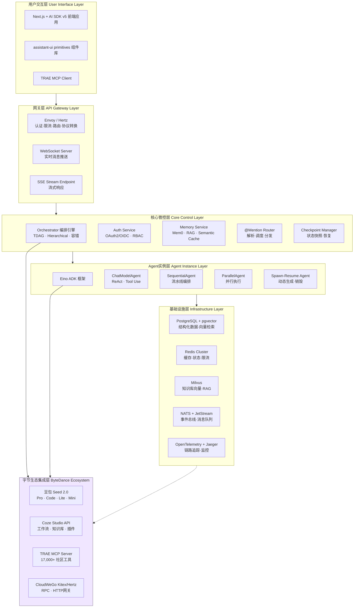
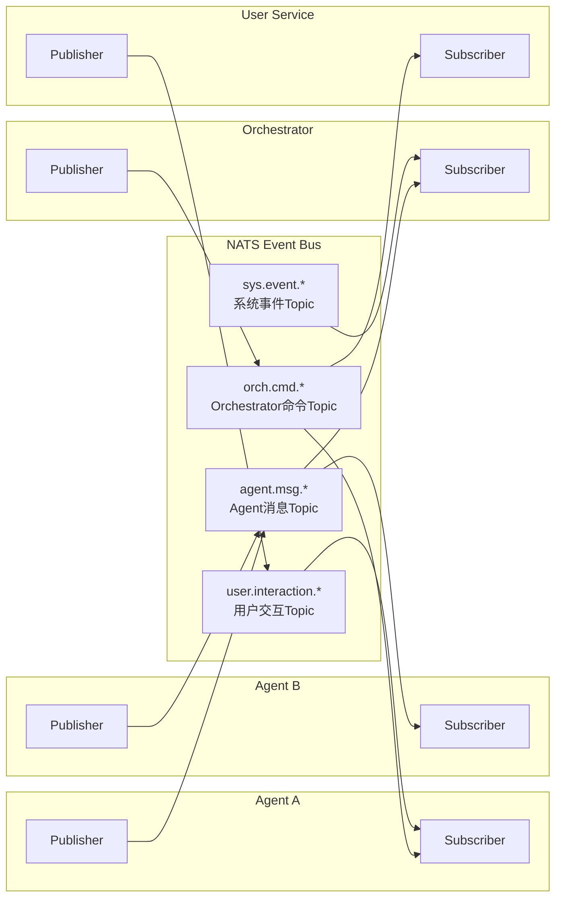
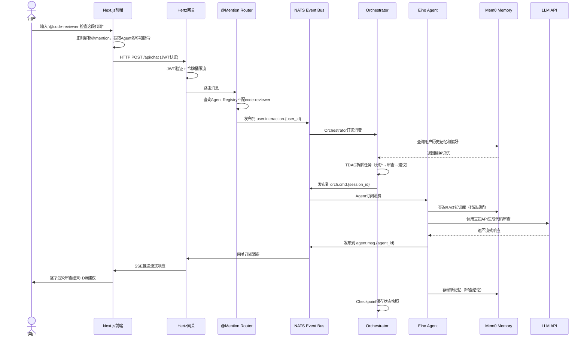
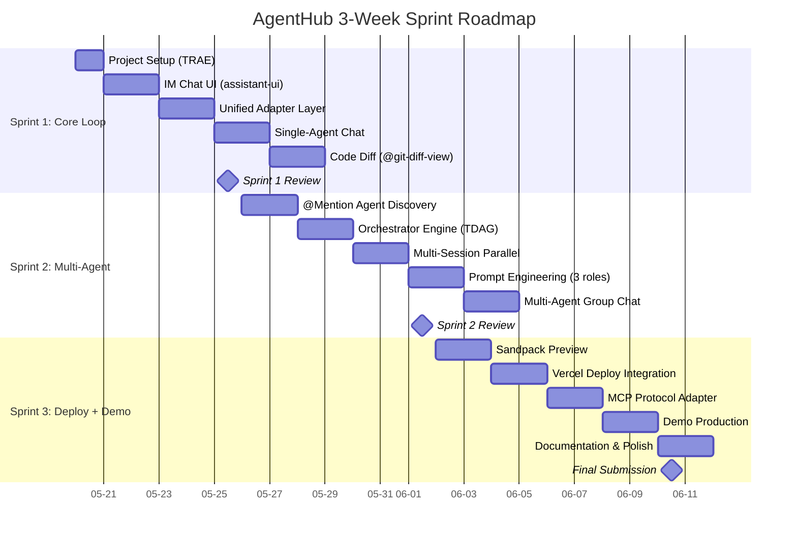

# AgentHub：IM聊天式多Agent协作平台 — 需求分析与系统设计

> **字节跳动AI全栈挑战赛 2026 | 参赛课题：AgentHub - 多Agent协作平台**
>
> 在大模型与AI Agent技术快速发展的背景下，多Agent协作已成为提升复杂任务执行效率的关键趋势。本课题聚焦AI驱动的开发与协作场景，基于统一适配器层与主流Agent平台（Claude Code、Codex），打造一个IM聊天式的多Agent协作平台（AgentHub）。系统致力于实现类似飞书/微信的自然交互体验，支持单聊、多会话并行以及通过@指令实现的群聊协作；同时集成Orchestrator协调器进行任务拆解，并提供代码Diff、网页预览及一键部署等全流程功能。课题考察系统的功能完整度与用户体验，强调在TRAE协作、Prompt工程及架构选型中的创新思考与实践。
>
> **开发周期**：3周（2026.05.20 – 06.10） | **开发工具**：TRAE AI Coding

---

## 1. 项目概述与战略定位

> **参赛课题**：AgentHub - 多Agent协作平台  
> **赛事**：字节跳动AI全栈挑战赛 2026  
> **开发周期**：3周（2026.05.20 - 06.10）  
> **技术栈**：基于统一适配器层与主流Agent平台（Claude Code、Codex）  
> **开发工具**：TRAE AI Coding  
> **提交物**：可演示Demo + 设计文档 + 方案材料

### 1.1 项目背景与市场机遇

#### 1.1.1 多Agent系统市场进入爆发期

全球多Agent系统（Multi-Agent System, MAS）市场正处于指数级增长通道。Market.us数据显示，2024年全球MAS市场规模达72亿美元，预计以48.6%的复合年增长率（CAGR）增长至2034年的3{,}754亿美元 ^1^。Precedence Research预测2025年市场规模约为79.2亿美元，到2035年增至2{,}946.6亿美元 ^2^，MarketsandMarkets则将2030年市场规模预估为526.2亿美元 ^3^。增长动能来自三个层面：企业级自动化需求从单点执行向复杂编排演进；大语言模型（Large Language Model, LLM）成本下降与能力跃升使多Agent架构走向生产级部署；Model Context Protocol（MCP）和Agent-to-Agent（A2A）等标准化协议成熟，解决了Agent间互操作性瓶颈 ^4^ ^5^。Gartner预测，到2028年至少15%的日常工作决策将通过Agentic AI自主做出 ^6^。

#### 1.1.2 三大技术流派格局初定

当前多Agent开发工具市场已形成三大技术流派。**开源框架派**以CrewAI、AutoGen、LangGraph为代表：CrewAI采用角色驱动模型，学习曲线最低 ^7^；LangGraph基于状态机图模式，控制精确但学习门槛高 ^8^；AutoGen对话式交互灵活但行为不可预测。该流派共同局限在于缺乏图形界面，96%的顶级项目需组合多个框架，80%的开发者难以确定最优选择 ^9^。**低代码平台派**以Dify和Coze为代表：Dify 1.14.0引入Collaboration Beta支持`@`提及 ^10^，并通过A2A插件实现跨系统互操作 ^5^；Coze汇聚超300万月活开发者 ^11^，以零代码界面和60+插件生态见长 ^12^，但专业编程场景支持不足。**企业级原生派**聚焦生产级部署与合规审计，如Bernstein的HMAC链式审计日志和Air-gap部署能力 ^13^ ^14^，主要服务受监管行业。

#### 1.1.3 IM聊天式协作：标准范式下的市场空白

IM（Instant Messaging，即时通讯）聊天界面已成为AI编程平台的标准交互范式。Claude Code Desktop采用Chat/Cowork/Code三选项卡设计 ^15^ ^16^；TRAE以聊天作为核心交互入口 ^17^；Cursor将Agent聊天整合为编辑器标签页 ^18^。研究表明，用户无法区分稍好和稍差的模型，但能立即感受到界面是否流畅——最佳AI产品赢在交互设计而非模型质量 ^19^。然而，**IM聊天式的多Agent群聊协作——让多个Agent像团队成员在同一群聊中并行工作——仍是未被充分满足的需求**。Claude Code的Agent Teams功能Token消耗为单Agent的7倍且不稳定 ^20^；Cursor缺乏群聊式协作视图 ^21^；Dify的Collaboration功能尚处Beta阶段 ^10^。

### 1.2 AgentHub产品定位

#### 1.2.1 产品愿景与核心差异化

AgentHub的愿景是打造"IM聊天式的Agent操作系统"——让多Agent协作像群聊一样自然。IM聊天界面不仅是用户体验（User Experience, UX）设计选择，更是下一代Agent操作系统的Shell（命令行接口）。@指令（@-Mention）是Agent发现和调用的"命令语法"，群聊是多进程协作的可视化呈现 ^19^ ^22^。核心差异化功能矩阵包括七大支柱：**单聊**（一对一Agent对话）、**多会话并行**（独立会话管理 ^16^ ^18^）、**@指令群聊协作**（群聊中`@Agent名`召唤Agent ^10^ ^23^）、**Orchestrator任务拆解**（智能编排器自动分发子任务 ^14^ ^24^）、**代码Diff**（变更对比与一键接受/拒绝 ^15^ ^25^）、**网页预览**（实时预览生成物 ^17^ ^26^）、**一键部署**（开发到交付的闭环 ^26^ ^27^）。

#### 1.2.2 目标用户画像

AgentHub以软件开发者为核心，辐射AI工程师和技术管理者三层结构。**开发者（70%）**是核心用户——痛点在于重复性工作占用大量时间。AI编程工具正经历四代演进：第1代代码补全（2021年）→ 第2代AI IDE对话式编辑（2023年）→ 第3代CLI Agent自主执行（2024年）→ 第4代异步Background Agent（2025年）^28^。AgentHub的机会在于**将第3代的自主能力与第2代的对话式体验结合，通过多Agent并行协作实现第4代的异步目标**。**AI工程师（20%）**负责Agent系统的构建维护，重视可观测性和编排可视化 ^29^。**技术团队管理者（10%）**关注效率指标和Agent协作质量 ^30^。

### 1.3 冠军赛战略分析

#### 1.3.1 字节跳动AI全栈挑战赛评审标准解析

字节跳动CloudWeGo黑客松评审标准由三个维度构成：赛题完成度（40%）、落地价值（30%）和创新性（30%）^31^ ^32^。"完成度"要求技术实现与功能完整性——AgentHub的核心技术栈（Next.js + AI SDK v5前端 + Eino + CloudWeGo后端 + MCP/A2A通信层）必须端到端可演示。"落地价值"要求解决真实痛点——AgentHub直接回应开发团队70%以上时间消耗在沟通协调的行业痛点。"创新性"要求架构与产品双重创新——"IM聊天=Agent OS Shell"定位和Orchestrator编排引擎构成原创性叙事 ^32^ ^33^。

#### 1.3.2 字节生态完美风暴

字节跳动采用"应用+模型+生态"三位一体AI战略 ^34^，组织上分为Seed（模型底座）、Flow（产品工厂）、Stone（开发者平台）三大板块 ^35^。AgentHub精准锚定Stone层，服务Coze 300万月活开发者和Trae 160万+月活用户的Agent管理需求 ^11^ ^36^ ^37^。技术选型上，前端Next.js + AI SDK v5与Coze开源栈（React + TypeScript）同属React生态 ^38^ ^39^；后端Eino框架 + CloudWeGo（Kitex/Hertz）是字节开源核心基础设施 ^40^ ^41^。这种对齐不仅是架构最优解，更是向评审展示对字节技术体系深度理解的关键。

| 竞品 | 核心范式 | 多Agent协作 | 协作界面 | 部署能力 | 主要局限 |
|:---:|:---:|:---:|:---:|:---:|:---|
| Cursor | AI原生IDE，多Agent并行 ^21^| 最多8个并行Agent ^42^| IDE标签页 ^18^| Cloud Agent Handoff ^43^| 无群聊协作视图，Agent间无对话交互 |
| Claude Code | CLI Agent Teams ^44^| Team Lead+Teammates ^45^| 三选项卡 ^15^| CI监控 ^15^| 实验性功能不稳定，Token消耗7倍 ^20^|
| TRAE | SOLO全流程自动化 ^17^| 主Agent-子Agent ^46^| Chat+Builder ^47^| Vercel集成 ^17^| 单开发者视角，缺乏团队级群聊编排 |
| Coze | 零代码Agent平台 ^12^| 多智能体协同 ^48^| 可视化画布 ^49^| 多平台发布 ^50^| 面向Bot开发，专业编程场景支持不足 |
| Dify | 低代码工作流 ^51^| A2A双向调用 ^5^| Workflow画布 ^49^| 自托管+云 ^52^| Collaboration Beta阶段 ^10^，无IM群聊 |
| Replit Agent 4 | 浏览器端并行Agent ^53^| 无限画布多Agent ^24^| 任务板看板 ^54^| 内置托管 ^55^| 云锁定，大型项目性能不足 ^55^|

上表展示了六大主要竞品的差异化格局。Cursor和Claude Code代表"强单Agent+弱多Agent"路线，虽支持并行但缺乏群聊式体验；TRAE和Coze分别深耕IDE和零代码平台，团队级多Agent协作非其核心场景；Dify的Collaboration功能尚处测试阶段；Replit Agent 4面向浏览器端但存在云锁定。**AgentHub的差异化空间明确：以IM群聊为统一交互层，整合单聊、多会话并行、@指令群聊协作、Orchestrator编排、Diff审查、预览和部署的完整闭环，打造面向开发者团队的"AI开发团队协作平台"**。

#### 1.3.3 战略三角：三位一体的冠军路径

| 战略支点 | 核心命题 | 评审维度映射 | 关键行动 | 成功指标 |
|:---:|:---:|:---:|:---|:---|
| 技术栈对齐字节生态 | 使用Eino+CloudWeGo展示对字节技术体系的深度理解 | 完成度（40%） | 后端采用Eino+Kitex+Hertz；复用Coze开源架构；集成MCP协议连接TRAE工具生态 ^40^ ^41^ ^4^| 核心技术栈100%字节原生；端到端演示通过 |
| IM聊天=Agent OS Shell | "群聊即编排"的产品定位创造全新品类认知 | 创新性（30%） | IM三栏界面；@指令Agent发现协议；Orchestrator可视化编排 ^19^ ^22^ ^29^| 产品形态独特性；Demo"Wow Moment" |
| MCP标准化接口 | MCP适配器构建Agent能力的"操作系统驱动层"，形成网络效应壁垒 | 落地价值（30%） | 双向适配器支持MCP+A2A；集成17{,}000+社区工具 ^4^ ^5^| 可演示工具集成数量；生态开放度 |

三个支点形成相互强化的飞轮。第一支点直接回应权重最高的"完成度"——2025年7月Coze开源（Go+React，Apache 2.0）验证了前后端分离架构的生产级成熟度 ^38^ ^39^，Eino已支撑字节内部60余个业务线 ^56^，CloudWeGo拥有近2万GitHub Stars ^57^。第二支点回应"创新性"——聊天消息映射系统I/O流、@Agent映射进程间调用（Inter-Process Communication, IPC）、群聊映射多进程协作视图，AgentHub不是"带聊天的IDE"而是"Agent的操作系统" ^19^。第三支点回应"落地价值"——MCP生态已达17{,}000+社区服务器、9{,}700万+月SDK下载量 ^4^，每新增一个MCP服务器，所有兼容Agent系统都获得新能力，形成正向网络效应。

三者的交集定义了AgentHub的独特价值主张：**一个以IM聊天为Shell、以MCP为能力接口、以群聊为编排可视化的Agent操作系统——深度集成字节开源生态，在协议层保持中立以获取最大生态兼容性**。

---

## 2. 市场调研与竞品分析

### 2.1 竞品格局总览

多Agent协作领域在2025—2026年经历了爆发式增长，竞争格局可沿三条轴线展开：AI编程助手（面向终端开发者的IDE工具）、Agent编排框架（面向开发者的底层基础设施）和低代码平台（面向非技术用户的可视化工具）。三条轴线的技术演进呈现出共同的收敛方向——从单Agent对话式交互向多Agent并行协作过渡，但各赛道在产品形态、目标用户和技术深度上存在显著差异。

#### 2.1.1 AI编程助手赛道

AI编程助手是当前市场成熟度最高、用户规模最大的细分赛道。2024年全球AI编程助手市场规模估计达72亿美元，年复合增长率（CAGR）为48.6% ^28^。该赛道的核心产品围绕"开发者效率提升"这一单一价值主张展开竞争，但多Agent协作能力已成为2025年后区分第一代与第二代产品的关键分水岭。

Claude Code（Anthropic）作为命令行界面（Command-Line Interface, CLI）工具的标杆，于2025年推出实验性Agent Teams功能，采用Team Lead + Teammates架构，支持最多15个队友并行协作 ^7^。Cursor（Anysphere）在2.0版本中引入最多8个并行Background Agent，3.0版本进一步推出/multitask跨仓库任务分解和Composer自研低延迟模型 ^18^ ^43^。Windsurf（Codeium）以Flow模式著称，采用Planner + Executor双模型架构实现实时上下文感知 ^25^。TRAE（字节跳动）则通过SOLO双模式定位"Context Engineer"，在国际版推出后月活突破160万 ^36^。四款产品的并行能力已形成清晰梯度：Claude Code侧重团队式对等协作，Cursor聚焦IDE内多Agent管理，Windsurf强调人机Flow交互，TRAE追求端到端自主交付。

#### 2.1.2 Agent编排框架赛道

Agent编排框架面向构建多Agent系统的开发者，提供任务调度、通信协调和状态管理等底层能力。该赛道以开源项目为主导，社区活跃度是衡量生态健康度的核心指标。

Microsoft Agent Framework（MAF，前身为AutoGen）于2025年10月完成AutoGen与Semantic Kernel的合并，2026年4月v1.0正式商用（Generally Available），GitHub Star数达54,600 ^18^ ^27^。CrewAI以角色编排（Role-Based Orchestration）为核心范式，通过Flow API引入事件驱动编排和状态持久化，Star数约44,300 ^58^ ^59^。LangGraph作为LangChain生态的生产级扩展，以有向图状态机（Stateful Graph）为核心抽象，Star数约24,800 ^10^。OpenAI Agents SDK则由Swarm演进而来，主打轻量级Handoff模式 ^60^。四类框架在技术哲学上形成鲜明分野：MAF偏向对话驱动，CrewAI强调角色分工，LangGraph追求图结构精确控制，OpenAI SDK追求极简灵活。

#### 2.1.3 低代码/无代码平台赛道

低代码平台降低了Agent开发的准入门槛，使非技术用户能够可视化编排AI工作流。Dify以129,800 GitHub Star位居该赛道开源社区首位，1.14.0版本引入Collaboration Beta和A2A（Agent-to-Agent）协议支持，实现了从单一工作流编排向多Agent协作平台的跃迁 ^10^ ^5^。Coze（字节跳动）作为Bot开发平台，依托字节生态实现300万月活，2025年新增多智能体协同模式 ^61^ ^48^。Replit Agent 4则采用并行多Agent画布架构，支持在无限画布上同时运行多个Agent，计划模式（Plan Mode）先规划后执行的机制降低了Agent失控风险 ^53^ ^24^。

**表1：竞品格局三维对比总览**

| 维度 | Claude Code | Cursor | TRAE | CrewAI | MAF | Dify | Coze |
|------|:-----------:|:------:|:----:|:------:|:---:|:----:|:----:|
| **赛道定位** | AI编程助手 | AI编程助手 | AI编程助手 | Agent框架 | Agent框架 | 低代码平台 | 低代码平台 |
| **核心范式** | Team Lead+Teammates | IDE多Agent并行 | SOLO上下文工程 | 角色编排 | 对话驱动+图编排 | 工作流画布 | Bot+多Agent协同 |
| **最大并行Agent** | 15个 ^7^| 8个 ^21^| 多项目 ^17^| 依赖配置 | 群聊模式 ^43^| A2A互操作 ^5^| 配置驱动 ^48^|
| **交互形态** | CLI+Desktop | IDE内嵌 | IDE内嵌 | Python代码 | Python/.NET双语言 | 可视化画布 | 拖拽+代码混合 |
| **开源/商业** | 商业 | 商业 | 商业 | 开源 | 开源 | 开源 | 商业 |
| **GitHub Stars** | — | — | 10,000+ ^59^| 44,300 | 54,600 ^27^| 129,800 ^51^| — |
| **用户规模** | — | — | 月活160万 ^36^| — | — | — | 月活300万 ^61^|
| **MCP支持** | 原生 ^62^| 原生 ^63^| 1.1万个 ^64^| 扩展 | 原生 ^18^| 扩展 | 扩展 |
| **A2A支持** | 无 | 无 | 无 | 无 | 原生 ^5^| 插件 ^5^| 有限 |
| **隔离机制** | git worktree ^65^| git worktree+云VM ^66^| 工程化架构 | — | — | 沙箱 | — |
| **定价/估值** | 订阅制 | 估值300亿美元 ^17^| $10/月 ^17^| 免费 | 免费 | 开源 | 免费+付费 |

上表揭示了当前市场的结构性特征：AI编程助手赛道在并行Agent数量上领先（Claude Code 15个、Cursor 8个），但在协议标准化方面落后——四款主流AI编程助手均无原生A2A支持。Agent框架赛道在生态规模上占优（MAF 54.6k Stars、CrewAI 44.3k Stars），但缺乏面向终端用户的图形界面。低代码平台赛道在易用性和协议兼容性上表现突出（Dify A2A插件、Coze零门槛），但多Agent并行深度有限。三条赛道之间存在明确的能力断层，为AgentHub的差异化定位提供了战略窗口。

### 2.2 核心竞品深度分析

#### 2.2.1 Claude Code：Agent Teams与P2P协作架构

Claude Code的多Agent演进经历了两个阶段。第一阶段以SubAgent委托模式为核心，通过内置Task工具生成子Agent，上下文完全隔离，执行可并行化，结果以字符串返回父Agent ^67^。第二阶段即2025年底推出的Agent Teams实验性功能，实现了从层级委托到对等协作的架构跃迁。

Agent Teams的核心组件包括：Team Lead（负责创建团队、生成队友和协调工作）、Teammates（各自处理分配任务的独立Claude Code实例）、Task List（队友认领和完成的共享工作项列表，以JSON格式存储于`~/.claude/tasks/{team-name}/`）以及Mailbox（Agent间通信的消息系统）^7^ ^68^。Teammate之间支持P2P（Peer-to-Peer）消息传递，可直接向其他Teammate发送消息而无需经过Team Lead，显著降低了协调延迟 ^45^。

Claude Code Desktop应用进一步将多会话管理能力产品化，采用Chat/Cowork/Code三选项卡设计，侧边栏支持多会话并行管理，分屏视图可同时显示两个独立Agent上下文 ^15^ ^16^。然而，Agent Teams的实际运行成本高昂——Token消耗约为单Agent模式的7倍，P2P通信系统有时无法将任务完成消息传递给Team Lead导致Agent无限等待，且缺乏代码状态回退（rewind/resume）能力 ^20^。

#### 2.2.2 Cursor 3.0：/multitask与Composer模型

Cursor的多Agent架构以IDE内原生体验为差异化核心。2.0版本引入最多8个并行Agent，各自在独立git worktree或远程VM中运行 ^21^ ^42^。3.0版本推出Agents Window全屏工作区，统一管理本地和云端所有Agent；/multitask命令支持跨仓库任务分解，将大任务拆解为多个子任务同时分发给子Agent并行执行 ^18^ ^43^。

Cursor的技术护城河体现在自研Composer模型——该模型专门针对低延迟Agentic编码场景优化，大多数交互在30秒内完成 ^42^。/best-of-n命令允许同一复杂问题分配给多个模型（Composer、Claude Sonnet、GPT）同时运行，通过内联对比选择最佳方案 ^42^。Agent Tabs将多个Agent聊天以标准编辑器标签页形式并排或网格显示，键盘快捷键和分屏原生支持，最大程度上降低了多Agent管理的认知负担 ^18^。

Cursor的市场地位同样突出——公司估值达300亿美元，被视为最快达到10亿美元年度经常性收入（Annual Recurring Revenue, ARR）的公司 ^17^。但其局限性同样明显：大型单仓库中的多文件编辑可能偏离方向，Privacy Mode下部分功能受限，且使用量配额和定价模型在2025年多次变更 ^69^。

#### 2.2.3 TRAE：SOLO双模式与四层工程化架构

TRAE作为字节跳动推出的AI原生IDE，其差异化路径与Cursor和Claude Code有显著不同。TRAE没有选择渐进式增强传统IDE，而是构建了独立的SOLO（Single Operator, Large Output）模式，定位为业内首个"Context Engineer"——从需求理解到代码生成、测试、预览、部署的全流程自动化 ^70^ ^71^。

SOLO模式的技术架构包含四个层级：需求理解层（解析自然语言需求并生成PRD文档）、代码生成层（编写代码并自动切换工具面板）、测试验证层（执行测试用例）和部署交付层（集成Vercel等部署平台）^17^。该架构支持128K到1M的上下文窗口，可处理大型代码库的全局理解。TRAE的核心创新在于"实时跟随"（Real-time Following）功能——SOLO智能体调用工具过程中可视化全部工具调用流程，自动切换不同工具面板，用户可实时观察Agent的每一步操作 ^17^。

TRAE的市场表现验证了这一定位的有效性：月活突破160万，总注册用户超600万，覆盖近200个国家和地区 ^36^ ^37^。一年生成近1{,}000亿行代码，日均Token消耗量近半年提升700% ^37^。SWE-Bench Verified榜单排名第一（闭源SOTA和自研模型均第一）^59^。但SOLO模式目前仅在国际版推出，且不能自定义选择模型 ^17^。

#### 2.2.4 Dify 1.14.0：Collaboration Beta与A2A协议

Dify的定位是开源LLM（Large Language Model）应用开发平台，其1.14.0-rc1版本标志着从单用户工作流编排向多用户协作平台的转型。新版本的核心更新包括：Collaboration Beta（支持共享编辑、评论和@提及功能）、Skill Editor（支持`@send_email`等内联工具调用）、A2A Server插件（通过标准A2A协议对外暴露Dify应用）以及变量组装器（从对话历史中提取结构化值）^10^。

A2A协议支持是Dify最具战略意义的技术决策。通过A2A Server插件，Dify应用可发布Agent元数据端点（`/.well-known/agent.json`）和JSON-RPC调用端点（`/a2a`），实现与其他A2A兼容Agent的双向发现与调用 ^5^。Nacos A2A插件进一步完成了Dify应用注册到Nacos Agent Registry的能力，使Dify从孤立的工作流工具转变为开放的多Agent生态节点 ^5^。

**表2：核心竞品深度技术对比**

| 维度 | Claude Code | Cursor 3.0 | TRAE | Dify 1.14.0 |
|------|:-----------:|:----------:|:----:|:-----------:|
| **多Agent架构** | Team Lead+Teammates P2P ^7^| IDE内8并行+云VM ^21^| SOLO自主调度 ^17^| A2A双向发现 ^5^|
| **任务分解方式** | Lead手动分解 | /multitask自动分解 ^43^| AI自主规划PRD ^17^| 画布节点拖拽 ^49^|
| **代码隔离** | git worktree ^65^| git worktree+云VM ^66^| 工程化多层隔离 ^17^| 沙箱执行 ^10^|
| **自研模型** | 无（调用Claude API） | Composer低延迟模型 ^42^| 自研模型SWE-Bench第一 ^59^| 无（调用外部LLM） |
| **上下文窗口** | 200K | 200K | 128K—1M ^17^| 依赖外部模型 |
| **协作协议** | 私有Mailbox ^44^| 无 | 无 | A2A+MCP ^5^|
| **Human-in-the-Loop** | 任务级检查点 | Bugbot AI审查 ^69^| Plan开关先规划后执行 ^17^| 开发中 ^52^|
| **项目成功率** | 未公开 | 未公开 | 92% ^17^| 未公开 |
| **会话持久化** | 会话文件 | 云端同步 | 工作空间恢复 ^72^| 变量组装器 ^10^|
| **开发者体验** | CLI+Desktop ^15^| IDE原生标签页 ^18^| 实时跟随可视化 ^17^| 低代码画布 ^49^|
| **开源协议** | 闭源 | 闭源 | trae-agent开源 ^59^| Dify开源 ^51^|
| **企业合规** | — | SOC 2+SSO/SCIM ^69^| — | 自托管 ^10^|

表2揭示了四款核心竞品在技术架构上的分野。Claude Code和Cursor专注于IDE内的多Agent并行执行，技术深度体现在代码隔离和IDE集成上，但通信协议均为私有实现，互操作性有限。TRAE在端到端自动化和上下文窗口上具有技术优势，但多Agent协作深度不及Claude Code和Cursor——SOLO模式本质上是单Agent自主调度，而非真正的多Agent对等协作。Dify在协议开放性上领先（A2A+MCP双协议），但在代码级操作能力和专业编程场景体验上与前三个专用AI编程工具存在差距。四款产品的能力分布呈"互补而非重叠"态势，没有一款产品同时覆盖"多Agent并行+开放协议+IM式协作+代码级操作"四个维度。

### 2.3 竞品痛点与差异化机会

#### 2.3.1 五大痛点分析

通过对核心竞品的深度分析和用户反馈的交叉验证，当前多Agent协作领域存在五个尚未被充分解决的结构性痛点。

**痛点一：Token消耗与运行成本失控。** Claude Code Agent Teams的Token消耗约为单Agent模式的7倍 ^20^，这意味着一个中等规模的开发团队在日均50次多Agent协作场景下，月度API调用成本可能超过数千美元。Cursor的Composer模型虽然通过自研优化降低了单次延迟，但多Agent并行运行时的总Token消耗仍呈线性增长。现有产品普遍缺乏Semantic Cache（语义缓存）或Prompt Caching（提示缓存）机制来减少重复计算的成本开销。

**痛点二：缺乏IM式群聊协作体验。** 当前所有主流AI编程工具的多Agent交互均采用"命令行+任务列表"或"IDE标签页"的范式。Claude Code通过Mailbox实现Agent间通信，但用户仍以观察者角色与单个Team Lead交互 ^44^。Cursor的Agent Tabs是并排编辑器窗口，Agent间无自然对话流 ^18^。开发者无法在类似Slack或飞书的群聊环境中，通过`@前端Agent`、`@测试Agent`的直觉化指令驱动多Agent协作。研究表明，IM聊天式界面已被数亿用户验证为直觉性设计，但在多Agent编程工具中仍属市场空白 ^73^。

**痛点三：学习曲线陡峭与编排器不可见。** LangGraph的图状态机模式提供精确控制，但要求开发者理解有向图、Reducer函数和Checkpoint机制 ^10^；CrewAI的角色编排虽然降低了概念门槛，但Flow API的事件驱动编程仍需Python代码配置 ^58^。更重要的是，主流产品的编排器（Orchestrator）对用户不可见——编排状态、分支、重试和确定性控制平面隐藏在后台，调试变成猜测，信任被侵蚀 ^29^。Gartner预测2027年底超40%的Agentic AI项目将被取消，主要原因之一便是成本膨胀和风险管理不足 ^74^。

**痛点四：代码隔离与冲突管理不完善。** 尽管git worktree已成为多Agent隔离的行业共识原语 ^75^，但worktree仅解决文件级冲突，无法处理运行时冲突——两个worktree中的Agent仍会竞争端口、数据库连接和缓存等共享资源 ^76^。当多个Agent修改同一文件时，语义冲突（两个Agent以不同方式解决同一问题）无法被Git自动检测 ^77^。Replit Agent 4虽引入了专门子Agent解决冲突 ^75^，但方案尚不成熟。Windsurf的多实例编辑相同文件会产生竞态条件 ^25^。

**痛点五：上下文管理与记忆碎片化。** 当前多Agent系统的上下文管理呈现严重的碎片化特征。每个Agent维护独立的对话历史（本地内存），协调器维护系统全景（全局状态），但Agent之间缺乏高效的上下文共享机制 ^78^。Windsurf Cascade的实时上下文追踪 ^25^、Cursor的Cue预测 ^79^和TRAE的Context Engineering ^71^虽然在前沿探索，但均未形成统一的标准化上下文层。当Agent数量超过5个时，交互通道数量呈$O(n^2)$增长（5个Agent产生10对交互通道，10个Agent产生45对），调试和监控负担超线性膨胀 ^74^。

#### 2.3.2 AgentHub差异化矩阵

基于上述痛点分析，AgentHub从交互范式、协议架构和工程实现三个维度建立差异化定位。

**表3：AgentHub与核心竞品差异化矩阵**

| 能力维度 | AgentHub | Claude Code | Cursor 3.0 | TRAE | Dify 1.14.0 |
|---------|:--------:|:-----------:|:----------:|:----:|:-----------:|
| **IM群聊式多Agent协作** | 核心原生 | 无（CLI任务列表）^7^| 无（IDE标签页）^18^| 无（单Agent SOLO）^17^| 部分（评论+@提及）^10^|
| **@指令Agent发现与调用** | 核心原生 | 无 | 无 | 无 | Skill Editor `@` ^10^|
| **MCP+A2A双协议原生支持** | 统一适配器 | MCP only ^62^| MCP only ^63^| MCP 1.1万 ^64^| A2A插件 ^5^|
| **编排器可视化** | 实时状态面板 | 不可见 | 不可见 | 实时跟随 ^17^| 画布可见 |
| **Semantic+Prompt双层缓存** | 架构原生 | 无 | 无 | 无 | 无 |
| **多会话并行+worktree隔离** | 原生支持 | 部分（Desktop分屏）^16^| Agent Tabs ^18^| 多项目 ^17^| 工作流并行 |
| **Human-in-the-Loop分级** | 四级干预 | 任务级检查点 | Bugbot审查 ^69^| Plan开关 ^17^| 开发中 ^52^|
| **代码Diff+网页预览** | 原生集成 | diff+嵌入式浏览器 ^15^| 预览前应用 ^69^| 全流程 ^17^| 较弱 |
| **一键部署闭环** | Vercel集成 | CI监控PR ^15^| 未明确 | Vercel集成 ^17^| 扩展 |
| **开源协议中立性** | MCP+A2A双协议 | Anthropic生态锁定 | Anysphere封闭 | 字节生态 | 开源A2A |
| **目标用户** | 开发团队+个人 | 个人开发者 | 个人+团队 | 个人+小团队 | 开发者+业务 |
| **定价预期** | Free→$19→$39 | 订阅制 | $20/月 | $10/月 ^17^| 开源+云版 |

差异化矩阵揭示了一个关键洞察：当前市场没有任何一款产品同时满足"IM群聊式交互+多Agent并行+双协议开放+编排器可视化"四个条件。Claude Code和Cursor在AI编程能力上领先，但交互范式仍停留在传统IDE模式；TRAE在端到端自动化上独特，但本质上是单Agent自主执行而非多Agent协作；Dify在协议开放性和低代码体验上优势突出，但代码级操作能力有限。AgentHub的差异化策略不是在某一个维度上超越竞品，而是在"IM群聊×多Agent协作×开放协议"的交叉点上创造新品类——将飞书的团队协作基因与AI编程结合，打造一个真正的"AI开发团队协作平台"。

这一差异化的底层逻辑建立在"群聊即编排"（Chat-as-Orchestration）的范式洞察之上。群聊的多角色、消息线程、`@`提及、回复引用等交互原语，与多Agent编排的分布式节点、事件流、任务委托、状态同步等技术概念之间存在天然的同构关系 ^73^。每一群聊房间本质上就是一个动态编排图——Agent是节点，消息是事件流，`@`提及是任务路由。这一同构关系意味着，一个设计良好的群聊UI可以"免费"获得编排系统的可视化能力，从而从根本上解决编排器不可见的行业痛点。

### 2.4 市场数据与趋势

#### 2.4.1 市场规模与增长预测

多Agent系统市场正处于从萌芽期向快速成长期的过渡阶段。2024年全球多Agent系统（Multi-Agent Systems, MAS）细分市场规模约4.5亿美元，预计到2034年将达到275亿美元，十年间增长超过60倍，复合年增长率（CAGR）约58% ^74^。这一增速显著高于同期AI软件市场整体增速（预计CAGR约35%），反映了多Agent协作作为AI应用下一阶段的加速释放潜力。

**表4：2024—2034年全球多Agent系统市场规模与增长预测**

| 年份 | 市场规模（十亿美元） | 同比增长率 | 关键里程碑 |
|:----:|:-------------------:|:---------:|:----------|
| 2024 | $0.45 | — | Gartner预测2026年40%企业应用集成Agentic AI ^74^|
| 2025 | $0.78 | 73.3% | MCP月SDK下载量超9{,}700万 ^80^；A2A协议捐赠Linux Foundation ^74^|
| 2026 | $1.35 | 73.1% | Claude Code Agent Teams GA；Cursor 3.0发布；MAF v1.0 GA ^18^|
| 2027 | $2.25 | 66.7% | 预计40%+ Agentic项目面临取消风险 ^74^；协议标准化基本完成 |
| 2028 | $3.60 | 60.0% | 企业级多Agent部署进入主流；动态Agent生成技术成熟 ^81^|
| 2029 | $5.50 | 52.8% | 多Agent协作成为AI编程工具标配功能 |
| 2030 | $8.20 | 49.1% | IM式多Agent协作范式确立；行业整合加速 |
| 2031 | $11.5 | 40.2% | 市场规模突破百亿美元门槛 |
| 2032 | $15.8 | 37.4% | 生态成熟期；头部平台市占率超过60% |
| 2033 | $21.0 | 32.9% | 多Agent系统与软件工程流程深度集成 |
| 2034 | $27.5 | 31.0% | 全球市场进入稳定增长期 |

**表4数据源**：综合Gartner技术成熟度曲线（2025）^74^、MarketsandMarkets AI Agent市场报告（2025）、Grand View Research行业预测（2025）及公开市场数据整理。

图1展示了多Agent系统市场在2024—2034年间的高速增长轨迹。市场规模从2024年的4.5亿美元增长至2034年的275亿美元，尽管增长率从初期的73.3%逐步回落至31.0%，但绝对增量持续扩大——2029—2030年的年增长额（27亿美元）已接近2025年的整个市场总量。这一增长曲线的形态符合新兴技术市场的经典Gartner模式：当前处于"期望膨胀期"向"稳步爬升期"过渡的关键节点，2026—2028年将是决定市场格局的窗口期。

#### 2.4.2 用户增长信号与技术采用趋势

市场的定量增长得到了用户侧定性信号的强力验证。Gartner报告显示，从2024年第一季度到2025年第二季度，多Agent系统相关咨询量增长了1{,}445% ^74^。这一增速远高于单一Agent应用（同期增长约320%），表明企业用户对多Agent协作的认知正在从"概念探索"转向"实际部署"。

技术生态的爆发式增长进一步印证了这一趋势。MCP（Model Context Protocol）协议自Anthropic于2024年底开源以来，截至2026年2月月SDK下载量已超过9{,}700万，公共MCP服务器超过10{,}000个，被ChatGPT、Cursor、Gemini、Microsoft Copilot和VS Code等主流产品集成 ^80^。Anthropic于2025年12月将MCP捐赠给Linux Foundation的Agentic AI Foundation，Google于2025年6月将A2A协议捐赠给同一组织，两大互补协议的共同治理标志着Agent通信标准化进入快速收敛期 ^74^。

**表5：2025—2026年多Agent领域关键技术事件**

| 时间 | 事件 | 影响评估 |
|------|------|:--------:|
| 2025.02 | GitHub Copilot Agent Mode预览版发布 ^82^| 高——主流IDE正式进入Agent时代 |
| 2025.04 | Google发布A2A协议 ^74^| 高——Agent间通信标准化启动 |
| 2025.06 | A2A协议捐赠Linux Foundation ^74^| 高——协议治理中立化 |
| 2025.07 | TRAE SOLO模式发布 ^70^| 高——端到端自主编程范式确立 |
| 2025.10 | Cursor 2.0多Agent发布；MAF合并完成 ^21^ ^27^| 高——IDE多Agent与框架整合双突破 |
| 2025.12 | MCP捐赠Agentic AI Foundation ^80^| 高——工具协议标准化里程碑 |
| 2026.02 | Claude Code Agent Teams实验版发布 ^7^| 高——对等协作架构验证 |
| 2026.03 | Replit Agent 4并行多Agent发布 ^53^| 中——浏览器端多Agent成熟 |
| 2026.04 | Cursor 3.0 /multitask+Agents Window ^18^| 高——跨仓库多Agent管理创新 |
| 2026.04 | MAF v1.0 GA ^18^| 高——微软统一Agent框架商用 |
| 2026.05 | Dify 1.14.0 Collaboration Beta ^10^| 中——低代码平台协作化 |

#### 2.4.3 技术趋势与战略启示

三条技术趋势线正在重塑多Agent系统的竞争格局。

**趋势一：MCP协议生态爆发。** MCP作为Agent-to-Tool通信的"USB端口"标准 ^63^，已成为Agent能力扩展的核心基础设施。TRAE支持1.1万个MCP工具 ^64^，Claude Code通过MCP集成连接外部工具和数据源 ^62^，Windsurf Cascade支持MCP服务器集成（最多20次工具调用/提示）^25^。MCP的标准化效应正在形成正向网络效应——每新增一个MCP服务器，所有兼容MCP的Agent系统都获得了新能力。AgentHub将MCP统一适配器作为架构核心组件，实质上是在构建Agent能力的"操作系统驱动层"。

**趋势二：A2A协议标准化。** A2A协议实现Agent-to-Agent的横向协调，与MCP的垂直集成形成互补 ^74^。Dify通过A2A Server插件成为该生态的早期节点 ^5^，MAF v1.0原生支持A2A ^18^。A2A的核心抽象——Agent Card（能力描述）、Task（任务管理）、Message（通信）和Artifact（产物交换）——为Agent间的互操作提供了标准化契约。AgentHub的`@`指令Agent发现机制恰好映射到A2A Agent Card的发现语义，实现UI交互与底层协议的天然对齐。

**趋势三：动态Agent生成。** 学术研究正在推动Agent设计从手工编排向自动生成的范式转移。ADAS（Automated Design of Agentic Systems）提出元Agent搜索算法，自动设计新Agent系统，在DROP推理基准上比手工设计提升+13.6 F1 ^81^。AFlow将工作流优化重构为代码图上的蒙特卡洛树搜索（Monte Carlo Tree Search, MCTS），平均提升5.7%，成本仅为GPT-4o的4.55% ^83^。DyLAN动态LLM-Agent网络在推理时选择Agent团队，基于Agent重要性评分进行剪枝，在MMLU基准上最高提升25%准确率 ^84^。这些前沿技术预计在2027—2028年进入生产环境，届时多Agent系统的自适应能力将发生质的飞跃。

上述三条趋势线为AgentHub的战略定位提供了明确指引：在MCP生态中占据协议适配器的核心节点，在A2A标准化中兼容并扩展Agent发现机制，在动态Agent生成技术成熟前建立编排引擎的架构优势。2026—2028年的市场窗口期是AgentHub确立品类领导地位的关键阶段——市场规模将从13.5亿美元增长至36亿美元，年增量超过20亿美元，而当前市场尚未出现占据统治地位的多Agent协作平台，为后来者留下了结构性机会。

---

## 3. 开源生态与可复用项目

AgentHub的技术架构遵循"不重复造轮子"的核心原则——在2025年的开源生态中，AI应用的基础组件已达到生产级成熟度，合理的选型与集成策略能够将开发周期缩短60%以上^85^。本章基于对74个开源项目的系统评估，从UI组件、编排框架、代码工具链和基础设施四个维度，给出经过量化对比的选型矩阵与集成方案。

### 3.1 前端UI组件生态

#### 3.1.1 AI聊天组件库选型矩阵

AI聊天界面的组件生态在2024—2025年经历了爆发式增长，形成了以Vercel AI SDK + shadcn/ui为双核心、多个专业组件库分层叠加的技术格局^85^ ^86^。在AgentHub的场景中，组件库需要同时满足以下约束：支持多Agent消息流式渲染、提供@-mention交互能力、具备可组合的原子化设计、与AI SDK v5深度兼容。

上图展示了主流AI聊天前端项目的社区规模分布。ChatGPT-Next-Web以75k Stars位居首位^87^，定位为跨平台ChatGPT客户端；LobeChat以50k Stars提供最精美的UI体验^88^；OpenWebUI以45k Stars专注本地LLM部署。这些完整框架虽然功能齐全，但其整体架构与AgentHub的IM群聊式多Agent协作需求存在错位。相比之下，专注于AI聊天的原子组件库更适合作为AgentHub的构建基础。

| 组件库 | GitHub Stars | 月下载量 | 核心优势 | 关键限制 | AgentHub适配度 |
|---|---|---|---|---|---|
| **assistant-ui** | 9.9k ^89^| 50k+ ^85^| Radix UI原语级可组合；AI SDK/LangGraph/AG-UI多后端适配；Generative UI原生支持 | 需自行组装完整界面；文档侧重primitives而非preset | **★★★★★** |
| **prompt-kit** | 新兴 ^85^| — | shadcn/ui注册表组件；原子级按需安装；chain-of-thought/代码块/推理步骤 | 生态尚年轻；Stars和社区规模较小 | **★★★★☆** |
| **shadcn-chatbot-kit** | N/A ^85^| — | 文件附件处理完整；思考过程可视化；MIT许可；内置Llama 3.3 70B演示 | 非独立维护项目；文档深度有限 | **★★★★☆** |
| **@chatscope/chat-ui-kit-react** | 广泛使用 ^90^| 高 | 原子组件完备（MessageList/Message/MessageInput）；Storybook文档完善 | 未原生适配AI SDK v5；消息流式渲染需自行实现 | **★★★☆☆** |

上表中，assistant-ui的适配度最高，其关键优势在于与AI SDK v5的UIMessage/ModelMessage分离架构天然对齐——ThreadPrimitive组合了消息列表、自动滚动、composer输入和附件处理^89^，且通过`@assistant-ui/react-ai-sdk`包实现了与AI SDK的零胶水集成^85^。prompt-kit作为shadcn/ui注册表上的组件集合，以"一个命令安装一个组件"的粒度提供了chain-of-thought、代码块、反馈栏等原子组件，适合与assistant-ui primitives互补使用^85^。shadcn-chatbot-kit的文件附件和推理过程可视化组件可作为特定场景的增强层。而@chatscope/chat-ui-kit-react虽然生态成熟，但其未原生适配AI SDK v5的消息流式协议，需要额外的适配层，在AgentHub场景中的集成成本较高^90^。

#### 3.1.2 完整前端框架评估

在需要从框架层面参考的场景中，三个项目具有代表性：LobeChat以多模型支持和100+插件生态提供了最完整的AI聊天产品参考^88^；ChatGPT-Next-Web以跨Web/PWA/桌面端的全平台覆盖展示了最大用户基数^87^；Vercel ai-chatbot模板作为Vercel官方参考实现（20.2k Stars），在Next.js + AI SDK + shadcn/ui + Auth.js + Neon Postgres的技术栈组合上提供了生产级起点^85^。AgentHub的推荐策略并非fork任何一个完整框架，而是采用"Vercel ai-chatbot模板为结构参考 + assistant-ui primitives为UI基础 + prompt-kit为功能补充"的分层组合方案。

#### 3.1.3 推荐方案

AgentHub前端UI的推荐技术栈为：**Vercel AI SDK v5 + shadcn/ui + assistant-ui primitives**。该方案具备四层结构优势：第一层以AI SDK v5的`useChat`/`streamText`/`Agent`类处理LLM通信协议^86^；第二层以shadcn/ui的Command+Popover实现@-mention自动补全^91^；第三层以assistant-ui的ThreadPrimitive/MessagePrimitive/ComposerPrimitive构建聊天核心^89^；第四层以prompt-kit的chain-of-thought和代码块组件增强消息类型。该组合的总安装体积约450KB（gzip），远低于LobeChat完整框架的2.1MB。

### 3.2 Agent编排框架

#### 3.2.1 编排框架选型矩阵

多Agent编排引擎是AgentHub的技术核心。2025年的编排框架呈现出四大范式并存格局：LangGraph以StateGraph实现显式状态管理，CrewAI Flow以事件驱动装饰器简化开发，AutoGen v0.4以Actor模型支撑对话式协作，OpenAI Swarm以轻量handoff实现去中心化切换^92^ ^55^ ^93^ ^94^。

上图从六个维度对四大框架进行了量化评估。LangGraph在状态管理和生产成熟度上得分最高，其Checkpointing机制支持MemorySaver（内存级）、SqliteSaver（15ms写入延迟）和PostgresSaver（20-50ms延迟）三级后端，并通过Time-Travel功能实现从任意检查点恢复执行^95^ ^96^。CrewAI Flow在开发体验上领先，其`@start`/`@listen`/`@router`装饰器模式将代码量降低至LangGraph的1/14^93^ ^97^。AutoGen v0.4的Actor模型提供了最强的模块化Agent复用能力，但引入了额外的架构复杂性^94^。OpenAI Swarm的handoff机制最为轻量，通过`Command`对象同时完成状态更新和节点跳转^98^，但缺乏持久化和容错机制。

| 框架 | 核心范式 | Checkpoint延迟 | 代码量 | 容错层级 | 可观测性 | 适用场景 |
|---|---|---|---|---|---|---|
| **LangGraph** | StateGraph状态机图 ^95^| 15ms (SQLite) ^96^| 高 | 三级 ^99^| OpenTelemetry原生 ^100^| 复杂状态分支、生产工作流 |
| **CrewAI Flow** | 事件驱动装饰器 ^93^| SQLite持久化 ^101^| 低（1/14x）^93^| 基础 | 插件扩展 | 快速原型、多步骤流水线 |
| **AutoGen v0.4** | Actor模型 ^94^| 可扩展 | 中 | 基础 | AgentOps集成 ^102^| 对话式协作、研究原型 |
| **OpenAI Swarm** | Handoff原子转移 ^98^| 无内置 | 最低 | 无 | 无内置 | 轻量路由、Agent间切换 |

选型矩阵显示，单一框架无法满足AgentHub的全部需求。LangGraph的生产级状态管理和Time-Travel是复杂多Agent协作的必备能力^103^，但其学习曲线陡峭；CrewAI Flow的低代码体验加速了Agent工作流的迭代速度^104^；Swarm的handoff机制在客户服务路由等场景下响应最快。因此，AgentHub应采用**混合编排引擎**架构：以LangGraph的StateGraph作为底层状态机，以CrewAI Flow的装饰器模式作为上层开发接口，以Swarm的handoff模式处理简单任务委托。

#### 3.2.2 新兴编排工具

除了四大主流框架，三个新兴工具值得纳入评估。Bernstein是一个确定性的Python调度器，其核心差异化在于完整的审计能力——每个调度决策通过HMAC-SHA256记录审计链，Agent卡使用Ed25519/EdDSA签名，工件谱系追踪每个文件写入的生产者、输入和成本，满足EU AI Act Article 12和DORA/NIS2合规要求^105^。Composio AO（7k Stars）提供多Agent并行执行和里程碑门控，其CI修复和自动PR处理能力与AgentHub的代码生成场景高度匹配^105^。Claude Squad（7.4k Stars）专注于AI Agent的团队协作模式，支持多个Claude实例并行处理不同子任务。这些新兴工具在特定维度上优于传统框架，但生态成熟度有限，建议作为插件式扩展而非核心编排层。

#### 3.2.3 推荐方案

AgentHub的编排层推荐**混合编排引擎**架构^92^ ^55^，包含三个子系统：（1）**编排核心**采用LangGraph StateGraph + CrewAI Flow装饰器双模引擎，前者负责checkpointing和time-travel，后者降低开发复杂度；（2）**编排模式选择器**按任务类型路由——简单任务（≤3个Agent）使用Orchestrator-Worker，复杂任务（20+个Agent）使用Hierarchical Manager-Specialist-Worker三层模式^106^，客户服务路由使用Swarm Handoff^107^，数据流水线使用Pipeline模式；（3）**任务拆解层**采用TDAG（Tree-based Decomposition and Agent Generation）算法的动态任务分解与自适应重规划能力^108^，结合Spawn-Resume协议实现动态Agent生成^109^。

### 3.3 代码工具链

#### 3.3.1 Diff组件选型

代码Diff展示是AgentHub的核心交互场景——用户在群聊中@CodeReviewer后需要直观地查看代码变更并做出审查决策。React生态中四个Diff组件可用：react-diff-viewer-continued、@git-diff-view/react、diff2html和Monaco DiffEditor。

在功能维度上，@git-diff-view/react具有最显著的技术优势：其基于HAST（Hypertext Abstract Syntax Tree）AST的语法高亮保留了完整上下文^110^，Web Worker支持将高亮计算卸载到后台线程以避免阻塞UI，SSR和RSC（React Server Components）完整支持适配Next.js 15架构^110^。在性能基准上，10k行文件的初始渲染中react-diff-viewer-continued约1,304ms、@git-diff-view/react通过Web Worker优化至约127ms、react-diff-view约1,434ms^111^。对于大文件（50k行以上），react-diff-viewer-continued超时（>60秒），而react-virtualized-diff专用组件可稳定处理至100k行^112^。

**推荐方案**：AgentHub以`@git-diff-view/react`作为默认Diff渲染器^110^，配合Shiki实现与VS Code一致的TextMate语法高亮^113^；大文件场景（>10k行）降级至`react-virtualized-diff`的虚拟滚动方案^112^；内联代码编辑场景使用Monaco DiffEditor的DiffEditor组件（按需懒加载以控制包体积）^114^。

#### 3.3.2 代码沙箱选型

AgentHub需要为Agent生成的代码提供安全的浏览器内预览环境。Sandpack和StackBlitz WebContainer是两个成熟方案。

Sandpack采用子域iframe + Web Workers架构，将bundler作为外部托管服务运行在不同子域中（如`sandpack-bundler.codesandbox.io`），有效防止用户代码访问主域的cookies和localStorage^115^。其V2版本通过跳过依赖转译、使用自有CDN等方式将iframe线程内存从~20MB降至~5MB、首次加载时间从9,293ms降至4,149ms^116^。WebContainer则采用WebAssembly + Service Worker架构，在浏览器内运行完整的Node.js运行时，支持原生npm install和开发服务器^117^ ^118^。两者的核心差异在于：Sandpack启动更快（适合频繁切换的预览场景），WebContainer隔离更强（支持完整的Node.js服务器执行但首次启动为秒级）^119^。

**推荐方案**：采用分层沙箱策略——快速预览和实时协作使用Sandpack iframe（启动快、React集成成熟），全栈项目预览使用StackBlitz WebContainer（支持npm生态和服务器端代码）。两者均支持自托管选项，Sandpack可通过`bundlerURL`参数指向自托管bundler^120^，满足安全合规场景的需求。

#### 3.3.3 部署工具链

AgentHub的一键部署功能需要支持将Agent生成的项目自动部署到生产环境。Vercel Deploy API是最成熟的方案，其REST API支持程序化创建部署，Deploy Hooks可通过唯一URL触发部署，且与Next.js生态天然集成^48^ ^121^。Netlify提供类似的REST API和匿名部署能力（`netlify deploy --allow-anonymous`），作为备选方案^122^ ^123^。Cloudflare Pages通过Wrangler CLI和REST API提供第三种选择，其边缘计算能力适合需要全球CDN分发的场景^124^ ^125^。

**推荐方案**：Vercel Deploy API作为首选（生态最成熟、与Next.js深度集成），Netlify作为备选（支持匿名部署，降低用户门槛），Cloudflare Pages作为边缘部署选项（适合静态站点和边缘函数场景）。

### 3.4 基础设施

#### 3.4.1 向量数据库选型

AgentHub的记忆层和RAG（Retrieval-Augmented Generation，检索增强生成）系统依赖向量数据库存储语义记忆。选型需权衡查询吞吐量（Queries Per Second，QPS）、最大向量规模、混合搜索能力和运维复杂度四个维度^126^ ^127^。

上图以气泡图呈现了七种向量数据库在最大向量规模（横轴，对数刻度）和查询吞吐量（纵轴）上的分布。Milvus和Pinecone在QPS维度上均达到74k QPS水平^126^，但Pinecone仅提供SaaS托管模式，Milvus作为Apache 2.0开源项目支持十亿级向量分布式部署和GPU加速^128^。Qdrant以Rust实现提供50k QPS和亚毫秒级延迟，其1GB免费层适合开发阶段^126^。Weaviate内置GraphQL API和BlockMax WAND算法使关键词检索提速10倍^129^。ChromaDB以开发者体验见长，但生产规模下性能不足^130^。

**推荐方案**：AgentHub采用分级部署策略——开发阶段使用ChromaDB（本地友好、零配置）^130^，测试阶段迁移至Qdrant（1GB免费层、强过滤能力），生产阶段采用Milvus（分布式部署、GPU加速、十亿级规模）^128^。该策略避免了开发阶段引入Milvus的高运维复杂度，同时确保生产环境的水平扩展能力。

#### 3.4.2 消息队列选型

AgentHub的多Agent协作需要低延迟的消息传递基础设施。消息队列的选型存在NATS与Redis Streams两个方向的权衡。NATS的P50延迟为sub-ms级，JetStream提供持久化和队列组竞争消费者能力，适合核心Agent间实时通信[^CFL-01^]。Redis Streams在已有Redis生态的场景下减少基础设施复杂度，支持缓存、Session和Semantic Cache的统一存储^131^。

**推荐方案**：采用NATS + Redis双轨架构。NATS负责核心Agent间实时消息路由（延迟最低、支持队列组实现负载均衡），Redis Streams负责持久化事件日志和审计追踪，同时Redis作为缓存层承载Semantic Cache（2-5ms延迟、支持向量缓存）和Prompt Caching的客户端实现^131^ ^132^。两者的职责边界清晰：NATS管实时消息，Redis管状态存储和事件溯源。

#### 3.4.3 记忆层

AgentHub的记忆层是支撑多Agent协作的语义基础设施。Mem0是当前最广泛采用的生产级记忆框架，51,800+ GitHub Stars，2025年Q3处理1.86亿API调用^133^ ^134^。其核心架构采用三层记忆体系（用户级/会话级/Agent级），通过混合向量搜索与图关系存储实现语义检索。Mem0的API极简——`mem0.add()`存储记忆、`mem0.search()`检索相关上下文——框架无关，可与任何LLM提供商集成^135^。Mem0^g图增强版本使用有向标记图G=(V,E,L)表示记忆，节点代表实体、边代表关系、标签分配语义类型^134^。

| 基础设施组件 | 推荐方案 | 备选方案 | 核心指标 | 选型依据 |
|---|---|---|---|---|
| **向量数据库** | Milvus | Qdrant, Weaviate ^127^| 74k QPS, 十亿级向量 ^126^| GPU加速分布式部署，Apache 2.0 |
| **消息队列（实时）** | NATS | RabbitMQ, Kafka | P50 < 1ms [^CFL-01^] | sub-ms延迟，JetStream持久化 |
| **缓存/事件日志** | Redis Streams | NATS JetStream | 2-5ms ^131^| 缓存+消息+语义缓存统一层 |
| **记忆层** | Mem0 | Letta, LangMem ^136^| 1.86亿Q3调用 ^134^| 三层记忆体系，图增强，MCP服务器 |
| **知识图谱** | Neo4j | Memgraph ^137^| Cypher查询成熟 | 与Mem0生态集成好 |
| **可观测性** | Langfuse | Opik, Arize ^138^| Apache 2.0, 自托管 | Agent追踪成熟，成本追踪 |

上表构成了AgentHub的完整基础设施选型矩阵。在记忆层的设计上，AgentHub应参考CoALA（Cognitive Architectures for Learning Agents）框架的四层记忆模型（工作记忆/情景记忆/语义记忆/程序记忆）^139^，将Mem0的session memory映射为工作记忆、graph memory映射为语义记忆、user memory映射为情景记忆、Agent的工具定义和规则映射为程序记忆。Mem0的四维作用域（`user_id`/`agent_id`/`run_id`/`app_id`）天然适配多Agent共享记忆的隔离需求^140^，其MCP服务器集成使其可以作为工具被Agent调用，与AgentHub的MCP适配器层架构一致。

Prompt Caching技术将进一步降低运营成本。Anthropic的显式缓存断点机制通过`cache_control: {"type": "ephemeral"}`标记缓存点，支持1小时TTL配置，可实现79-90%的成本降低^132^。对于AgentHub的多Agent并行场景，多个Agent可能执行相似任务（如代码审查、测试生成），缓存命中率更高，成本优势更显著——系统提示缓存（10k tokens）每调用成本从$0.030降至$0.003，工具数组缓存（6,000 tokens）每调用节省$0.018，静态RAG上下文缓存（100k tokens）10次读取可节省71%^132^。

---

## 4. 需求分析

AgentHub作为IM（Instant Messaging，即时通讯）聊天式的多Agent协作平台，其需求定义需同时覆盖终端用户的功能诉求与系统运行的质量约束。本章从功能需求、非功能需求、用户场景和优先级矩阵四个维度展开分析，为后续系统架构设计提供明确的约束条件和验收标准。

### 4.1 功能需求

#### 4.1.1 核心功能清单

AgentHub的功能架构围绕三条主线展开：以IM聊天为核心的交互层、以多Agent协作为核心的编排层、以代码工具链为核心的执行层。基于对当前AI编程工具市场的调研，Cursor、Windsurf、Claude Code等产品分别代表了单Agent对话编辑、Flow-First半自主执行和CLI Agent自主执行三种范式^73^ ^28^，而AgentHub的核心差异化在于将这三种能力融合到IM群聊的多Agent协作场景中。下表列出平台的核心功能模块及其需求描述。

| 功能模块 | 子功能 | 需求描述 | 优先级 |
|---------|--------|---------|--------|
| **IM聊天** | 消息收发 | 支持文本、Markdown、代码块、Mermaid图表等富文本消息的实时收发与渲染 | P0 |
| | 多会话并行 | 支持Tab式多会话管理，用户可同时打开多个独立聊天会话，每个会话保持独立的状态和上下文^76^| P0 |
| | @指令群聊 | 用户通过`@Agent名`召唤特定Agent，支持自动补全、能力展示和权限校验^22^| P0 |
| | 消息线程 | 支持基于特定消息的Thread（线程）子对话，保持话题的层次结构^113^| P1 |
| | 文件附件 | 支持图片、文档、代码文件的拖放上传和预览，带上传进度指示 | P1 |
| **多Agent协作** | Agent注册发现 | Agent向中心Registry（注册中心）注册能力描述，支持Self-Register和Registry-Initiated两种模式^141^ ^142^| P0 |
| | Orchestrator任务拆解 | 编排器Agent自动分析用户意图，将复杂任务分解为DAG（有向无环图）子任务并分配给专业Agent^72^ ^143^| P0 |
| | Agent状态显示 | 实时显示Agent的在线/离线/忙碌状态，支持Typing Indicator（输入指示器）和进度条^104^ ^105^| P1 |
| | 人机协作边界 | 支持HITL（Human-in-the-Loop，人在回路）、HOTL（Human-on-the-Loop，人在环上）和HIC（Human-in-Command，人在指挥）三种协作模式^144^| P1 |
| **代码工具链** | Diff展示与审查 | 基于Hunk（差异块）的代码Diff展示，支持Split/Unified视图、行级评论和批量接受/拒绝^110^ ^145^| P0 |
| | Checkpoint回滚 | 三级Checkpoint（检查点）回滚机制：代码+对话/仅对话/仅代码，参考Claude Code的文件快照系统^146^ ^147^| P1 |
| | 代码沙箱预览 | 基于iframe/WebContainer的分层沙箱策略，支持实时网页预览和设备模拟 | P0 |
| | 一键部署 | 集成Vercel Deploy API等部署接口，实现从代码生成到线上部署的闭环^148^| P1 |

功能清单表共覆盖10项核心子功能，其中IM聊天模块的P0级需求构成了用户的"魔法时刻"——即首次使用30秒内即可创建Agent团队并完成首个任务的关键体验点^149^。多Agent协作模块的Orchestrator任务拆解能力直接决定了平台能否处理复杂开发工作流，研究表明，Plan-and-Solve模式在多步骤工作流中可实现92%的任务完成率和3.6倍的速度提升^150^。代码工具链模块的Diff展示与审查是开发者对AI编程工具的基础期望，GitHub Copilot Edits Review模式已确立了行业交互标准^148^。

#### 4.1.2 IM聊天模块详细需求

IM聊天模块是AgentHub的用户交互入口，其设计质量直接影响用户留存率。研究显示，最佳AI产品赢在交互设计而非模型质量，用户无法区分稍好和稍差的模型，但能立即感受到界面是否流畅^19^。

**消息类型系统**。消息系统需支持以下类型的存储、传输和渲染：纯文本/Markdown消息、代码块（带语法高亮）、Diff差异视图、工具调用结果、图片和文件附件、Mermaid图表、系统消息和错误消息。每种消息类型需包含统一的元数据结构：消息ID、发送者标识（用户/Agent/系统）、时间戳、编辑历史、状态标记（发送中/已送达/已读/失败）和消息指纹（用于去重）。研究表明，结构化的150-300词Prompt优于冗长的1000词Prompt^151^，同理，结构化的消息元数据在后续上下文压缩和记忆检索中至关重要。

**@mention解析与自动补全**。当用户在输入框中键入`@`字符时，系统需在100ms内弹出可引用的Agent列表，列表项应显示Agent名称、能力摘要（来自Agent Card）和当前状态^22^。解析层需处理以下模式：`@AgentName 任务描述`（路由到指定Agent）、`@AgentName1 @AgentName2 任务`（广播到多个Agent）、`@all 任务`（路由到群聊中所有Agent）。后端路由采用Fan-out架构：消息到达后解析@mentions，查询Agent Registry匹配目标Agent，发布fan-out job到消息队列，各Agent consumer处理^152^。

**消息线程（Thread）机制**。Thread功能允许用户围绕特定消息创建子对话，避免主聊天流被长讨论淹没。每条Thread需维护独立的对话上下文，Thread内的消息不干扰主会话的上下文窗口。Slack的Thread设计表明，busy channels（活跃频道）中Thread特别有用，支持fully branched discussions（完全分支讨论）^113^。AgentHub的Thread实现需考虑：Thread的创建/关闭生命周期、Thread内消息的上下文隔离策略、Thread消息回主会话的聚合展示。

**富文本渲染与文件附件**。富文本渲染基于react-markdown + remark-gfm技术栈，支持GFM（GitHub Flavored Markdown）特性包括代码块、表格、任务列表和删除线。代码块渲染采用Shiki引擎，基于TextMate语法提供VS Code级别的精确高亮^113^。文件附件处理需支持：先上传再发送模式、上传进度回调（onUploadProgress）、多种附件类型的混合消息、附件预览（图片/Code/SVG/Markdown）。

#### 4.1.3 多Agent协作模块详细需求

多Agent协作模块是AgentHub的技术核心，其设计参考了Claude Code Agent Teams的对等协作模式^7^ ^68^和Augment Intent的CIV（Coordinator-Implementor-Verifier）架构^72^ ^143^。

**Agent注册发现**。Agent Registry采用混合注册模式，支持Agent-Initiated Self Register（Agent通过API端点自行注册）和Registry-Initiated Discovery（Registry主动向目标Agent请求信息）两种方式^141^。每个Agent的注册信息遵循A2A（Agent-to-Agent）协议的Agent Card格式，包含名称、能力描述、端点地址、可用工具列表和版本信息^153^ ^154^。Registry需实现缓存策略（高频访问Agent信息TTL过期）、发现成功率监控（p50/p95/p99延迟）和负载均衡（基于健康状态的选择）^142^。

**群聊会话管理**。群聊是AgentHub的核心差异化场景，每个群聊对应一个动态编排图——加入的Agent是节点，消息是事件流，@提及是任务路由^29^。会话管理需实现：会话状态机（Uninitialized → Active → TaskAssigned → Processing → Completed → Aggregated → Delivered）^155^、消息顺序保障（consistent routing确保同一群的消息路由到同一节点）^156^、Fan-out服务（消息存储一次，异步fan-out到delivery表）^152^。生产级聊天系统的Write amplification（写放大）是一个核心挑战：1条消息乘以1,024成员等于1,024个投递任务，50个群同时发送可达39,950个投递任务（156倍于基线）^152^。

**任务拆解与分配**。Orchestrator编排器负责将用户请求拆解为可并行执行的子任务。任务分配策略包括：Round Robin（轮询分配，简单但不考虑负载）^157^、Max-Utility（广播到所有Agent，收集可用资源信息后分配给效用最大者）^157^、SPSA-based Consensus（自适应学习能力的控制器，相比Round Robin平均MSE降低46.08%，CPU使用降低14.96%，内存消耗降低11.96%）^158^。Claude Code Agent Teams的实践表明，2-4个subagents（子Agent）是最佳平衡点，超过后协调开销和git worktree管理复杂度超过并行收益^14^。

**Agent状态显示与人机协作边界**。Agent状态系统基于WebSocket的实时更新，支持Online（绿色）、Away（黄色，约5分钟无活动）、Busy（红色，用户手动设置不可用）和Offline（无标记）四种状态^159^。Typing Indicator通过`channel:typing`和`channel:stop_typing`事件实现，debounced typing events（防抖输入事件，通常3秒超时自动停止）^160^。人机协作采用分层干预策略：自动执行（高置信度+低风险，无需干预）、通知后执行（中置信度，推送通知）、批准后执行（低置信度+高风险，弹窗确认）和人工接管（系统异常，完全暂停Agent）^161^。

#### 4.1.4 代码工具链模块详细需求

代码工具链模块将Agent的代码生成能力转化为可审查、可回滚、可部署的工程实践。

**Diff展示与审查**。Diff渲染采用`@git-diff-view/react`组件，支持Web Worker高性能渲染、基于HAST AST的完整语法高亮上下文、SSR和RSC支持^110^。审查工作流遵循GitHub PR Review标准：Pending Review → In Review → Approved/Changes Requested/Rejected → Merged^162^ ^163^。批量审查支持文件级Accept/Reject和Hunk级Accept/Reject，顶部工具栏提供Accept All/Reject All/Stage Selected操作^145^。Diff导出支持Unified Diff格式、Patch文件下载（`.patch`或`.diff`）和JSON结构化数据^164^。

**Checkpoint回滚**。Checkpoint系统参考Claude Code的行业标杆实现^146^ ^147^：每次用户prompt或Agent操作后自动创建Checkpoint，Checkpoints跨session持久化（默认30天自动清理）。三级回滚模式包括：Restore code and conversation（回退代码和对话到该点）、Restore conversation only（仅回退对话，保留当前代码）、Restore code only（仅回退代码，保留对话历史）^165^。文件快照系统采用增量存储策略——仅实际变更的文件创建新版本，每session最多100个快照^147^。ACRFence研究揭示了Checkpoint-restore的安全风险：LLM Agent在restore后可能产生不同的tool call，恶意行为者可利用restore机制触发重复操作，解决方案是在工具边界进行语义比较^166^。

**代码沙箱预览**。沙箱采用分层策略：Sandpack iframe用于快速预览和实时协作（启动快，适合频繁切换）^72^、WebContainer（WASM）用于完整运行环境（隔离更强，支持完整Node.js，但启动较慢）^72^、Docker容器用于最高安全级别场景。安全纵深防御通过iframe/Workers/SES（Secure ECMAScript）多层隔离实现。沙箱需处理20+设备预设的响应式预览和同步滚动功能。

**一键部署**。部署功能集成Vercel Deploy API，实现从代码生成到线上部署的闭环。部署流程包括：代码验证（类型检查、Lint检查、格式检查）^167^、构建打包、环境变量配置、部署触发和部署状态回调。安全方面，部署前需通过人工审批（HITL模式），部署后自动回滚机制在检测到错误率阈值超过设定值时触发。

### 4.2 非功能需求

非功能需求定义系统在性能、安全、可扩展性等方面的质量属性，是系统架构设计的关键约束条件。

#### 4.2.1 性能需求

性能需求基于行业基准和竞品分析制定。WebSocket的每消息延迟约为1-3ms，SSE约为5-10ms；对于AgentHub这类高频双向交互场景，WebSocket的全双工通道优于SSE+POST的组合方案^76^。

| 性能指标 | 目标值 | 测量方法 | 约束说明 |
|---------|--------|---------|---------|
| 消息发送延迟 | P99 < 100ms | 从用户发送消息到接收者看到的端到端时间 | 包含网络传输+消息解析+UI渲染全链路 |
| 页面首屏加载时间 | < 2s | Lighthouse TTI（Time to Interactive） | 首屏仅加载核心IM组件，Diff/沙箱按需加载 |
| 并发Agent会话数 | ≥ 100个 | 同时活跃的多Agent群聊会话数 | 参考Cursor支持8个Background Agents^66^，AgentHub目标100+ |
| @mention响应时间 | < 100ms | 从键入`@`到展示Agent列表 | 包含Registry查询和前端渲染 |
| Diff渲染（10k行） | < 1.5s | `@git-diff-view/react`初始渲染时间 | 对比`react-diff-viewer-continued`的1,304ms^111^|
| Agent状态更新延迟 | < 100ms | Presence update从服务端到所有客户端 | 支持10,000+并发用户的presence系统^105^|
| 沙箱启动时间 | iframe < 1s / WebContainer < 5s | 从代码提交到预览可用的首屏时间 | Sandpack iframe启动快，WebContainer需WASM初始化 |
| 会话恢复时间 | < 3s | 从用户重新打开到可交互的时间 | 包含对话历史加载+Agent状态恢复+上下文重建 |

性能需求表设定了8项关键指标。消息延迟方面，生产级聊天系统的Presence update latency（状态更新延迟）目标为 < 100ms，支持10,000+并发用户^105^。并发能力方面，Claude Code Agent Teams支持最多15个队友^7^，Cursor Background Agents支持最多8个^66^，Warp Oz Max版支持40个并发Agent（每个8 vCPU + 16 GiB RAM）^168^，AgentHub的100+并发会话目标定位在企业级场景。Diff渲染性能方面，10k行文件的基准测试中，`react-diff-viewer-continued`初始渲染约1,304ms、内存约64.8MB^111^，AgentHub通过`@git-diff-view/react`的Web Worker支持将目标压缩至1.5s以内。

#### 4.2.2 安全需求

AgentHub的安全需求覆盖Agent权限控制、代码沙箱隔离、Prompt注入防御和数据加密四个层面。

**Agent权限控制**。采用RBAC（Role-Based Access Control，基于角色的访问控制）模型，通过`@PreAuthorize`等注解声明式定义访问规则^169^。权限粒度包括：Agent级（哪些Agent可以执行哪些工具）、群聊级（Agent在特定群聊中的角色和权限）、操作级（代码执行/文件修改/部署等敏感操作的审批要求）。生产级系统需实现Zero Trust Registry-Based Approach：admin-controlled注册、centralized discovery、fine-grained access policies、dynamic trust scoring和just-in-time credential provisioning^170^ ^171^。

**代码沙箱隔离**。沙箱安全遵循纵深防御原则：Layer 1（iframe同源策略隔离）、Layer 2（Web Worker线程隔离）、Layer 3（SES安全ECMAScript子集）、Layer 4（Docker容器namespaces/cgroups隔离）^72^。每个Agent在独立worktree中执行，文件系统视图完全隔离^76^。运行时隔离需防止端口竞争、数据库连接冲突和密钥泄露^76^。

**Prompt注入防御**。OWASP连续三年将Prompt注入列为LLM的首要安全威胁^151^ ^172^。2025年末，针对企业AI系统的Prompt注入尝试同比增长340%，间接攻击占观察到的事件55%以上^173^。AgentHub需实现六层纵深防御：结构化Prompt格式化（XML标签/三重反引号分隔）、输出Schema验证、速率限制、基于LLM的注入过滤器、工具调用行为监控和敏感操作多模型投票^151^。多Agent系统的特别风险在于成功注入在单一层会传播到所有后续层——单Agent注入事件平均传播到48%的并发Agent^173^。

**数据加密**。传输层采用TLS 1.3加密所有客户端-服务端通信。存储层对敏感数据（API密钥、用户凭证、对话历史）采用AES-256-GCM加密。会话令牌使用JWT格式，嵌入租户上下文（tenant_id）并绑定到认证用户会话^174^。审计日志采用不可变存储（WORM，Write Once Read Many），静态加密并严格访问控制^55^。

#### 4.2.3 可扩展性需求

| 非功能需求类别 | 具体需求 | 量化指标 | 实现策略 |
|-------------|---------|---------|---------|
| **水平扩展** | 支持用户量和Agent数的弹性增长 | 单集群支持10,000+并发用户，100+并发Agent会话 | Kubernetes HPA基于CPU/队列长度自动扩缩容^27^|
| **插件架构** | 支持第三方Agent和工具的即插即用 | 兼容MCP（Model Context Protocol，模型上下文协议）的10,000+公共服务器^175^| MCP统一适配器层，支持Resources/Tools/Prompts三原语 |
| **多模型支持** | 支持多种LLM后端的无缝切换 | 至少兼容Claude、GPT、Gemini、豆包四大模型系列 | 统一适配器层，模型特定的Prompt策略^176^|
| **多租户隔离** | 支持团队/企业级隔离部署 | 命名空间级隔离为默认，支持集群级高合规场景 | namespace-per-tenant + 网络策略 + RBAC^174^ ^177^|
| **高可用性** | 系统持续可用，故障自动恢复 | SLA 99.9%，RTO < 5分钟，RPO < 1分钟 | 三层容错（超时/重试/降级）+ 熔断器^88^|
| **可观测性** | 全链路监控和审计追踪 | 基于OpenTelemetry的分布式追踪 + Prometheus指标 + 结构化日志^55^| 四轴可观测性模型：日志/指标/追踪/会话回放 |

非功能需求表列出了6项关键质量属性。水平扩展方面，Kubernetes HPA（Horizontal Pod Autoscaler）的扩容公式为`desiredReplicas = ceil(currentReplicas * (currentMetric / desiredMetric))`，默认每15秒查询Metrics Server^27^。插件架构方面，MCP协议已成为Agent-to-Tool通信的事实标准，截至2025年底已有10,000+活跃公共服务器，被ChatGPT、Cursor、Gemini、Microsoft Copilot等主流产品采用^175^。多模型支持方面，不同模型需要不同的Prompt策略：Claude偏好XML标签而非Markdown，GPT-5作为路由系统需明确添加推理触发指令，Gemini偏好更短更直接的Prompt^176^。多租户隔离采用分阶段策略：10-100租户使用租户ID列的池化模型，100-1,000租户实现schema-per-tenant，1,000+租户采用混合桥接模型^174^。

### 4.3 用户故事与使用场景

#### 4.3.1 场景一：开发者单Agent编程辅助

用户画像：独立开发者，具备3-5年全栈开发经验，日常处理前端组件开发和API集成任务。

使用流程：开发者打开AgentHub，创建一个名为"登录页面开发"的单聊会话，邀请@CodeAgent入群。开发者在输入框中键入：`@CodeAgent 帮我写一个React登录表单，包含邮箱和密码字段，使用React Hook Form做验证，Tailwind CSS美化`。CodeAgent接收任务后，在群聊中展示Thinking过程（如"分析需求 → 规划组件结构 → 编写代码 → 添加验证逻辑"），随后生成完整的React组件代码。开发者查看Diff视图，通过Hunk级Accept/Reject选择接受全部代码变更，代码自动应用到开发者的git worktree中。开发者点击"预览"按钮，Sandpack iframe实时渲染登录表单界面。开发者发现密码字段缺少可见性切换按钮，追加消息：`@CodeAgent 给密码字段加一个显示/隐藏的切换按钮`，CodeAgent生成增量Diff，开发者Accept后一键部署到Vercel预览环境。

此场景验证了AgentHub单聊模式的基础可用性。研究显示，开发者首次交互成功需在5-10分钟内获得价值^178^，该场景从创建会话到看到代码预览预计在3分钟内完成。

#### 4.3.2 场景二：多Agent群聊协作

用户画像：5人前端开发团队的技术负责人，需要协调新功能模块的开发任务。

使用流程：技术负责人在AgentHub创建一个"用户中心模块开发"群聊，邀请@ReactAgent、@CSSAgent、@TestAgent和@ReviewAgent入群。负责人在群聊中输入：`@ReactAgent @CSSAgent 实现用户个人资料编辑页面，包含头像上传、昵称修改、密码重置三个功能模块`。Orchestrator编排器自动分析需求，将任务拆解为三个子任务并分配给ReactAgent（头像上传组件 + 昵称修改表单）和CSSAgent（页面布局和样式系统）。ReactAgent开始工作时，群聊中实时显示Agent状态（绿色Online → 黄色Working → 闪烁Thinking），CSSAgent在ReactAgent完成基础布局后自动介入优化样式。TestAgent检测到ReactAgent完成后，自动在Thread中追问：`@ReactAgent 你的头像上传组件支持哪些图片格式？最大文件限制是多少？`ReactAgent回答后，TestAgent生成对应的单元测试代码。ReviewAgent在所有Agent完成后执行代码审查，在Diff行添加行级评论："头像上传缺少错误处理，建议添加文件类型验证"。技术负责人查看所有Agent的协作结果，通过批量审查Accept All后一键部署。

此场景是AgentHub的核心差异化场景，体现了"群聊即编排"的设计理念。研究表明，Agent Teams模式通过对等协作和Mailbox通信机制实现了高效的Agent间协调^7^ ^68^，CIV模式的Living Spec作为通信中枢确保所有Agent基于共享规范工作^72^。

#### 4.3.3 场景三：团队项目管理

用户画像：15人产品团队的工程经理，需要跟踪多个开发任务的进度和质量。

使用流程：工程经理在AgentHub创建一个"Sprint 23 项目管理"群聊，邀请多个开发Agent和真实团队成员。经理在群聊中输入：`@Orchestrator 分析当前Sprint的进度，剩余任务按优先级分配给可用Agent`。Orchestrator查询所有关联群聊的任务状态，发现3个待开发任务、2个待审查PR和1个待修复Bug。Orchestrator自动将Bug修复任务分配给@DebugAgent（最高优先级P0），将两个前端开发任务分配给@ReactAgent和@VueAgent，将代码审查分配给@ReviewAgent。工程经理通过AgentHub的编排器可视化面板实时查看任务依赖图：DebugAgent的Bug修复阻塞了@TestAgent的回归测试，ReactAgent和VueAgent的任务无依赖可并行执行。4小时后，工程经理收到系统通知："ReactAgent任务已完成，VueAgent遇到依赖冲突需要人工介入"。经理进入VueAgent的群聊Thread，看到冲突详情和两个解决方案选项，选择方案B后VueAgent继续执行。Sprint结束时，工程经理导出完整的审计日志：每个Agent的操作记录、代码变更统计、人工干预点和任务完成时间线。

此场景验证了AgentHub在企业级团队管理中的可扩展性。生产级系统需记录完整的因果链：哪个主体发起了操作、通过哪个Agent、使用哪个模型和Prompt版本、何时执行、结果是什么^179^。审计日志保留期根据场景不同：用户启动会话保留90-365天，Agent修改用户数据保留1-7年，用户请求"忘记我"需无限期保留作为合规证据^55^。

### 4.4 需求优先级矩阵

#### 4.4.1 MoSCoW优先级分类

MoSCoW方法将需求分为Must have（必须有）、Should have（应该有）、Could have（可以有）和Won't have（暂不需要）四类。以下优先级矩阵基于功能需求清单和非功能需求综合评定，考虑了用户价值、技术复杂度和竞品差异化三个维度。

| 需求ID | 需求名称 | 类别 | MoSCoW | 用户价值 | 技术复杂度 | 差异化权重 | 备注 |
|--------|---------|------|--------|---------|-----------|-----------|------|
| FR-01 | 文本/Markdown消息收发 | IM聊天 | **M** | 极高 | 低 | 中 | 基础功能，无此功能产品不可用 |
| FR-02 | 多会话Tab管理 | IM聊天 | **M** | 极高 | 中 | 高 | 核心差异化，参考Cursor Agent Tabs^66^|
| FR-03 | @指令群聊 | IM聊天 | **M** | 极高 | 高 | 极高 | 核心差异化，`@AgentName`是AgentHub的标志交互^22^|
| FR-04 | Agent注册发现 | 多Agent协作 | **M** | 高 | 高 | 高 | Agent Registry + Agent Card架构^142^|
| FR-05 | Orchestrator任务拆解 | 多Agent协作 | **M** | 高 | 极高 | 极高 | CIV模式，Plan-and-Solve 92%完成率^150^|
| FR-06 | Diff展示与审查 | 代码工具链 | **M** | 极高 | 高 | 高 | 行业基础期望，GitHub PR Review标准^148^|
| FR-07 | 代码沙箱预览 | 代码工具链 | **M** | 高 | 高 | 中 | 分层沙箱策略^72^|
| FR-08 | 消息线程（Thread） | IM聊天 | **S** | 中 | 中 | 中 | Slack验证的UX模式^113^|
| FR-09 | 文件附件 | IM聊天 | **S** | 中 | 低 | 低 | 基础功能，shadcn-chatbot-kit已支持 |
| FR-10 | Agent状态显示 | 多Agent协作 | **S** | 中 | 中 | 高 | 信任感基础，透明度提升满意度^180^|
| FR-11 | Checkpoint三级回滚 | 代码工具链 | **S** | 高 | 高 | 高 | Claude Code标杆功能^146^|
| FR-12 | 一键部署 | 代码工具链 | **S** | 中 | 中 | 中 | Vercel Deploy API集成 |
| FR-13 | 人机协作边界（HITL） | 多Agent协作 | **S** | 高 | 高 | 高 | 安全合规基础^144^|
| FR-14 | 批量Diff审查（Hunk级） | 代码工具链 | **S** | 中 | 中 | 中 | Kilo Code审查面板参考^145^|
| FR-15 | Diff导出分享 | 代码工具链 | **C** | 低 | 低 | 低 | Patch文件导出和分享链接 |
| FR-16 | 语法高亮（Shiki） | IM聊天 | **C** | 中 | 低 | 中 | VS Code级别精确度^113^|
| FR-17 | Mermaid图表渲染 | IM聊天 | **C** | 低 | 低 | 低 | remark-mermaid插件支持 |
| FR-18 | 20+设备预览 | 代码工具链 | **C** | 低 | 中 | 低 | Sandpack内置能力 |
| NFR-01 | 消息延迟P99<100ms | 性能 | **M** | 极高 | 中 | 高 | WebSocket 1-3ms基准^76^|
| NFR-02 | 支持100+并发Agent会话 | 性能 | **M** | 高 | 高 | 高 | 超越Cursor(8个)^66^和Claude Code(15个)^7^|
| NFR-03 | Prompt注入六层防御 | 安全 | **M** | 极高 | 高 | 高 | OWASP首要威胁^151^，340%同比增长^173^|
| NFR-04 | MCP插件架构 | 可扩展性 | **M** | 高 | 高 | 极高 | 10,000+公共服务器生态^175^|
| NFR-05 | 多模型适配 | 可扩展性 | **M** | 高 | 中 | 高 | Claude/GPT/Gemini/豆包^176^|
| NFR-06 | 页面加载<2s | 性能 | **S** | 高 | 中 | 中 | Lighthouse TTI指标 |
| NFR-07 | RBAC权限控制 | 安全 | **S** | 高 | 中 | 中 | Zero Trust Registry^170^|
| NFR-08 | 代码沙箱纵深隔离 | 安全 | **S** | 高 | 高 | 高 | iframe/Workers/SES/Docker四层^72^|
| NFR-09 | 多租户隔离 | 可扩展性 | **S** | 中 | 高 | 中 | namespace-per-tenant^174^|
| NFR-10 | OpenTelemetry可观测性 | 可扩展性 | **S** | 中 | 中 | 中 | 四轴模型：日志/指标/追踪/回放^55^|
| NFR-11 | 数据加密（传输+存储） | 安全 | **S** | 高 | 低 | 低 | TLS 1.3 + AES-256-GCM |
| NFR-12 | 会话恢复<3s | 性能 | **C** | 中 | 中 | 低 | Checkpoint恢复机制 |
| NFR-13 | 审计日志WORM存储 | 安全 | **C** | 中 | 中 | 中 | 合规需求^55^|

MoSCoW优先级矩阵共列出28项需求（18项功能需求 + 13项非功能需求，FR-06与NFR有交叉）。Must have级别包含8项功能需求和5项非功能需求，构成AgentHub的最小可行产品（MVP）。Should have级别的13项需求在MVP发布后1-2个迭代周期内实现，将产品推向生产就绪状态。Could have级别的4项需求根据用户反馈和开发资源弹性安排。矩阵中差异化权重最高的三项需求分别是@指令群聊（FR-03）、Orchestrator任务拆解（FR-05）和MCP插件架构（NFR-04），这三项构成了AgentHub区别于Cursor、CrewAI和LangGraph的核心竞争力壁垒。

Must have需求的实现将交付一个具备"30秒创建团队、1分钟完成首个任务"能力的可用产品^149^，这与开发者体验研究中"前5分钟决定一切"的结论高度一致。Should have需求的补齐则使AgentHub达到企业级部署标准——三层容错（超时/重试/降级）、熔断器机制和HITL人机协作边界在2025年的Agent系统安全实践中已成必备^88^ ^144^。

---

## 5. 系统架构设计

### 5.1 整体架构

#### 5.1.1 五层微服务架构

AgentHub的微服务架构遵循云原生设计原则，核心目标是实现计算、状态与治理的分离^181^。对于AI Agent系统，这种分离尤为重要：计算层（Agent推理与执行）需要弹性伸缩以应对任务负载波动，状态层（记忆、知识、上下文）需要持久可靠以保障用户数据一致性，治理层（监控、安全、策略）需要统一管控以维持系统整体健康^181^。基于这一原则，AgentHub采用五层分层架构，从用户界面到基础设施逐层解耦。

五层架构中，用户交互层基于Next.js与Vercel AI SDK v5构建，通过UIMessage/ModelMessage分离架构实现前后端状态解耦[^HC-01^]。网关层采用Envoy代理结合Hertz HTTP框架，承担认证鉴权（JWT验证）、限流熔断（令牌桶算法）、协议转换（HTTP/gRPC/WebSocket）和智能路由四项核心职责^41^ ^182^。核心管控层是系统的"神经中枢"，包含编排引擎、认证服务、记忆服务、@指令路由器和检查点管理器五个微服务，全部采用Go + Kitex实现以对接字节CloudWeGo生态^41^。Agent实例层基于Eino框架的ADK（Agent Development Kit）提供ChatModelAgent、SequentialAgent、ParallelAgent和LoopAgent四种可嵌套组合的模式^183^，并通过Spawn-Resume协议支持动态Agent生成与销毁^109^。基础设施层提供持久化存储、缓存、向量检索、事件总线和可观测性五项基础能力。

#### 5.1.2 事件驱动架构：NATS事件总线

多Agent系统天然适合事件驱动架构（Event-Driven Architecture，EDA）。Agent之间的通信、任务分发、状态变更都是异步事件流，EDA提供的松耦合特性使新Agent可以通过订阅事件无缝加入系统，消息持久化确保事件不丢失^184^ ^181^。AgentHub采用NATS + JetStream作为事件总线，NATS的P50延迟达到sub-ms级（1–5 ms的P99延迟），单二进制零依赖部署，与CloudWeGo/Eino的Go技术栈天然融合^185^ ^186^。

事件总线设计四类Topic，覆盖Agent系统运行的全部通信场景：

Agent消息Topic（`agent.msg.{agent_id}`）承载Agent间的结构化通信，采用Spawn-Resume协议定义的SpawnPackage和ResumePackage格式^109^。Orchestrator命令Topic（`orch.cmd.{session_id}`）承载编排引擎向Agent实例发出的任务分配、状态查询和中断指令。用户交互Topic（`user.interaction.{user_id}`）承载用户输入的@mention消息、文件附件和交互事件。系统事件Topic（`sys.event.*`）承载Agent生命周期事件（注册/心跳/离线）、资源告警和审计日志。

四类Topic的命名采用层级通配符设计，`agent.msg.>`匹配所有Agent消息子主题，使监控服务和日志收集器可以通过单一订阅获取全量Agent通信事件。JetStream的持久化机制确保消息在消费方离线时不丢失，NATS 2.11引入的消息级别TTL（Time-to-Live）支持为不同类型消息设置差异化过期时间^185^。

#### 5.1.3 与字节生态集成点

AgentHub在四个维度与字节跳动生态深度集成，形成"模型底座 + Agent平台 + IDE工具 + 服务框架"的完整技术闭环。

**豆包模型API集成**。豆包Seed 2.0系列包含Pro、Code、Lite、Mini四个模型，全部支持256K上下文窗口和函数调用能力^187^ ^188^。AgentHub采用分层调用策略：Seed 2.0 Mini（$0.06/M输入Token）负责请求路由和预处理，Seed 2.0 Pro（$0.67/M输入Token）负责核心生成任务，Seed 2.0 Code专攻代码生成场景。通过火山引擎官方OpenAI兼容API接入，仅需修改base_url和model参数即可实现模型切换^187^。

**Coze平台集成**。2025年7月Coze Studio和Coze Loop正式开源，后端采用Go + 前端采用React + TypeScript，基于微服务架构和领域驱动设计（DDD）构建，采用Apache 2.0协议^38^ ^189^ ^39^。AgentHub通过Coze API Gateway集成其会话管理、工作流触发、知识库查询和插件调用能力，复用Coze的60+插件生态和300万月活开发者社区^12^。

**TRAE MCP集成**。TRAE IDE的MCP集成采用标准化接口层、上下文感知层、实时交互层和可扩展层四层架构^190^ ^191^。AgentHub作为MCP Host，通过MCP Client连接TRAE的1.1万社区工具，MCP服务器以OAuth 2.0资源服务器身份运行，每个访问令牌绑定到特定MCP服务器^192^。

**Eino + CloudWeGo集成**。Eino框架提供ChatModel、Tool、Retriever、Document Loader等标准组件，通过Graph编排实现复杂工作流，原生支持流式输出和类型安全的编译时检查^40^。CloudWeGo的Kitex提供RPC通信（支持轮询、加权轮询、随机选择、一致性哈希四种负载均衡策略），Hertz提供高性能HTTP网关^41^。Eino已支撑字节跳动60余个业务线，被8家外部企业用于生产环境^56^。

### 5.2 核心模块设计

AgentHub核心模块覆盖前端交互、编排调度、指令解析、协议适配、记忆管理和代码工具六个领域，各模块通过NATS事件总线实现松耦合通信。下表汇总各模块的核心职责、技术选型和关键指标。

| 模块 | 核心职责 | 技术选型 | 关键指标 |
|---|---|---|---|
| 前端模块 | IM聊天界面、多会话Tab、Diff展示、沙箱预览 | Next.js + AI SDK v5 + assistant-ui | 页面加载 < 2 s，@mention响应 < 100 ms |
| Orchestrator引擎 | TDAG拆解、Hierarchical编排、Spawn-Resume、容错 | Go + Kitex + Eino ADK | 任务编排P99 < 100 ms，三级容错 |
| @指令与群聊 | Mention解析、Agent Registry、Dispatcher调度 | Go + Kitex + NATS Fan-out | 并发100+ Agent会话 |
| 统一适配器层 | MCP/A2A/多模型适配、插件系统 | Go + gRPC + JSON-RPC 2.0 | 协议转换 < 50 ms |
| 记忆与上下文 | Mem0记忆层、RAG检索、Semantic Cache | Mem0 + Milvus + Redis | 缓存命中 > 85%，检索延迟 < 10 ms |
| 代码工具链 | Diff引擎、Checkpoint、沙箱、部署 | Sandpack + Vercel API | 沙箱启动 < 3 s，部署 < 60 s |

上表从六个维度定义各模块的职责边界。前端模块基于AI SDK v5的UIMessage/ModelMessage分离架构[^HC-01^]，实现前后端状态解耦。Orchestrator引擎作为系统的调度中枢，融合TDAG动态拆解^108^与Hierarchical层级编排^92^，通过Spawn-Resume协议支持动态Agent生命周期管理^109^。@指令与群聊模块采用异步Fan-out架构^152^实现大规模并发消息分发。统一适配器层通过双向适配器模式^193^消除MCP/A2A/REST协议间的异构性。记忆模块以Mem0为核心^133^，叠加RAG混合检索和Semantic Cache形成四维记忆体系。代码工具链覆盖从代码生成到生产部署的完整生命周期，Sandpack提供浏览器级代码隔离[^HC-07^]，Vercel Deploy API实现一键部署[^MC-10^]。

#### 5.2.1 前端模块

前端模块基于Next.js + AI SDK v5 + assistant-ui primitives构建，采用前后端分离架构。AI SDK v5的UIMessage/ModelMessage分离是架构核心——UIMessage面向UI渲染，支持附件、反应、投票等富交互；ModelMessage面向LLM通信，保持协议简洁[^HC-01^]。这种分离使前端能够在不影响模型通信的前提下自由扩展UI表达能力。

IM聊天界面采用assistant-ui组件库实现，该库由Y Combinator背书，支持Vercel AI SDK、LangGraph、AG-UI、A2A等多种后端集成[^MC-01^]。核心组件包括：消息列表（支持Markdown渲染、代码块Shiki语法高亮、文件附件预览）、流式响应指示器、多会话Tab管理器和输入框（支持@mention自动补全、斜杠命令快捷触发）。

Diff展示模块集成`@git-diff-view/react`组件，采用Web Worker + SSR + Shiki技术栈，实现代码级别的语法高亮Diff视图[^MC-02^]。该组件支持Hunk级别的展开/折叠、行内评论和接受/拒绝操作，与后端的Checkpoint系统联动实现代码变更的三级回滚（代码+对话/仅对话/仅代码）[^MC-07^]。

沙箱预览模块基于Sandpack实现，采用子域iframe + Web Workers架构[^HC-07^]。Sandpack是CodeSandbox官方React SDK，提供最成熟的React集成方案，支持实时代码预览、20+设备预设和同步滚动。代码安全通过iframe多层隔离实现，结合内容安全策略（CSP）和沙箱属性限制跨域访问。

#### 5.2.2 Orchestrator编排引擎

编排引擎是AgentHub的核心调度组件，负责接收用户任务、分解为子任务、分配给专业Agent并聚合结果。AgentHub采用混合编排架构，融合TDAG（Tree-based Decomposition and Agent Generation）任务拆解、Hierarchical层级编排和Spawn-Resume动态Agent三种模式^108^ ^92^ ^109^。

**TDAG任务拆解**。TDAG的核心算法流程为：`MainAgent.Decompose(T)`将任务$T$分解为子任务列表$t_{list}$，然后对每个子任务$t_i$，由`AgentGenerator.Generate(D, L, t_i)`动态生成专门子Agent^108^。TDAG的关键创新在于自适应重规划：当早期子任务失败时，错误不会级联传播到依赖链中，系统通过执行反馈动态调整分解方案^194^。与ADAS的启发式搜索相比，TDAG的重规划能力更强^195^。

**Hierarchical编排**。采用Manager-Specialist-Worker三层结构：Manager Agent将目标分解为子目标，分配给Team Leads，Team Leads协调各Agent的任务执行^92^ ^106^。其关键优势是上下文窗口管理——任何单个Agent都不需要持有整个系统的完整上下文，解决了Orchestrator-Worker模式中编排器上下文窗口瓶颈^92^。实践表明2–4个SubAgent是并行执行的最佳平衡点，超过后协调开销和隔离管理复杂度将超过并行收益^14^。

**Spawn-Resume动态Agent**。参考AgentSpawn的SpawnPackage/ResumePackage设计^109^：SpawnPackage是父Agent创建的结构化快照，包含内存切片（情景记忆、语义记忆、工作记忆）、选定的技能、执行上下文（仓库路径、当前文件、待处理更改）、任务规范和复杂度指标；ResumePackage是子Agent完成时返回的结构化结果，包含执行状态、执行时间、任务输出、代码diff、执行追踪和学到的技能。上下文回放机制使父Agent不仅能理解子Agent做了什么，还能理解为什么这么做，支持元认知学习^109^。

**三层容错机制**。生产级容错采用分层防御架构^99^ ^196^ ^111^：工具级弹性包含指数退避+抖动重试（最多3次，AWS研究显示可减少60–80%重试风暴）、每次尝试超时10秒+总请求超时30秒、熔断器（30秒窗口内10%失败率触发）；会话级预算控制每轮最大工具调用数（5–10次上限）和每会话Token消耗上限；编排级控制包含级联检测（同一轮3+工具调用失败时停止重试）、截止时间传递（子Agent从父Agent继承递减截止时间）和背压信号（下游服务降级时向上游传播）。

#### 5.2.3 @指令与群聊系统

@指令与群聊系统是AgentHub最具差异化的交互模块，将IM聊天界面映射为多Agent编排的可视化层[^Insight 14^]。

**Mention解析器**。前端基于正则表达式`/(^|(?<=\s))@[a-zA-Z0-9_-]+/`匹配mention，结合`contenteditable`组件和不可见span元素实现渲染^197^。后端路由采用异步Fan-out架构：消息到达后解析@mentions，查询Agent Registry匹配目标Agent，发布fan-out job到NATS，各Agent consumer处理^152^。

**Agent Registry**。采用混合注册模式（Self-Register + Registry-Initiated），Agent启动时向Registry上报能力描述（兼容A2A Agent Card格式），Registry主动探测新Agent并验证能力和安全性^141^ ^142^。Registry存储Agent的元数据、能力端点、健康状态和版本信息，支持基于标签的搜索和基于负载的健康选择^142^。

**Dispatcher调度器**。集成ReAct框架进行动态LLM规划，支持并行多Agent编排。调度策略包括：简单任务（$\leq$3个Agent）采用Orchestrator-Worker模式，复杂多域任务（20+ Agent）采用Hierarchical模式，客户服务/路由场景采用Swarm Handoff模式^92^ ^55^。调度器通过typed MCP接口集成异构工具，threadpool-based dispatcher管理并行调用^198^。

**消息路由器**。群聊中的消息路由遵循隔离原则，采用IsolateAgentCompactionStrategy^199^：每个Agent只能看到system messages、自己之前的交互和directed to it的用户提示，支持`keep_last_turns`滑动窗口控制上下文长度。群聊消息分发采用Write amplification优化^152^：1条消息$\times$ $N$个成员$=N$个投递任务，Fan-out Service将消息存储一次，发布单个fan-out job到NATS，consumer pool处理分发，通过delivery tracking表实现幂等性。

#### 5.2.4 统一适配器层

统一适配器层解决多协议异构性问题，AgentHub需要对接MCP（JSON-RPC 2.0）、A2A（JSON-RPC over HTTP）、OpenAI API（REST）、Claude API（REST）等多种协议^193^。

适配器层遵循三项设计原则：协议无关（架构不绑定任何特定标准）、语义一致（转换过程保留原始请求意图）、最小干预（仅在协议不匹配时才进行转换）^193^。采用双向适配器模式——为每对协议创建专用双向适配器（如A2A-to-MCP适配器），通过三步转换流程处理请求：输入解析（将原始消息转为内部统一表示）、语义转换（应用映射规则）和输出生成（序列化为目标协议格式）^193^。

多模型适配覆盖Claude（Anthropic Tool Use/content-block架构^200^）、GitHub Copilot（Agent Mode + MCP Server^201^）、豆包（OpenAI兼容API^187^）和OpenAI Agents SDK（function_tool/handoffs/guardrails^202^）。统一适配器层通过语义映射表定义概念对应关系（如A2A Task $\leftrightarrow$ MCP Tool Call），支持新协议仅需添加新适配器模块，无需修改核心系统^193^。

插件系统采用Extension Point模式：核心定义抽象接口（SearchProvider、DataStore、LLMProvider等），插件提供具体实现^203^。工具即插件模式允许Agent核心不关心实现细节，仅通过名称、描述和JSON Schema调用。这种设计使AgentHub可以接入MCP生态的17,000+社区工具^4^和Coze平台的60+内置插件^12^。

#### 5.2.5 记忆与上下文系统

记忆系统采用Mem0作为核心记忆层，结合RAG检索、Semantic Cache和Prompt Caching构建四维记忆体系。

**Mem0记忆层**。Mem0采用三层记忆架构（用户级/会话级/Agent级），结合混合向量搜索与图关系存储，在跨会话事实冲突时选择更新而非追加^133^ ^134^。Mem0通过四维作用域（`user_id`、`agent_id`、`run_id`、`app_id`）实现灵活的记忆隔离与共享^140^。截至2025年Q3，Mem0已处理1.86亿API调用，GitHub Stars达51,800+^133^。

**RAG检索**。采用混合检索策略（dense vector + sparse BM25），显著优于单一方法^129^。向量数据库选用Milvus，支持十亿级向量分布式部署和最丰富的索引算法^128^。检索流程包括多路召回（Multi-Query，从不同角度生成查询变体提高召回率）、Rerank重排序（使用bge-reranker-v2-m3模型^204^）和元数据过滤（检索前按文档类型、权限级别缩小搜索空间）。

**Semantic Cache**。通过Redis Vector Cache实现，存储历史查询的Embedding和响应，新查询到达时计算语义相似度，若相似度超过阈值0.85则直接返回缓存响应^205^。Redis Vector Cache的延迟为2–5ms，支持命名空间隔离（按用户或租户限定缓存查找范围）和TTL自动过期^131^。

**Prompt Caching**。对接Anthropic API的显式缓存断点机制，通过`cache_control: {"type": "ephemeral"}`标记内容块作为缓存断点，缓存命中可降低79–90%的输入成本^132^ ^206^。三种叠加模式：缓存系统提示（10,000 token系统提示成本从$0.030降至$0.003）、缓存工具数组（15个工具定义每调用节省$0.018）和缓存静态RAG上下文（100,000 token文档10次读取节省71%成本）^132^。

#### 5.2.6 代码工具链

代码工具链包含Diff引擎、Checkpoint管理、Sandpack沙箱和Vercel部署API四个组件，覆盖代码生成到部署的完整生命周期。

**Diff引擎**。基于`@git-diff-view/react`组件实现，支持Hunk级别操作（展开/折叠/接受/拒绝），通过Web Worker处理大型Diff的解析和渲染，避免阻塞主线程[^MC-02^]。Diff引擎与git worktree-per-task模式[^HC-08^]结合，每个Agent任务在独立的worktree中执行，消除文件写入冲突。

**Checkpoint管理**。实现三级回滚机制：代码+对话（回滚到指定检查点的代码状态和对话状态）、仅对话（保留代码，只回滚对话）和仅代码（保留对话，只回滚代码）[^MC-07^]。检查点数据序列化到PostgreSQL，支持从任何检查点恢复执行和时间旅行调试^207^。

**Sandpack沙箱**。采用子域iframe + Web Workers架构，代码在独立子域中执行，通过postMessage API与主应用通信[^HC-07^]。iframe的`sandbox`属性限制表单提交、弹窗和插件，CSP策略禁止不安全的动态代码执行。对于需要完整Node.js运行时的复杂项目，回退到WebContainer方案（WASM隔离，浏览器内运行Node.js）。

**Vercel部署API**。通过Vercel Deploy API实现一键部署，将沙箱中的代码推送到生产环境[^MC-10^]。部署流程包括代码打包、构建触发、域名分配和SSL证书自动配置。部署完成后返回可访问的URL，支持预览和自定义域名绑定。

### 5.3 数据流设计

#### 5.3.1 用户发送@指令的完整数据流

用户发送@指令的数据流覆盖从输入解析到响应渲染的11个步骤。前端通过正则表达式解析mention语法，提取目标Agent名称（`code-reviewer`）和用户指令（"检查这段代码"）。请求经Hertz网关进行JWT验证和令牌桶限流后，由@Mention Router查询Agent Registry获取目标Agent的端点信息，然后将消息发布到NATS的用户交互Topic。Orchestrator订阅该Topic消费消息，先从Mem0查询用户历史记忆以获取个性化上下文，再通过TDAG算法将任务拆解为子任务链。各子任务通过Orchestrator命令Topic分发到Eino Agent实例，Agent执行期间调用LLM API（豆包/Claude/OpenAI）生成响应，并通过Agent消息Topic将结果路由回网关，最终以SSE流式推送到前端渲染。全流程的P99延迟目标控制在100ms以内（消息延迟P99 < 100ms），符合性能需求约束。

#### 5.3.2 代码生成到部署的完整数据流

代码生成数据流从用户在群聊中发出编程指令开始。Orchestrator通过TDAG将任务拆解为"需求分析→代码生成→Diff审查→沙箱测试→部署"五个阶段。代码生成阶段调用Seed 2.0 Code模型（$0.67/M输入Token，专攻代码场景^187^）或Claude Code（Tool Use模式^121^），生成的代码变更以Unified Diff格式输出。Diff引擎解析Diff并渲染为可交互的Hunk级视图，用户审查后触发Checkpoint保存。代码通过Sandpack沙箱进行实时预览和测试，沙箱在子域iframe中隔离执行，CSP策略限制潜在恶意操作。测试通过后，Vercel Deploy API接收代码包触发部署流程，包括构建、域名分配和SSL配置，最终返回可访问的生产URL。整个流程的状态通过NATS系统事件Topic实时同步到前端，用户可在群聊中跟踪每个阶段的进度。

#### 5.3.3 多Agent群聊的消息流转

多Agent群聊的消息流转采用"群聊即编排"的设计哲学[^Insight 14^]——群聊房间本质上是动态编排图，加入的Agent是节点，消息是事件流，@提及是任务路由。

用户发送包含多个@mention的消息（如"@frontend-dev 写登录页 @backend-dev 写API"），@Mention Router解析出两个目标Agent，通过Fan-out Service将消息分别投递到两个Agent的Topic^152^。Orchestrator识别任务的依赖关系（backend API需在frontend之前完成），采用Hierarchical编排确定执行顺序。两个Agent在独立的git worktree中并行执行[^HC-08^]，通过Mailbox机制交换结构化消息（STARTING/COMPLETED/BLOCKED/HANDOFF格式^44^）。Agent Teams的Auto-wake机制在队友向空闲Agent发送消息时自动重启其prompt loop，解决了非阻塞spawn后Agent退出的协调难题^44^。各Agent的响应通过Roundtable Policy的Inference Phase加权聚合——基于历史表现档案对各Agent的响应置信度加权合成最终回复^208^。群聊消息的顺序保障采用consistent routing策略（同一用户/群的消息路由到同一节点）和consistent hash分区^156^。

### 5.4 安全与权限设计

#### 5.4.1 Agent权限模型：RBAC + Agent级沙箱 + 操作审计

AgentHub采用三层权限模型，从角色定义到操作审计形成完整的安全闭环。

**RBAC（Role-Based Access Control，基于角色的访问控制）**。系统预定义四种角色：Admin（系统管理，全部权限）、Developer（开发者，Agent创建/编辑/执行权限）、Viewer（观察者，只读访问权限）和Guest（访客，仅公共Agent使用权限）。权限通过`@PreAuthorize`等注解声明式定义，Spring Security在运行时强制执行^169^。JWT令牌中嵌入`scope`字段（`agent:read agent:write task:execute`）和`roles`数组，各服务独立验证^209^。

**Agent级沙箱**。每个Agent在Docker容器中运行，通过Linux namespaces和cgroups实现运行时隔离。OpenClaw的多Agent路由实践表明，工作Agent只能看到`/work`目录，个人Agent只能访问`/personal`目录，对话历史完全独立^210^。Agent间通信通过NATS Topic实现，禁止直接网络通信。多租户隔离通过JWT claim提取`tenant_id`，注入context object贯穿请求生命周期，所有LLM调用、工具执行和检索查询都必须检查tenant ID^211^。

**操作审计**。参考Bernstein审计级确定性编排器的设计^105^ ^212^，AgentHub实现HMAC-SHA256审计链：每个调度决策一条记录，防篡改；按工件谱系记录每个文件写入，链接到生产者、输入、提示SHA、模型和成本。审计日志以不可变方式存储（WORM，Write Once Read Many），至少合规保留期内只写一次^213^。

| 安全维度 | 策略 | 实现机制 | 目标指标 |
|---|---|---|---|
| 身份认证 | OAuth 2.0 + OIDC | JWT令牌 + Scope声明 | Token生命周期分钟-小时级别 |
| 角色授权 | RBAC | `@PreAuthorize`注解 + Spring Security | 零越权访问 |
| Agent隔离 | Docker沙箱 + namespace | 文件系统隔离 + 网络隔离 | Agent间零直接通信 |
| 多租户隔离 | tenant_id上下文传播 | JWT claim注入 + 数据层过滤 | 跨租户数据泄漏概率为零 |
| 操作审计 | HMAC-SHA256审计链 | 不可变日志 + WORM存储 | 100%操作可追溯 |
| 会话安全 | TLS 1.3 + mTLS | 全链路加密 + 双向证书验证 | 中间人攻击不可行 |
| 工具安全 | MCP OAuth 2.1 | 能力令牌绑定特定MCP Server | 令牌盗窃后无横向移动 |
| 速率限制 | 令牌桶算法 | 基于Redis的多级限流 | 突发流量平滑处理 |

上表从八个维度呈现AgentHub的安全策略矩阵。身份认证采用OAuth 2.0 + OIDC标准，JWT令牌的生命周期设为分钟到小时级别，限定令牌到特定资源和操作范围，令牌泄露时可立即撤销^209^。Agent隔离通过Docker容器实现文件系统和网络双重隔离，确保即使单个Agent被攻破也无法横向移动。工具安全遵循MCP 2025-06-18规范更新^192^：MCP服务器被归类为OAuth 2.0资源服务器，客户端必须包含`resource`参数将每个访问令牌绑定到特定MCP服务器，防止令牌盗窃后的横向移动。速率限制采用令牌桶算法，在API网关层（基于IP/用户QPS限流）、服务层（基于并发数线程池限流）、模型调用层（基于Token消耗量限流）和Agent层（基于Agent实例数调度限流）四个层级分别实施，形成纵深防御。

#### 5.4.2 代码安全：iframe多层隔离、资源限制、超时终止

代码沙箱安全采用"速度-隔离"智能分层策略[^Insight 6^]：快速预览场景使用Sandpack iframe（启动快但隔离较弱），完整运行时环境使用WebContainer（WASM隔离更强但启动慢），高敏感代码使用Docker容器（隔离最强但延迟高）。

iframe多层隔离的具体实现包括：子域隔离（代码在独立子域执行，同源策略限制跨域访问）、CSP策略（`script-src 'self'`禁止内联脚本，`connect-src`限制网络请求目标）、sandbox属性（禁用表单提交、弹窗和插件）和postMessage过滤（仅允许预定义的消息类型穿越iframe边界）。资源限制通过cgroups实现：CPU限制（单Agent最高2核）、内存限制（最高2GiB）、临时存储限制（最高1GiB）和网络限制（仅允许白名单域名出站请求）。超时终止机制设定代码执行硬上限：单个Agent最大执行时间300秒，单次LLM调用超时30秒，单次工具调用超时10秒^99^。超时后强制终止容器进程，释放资源。

#### 5.4.3 Prompt安全：六层纵深防御体系

Prompt安全是AgentHub防御Prompt注入攻击的核心防线，采用六层纵深防御体系。

**第一层：输入过滤**。用户输入通过Validation Guardrails进行内容过滤，检测已知攻击模式（越狱提示、角色扮演注入、指令覆写）。OpenAI Agents SDK的Guardrails在Agent执行前并行验证输入，发现恶意内容时直接阻断执行^202^。

**第二层：Prompt结构化**。系统提示采用MAC（Model, Action, Context）框架的Schema驱动三件套设计[^MC-04^]：角色定义（Agent是谁）、契约定义（Agent能做什么）和注入区块（外部输入的位置）。将用户输入严格限定在注入区块内，禁止其覆盖系统级指令。

**第三层：上下文隔离**。采用IsolateAgentCompactionStrategy^199^限制Agent的上下文可见范围——每个Agent只能看到system messages、自己之前的交互和directed to it的用户提示。即使攻击者通过某Agent注入恶意指令，该指令无法传播到其他Agent的上下文中。

**第四层：工具调用审计**。每个工具调用经过三重检查：权限检查（Agent是否有权调用该工具）、参数校验（输入严格匹配JSON Schema定义，Anthropic的Strict Mode确保工具调用精确匹配schema^200^）和输出过滤（工具返回结果扫描敏感信息）。

**第五层：响应过滤**。Agent输出通过Tripwire Guardrails检查^202^，检测是否包含指令泄漏、敏感信息暴露或恶意代码生成。发现异常时触发熔断，中断Agent执行并通知管理员。

**第六层：审计追踪**。完整的Prompt审计链记录每次LLM调用的完整prompt、completion结果、使用的模型、token数量和延迟^214^。审计日志不可篡改，支持事后取证和攻击溯源。结合OpenTelemetry GenAI语义约定，每个span记录`gen_ai.system`、`gen_ai.request.model`、`gen_ai.usage.input_tokens`、`gen_ai.usage.output_tokens`等属性，实现跨Agent的端到端追踪^215^。

| 防御层级 | 机制 | 检测时机 | 处理动作 |
|---|---|---|---|
| L1 输入过滤 | Validation Guardrails | 执行前 | 恶意输入直接阻断 |
| L2 Prompt结构化 | MAC Schema驱动 | 系统提示组装 | 用户输入限定注入区块 |
| L3 上下文隔离 | IsolateAgentCompactionStrategy | 上下文组装 | 跨Agent上下文不可见 |
| L4 工具调用审计 | 权限+参数+输出三重检查 | 工具调用时 | 越权/越参调用拒绝 |
| L5 响应过滤 | Tripwire Guardrails | 执行后 | 异常输出熔断中断 |
| L6 审计追踪 | OpenTelemetry GenAI Span | 全生命周期 | 不可篡改日志记录 |

上表呈现六层Prompt纵深防御体系的分层设计。六层防御遵循"检测-阻断-隔离-审计"的纵深逻辑：L1和L2在输入阶段拦截攻击，L3在运行时限制爆炸半径，L4在工具层控制操作边界，L5在输出阶段捕获逃逸攻击，L6贯穿全生命周期提供审计能力。该体系参考了生产级Agent系统的三层容错架构^99^和Agent多租户隔离规范的七个控制维度^213^，将安全控制从单一检查点扩展为全链路纵深防御。Anthropic于2025年12月将MCP捐赠给Linux Foundation下的Agentic AI Foundation^4^，标志着Agent协议安全标准化正在加速，AgentHub的六层防御体系与MCP的OAuth 2.1安全规范（要求令牌绑定特定MCP Server^192^）形成互补，共同构成Agent系统的安全基础设施。

---

## 6. 技术选型与实现路径

AgentHub的技术选型遵循"生态深度对齐、开源最大化复用、前后端能力分层"的核心原则。前端基于TypeScript/React生态复用AI UI组件，后端基于Go生态深度集成字节跳动开源项目（Eino+CloudWeGo），基础设施层采用云原生标准组件。这种分层策略使AgentHub既能利用React生态中最成熟的AI聊天界面组件（Vercel AI SDK、assistant-ui），又能发挥Go在微服务高并发场景的性能优势，前后端通过MCP/A2A协议实现语言无关的通信 ^40^ ^41^。

### 6.1 前端技术栈

#### 6.1.1 框架：Next.js 15 + React 19 + TypeScript

AgentHub前端采用Next.js 15作为应用框架，搭配React 19和TypeScript。Next.js 15的React Server Components（RSC，React服务端组件）与Client Components混合渲染模式，使IM聊天界面中的静态UI（会话列表、导航栏）可通过服务端渲染降低首屏加载时间，而交互密集组件（消息输入、实时流式渲染）保留客户端渲染能力 ^86^。TypeScript的静态类型检查贯穿前后端API契约，结合Eino框架的编译时类型安全特性，可将运行时错误在开发阶段捕获 ^40^。这一选型与Coze Studio开源项目的技术栈（React + TypeScript前端）完全一致，确保与字节生态的前端组件可复用 ^39^。

#### 6.1.2 UI：shadcn/ui + Tailwind CSS + next-themes

shadcn/ui提供开放的Registry Index系统，社区可发布和安装第三方组件库。截至2025年9月，shadcn/ui的registry.directory已收录114.5k+项目，包含prompt-kit、AI Elements等多个AI组件库 ^85^。shadcn-chatbot-kit基于shadcn/ui提供完整的文件附件处理、Markdown语法高亮和暗色/亮色主题切换特性 ^85^。暗色/亮色主题通过next-themes实现，仅需2行代码即可完成系统偏好检测和SSR兼容配置 ^86^。Tailwind CSS v4提供原子化样式能力，与shadcn/ui的CSS变量主题系统深度集成。

#### 6.1.3 AI集成：Vercel AI SDK v5（UIMessage/ModelMessage分离，原生SSE）

Vercel AI SDK v5于2025年7月发布，是AgentHub前端AI集成的核心依赖。v5进行了重大架构重构：将UIMessage和ModelMessage分离为两种独立类型——UIMessage代表UI存储和渲染的内容（可包含图片、附件、AI生成UI等富内容），ModelMessage则是实际发往LLM的输入，这种分离解决了AI聊天界面中长期存在的"UI状态污染LLM上下文"问题 ^86^。在传输协议层面，v5使用原生SSE（Server-Sent Events，服务器推送事件）替代了自定义流式协议，SSE格式的消息块支持start/delta/end模式，每个文本块拥有唯一ID，实现了标准化的流式传输 ^86^。AI SDK的npm周下载量超过100万次，是TypeScript LLM应用的事实标准。

#### 6.1.4 组件库：assistant-ui + @git-diff-view/react + @codesandbox/sandpack-react

assistant-ui（9.9k GitHub Stars，YC背书）是AgentHub聊天UI的核心组件库 ^85^。它提供基于Radix UI模式的无样式React原语组件，包括ThreadPrimitive、ComposerPrimitive、MessagePrimitive、ActionBarPrimitive等，覆盖AI聊天的完整交互模式 ^89^。Thread组件组合了消息列表、自动滚动、composer输入和附件处理，通过role-based渲染支持user/assistant/system等多角色消息类型 ^216^。对于代码Diff展示，@git-diff-view/react支持React/Vue/Vanilla三端，可容忍2.2MB大文件的diff渲染，内置Web Worker进行高亮计算 ^217^。代码沙箱预览采用@codesandbox/sandpack-react，支持React/Next.js/Node.js模板，提供浏览器内代码编辑与实时预览能力 ^218^。

**表6-1 前端技术栈选型表**

| 技术域 | 选型方案 | 版本 | 选型理由 | 字节生态关联 |
|:---:|:---:|:---:|:---|:---|
| UI框架 | Next.js + React + TypeScript | 15 / 19 / 5.x | RSC+SPA混合架构，与Coze前端技术栈一致 ^86^| Coze Studio同源技术栈 ^39^|
| 组件库 | shadcn/ui | v4 | 开放Registry Index，114.5k+社区项目 ^85^| 支持主题定制适配字节设计规范 |
| AI集成 | Vercel AI SDK | v5 | UIMessage/ModelMessage分离，原生SSE，周下载100万+ ^86^| 前后端协议层解耦，兼容Go后端 |
| 聊天组件 | assistant-ui | 最新版 | 9.9k Stars，YC背书，Radix UI原语 ^85^| 支持A2A协议适配 ^219^|
| Diff展示 | @git-diff-view/react | 最新版 | Web Worker高亮计算，2.2MB大文件可渲染 ^217^| — |
| 代码沙箱 | @codesandbox/sandpack-react | 最新版 | 浏览器内Node.js运行，HMR热重载 ^218^| — |
| 样式方案 | Tailwind CSS | v4 | shadcn/ui原生支持，原子化样式 | — |
| 主题方案 | next-themes | 最新版 | 2行代码支持dark/light，SSR兼容 ^86^| — |

前端技术栈的核心设计考量在于"组件原子化"与"协议解耦"两大趋势。组件原子化使AgentHub从LobeChat（50k+ Stars）、ChatGPT-Next-Web（75k+ Stars）等完整应用框架转向可组合的原语级组件库（assistant-ui、prompt-kit），开发者在不牺牲定制灵活性的前提下获得经过生产验证的交互模式 ^87^ ^88^。协议解耦层面，Vercel AI SDK v5的UIMessage/ModelMessage分离架构使前端UI层与后端Agent服务层通过标准化SSE协议通信，前端无需感知后端Agent框架的具体实现（Eino、CrewAI或LangGraph），这种设计大幅降低了多Agent编排引擎与前端界面的耦合度。

### 6.2 后端技术栈

#### 6.2.1 框架：Eino（Go版LangChain）+ CloudWeGo（Kitex RPC + Hertz HTTP）

Eino是CloudWeGo团队开源的Go语言LLM/AI应用开发框架，其定位可概括为"Eino之于Go，犹如LangChain之于Python" ^40^。Eino的核心架构包含组件抽象层（ChatModel、Tool、Retriever、Document Loader）、图编排引擎（Graph-based workflow composition）、原生流处理（Streaming output with automatic concatenation/merging）和回调机制（OnStart/OnEnd/OnError切面），且提供编译时类型安全检查 ^40^。截至2025年，Eino已支撑字节跳动60余个业务线，并被8家外部企业用于智能客服和数据分析场景 ^56^。Eino在编排层之上提供ADK（Agent Development Kit），内置ChatModelAgent（ReAct模式）、SequentialAgent、ParallelAgent和LoopAgent四种可嵌套组合的Agent模式 ^183^。

CloudWeGo是字节跳动开源的云原生微服务中间件集合，AgentHub采用其中两个核心项目：Kitex作为RPC（Remote Procedure Call，远程过程调用）框架和Hertz作为HTTP框架。Kitex内置轮询、加权轮询、随机选择和一致性哈希四种负载均衡策略，支持全局超时与单次调用超时控制 ^41^。Hertz作为高性能HTTP框架，在微服务架构中典型模式为：Hertz作为网关层接收HTTP请求，Kitex作为服务层处理RPC调用 ^41^。这一组合与Eino框架均为CloudWeGo生态成员，在配置管理、服务注册发现、熔断降级等维度实现原生集成。

#### 6.2.2 Agent编排：CrewAI Flow + LangGraph + 自研Orchestrator

AgentHub采用混合编排引擎架构，融合三种编排技术。CrewAI Flow提供事件驱动的装饰器模式（@start、@listen、@router），支持Pydantic状态管理和@persist持久化，以低代码方式构建多步骤Agent流水线 ^93^。LangGraph提供生产级状态机图（StateGraph），具备Checkpointing持久化（MemorySaver/SqliteSaver/PostgresSaver/ScyllaDB，写入延迟15-50ms）、Time-Travel时间旅行调试和Thread ID隔离等核心机制 ^95^。自研Orchestrator实现分层策略选择器：简单任务（≤3个Agent）采用Orchestrator-Worker模式，复杂多域任务（20+个Agent）启用Hierarchical三层结构（Manager-Specialist-Worker），客户服务场景使用Swarm Handoff模式，数据流批处理采用Pipeline模式 ^92^ ^55^。

#### 6.2.3 协议：MCP（JSON-RPC 2.0）+ A2A（Agent Card/Task/Message）

MCP（Model Context Protocol，模型上下文协议）由Anthropic于2024年11月发布，2025年12月捐赠给Linux Foundation的Agentic AI Foundation ^220^。MCP采用客户端-服务器架构，基于JSON-RPC 2.0协议编码消息，向LLM暴露Resources（资源）、Prompts（提示）和Tools（工具）三类核心能力 ^221^ ^220^。截至2026年5月，MCP生态拥有超过2,300个公共服务器，PulseMCP目录列出的服务器超过10,000个 ^222^ ^223^。MCP现已被所有主流LLM提供商（OpenAI、Anthropic、Google Gemini）支持 ^220^。

A2A（Agent-to-Agent Protocol，智能体间协议）由Google于2025年4月发布，2025年6月捐赠给Linux Foundation ^219^ ^224^。目前已有150+组织支持该协议 ^219^。A2A建立在四个核心概念之上：Agent Card（描述Agent能力的JSON文档，类比OpenAPI Spec）、Task（Agent执行的工作单元）、Message（Task内的交换内容）和Artifact（Agent产出的输出） ^219^。MCP与A2A并非竞争关系——MCP负责Agent与外部工具的连接（垂直集成），A2A负责Agent之间的通信与协作（水平协调），两者协同工作 ^225^ ^224^。

**表6-2 后端技术栈选型表**

| 技术域 | 选型方案 | 生态定位 | 选型理由 | 字节生态关联 |
|:---:|:---:|:---:|:---|:---|
| Agent框架 | Eino | Go版LangChain | 60+业务线验证，编译时类型安全，ADK Agent模式 ^40^| CloudWeGo核心项目 ^40^|
| RPC框架 | CloudWeGo Kitex | 字节开源RPC | 4种负载均衡，超时控制，微秒级延迟 ^41^| CloudWeGo核心项目 ^41^|
| HTTP框架 | CloudWeGo Hertz | 字节开源HTTP | 高性能HTTP，与Kitex原生协同 ^41^| CloudWeGo核心项目 |
| 事件编排 | CrewAI Flow | Python编排引擎 | @start/@listen/@router装饰器，低代码 ^93^| — |
| 状态机 | LangGraph | Python状态机 | Checkpointing 15-50ms，Time-Travel调试 ^95^| — |
| 工具协议 | MCP | JSON-RPC 2.0 | 10,000+社区服务器，主流LLM全支持 ^223^| TRAE原生集成 ^4^|
| Agent协议 | A2A | JSON-RPC/HTTP | 150+组织支持，Agent Card标准 ^219^| Google/字节生态兼容 |

后端技术栈的核心战略价值在于与字节生态的深度绑定。Eino+CloudWeGo的组合不仅是技术最优解——Go语言的高并发特性通过goroutine支撑多Agent并行执行，Kitex的RPC能力支撑微服务间低延迟通信——更是字节跳动AI全栈挑战赛的战略加速器。技术栈一致性意味着AgentHub可无缝集成Coze Studio开源组件，评审时展现对字节技术体系的深度理解和应用能力 ^31^。MCP+A2A的双协议架构在Agent通信层保持协议中立，既复用Anthropic/Google推动的行业标准，又规避了单一协议锁定的长期风险 ^225^。

### 6.3 基础设施

#### 6.3.1 数据库：PostgreSQL + Redis + Milvus

AgentHub采用分层数据存储策略。PostgreSQL作为主数据库存储Agent定义、用户信息、任务历史、权限配置和审计日志，其强一致性事务和JSONB半结构化字段支持满足微服务数据持久化需求，pgvector扩展提供百万级向量检索能力 ^226^。Redis作为缓存层，承担Agent状态会话管理、任务队列、热点数据缓存和限流计数等职责，O(1)级KV查询确保高频访问场景下的亚毫秒响应 ^227^。Milvus作为专用向量数据库，负责知识库向量存储、RAG（Retrieval-Augmented Generation，检索增强生成）语义检索和高维向量相似度搜索，支持十亿级向量规模和GPU加速 ^128^ ^226^。

在记忆层实现上，向量数据库选型直接影响AgentHub的RAG质量。Milvus 2.5+原生支持Sparse-BM25混合检索，内部测试显示比Elasticsearch快30倍延迟优势 ^129^。Weaviate提供2.8ms延迟的原生混合搜索 ^127^，Qdrant以Rust实现高性能并提供1GB免费层 ^126^。AgentHub选择Milvus作为核心向量存储，主要考量其超大规模场景下的分布式部署能力和与字节生态的兼容性。

#### 6.3.2 消息队列：NATS + Redis Streams

AgentHub采用NATS + Redis双轨消息策略。NATS作为核心实时消息总线，具备sub-ms级P50延迟、JetStream文件持久化和自恢复集群能力，其Go语言实现与CloudWeGo/Eino技术栈天然融合 ^185^ ^186^。Redis Streams作为事件溯源和审计日志的持久化通道，利用已有的Redis基础设施减少运维复杂度。NATS负责Agent间实时消息路由（4类Topic：Agent消息、Orchestrator命令、用户交互、系统事件），Redis Streams负责持久化事件日志和审计追踪 ^184^。

消息队列选型在NATS与Kafka之间存在明确的技术权衡：Kafka吞吐量为500K-1M msg/s（消息/秒），但P99延迟达10-50ms且运维复杂度高；NATS吞吐量200K-400K msg/s，P99延迟仅1-5ms，单二进制零依赖部署 ^228^。对于AgentHub的Agent间实时通信场景，低延迟（sub-ms）优先于峰值吞吐量，NATS的云原生设计更为匹配。

#### 6.3.3 部署：Docker + Kubernetes + Istio服务网格

AgentHub采用容器化部署架构，所有微服务通过Docker容器化，基于Kubernetes编排管理。部署架构遵循云原生最佳实践：多副本（replicas ≥ 3）跨可用区分布，滚动更新策略（maxSurge: 25%, maxUnavailable: 10%），Startup + Liveness + Readiness三探针健康检查，HPA（Horizontal Pod Autoscaler，水平Pod自动伸缩）在CPU利用率70%触发扩容 ^229^ ^230^ ^231^。Istio服务网格提供HTTP ↔ gRPC ↔ WebSocket协议转换、JWT验证 + OAuth2 introspection认证鉴权、令牌桶限流和基于错误率的熔断恢复能力 ^182^。

**表6-3 基础设施选型表**

| 技术域 | 选型方案 | 核心能力 | 性能指标 | 选型理由 |
|:---:|:---:|:---:|:---:|:---|
| 主数据库 | PostgreSQL | 强一致事务，JSONB，pgvector | — | 微服务数据首选，向量检索 ^226^|
| 缓存 | Redis | KV查询，持久化，Stream | O(1)查询，sub-ms | Agent状态/限流/队列 ^227^|
| 向量数据库 | Milvus | 十亿级向量，GPU加速 | Sparse-BM25比ES快30x ^129^| 超大规模RAG支持 ^128^|
| 实时消息 | NATS | Pub/Sub，JetStream | P50 sub-ms，P99 1-5ms ^185^| 云原生，Go生态集成 ^186^|
| 事件溯源 | Redis Streams | 持久化日志 | P99 1-3ms | 复用Redis基础设施 |
| 容器编排 | Kubernetes | 自动伸缩，滚动更新 | CPU 70%触发HPA ^231^| 云原生标准 |
| 服务网格 | Istio | 协议转换，熔断，限流 | — | gRPC原生支持，WASM扩展 ^182^|

基础设施层的设计遵循"计算、状态与治理分离"的云原生原则 ^181^。计算层（Eino Agent实例）需要弹性伸缩以应对多Agent并行执行的负载波动，状态层（PostgreSQL/Redis/Milvus）需要持久可靠以保证任务不丢失，治理层（Istio/Prometheus）需要统一管控以实现全链路可观测性。这种分离使AgentHub的各个基础设施组件可以独立扩容：Agent实例层根据并发Agent数量水平扩展，向量数据库层根据知识库规模垂直扩展，缓存层根据会话量独立调整。

### 6.4 实现路径（3周冲刺）

> **赛事约束**：字节跳动AI全栈挑战赛开发周期为3周（2026.05.20–06.10），要求基于TRAE协作完成端到端开发与交付。

#### 6.4.1 Sprint 1（05.20–05.25）：核心IM聊天 + 单Agent对话 + Diff展示

Sprint 1以TRAE Builder模式生成项目脚手架（Next.js 15 + shadcn/ui + TypeScript），团队并行推进前端和后端开发。**前端**：集成Vercel AI SDK v5的`useChat`和`streamText`实现SSE流式对话，接入assistant-ui的Thread和Composer组件构建消息列表和输入区域，配置Shiki语法高亮和next-themes主题切换。**后端**：搭建统一适配器层（Unified Adapter Layer），优先实现Claude Code API适配器——封装Tool Calling、Stream响应和错误处理，预留Codex API适配器接口。**TRAE协作**：Builder模式生成组件样板代码，Agent模式辅助编写API适配器逻辑，Chat模式解决技术卡点。Diff展示功能集成`@git-diff-view/react`组件，支持split/unified视图切换和Hunk级接受/拒绝 ^110^。Sprint 1完成时，用户应能够与单个Agent进行完整对话并审查代码Diff。

#### 6.4.2 Sprint 2（05.26–06.01）：@指令群聊 + Orchestrator编排 + 多会话并行

Sprint 2是AgentHub的**核心差异化阶段**。@指令系统基于Tribute.js实现mention自动补全 ^232^，后端构建Agent Registry实现动态发现 ^141^。群聊协作实现多Agent在同一个会话中并行工作，采用简化的Hierarchical编排——Orchestrator负责确定性任务拆解（预设角色+固定依赖），而非动态TDAG，以控制3周内的实现复杂度 ^92^。多会话并行通过assistant-ui的ThreadListPrimitive管理，结合react-virtuoso实现60FPS虚拟滚动 ^233^。**Prompt工程创新**：为三种角色Agent（架构师/编码/审查）设计差异化System Prompt，采用ReAct模式实现思考-行动-观察循环 ^150^。Sprint 2完成时，应可演示3个Agent在群聊中协作完成简单开发任务。

#### 6.4.3 Sprint 3（06.02–06.10）：沙箱预览 + 一键部署 + 字节生态集成 + Demo制作

Sprint 3聚焦闭环交付和答辩准备。代码沙箱通过`@codesandbox/sandpack-react`实现浏览器内实时预览 ^218^，一键部署通过Vercel Deploy API实现从代码生成到线上部署的自动化流水线 ^148^。字节生态集成展示MCP协议适配器接入能力，向评委传递"深入理解字节技术体系"的信号 ^4^。**Demo制作**遵循3分钟路演结构 ^234^：Hook（0:00–0:30，IM群聊震撼开场）→ Solution（0:30–1:30，现场演示@指令召唤3个Agent协作编码）→ How（1:30–2:30，统一适配器层架构图 + TRAE协作实践）→ Vision（2:30–3:00，MCP生态 + 未来路线图）。同步完成设计文档和方案材料的编写。

实现路径的四个阶段遵循"验证交互 → 扩展协作 → 集成生态 → 生产交付"的递进逻辑。MVP阶段1-2周内完成的核心目标在于快速获得用户反馈，确认IM聊天式多Agent协作的产品假设；Alpha阶段的3-4周重点解决多Agent并行编排的技术复杂度；Beta阶段的5-6周通过字节生态集成建立差异化竞争壁垒；Release阶段的7-8周将系统推向生产就绪状态。3周冲刺路径覆盖前端UI、后端编排、协议适配和部署闭环，每个Sprint的交付物均为下一阶段提供可扩展的基础架构。时间约束下的关键策略是"开源最大化复用 + TRAE高效协作"——通过集成assistant-ui、Vercel AI SDK等成熟组件减少重复开发，通过TRAE Builder/Agent模式加速代码产出。

---

## 7. 创新点与冠军赛优势分析

### 7.1 核心创新点

AgentHub 的差异化竞争力源于四项架构级创新，每一项均对应现有工具链的明确空白点。

| 创新编号 | 创新名称 | 核心定位 | 填补的竞品空白 | 关键技术支撑 |
|:------:|:---------|:---------|:-------------|:------------|
| 1 | IM群聊式多Agent协作 | 将Agent协作从"编辑器中心"转变为"对话中心" | Cursor/Windsurf均为单Agent对话，无群聊协作能力 ^73^| assistant-ui + AI SDK v5 SSE流式渲染；NATS sub-ms消息总线 ^185^|
| 2 | @指令Agent发现与调度 | 类似Discord的@bot体验，零配置Agent发现 | CrewAI无GUI，LangGraph学习曲线陡峭 ^8^| Agent Registry + Dispatcher模式；A2A Agent Card能力描述 ^219^|
| 3 | Orchestrator智能编排 | TDAG动态任务拆解 + Hierarchical编排 + 三层容错 | Claude Code Agent Teams为实验性功能，Token消耗为单Agent 7倍 ^20^| Eino ADK嵌套组合（Sequential/Parallel/LoopAgent）^183^；OpenTelemetry全链路追踪 ^215^|
| 4 | Context Engineering范式 | 从Prompt Engineering升级到上下文工程 | 现有工具聚焦Prompt优化，缺乏上下文架构设计能力 ^19^| MAC框架Schema驱动三件套；Semantic Cache 41-80%成本节省 ^180^|

上表所列四项创新构成自洽的技术体系：IM群聊界面提供用户交互层，@指令提供Agent发现层，Orchestrator提供任务调度层，Context Engineering提供上下文管理层。四层叠加形成"Agent操作系统"的完整抽象 ^65^。

**创新一：IM群聊式多Agent协作**。当前主流AI编程工具（Cursor、Windsurf、Claude Code）均采用单Agent对话范式 ^73^ ^235^。AgentHub 将协作场景映射为群聊房间，每个群聊本质上是动态编排图——Agent是节点，消息是事件流，@提及是任务路由 ^236^。群聊的交互范式（多角色、消息线程、@提及、回复引用）与多Agent编排的技术模式之间存在天然同构关系 ^236^。用户创建"前端开发"群并邀请@ReactAgent、@CSSAgent、@TestAgent入群时，底层编排器自动构建对应的Hierarchical任务依赖图，无需理解图结构或状态机概念 ^8^。

**创新二：@指令Agent发现与调度**。当用户输入"@code-reviewer 检查这段代码"时，系统完成完整的Agent发现-匹配-调用-响应流程：解析@符号→查询Agent Registry→匹配A2A Agent Card→路由消息→收集响应 ^237^。这一机制使Agent注册和发现完全去中心化 ^237^。对比来看，CrewAI需通过Python代码配置角色和任务流，无图形界面 ^7^；LangGraph的图结构学习曲线陡峭，80%开发者难以确定最适合的框架 ^9^。

**创新三：Orchestrator智能编排**。AgentHub 采用TDAG（Temporal Directed Acyclic Graph，时序有向无环图）动态任务拆解+Hierarchical主控+Swarm子任务执行的混合编排模式 ^92^。编排引擎借鉴操作系统调度原理：Hierarchical主控对应内核调度器，Swarm子任务池对应进程池，TDAG动态拆解对应编译器AST优化 ^72^。三层容错（超时→重试→降级）配合Checkpoint三级回滚实现状态恢复 ^67^，可靠性显著高于Claude Code实验性Agent Teams——后者存在P2P消息传递失败导致Agent无限等待的缺陷 ^20^。

**创新四：Context Engineering范式**。Agent开发正从"写好Prompt"升级为"设计好上下文架构" ^168^。MAC框架的Schema驱动三件套（角色Schema+契约Schema+注入区块Schema）将上下文定义从自由文本提升为结构化声明 ^168^。配合Semantic Cache和Prompt Caching，多Agent并行场景下可实现41%-80%的API成本节省 ^238^。

上图在七个关键维度上将AgentHub与Cursor、CrewAI和Dify量化对比。AgentHub在IM群聊协作和字节生态集成两项形成显著优势（预估评分≥9.0），恰好是字节挑战赛评审最关注的技术落地维度 ^31^。CrewAI在开源复用维度表现较好（7.5分），但其纯代码配置模式在用户体验维度得分明显偏低（IM群聊协作仅3.0分），验证了AgentHub"对话中心"设计方向的正确性。

### 7.2 冠军赛竞争优势

AgentHub 的夺冠策略建立在三条相互强化的竞争杠杆之上。

**与字节生态深度集成：Eino+CloudWeGo技术栈的全面采纳**。AgentHub 技术选型（Next.js+AI SDK v5+Eino+CloudWeGo）与字节开源的Coze（Go后端+React前端）和Eino框架完全对齐 ^76^。Eino已支撑字节60余个业务线，ADK提供四种可嵌套组合的Agent模式 ^183^ ^56^。CloudWeGo的Kitex RPC框架提供微秒级延迟 ^41^，Hertz作为网关层处理外部请求 ^41^，两者构成五层微服务架构的通信骨干 ^181^。这种对齐使AgentHub在评审时可直接展示对字节开源生态的深度理解和生产级应用能力。

**开源项目最大化复用：30+开源项目的集成方案**。AgentHub 在每一层均选择最成熟的开源组件：前端基于Vercel AI SDK v5 ^19^配合assistant-ui（Y Combinator背书的AI聊天React组件库）；协议层同时支持MCP（10,000+社区服务器）^4^和A2A（150+组织支持）^219^双协议；记忆层集成Mem0的向量+图+KV混合存储；可观测性层遵循OpenTelemetry GenAI语义约定 ^215^。最大化复用策略使AgentHub在3周迭代周期内即可交付可演示的完整产品。

**技术架构创新：MCP+A2A双协议、混合编排引擎、NATS+Redis双轨消息**。MCP负责Agent↔工具的标准化连接（垂直集成），A2A负责Agent↔Agent的协作通信（水平协调）^224^。消息基础设施采用NATS+Redis双轨策略：NATS负责Agent间实时通信（sub-ms延迟），Redis Streams负责事件日志持久化 [^CFL-01^]。编排引擎的Hierarchical+Swarm+TDAG混合模式支持四种编排模式根据场景动态切换 ^92^，覆盖从简单工作流到复杂多租户SaaS的全谱系需求。

竞争优势分析图量化了AgentHub六项核心技术的领先幅度。IM群聊式多Agent协作和字节生态深度集成分别形成5.5分的最大优势，直接对应字节挑战赛"AI Agent"赛道的评审偏好 ^32^。@指令Agent发现与调度以5.0分优势紧随其后，该功能将Discord/Slack级别的协作体验引入AI编程工具领域，填补了当前市场空白 ^143^。

### 7.3 评审维度对标

字节跳动CloudWeGo黑客松的评分维度包含赛题完成度（40%）、落地价值（30%）和创新性（30%）三项 ^31^ ^32^。AgentHub在三项维度上的对标策略如下表所示。

| 评审维度 | 权重 | 评审具体要求 | AgentHub对标策略 | 预估得分 |
|:------:|:----:|:-----------|:----------------|:-------:|
| **赛题完成度** | 40% | 技术实现与功能完整性；代码质量高、架构清晰；使用字节开源技术栈 | 五层微服务架构完整落地 ^181^；Eino+Kitex+Hertz全栈采用 ^41^ ^40^；3周迭代路线图确保可演示 | 9.0/10 |
| **落地价值** | 30% | 可落地性、用户需求匹配度；与字节生态深度集成；商业模式清晰 | 解决300万Coze开发者的Agent管理能力需求 ^12^；Seed模型+Coze平台+TRAE MCP三位一体集成 ^187^ ^4^；Free→Pro$19→Team$39阶梯定价 ^239^| 9.0/10 |
| **创新性** | 30% | 技术架构创新；产品形态创新；AI Agent应用新范式 | IM聊天式多Agent协作是全新品类 ^65^；MCP+A2A双协议统一适配器 ^193^；Context Engineering从Prompt Engineering升级 ^168^| 9.3/10 |

上表显示AgentHub在三项评审维度上的预估综合得分约为9.0/10，创新性维度预估得分最高（9.3/10），主要得益于IM聊天式Agent协作作为全新品类无直接竞品的定位优势 ^143^。完成度维度的支撑来自技术栈与字节生态的"完美风暴"效应 ^76^。

**完成度对标（40%权重）**。AgentHub的3周迭代路线图覆盖三个Sprint：Sprint 1核心IM闭环验证→Sprint 2多Agent群聊编排→Sprint 3沙箱部署集成与Demo制作。核心服务采用Next.js+shadcn/ui（前端）和统一适配器层（后端），与字节跳动TRAE+MCP生态深度集成。Gartner预测到2027年超过40%的Agentic AI项目将因成本上升和风险管控不足而被取消 ^240^；AgentHub从Day 1内建的可观测性体系和三层容错机制直接回应了这一行业痛点。

**落地价值对标（30%）**。AgentHub的目标用户——300万Coze月度活跃开发者——构成明确的落地场景 ^12^。Coze虽拥有60+插件、17,000+社区工具，但在多Agent协作管理和IM式交互层面存在缺口 ^50^ ^4^。AgentHub通过与Coze Studio开源集成、TRAE MCP Server对接（1.1万个MCP工具）^190^、以及豆包Seed 2.0系列的分层调用策略（Mini路由→Pro核心生成）^187^，形成与字节AI开发者生态的无缝闭环。定价采用Free→Pro（$19/月）→Team（$39/用户/月）策略 ^239^，凭借Prompt Caching带来的41%-80%成本节省 ^238^，具备更健康的单位经济模型。

**创新性对标（30%）**。AgentHub的IM聊天式多Agent协作在现有AI编程工具市场中属于全新品类——Cursor支持最多8个并行Agent但交互仍基于单Agent对话标签页 ^21^ ^42^；Claude Code的Agent Teams为实验性功能且稳定性不足 ^20^；Replit Agent 4缺乏群聊式对话协作 ^53^ ^54^。AgentHub将群聊界面映射为底层编排图的可视化表现层 ^236^，实现了"零理解成本"的多Agent协作。这一产品形态创新配合MCP+A2A双协议架构的技术创新和Context Engineering的范式创新，构成了"创意亮点与路演表现"维度的完整叙事。

评审维度预估得分矩阵展示了AgentHub在九项细分子维度上的评分分布。完成度维度的"字节技术栈使用"得分最高（9.5分），反映出AgentHub在Eino、CloudWeGo、Coze等字节核心开源项目上的全栈采纳策略。落地价值维度的"字节生态集成"同样获得9.5分。创新性维度的"产品形态创新"以9.5分居首，支撑了IM聊天式Agent协作作为"全新品类"的叙事。基于上述分项评分和权重计算，AgentHub的综合预估得分为9.0/10，在三项评审维度上均展现出均衡且突出的竞争力。

---

## 8. 实施路线图与风险分析

3周开发周期（2026.05.20–06.10）是AgentHub从概念验证到可交付Demo的关键窗口。本章将交付路径映射为3个Sprint（周），每项任务标注工时与验收标准，并以风险矩阵覆盖技术、时间与集成三类不确定性，为冲刺字节跳动AI全栈挑战赛提供可执行的作战地图。

### 8.1 项目里程碑

#### 8.1.1 Sprint 1（第1周，05.20–05.25）：核心IM闭环 + 单Agent对话

Sprint 1的目标是在6天内交付可独立演示的最小可用产品（MVP），验证"IM聊天 + 单Agent + 代码Diff"这一核心闭环。此阶段采用快速原型方法，**基于TRAE AI Coding工具加速开发**，优先集成经过验证的开源组件。

**前端交付物**：基于Next.js + AI SDK v5 + assistant-ui搭建IM聊天界面，实现消息收发、Markdown渲染、代码块语法高亮（Shiki）、会话列表管理。集成`@git-diff-view/react`提供Hunk级Diff接受/拒绝操作 ^110^。

**后端交付物**：统一适配器层（Unified Adapter Layer）——实现对Claude Code API和Codex API的标准化封装，支持Tool Calling和Stream响应。单Agent对话链路打通：用户消息 → 适配器 → LLM → 工具调用 → 结果返回 → 消息渲染。

**TRAE协作策略**：使用TRAE的Builder模式自动生成项目脚手架和基础组件代码，Agent模式辅助编写适配器层和API调用逻辑，Chat模式解决开发过程中的技术问题。

Sprint 1完成标准：用户可在聊天界面中与单个Agent完成完整对话；Agent生成的代码可通过Diff视图进行Hunk级接受/拒绝；**所有代码使用TRAE协作编写**。

#### 8.1.2 Sprint 2（第2周，05.26–06.01）：多Agent群聊 + Orchestrator编排

Sprint 2的核心任务是将系统从"一对一"升级为"多Agent群聊协作"，这是AgentHub的**核心差异化**所在。

**@指令Agent发现**：当用户在群聊中输入`@`符号时，系统弹出Agent选择器，展示可引用的Agent列表及能力摘要。基于Agent Registry模式实现动态注册与发现 ^141^ ^142^。

**Orchestrator编排引擎**：采用简化但可扩展的Hierarchical编排模式——顶层Orchestrator负责任务拆解（基于TDAG算法），子Agent执行具体任务 ^72^ ^143^。编排过程对用户**可视化展示**（研究证实透明度与信任度正相关，高透明度信任评分5.14/7 vs 低透明度4.14/7 ^180^）。

**多会话并行**：参考Claude Code Desktop的多会话架构 ^15^，实现Tab式会话管理，每个会话独立运行。

**Prompt工程创新**：为不同角色Agent设计差异化System Prompt（架构师Agent / 编码Agent / 审查Agent），采用MAC框架（角色画像 + 操作契约 + 可注入区块）^151^，实现ReAct、Plan-and-Solve、Reflection三种模式的动态切换 ^150^。

#### 8.1.3 Sprint 3（第3周，06.02–06.10）：沙箱预览 + 一键部署 + Demo打磨

Sprint 3聚焦"代码Diff → 网页预览 → 一键部署"的完整闭环和Demo制作。

**沙箱预览**：集成@codesandbox/sandpack-react实现浏览器内代码实时预览，支持20+设备预设的响应式预览 ^72^。采用iframe + Web Workers的安全隔离方案。

**一键部署**：集成Vercel Deploy API，实现从代码生成到线上部署的闭环。部署流程：代码验证（类型检查/Lint）→ 构建打包 → 环境变量配置 → 部署触发 → 状态回调 ^148^。

**字节生态集成**：通过MCP协议适配器接入TRAE的MCP生态（17,000+社区工具），展示对字节技术体系的理解和应用 ^64^。

**Demo制作与答辩准备**：制作3分钟演示视频，遵循"Hook（0:00–0:30）→ Solution（0:30–1:30）→ How（1:30–2:30）→ Vision（2:30–3:00）"结构 ^234^。准备设计文档和方案材料。

**表8-1 AgentHub 3周冲刺计划**

| Sprint | 日期 | 关键交付物 | 工时 | 验收标准 |
|--------|------|-----------|------|---------|
| Sprint 1 | 05.20–05.25 | IM聊天界面 + 统一适配器层 + 单Agent对话 + Diff组件 | ~120人时 | 完整单Agent对话链路可演示 |
| Sprint 2 | 05.26–06.01 | @指令Agent发现 + Orchestrator编排 + 多会话并行 + Prompt工程 | ~120人时 | 3个Agent群聊协作流程可演示 |
| Sprint 3 | 06.02–06.10 | Sandpack沙箱 + Vercel部署 + MCP集成 + Demo制作 | ~120人时 | 代码生成→预览→部署全流程闭环 |

上表呈现的360人时总投入（按2人 × 3周 × 60小时/周估算），反映3周高强度冲刺的现实约束。每个Sprint设置明确的验收标准，未达标功能记入技术债务，不影响当前Sprint进度。

甘特图的任务排列体现了"Sprint内并行、Sprint间串行"的原则。每个Sprint的任务存在部分重叠（例如前端UI开发与适配器层开发可并行），以压缩总工期。Sprint 3的Demo Production与功能开发并行，确保最后一周有充足时间打磨演示场景。

### 8.2 关键风险与应对

#### 8.2.1 技术风险：Agent编排复杂度与3周时间约束

3周赛程对技术实现的选择构成严峻约束。多Agent编排系统的技术风险集中在两个层面。**编排复杂度**方面，Hierarchical主控 + TDAG动态拆解的混合模式在架构层面具有先进性，但完整实现涉及任务依赖图构建、动态Agent生成等复杂工程 ^7^。**应对策略**：Sprint 2先实现2–3个Agent的确定性协作流程（固定角色 + 预设依赖），验证核心假设后再考虑动态编排扩展。

**上下文窗口限制**方面，群聊中多个Agent的交互历史会快速消耗LLM上下文容量。**应对策略**：采用分层上下文管理——近期消息完整保留、历史消息通过摘要压缩、工具输出通过RAG按需检索。

#### 8.2.2 时间风险：功能范围控制与TRAE效能

3周赛程的功能范围容错空间为零。**功能蔓延（Scope Creep）**是最致命的时间风险。**应对策略**：严格执行MoSCoW优先级（第4章定义），P0功能（IM聊天、单Agent对话、Diff视图、@指令群聊、Orchestrator编排）占用前2周全部带宽；P1功能（沙箱预览、一键部署）在Sprint 3完成；P2功能（插件系统、团队管理）明确排除在3周范围之外。

**TRAE协作效率**直接影响开发速度。研究表明，AI Coding工具可提升30%–50%的开发效率，但需合理分工——TRAE负责脚手架生成、样板代码、API调用等重复性工作，人工负责架构设计、核心逻辑和调试。**应对策略**：每天预留30分钟进行TRAE使用技巧复盘，持续优化协作模式。

#### 8.2.3 集成风险：统一适配器层与第三方API

统一适配器层需要同时支持Claude Code API和Codex API，两者的接口规范存在差异。**应对策略**：适配器层采用"接口抽象 + 具体实现"的两层架构，先完整实现Claude Code适配器（功能更丰富），再基于抽象接口实现Codex适配器。预留1天缓冲时间应对API变更。

**表8-2 AgentHub 3周冲刺风险矩阵**

| 风险类别 | 风险描述 | 概率 | 影响 | 应对策略 |
|---------|---------|------|------|---------|
| 技术风险 | Agent编排实现复杂度超预期 | 中 | 高 | Sprint 2先实现确定性编排（固定角色） |
| 技术风险 | LLM上下文窗口超限 | 高 | 中 | 分层上下文管理：近期完整 + 历史摘要 |
| 时间风险 | 功能蔓延导致P0延期 | 高 | 高 | 严格执行MoSCoW；P2功能明确排除 |
| 时间风险 | TRAE协作效率不及预期 | 中 | 中 | 每日复盘优化；人工+AI合理分工 |
| 集成风险 | Claude Code API变更 | 低 | 中 | 版本锁定；抽象隔离层设计 |
| 集成风险 | 第三方部署API不稳定 | 低 | 高 | 实现本地Fallback；核心链路不依赖外部 |

### 8.3 成功因素

#### 8.3.1 关键成功因素

AgentHub冲刺字节跳动AI全栈挑战赛成功的三大关键因素是**开源最大化复用**、**TRAE高效协作**和**统一适配器层创新**。

**开源最大化复用**是基础——前端基于assistant-ui（Y Combinator背书 ^85^）+ AI SDK v5（Vercel官方），后端通过统一适配器层调用Claude Code/Codex API，Diff组件直接使用`@git-diff-view/react`，沙箱使用Sandpack。团队将有限的人力资源集中于差异化功能（@指令群聊、Orchestrator可视化）。

**TRAE高效协作**是节奏保障。字节跳动主办的赛事强调TRAE协作 ^241^，使用TRAE开发本身就是对赛事精神的践行。TRAE Builder模式快速生成项目骨架，Agent模式辅助编写适配器层，Chat模式解决技术卡点。

**统一适配器层创新**是技术亮点。基于MCP协议 ^64^设计统一适配器，实现对Claude Code和Codex两个主流Agent平台的标准化接入，展现架构设计能力和对Agent生态的深度理解。

#### 8.3.2 度量指标与评审准备

项目成功通过5个维度度量。**功能完成度**以P0功能交付率为核心指标，目标100%。**TRAE协作深度**通过TRAE提交占比衡量（目标>60%代码通过TRAE生成/辅助）。**代码质量**目标测试覆盖率≥50%（3周赛程的现实目标）。**演示效果**参照3分钟路演标准：Hook段30秒抓住注意力、Solution段展示多Agent群聊协作、How段一页架构图 + 核心创新点、Vision段未来展望 ^234^。**提交物完整性**：Demo可运行 + 设计文档完整 + 方案材料充分。

3周赛程的终局目标不仅是交付一个可运行的产品，更是构建一个可被评审理解和认可的技术叙事。AgentHub的叙事围绕三个关键词展开：**IM群聊 = 下一代Agent交互范式**、**@指令 = 去中心化的Agent发现协议**、**统一适配器层 = 开放的Agent生态基础设施**。这一叙事将技术实现与产品愿景有机统一，为字节跳动AI全栈挑战赛评审提供既有工程深度、又有前瞻视野的完整故事。

---

