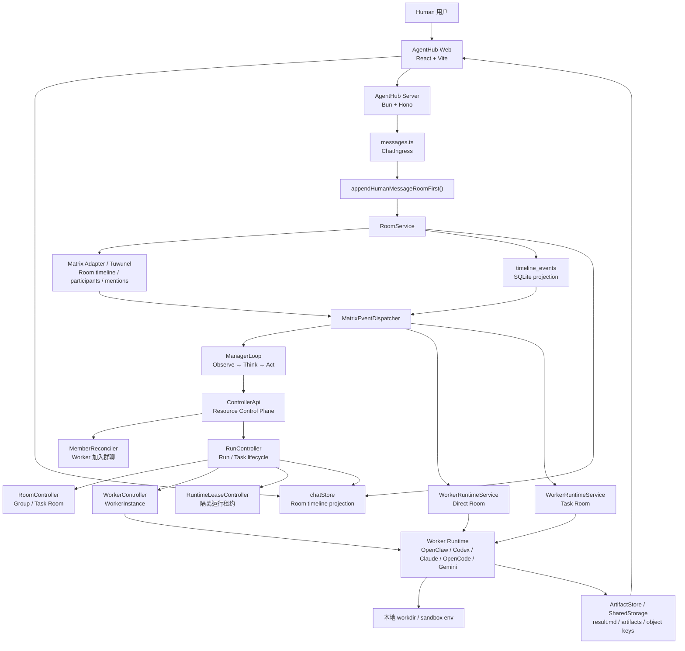
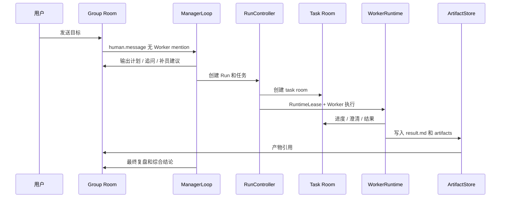

# AgentHub 技术文档

## 1. 技术目标

AgentHub 的技术目标是构建一个本地优先、Room-first、可执行的多 Agent 协作平台。系统不是让一个 LLM 在提示词里扮演多个人，而是把 Human、Manager、Worker、Room、Task、Run、Artifact 都资源化，让协作过程可观察、可恢复、可交付。

核心技术判断：

- 前端采用 React + Vite，提供 IM 式工作台。
- 后端采用 Bun + Hono，负责 Controller API、RoomService、Manager/Worker 调度和资源状态。
- 数据层采用 Drizzle + SQLite，本地优先，适合比赛 Demo 和单机开发。
- 通信层以 Matrix Room 语义为主，支持 Tuwunel 本地 homeserver。
- 执行层支持 OpenClaw Manager / Worker，以及 Codex CLI、Claude Code、OpenCode、Gemini CLI 等 Code Agent bridge。
- 存储层默认本地 filesystem，按 S3-compatible object key 语义设计，后续可切 MinIO/S3。

代码依据：

- 应用入口：`apps/server/src/index.ts`
- 前端入口：`apps/web/src/pages/ChatPage.tsx`
- 后端路由：`apps/server/src/routes/`
- Room 服务：`apps/server/src/services/rooms/`
- Manager / Run / Worker：`apps/server/src/services/orchestrator/`
- Worker Runtime：`apps/server/src/services/worker-runtime/`
- Controller Plane：`apps/server/src/services/controller-plane/`
- DB schema：`packages/db/src/schema.ts`

## 2. 总体架构图



这张图可以作为比赛文档中的架构截图来源。

同时已提供独立架构图文件：`docs/比赛提交/AgentHub-架构图.svg`，可直接插入产品文档、PPT 或截图给评委。

## 3. 前端架构

### 3.1 页面结构

前端主入口是 `ChatPage`。它根据 URL 中是否存在 `sessionId` 决定展示首页 Welcome，还是进入 Thread 聊天界面。

代码依据：`apps/web/src/pages/ChatPage.tsx`

关键职责：

- 初始化 WebSocket。
- 根据路由选择 session。
- 渲染左侧 SessionList。
- 渲染欢迎页或 Thread。
- 提供全局 workspace sidecar。

### 3.2 会话树与导航

`SessionList` 负责左侧会话树：

- Manager 私聊
- Worker 私聊
- Project 群聊
- 群聊下的 orchestrator-task 子对话

它同时提供 dock 栏、搜索、归档、删除、专家配置入口和移动端扫码入口。

代码依据：

- `apps/web/src/components/chat/SessionList.tsx`
- `apps/web/src/lib/sessionTree.ts`

### 3.3 Thread 与运行态展示

`Thread` 是主聊天界面，负责根据当前 session 类型展示不同 header、任务看板、子对话入口、产物预览和上下文侧栏。

代码依据：`apps/web/src/components/assistant-ui/Thread.tsx`

关键状态来源：

- `messages`
- `taskBoard`
- `agentActivity`
- `agentTabs`
- `streamingCodeAgentRun`

这些状态由 `chatStore` 从 Room timeline、Run snapshot、AG-UI events 和 WebSocket 事件投影出来。

### 3.4 Runtime Provider

`AgentHubRuntimeProvider` 把 AgentHub 自己的 store 状态转换为 assistant-ui runtime，让聊天 UI 可以显示历史消息、流式消息、运行中状态，并把用户输入发送回 `chatStore.sendMessage()`。

代码依据：`apps/web/src/lib/runtime.tsx`

## 4. 后端架构

### 4.1 ChatIngress：messages.ts

`apps/server/src/routes/messages.ts` 是聊天入口，但它不再承担复杂编排。它的核心职责是：

1. 鉴权和校验 session。
2. 接收用户消息。
3. 调用 `appendHumanMessageRoomFirst()` 写入 Room timeline。
4. 返回 timeline 投影消息。

设计重点：`messages.ts` 是 ChatIngress，不是编排主脑。

### 4.2 Room-first 写入

`appendHumanMessageRoomFirst()` 位于 `apps/server/src/services/rooms/room-chat-bridge.ts`。

它做几件关键事情：

- 确保 session 对应 room 存在。
- 确保 Human / Manager / Worker participants 存在。
- 解析 `@Agent` mention。
- 把 human message 写成 `human.message` timeline event。
- 通过 `RoomService.appendTimelineEvent()` 触发后续 dispatch。

这意味着新消息的事实源是 Room timeline，而不是旧 `messages` 表。

### 4.3 MatrixEventDispatcher

`MatrixEventDispatcher` 是 Room event 的调度入口。

代码依据：`apps/server/src/services/rooms/matrix-event-dispatcher.ts`

核心路由规则：

- group room 中的人类消息，如果没有具体 Worker mention，则进入 ManagerLoop。
- group room 中 `@Worker`，会转发到对应 Worker / task room。
- direct room 中的人类消息，如果是普通 Worker，则进入 WorkerRuntimeService。
- task room 中的人类消息，用于澄清后 resume。
- `/stop`、`/approve`、`/deny`、文件事件等也在这里进入控制面。

## 5. Manager / Worker 协作逻辑

### 5.1 ManagerLoop

ManagerLoop 位于 `apps/server/src/services/orchestrator/manager-loop.ts`。它负责 HiClaw-style 的 Observe → Think → Act 循环：

1. 观察 group room timeline、运行状态、任务结果和用户输入。
2. 调用 Manager runtime 做决策。
3. 根据决策直接回复、追问、提出补员、拆任务、派活或最终复盘。
4. 把 Manager 输出写回 group room timeline。

Manager 不是一次性 Planner。Planner 只是 Manager 可调用的一种能力，Manager 本身负责整个运行周期。

### 5.2 WorkerRuntimeService

WorkerRuntimeService 位于 `apps/server/src/services/worker-runtime/worker-runtime-service.ts`。

它支持三种主要执行路径：

- direct room：用户和单个 Worker 私聊。
- task room：Manager 分配任务后，Worker 在任务子对话执行。
- group mention：群聊中直接 `@Worker` 时的执行。

执行时会结合 RuntimeLease 提供隔离环境变量，例如 `HOME`、`XDG_CONFIG_HOME`、`CODEX_HOME`、`TMPDIR` 等，避免不同 Worker 的 CLI 配置和缓存互相污染。

### 5.3 Worker 状态机

WorkerInstance 采用 HiClaw 风格状态：

```text
provisioning -> ready -> listening -> assigned -> busy -> waiting_for_human
             -> resuming -> idle -> sleeping -> stopped / failed
```

代码依据：

- `apps/server/src/services/orchestrator/worker-controller.ts`
- `apps/server/src/services/worker-runtime/worker-runtime-service.ts`

## 6. Controller Plane

Controller Plane 位于 `apps/server/src/services/controller-plane/`，它是 Manager skill 和后续 CLI/API 操作资源的统一门面。

核心模块：

- `controller-api.ts`：统一控制面 API。
- `member-reconciler.ts`：创建或加入 Worker 的五阶段入口。
- `reconcile-queue.ts`：资源 reconcile 请求队列。
- `worker-backend.ts`：本地 CLI、Docker、OpenClaw resident Worker 的后端抽象。

设计目的：Manager Runtime 不直接操作底层 service，而是通过 Controller API 提交资源意图，由 Controller 负责真实 reconcile。

## 7. Run / Task / RuntimeLease 生命周期

### 7.1 RunController

`RunController` 位于 `apps/server/src/services/orchestrator/run-controller.ts`，负责 run、task、task thread、runtime lease 的状态推进。

它不是模型推理模块，而是资源生命周期控制器：

- start run
- dispatch plan
- mark task running / completed / failed / cancelled
- reconcile run snapshot
- requeue unfinished tasks
- final review 状态收口

### 7.2 RuntimeLeaseController

`RuntimeLeaseController` 位于 `apps/server/src/services/orchestrator/runtime-lease-controller.ts`。

它负责每次 Worker 执行的隔离运行租约：

- create
- markReady
- markRunning
- markWaitingForHuman
- release
- fail
- stale recovery

Worker 执行不是裸跑进程，而是通过 RuntimeLease 记录运行环境和生命周期。

## 8. Matrix / Room-first 设计

### 8.1 为什么使用 Room-first

传统聊天系统通常把消息表作为事实源；AgentHub 改成 Room-first，是因为多 Agent 协作中需要记录的不只是消息，还有：

- 参与者身份
- mention
- task assigned
- task progress
- file / artifact event
- approval / deny
- stop / cancel
- Manager final review

这些更接近“协作房间事件流”，因此 Room timeline 更适合成为事实源。

### 8.2 Room 类型

代码中 Room kind 包括：

- `group`：主群聊。
- `manager_dm`：Manager 私聊。
- `direct`：Worker 私聊。
- `task`：任务子对话。
- `human_intervention`：人工介入。

代码依据：`apps/server/src/services/rooms/types.ts`

### 8.3 Matrix Adapter

RoomService 可以对接 MatrixRoomAdapter。真实 Matrix 环境默认使用 Tuwunel，开发和比赛 Demo 可通过 Docker Compose 启动。

相关代码：

- `apps/server/src/services/rooms/matrix-room-adapter.ts`
- `apps/server/src/services/rooms/matrix-runtime-listener.ts`
- `apps/server/src/services/rooms/matrix-runtime-supervisor.ts`
- `infra/docker-compose.hiclaw-lite.yml`

## 9. 任务与产物流转

### 9.1 任务流转



### 9.2 共享任务目录

任务执行会围绕共享任务目录组织：

```text
.agenthub/shared/tasks/{taskId}/
  meta.json
  spec.md
  plan.md
  result.md
  artifacts/
```

这个契约让不同 Worker 之间可以交接，也让 Manager final review 可以基于真实产物汇总，而不是只看聊天文本。

相关代码：

- `apps/server/src/services/orchestrator/shared-task-directory.ts`
- `apps/server/src/services/orchestrator/shared-storage.ts`
- `apps/server/src/services/orchestrator/artifact-store.ts`
- `apps/server/src/services/orchestrator/artifact-controller.ts`

## 10. 数据模型

核心资源：

- `sessions`：direct / group 会话。
- `rooms`：Room 资源。
- `roomParticipants`：Human / Manager / Worker 参与者。
- `timelineEvents`：Room timeline 事件。
- `orchestratorRuns`：一次 Manager 协作运行。
- `workspaceTasks`：任务资源。
- `taskThreads`：任务子对话。
- `workerInstances`：Worker 运行实体。
- `runtimeLeases`：执行租约。
- `artifacts`：产物记录。

代码依据：`packages/db/src/schema.ts`

## 11. 如何运行 Demo

### 11.1 安装依赖

```bash
bun install
```

### 11.2 配置环境变量

复制环境变量示例：

```bash
cp .env.example .env
```

至少检查：

- `DATABASE_URL`
- `LLM_PROVIDER`
- `LLM_API_KEY`
- `LLM_BASE_URL`
- `LLM_MODEL`
- `AGENTHUB_ROOM_PROVIDER`
- `AGENTHUB_MATRIX_HOMESERVER_URL`
- `AGENTHUB_MATRIX_SERVER_NAME`
- `AGENTHUB_MATRIX_REGISTRATION_TOKEN`

### 11.3 启动基础设施

如果演示 Matrix / MinIO：

```bash
bun run infra:up
```

只启动 Matrix：

```bash
bun run matrix:up
```

### 11.4 启动开发服务

```bash
bun run dev
```

或分别启动：

```bash
bun run dev:server
bun run dev:web
```

### 11.5 检查质量

```bash
bun run typecheck
bun test
```

比赛前至少确保：

- 前端能打开 `http://localhost:5173/`
- 后端 API 正常
- 至少一个 Code Agent CLI 可用，推荐 Codex
- Matrix / Tuwunel 状态正常
- 准备干净的本地测试 workspace

## 12. 推荐 Demo 脚本

### 12.1 主线脚本

输入：

```text
帮我做一个带表单验证的登录页，并输出实现说明。
```

演示点：

1. 首页输入目标，不指定 Agent。
2. 系统自动进入 Manager group。
3. Manager 输出理解和计划。
4. 任务看板出现。
5. Worker 子对话执行。
6. 产物卡 / 代码预览出现。
7. Manager 最终汇总。

### 12.2 指定 Worker 脚本

输入：

```text
@Codex 给登录页面加上记住密码功能。
```

演示点：

1. `@Worker` mention 进入具体 Worker。
2. Worker 执行代码任务。
3. 展示 diff / 文件产物。

### 12.3 产物型脚本

输入：

```text
帮我整理一份 AI 工作台竞品分析，并输出表格和总结文档。
```

演示点：

1. Manager 拆分调研、分析、写作任务。
2. Worker 分别执行。
3. 主群聊展示产物和最终结论。

## 13. 代码证据索引

| 能力 | 代码位置 |
| --- | --- |
| 首页工作台 | `apps/web/src/pages/ChatPage.tsx` |
| 会话树 / dock / 群聊子会话 | `apps/web/src/components/chat/SessionList.tsx` |
| 聊天主界面 / 任务看板 / 产物预览 | `apps/web/src/components/assistant-ui/Thread.tsx` |
| 前端状态与 Room projection | `apps/web/src/stores/chatStore.ts` |
| Assistant UI runtime bridge | `apps/web/src/lib/runtime.tsx` |
| 消息入口 | `apps/server/src/routes/messages.ts` |
| Room-first 消息桥 | `apps/server/src/services/rooms/room-chat-bridge.ts` |
| RoomService | `apps/server/src/services/rooms/room-service.ts` |
| Matrix Adapter | `apps/server/src/services/rooms/matrix-room-adapter.ts` |
| Matrix event dispatch | `apps/server/src/services/rooms/matrix-event-dispatcher.ts` |
| ManagerLoop | `apps/server/src/services/orchestrator/manager-loop.ts` |
| RunController | `apps/server/src/services/orchestrator/run-controller.ts` |
| WorkerController | `apps/server/src/services/orchestrator/worker-controller.ts` |
| RuntimeLeaseController | `apps/server/src/services/orchestrator/runtime-lease-controller.ts` |
| WorkerRuntimeService | `apps/server/src/services/worker-runtime/worker-runtime-service.ts` |
| ControllerApi | `apps/server/src/services/controller-plane/controller-api.ts` |
| MemberReconciler | `apps/server/src/services/controller-plane/member-reconciler.ts` |
| ArtifactStore | `apps/server/src/services/orchestrator/artifact-store.ts` |
| DB schema | `packages/db/src/schema.ts` |

## 14. 当前限制与后续路线

当前版本适合比赛 Demo 和本地验证，但仍处于 alpha：

- Matrix / Tuwunel、OpenClaw resident runtime、MinIO/S3 adapter 仍在持续打磨。
- Agent 专家市场、完整 Eval / Trace、云端部署不是当前比赛主交付。
- Worker runtime 的差异仍由 adapter 兼容，后续应进一步统一 Agent contract。
- 多人在线协作、权限和企业级凭证治理可作为下一阶段路线。

建议比赛表达：AgentHub 已经跑通“用户目标 -> Manager 决策 -> Worker 执行 -> Room timeline -> 任务看板 -> 产物交付”的核心闭环，后续将继续向 Coze 风格开源 AI 工作平台扩展。
