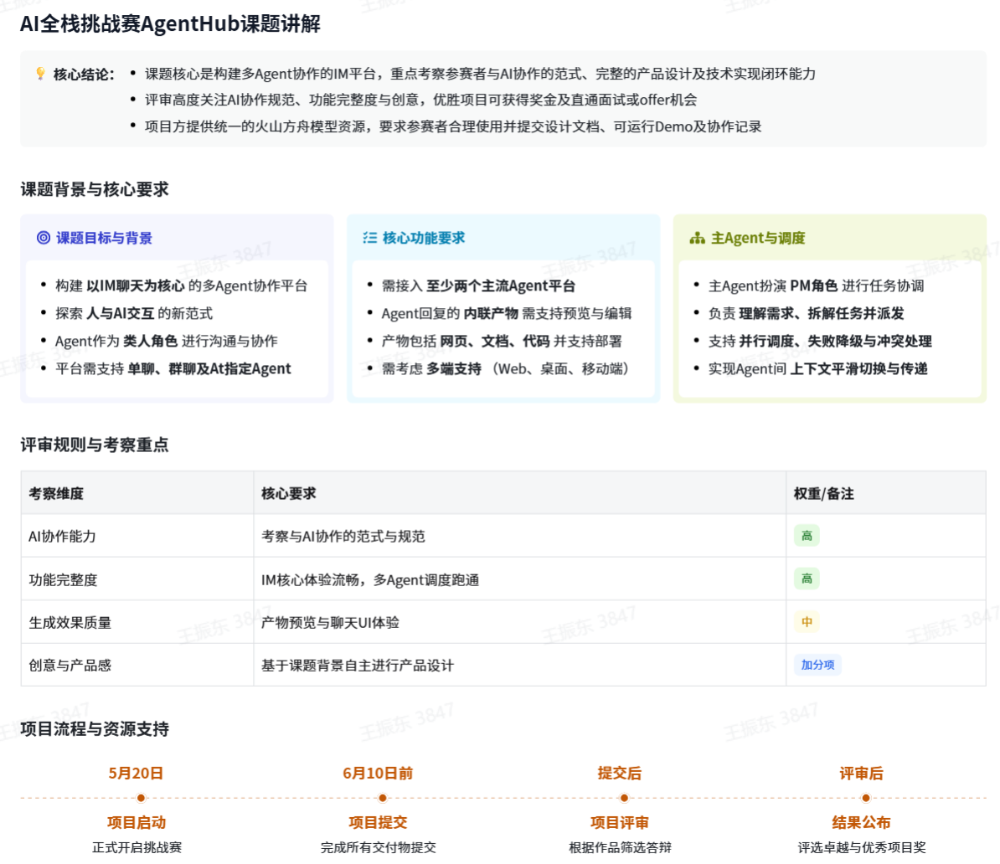
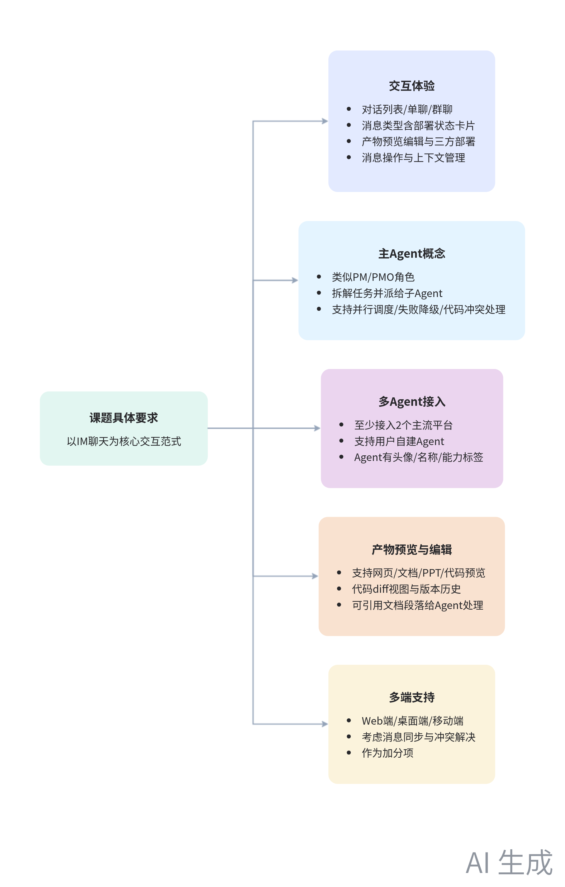
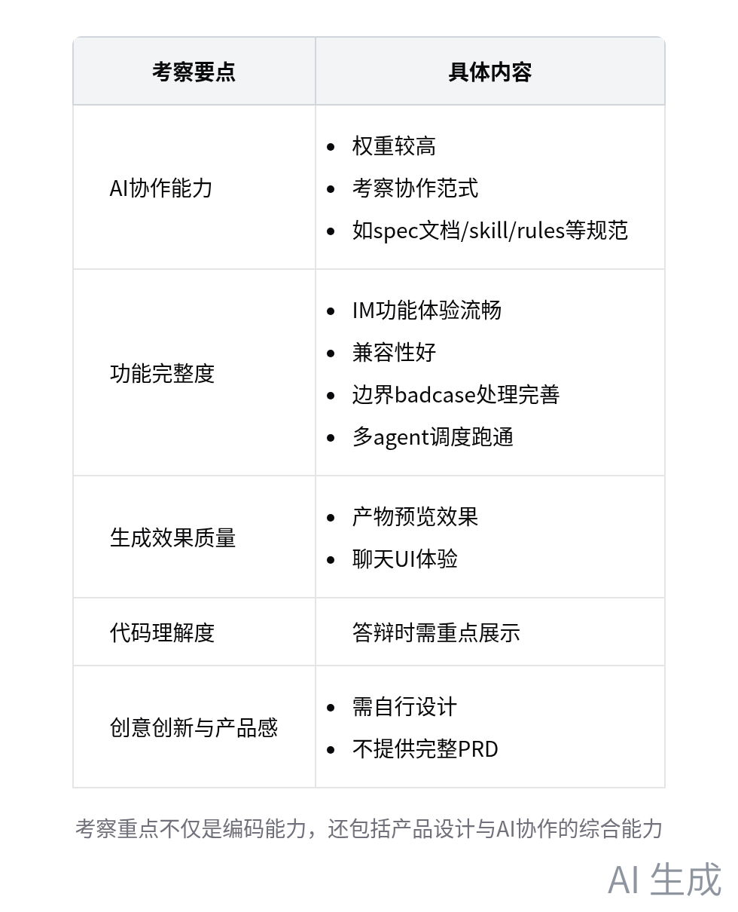

会议主题：【AgentHub-多agent协作平台】课题讲解

# 总结

本次会议是 AI 全栈挑战赛的课题讲解会，支持 coze 团队的招聘 HR 夏丹伦主持，三位导师强顺亮、郝震斐、杨梓航及项目组成员王世达介绍项目流程、部门情况、课题要求、评审规则和奖励设置等内容，解答参会者疑问，内容如下：

- 项目流程安排
  - 时间节点：项目于 5 月 20 日正式启动，6 月 10 日前完成所有项目提交，相关信息以官网为准。
  - 环节介绍：一是介绍项目整体时间线流程；二是介绍部门和导师，三位导师分别是强顺亮、郝震斐和杨梓航，强顺亮将介绍 COSE 整体部门情况；三是课题讲解，由郝震斐和杨梓航负责，讲解课题要求、标准和评审规则。
- 部门与导师介绍
  - 扣子部门介绍：扣子部门是新一代 AI agent 平台，服务数百万开发者和企业，覆盖客服、金融、教育等行业。平台有两大功能，一是登录扣子点 cn 可使用智能助理解决办公、学习和职场问题；二是扣子编程，开发者可通过一句话想法开发 AI 应用，不懂代码也能一键部署。
  - 导师情况：三位导师均来自扣子核心业务，强顺亮介绍扣子部门情况，郝震斐和杨梓航后续讲解课题。
- 课题讲解
  - 课题背景与目标：构建人和 AI 协作平台，以 IM 聊天为核心交互范式，不限制功能交互内容，鼓励融入设计思想和 AI 协作理念，更好地指挥多 Agent 开发。
- 课题具体要求
  - 交互体验：提供对话列表、单聊模式、群聊模式等，消息类型包括部署状态卡片，支持产物预览、编辑、二次交互和部署到三方平台，具备消息操作和上下文管理功能。
  - 主 Agent 概念：主 Agent 类似 PM 或 PMO 角色，作为协调器理解用户问题，拆解复杂任务并派给子 Agent，支持并行调度、失败降级和代码冲突处理。
  - 多 Agent 接入：至少接入两个主流 Agent 平台，如 Cloud Code、Codex 或 Open Code，支持用户自建 Agent，每个 Agent 在聊天列表有联系人头像、名称和能力标签。
  - 产物预览与编辑：支持 agent 回复中内联产物的预览和编辑，包括网页、文档渲染、PPT 浏览、代码编辑等，支持代码 diff 视图、版本历史，可引用文档段落并交给 agent 处理。
  - 多端支持：作为加分项，预期支持 Web 端、桌面端和移动端平台及产物，需考虑多人协作和多端消息同步、冲突解决等问题。

    考察要点
  * AI 协作能力：权重较高，考察与 AI 协作的范式，如协作过程中产出的 spec 文档、skill 和 rules 等协作规范。
  * 功能完整度：体现在 IM 功能体验流畅、兼容性好、边界 badcase 处理完善、多 agent 调度跑通。
  * 生成效果质量：包括产物预览、聊天 UI 体验等。
  * 代码理解度：答辩时需注意。
  * 创意创新与产品感：根据自身能力进行设计，不提供完整 PRD。
   
  * 交付产物：包括产品设计文档、技术文档、可运行的 Demo、AI 协作开发记录（如 Specs、Skill、Rules 等协作规范）和 3 分钟的 Demo 视频。
- 资源与奖励说明
  - 资源提供：项目方提供火山方舟（类似字节跳动 seed 2.0）模型版本的 Tokens，所有课题同学共用一个 API 账号，会提供 API key 和 IDE 环境部署操作手册。需注意资源有限，仅用于项目，避免外泄。
  - 奖励设置
    - 奖项设置：设置卓越项目奖，奖金 2 万元；优秀项目奖数量预估小于等于 10。
    - 面试机会：表现优秀者有直通 offer、直通终面、直通面试机会，表现一般但优秀的可适当增加 1 - 2 轮面试。
- 问题解答
  - AI 协作记录：不限形式，可沉淀个人或团队与 AI 的协作方式，如 spec、skill、rules 等规范，不要求对话记录，希望仓库是 agent 友好的。
  - 开发日志：指与 AI 协作的文档类型产物，如控制 AI 或给 AI 的 harness、spec 的 skill 等规范。
  - 指定 Agent：可引入 Cloud Code 作为编写代码或完成任务的 Agent，也可新建自定义 Agent。
  - 多端支持：作为加分项，各端功能有区分，需考虑多人协作和多端消息同步、冲突解决等问题。
  - 开发语言：没有要求。
  - 展示形式：最终展示大概率以答辩形式进行，优先选择作品呈现和标准较好的同学，交付物差的同学可能不安排答辩。
  - 基于已有项目开发：不限制，但最终考察代码、功能设计和产品设计文档是否对应，是否有自己的思考和完整闭环流程。

